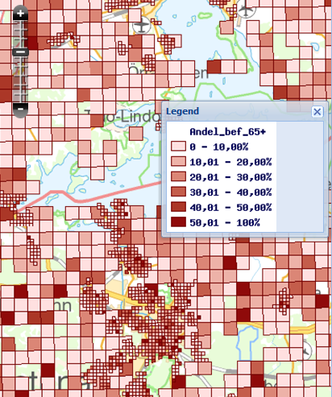

// Admonition icons:
// IR Requirement
:important-caption: 📕
// TG Requirement
:tip-caption: 📒
// Recommendation
:note-caption: 📘

// TOC placement using macro (manual)
:toc: macro

// Empty TOC title (the title is in the document)
:toc-title:

// TOC level depth
:toclevels: 3

// Section numbering level depth
:sectnumlevels: 8

// Line Break Doc Title
:hardbreaks-option:

:appendix-caption: Annex

// Document properties
:title: D2.8.III.1 Data Specification on Statistical Units – Technical Guidelines
:revdate: 2023-07-31
:keywords: INSPIRE Data Specification for the spatial data theme Statistical Units
:producer: INSPIRE Maintenance and Implementation Group (MIG)
:description: This document describes the INSPIRE Data Specification for the spatial data theme Statistical Units
:author: Temporary MIWP 2021-2024 sub-group 2.3.1
:copyright: Public
:revremark: https://github.com/INSPIRE-MIF/technical-guidelines/releases/tag/v2023.2
:lang: en

image:./media/image2.jpeg[image,width=131,height=90, align=center]

image:./media/image3.png[image,width=93,height=93, align=center] **INSPIRE** *Infrastructure for Spatial Information in Europe*

[discrete]
= D2.8.III.1 Data Specification on _Statistical Units_ – Technical Guidelines

[width="100%",cols="17%,83%",]
|===
|*Title* |{doctitle}
|*Creator* |{author}
|*Date of publication* |{revdate}
|*Subject* |{keywords}
|*Publisher* |{producer}
|*Type* |Text
|*Description* |{description}
|*Format* |AsciiDoc
|*Licence* |https://creativecommons.org/licenses/by/4.0[Creative Commons Attribution (cc-by) 4.0]
|*Rights* |{copyright}
|*Identifier* |https://inspire.ec.europa.eu/id/document/tg/su[D2.8.III.1_v3.1.0]
|*Changelog* |{revremark}
|*Language* |{lang}
|*Relation* |Directive 2007/2/EC of the European Parliament and of the Council of 14 March 2007 establishing an Infrastructure for Spatial Information in the European Community (INSPIRE)
|===

<<<
[discrete]
== Foreword
[discrete]
== How to read the document?

This document describes the _"INSPIRE data specification on Statistical Units – Technical Guidelines"_ version 3.0 as developed by the Thematic Working Group (TWG) _SU-PD_ using both natural and a conceptual schema language.

The data specification is based on a common templatefootnote:[The common document template is available in the "Framework documents" section of the data specifications web page at http://inspire.jrc.ec.europa.eu/index.cfm/pageid/2] used for all data specifications, which has been harmonised using the experience from the development of the Annex I, II and III data specifications.

This document provides guidelines for the implementation of the provisions laid down in the draft Implementing Rule for spatial data sets and services of the INSPIRE Directive. It also includes additional requirements and recommendations that, although not included in the Implementing Rule, are relevant to guarantee or to increase data interoperability.

Two executive summaries provide a quick overview of the INSPIRE data specification process in general, and the content of the data specification on _Statistical Units_ in particular. We highly recommend that managers, decision makers, and all those new to the INSPIRE process and/or information modelling should read these executive summaries first.

The UML diagrams (in Chapter 5) offer a rapid way to see the main elements of the specifications and their relationships. The definition of the spatial object types, attributes, and relationships are included in the Feature Catalogue (also in Chapter 5). People having thematic expertise but not familiar with UML can fully understand the content of the data model focusing on the Feature Catalogue. Users might also find the Feature Catalogue especially useful to check if it contains the data necessary for the applications that they run. The technical details are expected to be of prime interest to those organisations that are responsible for implementing INSPIRE within the field of _Statistical Units_, but also to other stakeholders and users of the spatial data infrastructure.

The technical provisions and the underlying concepts are often illustrated by examples. Smaller examples are within the text of the specification, while longer explanatory examples and descriptions of selected use cases are attached in the annexes.

In order to distinguish the INSPIRE spatial data themes from the spatial object types, the INSPIRE spatial data themes are written in _italics._

|===
|The document will be publicly available as a 'non-paper'. It does not represent an official position of the European Commission, and as such cannot be invoked in the context of legal procedures.
|===

*Legal Notice*

Neither the European Commission nor any person acting on behalf of the Commission is responsible for the use which might be made of this publication.

<<<
[discrete]
== Interoperability of Spatial Data Sets and Services – General Executive Summary

The challenges regarding the lack of availability, quality, organisation, accessibility, and sharing of spatial information are common to a large number of policies and activities and are experienced across the various levels of public authority in Europe. In order to solve these problems it is necessary to take measures of coordination between the users and providers of spatial information. The Directive 2007/2/EC of the European Parliament and of the Council adopted on 14 March 2007 aims at establishing an Infrastructure for Spatial Information in the European Community (INSPIRE) for environmental policies, or policies and activities that have an impact on the environment.

INSPIRE is based on the infrastructures for spatial information that are created and maintained by the Member States. To support the establishment of a European infrastructure, Implementing Rules addressing the following components of the infrastructure have been specified: metadata, interoperability of spatial data sets (as described in Annexes I, II, III of the Directive) and spatial data services, network services, data and service sharing, and monitoring and reporting procedures.

INSPIRE does not require collection of new data. However, after the period specified in the Directivefootnote:[For all 34 Annex I,II and III data themes: within two years of the adoption of the corresponding Implementing Rules for newly collected and extensively restructured data and within 5 years for other data in electronic format still in use] Member States have to make their data available according to the Implementing Rules.

Interoperability in INSPIRE means the possibility to combine spatial data and services from different sources across the European Community in a consistent way without involving specific efforts of humans or machines. It is important to note that "interoperability" is understood as providing access to spatial data sets through network services, typically via Internet. Interoperability may be achieved by either changing (harmonising) and storing existing data sets or transforming them via services for publication in the INSPIRE infrastructure. It is expected that users will spend less time and efforts on understanding and integrating data when they build their applications based on data delivered in accordance with INSPIRE.

In order to benefit from the endeavours of international standardisation bodies and organisations established under international law their standards and technical means have been utilised and referenced, whenever possible.

To facilitate the implementation of INSPIRE, it is important that all stakeholders have the opportunity to participate in specification and development. For this reason, the Commission has put in place a consensus building process involving data users, and providers together with representatives of industry, research and government. These stakeholders, organised through Spatial Data Interest Communities (SDIC) and Legally Mandated Organisations (LMO)footnote:[The current status of registered SDICs/LMOs is available via INSPIRE website: http://inspire.jrc.ec.europa.eu/index.cfm/pageid/42], have provided reference materials, participated in the user requirement and technicalfootnote:[Surveys on unique identifiers and usage of the elements of the spatial and temporal schema,] surveys, proposed experts for the Data Specification Drafting Teamfootnote:[The Data Specification Drafting Team has been composed of experts from Austria, Belgium, Czech Republic, France, Germany, Greece, Italy, Netherlands, Norway, Poland, Switzerland, UK, and the European Environment Agency], the Thematic Working Groupsfootnote:[The Thematic Working Groups of Annex II and III themes have been composed of experts from Austria, Belgium, Bulgaria, Czech Republic, Denmark, Finland, France, Germany, Hungary, Ireland, Italy, Latvia, Netherlands, Norway, Poland, Romania, Slovakia, Spain, Sweden, Switzerland, Turkey, UK, the European Commission, and the European Environment Agency] and other ad-hoc cross-thematic technical groups and participated in the public stakeholder consultations on draft versions of the data specifications. These consultations covered expert reviews as well as feasibility and fitness-for-purpose testing of the data specificationsfootnote:[For Annex IIIII, the consultation and testing phase lasted from 20 June to 21 October 2011.].

This open and participatory approach was successfully used during the development of the data specifications on Annex I, II and III data themes as well as during the preparation of the Implementing Rule on Interoperability of Spatial Data Sets and Servicesfootnote:[Commission Regulation (EU) No 1089/2010 http://eur-lex.europa.eu/JOHtml.do?uri=OJ:L:2010:323:SOM:EN:HTML[implementing Directive 2007/2/EC of the European Parliament and of the Council as regards interoperability of spatial data sets and services,] published in the Official Journal of the European Union on 8^th^ of December 2010.] for Annex I spatial data themes and of its amendment regarding the themes of Annex II and III.

The development framework elaborated by the Data Specification Drafting Team aims at keeping the data specifications of the different themes coherent. It summarises the methodology to be used for the development of the data specifications, providing a coherent set of requirements and recommendations to achieve interoperability. The pillars of the framework are the following technical documentsfootnote:[The framework documents are available in the "Framework documents" section of the data specifications web page at http://inspire.jrc.ec.europa.eu/index.cfm/pageid/2]:

* The _Definition of Annex Themes and Scope_ describes in greater detail the spatial data themes defined in the Directive, and thus provides a sound starting point for the thematic aspects of the data specification development.
* The _Generic Conceptual Model_ defines the elements necessary for interoperability and data harmonisation including cross-theme issues. It specifies requirements and recommendations with regard to data specification elements of common use, like the spatial and temporal schema, unique identifier management, object referencing, some common code lists, etc. Those requirements of the Generic Conceptual Model that are directly implementable are included in the Implementing Rule on Interoperability of Spatial Data Sets and Services.
* The _Methodology for the Development of Data Specifications_ defines a repeatable methodology. It describes how to arrive from user requirements to a data specification through a number of steps including use-case development, initial specification development and analysis of analogies and gaps for further specification refinement.
* The _Guidelines for the Encoding of Spatial Data_ defines how geographic information can be encoded to enable transfer processes between the systems of the data providers in the Member States. Even though it does not specify a mandatory encoding rule it sets GML (ISO 19136) as the default encoding for INSPIRE.
* The _Guidelines for the use of Observations & Measurements and Sensor Web Enablement-related standards in INSPIRE Annex II and III data specification development_ provides guidelines on how the "Observations and Measurements" standard (ISO 19156) is to be used within INSPIRE.
* The _Common data models_ are a set of documents that specify data models that are referenced by a number of different data specifications. These documents include generic data models for networks, coverages and activity complexes.

The structure of the data specifications is based on the "ISO 19131 Geographic information - Data product specifications" standard. They include the technical documentation of the application schema, the spatial object types with their properties, and other specifics of the spatial data themes using natural language as well as a formal conceptual schema languagefootnote:[UML – Unified Modelling Language].

A consolidated model repository, feature concept dictionary, and glossary are being maintained to support the consistent specification development and potential further reuse of specification elements. The consolidated model consists of the harmonised models of the relevant standards from the ISO 19100 series, the INSPIRE Generic Conceptual Model, and the application schemasfootnote:[Conceptual models related to specific areas (e.g. INSPIRE themes)] developed for each spatial data theme. The multilingual INSPIRE Feature Concept Dictionary contains the definition and description of the INSPIRE themes together with the definition of the spatial object types present in the specification. The INSPIRE Glossary defines all the terms (beyond the spatial object types) necessary for understanding the INSPIRE documentation including the terminology of other components (metadata, network services, data sharing, and monitoring).

By listing a number of requirements and making the necessary recommendations, the data specifications enable full system interoperability across the Member States, within the scope of the application areas targeted by the Directive. The data specifications (in their version 3.0) are published as technical guidelines and provide the basis for the content of the Implementing Rule on Interoperability of Spatial Data Sets and Servicesfootnote:[In the case of the Annex IIIII data specifications, the extracted requirements are used to formulate an amendment to the existing Implementing Rule.]. The content of the Implementing Rule is extracted from the data specifications, considering short- and medium-term feasibility as well as cost-benefit considerations. The requirements included in the Implementing Rule are legally binding for the Member States according to the timeline specified in the INSPIRE Directive.

In addition to providing a basis for the interoperability of spatial data in INSPIRE, the data specification development framework and the thematic data specifications can be reused in other environments at local, regional, national and global level contributing to improvements in the coherence and interoperability of data in spatial data infrastructures.

[discrete]
== _Statistical Units_ – Executive Summary

Statistical units are defined as "units for dissemination or use of statistical information". This document presents data specifications for statistical units. It is based on the following principles:

*Separation between statistical data and statistical units*

A statistical data is defined as "any numerical representation of a phenomenon". A statistical unit informs on the statistical data location. This document addresses only the statistical unit specification (the specification of statistical data is out of the scope). The principle is to provide stable and identified representations of the statistical units – and statistical data refers to these objects through their identifier. Some recommendations are provided on how to give stable identifiers to statistical unit and use these identifiers to attach statistical information on them. This is particularly important if the responsibility for geometry and statistical data are shared between different institutions e.g. mapping agency and statistical offices. Other INSPIRE data specifications such as Population Distribution use this referencing mechanism.

Linking statistical data to spatial object is not only linking a database object to another one. The challenge is to improve the interaction between the statistics and the GIS worlds. This document recommendations aim at improving the integration of spatial and statistical analyses.

*Genericity*

There are many different kinds of statistical units: Census districts, management zones, environmental reporting units, etc. This document does not intend to provide specifications for all these statistical units. Common characteristics have been extracted and represented into a generic data model.

*Statistical units as vector geometries and grid cells*

Statistical units are usually represented as:

* Vector geometries (points, lines, surfaces), mainly surfaces. Area statistical units usually compose a tessellation (a tessellation is a collection of surfaces that cover a part of the geographical space with no overlaps and no gaps, see definition in section 2.4)
* Grid cells.

This document provides recommendations for representation of these kinds of statistical units.

*Hierarchical relations between statistical units*

Some statistical units are organised into a hierarchical structure: Some statistical units compose other ones at a higher level. Recommendations are provided to represent such structures.

*Multi scale representation*

Statistical units have several representations at different scales. To disseminate statistical data at the European scale, simplified representations of the statistical units are required. To fulfil this requirement, this document specifies how different representations of statistical units can be specified.

*Evolution of statistical units*

There are specific requirements regarding the evolution of statistical units. Some units can be changed, deleted, created, aggregated or split. Many use cases of statistical units concern the evolution of statistical data across space and time. This document specifies how to represent different states and evolutions of statistical units.

<<<
[discrete]
== Acknowledgements

Many individuals and organisations have contributed to the development of these Guidelines.

The Thematic Working Group on Statistical Units and Population Distribution (TWG-SU-PD) included:

Alina Kmiecik (TWG Facilitator until 15/12/2010) and Udo Maack (TWG Facilitator from 15/12/2010), Pieter Bresters, Ian Coady, Marie Haldorson, Jean-Luc Lipatz, Miroslaw Migacz, Susanne Schnorr-Baecker, Julien Gaffuri (TWG Editor and European Commission contact point).

Contributors:
From Eurostat: Beatrice Eiselt, Ekkehard Petri and Daniele Rizzi
From CBS (NL): Niek van Leeuwen, Olav ten Bosch

Participants on GISCO / Geostat meetings:
Hugo Poelmann (DG Regio) – Requirements for Change Information
Ingrid Kaminger (Statistic Austria) – User Survey according Grids
Marjan van Herwijnen (ESPON-Coordination Unit) - Requirements for Change Information

Other contributors to the INSPIRE data specifications are the Drafting Team Data Specifications, the JRC Data Specifications Team and the INSPIRE stakeholders - Spatial Data Interested Communities (SDICs) and Legally Mandated Organisations (LMOs).

*Contact information*

Maria Vanda Nunes de Lima
European Commission Joint Research Centre
Institute for Environment and Sustainability
Unit H06: Digital Earth and Reference Data
TP262, Via Fermi 2749
I-21027 Ispra (VA)
ITALY
E-mail: vanda.lima@jrc.ec.europa.eu
Tel.: 39-0332-7865052
Fax: 39-0332-7866325
http://ies.jrc.ec.europa.eu/
http://ec.europa.eu/dgs/jrc/
http://inspire.jrc.ec.europa.eu/

<<<
[discrete]
= Table of Contents
toc::[]

:sectnums:
<<<
== Scope

This document specifies a harmonised data specification for the spatial data theme _Statistical Units_ as defined in Annex III of the INSPIRE Directive.

This data specification provides the basis for the drafting of Implementing Rules according to Article 7 (1) of the INSPIRE Directive [Directive 2007/2/EC]. The entire data specification is published as implementation guidelines accompanying these Implementing Rules.

<<<
== Overview

=== Name

INSPIRE data specification for the theme _Statistical Units_.

=== Informal description

*Definition:*

Units for dissemination or use of statistical information. [Directive 2007/2/EC]

*Description:*

A Statistical Unit (SU) is a spatial feature (Polygon, Line, Point or Grid cell) that can be used to attach statistical information. Statistical information can be defined as "any numerical representation of a phenomenon" like for example human population. It must concern information about a certain population not restricted to human population.

Statistical information is not considered as part of the statistical unit. It is a non-spatial thematic information, whose harmonisation is out of the scope of this document. For this information we refer to the specification of the INSPIRE theme _Population Distribution_. This document only focus on the representation of the spatial features used to attach any kind of statistical data.

All INSPIRE features can be seen as a statistical unit. For example, road traffic data can be attached to _RoadLink_ features of the _Road Transport Networks_ theme, and population data can be attached to _Building_ features of the _Building_ theme. Statistical units theme addresses the units that are not already addressed by other themes and that are usually used only for dissemination of statistical data.

Important characteristics of statistical units are:

* They may have a hierarchical structure (like NUTS1, 2 and 3).
* Their spatial extent can go from sub-local (smaller than municipalities/communities) level to country level.
* Their temporal extent differs per country. They can change in time, which makes time comparisons difficult.
* In many cases they are derived from administrative units, but other sources are also possible.

*Existing statistical units*

[.underline]#NUTS#

Since many years European regional statistics have been collected, compiled and disseminated on the basis of a common regional classification, called 'Nomenclature of territorial units for Statistics' (NUTS). At the top of the hierarchy there are the individual Member States of the EU and below the NUTS levels 1 to 3. In general, one or two NUTS levels match with existing national administrative units. NUTS units are therefore an important type of statistical unit. Clear rules for this classification system have been fixed in a legal framework (Regulation (EC) No 1059/2003).

[.underline]#LAU and Urban Audit#

The NUTS classification serves as a harmonised system for applications at European and regional level, while it does not preclude the existence of other subdivisions and classifications. At a more detailed level, there are the regional districts and municipalities used in European context. These are called Local Administrative Units (LAU) sometimes used in European legislation. Other examples of statistical units are the urban area's used in the Urban audit project, organized by Eurostat. Neither the LAU's nor the UA units are subject of the NUTS or any other European regulation; they are defined by gentlemen agreement.

[.underline]#Other local statistical units#

Within most municipalities additional territorial subdivisions exist which are used for municipal administration, statistical surveys (e.g. census districts, neighbourhoods) and other thematic specific purposes (e.g. transportation cells) and for which statistical data are provided. All these units are not harmonised over Europe and not regulated at the European level.

[.underline]#Sector specific statistical units#

Statistical units are also used for sector specific purposes (like for example civil security regions, jurisprudential areas or touristy regions). Such sector specific statistical units are considered out of scope as it may be an effort not worth wile to harmonise all these sector specific statistical units on the European level. As the data model is generic it is possible to use it also for sector specific purposes, but there is no obligation to provide such statistical units according to this data specification.

[.underline]#Grids#

In addition to these statistical units which are based on administrative or thematic lineation, abstract territorial division used as spatial reference for statistics, called grids, are also used. Grids are squares of different sizes oriented on the INSPIRE coordinate system, independent from any administrative or thematic boundaries.

[.underline]#*Uses of statistical units*#

Statistical units are needed within local to national governments, settlement, urban and regional development, health and education planning, school enrolment planning, risks assessment, etc. They are of major importance to integrated analysis for sectors and regions. Statistical units are necessary as geographical features also in environmental and social assessments, e.g. on estimates on exposure to pressures and on availability of services. Statistical units can be used as the geographical base for the research on nearly any phenomena.

Statistical units can be used for collecting data as well as for aggregating or presenting data (at different scales for different purposes, for instance: at different statistical NUTS levels). Likewise administrative units the statistical units can be used to geo-reference data from different statistical fields, like demography and social statistics, economy, environment and natural resources. Statistical unit are also used for risk analysis (e.g. flood risk), mainly in connection with population distribution.

Annex B describes some of these use cases.

[.underline]#*Relations with other themes*#

The datasets addressed in this theme may also be covered in other INSPIRE themes, either as overlapping geometry/objects, or as a needed geometry for thematic presentations. Statistical units can be used as a basis for joining, aggregation and presentation of maps for nearly any theme or sector-specific issue. Statistical units have links to Administrative units, Population distribution/demography, Area management/restriction/regulation zones and reporting units, Geographical grids and Human health and safety.

[.underline]#Relation with Geographical Grid Systems theme#

In this specification, Statistical Grids follow the principles laid down in sections 4 and 5 of the data specifications of the theme _Geographical Grid Systems_ from Annex I. Due to extended requirements the statistical grid definition had to be more flexible, especially additional grid sizes are needed for geo-statistical analysis on large scales in regions or towns. INSPIRE statistical grids form a geo-referencing framework for the theme Population distribution / Demography and all other themes where grids with fixed and unambiguously defined location of equal-area grid cells are needed. The requirements and recommendations regarding statistical grids are harmonized with the requirements for Coordinate reference systems [INSPIRE-DS-CRS].

Technically, grids for statistical data are predefined spatial reference structures composed of cells regular in area. Cells are usually squares based on a given coordinate reference system (different shapes e.g. hexagons are not used in the statistical community, only in some research projects). Approximately equal area grids are required for statistical mapping and analytical work. The statistical grid specification takes as far as possible into account the recommendations of the "first Workshop on European Reference Grids in Ispra, 27-29 October 2003.

|===
*Definition:*

Units for dissemination or use of statistical information.

*Description:*

Statistical unit informs on the location of statistical data and information. The principle of this theme is to provide stable and identified representations of the statistical units – and statistical data refers to these objects through their identifier. Recommendations are provided on how to give stable identifiers to statistical unit and use these identifiers to attach statistical information on them. This is particularly important if the responsibility for geometry and statistical data are shared between different institutions e.g. mapping agency and statistical offices. Other INSPIRE data specifications such as Population Distribution use this referencing mechanism.
|===

Entry in the INSPIRE registry: _http://inspire.ec.europa.eu/theme/su/_

=== Normative References

[Directive 2007/2/EC] Directive 2007/2/EC of the European Parliament and of the Council of 14 March 2007 establishing an Infrastructure for Spatial Information in the European Community (INSPIRE)

[ISO 19107] EN ISO 19107:2005, Geographic Information – Spatial Schema

[ISO 19113] EN ISO 19113:2005, Geographic Information – Quality principles

[ISO 19115] EN ISO 19115:2005, Geographic information – Metadata (ISO 19115:2003)

[ISO 19118] EN ISO 19118:2006, Geographic information – Encoding (ISO 19118:2005)

[ISO 19138] ISO/TS 19138:2006, Geographic Information – Data quality measures

[Regulation 1205/2008/EC] Regulation 1205/2008/EC implementing Directive 2007/2/EC of the European Parliament and of the Council as regards metadata

[ISO 3166-1] EN ISO 3166-1, English country names and code elements

[Regulation 1059/2003/EC] Regulation 1059/2003/EC on the establishment of a common classification of territorial units for statistics (NUTS)

[OGC 10-070r2] Georeferenced Table Joining Service Implementation Standard, OpenGIS standard

[OGC 09-110r3] Web Coverage Service 2.0 interface standard, OpenGIS standard

REGULATION (EC) No. 1059/2003 on the establishment of a common classification of territorial units for statistics (NUTS2003)

REGULATION (EC) No. 105/2007 Amending the Annexes to Regulation 1059/2007 (NUTS2006)

REGULATION (EC) No.   31/2011 Amending the Annexes to Regulation 1059/2007 (NUTS2010)

=== Terms and definitions

General terms and definitions helpful for understanding the INSPIRE data specification documents are defined in the INSPIRE Glossaryfootnote:[The INSPIRE Glossary is available from http://inspire-registry.jrc.ec.europa.eu/registers/GLOSSARY].

=== Symbols and abbreviations

[width="100%",cols="14%,86%"]
|===
|ATS |Abstract Test Suite
|EC |European Commission
|EEA |European Environmental Agency
|ETRS89 |European Terrestrial Reference System 1989
|ETRS89-LAEA |Lambert Azimuthal Equal Area
|EU |European Union
|EVRS |European Vertical Reference System
|GCM |INSPIRE Generic Conceptual Model
|GDAS |Geographic Data Attribute Set
|GML |Geography Markup Language
|INSPIRE |Infrastructure for Spatial Information in the European Community
|IR |Implementing Rule
|ISDSS |Interoperability of Spatial Data Sets and Services
|ISO |International Organization for Standardization
|ITRS |International Terrestrial Reference System
|LAT |Lowest Astronomical Tide
|LMO |Legally Mandated Organization
|NUTS |Nomenclature of Territorial Units for Statistics
|OGC |Open Geospatial Consortium
|SDIC |Spatial Data Interest Community
|SDMX |Statistical Data and Metadata eXchange
|TG |Technical Guidance
|TJS |Georeferenced Table Joining Service
|UML |Unified Modelling Language
|UTC |Coordinated Universal Time
|WCS |Web Coverage Service
|XML |EXtensible Markup Language
|===

=== How the Technical Guidelines map to the Implementing Rules

The schematic diagram in Figure 1 gives an overview of the relationships between the INSPIRE legal acts (the INSPIRE Directive and Implementing Rules) and the INSPIRE Technical Guidelines. The INSPIRE Directive and Implementing Rules include legally binding requirements that describe, usually on an abstract level, _what_ Member States must implement.

In contrast, the Technical Guidelines define _how_ Member States might implement the requirements included in the INSPIRE Implementing Rules. As such, they may include non-binding technical requirements that must be satisfied if a Member State data provider chooses to conform to the Technical Guidelines. Implementing these Technical Guidelines will maximise the interoperability of INSPIRE spatial data sets.

image::./media/image4.png[image,width=603,height=375, align=center]

[.text-center]
*Figure 1 - Relationship between INSPIRE Implementing Rules and Technical Guidelines*

==== Requirements

The purpose of these Technical Guidelines (Data specifications on _Statistical Units_) is to provide practical guidance for implementation that is guided by, and satisfies, the (legally binding) requirements included for the spatial data theme _Statistical Units_ in the Regulation (Implementing Rules) on interoperability of spatial data sets and services. These requirements are highlighted in this document as follows:

[IMPORTANT]
====
[.text-center]
*IR Requirement*
_Article / Annex / Section no._
*Title / Heading*

This style is used for requirements contained in the Implementing Rules on interoperability of spatial data sets and services (Commission Regulation (EU) No 1089/2010).
====

For each of these IR requirements, these Technical Guidelines contain additional explanations and examples.

NOTE The Abstract Test Suite (ATS) in Annex A contains conformance tests that directly check conformance with these IR requirements.

Furthermore, these Technical Guidelines may propose a specific technical implementation for satisfying an IR requirement. In such cases, these Technical Guidelines may contain additional technical requirements that need to be met in order to be conformant with the corresponding IR requirement _when using this proposed implementation_. These technical requirements are highlighted as follows:

[TIP]
====
*TG Requirement X* 

This style is used for requirements for a specific technical solution proposed in these Technical Guidelines for an IR requirement.
====

NOTE 1 Conformance of a data set with the TG requirement(s) included in the ATS implies conformance with the corresponding IR requirement(s).

NOTE 2 In addition to the requirements included in the Implementing Rules on interoperability of spatial data sets and services, the INSPIRE Directive includes further legally binding obligations that put additional requirements on data providers. For example, Art. 10(2) requires that Member States shall, where appropriate, decide by mutual consent on the depiction and position of geographical features whose location spans the frontier between two or more Member States. General guidance for how to meet these obligations is provided in the INSPIRE framework documents.

==== Recommendations

In addition to IR and TG requirements, these Technical Guidelines may also include a number of recommendations for facilitating implementation or for further and coherent development of an interoperable infrastructure.

[NOTE]
====
*Recommendation X*

Recommendations are shown using this style.
====

NOTE The implementation of recommendations is not mandatory. Compliance with these Technical Guidelines or the legal obligation does not depend on the fulfilment of the recommendations.

==== Conformance

Annex A includes the abstract test suite for checking conformance with the requirements included in these Technical Guidelines and the corresponding parts of the Implementing Rules (Commission Regulation (EU) No 1089/2010).

<<<
== Specification scopes

This data specification does not distinguish different specification scopes, but just considers one general scope.

NOTE For more information on specification scopes, see [ISO 19131:2007], clause 8 and Annex D.

<<<
== Identification information

These Technical Guidelines are identified by the following URI:

http://inspire.ec.europa.eu/tg/su/3.0

NOTE ISO 19131 suggests further identification information to be included in this section, e.g. the title, abstract or spatial representation type. The proposed items are already described in the document metadata, executive summary, overview description (section 2) and descriptions of the application schemas (section 5). In order to avoid redundancy, they are not repeated here.

<<<
== Data content and structure

=== Application schemas – Overview 

==== Application schemas included in the IRs

Articles 3, 4 and 5 of the Implementing Rules lay down the requirements for the content and structure of the data sets related to the INSPIRE Annex themes.

[IMPORTANT]
====
[.text-center]
*IR Requirement*
_Article 4_
*Types for the Exchange and Classification of Spatial Objects*

. For the exchange and classification of spatial objects from data sets meeting the conditions laid down in Article 4 of Directive 2007/2/EC, Member States shall use the spatial object types and associated data types, enumerations and code lists that are defined in Annexes II, III and IV for the themes the data sets relate to.

. Spatial object types and data types shall comply with the definitions and constraints and include the attributes and association roles set out in the Annexes.

. The enumerations and code lists used in attributes or association roles of spatial object types or data types shall comply with the definitions and include the values set out in Annex II. The enumeration and code list values are uniquely identified by language-neutral mnemonic codes for computers. The values may also include a language-specific name to be used for human interaction.

====

The types to be used for the exchange and classification of spatial objects from data sets related to the spatial data theme _Statistical Units_ are defined in the _Statistical Units_ application schema.

The application schemas specify requirements on the properties of each spatial object including its multiplicity, domain of valid values, constraints, etc.

NOTE The application schemas presented in this section contain some additional information that is not included in the Implementing Rules, in particular multiplicities of attributes and association roles.

[TIP]
====
*TG Requirement 1*

Spatial object types and data types shall comply with the multiplicities defined for the attributes and association roles in this section.

====

An application schema may include references (e.g. in attributes or inheritance relationships) to common types or types defined in other spatial data themes. These types can be found in a sub-section called "Imported Types" at the end of each application schema section. The common types referred to from application schemas included in the IRs are addressed in Article 3.

[IMPORTANT]
====
[.text-center]
*IR Requirement*
_Article 3_
*Common Types*

Types that are common to several of the themes listed in Annexes I, II and III to Directive 2007/2/EC shall conform to the definitions and constraints and include the attributes and association roles set out in Annex I.

====

NOTE Since the IRs contain the types for all INSPIRE spatial data themes in one document, Article 3 does not explicitly refer to types defined in other spatial data themes, but only to types defined in external data models.

Common types are described in detail in the Generic Conceptual Model [DS-D2.7], in the relevant international standards (e.g. of the ISO 19100 series) or in the documents on the common INSPIRE models [DS-D2.10.x]. For detailed descriptions of types defined in other spatial data themes, see the corresponding Data Specification TG document [DS-D2.8.x].

=== Basic notions

This section explains some of the basic notions used in the INSPIRE application schemas. These explanations are based on the GCM [DS-D2.5].

==== Notation

===== Unified Modeling Language (UML)

The application schemas included in this section are specified in UML, version 2.1. The spatial object types, their properties and associated types are shown in UML class diagrams.

NOTE For an overview of the UML notation, see Annex D in [ISO 19103].

The use of a common conceptual schema language (i.e. UML) allows for an automated processing of application schemas and the encoding, querying and updating of data based on the application schema – across different themes and different levels of detail.

The following important rules related to class inheritance and abstract classes are included in the IRs.

[IMPORTANT]
====
[.text-center]
*IR Requirement*
_Article 5_
*Types*

(...)

[arabic, start=2]
. Types that are a sub-type of another type shall also include all this type's attributes and association roles.

. Abstract types shall not be instantiated.

====

The use of UML conforms to ISO 19109 8.3 and ISO/TS 19103 with the exception that UML 2.1 instead of ISO/IEC 19501 is being used. The use of UML also conforms to ISO 19136 E.2.1.1.1-E.2.1.1.4.

NOTE ISO/TS 19103 and ISO 19109 specify a profile of UML to be used in conjunction with the ISO 19100 series. This includes in particular a list of stereotypes and basic types to be used in application schemas. ISO 19136 specifies a more restricted UML profile that allows for a direct encoding in XML Schema for data transfer purposes.

To model constraints on the spatial object types and their properties, in particular to express data/data set consistency rules, OCL (Object Constraint Language) is used as described in ISO/TS 19103, whenever possible. In addition, all constraints are described in the feature catalogue in English, too.

NOTE Since "void" is not a concept supported by OCL, OCL constraints cannot include expressions to test whether a value is a _void_ value. Such constraints may only be expressed in natural language.

===== Stereotypes

In the application schemas in this section several stereotypes are used that have been defined as part of a UML profile for use in INSPIRE [DS-D2.5]. These are explained in Table 1 below.

[.text-center]
*Table 1 – Stereotypes (adapted from [DS-D2.5])*

[cols=",,", options="header"]
|===
|*Stereotype* |*Model element* |*Description*
|applicationSchema |Package |An INSPIRE application schema according to ISO 19109 and the Generic Conceptual Model.
|leaf |Package |A package that is not an application schema and contains no packages.
|featureType |Class |A spatial object type.
|type |Class |A type that is not directly instantiable, but is used as an abstract collection of operation, attribute and relation signatures. This stereotype should usually not be used in INSPIRE application schemas as these are on a different conceptual level than classifiers with this stereotype.
|dataType |Class |A structured data type without identity.
|union |Class |A structured data type without identity where exactly one of the properties of the type is present in any instance.
|enumeration |Class |An enumeration.
|codeList |Class |A code list.
|import |Dependency |The model elements of the supplier package are imported.
|voidable |Attribute, association role |A voidable attribute or association role (see section 5.2.2).
|lifeCycleInfo |Attribute, association role |If in an application schema a property is considered to be part of the life-cycle information of a spatial object type, the property shall receive this stereotype.
|version |Association role |If in an application schema an association role ends at a spatial object type, this stereotype denotes that the value of the property is meant to be a specific version of the spatial object, not the spatial object in general.
|===

==== Voidable characteristics

The «voidable» stereotype is used to characterise those properties of a spatial object that may not be present in some spatial data sets, even though they may be present or applicable in the real world. This does _not_ mean that it is optional to provide a value for those properties.

For all properties defined for a spatial object, a value has to be provided – either the corresponding value (if available in the data set maintained by the data provider) or the value of _void._ A _void_ value shall imply that no corresponding value is contained in the source spatial data set maintained by the data provider or no corresponding value can be derived from existing values at reasonable costs.

[NOTE]
====
*Recommendation 1*

The reason for a _void_ value should be provided where possible using a listed value from the VoidReasonValue code list to indicate the reason for the missing value.

====

The VoidReasonValue type is a code list, which includes the following pre-defined values:

* _Unpopulated_: The property is not part of the dataset maintained by the data provider. However, the characteristic may exist in the real world. For example when the "elevation of the water body above the sea level" has not been included in a dataset containing lake spatial objects, then the reason for a void value of this property would be 'Unpopulated'. The property receives this value for all spatial objects in the spatial data set.
* _Unknown_: The correct value for the specific spatial object is not known to, and not computable by the data provider. However, a correct value may exist. For example when the "elevation of the water body above the sea level" _of a certain lake_ has not been measured, then the reason for a void value of this property would be 'Unknown'. This value is applied only to those spatial objects where the property in question is not known.
* _Withheld_: The characteristic may exist, but is confidential and not divulged by the data provider.

NOTE It is possible that additional reasons will be identified in the future, in particular to support reasons / special values in coverage ranges.

The «voidable» stereotype does not give any information on whether or not a characteristic exists in the real world. This is expressed using the multiplicity:

* If a characteristic may or may not exist in the real world, its minimum cardinality shall be defined as 0. For example, if an Address may or may not have a house number, the multiplicity of the corresponding property shall be 0..1.
* If at least one value for a certain characteristic exists in the real world, the minimum cardinality shall be defined as 1. For example, if an Administrative Unit always has at least one name, the multiplicity of the corresponding property shall be 1..*.

In both cases, the «voidable» stereotype can be applied. In cases where the minimum multiplicity is 0, the absence of a value indicates that it is known that no value exists, whereas a value of void indicates that it is not known whether a value exists or not.

EXAMPLE If an address does not have a house number, the corresponding Address object should not have any value for the «voidable» attribute house number. If the house number is simply not known or not populated in the data set, the Address object should receive a value of _void_ (with the corresponding void reason) for the house number attribute.

==== Enumerations

Enumerations are modelled as classes in the application schemas. Their values are modelled as attributes of the enumeration class using the following modelling style:

* No initial value, but only the attribute name part, is used.
* The attribute name conforms to the rules for attributes names, i.e. is a lowerCamelCase name. Exceptions are words that consist of all uppercase letters (acronyms).

[IMPORTANT]
====
[.text-center]
*IR Requirement*
_Article 6_
*Code Lists and Enumerations*

(...)

[arabic, start=5]
. Attributes or association roles of spatial object types or data types that have an enumeration type may only take values from the lists specified for the enumeration type."

====

==== Code lists

Code lists are modelled as classes in the application schemas. Their values, however, are managed outside of the application schema.

===== Code list types

The IRs distinguish the following types of code lists.

[IMPORTANT]
====
[.text-center]
*IR Requirement*
_Article 6_
*Code Lists and Enumerations*

. Code lists shall be of one of the following types, as specified in the Annexes:
[loweralpha]
.. code lists whose allowed values comprise only the values specified in this Regulation;
.. code lists whose allowed values comprise the values specified in this Regulation and narrower values defined by data providers;
.. code lists whose allowed values comprise the values specified in this Regulation and additional values at any level defined by data providers;
.. code lists, whose allowed values comprise any values defined by data providers.

For the purposes of points (b), (c) and (d), in addition to the allowed values, data providers may use the values specified in the relevant INSPIRE Technical Guidance document available on the INSPIRE web site of the Joint Research Centre.

====

The type of code list is represented in the UML model through the tagged value _extensibility_, which can take the following values:

* _none_, representing code lists whose allowed values comprise only the values specified in the IRs (type a);
* _narrower_, representing code lists whose allowed values comprise the values specified in the IRs and narrower values defined by data providers (type b);
* _open_, representing code lists whose allowed values comprise the values specified in the IRs and additional values at any level defined by data providers (type c); and
* _any_, representing code lists, for which the IRs do not specify any allowed values, i.e. whose allowed values comprise any values defined by data providers (type d).

[NOTE]
====
*Recommendation 2*

Additional values defined by data providers should not replace or redefine any value already specified in the IRs.

====

NOTE This data specification may specify recommended values for some of the code lists of type (b), (c) and (d) (see section 5.2.4.3). These recommended values are specified in a dedicated Annex.

In addition, code lists can be hierarchical, as explained in Article 6(2) of the IRs.

[IMPORTANT]
====
[.text-center]
*IR Requirement*
_Article 6_
*Code Lists and Enumerations*

(...)

[arabic, start=2]
. Code lists may be hierarchical. Values of hierarchical code lists may have a more generic parent value. Where the valid values of a hierarchical code list are specified in a table in this Regulation, the parent values are listed in the last column.

====

The type of code list and whether it is hierarchical or not is also indicated in the feature catalogues.

===== Obligations on data providers

[IMPORTANT]
====
[.text-center]
*IR Requirement*
_Article 6_
*Code Lists and Enumerations*

(....)

[arabic, start=3]
. Where, for an attribute whose type is a code list as referred to in points (b), (c) or (d) of paragraph 1, a data provider provides a value that is not specified in this Regulation, that value and its definition shall be made available in a register.

. Attributes or association roles of spatial object types or data types whose type is a code list may only take values that are allowed according to the specification of the code list.

====

Article 6(4) obliges data providers to use only values that are allowed according to the specification of the code list. The "allowed values according to the specification of the code list" are the values explicitly defined in the IRs plus (in the case of code lists of type (b), (c) and (d)) additional values defined by data providers.

For attributes whose type is a code list of type (b), (c) or (d) data providers may use additional values that are not defined in the IRs. Article 6(3) requires that such additional values and their definition be made available in a register. This enables users of the data to look up the meaning of the additional values used in a data set, and also facilitates the re-use of additional values by other data providers (potentially across Member States).

NOTE Guidelines for setting up registers for additional values and how to register additional values in these registers is still an open discussion point between Member States and the Commission.

===== Recommended code list values

For code lists of type (b), (c) and (d), this data specification may propose additional values as a recommendation (in a dedicated Annex). These values will be included in the INSPIRE code list register. This will facilitate and encourage the usage of the recommended values by data providers since the obligation to make additional values defined by data providers available in a register (see section 5.2.4.2) is already met.

[NOTE]
====
*Recommendation 3*

Where these Technical Guidelines recommend values for a code list in addition to those specified in the IRs, these values should be used.

====

NOTE For some code lists of type (d), no values may be specified in these Technical Guidelines. In these cases, any additional value defined by data providers may be used.

===== Governance

The following two types of code lists are distinguished in INSPIRE:

* _Code lists that are governed by INSPIRE (INSPIRE-governed code lists)._ These code lists will be managed centrally in the INSPIRE code list register. Change requests to these code lists (e.g. to add, deprecate or supersede values) are processed and decided upon using the INSPIRE code list register's maintenance workflows.

INSPIRE-governed code lists will be made available in the INSPIRE code list register at __http://inspire.ec.europa.eu/codelist/<CodeListName__>. They will be available in SKOS/RDF, XML and HTML. The maintenance will follow the procedures defined in ISO 19135. This means that the only allowed changes to a code list are the addition, deprecation or supersession of values, i.e. no value will ever be deleted, but only receive different statuses (valid, deprecated, superseded). Identifiers for values of INSPIRE-governed code lists are constructed using the pattern __http://inspire.ec.europa.eu/codelist/<CodeListName__>/<value>.

* _Code lists that are governed by an organisation outside of INSPIRE (externally governed code lists)._ These code lists are managed by an organisation outside of INSPIRE, e.g. the World Meteorological Organization (WMO) or the World Health Organization (WHO). Change requests to these code lists follow the maintenance workflows defined by the maintaining organisations. Note that in some cases, no such workflows may be formally defined.

Since the updates of externally governed code lists is outside the control of INSPIRE, the IRs and these Technical Guidelines reference a specific version for such code lists.

The tables describing externally governed code lists in this section contain the following columns:

* The _Governance_ column describes the external organisation that is responsible for maintaining the code list.

* The _Source_ column specifies a citation for the authoritative source for the values of the code list. For code lists, whose values are mandated in the IRs, this citation should include the version of the code list used in INSPIRE. The version can be specified using a version number or the publication date. For code list values recommended in these Technical Guidelines, the citation may refer to the "latest available version".

* In some cases, for INSPIRE only a subset of an externally governed code list is relevant. The subset is specified using the _Subset_ column.

* The _Availability_ column specifies from where (e.g. URL) the values of the externally governed code list are available, and in which formats. Formats can include machine-readable (e.g. SKOS/RDF, XML) or human-readable (e.g. HTML, PDF) ones.

Code list values are encoded using http URIs and labels. Rules for generating these URIs and labels are specified in a separate table.

[NOTE]
====
*Recommendation 4*

The http URIs and labels used for encoding code list values should be taken from the INSPIRE code list registry for INSPIRE-governed code lists and generated according to the relevant rules specified for externally governed code lists.

====

NOTE Where practicable, the INSPIRE code list register could also provide http URIs and labels for externally governed code lists.

===== Vocabulary

For each code list, a tagged value called "vocabulary" is specified to define a URI identifying the values of the code list. For INSPIRE-governed code lists and externally governed code lists that do not have a persistent identifier, the URI is constructed following the pattern _http://inspire.ec.europa.eu/codelist/<UpperCamelCaseName>_.

If the value is missing or empty, this indicates an empty code list. If no sub-classes are defined for this empty code list, this means that any code list may be used that meets the given definition.

An empty code list may also be used as a super-class for a number of specific code lists whose values may be used to specify the attribute value. If the sub-classes specified in the model represent all valid extensions to the empty code list, the subtyping relationship is qualified with the standard UML constraint "\{complete,disjoint}".

==== Identifier management

[IMPORTANT]
====
[.text-center]
*IR Requirement*
_Article 9_
*Identifier Management*

. The data type Identifier defined in Section 2.1 of Annex I shall be used as a type for the external object identifier of a spatial object.

. The external object identifier for the unique identification of spatial objects shall not be changed during the life-cycle of a spatial object.

====

NOTE 1 An external object identifier is a unique object identifier which is published by the responsible body, which may be used by external applications to reference the spatial object. [DS-D2.5]

NOTE 2 Article 9(1) is implemented in each application schema by including the attribute _inspireId_ of type Identifier.

NOTE 3 Article 9(2) is ensured if the _namespace_ and _localId_ attributes of the Identifier remains the same for different versions of a spatial object; the _version_ attribute can of course change.

==== Geometry representation

[IMPORTANT]
====
[.text-center]
*IR Requirement*
_Article 12_
*Other Requirements & Rules*

. The value domain of spatial properties defined in this Regulation shall be restricted to the Simple Feature spatial schema as defined in Herring, John R. (ed.), OpenGIS® Implementation Standard for Geographic information – Simple feature access – Part 1: Common architecture, version 1.2.1, Open Geospatial Consortium, 2011, unless specified otherwise for a specific spatial data theme or type.

====

NOTE 1 The specification restricts the spatial schema to 0-, 1-, 2-, and 2.5-dimensional geometries where all curve interpolations are linear and surface interpolations are performed by triangles.

NOTE 2 The topological relations of two spatial objects based on their specific geometry and topology properties can in principle be investigated by invoking the operations of the types defined in ISO 19107 (or the methods specified in EN ISO 19125-1).

====  Temporality representation

The application schema(s) use(s) the derived attributes "beginLifespanVersion" and "endLifespanVersion" to record the lifespan of a spatial object.

The attributes "beginLifespanVersion" specifies the date and time at which this version of the spatial object was inserted or changed in the spatial data set. The attribute "endLifespanVersion" specifies the date and time at which this version of the spatial object was superseded or retired in the spatial data set.

NOTE 1 The attributes specify the beginning of the lifespan of the version in the spatial data set itself, which is different from the temporal characteristics of the real-world phenomenon described by the spatial object. This lifespan information, if available, supports mainly two requirements: First, knowledge about the spatial data set content at a specific time; second, knowledge about changes to a data set in a specific time frame. The lifespan information should be as detailed as in the data set (i.e., if the lifespan information in the data set includes seconds, the seconds should be represented in data published in INSPIRE) and include time zone information.

NOTE 2 Changes to the attribute "endLifespanVersion" does not trigger a change in the attribute "beginLifespanVersion".

[IMPORTANT]
====
[.text-center]
*IR Requirement*
_Article 10_
*Life-cycle of Spatial Objects*

(...)

[arabic, start=3]
. Where the attributes beginLifespanVersion and endLifespanVersion are used, the value of endLifespanVersion shall not be before the value of beginLifespanVersion.

====

NOTE The requirement expressed in the IR Requirement above will be included as constraints in the UML data models of all themes.

[NOTE]
====
*Recommendation 5*

If life-cycle information is not maintained as part of the spatial data set, all spatial objects belonging to this data set should provide a void value with a reason of "unpopulated".

====

===== Validity of the real-world phenomena

The application schema(s) use(s) the attributes "validFrom" and "validTo" to record the validity of the real-world phenomenon represented by a spatial object.

The attributes "validFrom" specifies the date and time at which the real-world phenomenon became valid in the real world. The attribute "validTo" specifies the date and time at which the real-world phenomenon is no longer valid in the real world.

Specific application schemas may give examples what "being valid" means for a specific real-world phenomenon represented by a spatial object.

[IMPORTANT]
====
[.text-center]
*IR Requirement*
_Article 12_
*Other Requirements & Rules*

(...)

[arabic, start=3]
. Where the attributes validFrom and validTo are used, the value of validTo shall not be before the value of validFrom.

====

NOTE The requirement expressed in the IR Requirement above will be included as constraints in the UML data models of all themes.

=== Application schema Statistical Units

==== Description

===== Narrative description

A statistical unit is defined as a unit used for dissemination or supporting the use of statistical information. According to this definition, all INSPIRE spatial objects can be considered as statistical units. Annex D.1 presents how to link statistical data to already existing units, using their identifier. This application schema provides objects that are not already covered by other INSPIRE themes, and that are usually used for spatial referencing of statistical data. The main characteristics of the INSPIRE statistical unit data model are the following:

*Genericity*

The data model does not intend to harmonise all existing specific statistical units, like census districts, management zones, environmental reporting units, etc. The philosophy is to provide an abstract model of statistical units that can then be specialised for specific statistical units (if needed). It is up to theme specific legislation to describe specialisation needs of this model. Annex D.2 explains how to make this specialisation. Annex E presents how this model is specialised for two existing models (NUTS and Urban Audit).

*Grids, geometries, and tessellations*

Statistical units as grid cells and vector geometries (point, line, and polygon) can be represented. A significant number of existing statistical units are area statistical units composing a tessellation (see glossary section 2.4 for definition). For pan-European applications, a recommended pan-European grid is described.

*Multi scale representation*

Vector statistical units can be represented by different geometries at different scales.

*Hierarchical structure*

Hierarchical structures of statistical units can be represented. Several levels can be defined; travelling between statistical units of successive levels is possible.

*Temporal dimension*

Vector statistical unit evolutions across time can be represented. It is possible to trace how these units have changed across time. The evolutions supported are creation, deletion, modification, aggregation and splitting. These evolutions can be represented explicitly. This is further described in section on temporality representation.

===== UML Overview

Figure 2 shows the package diagram of the _Statistical Units_ application schema.

[.text-center]
*Figure 2 – UML package diagram the statistical units application schema*

The application schema on statistical units is composed of different packages:

* *Base*: The base package.
* *Grid*: Classes to represent statistical grids.
* *Vector*: Classes to represent statistical unit having vector geometries (point, line, surfaces).

These packages import the following packages:

* The *base types* package defined in the INSPIRE generic conceptual model (document 2.5, see bibliography)
* *Geometry*: The ISO standard to represent geometries (ISO 19107).

These packages are described in the following sections.

====== _Base package_

This package contains the abstract class _StatisticalUnit_ class (see Figure 3). A statistical unit is defined as a spatial feature used for dissemination or use of statistical information.

image::./media/image6.png[image,width=409,height=211, align=center]

[.text-center]
*Figure 3 - Base package UML class diagram*

Statistical units can be characterised by several statistical data. Recommendations on the modelling and encodings of statistical data to be linked to INSPIRE statistical units are given in annex D.1.

To ensure all statistical data can be linked to the unit they relate too, the following requirement is added:

[IMPORTANT]
====
[.text-center]
*IR Requirement*
_Annex IV, Section 1.5_
*Theme-specific Requirements*

At least the geometry of statistical units, for which statistical data are made available under INSPIRE, shall be made available as well. This requirement applies to INSPIRE themes that refer to statistical units.
====

The INSPIRE data model provides two specialisations of the _StatisticalUnit_ class: Statistical grid cells, described in the _Grid_ package, and vector statistical units, described in the _Vector_ package.

====== _Grid package_

This package (see Figure 4) contains classes to represent statistical grids (class _StatisticalGrid_) composed of statistical grid cells (class _StatisticalGridCell_).

image::./media/image7.png[image,width=604,height=386, align=center]

[.text-center]
*Figure 4 - UML class diagram of the Grid package*

A statistical grid is identified by an INSPIRE identifier and characterised by a coordinate reference system (represented by its EPSG code). It is also characterised by a resolution, which can be a length (if the coordinate reference system is projected) or an angle (if the coordinate reference system is not projected). The choice between projected and non-projected coordinate reference systems should follow the following recommendation:

[NOTE]
====
*Recommendation 1*

Because an important requirement of statistical grids is to be composed of equal area cells, grids based on non-projected coordinate reference systems should be used only on small spaces for which the cells keep comparable sizes.

====

Additionally, if a grid reference system is required, the grid can be characterised by an origin point. This origin point is the lower left point of the grid. The axes are parallel to the coordinate reference system axes, oriented from left to right and bottom to top. The pair (width, height) specifies the grid size.

A statistical grid is composed of statistical grid cells. Statistical grid cells are characterised by the following attributes:

A cell code: This code acts like an identifier. Its construction rules are described below.

A geographical position: This position is the position of the cell lower left corner within the grid coordinate reference system.

[NOTE]
====
*Recommendation 2*

The reference point of a grid cell should be the lower left corner of the grid cell.

====

A grid position: The grid position is defined by the datatype _GridPosition_. It is the cell position in the grid reference system.

A geometry: This geometry is a square polygon representing the grid cell.

The cell code is built according to the following pattern:

====
**CRS**<EPSGcode>*RES*(<size>m**N**<northing>**E**<easting>)|(<d>-<m>-<s>dms**LON**<d>-<m>-<s>**LAT**<d>-<m>-<s>)
====

This code is composed of:

. A coordinate reference system part, represented by the word *CRS*, followed by the EPSG code.
. A resolution and position part, which can be:
** if the coordinate reference system is projected, the word *RES* followed by the grid resolution in meters and the letter *m*. Then, the letter *N* followed by the northing value in meters, and the letter *E* followed by the easting value in meters too,
** if the coordinate reference system is not projected, the word *RES* followed by the grid resolution in degree**-**minute**-**second, followed by the word *dms*. Then the word *LON* followed by the longitude value in degree**-**minute**-**second, and word *LAT* followed by the latitude value in degree**-**minute**-**second.

For both cases, the given position is the position of the lower left cell corner.

EXAMPLES

**CRS**3035**RES**200m**N**1453400**E**1452800

**CRS**3035**RES**100000m**N**5400000**E**1200000

**CRS**4326**RES**0-10-0dms**LON**45-20-0**LAT**4-50-0

[NOTE]
====
*Recommendation 3* 

The cell code should follow the following pattern: **CRS**<EPSGcode>*RES*(<size>m**N**<northing>**E**<easting>)|(<d>-<m>-<s>dms**LON**<d>-<m>-<s>**LAT**<d>-<m>-<s>). It is composed of the coordinate reference system represented by a EPSGCode, followed by a part giving the cell resolution and position of the lower left corner cell point. If the coordinate reference system is projected, the resolution is given in meters, and the northing and easting values too. If the coordinate reference system is not projected, the resolution is given in degree-minute-second, and the position longitude and latitude too.
====

There is an information redundancy among the attributes. Of course, all these different pieces of information should be consistent, and at least one of the attributes _code, geographicalPosition, gridPosition_ should be provided.

The benefit of using this code allows to reconstruct the grid cell easily from it. The inclusion of the EPSG code within the code enable to mix cells with different CRS in one dataset.

[NOTE]
====
*Recommendation 4*

For a grid cell, the attribute values _code, geographicalPosition, gridPosition_ and _geometry_ should be consistent together, and also with the attributes of the grid.
====

[TIP]
====
*TG Requirement 2*

For a grid cell, at least one of the attributes _code, geographicalPosition_ or _gridPosition_ should be provided.

====

[.underline]#Hierarchical grids#

Multi resolution grids are represented by a hierarchical structure through two associations. Each _StatisticalGrid_ instance can be associated with a lower and/or an upper resolution grid through the _Hierarchical relation_ association. A _StatisticalGridCell_ belonging to a given _StatisticalGrid_ is composed of the overlapping cells its grid's lower resolution grid, and composes the cell it overlaps in its grid's higher resolution grid. Lowers and and upper StatisticalGridCells are associated through the _Hierarchical composition_.

[NOTE]
====
*Recommendation 5*

When required, multi resolution grids are represented through the _hierarchical composition_ and _hierarchical relation_ associations.
====

EXAMPLE 1 When each grid cell is linked to four grid cells of the lower level, this structure is a quad tree (see Figure 5).

[.text-center]
*Figure 5 - Example of multi-resolution grid: A quad tree structure*

EXAMPLE 2 Figure 6 shows an example of multi-resolution grid. Bigger cells (1 km resolution) are aggregations of 4*4 smaller cells (250m resolution).

[.text-center]
*Figure 6 - Example of multi resolution grid: Display from the Swedish geoportal*

A generic grid coverage model based on ISO 19123 is specified in the generic conceptual model (document 2.5, see bibliography). This model is not relevant for statistical grids because, compared to other grids, statistical grids are not used as coverages at this time. Statistical grid cells are used by statisticians as normal features for spatial referencing. Furthermore, the GCM grid model is multidimensional, while statistical grids are only simple two dimensional grids. However, if there is a need to represent statistical grids as coverages, the GCM model for RectifiedGridCoverage is recommended to be used.

[NOTE]
====
*Recommendation 6*

To represent statistical grids coverages, the GCM model for RectifiedGridCoverage should be used.

====

[.underline]#Pan-European grid#

For pan-European applications, there is a need to specify some common European grids. The recommended statistical grids follows the recommendation of the INSPIRE specification on geographical grid systems (document D2.8.I.2) as far as possible.

[IMPORTANT]
====
[.text-center]
*IR Requirement*
_Annex IV, Section 1.5_
*Theme-specific Requirements*

For pan-European usage, the Equal Area Grid defined in Section 2.2.1 of Annex II shall be used. For pan-European usage additional allowed grid cell sizes are 2m, 5m, 20m, 50m, 200m, 500m, 2 000m, 5 000m, 20 000m, 50 000m.
====

====== _Vector package_

This package allows statistical units with point, line or surface geometries to be represented (see Figure 7). These vector statistical units are characterised by an INSPIRE identifier, at least one geometry, a country code, some potential geographical names, and have temporal attributes (see section on temporality representation).

image::./media/image10.png[image,width=605,height=412, align=center]

[.text-center]
*Figure 7 - UML class diagram of the Vector package*

A vector statistical unit can have several geometries provided with the _geometries_ association. These geometries are represented by the _VectorStatisticalUnitGeometry_ datatype. A vector statistical unit geometry is characterized by:

* the vector geometry itself (_geometry_ attribute). This attribute type is _GM_Object_, as decribed in ISO 19107 (see normative references). This standard is widely used in GIS to represent geometries such as points, lines, surfaces, solids, etc.
* and a geometry descriptor (_geometryDescriptor_ attribute). The geometry descriptor has a _type_ attribute, with values among the _GeometryType_ codes. _mostDetailledScale_ and _leastDetailledScale_ fields must be provided only for geometry descriptors with a type _generalisedGeometry_ (see Figure 8).

image::./media/image11.png[image,width=419,height=315, align=center]

[.text-center]
*Figure 8 - Multiple generalised geometries of area statistical units.*

[NOTE]
====
*Recommendation 7*

When available, several geometrical representations of vector statistical units may be published.

====

The following constraints are added:

* Each vector statistical unit cannot have more than one geometry with a type _referenceGeometry_,
* Geometry descriptors with a _generalisedGeometry_ type have to be instances of _GeneralisedGeometryDescriptor_ class.
* Vector statistical units with a reference geometry instance of _GM_MultiSurface_ must be instances of the specialised class _AreaStatisticalUnit_.
* The reference geometry of an area statistical units should be a _GM_MultiSurface_.

[NOTE]
====
*Recommendation 8*

For each vector statistical unit, exactly one reference geometry has to be defined. This reference geometry is the "official" geometry of the statistical unit.

====

[NOTE]
====
*Recommendation 9*

There is no obligation to publish the reference geometry: A data provider can publish only a generalised version. In this case, the source of the geometry should be specified in the metadata (as lineage element).

====

Area statistical units are usually organised into a hierarchical structure (see Figure 9). Area statistical units are composed of other area statistical unit. Such structure is represented through the _hierarchical composition_ association: a given area statistical unit can be associated with the lower units it is composed of, and with the upper units it composes.

image::./media/image12.png[image,width=280,height=396, align=center]

[.text-center]
*Figure 9 – A hierarchy of area statistical units*

[NOTE]
====
*Recommendation 10*

When available, the composition relations between statistical units should be given.

====

NOTE 1: A given area statistical unit can compose several different upper units as shown on Figure 10: The mutiplicity of the _uppers_ role is therefore 0..*.

image::./media/image13.png[image,width=274,height=228, align=center]

[.text-center]
*Figure 10 - Each area statistical unit can compose several upper area statistical units*

NOTE 2: There is no obligation to provide a geometry for upper statistical units: A statistical unit may be defined as a composition of other lower statistical units, and no geometry may be provided for this aggregated unit. Of course, in case a geometry is provided, this geometry should be an aggregation of the lower units.

In many statistical unit datasets, area statistical units cover the geographical space and compose a _tessellation_ (see glossary section 2.4 for definition). Such tessellations are represented by instances of the class _StatisticalTessellation._ A statistical tessellation is not a statistical unit, but a collection of area statistical units with topological constraints (no overlaps and no gaps allowed between area statistical units composing a statistical tessellation).

Statistical tessellations may be organised into a hierarchy as shown on Figure 9. The _Hierarchical relation_ association allows a linkage of upper and lower statistical tessellations. The hierarchical relations between statistical tessellations and their composing statistical units must be consistent.

[NOTE]
====
*Recommendation 11*

For area statistical units composing a tessellation, an explicit object representing this tessellation should be provided. Existing hierarchical relations between these tessellations may be given.

====

Area statistical units are often built from administrative units. In order to retrieve from a given area statistical unit the administrative unit(s) it has been built from, there is an association toward the class administrative unit.

image::./media/image14.png[image,width=472,height=126, align=center]

[.text-center]
*Figure 11 – Association between area statistical units and the administrative units it has been built from.*

The attributes _beginLifespanVersion_ and _endLifespanVersion_ of the _VectorStatisticalUnit_ class and the associations _Lineage_ the _AreaStatisticalUnit_ class are used to represent temporality of _VectorStatisticalUnit._ These components are further described in section the section on temporality representation.

===== Consistency between spatial data sets

[.underline]#Consistency between objects at different levels of detail#

Vector statistical units with different levels of generalisation can be represented. These representations should respect the following constraints:

[NOTE]
====
*Recommendation 12*

The topological relations between vector statistical units should be preserved as much as possible whatever their representation scale.
====

EXAMPLE If two area statistical units touch, all there representations should touch.

Area statistical units are often used for mapping purposes. In order not to give a deformed view of the reality, it should be important to preserve the area value of each statistical unit.

[NOTE]
====
*Recommendation 13*

All area statistical unit geometries should have an area as close as possible to the reference geometry's one.
====

[.underline]#Consistency across borders#

In order to ensure the consistency of statistical unit data across country borders, the following recommendations are given:

[NOTE]
====
*Recommendation 14*

Edge-matching between vector statistical units in adjacent datasets should be performed.
====

[NOTE]
====
*Recommendation 15*

The level of generalisation of adjacent datasets should be consistent.
====

In order to make the previous recommendations possible, it is necessary that member states use the same scale range for the multi-scale representation of their vector statistical units. For this reason, the following recommendation is added:

[NOTE]
====
*Recommendation 16*

When needed for cross border use cases, it is recommended to use the following scales for the vector statistical geometry representations: 1:100k, 1:500k, 1:1M, 1:3M, 1:10M, 1:20M, 1:60M (where k=1000 and M=1 000 000).
====

NOTE These scales are compatible with the ones used for the last version of the NUTS dataset published in 2011 by Eurostat.

These recommendations related to cross border consistency cannot be solved at member state level. The same issue exist for cross border grid cell: The calculation of statistical data on grid cells shared by several countries cannot be performed by individual member states (this is a general issue to all INSPIRE theme using grids). For this reason, the following recommendation is added:

[NOTE]
====
*Recommendation 17*

Cross border consistency should be ensured at the European level with the active support of European bodies.
====

NOTE Eurostat and the Geostat project are suitable European bodies to support the implementation of the previous recommendations related to cross border consistency.

Consistency with other themes

Vector statistical unit mainly share topological relations with other objects of other themes (like administrative units).

[NOTE]
====
*Recommendation 18*

When a vector statistical unit share topological relations with other objects, their geometrical representations should be consistent with these topological relations as much as possible.

====

[NOTE]
====
*Recommendation 19*

When a vector statistical unit is defined from another named spatial object (like an administrative unit), their geographical names should be consistent.

====

===== Identifier management

Vector statistical units, statistical tessellations and statistical grids are identified by an INSPIRE identifier. Additionally, statistical grid cells are identified by a code and vector statistical units can be identified with alternative thematic identifiers.

===== Modelling of object references

As described in annex D.1, the statistical unit identifiers are essential to the linkage of statistical data on statistical units.

===== Geometry representation

The Statistical units application schema enable to attach different geometrical representations to an instance of the class _VectorStatisticalUnit_. All these geometrical representations are described by a geometry descriptor as detailed in the UML overview section.

===== Temporality representation

Both statistical data and statistical units change over time. The change of statistical data is out of the scope of this document: Statistical data attached to a statistical unit are supposed to have their own temporality representation using, for example, a timestamp that represents the period in which these data are considered through in the real world. Only statistical unit changes are considered.

Statistical grid cells and statistical grids do not change across time (it is one of the advantages of their use). No temporality representation is required for them.

For vector statistical units, a traditional method to represent changes is to adopt a "snapshot" model. In this model, a version number is attached to the whole dataset with a timestamp, and a new version is published regularly or every time a change needs to be released. There is no explicit link between the different versions of a same spatial object. Changes are not managed at the object level, but at the dataset level. We propose here to explicitly represented evolutions at the object level. The following evolutions are represented:

* Creation (see Figure 12 a.)
* Deletion (see Figure 12 b.)
* Change (see Figure 12 c.) (Both geometrical and attribute changes are considered).

These changes are represented through the attributes _validityPeriod_, _beginLifespanVersion_ and _endLifespanVersion_.

[NOTE]
====
*Recommendation 20*

Creation, changes and deletions should be represented using the attributes _validityPeriod_, _beginLifespanVersion_ and _endLifespanVersion_.

====

Furthermore, the following recommendation is added:

[NOTE]
====
*Recommendation 21*

In case only one version is published, it should be the most updated one.

====

[.text-center]
*Figure 12 - Typical statistical unit changes*

For area statistical units, two additional evolutions can be represented:

* Aggregation (see Figure 12 d.), when several area statistical units are aggregated into another one.
* Splitting (see Figure 12 e.), when one area statistical units splits into several.

Aggregated and split objects are linked through the _Lineage_ association.

[NOTE]
====
*Recommendation 22*

The lineage of aggregated and split area statistical units should be represented using a _Lineage_ association with the _successors_ and _predecessors_ roles.
====

Annex F presents some examples on how these changes (creation, deletion, change, aggregation and splitting) are represented.

*Representation of evolutions*

The previous elements enable to represent the different versions of vector statistical units at different times. An additional class, called _Evolution_ (see Figure 13), is also provided in order to explicitly represent the evolutions that led from one version to another one.

[.text-center]
*Figure 13 - Evolutions*

A vector statistical unit is associated to its evolution objects. The evolution instances of a vector statistical unit represent the flow of events that occurred during his life cycle. An evolution is characterised by a date, a type value, among the code list _EvolutionType_, and two attributes on the area and population variation during the evolution. Finally, an evolution points toward the different versions it concerns, the initial and the final (through the associations _initialUnitVersions_ and _finalUnitVersions_). Of course, these roles have the following constraints depending on the type of evolution:

* An evolution of type _creation_ should not have any initial unit versions, and only one final one.
* An evolution of type _change_ should have one initial unit version, and one final one.
* An evolution of type _deletion_ should have one initial unit versions, and no final one.
* An evolution of type _aggregation_ should have at least two initial unit versions (the units to be aggregated) and a single final one (the resulting aggregation).
* An evolution of type _splitting_ should have a single final unit version (the unit to split), and at least two final ones (the units resulting from the splitting).

Because the evolution object represents redundant information already implicitly represented by the different object versions, there is a need for consistency control of these objects.

[NOTE]
====
*Recommendation 23*

Evolution representations should be consistent with the versions of the concerned objects.
====

EXAMPLE If a change instance represents an object deletion at a given time, the last version of the object should have its _validityPeriod.end_ attribute value set to this time.

==== Base package Feature catalogue

*Feature catalogue metadata*

[cols=","]
|===
|Application Schema |INSPIRE Application Schema _Statistical Units_ Base
|Version number |3.0
|===

*Types defined in the feature catalogue*

[cols=",,",options="header",]
|===
|*Type* |*Package* |*Stereotypes*
|StatisticalUnit |_Statistical Units_ Base |«featureType»
|===

===== Spatial object types

====== _StatisticalUnit_

[cols="",options="header",]
|===
|*StatisticalUnit (abstract)*
a|
[cols=","]
!===
!Name: !Statistical unit
!Definition: !Unit for dissemination or use of statistical information.
!Description: !SOURCE [INSPIRE Directive:2007]. 
 
EXAMPLE grid cell, point, line, polygon. 
 
NOTE Spatial features of any INSPIRE application schema can be considered as a statistical unit, because all can be used as spatial reference. This class is provided to represent features that are used only to disseminate statistical information and that are not included in another INSPIRE application schema.
!Stereotypes: !«featureType»
!===

a|
*Association role:*

[cols=","]
!===
!Value type: !AggregatedEnergy
!Multiplicity: !0..*
!===

|===

Imported types (informative)

This section lists definitions for feature types, data types and enumerations and code lists that are defined in other application schemas. The section is purely informative and should help the reader understand the feature catalogue presented in the previous sections. For the normative documentation of these types, see the given references.

====== _AggregatedEnergy_

[cols="",options="header",]
|===
|*AggregatedEnergy (abstract)*
a|
[cols=","]
!===
!Package: !Energy Statistics
!Reference: !INSPIRE Data specification on Energy Resources [DS-D2.8.III.20]
!Definition: !Abstract class intended to aggregate values on energy statistics (energy products, consumption, supply, etc...) and energy resources (fossil fuels, renewables and waste).
!===

|===

==== Grid package Feature catalogue

*Feature catalogue metadata*

[cols=","]
|===
|Application Schema |INSPIRE Application Schema Statistical Units Grid
|Version number |3.0
|===

*Types defined in the feature catalogue*

[cols=",,",options="header",]
|===
|*Type* |*Package* |*Stereotypes*
|GridPosition |Statistical Units Grid |«dataType»
|StatisticalGrid |Statistical Units Grid |«featureType»
|StatisticalGridCell |Statistical Units Grid |«featureType»
|StatisticalGridResolution |Statistical Units Grid |«union»
|===

===== Spatial object types

====== _StatisticalGrid_

[cols="",options="header",]
|===
|*StatisticalGrid*
a|
[cols=","]
!===
!Name: !Statistical grid
!Definition: !A grid composed of statistical cells.
!Description: !Such grid is associated with an upper grid, that has a bigger resolution, and a lower grid that has a lower resolution. Some statistical grids are organised into a hierarchy of grids with different resolutions. The cells composing two linked grids have to satisfy some topological constraints: each cell of the upper grid should be the aggregation of cells of the lower grid. 
 
EXAMPLE The hierarchical structure is a quadtree if the grids are composed of quadrilateral cells and each cell is composed of less than four cells of the lower level.
!Stereotypes: !«featureType»
!===

a|
*Attribute: inspireId*

[cols=","]
!===
!Name: !INSPIRE identifier
!Value type: !Identifier
!Definition: !External object identifier of the spatial object.
!Description: !An external object identifier is a unique object identifier published by the responsible body, which may be used by external applications to reference the spatial object. The identifier is an identifier of the spatial object, not an identifier of the real-world phenomenon.
!Multiplicity: !1
!===

a|
*Attribute: EPSGCode*

[cols=","]
!===
!Name: !EPSGCode
!Value type: !Integer
!Definition: !The EPSG code to identify the grid Coordinate Referencing System.
!Description: !This information is relevant only if all cells of the grid have the same CRS.
!Multiplicity: !0..1
!===

a|
*Attribute: resolution*

[cols=","]
!===
!Name: !Resolution
!Value type: !StatisticalGridResolution
!Definition: !The grid resolution.
!Description: !This information is relevant only if all cells of the grid have the same resolution.
!Multiplicity: !0..1
!===

a|
*Attribute: origin*

[cols=","]
!===
!Name: !Origin
!Value type: !DirectPosition
!Definition: !The position of the origin point of the grid in the specified coordinate reference system (if defined).
!Description: !The origin point is the lower left grid point.
!Multiplicity: !0..1
!===

a|
*Attribute: width*

[cols=","]
!===
!Name: !Width
!Value type: !Integer
!Definition: !The grid width, in cell number (if defined).
!Multiplicity: !0..1
!===

a|
*Attribute: height*

[cols=","]
!===
!Name: !Height
!Value type: !Integer
!Definition: !The grid height, in cell number (if defined).
!Multiplicity: !0..1
!===

a|
*Association role: cells*

[cols=","]
!===
!Value type: !StatisticalGridCell
!Definition: !The cells composing a grid.
!Multiplicity: !1..*
!===

a|
*Association role: lower*

[cols=","]
!===
!Value type: !StatisticalGrid
!Definition: !The immediately lower statistical grid.
!Multiplicity: !0..1
!Stereotypes: !«voidable»
!===

a|
*Association role: upper*

[cols=","]
!===
!Value type: !StatisticalGrid
!Definition: !The immediately upper statistical grid.
!Multiplicity: !0..1
!Stereotypes: !«voidable»
!===

a|
*Constraint: resolutionTypeConstraint*

[cols=","]
!===
!Natural language: !If the coordinate reference system is a projected one, the resolution shall be a length. Otherwise, it shall be an angle.
!OCL: !
!===

|===

====== _StatisticalGridCell_

[cols="",options="header",]
|===
|*StatisticalGridCell*
a|
[cols=","]
!===
!Name: !Statistical grid cell
!Subtype of: !StatisticalUnit
!Definition: !Unit for dissemination or use of statistical information that is represented as a grid cell.
!Description: !A statistical grid cell is associated with: 
- the unique statistical grid cell of its upper level (if any) it is covered by, 
- the statistical grid cells of its lower level (if any) it covers. 
 
NB Statistical grid cells are squares. 
 
EXAMPLE In a quadtree structure, some cells are associated with the four cells they are decomposed into.
!Stereotypes: !«featureType»
!===

a|
*Attribute: code*

[cols=","]
!===
!Name: !Code
!Value type: !CharacterString
!Definition: !A cell code.
!Description: !This code is composed of: 
1. A two-letter country code as defined in the Interinstitutional Style Guide published by the Publications Office of the European Union.
2. A coordinate reference system part, represented by the word CRS, followed by the EPSG code. 
3. A resolution and position part: 
- If the coordinate reference system is projected, the word RES followed by the grid resolution in meters and the letter m. Then, the letter N followed by the northing value in meters, and the letter E followed by the easting value in meters too. 
- If the coordinate reference system is not projected, the word RES followed by the grid resolution in degree-minute-second, followed by the word dms. Then the word LON followed by the longitude value in degree-minute-second, and word LAT followed by the latitude value in degree-minute-second. 
For both cases, the given position is the position of the lower left cell corner. 
 
NOTE This code acts like an identifier.
!Multiplicity: !1
!Stereotypes: !«voidable»
!===

a|
*Attribute: geographicalPosition*

[cols=","]
!===
!Name: !Geographical position
!Value type: !DirectPosition
!Definition: !The grid cell lower left corner geographical position.
!Multiplicity: !1
!Stereotypes: !«voidable»
!===

a|
*Attribute: gridPosition*

[cols=","]
!===
!Name: !Grid position
!Value type: !GridPosition
!Definition: !The grid cell position within the grid based on the grid coordinates.
!Multiplicity: !0..1
!Stereotypes: !«voidable»
!===

a|
*Attribute: geometry*

[cols=","]
!===
!Name: !Geometry
!Value type: !GM_Polygon
!Definition: !The grid cell geometry.
!Multiplicity: !1
!Stereotypes: !«voidable»
!===

a|
*Association role: lowers*

[cols=","]
!===
!Value type: !StatisticalGridCell
!Definition: !The immediately lower statistical grid cells.
!Multiplicity: !0..*
!Stereotypes: !«voidable»
!===

a|
*Association role: upper*

[cols=","]
!===
!Value type: !StatisticalGridCell
!Definition: !The immediately upper statistical grid cell.
!Multiplicity: !0..1
!Stereotypes: !«voidable»
!===

a|
*Association role: grid*

[cols=","]
!===
!Value type: !StatisticalGrid
!Definition: !The grid made up of cells.
!Multiplicity: !1
!===

a|
*Constraint: cellCodeConstraint*

[cols=","]
!===
!Natural language: !The code shall be composed of: (1) A two-letter country code as defined in the Interinstitutional Style Guide published by the Publications Office of the European Union. (2) A coordinate reference system part, represented by the word CRS, followed by the EPSG code. (3) A resolution and position part: – If the coordinate reference system is projected, the word RES followed by the grid resolution in meters and the letter m. Then, the letter N followed by the northing value in meters, and the letter E followed by the easting value in meters. – If the coordinate reference system is not projected, the word RES followed by the grid resolution in degree-minute-second, followed by the word dms. Then the word LON followed by the longitude value in degree-minute-second, and word LAT followed by the latitude value in degree-minute-second. For both cases, the given position shall be the position of the lower left cell corner.
!OCL: !
!===

a|
*Constraint: gridPositionRangeConstraint*

[cols=","]
!===
!Natural language: !The cell position should be within the grid, according to its width and height
!OCL: !
!===

a|
*Constraint: spatialRepresentationConstraint*

[cols=","]
!===
!Natural language: !At least one of the attributes code, geographicalPosition, gridPosition or geometry shall be provided
!OCL: !
!===

a|
*Constraint: spatialRepresentationsConsistencyConstraint*

[cols=","]
!===
!Natural language: !Where several spatial representations are provided (code, geographicalPosition, gridPosition and geometry), they shall be consistent
!OCL: !
!===

|===

===== Data types

====== _GridPosition_

[cols="",options="header",]
|===
|*GridPosition*
a|
[cols=","]
!===
!Name: !Grid position
!Definition: !A grid cell position within a grid.
!Stereotypes: !«dataType»
!===

a|
*Attribute: x*

[cols=","]
!===
!Name: !x-axis value
!Value type: !Integer
!Definition: !The position of the cell on the horizontal axis, starting from the left side, toward the right, from 0 to the grid width -1.
!Multiplicity: !1
!===

a|
*Attribute: y*

[cols=","]
!===
!Name: !y-axis value
!Value type: !Integer
!Definition: !The position of the cell on the vertical axis, starting from the bottom toward the top, from 0 to the grid height -1.
!Multiplicity: !1
!===

|===

====== _StatisticalGridResolution_

[cols="",options="header",]
|===
|*StatisticalGridResolution*
a|
[cols=","]
!===
!Name: !Statistical grid resolution
!Definition: !A statistical unit resolution value. -- The resolution can be a distance or an angle.
!Stereotypes: !«union»
!===

a|
*Attribute: lengthResolution*

[cols=","]
!===
!Name: !Length resolution
!Value type: !Length
!Definition: !A distance resolution.
!Multiplicity: !1
!===

a|
*Attribute: angleResolution*

[cols=","]
!===
!Name: !Angle resolution
!Value type: !Angle
!Definition: !An angle resolution.
!Multiplicity: !1
!===

|===

===== Imported types (informative)

This section lists definitions for feature types, data types and enumerations and code lists that are defined in other application schemas. The section is purely informative and should help the reader understand the feature catalogue presented in the previous sections. For the normative documentation of these types, see the given references.

====== _Angle_

[cols="",options="header",]
|===
|*Angle*
a|
[cols=","]
!===
!Package: !Units of Measure
!Reference: !Geographic information -- Conceptual schema language [ISO/TS 19103:2005]
!===

|===

====== _CharacterString_

[cols="",options="header",]
|===
|*CharacterString*
a|
[cols=","]
!===
!Package: !Text
!Reference: !Geographic information -- Conceptual schema language [ISO/TS 19103:2005]
!===

|===

====== _DirectPosition_

[cols="",options="header",]
|===
|*DirectPosition*
a|
[cols=","]
!===
!Package: !Coordinate geometry
!Reference: !Geographic information -- Spatial schema [ISO 19107:2003]
!===

|===

====== _GM_Polygon_

[cols="",options="header",]
|===
|*GM_Polygon*
a|
[cols=","]
!===
!Package: !Coordinate geometry
!Reference: !Geographic information -- Spatial schema [ISO 19107:2003]
!===

|===

====== _Identifier_

[cols="",options="header",]
|===
|*Identifier*
a|
[cols=","]
!===
!Package: !Base Types
!Reference: !INSPIRE Generic Conceptual Model, version 3.4 [DS-D2.5]
!Definition: !External unique object identifier published by the responsible body, which may be used by external applications to reference the spatial object.
!Description: !NOTE1 External object identifiers are distinct from thematic object identifiers. 
 
NOTE 2 The voidable version identifier attribute is not part of the unique identifier of a spatial object and may be used to distinguish two versions of the same spatial object. 
 
NOTE 3 The unique identifier will not change during the life-time of a spatial object.
!===

|===

====== _Integer_

[cols="",options="header",]
|===
|*Integer*
a|
[cols=","]
!===
!Package: !Numerics
!Reference: !Geographic information -- Conceptual schema language [ISO/TS 19103:2005]
!===

|===

====== _Length_

[cols="",options="header",]
|===
|*Length*
a|
[cols=","]
!===
!Package: !Units of Measure
!Reference: !Geographic information -- Conceptual schema language [ISO/TS 19103:2005]
!===

|===

====== _StatisticalUnit_

[cols="",options="header",]
|===
|*StatisticalUnit (abstract)*
a|
[cols=","]
!===
!Package: !Statistical Units Base
!Reference: !INSPIRE Data specification on Statistical Units [DS-D2.8.III.1]
!Definition: !Unit for dissemination or use of statistical information.
!Description: !SOURCE [INSPIRE Directive:2007]. 
 
EXAMPLE grid cell, point, line, polygon. 
 
NOTE Spatial features of any INSPIRE application schema can be considered as a statistical unit, because all can be used as spatial reference. This class is provided to represent features that are used only to disseminate statistical information and that are not included in another INSPIRE application schema.
!===

|===

==== Vector package Feature catalogue

*Feature catalogue metadata*

[cols=","]
|===
|Application Schema |INSPIRE Application Schema Statistical Units Vector
|Version number |3.0
|===

*Types defined in the feature catalogue*

[cols=",,"]
|===
|*Type* |*Package* |*Stereotypes*
|AreaStatisticalUnit |Statistical Units Vector |«featureType»
|Evolution |Statistical Units Vector |«voidable,featureType»
|EvolutionTypeValue |Statistical Units Vector |«codelist»
|GeometryDescriptor |Statistical Units Vector |«dataType»
|GeometryTypeValue |Statistical Units Vector |«codelist»
|StatisticalTessellation |Statistical Units Vector |«featureType»
|StatisticalUnitTypeValue |Statistical Units Vector |«codelist»
|VectorStatisticalUnit |Statistical Units Vector |«featureType»
|VectorStatisticalUnitGeometry |Statistical Units Vector |«dataType»
|===

===== Spatial object types

====== _AreaStatisticalUnit_

[cols="",options="header",]
|===
|*AreaStatisticalUnit*
a|
[cols=","]
!===
!Name: !Area statistical unit
!Subtype of: !VectorStatisticalUnit
!Definition: !Vector statistical unit with a surfacic reference geometry.
!Description: !Such object can be composed of other area statistical unit. 
 
EXAMPLE A country area, an administrative unit, a NUTS region.
!Stereotypes: !«featureType»
!===

a|
*Attribute: areaValue*

[cols=","]
!===
!Name: !Area value
!Value type: !Area
!Definition: !The area of the reference geometry.
!Multiplicity: !1
!===

a|
*Attribute: landAreaValue*

[cols=","]
!===
!Name: !Land area value
!Value type: !Area
!Definition: !The area of the above-water part.
!Multiplicity: !1
!Stereotypes: !«voidable»
!===

a|
*Attribute: livableAreaValue*

[cols=","]
!===
!Name: !Livable area value
!Value type: !Area
!Definition: !The area of the livable part.
!Multiplicity: !1
!Stereotypes: !«voidable»
!===

a|
*Association role: lowers*

[cols=","]
!===
!Value type: !AreaStatisticalUnit
!Definition: !The area statistical units of the next lower level.
!Multiplicity: !0..*
!Stereotypes: !«voidable»
!===

a|
*Association role: successors*

[cols=","]
!===
!Value type: !AreaStatisticalUnit
!Definition: !Successors of the area statistical unit.
!Multiplicity: !0..*
!Stereotypes: !«voidable»
!===

a|
*Association role: administrativeUnit*

[cols=","]
!===
!Value type: !AdministrativeUnit
!Definition: !Administrative units used to buid the area statistical unit.
!Multiplicity: !0..*
!Stereotypes: !«voidable»
!===

a|
*Association role: uppers*

[cols=","]
!===
!Value type: !AreaStatisticalUnit
!Definition: !The area statistical units of the next upper level.
!Multiplicity: !0..*
!Stereotypes: !«voidable»
!===

a|
*Association role: predecessors*

[cols=","]
!===
!Value type: !AreaStatisticalUnit
!Definition: !Predecessors of the area statistical unit.
!Multiplicity: !0..*
!Stereotypes: !«voidable»
!===

a|
*Association role: tesselation*

[cols=","]
!===
!Value type: !StatisticalTessellation
!Definition: !The tesselation composed of units.
!Multiplicity: !0..1
!Stereotypes: !«voidable»
!===

a|
*Constraint: AreaStatisticalUnitsGeometryConstraint*

[cols=","]
!===
!Natural language: !The reference geometry of an area statistical units should be a _GM_MultiSurface_.
!OCL: !
!===

|===

====== _Evolution_

[cols="",options="header",]
|===
|*Evolution*
a|
[cols=","]
!===
!Name: !Evolution
!Definition: !Representation of vector statistical unit evolution.
!Stereotypes: !«voidable,featureType»
!===

a|
*Attribute: date*

[cols=","]
!===
!Name: !Date
!Value type: !DateTime
!Definition: !The date when the change occured.
!Multiplicity: !1
!===

a|
*Attribute: evolutionType*

[cols=","]
!===
!Name: !Evolution type
!Value type: !EvolutionTypeValue
!Definition: !The type of evolution.
!Multiplicity: !1
!===

a|
*Attribute: areaVariation*

[cols=","]
!===
!Name: !Area variation
!Value type: !Area
!Definition: !The area variation during the evolution. This attribute has to be populated only if the type is "change".
!Multiplicity: !1
!Stereotypes: !«voidable»
!===

a|
*Attribute: populationVariation*

[cols=","]
!===
!Name: !Population variation
!Value type: !Integer
!Definition: !The population variation during the evolution. This attribute has to be populated only if the type is "change".
!Multiplicity: !1
!Stereotypes: !«voidable»
!===

a|
*Association role: finalUnitVersions*

[cols=","]
!===
!Value type: !VectorStatisticalUnit
!Definition: !All the final unit versions concerned by the evolution.
!Multiplicity: !0..*
!Stereotypes: !«voidable»
!===

a|
*Association role: units*

[cols=","]
!===
!Value type: !VectorStatisticalUnit
!Definition: !All the units concerned by the evolution.
!Multiplicity: !1..*
!Stereotypes: !«voidable»
!===

a|
*Association role: initialUnitVersions*

[cols=","]
!===
!Value type: !VectorStatisticalUnit
!Definition: !All the initial unit versions concerned by the evolution.
!Multiplicity: !0..*
!Stereotypes: !«voidable»
!===

a|
*Constraint: AggregationConstraint*

[cols=","]
!===
!Natural language: !An evolution with a typeValue "aggregation" shall have at least two initial unit versions (the units to be aggregated) and a single final one (the resulting aggregation).
!OCL: !
!===

a|
*Constraint: ChangeConstraint*

[cols=","]
!===
!Natural language: !An evolution with a typeValue "change" shall have one initial unit version and one final one.
!OCL: !
!===

a|
*Constraint: ConsistencyConstraint*

[cols=","]
!===
!Natural language: !Evolution representations shall be consistent with the versions of the concerned objects.
!OCL: !
!===

a|
*Constraint: CreationConstraint*

[cols=","]
!===
!Natural language: !An evolution with a typeValue "creation" shall not have any initial unit versions and only one final one.
!OCL: !
!===

a|
*Constraint: DeletionConstraint*

[cols=","]
!===
!Natural language: !An evolution with a typeValue "deletion" shall have one initial unit version and no final one.
!OCL: !
!===

a|
*Constraint: SplittingConstraint*

[cols=","]
!===
!Natural language: !An evolution with a typeValue "splitting" shall have a single initial unit version (the unit to split), and at least two final ones (the units resulting from the splitting).
!OCL: !
!===

|===

====== _StatisticalTessellation_

[cols="",options="header",]
|===
|*StatisticalTessellation*
a|
[cols=","]
!===
!Name: !Statistical tesselation
!Definition: !A tesselation composed of area statistical units.
!Description: !EXAMPLE A NUTS regions coverage.
!Stereotypes: !«featureType»
!===

a|
*Attribute: inspireId*

[cols=","]
!===
!Name: !INSPIRE identifier
!Value type: !Identifier
!Definition: !External object identifier of the spatial object.
!Description: !An external object identifier is a unique object identifier published by the responsible body, which may be used by external applications to reference the spatial object. The identifier is an identifier of the spatial object, not an identifier of the real-world phenomenon.
!Multiplicity: !1
!===

a|
*Association role: units*

[cols=","]
!===
!Value type: !AreaStatisticalUnit
!Definition: !The units composing a tesselation.
!Multiplicity: !0..*
!Stereotypes: !«voidable»
!===

a|
*Association role: lower*

[cols=","]
!===
!Value type: !StatisticalTessellation
!Definition: !The immediately lower statistical tessellation.
!Multiplicity: !0..1
!Stereotypes: !«voidable»
!===

a|
*Association role: upper*

[cols=","]
!===
!Value type: !StatisticalTessellation
!Definition: !The immediately upper statistical tessellation.
!Multiplicity: !0..1
!Stereotypes: !«voidable»
!===

|===

====== _VectorStatisticalUnit_

[cols="",options="header",]
|===
|*VectorStatisticalUnit*
a|
[cols=","]
!===
!Name: !Vector statistical unit
!Subtype of: !StatisticalUnit
!Definition: !Statistical unit represented as a vector geometry (point, line or surface).
!Stereotypes: !«featureType»
!===

a|
*Attribute: inspireId*

[cols=","]
!===
!Name: !INSPIRE identifier
!Value type: !Identifier
!Definition: !External object identifier of the spatial object.
!Description: !An external object identifier is a unique object identifier published by the responsible body, which may be used by external applications to reference the spatial object. The identifier is an identifier of the spatial object, not an identifier of the real-world phenomenon.
!Multiplicity: !1
!===

a|
*Attribute: thematicId*

[cols=","]
!===
!Name: !Thematic identifier
!Value type: !ThematicIdentifier
!Definition: !Descriptive unique object identifier applied to spatial objects in a defined information theme.
!Description: !Some statistical units may be assigned multiple thematic identifiers. 
 
EXAMPLE: NUTS codes are thematic identifiers.
!Multiplicity: !0..*
!===

a|
*Attribute: country*

[cols=","]
!===
!Name: !Country
!Value type: !CountryCode
!Definition: !The code of the country the object belongs to.
!Multiplicity: !1
!===

a|
*Attribute: geographicalName*

[cols=","]
!===
!Name: !Geographical name
!Value type: !GeographicalName
!Definition: !Possible geographical names of the object.
!Multiplicity: !0..*
!===

a|
*Attribute: statisticalUnitType*

[cols=","]
!===
!Name: !Statistical unit type
!Value type: !StatisticalUnitTypeValue
!Definition: !Type of territorial unit used for dissemination purposes.
!Multiplicity: !0..*
!===

a|
*Attribute: beginLifespanVersion*

[cols=","]
!===
!Name: !Begin lifespan version
!Value type: !DateTime
!Definition: !Date and time at which this version of the spatial object was inserted or changed in the spatial data set.
!Multiplicity: !1
!Stereotypes: !«voidable,lifeCycleInfo»
!===

a|
*Attribute: endLifespanVersion*

[cols=","]
!===
!Name: !End lifespan version
!Value type: !DateTime
!Definition: !Date and time at which this version of the spatial object was superseded or retired in the spatial data set.
!Multiplicity: !0..1
!Stereotypes: !«voidable,lifeCycleInfo»
!===

a|
*Attribute: validityPeriod*

[cols=","]
!===
!Name: !Validity period
!Value type: !TM_Period
!Definition: !The period when the statistical unit is supposed to be preferably used and not.
!Multiplicity: !0..1
!===

a|
*Attribute: referencePeriod*

[cols=","]
!===
!Name: !Reference period
!Value type: !TM_Period
!Definition: !The period when the data is supposed to give a picture of the territorial division in statistical units.
!Multiplicity: !1
!===

a|
*Association role: evolutions*

[cols=","]
!===
!Value type: !Evolution
!Definition: !All the evolutions the statistical unit has encountered.
!Multiplicity: !0..*
!Stereotypes: !«voidable»
!===

a|
*Association role: statisticalMeasure*

[cols=","]
!===
!Value type: !AggregatedEnergy
!Multiplicity: !0..*
!===

a|
*Association role: geometry*

[cols=","]
!===
!Name: !Geometries
!Value type: !VectorStatisticalUnitGeometry
!Definition: !Geometrical representations of the vector statistical unit.
!Multiplicity: !1..*
!===

a|
*Constraint: AreaStatisticalUnitsConstraint*

[cols=","]
!===
!Natural language: !Vector statistical units with a reference geometry instance of _GM_MultiSurface_ must be instances of the specialised class _AreaStatisticalUnit._
!OCL: !
!===

|===

===== Data types

====== _GeometryDescriptor_

[cols="",options="header",]
|===
|*GeometryDescriptor*
a|
[cols=","]
!===
!Name: !Geometry descriptor
!Definition: !A descriptor for vector statistical unit geometry.
!Stereotypes: !«dataType»
!===

a|
*Attribute: geometryType*

[cols=","]
!===
!Name: !Geometry type
!Value type: !GeometryTypeValue
!Definition: !The geometry type.
!Multiplicity: !1
!===

a|
*Attribute: mostDetailedScale*

[cols=","]
!===
!Name: !Most detailed scale
!Value type: !Integer
!Definition: !The most detailed scale the generalised geometry is supposed to be suitable for (expressed as the inverse of an indicative scale).
!Multiplicity: !0..1
!===

a|
*Attribute: leastDetailedScale*

[cols=","]
!===
!Name: !Least detailed scale
!Value type: !Integer
!Definition: !The least detailed scale the generalised geometry is supposed to be suitable for (expressed as the inverse of an indicative scale).
!Multiplicity: !0..1
!===

a|
*Constraint: GeneralisedGeometryConstraint*

[cols=","]
!===
!Natural language: !The _mostDetailedScale_ and _leastDetailedScale_ fields shall be provided only for geometry descriptors with a type _generalisedGeometry_
!OCL: !
!===

a|
*Constraint: ScaleRelationConstraint*

[cols=","]
!===
!Natural language: !If provided, _mostDetailedScale_ shall be smaller than _leastDetailedScale_
!OCL: !
!===

|===

====== _VectorStatisticalUnitGeometry_

[cols="",options="header",]
|===
|*VectorStatisticalUnitGeometry*
a|
[cols=","]
!===
!Name: !Vector statistical unit geometry
!Definition: !A geometrical representation for vector statistical units.
!Description: !Vector statistical units can have several representations depending on the context they are used for. It is adviced to produce at least one reference geometry. 
 
EXAMPLE1: A vector statistical units may be represented both by an area and a point geometry. Such point can be the center of gravity or a label location. 
 
EXAMPLE2: For mapping, different generalised representations of vector statistical units are required. These geometries depend on the visualisation scale.
!Stereotypes: !«dataType»
!===

a|
*Attribute: geometry*

[cols=","]
!===
!Name: !Geometry
!Value type: !GM_Object
!Definition: !The geometry.
!Multiplicity: !1
!===

a|
*Attribute: geometryDescriptor*

[cols=","]
!===
!Name: !Geometry descriptor
!Value type: !GeometryDescriptor
!Definition: !The statistical unit geometry descriptor.
!Multiplicity: !1
!===

|===

===== Code lists

====== _EvolutionTypeValue_

[cols="",options="header",]
|===
|*EvolutionTypeValue*
a|
[cols=","]
!===
!Name: !Evolution type value
!Definition: !The code values for evolution types.
!Extensibility: !any
!Identifier: !http://inspire.ec.europa.eu/codelist/EvolutionTypeValue
!Values: !The allowed values for this code list comprise any values defined by data providers. Annex _C_ includes recommended values that may be used by data providers.
!===

|===

====== _GeometryTypeValue_

[cols="",options="header",]
|===
|*GeometryTypeValue*
a|
[cols=","]
!===
!Name: !Geometry type value
!Definition: !The code values for the geometry types.
!Extensibility: !open
!Identifier: !http://inspire.ec.europa.eu/codelist/GeometryTypeValue
!Values: !The allowed values for this code list comprise the values specified in Annex C and additional values at any level defined by data providers.
!===

|===

====== _StatisticalUnitTypeValue_

[cols="",options="header",]
|===
|*StatisticalUnitTypeValue*
a|
[cols=","]
!===
!Name: !Statistical unit type value
!Definition: !The code values for statistical unit types.
!Extensibility: !any
!Identifier: !http://inspire.ec.europa.eu/codelist/StatisticalUnitTypeValue
!Values: !The allowed values for this code list comprise any values defined by data providers.
!===

|===

===== Imported types (informative)

This section lists definitions for feature types, data types and enumerations and code lists that are defined in other application schemas. The section is purely informative and should help the reader understand the feature catalogue presented in the previous sections. For the normative documentation of these types, see the given references.

====== _AdministrativeUnit_

[cols="",options="header",]
|===
|*AdministrativeUnit*
a|
[cols=","]
!===
!Package: !AdministrativeUnits
!Reference: !INSPIRE Data specification on Administrative Units [DS-D2.8.I.4]
!Definition: !Unit of administration where a Member State has and/or exercises jurisdictional rights, for local, regional and national governance.
!===

|===

====== _AggregatedEnergy_

[cols="",options="header",]
|===
|*AggregatedEnergy (abstract)*
a|
[cols=","]
!===
!Package: !Energy Statistics
!Reference: !INSPIRE Data specification on Energy Resources [DS-D2.8.III.20]
!Definition: !Abstract class intended to aggregate values on energy statistics (energy products, consumption, supply, etc...) and energy resources (fossil fuels, renewables and waste).
!===

|===

====== _Area_

[cols="",options="header",]
|===
|*Area*
a|
[cols=","]
!===
!Package: !Units of Measure
!Reference: !Geographic information -- Conceptual schema language [ISO/TS 19103:2005]
!===

|===

====== _CountryCode_

[cols="",options="header",]
|===
|*CountryCode*
a|
[cols=","]
!===
!Package: !Base Types 2
!Reference: !INSPIRE Generic Conceptual Model, version 3.4 [DS-D2.5]
!===

|===

====== _DateTime_

[cols="",options="header",]
|===
|*DateTime*
a|
[cols=","]
!===
!Package: !Date and Time
!Reference: !Geographic information -- Conceptual schema language [ISO/TS 19103:2005]
!===

|===

====== _GM_Object_

[cols="",options="header",]
|===
|*GM_Object (abstract)*
a|
[cols=","]
!===
!Package: !Geometry root
!Reference: !Geographic information -- Spatial schema [ISO 19107:2003]
!===

|===

====== _GeographicalName_

[cols="",options="header",]
|===
|*GeographicalName*
a|
[cols=","]
!===
!Package: !Geographical Names
!Reference: !INSPIRE Data specification on Geographical Names [DS-D2.8.I.3]
!Definition: !Proper noun applied to a real world entity.
!===

|===

====== _Identifier_

[cols="",options="header",]
|===
|*Identifier*
a|
[cols=","]
!===
!Package: !Base Types
!Reference: !INSPIRE Generic Conceptual Model, version 3.4 [DS-D2.5]
!Definition: !External unique object identifier published by the responsible body, which may be used by external applications to reference the spatial object.
!Description: !NOTE1 External object identifiers are distinct from thematic object identifiers. 
 
NOTE 2 The voidable version identifier attribute is not part of the unique identifier of a spatial object and may be used to distinguish two versions of the same spatial object. 
 
NOTE 3 The unique identifier will not change during the life-time of a spatial object.
!===

|===

====== _Integer_

[cols="",options="header",]
|===
|*Integer*
a|
[cols=","]
!===
!Package: !Numerics
!Reference: !Geographic information -- Conceptual schema language [ISO/TS 19103:2005]
!===

|===

====== _StatisticalUnit_

[cols="",options="header",]
|===
|*StatisticalUnit (abstract)*
a|
[cols=","]
!===
!Package: !Statistical Units Base
!Reference: !INSPIRE Data specification on _Statistical Units_ [DS-D2.8.III.1]
!Definition: !Unit for dissemination or use of statistical information.
!Description: !SOURCE [INSPIRE Directive:2007]. 
 
EXAMPLE grid cell, point, line, polygon. 
 
NOTE Spatial features of any INSPIRE application schema can be considered as a statistical unit, because all can be used as spatial reference. This class is provided to represent features that are used only to disseminate statistical information and that are not included in another INSPIRE application schema.
!===

|===

====== _TM_Period_

[cols="",options="header",]
|===
|*TM_Period*
a|
[cols=","]
!===
!Package: !Temporal Objects
!Reference: !Geographic information -- Temporal schema [ISO 19108:2002/Cor 1:2006]
!===

|===

====== _ThematicIdentifier_

[cols="",options="header",]
|===
|*ThematicIdentifier*
a|
[cols=","]
!===
!Package: !Base Types 2
!Reference: !INSPIRE Generic Conceptual Model, version 3.4 [DS-D2.5]
!Definition: !Thematic identifier to uniquely identify the spatial object.
!Description: !Some spatial objects may be assigned multiple unique identifiers. 
These may have been established to meet data exchange requirements of different reporting obligations at International, European or national levels and/or internal data maintenance requirements.
!===

|===

<<<
== Reference systems, units of measure and grids

=== Default reference systems, units of measure and grid

The reference systems, units of measure and geographic grid systems included in this sub-section are the defaults to be used for all INSPIRE data sets, unless theme-specific exceptions and/or additional requirements are defined in section 6.2.

==== Coordinate reference systems

===== Datum

[IMPORTANT]
====
[.text-center]
*IR Requirement*
_Annex II, Section 1.2_
*Datum for three-dimensional and two-dimensional coordinate reference systems*

For the three-dimensional and two-dimensional coordinate reference systems and the horizontal component of compound coordinate reference systems used for making spatial data sets available, the datum shall be the datum of the European Terrestrial Reference System 1989 (ETRS89) in areas within its geographical scope, or the datum of the International Terrestrial Reference System (ITRS) or other geodetic coordinate reference systems compliant with ITRS in areas that are outside the geographical scope of ETRS89. Compliant with the ITRS means that the system definition is based on the definition of the ITRS and there is a well documented relationship between both systems, according to EN ISO 19111.

====

===== Coordinate reference systems

[IMPORTANT]
====
[.text-center]
*IR Requirement*
_Annex II, Section 1.3_
*Coordinate Reference Systems*

Spatial data sets shall be made available using at least one of the coordinate reference systems specified in sections 1.3.1, 1.3.2 and 1.3.3, unless one of the conditions specified in section 1.3.4 holds.

*1.3.1. Three-dimensional Coordinate Reference Systems*

* Three-dimensional Cartesian coordinates based on a datum specified in 1.2 and using the parameters of the Geodetic Reference System 1980 (GRS80) ellipsoid.

* Three-dimensional geodetic coordinates (latitude, longitude and ellipsoidal height) based on a datum specified in 1.2 and using the parameters of the GRS80 ellipsoid.

*1.3.2. Two-dimensional Coordinate Reference Systems*

* Two-dimensional geodetic coordinates (latitude and longitude) based on a datum specified in 1.2 and using the parameters of the GRS80 ellipsoid.

* Plane coordinates using the ETRS89 Lambert Azimuthal Equal Area coordinate reference system.

* Plane coordinates using the ETRS89 Lambert Conformal Conic coordinate reference system.

* Plane coordinates using the ETRS89 Transverse Mercator coordinate reference system.

*1.3.3. Compound Coordinate Reference Systems*

--
. For the horizontal component of the compound coordinate reference system, one of the coordinate reference systems specified in section 1.3.2 shall be used.

. For the vertical component, one of the following coordinate reference systems shall be used:
--

* For the vertical component on land, the European Vertical Reference System (EVRS) shall be used to express gravity-related heights within its geographical scope. Other vertical reference systems related to the Earth gravity field shall be used to express gravity-related heights in areas that are outside the geographical scope of EVRS.

* For the vertical component in the free atmosphere, barometric pressure, converted to height using ISO 2533:1975 International Standard Atmosphere, or other linear or parametric reference systems shall be used. Where other parametric reference systems are used, these shall be described in an accessible reference using EN ISO 19111-2:2012.

* For the vertical component in marine areas where there is an appreciable tidal range (tidal waters), the Lowest Astronomical Tide (LAT) shall be used as the reference surface.

* For the vertical component in marine areas without an appreciable tidal range, in open oceans and effectively in waters that are deeper than 200 meters, the Mean Sea Level (MSL) or a well-defined reference level close to the MSL shall be used as the reference surface.

*1.3.4. Other Coordinate Reference Systems*

Exceptions, where other coordinate reference systems than those listed in 1.3.1, 1.3.2 or 1.3.3 may be used, are:

. Other coordinate reference systems may be specified for specific spatial data themes in this Annex.

. For regions outside of continental Europe, Member States may define suitable coordinate reference systems.

The geodetic codes and parameters needed to describe these coordinate reference systems and to allow conversion and transformation operations shall be documented and an identifier shall be created, according to EN ISO 19111 and ISO 19127.
====

===== Display

[IMPORTANT]
====
[.text-center]
*IR Requirement*
_Annex II, Section 1.4_
*Coordinate Reference Systems used in the View Network Service*

For the display of spatial data sets with the view network service as specified in Regulation No 976/2009, at least the coordinate reference systems for two-dimensional geodetic coordinates (latitude, longitude) shall be available.

====

===== Identifiers for coordinate reference systems

[IMPORTANT]
====
[.text-center]
*IR Requirement*
_Annex II, Section 1.4_
*Coordinate Reference Systems used in the View Network Service*

. Coordinate reference system parameters and identifiers shall be managed in one or several common registers for coordinate reference systems.

. Only identifiers contained in a common register shall be used for referring to the coordinate reference systems listed in this Section.

====

These Technical Guidelines propose to use the http URIs provided by the Open Geospatial Consortium as coordinate reference system identifiers (see identifiers for the default CRSs below). These are based on and redirect to the definition in the EPSG Geodetic Parameter Registry (_http://www.epsg-registry.org/_).

[TIP]
====
*TG Requirement 3*

The identifiers listed in Table 2 shall be used for referring to the coordinate reference systems used in a data set.

====

NOTE CRS identifiers may be used e.g. in:

* data encoding,
* data set and service metadata, and
* requests to INSPIRE network services.

[.text-center]
*Table 2. http URIs for the default coordinate reference systems*

[cols=",,",options="header",]
|===
|*Coordinate reference system* |*Short name* |*http URI identifier*
|3D Cartesian in ETRS89 |ETRS89-XYZ |_http://www.opengis.net/def/crs/EPSG/0/4936_
|3D geodetic in ETRS89 on GRS80 |ETRS89-GRS80h |_http://www.opengis.net/def/crs/EPSG/0/4937_
|2D geodetic in ETRS89 on GRS80 |ETRS89-GRS80 |_http://www.opengis.net/def/crs/EPSG/0/4258_
|2D LAEA projection in ETRS89 on GRS80 |ETRS89-LAEA |_http://www.opengis.net/def/crs/EPSG/0/3035_
|2D LCC projection in ETRS89 on GRS80 |ETRS89-LCC |_http://www.opengis.net/def/crs/EPSG/0/3034_
|2D TM projection in ETRS89 on GRS80, zone 26N (30°W to 24°W) |ETRS89-TM26N |_http://www.opengis.net/def/crs/EPSG/0/3038_
|2D TM projection in ETRS89 on GRS80, zone 27N (24°W to 18°W) |ETRS89-TM27N |_http://www.opengis.net/def/crs/EPSG/0/3039_
|2D TM projection in ETRS89 on GRS80, zone 28N (18°W to 12°W) |ETRS89-TM28N |_http://www.opengis.net/def/crs/EPSG/0/3040_
|2D TM projection in ETRS89 on GRS80, zone 29N (12°W to 6°W) |ETRS89-TM29N |_http://www.opengis.net/def/crs/EPSG/0/3041_
|2D TM projection in ETRS89 on GRS80, zone 30N (6°W to 0°) |ETRS89-TM30N |_http://www.opengis.net/def/crs/EPSG/0/3042_
|2D TM projection in ETRS89 on GRS80, zone 31N (0° to 6°E) |ETRS89-TM31N |_http://www.opengis.net/def/crs/EPSG/0/3043_
|2D TM projection in ETRS89 on GRS80, zone 32N (6°E to 12°E) |ETRS89-TM32N |_http://www.opengis.net/def/crs/EPSG/0/3044_
|2D TM projection in ETRS89 on GRS80, zone 33N (12°E to 18°E) |ETRS89-TM33N |_http://www.opengis.net/def/crs/EPSG/0/3045_
|2D TM projection in ETRS89 on GRS80, zone 34N (18°E to 24°E) |ETRS89-TM34N |_http://www.opengis.net/def/crs/EPSG/0/3046_
|2D TM projection in ETRS89 on GRS80, zone 35N (24°E to 30°E) |ETRS89-TM35N |_http://www.opengis.net/def/crs/EPSG/0/3047_
|2D TM projection in ETRS89 on GRS80, zone 36N (30°E to 36°E) |ETRS89-TM36N |_http://www.opengis.net/def/crs/EPSG/0/3048_
|2D TM projection in ETRS89 on GRS80, zone 37N (36°E to 42°E) |ETRS89-TM37N |_http://www.opengis.net/def/crs/EPSG/0/3049_
|2D TM projection in ETRS89 on GRS80, zone 38N (42°E to 48°E) |ETRS89-TM38N |_http://www.opengis.net/def/crs/EPSG/0/3050_
|2D TM projection in ETRS89 on GRS80, zone 39N (48°E to 54°E) |ETRS89-TM39N |_http://www.opengis.net/def/crs/EPSG/0/3051_
|Height in EVRS |EVRS |_http://www.opengis.net/def/crs/EPSG/0/5730_
|3D compound: 2D geodetic in ETRS89 on GRS80, and EVRS height |ETRS89-GRS80-EVRS |_http://www.opengis.net/def/crs/EPSG/0/7409_
|===

==== Temporal reference system

[IMPORTANT]
====
[.text-center]
*IR Requirement*
_Article 11_
*Temporal Reference Systems*

. The default temporal reference system referred to in point 5 of part B of the Annex to Commission Regulation (EC) No 1205/2008 (footnote:[OJ L 326, 4.12.2008, p. 12.]) shall be used, unless other temporal reference systems are specified for a specific spatial data theme in Annex II.

====

NOTE 1 Point 5 of part B of the Annex to Commission Regulation (EC) No 1205/2008 (the INSPIRE Metadata IRs) states that the default reference system shall be the Gregorian calendar, with dates expressed in accordance with ISO 8601.

NOTE 2 ISO 8601 _Data elements and interchange formats – Information interchange – Representation of dates and times_ is an international standard covering the exchange of date and time-related data. The purpose of this standard is to provide an unambiguous and well-defined method of representing dates and times, so as to avoid misinterpretation of numeric representations of dates and times, particularly when data is transferred between countries with different conventions for writing numeric dates and times. The standard organizes the data so the largest temporal term (the year) appears first in the data string and progresses to the smallest term (the second). It also provides for a standardized method of communicating time-based information across time zones by attaching an offset to Coordinated Universal Time (UTC).

EXAMPLE 1997 (the year 1997), 1997-07-16 (16^th^ July 1997), 1997-07-16T19:20:3001:00 (16^th^ July 1997, 19h 20' 30'', time zone: UTC1)

==== Units of measure

[IMPORTANT]
====
[.text-center]
*IR Requirement*
_Article 12_
*Other Requirements & Rules*

(...)

[arabic, start=2]
. All measurement values shall be expressed using SI units or non-SI units accepted for use with the International System of Units, unless specified otherwise for a specific spatial data theme or type.

====

==== Grids

[IMPORTANT]
====
[.text-center]
*IR Requirement*
_Annex II, Section 2.2_
*Grids*

Either of the grids with fixed and unambiguously defined locations defined in Sections 2.2.1 and 2.2.2 shall be used as a geo-referencing framework to make gridded data available in INSPIRE, unless one of the following conditions holds:

. Other grids may be specified for specific spatial data themes in Annexes II-IV. In this case, data exchanged using such a theme-specific grid shall use standards in which the grid definition is either included with the data, or linked by reference.

. For grid referencing in regions outside of continental Europe Member States may define their own grid based on a geodetic coordinate reference system compliant with ITRS and a Lambert Azimuthal Equal Area projection, following the same principles as laid down for the grid specified in Section 2.2.1. In this case, an identifier for the coordinate reference system shall be created.

*2.2 Equal Area Grid*

The grid is based on the ETRS89 Lambert Azimuthal Equal Area (ETRS89-LAEA) coordinate reference system with the centre of the projection at the point 52^o^ N, 10^o^ E and false easting: x~0~ = 4321000 m, false northing: y~0~ = 3210000 m.

The origin of the grid coincides with the false origin of the ETRS89-LAEA coordinate reference system (x=0, y=0).

Grid points of grids based on ETRS89-LAEA shall coincide with grid points of the grid.

The grid is hierarchical, with resolutions of 1m, 10m, 100m, 1000m, 10000m and 100000m.

The grid orientation is south-north, west-east.

The grid is designated as Grid_ETRS89-LAEA. For identification of an individual resolution level the cell size in metres is appended.

For the unambiguous referencing and identification of a grid cell, the cell code composed of the size of the cell and the coordinates of the lower left cell corner in ETRS89-LAEA shall be used. The cell size shall be denoted in metres ("m") for cell sizes up to 100m or kilometres ("km") for cell sizes of 1000m and above. Values for northing and easting shall be divided by 10^n^, where _n_ is the number of trailing zeros in the cell size value.

====

=== Theme-specific requirements and recommendations

Because statistical maps based on grids require all the cells to have the same size, the following recommendation is added:

[NOTE]
====
*Recommendation 24*

For the visualisation of statistical grids, equal-area projections should be used.

====

<<<
== Data quality

This chapter includes a description of the data quality elements and sub-elements as well as the corresponding data quality measures that should be used to evaluate and document data quality for data sets related to the spatial data theme _Statistical Units_ (section 7.1).

It may also define requirements or recommendations about the targeted data quality results applicable for data sets related to the spatial data theme _Statistical Units_ (sections 7.2 and 7.3).

In particular, the data quality elements, sub-elements and measures specified in section 7.1 should be used for

* evaluating and documenting data quality properties and constraints of spatial objects, where such properties or constraints are defined as part of the application schema(s) (see section 5);

* evaluating and documenting data quality metadata elements of spatial data sets (see section 8); and/or

* specifying requirements or recommendations about the targeted data quality results applicable for data sets related to the spatial data theme _Statistical Units_ (see sections 7.2 and 7.3).

The descriptions of the elements and measures are based on Annex D of ISO/DIS 19157 Geographic information – Data quality.

=== Data quality elements

Table 3 lists all data quality elements and sub-elements that are being used in this specification. Data quality information can be evaluated at level of spatial object, spatial object type, dataset or dataset series. The level at which the evaluation is performed is given in the "Evaluation Scope" column.

The measures to be used for each of the listed data quality sub-elements are defined in the following sub-sections.

[.text-center]
*Table 3 – Data quality elements used in the spatial data theme _Statistical Units_*

[cols=",,,,",options="header"]
|===
|*Section* |*Data quality element* |*Data quality sub-element* |*Definition* |*Evaluation Scope*
|7.1.1 |Completeness |Commission |excess data present in the dataset, as described by the scope |dataset
|7.1.2 |Completeness |Omission |data absent from the dataset, as described by the scope |dataset
|7.1.3 |Logical consistency |Topological consistency |correctness of the explicitly encoded topological characteristics of the dataset, as described by the scope |dataset
|7.1.4 |Positional accuracy |Absolute or external accuracy |closeness of reported coordinate values to values accepted as or being true |dataset
|7.1.5 |Thematic accuracy |Classification correctness |comparison of the classes assigned to features or their attributes to a universe of discourse |dataset
|7.1.6 |Temporal quality |Temporal validity |validity of data specified by the scope with respect to time |dataset
|===

[NOTE]
====
*Recommendation 6*

Where it is impossible to express the evaluation of a data quality element in a quantitative way, the evaluation of the element should be expressed with a textual statement as a data quality descriptive result.

====

==== Completeness – Commission

[NOTE]
====
*Recommendation 25*

Commission should be evaluated and documented using *Rate of excess items* as specified in the tables below.
====

[cols=",",]
|===
|*Name* |*Rate of excess items*
|Alternative name |–
|Data quality element |Completeness
|Data quality sub-element |Commission
|Data quality basic measure |Error rate
|Definition |Number of excess items in the dataset in relation to the number of items that should have been present.
|Description |–
|Evaluation scope |data set
|Reporting scope |data set
|Parameter |–
|Data quality value type |Real, percentage, ratio (example: 0,0189 ; 98,11% ; 11:582)
|Data quality value structure |–
|Source reference |–
|Example |–
|Measure identifier |3 (ISO 19138)
|===

==== Completeness – Omission

[NOTE]
====
*Recommendation 26*

Omission should be evaluated and documented using *Rate of missing items* as specified in the tables below.
====

[cols=",",]
|===
|*Name* |*Rate of missing items*
|Alternative name |–
|Data quality element |Completeness
|Data quality sub-element |Omission
|Data quality basic measure |Error rate
|Definition |Number of missing items in the dataset in relation to the number of items that should have been present.
|Description |–
|Evaluation scope |data set
|Reporting scope |data set
|Parameter |–
|Data quality value type |Real, percentage, ratio (example: 0,0189 ; 98,11% ; 11:582)
|Data quality value structure |–
|Source reference |–
|Example |–
|Measure identifier |7 (ISO 19138)
|===

==== Logical Consistency – Topological consistency

[NOTE]
====
*Recommendation 27*

Topological consistency should be evaluated and documented using *Slivers* as specified in the tables below.
====

[cols=",",]
|===
|*Name* |*Slivers*
|Alternative name |Slivers
|Data quality element |Logical consistency
|Data quality sub-element |Topological consistency
|Data quality basic measure |Error rate
|Definition |A sliver is an unintended area that occurs when adjacent surfaces are not digitized properly. The borders of the adjacent surfaces may unintentionally gap or overlap by small amounts to cause a topological error.
|Description a|
This data quality measure has 2 parameters:

* maximum sliver area size
* thickness quotient

The thickness quotient shall be a real number between 0 and 1. This quotient is determined by the following formula:

T is defined as: *T=4π area/perimeter²*

T values are within [0,1]. 1 correspond a circle, and 0 to a line segment.

The thickness quotient is independent of the size of the surface, and the closer the value is to 0, the thinner the selected sliver surfaces shall be. The maximum area determines the upper limit of a sliver. This is to prevent surfaces with sinuous perimeters and large areas from being mistaken as slivers.

|Evaluation scope |data set
|Reporting scope |data set
|Parameter |-
|Data quality value type |Integer
|Data quality value structure |-
|Source reference a|
Environmental Systems Research Institute, Inc. (ESRI)

GIS Data ReViewer 4.2 User Guide

|Example 
a|image::./media/image17.png[image, align=center]

|Measure identifier |25
|===

==== Positional accuracy – Absolute or external accuracy

[NOTE]
====
*Recommendation 28*

Absolute or external accuracy should be evaluated and documented using *Positional accuracy* as specified in the tables below.
====

[cols=",",]
|===
|*Name* |Positional accuracy
|Alternative name |-
|Data quality element |Positional accuracy
|Data quality sub-element |Absolute or external accuracy
|Data quality basic measure |Not applicable
|Definition |mean value of the positional uncertainties for a set of positions where the positional uncertainties are defined as the distance between a measured position and what is considered as the corresponding true position
|Evaluation scope |data set
|Reporting scope |data set
|Description a|
For a number of points (_N_), the measured positions are given as _xmi_, _ymi_ and _zmi_ coordinates depending on the dimension in which the position of the point is measured. A corresponding set of coordinates, _xti_, _yti_ and _zti_, are considered to represent the true positions. The errors are calculated as:

The mean positional uncertainties of the horizontal absolute or external

positions are then calculated as

image::./media/image19.png[image,width=83,height=52, align=center]

A criterion for the establishing of correspondence should also be stated (e.g. allowing for correspondence to the closest position, correspondence on vertices or along lines). The criterion/criteria for finding the corresponding points shall be reported with the data quality evaluation result. This data quality measure is different from the standard deviation.

|Parameter |-
|Data quality value type |Measure
|Data quality value structure |-
|Source reference |-
|Example |-
|Measure identifier |28
|===

==== Thematic accuracy – Classification correctness

[NOTE]
====
*Recommendation 29*

Classification correctness should be evaluated and documented using *Thematic accuracy* as specified in the tables below.
====

[cols=",",]
|===
|*Name* |Thematic accuracy
|Alternative name |-
|Data quality element |Thematic accuracy
|Data quality sub-element |Classification correctness
|Data quality basic measure |Error rate
|Definition a|
Number of incorrectly classified features in relation to the number of

features that are supposed to be there

|Description |-
|Evaluation scope |data set
|Reporting scope |data set
|Parameter |-
|Data quality value type |real, percentage, ratio
|Data quality value structure |-
|Source reference |-
|Example |-
|Measure identifier |61
|===

==== Temporal quality – Temporal validity

[NOTE]
====
*Recommendation 30*

Temporal validity should be evaluated and documented using *Temporal accuracy* as specified in the tables below.
====

[cols=",",]
|===
|*Name* |Temporal accuracy
|Alternative name |-
|Data quality element |Temporal accuracy
|Data quality sub-element |Temporal validity
|Data quality basic measure |Correctness indicator
|Definition |Indication of if an item is conforming to its value domain
|Description |-
|Evaluation scope |data set
|Reporting scope |data set
|Parameter |-
|Data quality value type |Boolean (true indicates that an item is conforming to its value domain)
|Data quality value structure |-
|Source reference |-
|Example |-
|Measure identifier |15
|===

=== Minimum data quality requirements

No minimum data quality requirements are defined for the spatial data theme _Statistical Units_.

=== Recommendation on data quality

No minimum data quality recommendations are defined.

<<<
== Dataset-level metadata

This section specifies dataset-level metadata elements, which should be used for documenting metadata for a complete dataset or dataset series.

NOTE Metadata can also be reported for each individual spatial object (spatial object-level metadata). Spatial object-level metadata is fully described in the application schema(s) (section 5).

For some dataset-level metadata elements, in particular those for reporting data quality and maintenance, a more specific scope can be specified. This allows the definition of metadata at sub-dataset level, e.g. separately for each spatial object type (see instructions for the relevant metadata element).

=== Metadata elements defined in INSPIRE Metadata Regulation

Table 4 gives an overview of the metadata elements specified in Regulation 1205/2008/EC (implementing Directive 2007/2/EC of the European Parliament and of the Council as regards metadata).

The table contains the following information:

* The first column provides a reference to the relevant section in the Metadata Regulation, which contains a more detailed description.
* The second column specifies the name of the metadata element.
* The third column specifies the multiplicity.
* The fourth column specifies the condition, under which the given element becomes mandatory.

[.text-center]
*Table 4 – Metadata for spatial datasets and spatial dataset series specified in Regulation 1205/2008/EC*

[cols=",,,",]
|===
|*Metadata Regulation Section* |*Metadata element* |*Multiplicity* |*Condition*
|1.1 |Resource title |1 |
|1.2 |Resource abstract |1 |
|1.3 |Resource type |1 |
|1.4 |Resource locator |0..* |Mandatory if a URL is available to obtain more information on the resource, and/or access related services.
|1.5 |Unique resource identifier |1..* |
|1.7 |Resource language |0..* |Mandatory if the resource includes textual information.
|2.1 |Topic category |1..* |
|3 |Keyword |1..* |
|4.1 |Geographic bounding box |1..* |
|5 |Temporal reference |1..* |
|6.1 |Lineage |1 |
|6.2 |Spatial resolution |0..* |Mandatory for data sets and data set series if an equivalent scale or a resolution distance can be specified.
|7 |Conformity |1..* |
|8.1 |Conditions for access and use |1..* |
|8.2 |Limitations on public access |1..* |
|9 |Responsible organisation |1..* |
|10.1 |Metadata point of contact |1..* |
|10.2 |Metadata date |1 |
|10.3 |Metadata language |1 |
|===

Generic guidelines for implementing these elements using ISO 19115 and 19119 are available at _http://inspire.jrc.ec.europa.eu/index.cfm/pageid/101_. The following sections describe additional theme-specific recommendations and requirements for implementing these elements.

==== Conformity

The _Conformity_ metadata element defined in Regulation 1205/2008/EC requires to report the conformance with the Implementing Rule for interoperability of spatial data sets and services. In addition, it may be used also to document the conformance to another specification.

[NOTE]
====
*Recommendation 7*

Dataset metadata should include a statement on the overall conformance of the dataset with this data specification (i.e. conformance with all requirements).

====

[NOTE]
====
*Recommendation 8*

The _Conformity_ metadata element should be used to document conformance with this data specification (as a whole), with a specific conformance class defined in the Abstract Test Suite in Annex A and/or with another specification.

====

The _Conformity_ element includes two sub-elements, the _Specification_ (a citation of the Implementing Rule for interoperability of spatial data sets and services or other specification), and the _Degree_ of conformity. The _Degree_ can be _Conformant_ (if the dataset is fully conformant with the cited specification), _Not Conformant_ (if the dataset does not conform to the cited specification) or _Not Evaluated_ (if the conformance has not been evaluated).

[NOTE]
====
*Recommendation 9*

If a dataset is not yet conformant with all requirements of this data specification, it is recommended to include information on the conformance with the individual conformance classes specified in the Abstract Test Suite in Annex A.

====

[NOTE]
====
*Recommendation 10*

If a dataset is produced or transformed according to an external specification that includes specific quality assurance procedures, the conformity with this specification should be documented using the _Conformity_ metadata element.

====

[NOTE]
====
*Recommendation 11*

If minimum data quality recommendations are defined then the statement on the conformity with these requirements should be included using the _Conformity_ metadata element and referring to the relevant data quality conformance class in the Abstract Test Suite.

====

NOTE Currently no minimum data quality requirements are included in the IRs. The recommendation above should be included as a requirement in the IRs if minimum data quality requirements are defined at some point in the future.

[NOTE]
====
*Recommendation 12*

When documenting conformance with this data specification or one of the conformance classes defined in the Abstract Test Suite, the _Specification_ sub-element should be given using the http URI identifier of the conformance class or using a citation including the following elements:

* title: "INSPIRE Data Specification on _Statistical Units_ – Draft Guidelines – <name of the conformance class>"
* date:
** dateType: publication
** date: 2013-04-10

====

EXAMPLE 1: The XML snippets below show how to fill the _Specification_ sub-element for documenting conformance with the whole data specification on Addresses v3.0.1.

[source, xml]
<gmd:DQ_ConformanceResult>
	<gmd:specification href="http://inspire.ec.europa.eu/conformanceClass/ad/3.0.1/tg" />
	<gmd:explanation> (...) </gmd:explanation>
	<gmd:pass> (...) </gmd:pass>
</gmd:DQ_ConformanceResult>

or (using a citation):

[source, xml]
<gmd:DQ_ConformanceResult>
	<gmd:specification>
		<gmd:CI_Citation>
			<gmd:title>
				<gco:CharacterString>INSPIRE Data Specification on Statistical Units – Draft Guidelines</gco:CharacterString>
			</gmd:title>
			<gmd:date>
				<gmd:date>
					<gco:Date>2013-04-10</gco:Date>
				</gmd:date>
				<gmd:dateType>
					<gmd:CI_DateTypeCode codeList="http://standards.iso.org/ittf/PubliclyAvailableStandards/ISO_19139_Schemas/resou
rces/Codelist/ML_gmxCodelists.xml#CI_DateTypeCode" codeListValue="publication">publication</gmd:CI_DateTypeCode>
				</gmd:dateType>
			</gmd:date>
		</gmd:CI_Citation>
	</gmd:specification>
	<gmd:explanation> (...) </gmd:explanation>
	<gmd:pass> (...) </gmd:pass>
</gmd:DQ_ConformanceResult>

EXAMPLE 2: The XML snippets below show how to fill the _Specification_ sub-element for documenting conformance with the CRS conformance class of the data specification on Addresses v3.0.1.

[source, xml]
<gmd:DQ_ConformanceResult>
	<gmd:specification href="http://inspire.ec.europa.eu/conformanceClass/ad/3.0.1/crs" />
	<gmd:explanation> (...) </gmd:explanation>
	<gmd:pass> (...) </gmd:pass>
</gmd:DQ_ConformanceResult>

or (using a citation):

[source, xml]
<gmd:DQ_ConformanceResult>
	<gmd:specification>
		<gmd:CI_Citation>
			<gmd:title>
				<gco:CharacterString>INSPIRE Data Specification on Statistical Units – Draft Guidelines – CRS</gco:CharacterString>
			</gmd:title>
			<gmd:date>
				<gmd:date>
					<gco:Date>2013-04-10</gco:Date>
				</gmd:date>
				<gmd:dateType>
					<gmd:CI_DateTypeCode codeList="http://standards.iso.org/ittf/PubliclyAvailableStandards/ISO_19139_Schemas/resou
rces/Codelist/ML_gmxCodelists.xml#CI_DateTypeCode" codeListValue="publication">publication</gmd:CI_DateTypeCode>
				</gmd:dateType>
			</gmd:date>
		</gmd:CI_Citation>
	</gmd:specification>
	<gmd:explanation> (...) </gmd:explanation>
	<gmd:pass> (...) </gmd:pass>
</gmd:DQ_ConformanceResult>

==== Lineage

[NOTE]
====
*Recommendation 13*

Following the ISO/DIS 19157 Quality principles, if a data provider has a procedure for the quality management of their spatial data sets then the appropriate data quality elements and measures defined in ISO/DIS 19157 should be used to evaluate and report (in the metadata) the results. If not, the _Lineage_ metadata element (defined in Regulation 1205/2008/EC) should be used to describe the overall quality of a spatial data set.

====

According to Regulation 1205/2008/EC, lineage "is a statement on process history and/or overall quality of the spatial data set. Where appropriate it may include a statement whether the data set has been validated or quality assured, whether it is the official version (if multiple versions exist), and whether it has legal validity. The value domain of this metadata element is free text".

The Metadata Technical Guidelines based on EN ISO 19115 and EN ISO 19119 specifies that the statement sub-element of LI_Lineage (EN ISO 19115) should be used to implement the lineage metadata element.

[NOTE]
====
*Recommendation 14*

To describe the transformation steps and related source data, it is recommended to use the following sub-elements of LI_Lineage:

* For the description of the transformation process of the local to the common INSPIRE data structures, the LI_ProcessStep sub-element should be used.

* For the description of the source data the LI_Source sub-element should be used.

====

NOTE 1 In order to improve the interoperability, domain templates and instructions for using these free text elements (descriptive statements) may be specified here and/or in an Annex of this data specification.

==== Temporal reference

According to Regulation 1205/2008/EC, at least one of the following temporal reference metadata sub-elements shall be provided: temporal extent, date of publication, date of last revision, date of creation.

[NOTE]
====
*Recommendation 15*

It is recommended that at least the date of the last revision of a spatial data set should be reported using the _Date of last revision_ metadata sub-element.

====

=== Metadata elements for interoperability

[IMPORTANT]
====
[.text-center]
*IR Requirement*
_Article 13_
*Metadata required for Interoperability*

The metadata describing a spatial data set shall include the following metadata elements required for interoperability:

. Coordinate Reference System: Description of the coordinate reference system(s) used in the data set.

. Temporal Reference System: Description of the temporal reference system(s) used in the data set.
+
This element is mandatory only if the spatial data set contains temporal information that does not refer to the default temporal reference system.

. Encoding: Description of the computer language construct(s) specifying the representation of data objects in a record, file, message, storage device or transmission channel.

. Topological Consistency: Correctness of the explicitly encoded topological characteristics of the data set as described by the scope.
+
This element is mandatory only if the data set includes types from the Generic Network Model and does not assure centreline topology (connectivity of centrelines) for the network.

. Character Encoding: The character encoding used in the data set.
+
This element is mandatory only if an encoding is used that is not based on UTF-8.

. Spatial Representation Type: The method used to spatially represent geographic information.

====

These Technical Guidelines propose to implement the required metadata elements based on ISO 19115 and ISO/TS 19139.

The following TG requirements need to be met in order to be conformant with the proposed encoding.

[TIP]
====
*TG Requirement 4*

Metadata instance (XML) documents shall validate without error against the used ISO 19139 XML schema.

====

NOTE Section 2.1.2 of the Metadata Technical Guidelines discusses the different ISO 19139 XML schemas that are currently available.

[TIP]
====
*TG Requirement 5*

Metadata instance (XML) documents shall contain the elements and meet the INSPIRE multiplicity specified in the sections below.

====

[TIP]
====
*TG Requirement 6*

The elements specified below shall be available in the specified ISO/TS 19139 path.

====

[NOTE]
====
*Recommendation 16*

The metadata elements for interoperability should be made available together with the metadata elements defined in the Metadata Regulation through an INSPIRE discovery service.

====

NOTE While this not explicitly required by any of the INSPIRE Implementing Rules, making all metadata of a data set available together and through one service simplifies implementation and usability.

==== Coordinate Reference System

[cols=",",options="header",]
|===
|*Metadata element name* |*Coordinate Reference System*
|Definition |Description of the coordinate reference system used in the dataset.
|ISO 19115 number and name |13. referenceSystemInfo
|ISO/TS 19139 path |referenceSystemInfo
|INSPIRE obligation / condition |mandatory
|INSPIRE multiplicity |1..*
|Data type(and ISO 19115 no.) |186. MD_ReferenceSystem
|Domain a|
To identify the reference system, the referenceSystemIdentifier (RS_Identifier) shall be provided.

NOTE More specific instructions, in particular on pre-defined values for filling the referenceSystemIdentifier attribute should be agreed among Member States during the implementation phase to support interoperability.

|Implementing instructions |
|Example a|
referenceSystemIdentifier:

code: ETRS_89

codeSpace: INSPIRE RS registry

|Example XML encoding a|
[source, xml]
<gmd:referenceSystemInfo>
		<gmd:MD_ReferenceSystem>
			<gmd:referenceSystemIdentifier>
				<gmd:RS_Identifier>
					<gmd:code>
						<gco:CharacterString>ETRS89 </gco:CharacterString>
					</gmd:code>
					<gmd:codeSpace>
						<gco:CharacterString>INSPIRE RS registry</gco:CharacterString>
					</gmd:codeSpace>
				</gmd:RS_Identifier>
			</gmd:referenceSystemIdentifier>
		</gmd:MD_ReferenceSystem>
</gmd:referenceSystemInfo>

|Comments |
|===

==== Temporal Reference System

[cols=",",options="header",]
|===
|*Metadata element name* |*Temporal Reference System*
|Definition |Description of the temporal reference systems used in the dataset.
|ISO 19115 number and name |13. referenceSystemInfo
|ISO/TS 19139 path |referenceSystemInfo
|INSPIRE obligation / condition |Mandatory, if the spatial data set or one of its feature types contains temporal information that does not refer to the Gregorian Calendar or the Coordinated Universal Time.
|INSPIRE multiplicity |0..*
|Data type(and ISO 19115 no.) |186. MD_ReferenceSystem
|Domain a|
No specific type is defined in ISO 19115 for temporal reference systems. Thus, the generic MD_ReferenceSystem element and its reference SystemIdentifier (RS_Identifier) property shall be provided.

NOTE More specific instructions, in particular on pre-defined values for filling the referenceSystemIdentifier attribute should be agreed among Member States during the implementation phase to support interoperability.

|Implementing instructions |
|Example a|
referenceSystemIdentifier:

code: GregorianCalendar

codeSpace: INSPIRE RS registry

|Example XML encoding a|
[source, xml]
<gmd:referenceSystemInfo>
	<gmd:MD_ReferenceSystem>
		<gmd:referenceSystemIdentifier>
			<gmd:RS_Identifier>
				<gmd:code>
			<gco:CharacterString>GregorianCalendar </gco:CharacterString>
				</gmd:code>
				<gmd:codeSpace>
					<gco:CharacterString>INSPIRE RS registry</gco:CharacterString>
				</gmd:codeSpace>
			</gmd:RS_Identifier>
		</gmd:referenceSystemIdentifier>
	</gmd:MD_ReferenceSystem>
</gmd:referenceSystemInfo>

|Comments |
|===

==== Encoding

[cols=",",options="header",]
|===
|*Metadata element name* |*Encoding*
|Definition |Description of the computer language construct that specifies the representation of data objects in a record, file, message, storage device or transmission channel
|ISO 19115 number and name |271. distributionFormat
|ISO/TS 19139 path |distributionInfo/MD_Distribution/distributionFormat
|INSPIRE obligation / condition |mandatory
|INSPIRE multiplicity |1
|Data type (and ISO 19115 no.) |284. MD_Format
|Domain |See B.2.10.4. The property values (name, version, specification) specified in section 5 shall be used to document the default and alternative encodings.
|Implementing instructions |
|Example a|
name: <Application schema name> GML application schema

version: version 3.0

specification: D2.8.III.1 Data Specification on _Statistical Units_ – Technical Guidelines

|Example XML encoding a|
[source, xml]
<gmd:MD_Format>
	<gmd:name>
		<gco:CharacterString>SomeApplicationSchema GML application schema</gco:CharacterString>
	</gmd:name>
	<gmd:version>
		<gco:CharacterString>3.0</gco:CharacterString>
	</gmd:version>
	<gmd:specification>
		<gco:CharacterString>D2.8.III.1 Data Specification on Statistical Units – Technical Guidelines</gco:CharacterString>
	</gmd:specification>
</gmd:MD_Format>

|Comments |
|===

==== Character Encoding

[cols=",",options="header",]
|===
|*Metadata element name* |*Character Encoding*
|Definition |The character encoding used in the data set.
|ISO 19115 number and name |
|ISO/TS 19139 path |
|INSPIRE obligation / condition |Mandatory, if an encoding is used that is not based on UTF-8.
|INSPIRE multiplicity |0..*
|Data type (and ISO 19115 no.) |
|Domain |
|Implementing instructions |
|Example |-
|Example XML encoding a|
[source, xml]
<gmd:characterSet>
	<gmd:MD_CharacterSetCode codeListValue="8859part2" codeList="http://standards.iso.org/ittf/PubliclyAvailableStandards/ISO_19139_Schemas/resources/Codelist/ML_gmxCodelists.xml#CharacterSetCode">8859-2</gmd:MD_CharacterSetCode>
</gmd:characterSet>

|Comments |
|===

==== Spatial representation type

[cols=",",options="header",]
|===
|*Metadata element name* |*Spatial representation type*
|Definition |The method used to spatially represent geographic information.
|ISO 19115 number and name |37. spatialRepresentationType
|ISO/TS 19139 path |
|INSPIRE obligation / condition |Mandatory
|INSPIRE multiplicity |1..*
|Data type (and ISO 19115 no.) |B.5.26 MD_SpatialRepresentationTypeCode
|Domain |
|Implementing instructions a|
Of the values included in the code list in ISO 19115 (vector, grid, textTable, tin, stereoModel, video), only vector, grid and tin should be used.

NOTE Additional code list values may be defined based on feedback from implementation.

|Example |-
|Example XML encoding |
|Comments |
|===

==== Data Quality – Logical Consistency – Topological Consistency

See section 8.3.2 for instructions on how to implement metadata elements for reporting data quality.

=== Recommended theme-specific metadata elements

[NOTE]
====
*Recommendation 17*

The metadata describing a spatial data set or a spatial data set series related to the theme _Statistical Units_ should comprise the theme-specific metadata elements specified in Table 5.

====

The table contains the following information:

* The first column provides a reference to a more detailed description.
* The second column specifies the name of the metadata element.
* The third column specifies the multiplicity.

[.text-center]
*Table 5 – Optional theme-specific metadata elements for the theme _Statistical Units_*

[cols=",,",]
|===
|*Section* |*Metadata element* |*Multiplicity*
|8.3.1 |Maintenance Information |0..1
|8.3.2 |Logical Consistency – Conceptual Consistency |0..*
|8.3.2 |Logical Consistency – Domain Consistency |0..*
|8.3.2 |Completeness – Commission |0..1
|8.3.2 |Completeness – Omission |0..1
|8.3.2 |Logical consistency - Topological consistency |0..1
|8.3.2 |Positional accuracy - Absolute or external accuracy |0..1
|8.3.2 |Thematic accuracy - Classification correctness |0..1
|8.3.2 |Temporal quality - Temporal validity |0..1
|===

[NOTE]
====
*Recommendation 18*

For implementing the metadata elements included in this section using ISO 19115, ISO/DIS 19157 and ISO/TS 19139, the instructions included in the relevant sub-sections should be followed.

====

==== Maintenance Information

[cols=",",options="header",]
|===
|*Metadata element name* |*Maintenance information*
|Definition |Information about the scope and frequency of updating
|ISO 19115 number and name |30. resourceMaintenance
|ISO/TS 19139 path |identificationInfo/MD_Identification/resourceMaintenance
|INSPIRE obligation / condition |optional
|INSPIRE multiplicity |0..1
|Data type(and ISO 19115 no.) |142. MD_MaintenanceInformation
|Domain a|
This is a complex type (lines 143-148 from ISO 19115).

At least the following elements should be used (the multiplicity according to ISO 19115 is shown in parentheses):

* maintenanceAndUpdateFrequency [1]: frequency with which changes and additions are made to the resource after the initial resource is completed / domain value: MD_MaintenanceFrequencyCode:

* updateScope [0..*]: scope of data to which maintenance is applied / domain value: MD_ScopeCode

* maintenanceNote [0..*]: information regarding specific requirements for maintaining the resource / domain value: free text

|Implementing instructions |
|Example |
|Example XML encoding |
|Comments |
|===

==== Metadata elements for reporting data quality

[NOTE]
====
*Recommendation 19*

For reporting the results of the data quality evaluation, the data quality elements, sub-elements and (for quantitative evaluation) measures defined in chapter 7 should be used.

====

[NOTE]
====
*Recommendation 20*

The metadata elements specified in the following sections should be used to report the results of the data quality evaluation. At least the information included in the row "Implementation instructions" should be provided.

====

The first section applies to reporting quantitative results (using the element DQ_QuantitativeResult), while the second section applies to reporting non-quantitative results (using the element DQ_DescriptiveResult).

[NOTE]
====
*Recommendation 21*

If a dataset does not pass the tests of the Application schema conformance class (defined in Annex A), the results of each test should be reported using one of the options described in sections 8.3.2.1 and 8.3.2.2.

====

NOTE 1 If using non-quantitative description, the results of several tests do not have to be reported separately, but may be combined into one descriptive statement.

NOTE 2 The sections 8.3.2.1 and 8.3.2.2 may need to be updated once the XML schemas for ISO 19157 have been finalised.

The scope for reporting may be different from the scope for evaluating data quality (see section 7). If data quality is reported at the data set or spatial object type level, the results are usually derived or aggregated.

[NOTE]
====
*Recommendation 22*

The scope element (of type DQ_Scope) of the DQ_DataQuality subtype should be used to encode the reporting scope.

Only the following values should be used for the level element of DQ_Scope: Series, Dataset, featureType.

If the level is featureType the levelDescription/MDScopeDescription/features element (of type Set< GF_FeatureType>) shall be used to list the feature type names.

====

NOTE In the level element of DQ_Scope, the value featureType is used to denote spatial object type.

===== Guidelines for reporting quantitative results of the data quality evaluation

[cols=",",options="header",]
|===
|*Metadata element name* |*See chapter 7*
|Definition |See chapter 7
|ISO/DIS 19157 number and name |3. report
|ISO/TS 19139 path |dataQualityInfo/*/report
|INSPIRE obligation / condition |optional
|INSPIRE multiplicity |0..*
|Data type (and ISO/DIS 19157 no.) |Corresponding DQ_xxx subelement from ISO/DIS 19157, e.g. 12. DQ_CompletenessCommission
|Domain a|
Lines 7-9 from ISO/DIS 19157

[arabic, start=7]
. DQ_MeasureReference (C.2.1.3)
. DQ_EvaluationMethod (C.2.1.4.)
. DQ_Result (C2.1.5.)

|Implementing instructions a|
[arabic, start=39]
. nameOfMeasure

NOTE This should be the name as defined in Chapter 7.

[arabic, start=42]
. evaluationMethodType
. evaluationMethodDescription

NOTE If the reported data quality results are derived or aggregated (i.e. the scope levels for evaluation and reporting are different), the derivation or aggregation should also be specified using this property.

[arabic, start=46]
. dateTime

NOTE This should be data or range of dates on which the data quality measure was applied.

[arabic, start=63]
. DQ_QuantitativeResult / 64. value

NOTE The DQ_Result type should be DQ_QuantitativeResult and the value(s) represent(s) the application of the data quality measure (39.) using the specified evaluation method (42-43.)

|Example |See Table E.12 — Reporting commission as metadata (ISO/DIS 19157)
|Example XML encoding |
|===

===== Guidelines for reporting descriptive results of the Data Quality evaluation

[cols=",",options="header",]
|===
|*Metadata element name* |*See chapter 7*
|Definition |See chapter 7
|ISO/DIS 19157 number and name |3. report
|ISO/TS 19139 path |dataQualityInfo/*/report
|INSPIRE obligation / condition |optional
|INSPIRE multiplicity |0..*
|Data type (and ISO/DIS 19157 no.) |Corresponding DQ_xxx subelement from ISO/DIS 19157, e.g. 12. DQ_CompletenessCommission
|Domain a|
Line 9 from ISO/DIS 19157

[arabic, start=9]
. DQ_Result (C2.1.5.)

|Implementing instructions a|
[arabic, start=67]
. DQ_DescripitveResult / 68. statement

NOTE The DQ_Result type should be DQ_DescriptiveResult and in the statement (68.) the evaluation of the selected DQ sub-element should be expressed in a narrative way.

|Example |See Table E.15 — Reporting descriptive result as metadata (ISO/DIS 19157)
|Example XML encoding |
|===

== Delivery

=== Updates

[IMPORTANT]
====
[.text-center]
*IR Requirement*
_Article 8_
*Updates*

. Member States shall make available updates of data on a regular basis.

. All updates shall be made available at the latest 6 months after the change was applied in the source data set, unless a different period is specified for a specific spatial data theme in Annex II.

====

NOTE In this data specification, no exception is specified, so all updates shall be made available at the latest 6 months after the change was applied in the source data set.

=== Delivery medium

According to Article 11(1) of the INSPIRE Directive, Member States shall establish and operate a network of services for INSPIRE spatial data sets and services. The relevant network service types for making spatial data available are:

* _view services_ making it possible, as a minimum, to display, navigate, zoom in/out, pan, or overlay viewable spatial data sets and to display legend information and any relevant content of metadata;
* _download services_, enabling copies of spatial data sets, or parts of such sets, to be downloaded and, where practicable, accessed directly;
* _transformation services_, enabling spatial data sets to be transformed with a view to achieving interoperability.

NOTE For the relevant requirements and recommendations for network services, see the relevant Implementing Rules and Technical Guidelinesfootnote:[The Implementing Rules and Technical Guidelines on INSPIRE Network Services are available at http://inspire.jrc.ec.europa.eu/index.cfm/pageid/5].

EXAMPLE 1 Through the Get Spatial Objects function, a download service can either download a pre-defined data set or pre-defined part of a data set (non-direct access download service), or give direct access to the spatial objects contained in the data set, and download selections of spatial objects based upon a query (direct access download service). To execute such a request, some of the following information might be required:

* the list of spatial object types and/or predefined data sets that are offered by the download service (to be provided through the Get Download Service Metadata operation),
* and the query capabilities section advertising the types of predicates that may be used to form a query expression (to be provided through the Get Download Service Metadata operation, where applicable),
* a description of spatial object types offered by a download service instance (to be provided through the Describe Spatial Object Types operation).

EXAMPLE 2 Through the Transform function, a transformation service carries out data content transformations from native data forms to the INSPIRE-compliant form and vice versa. If this operation is directly called by an application to transform source data (e.g. obtained through a download service) that is not yet conformant with this data specification, the following parameters are required:

Input data (mandatory). The data set to be transformed.

* Source model (mandatory, if cannot be determined from the input data). The model in which the input data is provided.
* Target model (mandatory). The model in which the results are expected.
* Model mapping (mandatory, unless a default exists). Detailed description of how the transformation is to be carried out.

=== Encodings

The IRs contain the following two requirements for the encoding to be used to make data available.

[IMPORTANT]
====
[.text-center]
*IR Requirement*
_Article 7_
*Encoding*

{empty}1. Every encoding rule used to encode spatial data shall conform to EN ISO 19118. In particular, it shall specify schema conversion rules for all spatial object types and all attributes and association roles and the output data structure used.

{empty}2. Every encoding rule used to encode spatial data shall be made available.

{empty}2a. Every encoding rule used to encode spatial data shall also specify whether and how to represent attributes and association roles for which a corresponding value exists but is not contained in the spatial data sets maintained by a Member State, or cannot be derived from existing values at reasonable costs.

====

NOTE ISO 19118:2011 specifies the requirements for defining encoding rules used for interchange of geographic data within the set of International Standards known as the "ISO 19100 series". An encoding rule allows geographic information defined by application schemas and standardized schemas to be coded into a system-independent data structure suitable for transport and storage. The encoding rule specifies the types of data being coded and the syntax, structure and coding schemes used in the resulting data structure. Specifically, ISO 19118:2011 includes

* requirements for creating encoding rules based on UML schemas,
* requirements for creating encoding services, and
* requirements for XML-based encoding rules for neutral interchange of data.

While the IRs do not oblige the usage of a specific encoding, these Technical Guidelines propose to make data related to the spatial data theme _Statistical Units_ available at least in the default encoding(s) specified in section 0. In this section, a number of TG requirements are listed that need to be met in order to be conformant with the default encoding(s).

The proposed default encoding(s) meet the requirements in Article 7 of the IRs, i.e. they are conformant with ISO 19118 and (since they are included in this specification) publicly available.

==== Default Encoding(s)

===== Specific requirements for GML encoding

This data specification proposes the use of GML as the default encoding, as recommended in sections 7.2 and 7.3 of [DS-D2.7]. GML is an XML encoding in compliance with ISO 19118, as required in Article 7(1). For details, see [ISO 19136], and in particular Annex E (UML-to-GML application schema encoding rules).

The following TG requirements need to be met in order to be conformant with GML encodings.

[TIP]
====
*TG Requirement 7*

Data instance (XML) documents shall validate without error against the provided XML schema.

====

NOTE 1 Not all constraints defined in the application schemas can be mapped to XML. Therefore, the following requirement is necessary.

NOTE 2 The obligation to use only the allowed code list values specified for attributes and most of the constraints defined in the application schemas cannot be mapped to the XML sch. They can therefore not be enforced through schema validation. It may be possible to express some of these constraints using other schema or rule languages (e.g. Schematron), in order to enable automatic validation.

===== Default encoding(s) for application schema StatisticalUnits

*Name: StatisticalUnits GML Application Schema*

Version: version 3.0,

Specification: D2.8.III.1 Data Specification on _Statistical Units_ – Technical Guidelines

Character set: UTF-8

The xml schemata document are available on the INSPIRE websites

_http://inspire.jrc.ec.europa.eu/schemas/su-core/_

http://inspire.jrc.ec.europa.eu/schemas/su-grid/

http://inspire.jrc.ec.europa.eu/schemas/su-nuts/

http://inspire.jrc.ec.europa.eu/schemas/su-ua/

http://inspire.jrc.ec.europa.eu/schemas/su-vector/

==== Recommended Encoding(s)

[NOTE]
====
*Recommendation 23*

It is recommended that also the encodings specified in this section be provided for the relevant application schemas.

====

===== Alternative encoding for application schema StatisticalUnits

Grids encoding

For statistical data disseminated on grids, the following encodings are recommended:

[NOTE]
====
*Recommendation 31*

The recommended encodings for statistical data disseminated on grids are: GeoTIFF, netCDF, GRIB, BUFR and JPEG2000.

====

[.underline]#Statistical data encoding#

Even if the encoding of statistical data to be linked to statistical units is out of the scope of this document, some recommendations on this topic are given in annex D.1.

[.underline]#Association encoding#

[NOTE]
====
*Recommendation 32*

Associations and references toward a statistical unit should be encoded using either its INSPIRE identifier or a thematic identifier.

====

EXAMPLE: The area statistical units composing a statistical tessellation (see the role _units_ of the _Tesselation_ association) may be represented as a list of their thematic identifiers.

NOTE This recommendation is consistent with the recommendations provided in annex D regarding the linking from statistical data to statistical units.

== Data Capture

There is no specific guidance required with respect to data capture.

== Portrayal

This clause defines the rules for layers and styles to be used for portrayal of the spatial object types defined for this theme. Portrayal is regulated in Article 14 of the IRs.

[IMPORTANT]
====
[.text-center]
*IR Requirement*
_Article 14_
*Portrayal*

. For the portrayal of spatial data sets using a view network service as specified in Commission Regulation No 976/2009 (footnote:[OJ L 274, 20.10.2009, p. 9.]), the following shall be available:
+
[loweralpha]
.. the layers specified in Annex II for the theme or themes the data set is related to;

.. for each layer at least a default portrayal style, with as a minimum an associated title and a unique identifier.

[arabic, start=2]
. For each layer, Annex II defines the following:
+
[loweralpha]
.. a human readable title of the layer to be used for display in user interface;
+
.. the spatial object type(s), or sub-set thereof, that constitute(s) the content of the layer.

====

In section 11.1, the _types_ of layers are defined that are to be used for the portrayal of the spatial object types defined in this specification. A view service may offer several layers of the same type, one for each dataset that it offers data on a specific topic.

NOTE The layer specification in the IRs only contains the name, a human readable title and the (subset(s) of) spatial object type(s), that constitute(s) the content of the layer. In addition, this TG documents suggests keywords for describing the layer.

[NOTE]
====
*Recommendation 24*

It is recommended to use the keywords specified in section 11.1 in the _Layers Metadata parameters_ of the INSPIRE View service (see Annex III, Part A, section 2.2.4 in Commission Regulation (EC) No 976/2009).

====

Section 11.2 specifies one style for each of these layers. It is proposed that INSPIRE view services support this style as the default style required by Article 14(1b).

[TIP]
====
*TG Requirement 8*

For each layer specified in this section, the styles defined in section 11.2 shall be available.

====

NOTE The default style should be used for portrayal by the view network service if no user-defined style is specified in a portrayal request for a specific layer.

In section 11.2.1, further styles can be specified that represent examples of styles typically used in a thematic domain. It is recommended that also these styles should be supported by INSPIRE view services, where applicable.

[NOTE]
====
*Recommendation 25*

In addition, it is recommended that, where applicable, INSPIRE view services also support the styles defined in section 11.2.1.

====

Where XML fragments are used in the following sections, the following namespace prefixes apply:

* sld="http://www.opengis.net/sld" (WMS/SLD 1.1)
* se="http://www.opengis.net/se" (SE 1.1)
* ogc="http://www.opengis.net/ogc" (FE 1.1)

=== Layers to be provided by INSPIRE view services

[cols=",,,",options="header",]
|===
|*Layer Name* |*Layer Title* |*Spatial object type(s)* |*Keywords*
|SU.VectorStatisticalUnit |Vector statistical units |VectorStatisticalUnit |
|SU.StatisticalGridCell |Statistical grid cells |StatisticalGridCell |
|===

NOTE The table above contains several layers for some spatial object types, which can be further classified using a code list-valued attribute. Such sets of layers are specified as described in Article 14(3) of the IRs.

[IMPORTANT]
====
[.text-center]
*IR Requirement*
_Article 14_
*Portrayal*

(...)

[arabic, start=3]
. For spatial object types whose objects can be further classified using a code list-valued attribute, several layers may be defined. Each of these layers shall include the spatial objects corresponding to one specific code list value. In the definition of such sets of layers in Annexes II-IV,
[loweralpha]
.. the placeholder <CodeListValue> shall represent the values of the relevant code list, with the first letter in upper case,
.. the placeholder <human-readable name> shall represent the human-readable name of the code list values;
.. the spatial object type shall include the relevant attribute and code list, in parentheses;
.. one example of a layer shall be given.

====

==== Layers organisation

None.

=== Styles required to be supported by INSPIRE view services

==== Styles for the layer SU.VectorStatisticalUnits

[cols=",",options="header",]
|===
|*Style Name* |*SU.VectorStatisticalUnits*
|*Default Style* |Yes
|*Style Title* |Vector statistical units default style.
|*Style Abstract* a|
The default style for vector statistical units draws the statistical unit reference geometry with a style depending on the geometry type.

For surface geometries:

Fill colour: light yellow, transparency 0.2 (RGBA 228 255 0 51)

Outline colour: solid, magenta (RGB 255 0 255)

Outline width: 3pt

For linear geometries:

Colour: solid, magenta (RGB 255 0 255)

Outline width: 3pt

For punctual geometries:

Style: circle

Fill colour: solid, magenta (RGB 255 0 255)

Width: 3pt

Examples:

|*Symbology* a|
[source, xml]
<sld:NamedLayer>
 <se:Name>SU.VectorStatisticalUnits</se:Name>
 <sld:UserStyle>
  <se:Name>SU.VectorStatisticalUnits.Default</se:Name>
  <sld:IsDefault>1</sld:IsDefault>
  <se:FeatureTypeStyle version="1.1.0">
   <se:Description>
    <se:Title>Vector statistical units default Style</se:Title>
    <se:Abstract></se:Abstract>
   </se:Description>
   <se:FeatureTypeName>SU.VectorStatisticalUnits</se:FeatureTypeName>
   <Rule>
    <se:Filter>
     <se:And>
      <se:PropertyIsEqualsTo>
       <se:Function name="in2">
        <se:Function name="geometryType">
         <se:PropertyName>geometries.geometry</se:PropertyName>
        </se:Function>
        <se:Literal>Polygon</se:Literal>
        <se:Literal>MultiPolygon</se:Literal>
       </se:Function>
       <se:Literal>true</se:Literal>
      </se:PropertyIsEqualsTo>
      <se:PropertyIsEqualTo>
       <se:ValueReference>
geometries.geometryDescriptor.geometryType</se:ValueReference>
       <se:Literal>referenceGeometry</se:Literal>
      </se:PropertyIsEqualTo>
     </se:And>
    </se:Filter>
    <se:PolygonSymbolizer>
     <se:Geometry>
      <ogc:PropertyName>geometries.geometry</ogc:PropertyName>
     </se:Geometry>
     <se:Fill>
      <se:SvgParameter name="fill">#e4ff00</se:SvgParameter>
      <se:SvgParameter name="fill-opacity">
       <se:Literal>0.2</se:Literal>
      </se:SvgParameter>
     </se:Fill>
     <se:Stroke>
      <se:SvgParameter name="stroke">#ff00ff</se:SvgParameter>
      <se:SvgParameter name="stroke-width">3</se:SvgParameter>
     </se:Stroke>
    </se:PolygonSymbolizer>
   </Rule>
   <Rule>
    <se:Filter>
     <se:And>
      <se:PropertyIsEqualsTo>
       <se:Function name="in3">
        <se:Function name="geometryType">
         <se:PropertyName>geometries.geometry</se:PropertyName>
        </se:Function>
        <se:Literal>LineString</se:Literal>
        <se:Literal>LinearRing</se:Literal>
        <se:Literal>MultiLineString</se:Literal>
       </se:Function>
       <se:Literal>true</se:Literal>
      </se:PropertyIsEqualsTo>
      <se:PropertyIsEqualTo>
       <se:ValueReference>
geometries.geometryDescriptor.geometryType</se:ValueReference>
       <se:Literal>referenceGeometry</se:Literal>
      </se:PropertyIsEqualTo>
     </se:And>
    </se:Filter>
    <se:LineSymbolizer>
     <se:Geometry>
      <ogc:PropertyName>geometries.geometry</ogc:PropertyName>
     </se:Geometry>
     <se:Stroke>
      <se:SvgParameter name="stroke">#ff00ff</se:SvgParameter>
      <se:SvgParameter name="stroke-width">3.0</se:SvgParameter>
     </se:Stroke>
    </se:LineSymbolizer>
   </Rule>
   <Rule>
    <se:Filter>
     <se:And>
      <se:PropertyIsEqualsTo>
       <se:Function name="in2">
        <se:Function name="geometryType">
         <se:PropertyName>geometries.geometry</se:PropertyName>
        </se:Function>
        <se:Literal>Point</se:Literal>
        <se:Literal>MultiPoint</se:Literal>
       </se:Function>
       <se:Literal>true</se:Literal>
      </se:PropertyIsEqualsTo>
      <se:PropertyIsEqualTo>
       <se:ValueReference>
geometries.geometryDescriptor.geometryType</se:ValueReference>
       <se:Literal>referenceGeometry</se:Literal>
      </se:PropertyIsEqualTo>
     </se:And>
    </se:Filter>
    <se:PointSymbolizer>
     <se:Geometry>
      <ogc:PropertyName>geometries.geometry</ogc:PropertyName>
     </se:Geometry>
     <se:Graphic>
      <se:Mark>
       <se:WellKnownName>circle</se:WellKnownName>
       <se:Fill>
        <se:SvgParameter name="fill">#ff00ff</se:SvgParameter>
       </se:Fill>
      </se:Mark>
      <se:Size>
       <se:SvgParameter name="size">3</se:SvgParameter>
      </se:Size>
     </se:Graphic>
    </se:PointSymbolizer>
   </Rule>
  </se:FeatureTypeStyle>
 </sld:UserStyle>
</sld:NamedLayer>

|*Minimum & maximum scales* |No scale limits.
|===

==== Styles for the layer SU.StatisticalGridCell

[cols=",",options="header",]
|===
|*Style Name* |*SU.StatisticalGridCell*
|*Default Style* |Yes
|*Style Title* |Statistical grid cell default style.
|*Style Abstract* a|
The default style for Statistical grid cells draws the grid cell polygonal geometry with a light yellow transparent fill.

For surface geometries:

Fill colour: light yellow, transparency 0.2 (RGBA 228 255 0 51)

Examples:

image::./media/image21.png[image,width=32,height=32, align=center]

|*Symbology* a|
[source, xml]
<sld:NamedLayer>
 <se:Name>SU.StatisticalGridCell</se:Name>
 <sld:UserStyle>
  <se:Name>SU.StatisticalGridCell.Default</se:Name>
  <sld:IsDefault>1</sld:IsDefault>
  <se:FeatureTypeStyle version="1.1.0">
   <se:Description>
    <se:Title>Statistical grid cell default Style</se:Title>
    <se:Abstract></se:Abstract>
   </se:Description>
   <se:FeatureTypeName>SU.StatisticalGridCell </se:FeatureTypeName>
   <Rule>
    <se:PolygonSymbolizer>
     <se:Geometry>
      <ogc:PropertyName>geometry</ogc:PropertyName>
     </se:Geometry>
     <se:Fill>
      <se:SvgParameter name="fill">#e4ff00</se:SvgParameter>
      <se:SvgParameter name="fill-opacity">
       <se:Literal>0.2</se:Literal>
      </se:SvgParameter>
     </se:Fill>
    </se:PolygonSymbolizer>
   </Rule>
  </se:FeatureTypeStyle>
 </sld:UserStyle>
</sld:NamedLayer>
|*Minimum & maximum scales* |No scale limits.
|===

=== Styles recommended to be supported by INSPIRE view services

==== Styles for the layer SU.VectorStatisticalUnits

[cols=",",options="header",]
|===
|*Style Name* |*SU.VectorStatisticalUnits.X*
|*Style Title* |Vector statistical units style.
|*Style Abstract* |Vector statistical unit can have several geometrical representations. Each geometrical representation can be described according to the scale range it is suitable for. This style consists in displaying the suitable geometrical representation according to the visualisation scale.
|*Symbology* |-
|*Minimum & maximum scales* |Depending on the scale range specified in the _GeneralisedGeometryDescriptor_.
|===

==== Styles for the layer SU.StatisticalGridCell

[cols=",",options="header",]
|===
|*Style Name* |*SU.StatisticalGridCell.X*
|*Style Title* |Statistical grid cell style.
|*Style Abstract* |Statistical grids are organised into multi-resolution hierarchical structures. This style consists in displaying the suitable grid according to the visualisation scale: High resolution grids should be displayed for more detailed scales, while low resolution should be for less detailed scales.
|*Symbology* |-
|*Minimum & maximum scales* |A grid cell should be displayed if its resolution is comparable to the display screen resolution.
|===

:sectnums!:
<<<
== Bibliography

[DS-D2.3] INSPIRE DS-D2.3, Definition of Annex Themes and Scope, v3.0, _http://inspire.jrc.ec.europa.eu/reports/ImplementingRules/DataSpecifications/D2.3_Definition_of_Annex_Themes_and_scope_v3.0.pdf_

[DS-D2.5] INSPIRE DS-D2.5, Generic Conceptual Model, v3.3, _http://inspire.jrc.ec.europa.eu/documents/Data_Specifications/D2.5_v3_3.pdf_

[DS-D2.6] INSPIRE DS-D2.6, Methodology for the development of data specifications, v3.0, _http://inspire.jrc.ec.europa.eu/reports/ImplementingRules/DataSpecifications/D2.6_v3.0.pdf_

[DS-D2.7] INSPIRE DS-D2.7, Guidelines for the encoding of spatial data, v3.2, _http://inspire.jrc.ec.europa.eu/documents/Data_Specifications/D2.7_v3.2.pdf_

Norwegian feature catalogue including a UML application schema for administrative and statistical units. _http://www.statkart.no/sosi/UMLfullmodell/ABAS/abas.htm_

Regulation (EC) No 1059/2003 of the European Parliament and of the Council of 16 May 2003 on the establishment of a common classification system of territorial units for statistics (NUTS), OJ L 154, 21.06.2003, p.1

SDMX (Statistical Data and Metadata Exchange)
http://sdmx.org/

SIGMA-TER project (Italy): DBTI (DataBase Territoriale Integrato): modello dati.
http://www.sigmater.it/

Tandem project
_http://www.tandemproject.com/_

Eurostat regional yearbook 2009
_http://epp.eurostat.ec.europa.eu/portal/page/portal/publications/regional_yearbook_

Urban Audit
_http://www.urbanaudit.org_

_Toward an approach of time series data issue: from empirical methods to applications_. Technical report of ESPON project, 31 pages. _http://www.espon.eu/_

_In search of a grid hierarchy and a coding system for the grid ERTS89-LAEA_, Lars H. Backer, Niek van Leeuwen, Vilni Holst Bloch, Ingrid Kaminger, Marja Tammilehto-Luode, The European Forum for GeoStatistics (EFGS)

Georeferenced Table Joining Service Implementation Standard, OpenGIS standard 10-070r2

:sectnums:
<<<
[appendix]
== Abstract Test Suite - (normative)

*Disclaimer*

While this Annex refers to the Commission Regulation (EU) No 1089/2010 of 23 November 2010 implementing Directive 2007/2/EC of the European Parliament and of the Council as regards interoperability of spatial data sets and services, it does not replace the legal act or any part of it.

The objective of the Abstract Test Suite (ATS) included in this Annex is to help the conformance testing process. It includes a set of tests to be applied on a data set to evaluate whether it fulfils the requirements included in this data specification and the corresponding parts of Commission Regulation No 1089/2010 (implementing rule as regards interoperability of spatial datasets and services, further referred to as ISDSS Regulation). This is to help data providers in declaring the conformity of a data set to the "degree of conformity, with implementing rules adopted under Article 7(1) of Directive 2007/2/EC", which is required to be provided in the data set metadata according to Commission Regulation (EC) No 2008/1205 (the Metadata Regulation).

*Part 1* of this ATS includes tests that provide *input for assessing conformity with the ISDSS regulation.* In order to make visible which requirements are addressed by a specific test, references to the corresponding articles of the legal act are given. The way how the cited requirements apply to su specification is described under the testing method.

In addition to the requirements included in ISDSS Regulation this Technical guideline contains TG requirements too. TG requirements are technical provisions that need to be fulfilled in order to be conformant with the corresponding IR requirement when the specific technical implementation proposed in this document is used. Such requirements relate for example to the default encoding described in section 9. *Part 2* of the ATS presents tests necessary for assessing the *conformity with TG requirements*.

NOTE Conformance of a data set with the TG requirement(s) included in this ATS implies conformance with the corresponding IR requirement(s).

The *ATS is applicable to the data sets that* *have been transformed* to be made available through INSPIRE download services (i.e. the data returned as a response to the mandatory "Get Spatial Dataset" operation) rather than the original "source" data sets.

The requirements to be tested are grouped in several _conformance classes_. Each of these classes covers a specific aspect: one conformance class contains tests reflecting the requirements on the application schema, another on the reference systems, etc. *Each conformance class is identified by a URI* (uniform resource identifier) according to the following pattern:

http://inspire.ec.europa.eu/conformance-class/ir/su/<conformance class identifier>

EXAMPLE 1 The URI _http://inspire.ec.europa.eu/conformance-class/ir/ef/rs_ identifies the Reference Systems ISDSS conformance class of the Environmental Monitoring Facilities (EF) data theme.

The results of the tests should be published referring to the relevant conformance class (using its URI).

When an INSPIRE data specification contains *more than one application schema,* the requirements tested in a conformance class may differ depending on the application schema used as a target for the transformation of the data set. This will always be the case for the application schema conformance class. However, also other conformance classes could have different requirements for different application schemas. In such cases, a separate conformance class is defined for each application schema, and they are distinguished by specific URIs according to the following pattern:

http://inspire.ec.europa.eu/conformance-class/ir/su/<conformance class identifier>/ 
<application schema namespace prefix>

EXAMPLE 2 The URI _http://inspire.ec.europa.eu/conformance-class/ir/el/as/el-vec_ identifies the conformity with the application schema (_as_) conformance class for the Elevation Vector Elements (_el-vec_) application schema.

An overview of the conformance classes and the associated tests is given in the table below.

[cols=""]
|===
|A.1 Application Schema Conformance Class
a|[cols=""]
!===
!A.1.1 Schema element denomination test
!A.1.2 Value test
!A.1.3 Attributes/associations completeness test
!A.1.4 Abstract spatial object test
!A.1.5 Constraints test
!A.1.6 Geometry representation test
!===
|A.2 Reference Systems Conformance Class
a|[cols=""]
!===
!A.2.1 Datum test
!A.2.2 Coordinate reference system test
!A.2.3 Grid test
!A.2.4 View service coordinate reference system test
!A.2.5 Temporal reference system test
!A.2.6 Units of measurements test
!===
|A.3 Data Consistency Conformance Class
a|[cols=""]
!===
!A.3.1 Unique identifier persistency test
!A.3.2 Version consistency test
!A.3.3 Life cycle time sequence test
!A.3.4 Validity time sequence test
!A.3.5 Update frequency test
!===
|A.4 Metadata IR Conformance Class
a|[cols=""]
!===
!A.4.1 Metadata for interoperability test
!===
|A.5 Information Accessibility Conformance Class
a|[cols=""]
!===
!A.5.1 Code list publication test
!A.5.2 CRS publication test
!A.5.3 CRS identification test
!A.5.4 Grid identification test
!===
|A.6 Data Delivery Conformance Class
a|[cols=""]
!===
!A.6.1 Encoding compliance test
!===
|A.7 Portrayal Conformance Class
a|[cols=""]
!===
!A.7.1 Layer designation test
!===
|A.8 Technical Guideline Conformance Class
a|[cols=""]
!===
!A.8.1 Multiplicity test
!A.8.2 CRS http URI test
!A.8.3 Metadata encoding schema validation test
!A.8.4 Metadata occurrence test
!A.8.5 Metadata consistency test
!A.8.6 Encoding schema validation test
!A.8.7 Style test
!===
|===

In order to be conformant to a conformance class, a data set has to pass *all* tests defined for that conformance class.

In order to be conformant with the ISDSS regulation the inspected data set needs to be conformant to *all* conformance classes in Part 1. The conformance class for overall conformity with the ISDSS regulation is identified by the URI _http://inspire.ec.europa.eu/conformance-class/ir/su/._

In order to be conformant with the Technical Guidelines, the dataset under inspection needs to be conformant to all conformance classes included both in Part 1 and 2. Chapter 8 describes in detail how to publish the result of testing regarding overall conformity and conformity with the conformance classes as metadata. The conformance class for overall conformity with the Technical Guidelines is identified by the URI _http://inspire.ec.europa.eu/conformance-class/tg/su/3.0._

It should be noted that data providers are not obliged to integrate / decompose the original structure of the source data sets when they deliver them for INSPIRE. It means that a conformant dataset can contain less or more spatial object / data types than specified in the ISDSS Regulation.

*A dataset that contains less spatial object and/or data types* can be regarded conformant when the corresponding types of the source datasets after the necessary transformations fulfil the requirements set out in the ISDSS Regulation.

A *dataset that contain more spatial object and/or data types* may be regarded as conformant when

* all the spatial object / data types that have corresponding types in the source dataset after the necessary transformations fulfil the requirements set out in the ISDSS Regulation and
* all additional elements of the source model (spatial object types, data types, attributes, constraints, code lists and enumerations together with their values) do not conflict with any rule defined in the interoperability target specifications defined for any theme within INSPIRE.

====
*Open issue 1:* Even though the last condition can be derived from Art. 8(4) of the Directive, the ISDSS Regulation does not contain requirements concerning the above issue. Therefore, no specific tests have been included in this abstract suit for testing conformity of extended application schemas. Annex F of the Generic Conceptual Model (D2.5) provides an example how to extend INSPIRE application schemas in a compliant way.
====

The ATS contains a detailed list of abstract tests. It should be noted that some tests in the Application schema conformance class can be automated by utilising xml *schema validation tools.* It should be noted that failing such validation test does not necessary reflect non-compliance to the application schema; it may be the results of erroneous encoding.

Each test in this suit follows the same structure:

* Requirement: citation from the legal texts (ISDSS requirements) or the Technical Guidelines (TG requirements);
* Purpose: definition of the scope of the test;
* Reference: link to any material that may be useful during the test;
* Test method: description of the testing procedure.

According to ISO 19105:2000 all tests in this ATS are basic tests. Therefore, this statement is not repeated each time.

<<<
[discrete]
== Part 1 - (normative)

* Conformity with Commission Regulation No 1089/2010*

=== Application Schema Conformance Class

*Conformance class:*

http://inspire.ec.europa.eu/conformance-class/ir/su/as/StatisticalUnits

==== Schema element denomination test

a) [.underline]#Purpose#: Verification whether each element of the dataset under inspection carries a name specified in the target application schema(s).

b) [.underline]#Reference#: Art. 3 and Art.4 of Commission Regulation No 1089/2010

c) [.underline]#Test method#: Examine whether the corresponding elements of the source schema (spatial object types, data types, attributes, association roles, code lists, and enumerations) are mapped to the target schema with the correct designation of mnemonic names.

NOTE Further technical information is in the Feature catalogue and UML diagram of the application schema(s) in section 5.2.

==== Value test

a) [.underline]#Purpose#: Verify whether all attributes or association roles whose value type is a code list or enumeration take the values set out therein.

b) [.underline]#Reference#: Art.4 (3) of Commission Regulation No 1089/2010.

c) [.underline]#Test method#: When an attribute / association role has an enumeration or code list as its type, compare the values of each instance with those provided in the application schema. To pass this tests any instance of an attribute / association role

* shall not take any other value than defined in the enumeration table when its type is an enumeration.

* shall take only values explicitly specified in the code list when the code list's extensibility is "none".

* shall take only a value explicitly specified in the code list or shall take a value that is narrower (i.e. more specific) than those explicitly specified in the application schema when the code list's extensibility is "narrower".

NOTE 1 This test is not applicable to code lists with extensibility "open" or "any".

NOTE 2 When a data provider only uses code lists with narrower (more specific values) this test can be fully performed based on internal information.

==== Attributes/associations completeness test

a) [.underline]#Purpose#: Verification whether each instance of spatial object type and data types include all attributes and association roles as defined in the target application schema.

b) [.underline]#Reference#: Art. 3, Art.4(1), Art.4(2), and Art.5(2) of Commission Regulation No 1089/2010.

c) [.underline]#Test method#: Examine whether all attributes and association roles defined for a spatial object type or data type are present for each instance in the dataset.

NOTE 1 Further technical information is in the Feature catalogue and UML diagram of the application schema(s) in section 5.2.

NOTE 2 For all properties defined for a spatial object, a value has to be provided if it exists in or applies to the real world entity – either the corresponding value (if available in the data set maintained by the data provider) or the value of _void._ If the characteristic described by the attribute or association role does not exist in or apply to the real world entity, the attribute or association role does not need to be present in the data set.

==== Abstract spatial object test

a) [.underline]#Purpose#: Verification whether the dataset does NOT contain abstract spatial object / data types defined in the target application schema(s).

b) [.underline]#Reference#: Art.5(3) of Commission Regulation No 1089/2010

c) [.underline]#Test method#: Examine that there are NO instances of abstract spatial object / data types in the dataset provided.

NOTE Further technical information is in the Feature catalogue and UML diagram of the application schema(s) in section 5.2.

==== Constraints test

a) [.underline]#Purpose#: Verification whether the instances of spatial object and/or data types provided in the dataset adhere to the constraints specified in the target application schema(s).

b) [.underline]#Reference#: Art. 3, Art.4(1), and Art.4(2) of Commission Regulation No 1089/2010.

c) [.underline]#Test method#: Examine all instances of data for the constraints specified for the corresponding spatial object / data type. Each instance shall adhere to all constraints specified in the target application schema(s).

NOTE Further technical information is in the Feature catalogue and UML diagram of the application schema(s) in section 5.2.

==== Geometry representation test

a) [.underline]#Purpose#: Verification whether the value domain of spatial properties is restricted as specified in the Commission Regulation No 1089/2010.

b) [.underline]#Reference#: Art.12(1), Annex IV Section 1 of Commission Regulation No 1089/2010

c) Test Method: Check whether all spatial properties only use 0, 1 and 2-dimensional geometric objects that exist in the right 2-, 3- or 4-dimensional coordinate space, and where all curve interpolations respect the rules specified in the reference documents.

NOTE Further technical information is in OGC Simple Feature spatial schema v1.2.1 [06-103r4].

=== Reference Systems Conformance Class

*Conformance class:*

http://inspire.ec.europa.eu/conformance-class/ir/su/rs

==== Datum test

a) [.underline]#Purpose#: Verify whether each instance of a spatial object type is given with reference to one of the (geodetic) datums specified in the target specification.

b) [.underline]#Reference#: Annex II Section 1.2 of Commission Regulation No 1089/2010

c) [.underline]#Test method#: Check whether each instance of a spatial object type specified in the application schema(s) in section 5 has been expressed using:

* the European Terrestrial Reference System 1989 (ETRS89) within its geographical scope; or
* the International Terrestrial Reference System (ITRS) for areas beyond the ETRS89 geographical scope; or
* other geodetic coordinate reference systems compliant with the ITRS. Compliant with the ITRS means that the system definition is based on the definition of ITRS and there is a well-established and described relationship between both systems, according to the EN ISO 19111.

NOTE Further technical information is given in Section 6 of this document.

==== Coordinate reference system test

a) [.underline]#Purpose#: Verify whether the two- and three-dimensional coordinate reference systems are used as defined in section 6.

b) [.underline]#Reference#: Section 6 of Commission Regulation 1089/2010.

c) [.underline]#Test method#: Inspect whether the horizontal and vertical components of coordinates one of the corresponding coordinate reference system has been:

* Three-dimensional Cartesian coordinates based on a datum specified in 1.2 and using the parameters of the Geodetic Reference System 1980 (GRS80) ellipsoid.

* Three-dimensional geodetic coordinates (latitude, longitude and ellipsoidal height) based on a datum specified in 1.2 and using the parameters of the GRS80 ellipsoid.

* Two-dimensional geodetic coordinates (latitude and longitude) based on a datum specified in 1.2 and using the parameters of the GRS80 ellipsoid.

* Plane coordinates using the ETRS89 Lambert Azimuthal Equal Area coordinate reference system.

* Plane coordinates using the ETRS89 Lambert Conformal Conic coordinate reference system.

* Plane coordinates using the ETRS89 Transverse Mercator coordinate reference system.

* For the vertical component on land, the European Vertical Reference System (EVRS) shall be used to express gravity-related heights within its geographical scope. Other vertical reference systems related to the Earth gravity field shall be used to express gravity-related heights in areas that are outside the geographical scope of EVRS.

* For the vertical component in marine areas where there is an appreciable tidal range (tidal waters), the Lowest Astronomical Tide (LAT) shall be used as the reference surface.

* For the vertical component in marine areas without an appreciable tidal range, in open oceans and effectively in waters that are deeper than 200 meters, the Mean Sea Level (MSL) or a well-defined reference level close to the MSL shall be used as the reference surface."

* For the vertical component in the free atmosphere, barometric pressure, converted to height using ISO 2533:1975 International Standard Atmosphere, or other linear or parametric reference systems shall be used. Where other parametric reference systems are used, these shall be described in an accessible reference using EN ISO 19111-2:2012.

NOTE Further technical information is given in Section 6 of this document.

==== Grid test

a) [.underline]#Purpose#: Verify that gridded data related are available using the grid compatible with one of the coordinate reference systems defined in Commission Regulation No 1089/2010

b) [.underline]#Reference#: Annex II Section 2.1 and 2.2 of Commission Regulation 1089/2010.

c) [.underline]#Test method#: Check whether the dataset defined as a grid is compatible with one of the coordinate reference.

* Grid_ETRS89_GRS80 based on two-dimensional geodetic coordinates using the parameters of the GRS80 ellipsoid

* Grid_ETRS89_GRS80zn based on two-dimensional geodetic coordinates with zoning,

* Plane coordinates using the Lambert Azimuthal Equal Area projection and the parameters of the GRS80 ellipsoid (ETRS89-LAEA)

* Plane coordinates using the Lambert Conformal Conic projection and the parameters of the GRS80 ellipsoid (ETRS89-LCC)

* Plane coordinates using the Transverse Mercator projection and the parameters of the GRS80 ellipsoid (ETRS89-TMzn)

NOTE Further technical information is given in Section 6 of this document.

==== View service coordinate reference system test

a) [.underline]#Purpose#: Verify whether the spatial data set is available in the two dimensional geodetic coordinate system for their display with the INSPIRE View Service.

b) [.underline]#Reference#: Annex II Section 1.4 of Commission Regulation 1089/2010

c) [.underline]#Test method#: Check that each instance of a spatial object types specified in the application schema(s) in section 5 is available in the two-dimensional geodetic coordinate system

NOTE Further technical information is given in Section 6 of this document.

==== Temporal reference system test

a) [.underline]#Purpose#: Verify whether date and time values are given as specified in Commission Regulation No 1089/2010.

b) [.underline]#Reference#: Art.11(1) of Commission Regulation 1089/2010

c) [.underline]#Test method#: Check whether:

* the Gregorian calendar is used as a reference system for date values;
* the Universal Time Coordinated (UTC) or the local time including the time zone as an offset from UTC are used as a reference system for time values.

NOTE Further technical information is given in Section 6 of this document.

==== Units of measurements test

a) [.underline]#Purpose#: Verify whether all measurements are expressed as specified in Commission Regulation No 1089/2010.

b) [.underline]#Reference#: Art.12(2) of Commission Regulation 1089/2010

c) [.underline]#Test method#: Check whether all measurements are expressed in SI units or non-SI units accepted for use with the International System of Units.

NOTE 1 Further technical information is given in ISO 80000-1:2009.

NOTE 2 Degrees, minutes and seconds are non-SI units accepted for use with the International System of Units for expressing measurements of angles.

=== Data Consistency Conformance Class

*Conformance class:*

http://inspire.ec.europa.eu/conformance-class/ir/su/dc

==== Unique identifier persistency test

a) [.underline]#Purpose#: Verify whether the namespace and localId attributes of the external object identifier remain the same for different versions of a spatial object.

b) [.underline]#Reference#: Art. 9 of Commission Regulation 1089/2010.

c) [.underline]#Test method#: Compare the namespace and localId attributes of the external object identifiers in the previous version(s) of the dataset with the namespace and localId attributes of the external object identifiers of current version for the same instances of spatial object / data types; To pass the test, neither the namespace, nor the localId shall be changed during the life-cycle of a spatial object.

NOTE 1 This test can be performed exclusively on the basis of the information available in the database of the data providers.

NOTE 2 When using URI this test includes the verification whether no part of the construct has been changed during the life cycle of the instances of spatial object / data types.

NOTE 3 Further technical information is given in section 14.2 of the INSPIRE Generic Conceptual Model.

==== Version consistency test

a) [.underline]#Purpose#: Verify whether different versions of the same spatial object / data type instance belong to the same type.

b) [.underline]#Reference#: Art. 9 of Commission Regulation 1089/2010.

c) [.underline]#Test method#: Compare the types of different versions for each instance of spatial object / data type

NOTE 1 This test can be performed exclusively on the basis of the information available in the database of the data providers.

==== Life cycle time sequence test

a) [.underline]#Purpose#: Verification whether the value of the attribute beginLifespanVersion refers to an earlier moment of time than the value of the attribute endLifespanVersion for every spatial object / object type where this property is specified.

b) [.underline]#Reference#: Art.10(3) of Commission Regulation 1089/2010.

c) [.underline]#Test method#: Compare the value of the attribute beginLifespanVersion with attribute endLifespanVersion. The test is passed when the beginLifespanVersion value is before endLifespanVersion value for each instance of all spatial object/data types for which this attribute has been defined.

NOTE 1 This test can be performed exclusively on the basis of the information available in the database of the data providers.

==== Validity time sequence test

a) [.underline]#Purpose#: Verification whether the value of the attribute validFrom refers to an earlier moment of time than the value of the attribute validTo for every spatial object / object type where this property is specified.

b) [.underline]#Reference#: Art.12(3) of Commission Regulation 1089/2010.

c) [.underline]#Test method#: Compare the value of the attribute validFrom with attribute validTo. The test is passed when the validFrom value is before validTo value for each instance of all spatial object/data types for which this attribute has been defined.

NOTE 1 This test can be performed exclusively on the basis of the information available in the database of the data providers.

==== Update frequency test

a) [.underline]#Purpose#: Verify whether all the updates in the source dataset(s) have been transmitted to the dataset(s) which can be retrieved for the SU data theme using INSPIRE download services.

b) [.underline]#Reference#: Art.8 (2) of Commission Regulation 1089/2010.

c) [.underline]#Test method#: Compare the values of beginning of life cycle information in the source and the target datasets for each instance of corresponding spatial object / object types. The test is passed when the difference between the corresponding values is less than 6 months.

NOTE 1 This test can be performed exclusively on the basis of the information available in the database of the data providers.

=== Metadata IR Conformance Class

*Conformance class:*

http://inspire.ec.europa.eu/conformance-class/ir/su/md

==== Metadata for interoperability test

a) [.underline]#Purpose#: Verify whether the metadata for interoperability of spatial data sets and services described in 1089/2010 Commission Regulation have been created and published for each dataset related to the SU data theme.

b) [.underline]#Reference#: Art.13 of Commission Regulation 1089/2010

c) [.underline]#Test method#: Inspect whether metadata describing the coordinate reference systems, encoding, topological consistency and spatial representation type have been created and published. If the spatial data set contains temporal information that does not refer to the default temporal reference system, inspect whether metadata describing the temporal reference system have been created and published. If an encoding is used that is not based on UTF-8, inspect whether metadata describing the character encoding have been created.

NOTE Further technical information is given in section 8 of this document.

=== Information Accessibility Conformance Class

*Conformance class:*

http://inspire.ec.europa.eu/conformance-class/ir/su/ia

==== Code list publication test

a) [.underline]#Purpose#: Verify whether all additional values used in the data sets for attributes, for which narrower values or any other value than specified in Commission Regulation 1089/2010 are allowed, are published in a register.

b) [.underline]#Reference#: Art.6(3), Annex IV Section 1.

c) [.underline]#Test method#: For each additional value used in the data sets for code list-valued attributes, check whether it is published in a register.

NOTE Further technical information is given in section 5 of this document.

==== CRS publication test

a) [.underline]#Purpose#: Verify whether the identifiers and the parameters of coordinate reference system are published in common registers.

b) [.underline]#Reference#: Annex II Section 1.5

c) [.underline]#Test method#: Check whether the identifier and the parameter of the CRS used for the dataset are included in a register.

NOTE Further technical information is given in section 6 of this document.

==== CRS identification test

a) [.underline]#Purpose#: Verify whether identifiers for other coordinate reference systems than specified in Commission Regulation 1089/2010 have been created and their parameters have been described according to EN ISO 19111 and ISO 19127.

b) [.underline]#Reference#: Annex II Section 1.3.4

c) [.underline]#Test method#: Check whether the register with the identifiers of the coordinate reference systems is accessible.

NOTE Further technical information is given in section 6 of this document.

==== Grid identification test

a) [.underline]#Purpose#: Verify whether identifiers for other geographic grid systems than specified in Commission Regulation 1089/2010 have been created and their definitions have been either described with the data or referenced.

b) [.underline]#Reference#: Annex II Section 2.1 and 2.2

c) [.underline]#Test method#: Check whether the identifiers for grids have been created. Inspect the dataset and/or the metadata for inclusion of grid definition.

NOTE Further technical information is given in section 6 of this document.

=== Data Delivery Conformance Class

*Conformance class:*

http://inspire.ec.europa.eu/conformance-class/ir/su/de

==== Encoding compliance test

a) [.underline]#Purpose#: Verify whether the encoding used to deliver the dataset comply with EN ISO 19118.

b) [.underline]#Reference#: Art.7 (1) of Commission Regulation 1089/2010.

c) [.underline]#Test method#: Follow the steps of the Abstract Test Suit provided in EN ISO 19118.

NOTE 1 Datasets using the default encoding specified in Section 9 fulfil this requirement.

NOTE 2 Further technical information is given in Section 9 of this document.

=== Portrayal Conformance Class

*Conformance class:*

http://inspire.ec.europa.eu/conformance-class/ir/su/po

==== Layer designation test

a) [.underline]#Purpose#: verify whether each spatial object type has been assigned to the layer designated according to Commission Regulation 1089/2010.

b) [.underline]#Reference#: Art. 14(1), Art14(2) and Annex IV Section 1.

c) [.underline]#Test method#: Check whether data is made available for the view network service using the specified layers respectively:

* SU.VectorStatisticalUnit
* SU.StatisticalGridCell

NOTE Further technical information is given in section 11 of this document.

<<<
[discrete]
== Part 2 - (informative)

*Conformity with the technical guideline (TG) Requirements*

=== Technical Guideline Conformance Class

*Conformance class:*

_http://inspire.ec.europa.eu/conformance-class/tg/su/3.0_

==== Multiplicity test

a) [.underline]#Purpose#: Verify whether each instance of an attribute or association role specified in the application schema(s) does not include fewer or more occurrences than specified in section 5.

b) [.underline]#Reference#: Feature catalogue and UML diagram of the application schema(s) in section 5 of this guideline.

c) [.underline]#Test method#: Examine that the number of occurrences of each attribute and/or association role for each instance of a spatial object type or data type provided in the dataset corresponds to the number of occurrences of the attribute / association role that is specified in the application schema(s) in section 5.

==== CRS http URI test

a) [.underline]#Purpose#: Verify whether the coordinate reference system used to deliver data for INSPIRE network services has been identified by URIs according to the EPSG register.

b) [.underline]#Reference#: Table 2 in Section 6 of this technical guideline

c) [.underline]#Test method#: Compare the URI of the dataset with the URIs in the table.

NOTE 1 Passing this test implies the fulfilment of test A6.2

NOTE 2 Further reference please see _http://www.epsg.org/geodetic.html_

==== Metadata encoding schema validation test

a) [.underline]#Purpose#: Verify whether the metadata follows an XML schema specified in ISO/TS 19139.

b) [.underline]#Reference#: Section 8 of this technical guideline, ISO/TS 19139

c) [.underline]#Test method#: Inspect whether provided XML schema is conformant to the encoding specified in ISO 19139 for each metadata instance.

NOTE 1 Section 2.1.2 of the Metadata Technical Guidelines discusses the different ISO 19139 XML schemas that are currently available.

==== Metadata occurrence test

a) [.underline]#Purpose#: Verify whether the occurrence of each metadata element corresponds to those specified in section 8.

b) [.underline]#Reference#: Section 8 of this technical guideline

c) [.underline]#Test method#: Examine the number of occurrences for each metadata element. The number of occurrences shall be compared with its occurrence specified in Section 8:

NOTE 1 Section 2.1.2 of the Metadata Technical Guidelines discusses the different ISO 19139 XML schema

==== Metadata consistency test

a) [.underline]#Purpose#: Verify whether the metadata elements follow the path specified in ISO/TS 19139.

b) [.underline]#Reference#: Section 8 of this technical guideline, ISO/TS 19139

c) [.underline]#Test method#: Compare the XML schema of each metadata element with the path provide in ISO/TS 19137.

NOTE 1 This test does not apply to the metadata elements that are not included in ISO/TS 19139.

==== Encoding schema validation test

a) [.underline]#Purpose#: Verify whether the provided dataset follows the rules of default encoding specified in section 9 of this document

b) [.underline]#Reference#: section 9 of this technical guideline

c) [.underline]#Test method#: Inspect whether provided encoding(s) is conformant to the encoding(s) for the relevant application schema(s) as defined in section 9:

NOTE 1 Applying this test to the default encoding schema described in section 9 facilitates testing conformity with the application schema specified in section 5. In such cases running this test with positive result may replace tests from A1.1 to A1.4 provided in this abstract test suite.

NOTE 2 Using Schematron or other schema validation tool may significantly improve the validation process, because some some complex constraints of the schema cannot be validated using the simple XSD validation process. On the contrary to XSDs Schematron rules are not delivered together with the INSPIRE data specifications. Automating the process of validation (e.g. creation of Schematron rules) is therefore a task and an opportunity for data providers.

==== Style test

a) [.underline]#Purpose#: Verify whether the styles defined in section 11.2 have been made available for each specified layer.

b) [.underline]#Reference#: section 11.2.

c) [.underline]#Test method#: Check whether the styles defined in section 11.2 have been made available for each specified layer.

<<<
[appendix]
== Use cases - (informative) 

This section presents some use case examples of statistical units described in a narrative form. For each use case, the actor(s), the input and output data are given.

=== Statistical data georeferencing

[.underline]#Actor:# A statistical data provider or user.

[.underline]#Description:# A statistical data provider or user has some statistical data related to some locations. He wants to geolocalise these statistical data by linking them to existing reference statistical units. These statistical units can be any object present in the INSPIRE model (road, building, administrative unit, etc.), or statistical units.

[.underline]#Input:# Statistical data with implicit geolocalisation. Statistical units.

[.underline]#Output:# Georeferenced statistical data.

=== Risk exposure analysis

(Use case in common with theme "Natural risks zones")

[.underline]#Actor:# A risk spatial analyst.

[.underline]#Description:# A risk spatial analyst wants to know how many people are in risk for a certain threat (related to space). To estimate this risk, he computes the intersection of area geometries representing the hazard location with area statistical units having population data.

[.underline]#Inputs:# Data on population distribution during day and night time. The hazard areas.

[.underline]#Output:# Estimation of the risk on population.

[.text-center]
*Figure 14: Fire hasard (Red) and fiscal population distribution (Gray) the 31/12/2008 in the region of Montpellier, France. (Sources: Cartorisque, Ministère de l'Ecologie, du Développement Durable, des Transports et du Logement  INSEE)*

=== Phenomenon spread analysis

[.underline]#Actor:# A statistical data analyst.

[.underline]#Description:# A statistical data analyst wants to show how a phenomenon spreads on statistical units. The user could be a social researcher who wants to show the spread of income in Europe, or a reporter who want to show the results of elections in Europe. For that, he imports the phenomenon data and aggregates them on the statistical units.

[.underline]#Inputs:# Statistical unit, phenomenon data.

[.underline]#Output:# Visualisation of the phenomenon evolution across space and time on the statistical units.

=== Evolution analysis

[.underline]#Actor:# A statistical data analyst.

[.underline]#Description:# A statistical data analyst wants to know how a given statistical data has evolved across space and time. For that, he needs historical statistical data and the different versions of the statistical units this data refer to.

[.underline]#Inputs:# Historical data on statistical unit and statistical data.

[.underline]#Output:# Evolution analysis (qualitative or quantitative outputs).

image::./media/image23.png[Population_change,_by_NUTS_3_regions,_2008,width=604,height=606]

=== New facility location

[.underline]#Actors:# A statistical data analyst, a land manager.

[.underline]#Description:# A land manager wants to find the optimum location for a future facility. For that purpose, a statistical data analyst retrieves the distribution of the statistical data relevant to the future facility, the repartition of the already existing similar facilities, and computes a candidate location for the future facility. Examples: analysis of child repartition for school, analysis of risk activities for fire station, analysis of crime indicators for police stations, analysis of commuters behaviours for transport network extension, etc.

[.underline]#Inputs:# Statistical data related to the facility, similar facilities already existing in the area of interest.

[.underline]#Outputs:# A candidate location for the future facility.

=== Simulation

[.underline]#Actors:# A statistical data analyst.

[.underline]#Description:# A statistical data analyst wants to forecast the evolution of some statistical data using a simulation model. Such simulation models are usually based on a temporal extrapolation in the future of historical data. Examples of such simulation models: _SVERIGE_ in Sweden and _Destinie_ in France.

[.underline]#Inputs:# Historical statistical data, historical statistical units.

[.underline]#Outputs:# Forecasted statistical data.

=== Human health impact analysis

(Use case of interest for the theme "Human Health and Safety")

[.underline]#Actors:# A statistical data analyst.

[.underline]#Description:# A statistical analyst wants to determine if a given health determinant may have potential impact on human health. He retrieves statistical data related to the health on given statistical units, and data on the location of the potential health determinants. A health determinant is something that may have an impact, positive of negative, on human health, like a chemical factory (air pollution), an highway (air pollution and noise), a park, etc. Computing the spatial correlation of these data may allow to infer some causality relations between the suspected health determinant and the human health.

[.underline]#Inputs:# Statistical data related to human health distribution, suspected health determinant location.

[.underline]#Outputs:# Spatial correlation indicator, conclusion of the possible link between the suspected health determinant and the human health.

<<<
[appendix]
== Code list values - (normative) 

*INSPIRE Application Schema 'Statistical Units Vector'*

[cols="",options="header",]
|===
|*Code List*
|_EvolutionTypeValue_
|_GeometryTypeValue_
|_StatisticalUnitTypeValue_
|===

[discrete]
=== EvolutionTypeValue

[cols="",]
|===
a|
[cols=","]
!===
!Name: !Evolution type value
!Definition: !The code values for evolution types.
!Extensibility: !any
!Identifier: !http://inspire.ec.europa.eu/codelist/EvolutionTypeValue
!Values: !The allowed values for this code list comprise any values defined by data providers.
!===

|===

The table below includes recommended values that may be used by data providers. Before creating new terms, please check if one of them can be used.

[cols=""]
|===
a|
*creation*

[cols=","]
!===
!Name: !creation
!Definition: !The code value for creation.
!===

a|
*change*

[cols=","]
!===
!Name: !change
!Definition: !The code value for change.
!===

a|
*deletion*

[cols=","]
!===
!Name: !deletion
!Definition: !The code value for deletion.
!===

a|
*aggregation*

[cols=","]
!===
!Name: !aggregation
!Definition: !The code value for aggregation.
!===

a|
*splitting*

[cols=","]
!===
!Name: !splitting
!Definition: !The code value for splitting.
!===

|===

[discrete]
=== GeometryTypeValue

[cols="",]
|===
a|
[cols=",",options="header",]
!===
!Name: !Geometry type value
!Definition: !The code values for the geometry types.
!Extensibility: !open
!Identifier: !http://inspire.ec.europa.eu/codelist/GeometryTypeValue
!Values: !The allowed values for this code list comprise the values specified in the table below and additional values at any level defined by data providers.
!===

|===

[cols=""]
|===
a|
*referenceGeometry*

[cols=","]
!===
!Name: !reference geometry
!Definition: !The described geometry is the reference geometry.
!===

a|
*pointLabel*

[cols=","]
!===
!Name: !point label
!Definition: !The described geometry is a point geometry for labeling.
!Description: !"Of course, geometries having this type should be points."
!===

a|
*centerOfGravity*

[cols=","]
!===
!Name: !center of gravity
!Definition: !The described geometry is a point geometry located at the center of gravity of the unit.
!Description: !"Of course, geometries having this type should be points."
!===

a|
*generalisedGeometry*

[cols=","]
!===
!Name: !generalised geometry
!Definition: !A generalised geometry of the statistical unit.
!Description: !Geometries having such a code must have a descriptor for generalised geometries.
!===

a|
*other*

[cols=","]
!===
!Name: !other
!Definition: !Other kind of geometry type.
!===

|===

[discrete]
=== StatisticalUnitTypeValue

[cols="",]
|===
a|
[cols=","]
!===
!Name: !Statistical unit type value
!Definition: !The code values for statistical unit types.
!Extensibility: !any
!Identifier: !http://inspire.ec.europa.eu/codelist/StatisticalUnitTypeValue
!Values: !The allowed values for this code list comprise any values defined by data providers.
!===

|===

<<<
[appendix]
== Using Statistical Units application schema - (informative) 

=== Linking statistical data to INSPIRE statistical units

Statistical data should be linked to statistical unit by referring them:

[.text-center]
*Figure 15 - Statistical data linked to a statistical unit*

The link from statistical data to statistical units should use the statistical unit identifier as specified in the Generic Conceptual Model (document 2.5) section 13 and annex D (NB: This way to link external data to INSPIRE data is not specific to the theme statistical units).

[IMPORTANT]
====
[.text-center]
*IR Requirement*
_Annex IV, Section 1.5_
*Theme-specific Requirements*

Statistical data shall refer to their statistical unit through the unit's external object identifier (inspireId) or thematic identifier (for vector units) or the unit's code (for grid cells).
====

The association from statistical data to a statistical unit should concern a specific version of the statistical unit. Consequently, all associations representing a link from statistical data to statistical units should bear the stereotype <<version>>. If the linkage from statistical data to a statistical unit is done through a thematic identifier, the versioning of the thematic identifier is required.

[IMPORTANT]
====
[.text-center]
*IR Requirement*
_Annex IV, Section 1.5_
*Theme-specific Requirements*

Statistical data shall refer to a specific version of a statistical unit.
====

EXAMPLE The German state of Brandenburg was classified in the NUTS 2003 regulation as one level 1 unit divided in 18 level 3 units; level2 was equal to level 1. In the regulation 2007 the level 2 was divided in 2 units and the level 3 units have been reassigned. In the NUTS regulation 2010 the two level 2 units are aggregated to one level 2 unit and the level 3 units reassigned again. To distinguish the definition until 2003 from those of 2011 which have the same thematic identifier, the version ID (eg. 1999 and 2010 has to be added, see table below).

[.text-center]
*Example of the evolution of NUTS units*

Even if the way to encode statistical data is out of the scope of this document, the following recommendations are given:

[NOTE]
====
*Recommendation 33*

If encoding formats and infrastructures exist for statistical data, INSPIRE should only focus on the spatial units, and actions to develop interfaces between these infrastructures and INSPIRE should be undertaken based on the previous recommendation. For example, existing formats for statistical data should be extended to allow the linkage to statistical units published under INSPIRE.

====

*The intention behind this recommendation is to build bridges between statistical and spatial data infrastructures.*

EXAMPLE

European statistical data are already published by National Statistical Offices through the Census Hub maintained by Eurostat. The SDMX format allows the publication of statistical information, but it does not cover spatial representations of the statistical units. The link to the statistical unit is implicit through codelists. The explicit INSPIRE statistical units could be provided by extending these codelists to INSPIRE statistical unit identifiers.

In case no format and infrastructure exist for specific statistical units, TJS (Table Joining Services) and GDAS (Geographic Data Attribute Set) defined in "Georeferenced Table Joining Service Implementation Standard, OpenGIS standard 10-070r2" are recommended to be used.

[NOTE]
====
*Recommendation 34*

TJS service and GDAS format defined in: "Georeferenced Table Joining Service Implementation Standard, OpenGIS standard 10-070r2" should be used to publish statistical data to be linked to INSPIRE statistical units.

====

[NOTE]
====
*Recommendation 35*

If statistical data are reported on statistical units (such as Population Distribution data), one should consider publishing through the same service.

====

=== Defining INSPIRE compliant statistical units datasets

The _Statistical Units_ application schema is generic and needs to be specialised for existing datasets. Making an existing statistical unit dataset INSPIRE compliant consists in implementing this application schema for existing datasets.

The annex E on Eurostat datasets gives two examples on how to implement the _Statistical Units_ application schema for the NUTS and Urban Audit datasets.

<<<
[appendix]
== Example of Eurostat models - (informative) 

This annex provides two examples of how existing statistical units datasets can be made compliant with the application schema presented in this document. These examples concerns two datasets produced by Eurostat and usually used for European wide applications: NUTS and Urban Audit (versions 2009 and 2011).

=== The NUTS dataset

The NUTS dataset is a statistical unit dataset produced by Eurostat. This dataset contains area statistical units organised into a hierarchy of different levels (see Figure 16 and Figure 17).

image::./media/image25.jpeg[nuts,width=290,height=243]

[.text-center]
*Figure 16 - The NUTS hierarchical structure.*

image::./media/image26.png[change,width=398,height=390]

[.text-center]
*Figure 17 - Example of map using NUTS 2 regions.*

==== Package diagram

image::./media/image27.png[image,width=423,height=233, align=center]

[.text-center]
*Figure 18 - NUTS dataset package diagram*

The _NUTS_ package specialises classes of the _Vector_ package. It is imported by the _Administrative Units_ package.

==== Class diagram

image::./media/image28.png[image,width=522,height=643, align=center]

[.text-center]
*Figure 19 - NUTS dataset class diagram*

NUTS regions are area statistical units identified by a NUTS code. NUTS regions compose NUTS tessellations. A NUTS tessellation has a level whose value has to be among the NUTS hierarchy code list.

NOTE NUTS regions are nowadays identified by a NUTS code – it is recommended to used this code to fill the _localId_ field of the _inspireId_.

NUTS regions are built from administrative units. There is an explicit link from a given administrative unit toward the three NUTS regions from levels 1, 2 and 3 it may contain.

==== INSPIRE-governed code lists

The INSPIRE-defined code lists included in this application schema include the values specified in this section.

===== Values of code list NUTSLevelValue

*INSPIRE Application Schema 'NUTS'*

[cols="",options="header",]
|===
|*Code List*
|_NUTSLevelValue_
|===

*NUTSLevelValue*

[cols="",]
|===
a|
[cols=","]
!===
!Name: !NUTS level value
!Definition: !The code values for the NUTS levels.
!Extensibility: !open
!Identifier: !http://inspire.ec.europa.eu/codelist/NUTSLevelValue
!Values: !
!===

|===

The table below includes recommended values that may be used by data providers. Before creating new terms, please check if one of them can be used.

[cols=""]
|===
a|
*1stLevel*

[cols=","]
!===
!Name: !First level
!Definition: !The first NUTS level.
!Description: !"Correspond to areas having a population within 3 and 7 millions. 
 
EXAMPLE "Gewesten/Regions" in Belgium; "Laender " in Germany; "Continente", "Regio dos Aores" and "Regio da Madeira" in Portugal; "Scotland, Wales, Northern Ireland" and "Government Office Regions of England" in the United Kingdom. 
 
SOURCE NUTS Directive (Regulation (EC) No 1059/2003)."
!===

a|
*2ndLevel*

[cols=","]
!===
!Name: !Second level
!Definition: !The second NUTS level.
!Description: !"Correspond to areas having a population within 800000 and 7 millions. 
 
EXAMPLE "Provincies/Provinces" in Belgium; "Regierungsbezirke" in Germany; "Periferies" in Greece; "Comundidades y ciudades autonomas" in Spain; "Regions" in France; "Regions" in Ireland; "Regioni" in Italy; "Provincies" in the Netherlands; "Laender" in Austria. 
 
SOURCE NUTS Directive (Regulation (EC) No 1059/2003)."
!===

a|
*3rdLevel*

[cols=","]
!===
!Name: !Third level
!Definition: !The third NUTS level.
!Description: !"Correspond to areas having a population within 150 000 and 800 000. 
 
EXAMPLE "arrondissements" in Belgium; "amtskommuner" in Denmark; "Kreise/kreisfreie Staedte" in Germany; "nomoi" in Greece; "provincias" in Spain; "departements" in France; "regional authority regions" in Ireland; "provincie" in Italy; "lon" in Sweden; "maakunnat/landskapen" in Finland. 
 
SOURCE NUTS Directive (Regulation (EC) No 1059/2003)."
!===

a|
*LAU1*

[cols=","]
!===
!Name: !First Local Administrative Units level
!Definition: !The LAU (Local Administrative Units) first level (former NUTS level 4).
!===

a|
*LAU2*

[cols=","]
!===
!Name: !Second Local Administrative Units level
!Definition: !The LAU (Local Administrative Units) second level (former NUTS level 5).
!===

|===

==== Feature catalogue

*Feature catalogue metadata*

[cols=","]
|===
|Application Schema |INSPIRE Application Schema NUTS
|Version number |3.0
|===

*Types defined in the feature catalogue*

[cols=",,",options="header",]
|===
|*Type* |*Package* |*Stereotypes*
|_NUTSLevelValue_ |NUTS |«codeList»
|_NUTSRegion_ |NUTS |«featureType»
|_NUTSTessellation_ |NUTS |«featureType»
|===

===== Spatial object types

====== _NUTSRegion_

[cols="",options="header",]
|===
|*NUTSRegion*
a|
[cols=","]
!===
!Name: !NUTS region
!Subtype of: !AreaStatisticalUnit
!Definition: !Territorial unit for statistics defined in the framework of the Regulation (EC) No 1059/2003 of the European Parliament and of the Council of 26 May 2003.
!Description: !NOTE NUTS regions subdivide each Member State into a whole number of territorial units for statistic at NUTS1 level. Each of these is then subdivided into regions at NUTS2 level and these in turn into regions at NUTS3 level.
!Stereotypes: !«featureType»
!===

a|
*Association role: tessellation*

[cols=","]
!===
!Value type: !NUTSTessellation
!Definition: !The tesselation composed of units.
!Multiplicity: !0..1
!Stereotypes: !«voidable»
!===

|===

====== _NUTSTessellation_

[cols="",options="header",]
|===
|*NUTSTessellation*
a|
[cols=","]
!===
!Name: !NUTS tesselation
!Subtype of: !StatisticalTessellation
!Definition: !A statistical tessellation composed of NUTS regions.
!Description: !NOTE level attribute values should be among the NUTSHierarchy CodeList.
!Stereotypes: !«featureType»
!===

a|
*Attribute: level*

[cols=","]
!===
!Name: !Level
!Value type: !NUTSLevelValue
!Definition: !The level in the hierarchy.
!Multiplicity: !1
!===

a|
*Association role: units*

[cols=","]
!===
!Value type: !NUTSRegion
!Definition: !The units composing a tesselation.
!Multiplicity: !0..*
!Stereotypes: !«voidable»
!===

|===

===== Code lists

====== _NUTSLevelValue_

[cols="",options="header",]
|===
|*NUTSLevelValue*
a|
[cols=","]
!===
!Name: !NUTS level value
!Definition: !The code values for the NUTS levels.
!Extensibility: !open
!Identifier: !http://inspire.ec.europa.eu/codelist/NUTSLevelValue
!Values: !The allowed values for this code list comprise the values specified in _Annex C_ and additional values at any level defined by data providers. _Annex C_ includes recommended values that may be used by data providers.
!===

|===

===== Imported types (informative)

This section lists definitions for feature types, data types and enumerations and code lists that are defined in other application schemas. The section is purely informative and should help the reader understand the feature catalogue presented in the previous sections. For the normative documentation of these types, see the given references.

====== _AreaStatisticalUnit_

[cols="",options="header",]
|===
|*AreaStatisticalUnit*
a|
[cols=","]
!===
!Package: !Statistical Units Vector
!Reference: !INSPIRE Data specification on _Statistical Units_ [DS-D2.8.III.1]
!Definition: !Vector statistical unit with a surfacic reference geometry.
!Description: !Such object can be composed of other area statistical unit. 
 
EXAMPLE A country area, an administrative unit, a NUTS region.
!===

|===

====== _StatisticalTessellation_

[cols="",options="header",]
|===
|*StatisticalTessellation*
a|
[cols=","]
!===
!Package: !Statistical Units Vector
!Reference: !INSPIRE Data specification on Statistical Units [DS-D2.8.III.1]
!Definition: !A tesselation composed of area statistical units.
!Description: !EXAMPLE A NUTS regions coverage.
!===

|===

=== The Urban Audit dataset

The Urban Audit dataset contains statistical units used for statistical data comparison on European cities. These units are larger urban zones, kernels, cities, city districts and sub districts (see Figure 20 and Figure 21).

image::./media/image29.png[urban_audir,width=274,height=164]

[.text-center]
*Figure 20 – Overview of the Urban Audit 2009 dataset in Western Europe*

==== Urban Audit 2009 version

[.text-center]
*Figure 21 - Schematic view of some Urban Audit 2009 spatial concepts.*

[.text-center]
*Figure 22 - Urban Audit 2009 dataset package diagram*

The _Urban Audit 2009_ package specialises classes of the _Vector_ package.

[.text-center]
*Figure 23 - Urban Audit 2009 dataset class diagram*

All Urban Audit spatial objects are area statistical units. For a definition of these classes, refer to _http://www.urbanaudit.org/help.aspx_. Sub districts compose city districts, city districts compose cities, and cities compose larger urban zones. These composition associations are specialisations of the _AreaStatisticalUnit_ self-composition _Hierarchical composition_. Some cities like London and Paris are associated with an additional _Kernel_ spatial object.

==== Feature catalogue

*Feature catalogue metadata*

[cols=","]
|===
|Application Schema |INSPIRE Application Schema Urban Audit 2009
|Version number |3.0
|===

*Types defined in the feature catalogue*

[cols=",,",options="header",]
|===
|*Type* |*Package* |*Stereotypes*
|_City_ |Urban Audit 2009 |«featureType»
|_CityDistrict_ |Urban Audit 2009 |«featureType»
|_Kernel_ |Urban Audit 2009 |«featureType»
|_LargerUrbanZone_ |Urban Audit 2009 |«featureType»
|_SubDistrict_ |Urban Audit 2009 |«featureType»
|===

===== Spatial object types

====== _City_

[cols="",options="header",]
|===
|*City*
a|
[cols=","]
!===
!Name: !City
!Subtype of: !AreaStatisticalUnit
!Definition: !Urban audit 2009 city.
!Description: !SOURCE [http://www.urbanaudit.org/].
!Stereotypes: !«featureType»
!===

a|
*Association role: LUZ*

[cols=","]
!===
!Value type: !LargerUrbanZone
!Definition: !The larger urban zone linked to the city.
!Multiplicity: !0..1
!Stereotypes: !«voidable»
!===

a|
*Association role: kernel*

[cols=","]
!===
!Value type: !Kernel
!Definition: !The kernel of the city.
!Multiplicity: !0..1
!===

a|
*Association role: lowers*

[cols=","]
!===
!Value type: !CityDistrict
!Definition: !The city districts composing the city.
!Multiplicity: !0..*
!Stereotypes: !«voidable»
!===

|===

====== _CityDistrict_

[cols="",options="header",]
|===
|*CityDistrict*
a|
[cols=","]
!===
!Name: !City district
!Subtype of: !AreaStatisticalUnit
!Definition: !Urban audit 2009 city district.
!Description: !SOURCE [http://www.urbanaudit.org/].
!Stereotypes: !«featureType»
!===

a|
*Association role: lowers*

[cols=","]
!===
!Value type: !SubDistrict
!Definition: !The sub districts composing a district.
!Multiplicity: !0..*
!===

a|
*Association role: uppers*

[cols=","]
!===
!Value type: !City
!Definition: !The city composed of city districts.
!Multiplicity: !1
!Stereotypes: !«voidable»
!===

|===

====== _Kernel_

[cols="",options="header",]
|===
|*Kernel*
a|
[cols=","]
!===
!Name: !Kernel
!Subtype of: !AreaStatisticalUnit
!Definition: !Urban audit 2009 kernel
!Description: !SOURCE [http://www.urbanaudit.org/].
!Stereotypes: !«featureType»
!===

a|
*Association role: LUZ*

[cols=","]
!===
!Value type: !LargerUrbanZone
!Definition: !The larger urban zone of the kernel.
!Multiplicity: !0..1
!===

a|
*Association role: city*

[cols=","]
!===
!Value type: !City
!Definition: !The city of the kernel.
!Multiplicity: !1
!===

|===

====== _LargerUrbanZone_

[cols="",options="header",]
|===
|*LargerUrbanZone*
a|
[cols=","]
!===
!Name: !Larger urban zone
!Subtype of: !AreaStatisticalUnit
!Definition: !Urban audit 2009 larger urban zone.
!Description: !SOURCE [http://www.urbanaudit.org/].
!Stereotypes: !«featureType»
!===

a|
*Association role: kernel*

[cols=","]
!===
!Value type: !Kernel
!Definition: !The kernel linked to the larger urban zone.
!Multiplicity: !0..1
!===

a|
*Association role: city*

[cols=","]
!===
!Value type: !City
!Definition: !The city linked to the larger urban zone.
!Multiplicity: !1..*
!Stereotypes: !«voidable»
!===

|===

====== _SubDistrict_

[cols="",options="header",]
|===
|*SubDistrict*
a|
[cols=","]
!===
!Name: !Sub district
!Subtype of: !AreaStatisticalUnit
!Definition: !Urban audit 2009 sub-district.
!Description: !SOURCE [http://www.urbanaudit.org/].
!Stereotypes: !«featureType»
!===

a|
*Association role: city*

[cols=","]
!===
!Value type: !City
!Definition: !The city the sub district belong to.
!Multiplicity: !1
!===

a|
*Association role: uppers*

[cols=","]
!===
!Value type: !CityDistrict
!Definition: !The district composed of sub districts.
!Multiplicity: !1
!===

|===

===== Imported types (informative)

This section lists definitions for feature types, data types and enumerations and code lists that are defined in other application schemas. The section is purely informative and should help the reader understand the feature catalogue presented in the previous sections. For the normative documentation of these types, see the given references.

====== _AreaStatisticalUnit_

[cols="",options="header",]
|===
|*AreaStatisticalUnit*
a|
[cols=","]
!===
!Package: !Statistical Units Vector
!Reference: !INSPIRE Data specification on _Statistical Units_ [DS-D2.8.III.1]
!Definition: !Vector statistical unit with a surfacic reference geometry.
!Description: !Such object can be composed of other area statistical unit. 
 
EXAMPLE A country area, an administrative unit, a NUTS region.
!===

|===

==== Urban Audit 2011 version

[.text-center]
*Figure 24 - Urban Audit 2011 dataset package diagram*

The _Urban Audit 2011_ package specialises classes of the _Vector_ package.

[.text-center]
*Figure 25 - Urban Audit 2009 dataset class diagram*

All Urban Audit spatial objects are area statistical units. For a definition of these classes, refer to _http://www.urbanaudit.org/help.aspx_. Sub districts compose city districts, city districts compose cities, and cities compose larger urban zones. These composition associations are specialisations of the _AreaStatisticalUnit_ self-composition _Hierarchical composition_. Some cities like London and Paris are associated with an additional _Kernel_ spatial object.

==== Feature catalogue

*Feature catalogue metadata*

[cols=","]
|===
|Application Schema |INSPIRE Application Schema Urban Audit 2011
|Version number |3.0
|===

*Types defined in the feature catalogue*

[cols=",,",options="header",]
|===
|*Type* |*Package* |*Stereotypes*
|_City_ |Urban Audit 2011 |«featureType»
|_CityDistrict_ |Urban Audit 2011 |«featureType»
|_GreaterCity_ |Urban Audit 2011 |«featureType»
|_LargerUrbanZone_ |Urban Audit 2011 |«featureType»
|_SubDistrict_ |Urban Audit 2011 |«featureType»
|===

===== Spatial object types

====== _City_

[cols="",options="header",]
|===
|*City*
a|
[cols=","]
!===
!Name: !City
!Subtype of: !VectorStatisticalUnit
!Definition: !Urban audit 2011 city.
!Description: !SOURCE [http://www.urbanaudit.org/].
!Stereotypes: !«featureType»
!===

a|
*Association role: LUZ*

[cols=","]
!===
!Value type: !LargerUrbanZone
!Definition: !The larger urban zone the city composes.
!Multiplicity: !1
!===

a|
*Association role: uppers*

[cols=","]
!===
!Value type: !GreaterCity
!Definition: !The greater city the city composes.
!Multiplicity: !1
!Stereotypes: !«voidable»
!===

|===

====== _CityDistrict_

[cols="",options="header",]
|===
|*CityDistrict*
a|
[cols=","]
!===
!Name: !City district
!Subtype of: !VectorStatisticalUnit
!Definition: !Urban audit 2011 city district.
!Description: !SOURCE [http://www.urbanaudit.org/].
!Stereotypes: !«featureType»
!===

a|
*Association role: uppers*

[cols=","]
!===
!Value type: !City
!Definition: !The city the city district composes.
!Multiplicity: !1
!Stereotypes: !«voidable»
!===

|===

====== _GreaterCity_

[cols="",options="header",]
|===
|*GreaterCity*
a|
[cols=","]
!===
!Name: !Greater city
!Subtype of: !VectorStatisticalUnit
!Definition: !Urban audit 2011 greater city.
!Description: !SOURCE [http://www.urbanaudit.org/].
!Stereotypes: !«featureType»
!===

a|
*Association role: uppers*

[cols=","]
!===
!Value type: !LargerUrbanZone
!Definition: !The larger urban zone the greater city composes.
!Multiplicity: !1
!Stereotypes: !«voidable»
!===

|===

====== _LargerUrbanZone_

[cols="",options="header",]
|===
|*LargerUrbanZone*
a|
[cols=","]
!===
!Name: !Larger urban zone
!Subtype of: !VectorStatisticalUnit
!Definition: !Urban audit 2011 larger urban zone.
!Description: !SOURCE [http://www.urbanaudit.org/].
!Stereotypes: !«featureType»
!===

|===

====== _SubDistrict_

[cols="",options="header",]
|===
|*SubDistrict*
a|
[cols=","]
!===
!Name: !Sub district
!Subtype of: !VectorStatisticalUnit
!Definition: !Urban audit 2011 sub district.
!Description: !SOURCE [http://www.urbanaudit.org/].
!Stereotypes: !«featureType»
!===

a|
*Association role: uppers*

[cols=","]
!===
!Value type: !CityDistrict
!Definition: !The city district the sub district composes.
!Multiplicity: !1
!Stereotypes: !«voidable»
!===

a|
*Association role: city*

[cols=","]
!===
!Value type: !City
!Definition: !The city the sub district composes.
!Multiplicity: !1
!===

|===

===== Imported types (informative)

This section lists definitions for feature types, data types and enumerations and code lists that are defined in other application schemas. The section is purely informative and should help the reader understand the feature catalogue presented in the previous sections. For the normative documentation of these types, see the given references.

====== _VectorStatisticalUnit_

[cols="",options="header",]
|===
|*VectorStatisticalUnit*
a|
[cols=","]
!===
!Package: !Statistical Units Vector
!Reference: !INSPIRE Data specification on _Statistical Units_ [DS-D2.8.III.1]
!Definition: !Statistical unit represented as a vector geometry (point, line or surface).
!===

|===

<<<
[appendix]
== Temporal aspects - examples - (informative) 

This section provides some examples of use of the temporal aspects provided by the _Statistical Units_ application schema. The following changes in statistical unit feature datasets can be represented: Creation, deletion, change, aggregation (for area statistical units) and splitting (for area statistical units).

=== Creation, deletion, change

Creation, deletion and change of statistical units can be represented through the attributes _versionId_, _beginLifespanVersion_, _endLifespanVersion_ and _validityPeriod_. The following examples can be given:

[.underline]#Creation:#

The creation of a statistical unit is decided. This statistical unit should become an official reporting unit from 01-04-2008. The new statistical unit is inserted into the dataset the 22-03-2008 with an Id 816. An object with the following attributes is inserted:

[cols=",,,,",options="header",]
|===
|*Id - VersionId* |*validityPeriod.begin* |*validityPeriod.end* |*beginLifespanVersion* |*endLifespanVersion*
|816 - 1 |01-04-2008 | |22-03-2008 |
|===

[.underline]#Change:#

An attribute value or the geometry of the statistical unit is changed. This change is inserted into the database the 25-12-2008 and is supposed to be official from the 01-01-2009. A version second of the object with the following attributes are inserted:

[cols=",,,,",options="header",]
|===
|*Id - VersionId* |*validityPeriod.begin* |*validityPeriod.end* |*beginLifespanVersion* |*endLifespanVersion*
|816 - 1 |01-04-2008 |01-01-2009 |22-03-2008 |25-12-2008
|816 – 2 |01-01-2009 | |25-12-2008 |
|===

[.underline]#Deletion:#

The statistical unit will be officially deleted from 04-09-2011. This information is inserted into the dataset the 03-10-2011. The attributes _validityPeriod.end_ and _endLifespanVersion_ are filled:

[cols=",,,,",options="header",]
|===
|*Id - VersionId* |*validityPeriod.begin* |*validityPeriod.end* |*beginLifespanVersion* |*endLifespanVersion*
|816 - 1 |01-04-2008 |01-01-2009 |22-03-2008 |25-12-2008
|816 - 2 |01-01-2009 |04-09-2011 |25-12-2008 |03-10-2011
|===

=== Aggregation

An aggregation occurs when two (or more) statistical units are merged into a single one. This case occurs often, and there is a need to track the predecessors of the new statistical unit. This tracking can be represented using the _Lineage_ association. This example illustrates how it can be used.

*Simple aggregation:* We consider the two following statistical units:

[cols=",,,,,,",options="header",]
|===
|*Id - VersionId* |*validityPeriod.begin* |*validityPeriod.end* |*beginLifespanVersion* |*endLifespanVersion* |*predecessors* |*successors*
|169 - 4 |31-03-2010 | |21-02-2010 | | |
|182 - 2 |12-03-2010 | |14-02-2010 | | |
|===

These statistical units are aggregated into a new one, with an Id 216. This aggregation is planned for the 01-01-2011, and this change is inserted into the dataset the 30-01-2010:

[cols=",,,,,,",options="header",]
|===
|*Id - VersionId* |*validityPeriod.begin* |*validityPeriod.end* |*beginLifespanVersion* |*endLifespanVersion* |*predecessors* |*successors*
|169 - 4 |31-03-2010 |01-01-2011 |21-02-2010 |30-01-2010 | |216
|182 - 2 |12-03-2010 |01-01-2011 |14-02-2010 |30-01-2010 | |216
|216 - 1 |01-01-2011 | |30-01-2010 | |169, 182 |
|===

This change is equivalent to a deletion of the two initial statistical units with a creation of the new one. The _Lineage_ association roles _predecessors_ and _successors_ allow the additional information to be stored. This example involves only two statistical units that are aggregated into a new one – it can be extended to the cases of aggregation of more than two statistical units.

*The "absorption" case:* A specific case can be considered when one of the initial statistical units absorbs the other one.

image::./media/image35.png[image,width=219,height=65, align=center]

If in the previous example _182_ absorbs _169_, this change can be represented. It is equivalent to a deletion of the absorbed statistical units and a change of the absorbent one.

[cols=",,,,,,",options="header",]
|===
|*Id - VersionId* |*validityPeriod.begin* |*validityPeriod.end* |*beginLifespanVersion* |*endLifespanVersion* |*predecessors* |*successors*
|169 - 4 |31-03-2010 |01-01-2011 |21-02-2010 |30-01-2010 | |182
|182 - 2 |12-03-2010 |01-01-2011 |14-02-2010 |30-01-2010 | |
|182 - 3 |01-01-2011 | |30-01-2010 | |169 |
|===

=== Splitting

A splitting occurs when a statistical units is split into two (or more) new statistical units. This case occurs often, and there is a need to track the predecessor of the new statistical units. This tracking can be represented using the _Lineage_ association. This example illustrates how it can be used.

*Simple splitting:* We consider the following statistical unit:

[cols=",,,,,,",options="header",]
|===
|*Id - VersionId* |*validityPeriod.begin* |*validityPeriod.end* |*beginLifespanVersion* |*endLifespanVersion* |*predecessors* |*successors*
|179 - 3 |28-08-2010 | |17-08-2010 | | |
|===

The statistical unit is split into two new ones. These new statistical units are represented with two new objects with an Id 217 and 218. This splitting is planned for the 01-01-2011, and this change is inserted into the dataset the 17-12-2010:

[cols=",,,,,,",options="header",]
|===
|*Id - VersionId* |*validityPeriod.begin* |*validityPeriod.end* |*beginLifespanVersion* |*endLifespanVersion* |*predecessors* |*successors*
|179 - 3 |28-08-2010 |01-01-2011 |17-08-2010 |17-12-2010 | |217, 218
|217 - 1 |01-01-2011 | |17-12-2010 | |179 |
|218 - 1 |01-01-2011 | |17-12-2010 | |179 |
|===

This change is equivalent to a deletion of the initial object, and a creation of the new ones. The _Lineage_ association roles _predecessors_ and _successors_ allow the additional information to be stored. This example involves the splitting of one statistical unit into only two new ones – it can be extended to the cases of splitting into more than two statistical units.

*The "exclusion" case:* As for the absorption case (see example 2), a specific case can be considered when one of the final statistical units is the same as the initial one. In this case, the splitting can be seen as an exclusion of one part of the statistical unit as a new one.

image::./media/image36.png[image,width=227,height=68, align=center]

If in the previous example _179_ excludes _217_, this change can be represented. It is equivalent to a creation of the excluded statistical unit and a change of the initial one.

[cols=",,,,,,",options="header",]
|===
|*Id - VersionId* |*validityPeriod.begin* |*validityPeriod.end* |*beginLifespanVersion* |*endLifespanVersion* |*predecessors* |*successors*
|179 - 3 |28-08-2010 |01-01-2011 |17-08-2010 |17-12-2010 | |
|179 - 4 |01-01-2011 | |17-12-2010 | | |217
|217 - 1 |01-01-2011 | |17-12-2010 | |179 |
|===
