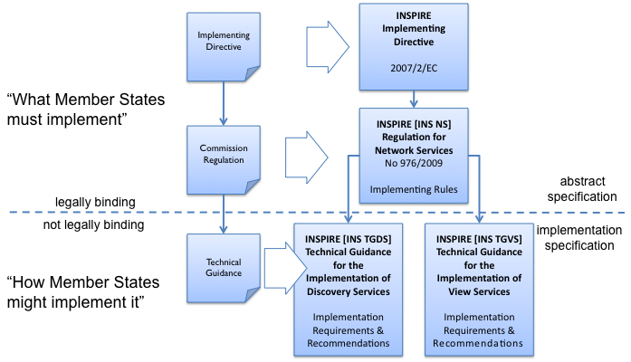
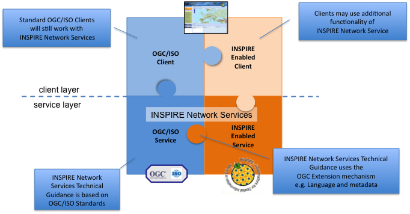
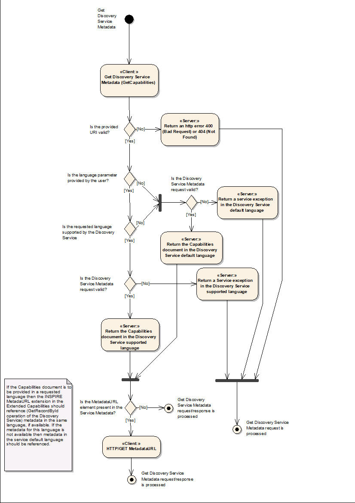
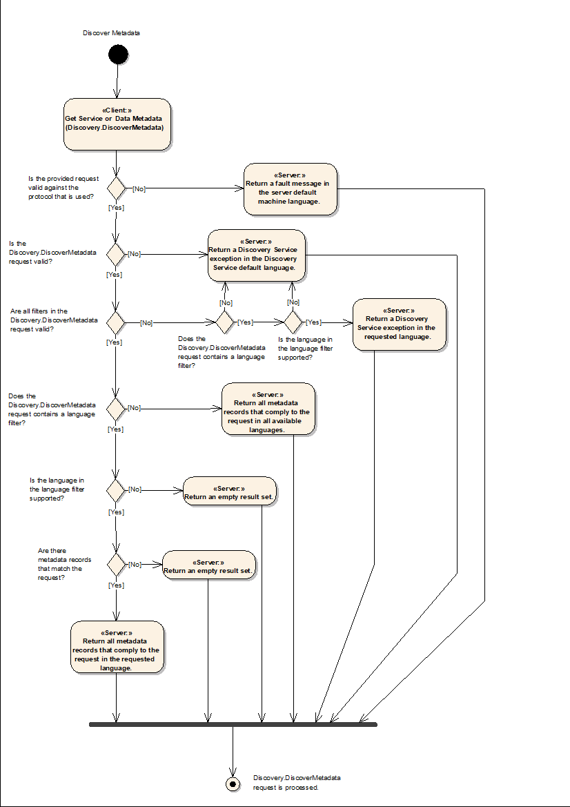
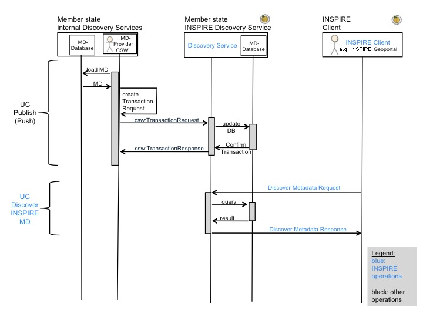
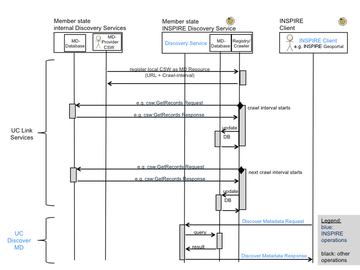
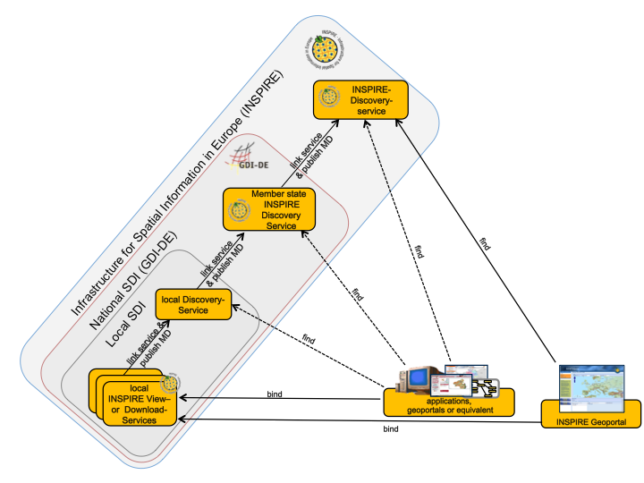
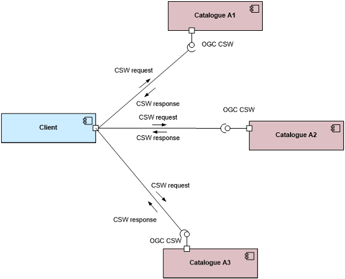
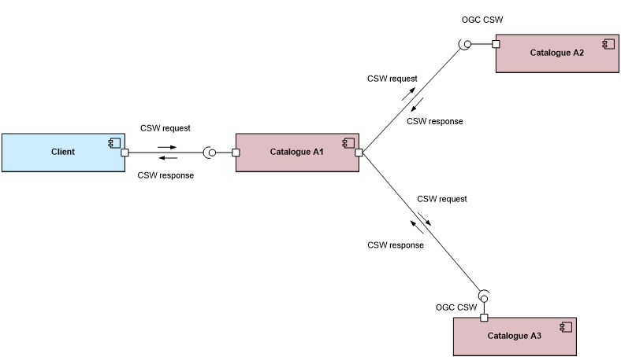

// Admonition icons:
// Implementation Requirements
:important-caption: 📕
// Implementation Recommendations
:note-caption: 📘

// TOC placement using macro (manual)
:toc: macro

// Empty TOC title (the title is in the document)
:toc-title:

// TOC level depth
:toclevels: 5

// Section numbering level depth
:sectnumlevels: 8

// Line Break Doc Title
:hardbreaks-option:

:appendix-caption: Annex

image:./media/image1.jpeg[image,width=108,height=108] **INSPIRE** - *Infrastructure for Spatial Information in Europe*

[discrete]
= Technical Guidance for the implementation of INSPIRE Discovery Services

[width="100%",cols="29%,71%",]
|===
|*Title* |Technical Guidance for the implementation of INSPIRE Discovery Services
|*Creator* |Initial Operating Capability Task Force for Network Services
|*Date* |2011-11-07
|*Subject* |INSPIRE Discovery Services
|*Status* |Version 3.1
|*Publisher* |IOC Task Force for Network Services
|*Type* |Text
|*Description* |This document defines the implementation requirements and recommendations and describes the implementation guidelines for INSPIRE Discovery Services to fulfil the requirements of the INSPIRE directive and the Regulation on INSPIRE Network Services, Annex II Discovery Services.
|*Contributors* |Members of the INSPIRE Drafting Team for Network Services, members of the INSPIRE IOC Task Force for Network Services and the Initial Operating Capability Task Force Service Team.
|*Format* |PDF
|*Source* |Technical Guidance for the implementation of INSPIRE Discovery Services v3.0
|*Rights* |Public
|*Identifier* |Technical Guidance Discovery Services v3.1
|*Language* |EN
|*Relation* |Commission Regulation (EC) No 976/2009 of 19 October 2009 implementing Directive 2007/2/EC of the European Parliament and of the Council as regards the Network Services
|*Coverage* |Project duration
|===

<<<
[discrete]
== Table of Contents
toc::[]

:sectnums:

<<<
[discrete]
== Acknowledgements

Many individuals and organisations have contributed to the development of these Guidelines.

The Network Services Drafting Team responsible for the Technical Guidance v2.0 included: Jean-Jacques Serrano (FR), Graham Vowles (UK), Olaf Østensen (NO), Didier Richard (FR), Markus Müller (DE), Lars Bernard (DE), Michel Grothe (NL), Marek Brylski (PL), Lassi Lehto (FI), Christian Elfers (DE), Roland-Michael Wagner (DE), Dominique Flandroit (BE), Tapani Sarjakoski (FI).

The Initial Operating Capability Task Force has assumed responsibility of the Technical Guidance document following v2.0 and an IOC TF Service Team was tasked to update the Technical Guidance Document. The following members of the Initial Operating Capability Task Force or the Initial Operating Capability Task Force Service Team have greatly contributed to this version: Marek Brylski (PL), Anders Friis-Christensen (DK), Bart Cosyn (BE), Andreas von Dömming (DE), Timothy Duffy (UK), Christian Elfers (DE), Jani Kylmäaho (FI), Didier Richard (FR), Joeri Robbrecht (BE) and Wolfgang Tinkl (AT).

We are also grateful for the comments received from all the IOC Task Force Members.

The team at the Joint Research Centre that contributed to these Guidelines includes: Ioannis Kanellopoulos, Gianluca Luraschifootnote:[Currently with the European Maritime Safety Agency], Michel Millot and Angelo Quaglia.

Graham Vowels (UK) edited this version.

*Contact information*

Ioannis Kanellopoulos
European Commission, Joint Research Centre
Institute for Environment and Sustainability
Spatial Data Infrastructures Unit
TP262, Via Fermi 2749
I-21027 Ispra (VA)
ITALY
E-mail: mailto:vanda.lima@jrc.ec.europa.eu[ioannis.kanellopoulos@jrc.ec.europa.eu]
Tel.: 39-0332-785115
http://ies.jrc.ec.europa.eu/
http://ec.europa.eu/dgs/jrc/
http://inspire.jrc.ec.europa.eu/

<<<
[discrete]
== Foreword

Directive 2007/2/EC of the European Parliament and of the Council [*Directive 2007/2/EC*], adopted on 14 March 2007 aims at establishing an Infrastructure for Spatial Information in the European Community (INSPIRE) for environmental policies, or policies and activities that have an impact on the environment. INSPIRE will make available relevant, harmonised and quality geographic information to support the formulation, implementation, monitoring and evaluation of policies and activities, which have a direct or indirect impact on the environment.

INSPIRE is based on the infrastructures for spatial information established and operated by the 27 Member States of the European Union. The Directive addresses 34 spatial data themes needed for environmental applications, with key components specified through technical implementing rules. This makes INSPIRE a unique example of a legislative "regional" approach.

To ensure that the spatial data infrastructures of the Member States are compatible and usable in a Community and trans-boundary context, the Directive requires that common Implementing Rules (IR) are adopted in the following areas.

* Metadata;
* The interoperability and harmonisation of spatial data and services for selected themes (as described in Annexes I, II, III of the Directive);
* Network Services;
* Measures on sharing spatial data and services;
* Co-ordination and monitoring measures.

The Implementing Rules are adopted as Commission Decisions or Regulations, and are binding in their entirety.

In particular with respect the Network Services, Implementing Rules are required for the following services (Article 11(1) of the Directive):

[loweralpha]
. _"discovery services search for spatial data sets and spatial data services on the basis of the content of corresponding metadata, and display the metadata content;_
. _view services as a minimum, display, navigate, zoom in/out, pan, or overlay spatial data sets and display legend information and any relevant content of metadata;_
. _download services enabling copies of complete spatial data sets, or of parts of such sets, to be downloaded;_
. _transformation services enabling spatial data sets to be transformed with a view to achieving interoperability;_
. _invoke spatial data services" enabling data services to be invoked."_

In addition to the Implementing Rules, non-binding Technical Guidance documents describe detailed implementation aspects and relations with existing standards, technologies, and practices. They may need to be revised during the course of implementing the infrastructure to take into account the evolution of technology, new requirements, and cost benefit considerations. Figure 1 illustrates the relationship between the INSPIRE Regulations containing Implementing Rules and their corresponding Technical Guidance documents.

[.text-center]
*Figure 1: Relationship between INSPIRE Implementing Rules and Technical Guidance*

Technical Guidance documents define how Member States might implement the Implementing Rules described in a Commission Regulation. Technical Guidance documents may include non-binding technical requirements that must be satisfied if a Member State chooses to conform to the Technical Guidance. Implementing this technical guidance will maximise the interoperability of INSPIRE services.

This Technical Guidance concerns the INSPIRE Discovery Services. The Technical Guidance contains detailed technical documentation highlighting the mandatory and the recommended elements related to the implementation of INSPIRE Discovery Services. The technical provisions and the underlying concepts are often illustrated by use case diagrams and accompanied by examples.

|===
This document will be publicly available as a 'non-paper', as it does not represent an official position of the Commission, and as such cannot be invoked in the context of legal procedures.
|===

*Legal Notice*

Neither the European Commission nor any person acting on behalf of the Commission is responsible for the use, which might be made of this publication.

<<<
[discrete]
== Revision History

[cols=",,,",options="header",]
|===
|*Date* |*Release* |*Editor* |*Description*
|28Jul2009 |2.0 |Network Services Drafting Team |Two approaches to include INSPIRE metadata as part of the _Get Discovery Service Metadata response_ have been incorporated
|17Jun2010 |2.12 |Initial Operating Capability Task Force a|
The INSPIRE extended Capabilities XML schema has been included in Annex B

Links with other technical components in INSPIRE have been described based on the INSPIRE domain model

A new interpretation and recommended implementation of the Link Discovery Service operation has been described

An approach to implement the required Language parameter has been recommended

General editorial changes

|24Jan2011 |2.14 |IOC ST, 
Graham Vowles |Editorial Review to improve accuracy and clarity
|28Jan2011 |2.15 |IOC ST, 
Graham Vowles a|
Update to include edits made during IOC TF – Services Team Meeting in Copenhagen:

Apply INSPIRE custom schema for missing INSPIRE metadata elements in the Extended Capabilities section instead of the ISO 19139 data types.

|3Feb2011 |2.16 |IOC ST, 
Graham Vowles a|
Update to Implementation Requirements and Implementation Recommendations. 
Update section on Link Discovery Service.

Update section on Language Requirement.

|10Feb2011 |2.17 |IOC ST, 
Graham Vowles |Update of XML Examples
|11Feb2011 |2.18 |IOC ST, 
Graham Vowles |Addition of use cases and rationale of extended capabilities approach.
|17Feb2011 |2.19 |IOC ST, 
Graham Vowles |Update to Link Discovery Section
|21Feb2011 |2.20 |IOC ST, 
Graham Vowles |Editorial changes and update to XML Examples.
|21Feb2011 |2.21 |IOC ST, 
Graham Vowles |Finalised for IOC TF review.
|13Mar2011 |2.31 |IOC ST, EC JRC, Graham Vowles |Addressed comments received from IOC Task Force: (general editorial changes, updated Table 1, Figure 6, Figure 7 and Figure 9, used only full namespaces in tables and XML examples.
|17Mar2011 |2.32 |IOC ST, EC JRC, Graham Vowles |Final editorial proofing.
|29Mar2011 |3.0 |IOC TF |IOC TF Approved Version
|07Nov2011 |3.1 |IOC ST, EC JRC |Added Chapter 5 on Quality of Services
|07Nov2011 |3.1 |EC JRC |Corrected Typographical error xmlns:inspire_commmon to xmlns:inspire_common on page 13
|07Nov2011 |3.1 |IOC TF |IOC TF Approved
|===

<<<
== Introduction

INSPIRE Discovery Services allow users and computer programs to search for spatial datasets and services based on their metadata records. This document specifies Technical Guidance for Member States to implement INSPIRE Discovery Services as mandated by the Regulation on INSPIRE Network Services [*INS NS,* Annex II].

Following this Technical Guidance will ensure that INSPIRE Discovery Services are implemented in a consistent and compatible way across Europe. It is based on European and International standards, current practices in related stakeholder communities and relevant European initiatives such as e‑Government, and the EU Interoperability Framework.

[.text-center]
*Figure 2: Extending ISO and OGC Standards for INSPIRE Requirements*

This document specifics requirements and recommendations based on the OGC™ Catalogue Services Specification 2.0.2 - ISO Metadata Application Profile for CSW 2.0 [*CSW ISO AP*]. It defines an INSPIRE Profile of [*CSW ISO AP*] to implement the following operations:

* *Get Discovery Service Metadata*: Provides all necessary information about the Discovery Service and describes service capabilities;
* *Discover Metadata*: Allows requesting INSPIRE metadata elements of spatial data sets and services from a Discovery Service;
* *Publish Metadata*: Allows editing of INSPIRE metadata elements of resources in the Discovery Service (push or pull metadata mechanisms). Editing meaning insert, update and delete;
* *Link Discovery Service*: Allows the declaration of the availability of a Discovery Service for the discovery of resources through the Member State Discovery Service while maintaining the resource metadata at the owner's location.

In addition, this document defines how a query for metadata should be written, and how to handle multilingual aspects of INSPIRE Discovery Services.

This is the initial version of the Technical Guidance document and it has been validated and tested in collaboration with the Initial Operating Capability Task Force. It may be used by the Member States for the initial implementation of the INSPIRE Discovery Services.

<<<
== Normative references 

This technical guidance incorporates, by dated or undated references, provisions from other publications. For dated references, subsequent amendments to or revisions of any of these publications apply to this guide only when incorporated in it by amendment or revision. For undated references, the latest edition of the publication referred to applies (including amendments).

These normative references are cited at the appropriate places in the text and the publications are listed hereafter:

INSPIRE, Implementing *Directive 2007/2/EC* of the European Parliament and of the Council as regards interoperability of spatial data sets and services

INSPIRE, **INS NS** Commission Regulation (EC) No 976/2009 of 19 October 2009 implementing Directive 2007/2/EC of the European Parliament and of the Council as regards the Network Services

INSPIRE, **INS MD** Commission Regulation (EC) No 1205/2008 of 3 December 2008 implementing Directive 2007/2/EC of the European Parliament and of the Council as regards metadata (Text with EEA relevance). See also Corrigendum to INSPIRE Metadata Regulation

INSPIRE, **INS MDTG,** INSPIRE Metadata Implementing Rules: Technical Guidelines based on EN ISO 19115 and EN ISO 19119.

INSPIRE, *INS DSTG*, Technical Guidance for the implementation of INSPIRE Discovery Services

*ISO 19115*:**2003**__, Geographic information – Metadata__

**ISO 19115/Cor.1:2006**__, Geographic information – Metadata, Technical Corrigendum 1__

**ISO 19119:2005**__, Geographic information – Services__

*ISO 19119:2005 PDAM 1,* _Geographic information – Services_

**ISO/TS 19139:2006**__, Geographic information - Metadata - Implementation specification__

OGC 07-006, *OGC CSW*, OGC™ Catalogue Services Specification, version 2.0.2 (Corrigendum Release 2).

OGC 07-045, *CSW ISO AP*, OGC™ Catalogue Services Specification 2.0.2 - ISO Metadata Application Profile for CSW 2.0, version 1.0.0 (2007).

OGC 05-008, *OGC OWS*, OGC Web Services Common Specification, version 1.0 (May 2005)

<<<
== Terms and abbreviations

=== Terms

[arabic, start=1]
. *application* *profile* 
set of one or more base standards and - where applicable - the identification of chosen clauses, classes, subsets, options and parameters of those base standards that are necessary for accomplishing a particular function [ISO 19101, ISO 19106]
. *discovery services* 
making it possible to search for spatial data sets and services on the basis of the content of the corresponding metadata and to display the content of the metadata [INSPIRE Directive]
. *metadata* 
information describing spatial data sets and spatial data services and making it possible to discover, inventory and use them [INSPIRE Directive]
. *metadata element* 
a discrete unit of metadata, in accordance with [ISO 19115]
. *network services* 
network services should make it possible to discover, transform, view and download spatial data and to invoke spatial data and e-commerce services [INSPIRE Directive]
. *queryable* 
a metadata element that can be queried upon
. **spatial data **
data with a direct or indirect reference to a specific location or geographic area [INSPIRE Directive]
. **spatial data set **
identifiable collection of spatial data [INSPIRE Directive]

=== Abbreviations

[cols=","]
|===
|AP |Application Profile
|ARC |Architecture
|CSW |Catalogue Services for the Web
|CSWT |Catalogue Services for the Web Transactional
|GET |HTTP Get Method
|HTTP |Hypertext Transfer Protocol
|INSPIRE |Infrastructure for Spatial Information in Europe
|IOC |Initial Operations Capability
|ISO |International Organisation for Standardisation
|KVP |Key Value Pair
|MD |Metadata
|NS |Network Services
|OWS |OGC Web Services Common Specification
|TF |Task Force
|XML |eXtended Markup Language
|===

=== Verbal forms for the expression of provisions

In accordance with the ISO rules for drafting, the following verbal forms shall be interpreted in the given way:

* "shall" / "shall not": a requirement, mandatory to comply with the technical guidance
* "should" / "should not": a recommendation, but an alternative approach may be chosen for a specific case if there are reasons to do so
* "may" / "need not": a permission

*Implementation Requirements and Recommendations notation*

To make it easier to identify the requirements and the recommendations for INSPIRE Discovery Services within this technical guidance, they are highlighted and numbered as shown below:

[IMPORTANT]
====
*Implementation Requirements #*

are shown using this style
====

[NOTE]
====
*Implementation Recommendations #*

are shown using this style.
====

*Note*: It is worth noting that requirements as specified in the INSPIRE Regulations and Implementing Rules are legally binding, and that requirements and recommendations as specified in INSPIRE Technical Guidance are *not* legally binding. Therefore, within this technical guidance we have used the terms 'implementation requirement' and 'implementation recommendation' to indicate what is technically required or recommended to conform to the Technical Guidance.

*XML Example notation*

XML Examples are shown using Courier New on a grey background as below:

[source,xml,subs="+quotes",align=center]
----
<inspire:example>
  <inspire:highlight>
    Highlighted Text for emphasis
  </inspire:highlight>
</inspire:example>
----

*Note*: XML Examples are informative and are provided for information only and are expressly not normative. A reference implementation of the example XML is available on the following link:

http://inspire.ec.europa.eu/schemas/

=== References

To aid readability for a non-technical audience, references within this document are denoted using "Section" or "Annex". For example, Section 4.3.1 or Annex A.

References to other documents refer to the list of normative references in Section 3 and use the abbreviated title as indicated in *Bold* text. For example, [*CSW ISO AP*] uses the abbreviated title for the document as shown below:

OGC 07-045, *CSW ISO AP*, OGC™ Catalogue Services Specification 2.0.2 - ISO Metadata Application Profile for CSW 2.0, version 1.0.0 (2007).

References within other documents are shown as above using the abbreviated title, together with the appropriate section within the document. For example, [*CSW ISO AP,* Section 8.2.3.1], refers to Section 8.2.3.1 within the document as listed above.

<<<
== INSPIRE Profile of CSW ISO AP

=== General background 

The base specification of an INSPIRE Discovery Service is [*CSW ISO AP*].

[IMPORTANT]
====
*Implementation Requirement* *1*

An INSPIRE Discovery Service shall implement the mandatory behaviour of a [*CSW ISO AP*] compliant service and the extensions as required by the INSPIRE Directive and its associated Regulations.
====

[IMPORTANT]
====
*Implementation Requirement* *2*

The extended behaviour for an INSPIRE Discovery Service with respect to the requirements of the INSPIRE Directive and the Regulation on INSPIRE Network Services [*INS NS*] consists of: Discovery Service Operations, Discovery Service Queryables, and Discovery Service Multilingual aspects
====

image::./media/image4.png[image,width=548,height=487, align=center]

[.text-center]
*Figure 3: INSPIRE Generic Use Case*

Figure 3: INSPIRE Generic Use Case illustrating use cases for the creation and publication of metadata, their discovery through a discovery service and viewing of spatial data sets via an INSPIRE View service.

*Rationale behind the choice of an INSPIRE Schema for implementing the extended capabilities of INSPIRE Network Services*

The INSPIRE Network Service Regulation [*INS NS*] requires a Network Service to respond to a "Get Network Service Metadata" request with a response that contains as one of its parameters the Network Service INSPIRE metadata.

At the time of writing this Technical Guidance the OGC GetCapabilities response document does not include all required INSPIRE metadata for the Network Service and in order to do so the Extended Capabilities mechanism is used. Through this mechanism it is possible to link INSPIRE metadata with the GetCapabilities response, either by including the missing INSPIRE metadata elements of the Network Service, or by including a reference to the INSPIRE Network Service metadata record.

The initial approach was to re-use, for extended capabilities elements, the ISO 19139 data types. The Advantages of using the ISO 19139 data types are:

* New data types do not need to be defined 
* Existing client applications already have the necessary bindings to read and write the information. Type redefinition was however necessary for the following elements:
** INSPIRE Service Type (implemented as gco:GenericName_PropertyType)

** Languages

** CurrentLanguage

** TemporalReference
 

Which however breaks compatibility with existing clients. The disadvantages of this approach on the other hand are:

* ISO 19139 data types currently have a double implementation;
** The schemas from ISO 19139 version 2005-DIS (Draft International Standard) dated 2006 May 4 (http://schemas.opengis.net/iso/19139/20060504/[20060504/]) depend on the unofficial GML 3.2.0 version, but on the other hand is used in ISO AP 1.0 for CSW; 

** The ISO/TS 19139 Schemas dated 2007 April 17 (http://schemas.opengis.net/iso/19139/20070417/[20070417/]) depend on the official GML version 3.2.1 which relies on a different namespace but does not make available the implementation for the "srv" namespace for service metadata; 

* CSW schema version 2.0.2 includes OGC filter version 1.1.0 which in turn includes GML version 3.1.1;
* An INSPIRE view service may also be implemented using WMS 1.1.1. The WMS 1.1.1 schema however is officially implemented only through DTD technology. There is no official DTD implementation for ISO 19139.

As a result for the discovery service capabilities document this approach would require reference to three different versions of GML in the same document.

*It has therefore been decided to use a custom INSPIRE schema for the missing INSPIRE metadata elements in the Extended Capabilities section. This allows for an easy integration with all OGC services and full validation of INSPIRE compliance using standard XML validation.* Table 3 *shows the mapping between the INSPIRE metadata elements and the OGC Capabilities metadata elements.*

*Note: the schema will be aligned to the relevant standards once these support the INSPIRE requirements. Alignment between OWS and ISO 19119 should also help addressing some of the issues.*

The custom INSPIRE schemas are available at http://inspire.ec.europa.eu/schemas/

This Technical Guidance uses the following namespace definitions:

[source, xml]
xmlns:inspire_ds="http://inspire.ec.europa.eu/schemas/inspire_ds/1.0" xmlns:inspire_common="http://inspire.ec.europa.eu/schemas/common/1.0"

The following sections specify the required extensions to the given specifications.

===  INSPIRE Profile Implementation Requirements

The INSPIRE specific constraints applicable to an [*CSW ISO AP*] base Discovery Service are:

[IMPORTANT]
====
*Implementation Requirement* *3*

The list of federated catalogues, if any, shall be advertised as the result of a Service metadata response to a Discover Metadata request.
====

[IMPORTANT]
====
*Implementation Requirement* *4* 

The additional search attributes listed in Section 4.4 are mandatory and shall be supported.
====

[IMPORTANT]
====
*Implementation Requirement* *5* 

The additional search attributes listed in Section 4.4 shall be advertised as the result of a Service metadata response to a discover metadata request.
====

==== Discovery service exceptions

Internationalisation of service exceptions is optional.

[NOTE]
====
*Implementation Recommendation* *1* 

If service exceptions are internationalised then the error messages (exceptions) are either expressed in the service's default language (suppose that the request is incorrect and the LANGUAGE parameter has not been interpreted before issuing the error/exception text) or in the preferred (requested) language in other cases.
====

See also Section 4.5.3 Common concept for other operations.

=== Discovery service operations

The base functionality of an INSPIRE Discovery Service is derived from [*CSW ISO AP*]. The following sections specify the extensions to this base specification that are derived from the INSPIRE requirements as defined by [*INS NS*].

[*CSW ISO AP*] distinguishes between two types of catalogue services: A 'read-only' catalogue service that has to provide operations labelled 'CSW' and a transactional catalogue service that has to provide operations labelled 'CSWT'. This distinction is derived from the OGC catalogue base specification [*OGC CSW*].

Table 1 shows the relationship between operations of an INSPIRE Discovery Service and the corresponding catalogue service operation as defined by [*OGC CSW*]. Figure 4 illustrates the Get Discovery Service metadata use case.

[.text-center]
*Table 1: INSPIRE Discovery Services Operations*

[cols=",,",]
|===
|*INSPIRE Discovery Services Operations* |*INSPIRE Cardinality* |*OGC CSW ISO AP operations*
|Get Discovery Service Metadata |Mandatory |OGC_Service.GetCapabilities
|Discover Metadata |Mandatory |CSW Discovery.GetRecords
|Publish Metadata |Conditional a|
CSWT Manager.Transaction or

CSWT Manager.Harvest

|Link Discovery service |Mandatory a|
Combination of OGC_Service.GetCapabilities and

CSW Discovery.GetRecords

OR using Publish Metadata operation:

CSWT Manager.Transaction or CSWT Manager.Harvest
|===

==== Get Discovery Service Metadata

The Get Discovery Service Metadata use case is illustrated in Figure 4.

[cols=",,",options="header",]
|===
|INSPIRE Implementing Rule |Reference [*INS NS,* Annex II] |Section 2
| |Operation name |Get Discovery Service Metadata
| |Obligation / condition |Mandatory
|CSW ISO AP |Operation name |OGC_Service.GetCapabilities
| |Definition |The GetCapabilities operation allows clients to retrieve service metadata from a server.
|===

===== Request Parameters

[IMPORTANT]
====
*Implementation Requirement* *6* 

See [*CSW ISO AP*]. INSPIRE extends this operation with an additional parameter that indicates the client's preferred language. The recommended approach to implement this extension is described in Section 4.5.1.
====

===== Response Parameters

According to [*INS NS*, Annex II, Section 2.2] the Get Discovery Service Metadata shall contain the following sets of parameters:

* Discovery Service Metadata, containing at least the INSPIRE metadata elements of the Discovery Service;
* Operations Metadata to provide metadata about the operations implemented by the Discovery Service; and
* Languages, including the Supported languages and Response language.

The GetCapabilities response of the [*CSW ISO AP*] does not fully satisfy the requirements of the INSPIRE Network Services Regulation [*INS NS*] and in particular with respect the Discovery Service INSPIRE metadata and Language parameters (see Table 2: GetCapabilities Response [CSW ISO AP]). Two scenarios have been identified to comply with this requirement. It is up to the Member State to choose which scenario best fits its needs. As these scenarios are not mutually exclusive, a Member State may choose to implement both.

[IMPORTANT]
====
*Implementation Requirement* *7* 

The response shall include discovery service metadata parameters [*INS NS*] by implementing either scenario below: 

[arabic, start=1]
. Scenario 1: Referencing a URL mapped to the GetCapabilities response by the MetadataURL element in the ExtendedCapabilities of the [*CSW ISO AP*]; Mandatory [OGC CSW ISO AP] capabilities parameters (see Table 2) shall be mapped to INSPIRE metadata elements to implement a consistent interface.
+
OR

[arabic, start=2]
. Scenario 2: Including all required metadata explicitly in the GetCapabilities response [*CSW ISO AP*]. INSPIRE metadata elements that can't be mapped to [*CSW ISO AP*] elements are implemented as Extended Capabilities.

To fulfil the specific language requirements of the INSPIRE Network Services Regulation [*INS NS*], a language section shall be added in the extended capability of the service.
====

[.text-center]
*Figure 4: Get Discovery Service Metadata Use Case (UC1)*

Table 2 shows the parameters that are part of a GetCapabilities response of [*CSW ISO AP*].

[.text-center]
*Table 2: GetCapabilities Response [CSW ISO AP]*

[cols=",",]
|===
2+|CSW metadata
2+|Service identification
|ServiceType |The ServiceType for a CSW ISO AP is fixed to "CSW". The Spatial Data Service Type as defined by INSPIRE MD ('discovery') will be mapped to the INSPIRE SpatialDataServiceType element in the GetCapabilities response.
|ServiceTypeVersion |Version of this service type implemented by this service. This value is fixed for the INSPIRE profile of CSW ISO AP to '2.0.2'.
|Title |Title of this service, normally used for display to a human
|Abstract |Brief narrative description of this service, normally available for display to a human
|Keywords |Unordered list of one or more commonly used or formalized word(s) or phrase(s) used to describe this service.
|Fees |Fees and terms for retrieving data from or otherwise using this service, including the monetary units as specified in ISO 4217
|AccessConstraints |Access constraints that should be observed to assure the protection of privacy or intellectual property, and any other restrictions on retrieving or using data from or otherwise using this service.
2+|Service provider
|ProviderName |Unique identifier for service provider organization
|Providersite |Reference to the most relevant web site of the service provider
|ServiceContact |Information for contacting service provider
2+|Operations metadata
|Operation |Metadata for one operation that this service interface implements
|Parameter |Parameter valid domain that applies to one or more operations which this service implements
|Constraint |Constraint on valid domain of a non-parameter quantity that applies to this service
|ExtendedCapabilities |Metadata about this service and software additional abilities
2+|Filter capabilities
|Filter_Capabilities |The following elements are examples of valid filter operators: And, Or, Not, PropertyIsEqualTo, PropertyIsNotEqualTo, PropertyIsLessThan, PropertyIsGreaterThan, PropertyIsLike, PropertyIsNull, PropertyIsLessThanOrEqualTo, PropertyIsGreaterThanOrEqualTo, BBOX, Intersects, Disjoint.
|===

[.text-center]
*Example 1: Reporting the MetadataURL in the extended capabilities*

[source,xml,subs="+quotes",align=center]
----
<xs:complexType name="ExtendedCapabilitiesType">
		<xs:annotation>
			<xs:documentation>Extended capabilities for ISO 19128 , OGC CSW, OGC OWS services</xs:documentation>
		</xs:annotation>
		<xs:choice>
			<xs:sequence>
				<xs:annotation>
					<xs:documentation>Scenario 1: Mandatory MetadataUrl element pointing to an INSPIRE Compliant ISO metadata document plus language parameters </xs:documentation>
				</xs:annotation>
				<xs:element name="MetadataUrl" type="resourceLocatorType"/>
				<xs:element name="SupportedLanguages" type="supportedLanguagesType"/>
				<xs:element name="ResponseLanguage" type="languageElementISO6392B"/>
			</xs:sequence>
		<xs:sequence>
			<xs:annotation>
				<xs:documentation>Scenario 2: Mandatory (where appropriate) metadata elements not mapped to standard capabilities, plus mandatory language parameters, plus OPTIONAL MetadataUrl pointing to an INSPIRE Compliant ISO metadata document</xs:documentation>
			</xs:annotation>
			<xs:element name="ResourceLocator" type="resourceLocatorType" maxOccurs="unbounded">
				<xs:annotation>
					<xs:documentation xml:lang="en">Mandatory linkage to the network service</xs:documentation>
				</xs:annotation>
			</xs:element>
			<xs:element name="ResourceType" type="serviceSpatialDataResourceType"/>
			<xs:element name="TemporalReference" type="temporalReference" maxOccurs="unbounded"/>
			<xs:element name="Conformity" type="conformity" maxOccurs="unbounded"/>
			<xs:element name="MetadataPointOfContact" type="metadataPointOfContact" maxOccurs="unbounded"/>
			<xs:element name="MetadataDate" type="iso8601Date"/>
			<xs:element name="SpatialDataServiceType" type="spatialDataServiceType"/>
			<xs:element name="MandatoryKeyword" type="classificationOfSpatialDataService" maxOccurs="unbounded"/>
			<xs:element name="Keyword" type="keyword" minOccurs="0" maxOccurs="unbounded">
				<xs:annotation>
					<xs:documentation xml:lang="en">If the resource is a spatial data service, at least one keyword from Part D.4 shall be provided.</xs:documentation>
				</xs:annotation>
			</xs:element>
			<xs:element name="SupportedLanguages" type="supportedLanguagesType"/>
			<xs:element name="ResponseLanguage" type="languageElementISO6392B"/>
			<xs:element name="MetadataUrl" type="resourceLocatorType" minOccurs="0"/>
			</xs:sequence>
		</xs:choice>
	</xs:complexType>
	<xs:complexType name="supportedLanguagesType">
		<xs:sequence>
			<xs:element name="DefaultLanguage" type="languageElementISO6392B"/>
			<xs:element name="SupportedLanguage" type="languageElementISO6392B" minOccurs="0" maxOccurs="unbounded">
				<xs:annotation>
					<xs:documentation>It is not necessary to repeat the default language</xs:documentation>
				</xs:annotation>
			</xs:element>
		</xs:sequence>
	</xs:complexType>
----

===== Discovery Service Metadata

[IMPORTANT]
====
*Implementation Requirement* *8* 

[*CSW ISO AP*] specifies a GetCapabilities operation with several service metadata sections. The service metadata in the capabilities documents shall be in conformance with the requirements of INSPIRE service metadata [*INS NS*].
====

Table 3 shows the mapping from the INSPIRE metadata elements to the capabilities as used for the implementation of the Discovery service by [*CSW ISO AP*].

The first two columns are from the INSPIRE Metadata Regulation [*INS MD*]. In the "Capabilities CSW ISO AP" column the capabilities mapping is defined. In the last column the mappings as defined in the mapping ISO 19115/ISO 19119 of the Metadata Technical Guidance [*INS MDTG*] are shown.

[.text-center]
*Table 3: INSPIRE metadata elements to CSW ISO AP capabilities metadata*

[cols=",,,,",options="header",]
|===
|INSPIRE Metadata element a|
M/
C/
O

|Capabilities CSW ISO AP a|
Type

Field

|ISO 19139 / CSW ISO AP
|Resource title (B1.1) |M |/csw:Capabilities/Serviceidentification/Title |String a|
identificationInfo[1]/*/citation/*/title

{empty}[ISO 19139]

|Resource abstract (B1.2) |M |/csw:Capabilities/ Serviceidentification/Abstract |String a|
identificationInfo[1]/*/abstract

{empty}[ISO 19139]

|Resource Type (B1.3) |M |/inspire_ds:ExtendedCapabilities/ inspire_common:ResourceType | a|
identificationInfo[1]/hierarchyLevel

{empty}[ISO 19139]

|Resource Locator (B1.4) |C |/csw:Capabilities/ OperationsMetadata/Operation/GetCapabilities/DCP/HTTP/@xlink:href |URL a|
distributionInfo/*/transferOptions/*/onLine/*/linkage

{empty}[ISO 19139]

|Coupled Resource (B1.6) |C |Not applicable to discovery service |- |identificationInfo[1]/*/operatesOn
|Spatial data service type (B2.2) |M |/inspire_ds:ExtendedCapabilities/ inspire_common:SpatialDataServiceType |GenericName a|
identificationInfo[1]/*/serviceType

{empty}[CSW ISO Metadata AP]

a|
Keyword value (B3.1)

For the mandatory category or subcategory of the service

|M |/inspire_ds:ExtendedCapabilities/ inspire_common:MandatoryKeyword |String a|
identificationInfo[1]/*/descriptiveKeywords/*/keyword

{empty}[ISO 19139]

a|
Keyword value (B3.1)

For any other keyword

|O |/inspire_ds:ExtendedCapabilities/ inspire_common:Keyword |String a|
identificationInfo[1]/*/descriptiveKeywords/*/keyword

{empty}[ISO 19139]

|Originating controlled vocabulary (B3.2) |C |/inspire_ds:ExtendedCapabilities/ inspire_common:Keyword/ inspire_common:OriginatingControlledVocabulary/ inspire_common:Title | a|
identificationInfo[1]/*/descriptiveKeywords/*/thesaurusName

{empty}[ISO 19139]

|Temporal extent (B5.1) |C |/inspire_ds:ExtendedCapabilities/ inspire_common:TemporalExtent |Date a|
identificationInfo[1]/*/extent/*/temporalElement/*/extent

{empty}[ISO 19139]

|Date of publication (B5.2) |C |/inspire_ds:ExtendedCapabilities/ inspire_common:TemporalReference/ inspire_common:DateOfPublication |Date a|
identificationInfo[1]/*/citation/*/date[./*/dateType/*/text()='

publication']/*/date

{empty}[ISO 19139]

|Date of last revision (B5.3) |C |/inspire_ds:ExtendedCapabilities/ inspire_common:TemporalReference/ inspire_common:DateOfLastRevision |Date a|
identificationInfo[1]/*/citation/*/date[./*/dateType/*/text()='r

evision']/*/date

{empty}[ISO 19139]

|Date of creation (B5.4) |C |/inspire_ds:ExtendedCapabilities/ inspire_common:TemporalReference/ inspire_common:DateOfCreation |Date a|
identificationInfo[1]/*/citation/*/date[./*/dateType/*/text()='

creation']/*/date

{empty}[ISO 19139]

|Specification (B7.1) |M |/inspire_ds:ExtendedCapabilities/ inspire_common:Conformity/ inspire_common:Specification |string a|
dataQualityInfo/*/report/*/result/*/specification

{empty}[ISO 19139]

|Degree (B7.2) |M |/inspire_ds:ExtendedCapabilities/ inspire_common:Conformity/ inspire_common:Degree |boolean a|
dataQualityInfo/*/report/*/result/*/pass

{empty}[ISO 19139]

|Conditions applying to access and use (B8.1) |M |/csw:Capabilities/ Serviceidentification/Fees |string a|
identificationInfo[1]/*/resourceConstraints/*/useLimitation

{empty}[ISO 19139]

|Limitations on public access (B8.2) |M |/csw:Capabilities/ Serviceidentification/AccessConstraints |string a|
identificationInfo[1]/*/resourceConstraints/*/accessConstraints

{empty}[ISO 19139]

|Responsible party (B9.1) |M a|
csw:Capabilities/ Serviceprovider/ProviderName

and

csw:Capabilities/ Serviceprovider/ServiceContact/ContactInfo/Address/ElectronicMailAddress

|string a|
identificationInfo[1]/*/pointOfContac/t*/ organisationName

and

identificationInfo[1]/*/pointOfContact/address/electronicMailAddress

{empty}[ISO 19139]

|Responsible party role (B9.2) |M |csw:Capabilities/Serviceprovider/role |string a|
identificationInfo[1]/*/pointOfContact/*/role

{empty}[ISO 19139]

|Metadata point of contact (B10.1) |M |/inspire_ds:ExtendedCapabilities/ inspire_common:MetadataPointOfContact |string |contact
|Metadata Date (B10.2) |M |/inspire_ds:ExtendedCapabilities/ inspire_common:MetadataDate |Date |dateStamp
|Metadata Language (B10.3) |M |/inspire_ds:ExtendedCapabilities/inspire_common:ResponseLanguage/ inspire_common:Language |string |language
|===

==== Discover Metadata 

[cols=",,",options="header",]
|===
|INSPIRE Implementing Rule |Reference [*INS NS,* Annex II] |Section 3
| |Operation name |Discover Metadata
| |Obligation / condition |Mandatory
|CSW ISO AP |Operation name |CSW Discovery.GetRecords
| |Definition |The primary means of a GetRecords operation is to search and to present metadata records.
|===

===== Request Parameters

[IMPORTANT]
====
*Implementation Requirement* *9*

According to [*INS NS*, Annex II, Section 3.1] two parameters shall be supported by the service: Language, and Query.
====

[IMPORTANT]
====
*Implementation Requirement* *10*

The language parameter shall be implemented by using the Language queryable in a filter statement as defined by [*CSW ISO AP*]. With that a client can request metadata records in a specific metadata language.
====

[IMPORTANT]
====
*Implementation Requirement* *11*

The query parameter shall be implemented by the filter statement of the GetRecords-Request itself. The query has to support all search attributes defined in Section 4.4.
====

[NOTE]
====
*Implementation Recommendation* *2*

To ensure a common response structure for a Discover Metadata request, the value of the following request parameters shall be set as follows:

- resultType = "results"

- outputFormat = "application/xml"

- outputSchema = http://www.isotc211.org/2005/gmd

- ElementSetName = "full"
====

[.text-center]
*Example 2: Discover Metadata Request*

[source, xml]
<csw:GetRecords xmlns:csw="http://www.opengis.net/cat/csw/2.0.2" xmlns:apiso=http://www.opengis.net/cat/csw/apiso/1.0 xmlns:ogc="http://www.opengis.net/ogc" xmlns:gmd="http://www.isotc211.org/2005/gmd"
service="CSW" resultType="results"
outputFormat="application/xml" outputSchema="http://www.isotc211.org/2005/gmd" 
startPosition="1" maxRecords="10">
	<csw:Query typeNames="gmd:MD_Metadata">
		<csw:ElementSetName typeNames="gmd:MD_Metadata">full</csw:ElementSetName>
			<csw:Constraint version="1.1.0">
				<ogc:Filter xmlns:ogc="http://www.opengis.net/ogc">
					<ogc:And>
						<ogc:PropertyIsEqualTo>
							<ogc:PropertyName>apiso:Language</ogc:PropertyName>
								<ogc:Literal>eng</ogc:Literal>
						</ogc:PropertyIsEqualTo>
						<ogc:PropertyIsEqualTo>
							<ogc:PropertyName>apiso:ServiceType</ogc:PropertyName>
							<ogc:Literal>wms</ogc:Literal>
						</ogc:PropertyIsEqualTo>
					</ogc:And>
				</ogc:Filter>
			</csw:Constraint>        
	</csw:Query>
</csw:GetRecords>

===== Response Parameters

[IMPORTANT]
====
*Implementation Requirement* *12* 

The Discover Metadata response shall contain at least the INSPIRE metadata elements of each resource matching the query. [*INS NS*, Annex II, Section 3.2.1]
====

[.text-center]
*Figure 5: Discover Metadata Activity Diagram (UC2)*

==== Publish (Push / Pull)

===== Push

[cols=",,",options="header",]
|===
|INSPIRE Implementing Rule |Reference [*INS NS,* Annex II] |Section 4.1
| |Operation name |Publish Metadata (push)
| |Obligation / condition |Conditional: one of Transaction or Harvest has to be supported
|CSW ISO AP |Operation name |CSWT Manager.Transaction
| |Definition |The Transaction operation defines an interface for creating, modifying and deleting catalogue records.
|===

[.text-center]
*Figure 6: Publish metadata using PUSH (Transaction)*

====== Request Parameters

No additional INSPIRE request parameters are required.

====== Response Parameters

No additional INSPIRE response parameters are required.

===== Pull

[cols=",,",options="header",]
|===
|INSPIRE Implementing Rule |Reference [*INS NS,* Annex II] |Section 4.2
| |Operation name |Publish Metadata (pull)
| |Obligation / condition |Conditional: one of Transaction or Harvest has to be supported
|CSW ISO AP |Operation name |CSWT Manager.Harvest
| |Definition |The Harvest operation "pulls" data into the catalogue.
|===

image::./media/image8.jpeg[Slide2,width=604,height=454]

[.text-center]
*Figure 7: Publish metadata using Pull (Harvest)*

====== Request Parameters

[NOTE]
====
*Implementation Recommendation* *3* 

Within the context of INSPIRE an INSPIRE Discovery Service should at least be able to harvest single metadata documents that are accessible through some online location.
====

[*CSW ISO AP*] specifies a harvest operation that is based on the related operation of the underlying base specification [*OGC CSW*].

[IMPORTANT]
====
*Implementation Requirement* *13* 

If an INSPIRE Discovery Service harvests a resource, the RESOURCETYPE of the resource being harvested shall be http://schemas.opengis.net/iso/19139/20060504/gmd and the RESOURCEFORMAT application/xml.
====

====== Response Parameters

No additional response parameters are required.

==== Link Discovery Service

image::./media/image13.png[,width=604,height=454]

[.text-center]
*Figure 8: LINK Services using Registry/Crawler (Example DE)*

[IMPORTANT]
====
*Implementation Requirement* *14* 

The Link Discovery Service operation allows the declaration of the availability of a Discovery Service compliant with this Regulation, for the discovery of resources through the Member State Discovery Service while maintaining the resource metadata at the owner location [*INS NS]*. Furthermore the Link Discovery Service Request parameter shall provide all information about the Public Authority's or Third Party's Discovery Service compliant with this Regulation, enabling the Member State Discovery Service to get resources metadata based on a combination of search criteria from the Public Authority's or Third Party's Discovery Service and to collate it with other resources metadata.
====

The above INSPIRE requirement defines a mechanism that allows third parties to publish their Discovery Services to the INSPIRE network through a Member State Discovery Service. If a third party publishes its Discovery Service through a Member State Discovery Service, it shall be possible to retrieve resource metadata from the owner's Discovery Service. The retrieval of this resource metadata can be handled by the client through iterative searches on available Discovery Services published in a Member State's Discovery Service (Discovery client approach), or by the Discovery Service via distributed search (Discovery Service approach). In general there are three possible scenarios: the centralised, the discovery client and the Discovery Service scenario.

===== Centralised scenario

If the Member State centralises all spatial data and services metadata via publishing operations at a national Discovery Service then the Link Discovery Service operation as required by the INSPIRE Network Services Regulation [*INS NS*] is implicitly fulfilled.

====== Request Parameters

No additional request parameters are required.

[.text-center]
*Figure 9: Example DE Network of Discovery Services*

[.text-center]
*Example 3: GetRecords request*

[source, xml]
<csw:GetRecords xmlns:csw="http://www.opengis.net/cat/csw/2.0.2" xmlns:apiso=http://www.opengis.net/cat/csw/apiso/1.0 xmlns:ogc="http://www.opengis.net/ogc" xmlns:gmd="http://www.isotc211.org/2005/gmd" service="CSW" resultType="results"
outputFormat="application/xml" outputSchema="http://www.isotc211.org/2005/gmd" 
startPosition="1" maxRecords="10">
<csw:Query typeNames="gmd:MD_Metadata">
	<csw:ElementSetName typeNames="gmd:MD_Metadata">full</csw:ElementSetName>
		<csw:Constraint version="1.1.0">
			<ogc:Filter xmlns:ogc="http://www.opengis.net/ogc">
				<ogc:And>
					<ogc:PropertyIsEqualTo>
						<ogc:PropertyName>apiso:Language</ogc:PropertyName>
							<ogc:Literal>eng</ogc:Literal>
					</ogc:PropertyIsEqualTo>
					<ogc:PropertyIsEqualTo>
						<ogc:PropertyName>apiso:ServiceType</ogc:PropertyName>
							<ogc:Literal>view</ogc:Literal>
					</ogc:PropertyIsEqualTo>
				</ogc:And>
			</ogc::Filter>
		</csw:Constraint>
	</csw:Query>
</csw:GetRecords>

====== Response Parameters

GetRecords Response:

No additional parameters are required.

GetCapabilities Response:

No additional parameters are required.

===== Discovery client approach

The discovery client scenario is based on the availability of information on available Discovery Service endpoints in a Member State's Discovery Service.

[IMPORTANT]
====
*Implementation Requirement* *15* 

Third Party Discovery Services shall be published in the Member State's Discovery Service using the Publish Metadata operation.
====

Third Party Discovery Services can additionally be published in the "FederatedCatalogues" section of the Discovery Service's capability document if they are part of a federated search infrastructure.

The Regulation on INSPIRE Network Services imposes two alternatives for implementing the Publish Metadata operation: the _push_ mechanism or the _pull_ mechanism. For the implementation of the link Discovery Service operation, either or both mechanisms may be used.

For further description of the implementation of the push mechanism we refer to the CSW Transaction operation [*CSW ISO AP,* Section 8.2.3.1]. For further description of the implementation of the pull mechanism we refer to the CSW Harvest operation of the [*CSW ISO AP,* Section 8.2.3.2].

The discovery client can derive the Discovery Service topology (the federation) behind a Discovery Service by retrieving the "FederatedCatalogues" section of its capability document and collecting all the Discovery Services within the federation. For INSPIRE, the possible depth of this federation is limited to one level (hopCount = 2). Therefore all federated catalogues can be retrieved from the Member State's Discovery Service "FederatedCatalogues" section in the capabilities document.

If no federated catalogues are defined in the capability document or if the client favours the use of the CSW.GetRecords operation to find Discovery Service metadata then the client can search for Discovery Service endpoints via a CSW.GetRecords query. This also allows for discovering all published Discovery Services. In this case the client controls the searches on the Discovery Services on its own and can discover resource metadata from all discovered Discovery Services in the network by using the CSW.GetRecords operation.

Disadvantages:

* Every client has to determine the Discovery Service topology from time to time.
* The searches must be processed by every client (it is not transparent to the client).
* Discovery Services which are not directly accessible (e.g. running behind a firewall in an intranet) cannot be accessed.

Advantages:

* Searches can be processed by the client: so the client can decide by its own how the search is operated.
* The response time of a single search request may be more predictable as no hidden requests to third party catalogues are involved.

====== Request Parameters

No additional request parameters are required.

[.text-center]
*Figure 10: Discovery Client approach*

[.text-center]
*Example 4: GetRecords request*

[source, xml]
<csw:GetRecords xmlns:csw="http://www.opengis.net/cat/csw/2.0.2" xmlns:apiso=http://www.opengis.net/cat/csw/apiso/1.0 xmlns:ogc="http://www.opengis.net/ogc" xmlns:gmd="http://www.isotc211.org/2005/gmd" service="CSW" resultType="results"
outputFormat="application/xml" outputSchema="http://www.isotc211.org/2005/gmd" 
startPosition="1" maxRecords="10">
<csw:Query typeNames="gmd:MD_Metadata">
	<csw:ElementSetName typeNames="gmd:MD_Metadata">full</csw:ElementSetName>
		<csw:Constraint version="1.1.0">
			<ogc:Filter xmlns:ogc="http://www.opengis.net/ogc">
				<ogc:And>
					<ogc:PropertyIsEqualTo>
						<ogc:PropertyName>apiso:Language</ogc:PropertyName>
							<ogc:Literal>eng</ogc:Literal>
						</ogc:PropertyIsEqualTo>
						<ogc:PropertyIsEqualTo>
							<ogc:PropertyName>apiso:ServiceType</ogc:PropertyName>
							<ogc:Literal>view</ogc:Literal>
					</ogc:PropertyIsEqualTo>
				</ogc:And>
			</ogc::Filter>
		</csw:Constraint>        
	</csw:Query>
</csw:GetRecords>

====== Response Parameters

GetRecords Response:
No additional parameters are required.

GetCapabilities Response:
The FederatedCatalogues section of the capabilities document can contain 0, 1 or N entries.

===== Discovery Service approach (federated search) 

The Discovery Service approach implements a distributed search that allows a Discovery Service to accept a request from a client and distribute the request to other Discovery Services within a federation. In this case a Discovery Service acts as both a server and as a client (for another Discovery Service).

A Discovery Service can propagate a search request to 0, 1 or N other Discovery Services within the federation. Data returned from a Discovery Service query is processed by the requesting Discovery Service to return the data appropriate to the original Discovery Service request (collation of result sets). With that, a client may start a search from only one known location and to search all federated Discovery Services with the same filter statement. In this case, the metadata entries managed by the other Discovery Services become available to their own clients.

[.text-center]
*Figure 11: Discovery Service approach*

Disadvantages:

* More enhanced query request and response structures are needed.
* Every Discovery Service that provides access to federated catalogues must process searches.
* The response time for a single request may be less predictable as possibly hidden requests to (potentially slow) third party catalogues are involved and may infringe the QoS requirements defined in [*INS NS*]. To speed-up very slow responding remote Discovery Services a Discovery Service may harvest their content from time to time (creating an entire local cache of the metadata) and perform searches locally by filtering on all cached results of such a catalogue.

Advantages:

* The Discovery Service must only know its direct "child-catalogues".
* Discovery Services behind a firewall can be accessed.
* Searches don't have to be processed by every client.

[NOTE]
====
*Implementation Recommendation* *4* 

If a Member State chooses to implement the Link Discovery Service Operation by enabling federated search at the Discovery Service, the IOC TF recommends that it is implemented using two operations of [*CSW ISO AP*]: GetRecords and GetCapabilities.
====

[*CSW ISO AP*] defines a mechanism to advertise remote or federated Discovery Services for remote search through the GetRecords request of the Discovery Service [*OGC CSW*, Section 10.8.4.13 and Annex B]. Discovery Services may advertise, in the capabilities document, to which other Discovery Service a query is distributed using an operation constraint called "FederatedCatalogues". Operation constraints are described [*OGC OWS,* Section 7.4.5].

[IMPORTANT]
====
*Implementation Requirement* *16* 

A federated Discovery Service shall be published in the Member State's Discovery Service's capabilities document as the URL of its HTTP/KVP/GET GetCapabilities request.
====

====== Request Parameters

[IMPORTANT]
====
*Implementation Requirement* *17* 

No additional request parameters are required. However, to indicate that the query should be distributed the "DistributedSearch" parameter of a GetRecords request shall be used with the "hopCount" attribute set always equal to "2" to avoid circular searches.
====

[.text-center]
*Example 5: Link Discovery Service – GetRecords request*

[source, xml]
<csw:GetRecords xmlns:csw="http://www.opengis.net/cat/csw/2.0.2" xmlns:apiso=http://www.opengis.net/cat/csw/apiso/1.0 xmlns:ogc="http://www.opengis.net/ogc" xmlns:gmd=http://www.isotc211.org/2005/gmd service="CSW" resultType="results"
outputFormat="application/xml" outputSchema="http://www.isotc211.org/2005/gmd" 
startPosition="1" maxRecords="10">
	<csw:DistributedSearch hopCount="2"/>
		<csw:Query typeNames="gmd:MD_Metadata">
		<csw:ElementSetName typeNames="gmd:MD_Metadata">full</csw:ElementSetName>
			<csw:Constraint version="1.1.0">
				<ogc:Filter xmlns:ogc="http://www.opengis.net/ogc">
					<ogc:And>
						<ogc:PropertyIsEqualTo>
							<ogc:PropertyName>apiso:Language</ogc:PropertyName>
							<ogc:Literal>eng</ogc:Literal>
						</ogc:PropertyIsEqualTo>
						<ogc:PropertyIsEqualTo>
							<ogc:PropertyName>apiso:ServiceType</ogc:PropertyName>
							<ogc:Literal>view</ogc:Literal>
						</ogc:PropertyIsEqualTo>
					</ogc:And>
				</ogc::Filter>
			</csw:Constraint>        
		</csw:Query>
</csw:GetRecords>

====== Response Parameters

GetRecords Response:
No additional parameters are required.

GetCapabilities Response:
The FederatedCatalogues section of the capabilities document can contain 1 or N entries.

[.text-center]
*Example 6: <OperationsMetadata> excerpt of a capabilities document*

[source,xml,subs="+quotes",align=center]
----
<ows:operationsmetadata>
  <ows:constraint name="FederatedCatalogues">
    <ows:value>
      http://www.MyCatalogue.eu/?

REQUEST=GetCapabilities&SERVICE=CSW
    </ows:value>
    <ows:value>
      http://www.ASecondCatalogue.eu/?

REQUEST=GetCapabilities&SERVICE=CSW
    </ows:value>
    <ows:value>
      http://www.AThirdCatalogue.eu/?

REQUEST=GetCapabilities&SERVICE=CSW
    </ows:value>
  </ows:constraint>
</ows:operationsmetadata>
----

=== Discovery Service Queryables

==== Introduction

[IMPORTANT]
====
*Implementation Requirement* *18* 

[*CSW ISO AP*] as the base specification for the INSPIRE Discovery Service is based on the ISO 19115/19119 information model. As such, the INSPIRE metadata elements (see [*INS MD*]) shall be requested through the INSPIRE Discovery Service interface within a query.
====

The relation between ISO 19115 and ISO 19119 and the elements of the INSPIRE Metadata Regulation [INS MD] is described in the Metadata Technical Guidance [*INS MDTG*].

In what follows section 4.4.2 defines the required mappings to common queryables specified by [*CSW ISO AP*] and [*OGC CSW*]; section 4.4.3 defines additional queryables required by [*INS NS*] and [*INS MD*].

==== Mapping common queryables

Table 4 identifies these INSPIRE elements from [*INS NS*] and connects them to appropriate queryables defined by OGC [*CSW ISO AP*]. Annotations are given wherever necessary.

[IMPORTANT]
====
*Implementation Requirement* *19* 

An INSPIRE discovery service shall support the queryables as indicated in Table 4: INSPIRE search criteria (queryables)
====

[.text-center]
*Table 4: INSPIRE search criteria (queryables)*

[cols=",,",options="header",]
|===
|INSPIRE queryable metadata elements [INS NS, Table 1] |*INSPIRE Discovery Service (CSW ISO AP) queryable properties* |Is mandatory for INSPIRE Discovery Service?footnote:[See Article 11 (2) of the INSPIRE directive and Annex II Part A of the Network services IR.]
|Keyword |Subject |Yes
|Topic category |TopicCategory |Yes, if resources of type 'dataset' or 'series' are supported by the catalogue service instance
|Spatial data service type |ServiceType |Yes, if resources of type 'service' are supported by the catalogue service instance.
|Lineage |-(not supported) |Yes
|Spatial resolution |SpatialResolution |Yes, if resources of type 'dataset' or 'series' are supported by the discovery service instance
|Specification |-(not supported) |Yes
|Degree |-(not supported) |Yes
|Geographic bounding box |BoundingBox |Yes, if resources of type 'dataset' or 'series' are supported by the catalogue service instance
|Conditions applying to access and use |-(not supported) |Yes
|Limitations on public access |-(not supported) |Yes
|Responsible party |OrganisationName |Yes
|Responsible party role | |Yes
|Resource Title |Title |Yes
|Resource Abstract |Abstract |Yes
|Resource Type |Type |Yes
|Unique resource identifier |ResourceIdentifier |Yes
|Temporal Reference a|
TemporalExtent

PublicationDate

RevisionDate

CreationDate

|Yes
|===

[IMPORTANT]
====
*Implementation Requirement* *20* 

The only queryable that is not defined above, but is required to comply with [*INS MDTG*] is "Metadata language". This is a mandatory queryable for INSPIRE Discovery Service to support the "Language" query parameter as defined in [*INS NS,* Annex II, Part B, Section 3.1].
====

[IMPORTANT]
====
*Implementation Requirement* *21* 

Table 5 identifies the additional queryables that are not supported by [*CSW ISO AP*], but required by [*INS NS*]. X-Path expression and data types are taken from [*INS MDTG*].
====

[.text-center]
*Table 5: INSPIRE additional search criteria (queryables)*

[cols=",,,",options="header",]
|===
|*Name* |*Definition* |*Data type* |*Property Mapping to Information Model*
|Degree |This is the degree of conformity of the resource to the related specification. |Boolean |dataQualityInfo/*/report/*/result/*/pass
|Specification |This is a citation of the specification to which the resource is expected to conform. |Specification, see Table 6 |
|LimitationsOnPublicAccess |This metadata element shall provide information on the limitations (if they exist) and the reasons for such limitations (Article 5-2(e)) |LimitationsOnPublicAccess, see Table 7 |
|ConditionApplyingToAccessAndUse |This metadata element defines the conditions for access and use of spatial datasets and services, and where applicable, corresponding fees as required by Articles 5-2 (b) and 11-2 (f). |CharacterString |identificationInfo[1]/*/resourceConstraints/*/useLimitation
|Lineage |This is a statement on process history and/or overall quality of the spatial dataset. |CharacterString |dataQualityInfo/*/lineage/*/statement
|ResponsiblePartyRole |The function performed by the responsible party. a|
Codelist

(CI_RoleCode codelist), one of : resourceProvider, custodian, owner, user, distributor, originator, pointOfContact, principalInvestigator, processor, publisher, author

|identificationInfo[1]/*/pointOfContact/*/role
|===

[.text-center]
*Table 6: Composition of union specification*

[cols=",,,",options="header",]
|===
|*Name* |*Definition* |*Data type* |*Property Mapping to Information Model*
|SpecificationTitle |Title of the specification |CharacterString |dataQualityInfo/*/report/*/result/*/specification/*/title
|SpecificationDate |Reference date of specification |Date-8601 |dataQualityInfo/*/report/*/result/*/specification/*/date/*/date
|SpecificationDateType |Type reference date of specification |Codelist (CI_DateTypeCode), one of: creation, revision or publication |dataQualityInfo/*/report/*/result/*/specification/*/date/*/dateType
|===

[.text-center]
*Table 7: Composition of union LimitationsOnPublicAccess*

[cols=",,,",options="header",]
|===
|*Name* |*Definition* |*Data type* |*Property Mapping to Information Model*
|AccessConstraints a|
Access constraints applied to assure the protection of

privacy or intellectual property, and any special restrictions

or limitations on obtaining the resource.

a|
Codelist

(MD_RestrictionCode), one of: copyright, patent, patentPending, trademark, license, intellectualPropertyRights, restricted, otherRestrictions

|identificationInfo[1]/*/resourceConstraints/*/accessConstraints
|OtherConstraints a|
other restrictions and legal prerequisites for accessing and

using the resource.

|CharacterString |identificationInfo[1]/*/resourceConstraints/*/otherConstraints
|Classification |name of the handling restrictions on the resource. |CodeList (MD_ClassificationCode), one of: unclassified, restricted, confidential, secret, topSecret |identificationInfo[1]/*/resourceConstraints/*/classification
|===

==== Additional advertised queryables

[*CSW ISO AP*] defines a mechanism to advertise additional queryables through the capabilities document of the Discovery service instance [*CSW ISO AP,* Section 7.5, Table 23].

[IMPORTANT]
====
*Implementation Requirement* *22* 

All supported ISO queryables shall be advertised to be supported by an INSPIRE Discover Metadata operation; in addition, all INSPIRE search criteria (queryables) shall be listed in the section "AdditionalQueryables".
====

[.text-center]
*Example 7: Excerpt of a capabilities document advertising INSPIRE search criteria*

[source,xml,subs="+quotes",align=center]
----
<ows:OperationsMetadata>
<ows:Operation name="GetRecords">
	 […] (List of DCPs, parameters here)	
	<ows:Constraint name="SupportedISOQueryables">
		<ows:Value>Language</ows:Value>
		<ows:Value>CreationDate</ows:Value>
		<ows:Value>PublicationDate</ows:Value>
		<ows:Value>OrganisationName</ows:Value>
		<ows:Value>ResourceIdentifier</ows:Value>
		<ows:Value>TopicCategory</ows:Value>
		<ows:Value>DistanceValue</ows:Value>
		<ows:Value>DistanceUOM</ows:Value>
		<ows:Value>TempExtent_begin</ows:Value>
		<ows:Value>TempExtent_end</ows:Value>
		<ows:Value>ServiceType</ows:Value>
		<ows:Value>Denominator</ows:Value>
	</ows:Constraint>
	<ows:Constraint name="AdditionalQueryables">
		<ows:Value>Degree</ows:Value>
<ows:Value>AccessConstraints</ows:Value>
<ows:Value>OtherConstraints</ows:Value>
<ows:Value>Classification</ows:Value>
<ows:Value>ConditionApplyingToAccessAndUse</ows:Value>
<ows:Value>Lineage</ows:Value>
<ows:Value>ResponsiblePartyRole</ows:Value>
<ows:Value>SpecificationTitle</ows:Value>
		<ows:Value>SpecificationDate</ows:Value>
		<ows:Value>SpecificationDateType</ows:Value>		
	</ows:Constraint>
</ows:Operation>
</ows:OperationsMetadata>
----

=== Language Requirements

The Network Services Regulation requires that multilingual aspects for network services are supported [*INS NS*]. As there is no standard way to deal with multilingualism within the current ISO or OGC specifications, the following basic principle shall be used for INSPIRE Network Services:

[IMPORTANT]
====
*Implementation Requirement* *23* 

A network service metadata response shall contain a list of the natural languages supported by the service. This list shall contain one or more languages that are supported.
====

[IMPORTANT]
====
*Implementation Requirement* *24* 

A client may specify a specific language in a request. If the requested language is contained in the list of supported languages, the natural language fields of the service response shall be in the requested language. It the requested language is not supported by the service, then this parameter shall be ignored.
====

==== GetCapabilities-Operation

===== GetCapabilities-Request:

The HTTP/GET binding of the GetCapabilities-Operation is extended by an additional parameter that indicates the client's preferred language.

[IMPORTANT]
====
*Implementation Requirement* *25* 

The name of this parameter shall be "LANGUAGE". The parameter values are based on ISO 639-2/B alpha 3 codes as used in [*INS MDTG*].
====

[.text-center]
*Table 8: Language parameter and list of codes*
[align=center,width="100%",cols="17%,43%,17%,23%",options="header",]
|===
|*Parameter Name* |*Parameter Value* |*Is mandatory for a Client Request?* |*Is mandatory to support for the Service?*
|LANGUAGE a|
Codelist (See ISO/TS 19139) based on alpha-3 codes of ISO 639-2.

Use only three-letter codes from in ISO 639-2/B (bibliographic codes),

The list of codes for the 23 official EU languages and EFTA Countries is:
!===
!Bulgarian – *bul* !Italian – *ita*
!Czech – *cze* !Latvian – *lav*
!Danish – *dan* !Liechenstein – *ger*
!Dutch – *dut* !Lithuanian – *lit*
!English – *eng* !Maltese – *mlt*
!Polish – *pol* !Norwegian – *nor* 
!Estonian – *est* !Portuguese – *por*
!Finnish – *fin* !Romanian – *rum*
!French – *fre* !Romansh - *roh*
!German – *ger* !Slovak – *slo*
!Greek – *gre* !Slovenian – *slv*
!Hungarian – *hun* !Spanish – *spa*
!Irish – *gle* !Swedish – *swe*
!Icelandic – *ice* !
!===
The list of all the codes is defined at
http://www.loc.gov/standards/iso639-2/
Regional languages also are included in this list.

|No, it is optional. |Yes, it is mandatory to be supported and shall be processed if the parameter is present in a client's request with a supported language code. If the parameter is absent in a clients request or it requested an unsupported language the service shall response in the service default language.
|===

|===
Schema: +
[OCG-GetCapabilities-Request]&LANGUAGE=<ISO 639-2/B alpha 3 code>

Example: +
\http://inspire.network.service.example/service?SERVICE=[...]&VERSION=[...]&LANGUAGE=eng
|===

===== GetCapabilities-Response:

If a client request specifies a supported language the following fields of the GetCapabilties-Response are affected:

* Titles
* Abstracts

[IMPORTANT]
====
*Implementation Requirement* *26* 

If a client request specifies an unsupported language, or the parameter is absent in the request, the above fields shall be provided in the service default language.
====

This behaviour ensures backward compatibility so that any existing clients may interact with the service using the default OGC standard.

===== Extended Capabilities

To advertise the supported languages the service shall respond with Extended Capabilities:

[IMPORTANT]
====
*Implementation Requirement* *27* 

The Extended Capabilities shall indicate the *response language* used for the GetCapabilities-Response: Depending on the *requested language* the value of the <inspire_common:ResponseLanguage>/<inspire_common:Language> corresponds to the language used in the response. If a supported language was requested, <inspire_common:ResponseLanguage>/<inspire_common:Language> shall correspond to that requested language. If an unsupported language was requested or if no specific language was requested <inspire_common:ResponseLanguage>/<inspire_common:Language> shall correspond to the *service default language*.
====

And;

[IMPORTANT]
====
*Implementation Requirement* *28* 

The Extended Capabilities shall contain the *list of supported languages* indicated in <inspire_common:SupportedLanguages>. 
 
This *list of supported languages* shall consist of 
1. exact one element <inspire_common:DefaultLanguage> indicating the service default language, and 
2. zero or more elements <inspire_common:SupportedLanguage> to indicate all additional supported languages. 
 
Regardless of the response language, the *list of supported languages* is invariant for each GetCapabilities-Response.
====

[IMPORTANT]
====
*Implementation Requirement* *29* 

The Extended Capabilities shall use the XML Schema as defined in Annex A.
====

===== Examples:

Service supports French and English while the service default language is French:

[.text-center]
*Example 8: Response to [OGC-GetCapabilities-Request]&LANGUAGE=eng*

[source,xml,subs="+quotes",align=center]
----
<inspire_common:SupportedLanguages>
	<inspire_common:DefaultLanguage>
		<inspire_common:Language>fre</inspire_common:Language>
	</inspire_common:DefaultLanguage>
	<inspire_common:SupportedLanguage>
		<inspire_common:Language>eng</inspire_common:Language>
	</inspire_common:SupportedLanguage>
</inspire_common:SupportedLanguages>
<inspire_common:ResponseLanguage>
	<inspire_common:Language>eng</inspire_common:Language>
</inspire_common:ResponseLanguage>
----

[.text-center]
*Example 9: Response to [OGC-GetCapabilities-Request] or 
[OGC-GetCapabilities-Request]&LANGUAGE=fre*

[source,xml,subs="+quotes",align=center]
----
<inspire_common:SupportedLanguages>
	<inspire_common:DefaultLanguage>
		<inspire_common:Language>fre</inspire_common:Language>
	</inspire_common:DefaultLanguage>
<inspire_common:SupportedLanguage>
	<inspire_common:Language>eng</inspire_common:Language>
</inspire_common:SupportedLanguage>
</inspire_common:SupportedLanguages>
<inspire_common:ResponseLanguage>
	<inspire_common:Language>fre</inspire_common:Language>
</inspire_common:ResponseLanguage>
----

Service supports only German:

[.text-center]
*Example 10: Response to any GetCapabilities-Request*

[source,xml,subs="+quotes",align=center]
----
<inspire_common:SupportedLanguages>
	<inspire_common:DefaultLanguage>
	<inspire_common:Language>ger</inspire_common:Language>
		</inspire_common:DefaultLanguage>
</inspire_common:SupportedLanguages>
<inspire_common:ResponseLanguage>
	<inspire_common:Language>ger</inspire_common:Language>
</inspire_common:ResponseLanguage>
----

==== GetRecords-Operation

As stated in section 4.3.2 (Implementation requirement 10) the language parameter shall be implemented using the Language queryable in a filter statement as defined by [*CSW ISO AP*], with that a client can request metadata records in a specific metadata language.

[IMPORTANT]
====
*Implementation Requirement* *30* 

A client CSW Discovery.

GetRecords request without a language specific filter shall be responded to including all metadata elements that comply to the request independent from any language. Depending on the discovery service contents, the response will involve metadata records of several natural languages.
====

[IMPORTANT]
====
*Implementation Requirement* *31* 

A client CSW Discovery.

GetRecords request containing a language specific filter requires a response of metadata records that comply to the request. If no metadata records comply to that request, the service shall respond normally with an empty result set (without raising an exception).
====

[IMPORTANT]
====
*Implementation Requirement* *32* 

If a client sends an invalid CSW Discovery.

GetRecords request (that is, not compliant to CSW ISO AP) containing a language specific filter and this causes an exception at the service, the exception shall be responded in the default or in a requested and supported language. The use of a valid language specific filter itself shall not raise an exception, even if the requested language is not supported.
====

It is worth noting that the language of the metadata records contained by a service may not correspond to the list of supported languages in the GetCapabilities-Response.

==== Common concept for other operations (optional)

Although further multilingual support is not required for INSPIRE Network Services, it may be desired by a service provider to implement further multilingual support such as:

* multilingual error messages
* multilingual support for additional Operations including HTTP/POST- and HTTP/GET-Binding

For that reason a further implementation concept for multilingual aspects is recommended as follows:

The recommended INSPIRE Extension described before already provides language specific capabilities for a service.

[NOTE]
====
*Implementation Recommendation* *5* 

For further language support for other operation it is recommended to replace the operation-online-resources in each language specific GetCapabilities-Response by a specific operation-online-resource for that language. To support the additional operation-online-resources the service shall listen at the language specific operation end-points to distinguish for the requested languages.
====

An example of this behaviour is given below, showing how to extend the CSW.GetRecord() operation to support multilingual error messages.

[arabic, start=1]
. The client sends the initial Request for Capabilities: [OCG-GetCapabilities-Request]
. The service responses with extended Capabilities including the supported Languages

[.text-center]
*Example 11: Service response including supported languages*

[source,xml,subs="+quotes",align=center]
----
<inspire_common:SupportedLanguages>
	<inspire_common:DefaultLanguage>
		<inspire_common:Language>eng</inspire_common:Language>
	</inspire_common:DefaultLanguage>
	<inspire_common:SupportedLanguage>
		<inspire_common:Language>ger</inspire_common:Language>
	</inspire_common:SupportedLanguage>
</inspire_common:SupportedLanguages>
<inspire_common:ResponseLanguage>
	<inspire_common:Language>eng</inspire_common:Language>
</inspire_common:ResponseLanguage>
----

[arabic, start=1]
. The Client sends a language specific request for capabilities 
[OCG-GetCapabilities-Request]&LANGUAGE=eng
. The service response with language specific capabilities containing:
[loweralpha]
.. Translated natural language fields (titles, abstracts)
.. *Language specific entry points* for the language specific operations using this concept.

[.text-center]
*Example 12: Response to [OCG-GetCapabilities-Request]&LANGUAGE=eng or [OCG-GetCapabilities-Request]*

[source,xml,subs="+quotes",align=center]
----
<csw:Capabilities[…]
	<ows:Operation name="GetRecords">
		<ows:DCP>
			<ows:HTTP>
				<ows:Post
   xlink:href="http://someHOST.example/eng/SOAPservices/GetRecords">
					<ows:Constraint name="PostEncoding">
						<ows:Value>XML</ows:Value>
						<ows:Value>SOAP</ows:Value>
					</ows:Constraint>
				</ows:Post>
			</ows:HTTP>
		</ows:DCP>[…]
	</ows:Operation[…]
</csw:Capabilities>
----

[.text-center]
*Example 13: Response to [OCG-GetCapabilities-Request]&LANGUAGE=ger*

[source,xml,subs="+quotes",align=center]
----
<csw:Capabilities[…]
	<ows:Operation name="GetRecords">
		<ows:DCP>
			<ows:HTTP>
				<ows:Post
   xlink:href="http://someHOST.example/ger/SOAPservices/GetRecords">
					<ows:Constraint name="PostEncoding">
						<ows:Value>XML</ows:Value>
						<ows:Value>SOAP</ows:Value>
					</ows:Constraint>
				</ows:Post>
			</ows:HTTP>
		</ows:DCP>[…]
	</ows:Operation[…]
</csw:Capabilities>
----

[arabic, start=3]
. The Client sends an invalid request to either the English or the German operation endpoint.
[loweralpha]
.. English operation end point: 
+
Request: 
http://someHOST.example/*eng*/SOAPservices/GetRecords (invalid POST-Request) 
+
Response: 
The service responses with an exception including an English exception message: e.g. "The request is invalid. Reason is ... ".

.. German operation end point:
+
Request: 
http://someHOST.example/*ger*/SOAPservices/GetRecords (invalid POST-Request)
+
Response: 
The service responses with an exception including a German exception message: e.g. "Die Anfrage ist fehlerhaft aufgrund ...".

==== Further Perspectives

With the ongoing development of OWS Common it is expected that future versions of OGC Standards will include language support. For specific technical reasons, the concepts used for OWS common are not suitable to extend the current standards. However, with the availability of future versions of the OGC base standards the recommended approach to support multilingualism may need to be revisited.

IETF RFC 4646 is supported by OGC standards relying upon OWS 1.1.0.

[NOTE]
====
*Implementation Recommendation* *6*

The support of IETF RFC 4646 is recommended wherever the support of ISO/639 B alpha3 for languages infringes the conformity with the standard used for implementing the [*INS NS*].
====

*Table 9: Mapping between ISO 639/B alpha 3 and the two forms of IETF RFC 4646 supported by OWS 1.1.0*

[cols=",,",options="header"]
|===
|ISO639/B alpha 3 |IETF RFC 4646 short |IETF RFC 4646 long
|bul |bg |bg-BG
|cze |cs |cs-CZ
|dan |da |da-DK
|dut |nl |nl-NL
|eng |en |en-GB
|est |et |et-EE
|fin |fi |fi-FI
|fre |fr |fr-CH, fr-FR
|ger |de |de-AT, de-DE, de-CH, de-LI
|gre |el |el-GR
|hun |hu |hu-HU
|gle |ga |ga-IE
|ice |is |Is-IS
|ita |it |It-CH, it-IT
|lav |lv |lv-LV
|lit |lt |lt-LT
|mlt |mt |mt-MT
|nor |no |no-NO
|pol |pl |pl-PL
|por |pt |pt-PT
|roh |rm |rm-CH
|rum |ro |ro-RO
|slo |sk |sk-SK
|slv |sl |sl-SI
|spa |es |es-ES
|swe |sv |sv-SE
|===

<<<
== Quality of Services

Since quality of service (QoS) depends on the specific testing procedure for a given service, this section describes and normalizes the testing procedure that is to be applied for the assessment of QoS for a given INSPIRE discovery service.

The monitoring parameter NSi4 in the Commission decision for monitoring and reporting measures the conformity of all network services with the implementing rules. The conformity of a network service requires the compliance with the Quality of Service as defined in Annex I of the NS regulation (in particular NSi4,1 and NSi4,2 for the current monitoring period).

=== General requirements

****
To options exist for the measurements of Quality of Services:

[arabic, start=1]
. Quality of Services requirements are measured at the service side exposed to the Internet.

. Quality of Services requirements are measured from a central network node within the infrastructure.
****

NOTE 1 If a member state uses a central network node in the testing infrastructure (option 2), it shall take into account the network transport time, such that:

`Performance = Response time from network node to central node - network transport time`

The network transport time is denoted X. In this case, a member state should initiate a comparison between sample measures from the central node to sample measures at the service side, to find a realistic value of X for the specific national setting.

NOTE 2 Option 2 was included for practical reasons. Based on the evaluation of experiences the IOC TF will revisit this option.

=== Implementation requirements mandated by the Implementing Rule

_"The response time for sending the initial response to a Discovery service request shall be maximum 3 seconds in normal situation._

_[...]_

_Normal situation represents periods out of peak load. It is set at 90% of the time."_

==== Normalized testing procedure

****
Performance shall be measured consistently based on sample reference requests to a given service. Minimum 10 reference requests per hour shall be issued to the service continuously during its lifetime.
****

****
Structure of the sample reference request:

- Performance shall be measured using the Discovery Metadata operation.

****

|===
The structure of the sample reference request is recommended to:

- Search metadata with filter PropertyName=AnyText, Literal=dataset, and with varying BBOX requests.
|===

****
Evaluation and assessment criteria:

- The initial response time of 3 seconds refer to first byte returned by the service to the internet.
****

NOTE It is assumed that the request is completely processed by the service before the first byte is delivered. At the server side the network transport time is negligible compared to the request processing time. Therefore, it is seen as equal to measure the last byte returned

****
Normal situation shall be identified by the 90% best performing sample reference requests.
****

=== Capacity

==== Implementation requirements mandated by the Implementing Rule

_"The minimum number of served simultaneous requests to a discovery service according to the performance quality of service shall be 30 per second."_

==== Normalized testing procedure

****
Capacity shall be measured consistently based on sample reference request packages to a given service. The amount of request per package shall be 30 per second and shall be issued every second during a measurement timeframe of 1 min. A measurement shall take place at least once before launching the service in a production environment and monitored at regular intervals thereof to ensure that the compliance with the capacity requirement is still ensured.
****

NOTE The result of capacity measurements in a production system may be ambiguous due to the amount of user load that the service processes at the same time and therefore it is recommended capacity tests to be processed during maintenance time frames only.

|===
The frequency of the capacity is recommended to be monthly, e.g., during systems maintenance.
|===

|===
The structure of the sample reference request packages is recommended to:

- Be composed of 10% Get Discovery Service Metadata requests and 90% Discovery Metadata requests.
|===

****
The measured capacity shall fulfil the requirements of the regulation (both capacity and performance) for all operations that are provided by the service.
****

=== Availability

==== Implementation requirements mandated by the Implementing Rule

_"The probability of a Network Service to be available shall be 99% of the time."_

==== Normalized testing procedure

****
Availability shall be measured consistently based on sample reference requests to a given service. Minimum 10 reference requests per hour shall be issued to the service continuously during its lifetime.
****

|===
The sample request issued to the service to measure performance can be used to measure availability as well, thus also fulfilling the same evaluation and assessment criteria.
|===

****
The availability shall be based on a time frame of one year meaning a maximum unplanned downtime of 3.63 days per year. Periods of planned downtime e.g. because of system maintenance, shall not be included in the measure. Downtime is considered planned when notified to the community well in advance (minimum 1 week), e.g. via notifications to registered users or on portals.
****

NOTE It is assumed that the availability is calculated in the following way:

`100% ↔ 365 x 24 - (planned downtime)`
`99% ↔ [365 x 24 - (planned downtime)] * 0.99`
`etc.`

|===
Planned downtime is recommended to be less than 10 hours per month (i.e., less than 120 hours per year).
|===

The following table shows the maximum downtime according to the implementing rules:

[.text-center]
*Table 10: Downtime per week, month, year*

[cols=",,,",]
|===
|%Uptime |Max. Downtime/week |Max. Downtime/month |Max. Downtime/year
|98% |3.4 hours |14.55 hours |7.27 days
|98.6% |2.4 hours |10.19 hours |5.09 days
|*99%* |*1.7 hours* |*7.27 hours* |*3.63 days*
|99.5% |0.8 hours |3.64 hours |1.82 days
|99.9% |10 minutes |0.73 hours |8.73 hours
|99.99% |1 minute |4 minutes |52 minutes
|99.999% |6 seconds |26 seconds |5 minutes
|===

<<<
[appendix]
== Extended capabilities

The following XSD Schema defines the XSD Types that are needed to provide additional information on multilingual aspects.

This information shall be provided in a capabilities documents that is returned by an INSPIRE Discovery Service. See [*OGC CSW*].

The XML Elements that comply with the following shall be applied in the <ExtendedCapabilities> section of the capabilities document.

[.text-center]
*Example 14: XSD Schema defines the XSD Types for multilingual aspects*

[source,xml,subs="+quotes",align=center]
----
<?xml version="1.0" encoding="UTF-8"?>
<xs:schema xmlns:xs="http://www.w3.org/2001/XMLSchema" xmlns="http://inspire.ec.europa.eu/schemas/common/1.0" targetNamespace="http://inspire.ec.europa.eu/schemas/common/1.0" elementFormDefault="qualified" attributeFormDefault="unqualified" version="1.0.0"
…
	<xs:complexType name="languageElement" abstract="true">
		<xs:sequence>
			<xs:element name="Language" type="xs:string"/>
		</xs:sequence>
	</xs:complexType>
		<xs:complexType name="languageElementISO6392B">
		<xs:complexContent>
			<xs:restriction base="languageElement">
				<xs:sequence>
					<xs:element name="Language" type="euLanguageISO6392B"/>
				</xs:sequence>
		</xs:restriction>
		</xs:complexContent>
	</xs:complexType>
	<xs:complexType name="supportedLanguagesType">
		<xs:sequence>
			<xs:element name="DefaultLanguage" type="languageElementISO6392B"/>
			<xs:element name="SupportedLanguage" type="languageElementISO6392B" minOccurs="0" maxOccurs="unbounded">
		<xs:annotation>
			<xs:documentation>It is not necessary to repeat the default language</xs:documentation>
		</xs:annotation>
			</xs:element>
		</xs:sequence>
	</xs:complexType>
…
	<xs:element name="SupportedLanguages" type="supportedLanguagesType"/>
	<xs:element name="ResponseLanguage" type="languageElementISO6392B"/>
…
----

<<<
[appendix]
== INSPIRE Network Services Regulation Compliance

This compliance matrix shows how the Discovery Service Technical Guidance within the main body of this document conforms to the INSPIRE Network Services Regulation [INS NS].

[.text-center]
*Table 11: INSPIRE Network Services Regulation Compliance*

[cols=",,,",options="header"]
|===
|*Item* |*INSPIRE Network Services Regulation [INS NS] - Annex II* 2+|*Technical Guidance for Discovery Service*
|  |DISCOVERY SERVICES |  | 
|  |PART A |  | 
|  |Search criteria |  | 
|1 |In order to be in conformity with the minimum set of search criteria set out in Article 11(2) of Directive 2007/2/EC, the Discovery Service shall support searching with the INSPIRE metadata elements listed in Table 1 of this Annex. |Section |4.4.2
|2 |The following INSPIRE metadata elements or set of elements shall be also available as search criteria: (a) Resource Title; (b) Resource Abstract; (c) Resource type; 
(d) Unique Resource Identifier; (e) Temporal Reference. |Section |4.4.2
|3 |To allow for discovering resources through a combination of search criteria, logical and comparison operators shall be supported. |Section |4.4.1
|4 |To allow for discovering resources based on the geographic location of the resource, the spatial operator listed in Table 2 shall be supported. |Section |4.4.1
|  |PART B |  | 
|  |Operations |  | 
|  |1. LIST OF OPERATIONS |  | 
|  |In order to be in conformity with Article 11(1) of Directive 2007/2/EC, the Discovery Service shall provide the operations listed in Table 3 of this Annex: |  | 
|5 |Get Discovery Service Metadata: Provides all necessary information about the service and describes service capabilities |Section |4.3.1
|6 |Discover Metadata: The Discover Metadata operation allows requesting INSPIRE metadata elements of resources based on a query statement to be retrieved from the target Discovery Service |Section |4.3.2
|7 |Publish Metadata: The Publish Metadata operation allows editing INSPIRE metadata elements of resources in the Discovery Service (push or pull metadata mechanisms). Editing meaning insert, update and delete |Section |4.3.3
|8 |Link Discovery Service: The Link Discovery Service function allows the declaration of the availability of a Discovery Service for the discovery of resources through the Member State Discovery Service while maintaining the resource metadata at the owner location |Section |4.3.4
|  |2. GET DISCOVERY SERVICE METADATA |  | 
|  |2.1.Get Discovery Service Metadata Request |  | 
|9 |2.1.1.Get Discovery Service Metadata Request: Get Discovery Service Metadata Request parameters: The Get Discovery Service Metadata Request parameter indicates the natural language for the content of the Get |Section |4.3.1.1
|10 |2.2.Get Discovery Service Metadata Response The Get Discovery Service Metadata Response shall contain the following sets of parameters: — Discovery Service Metadata, — Operations Metadata, — Languages. |Section |4.3.1.2
|11 |2.2.1.Discovery Service Metadata parameters: The Discovery Service Metadata parameters shall at least contain the INSPIRE metadata elements of the Discovery Service. |Section |4.3.2.1
|12 |2.2.2.Operations Metadata parameters: The Operations Metadata parameter provides metadata about the operations implemented by the Discovery Service. These metadata parameters shall describe each operation. It shall at least provide the following: 1. indicate for the Publish Metadata if the Pull Mechanism, the Push Mechanism or both are available; 2. describe each operation, including as a minimum a description of the data exchanged and the network address. |Section |4.3.1.2
|13 |2.2.3.Languages parameter: Two language parameters shall be provided: — the Response Language parameter indicating the natural language used in the Get Discovery Service Metadata Response parameters, — the Supported Languages parameter containing the list of the natural languages supported by the Discovery Service. |Section |4.5
|  |3. DISCOVER METADATA |  | 
|14 |3.1 Discover Metadata Request: This Discovery Metadata Request contains the following parameters: — Language, — Query. |Section |4.3.2.1
|15 |3.1.1.Language parameter: The Language parameter indicates the natural language requested for the content of the Discover Metadata Response. |Section |4.5
|16 |3.1.2.Query parameter: The Query parameter shall contain the combination of search criteria as specified in part A. |Section |4.3.2.1
|  |3.2. Discover Metadata Response |  | 
|17 |3.2.1.Discover Metadata Response parameter: The Discovery Service Metadata parameters shall at least contain the INSPIRE metadata elements of the Discovery Service. |Section |4.3.2.2
|  |4. PUBLISH METADATA |  | 
|18 |The Publish Metadata function enables the publication of the INSPIRE metadata elements of resources at the Discovery Service. Two alternatives are:- Push Mechanism: allowing editing of the INSPIRE metadata elements of resources accessible from the Discovery Service,- Pull Mechanism: allows the Member State Discovery Service to pull INSPIRE metadata elements of resources from a remote location. At least one of the above alternatives shall be supported. |Section |4.3.3
|  |4.1. Push Mechanism |  | 
|  |4.1.1. Edit Metadata Request |  | 
|19 |4.1.1.1. Edit Metadata Request Parameter: The Edit Metadata Request parameter provides all information requested for INSPIRE metadata elements of resources to be inserted, updated or deleted at the Discovery Service |Section |4.3.3.1
|  |4.2. Pull Mechanism |  | 
|  |4.2.1. Collect Metadata Request |  | 
|20 |4.2.1.1. Collect Metadata Request Parameter: The Collect Metadata Request parameter provides all information about the remote location required to retrieve the available metadata of resources. It shall include as a minimum the INSPIRE metadata elements of the dedicated spatial data service. |Section |4.3.3.2
|  |5. LINK DISCOVERY SERVICE |  | 
|21 |The Link Discovery Service operation allows the declaration of the availability of a Discovery Service compliant with this Regulation, for the discovery of resources through the Member State Discovery Service while maintaining the resource metadata at the owner location. |Section |4.3.4
|  |5.1. Link Discovery Service Request |  | 
|  |5.1.1. Link Discovery Service Request parameter |  | 
|22 |The Link Discovery Service Request parameter shall provide all information about the Public Authority's or Third Party's Discovery Service compliant with this Regulation, enabling the Member State Discovery Service to get resources metadata based on a combination of search criteria from the Public Authority's or Third Party's Discovery Service and to collate it with other resources metadata. |Section |4.3.4.1
|===
