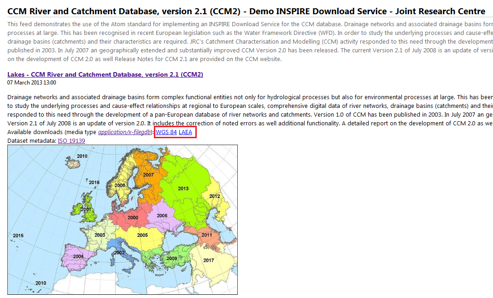
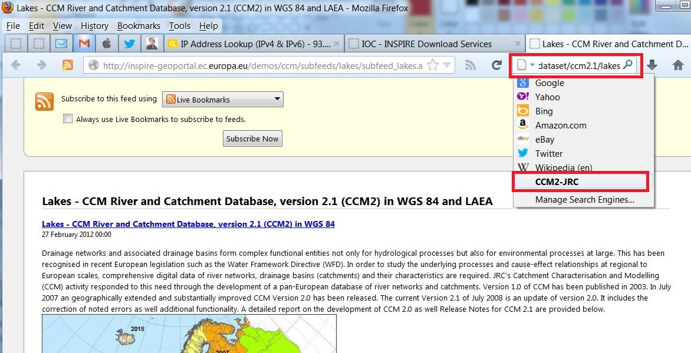

// Admonition icons:
// TG Requirement
:important-caption: 📕
// TG Recommendation
:tip-caption: 📒
// Conformance class
:note-caption: 📘

// TOC placement using macro (manual)
:toc: macro

// Empty TOC title (the title is in the document)
:toc-title:

// TOC level depth
:toclevels: 3

// Section numbering level depth
:sectnumlevels: 8

// Line Break Doc Title
:hardbreaks-option:

:appendix-caption: Annex

// Document properties
:title: Technical Guidance for the implementation of INSPIRE Download Services
:revdate: 2023-01-31
:keywords: INSPIRE Download Services
:producer: INSPIRE Maintenance and Implementation Group (MIG)
:description: This document defines technical guidance for INSPIRE Download Services
:keywords: INSPIRE Download Services
:author: Temporary MIWP 2021-2024 sub-group 2.3.1
:copyright: Public
:revremark: https://github.com/INSPIRE-MIF/technical-guidelines/releases/tag/2023.1
:lang: en

image:media/image1.png[image,width=107,height=107] **INSPIRE** *Infrastructure for Spatial Information in Europe*

[discrete]
= Technical Guidance for the implementation of INSPIRE Download Services

[width="100%",cols="29%,71%",]
|===
|*Title* |{doctitle}
|*Creator* |{author}
|*Date of publication* |{revdate}
|*Subject* |{keywords}
|*Status* |Version 3.2.0
|*Publisher* |{producer}
|*Type* |Text
|*Description* |{description}
|*Format* |AsciiDoc
|*Licence* |https://creativecommons.org/licenses/by/4.0[Creative Commons Attribution (cc-by) 4.0]
|*Rights* |{copyright}
|*Identifier* |https://inspire.ec.europa.eu/id/document/tg/download-services/[Technical Guidance Download Services v3.2.0]
|*Changelog* |{revremark}
|*Language* |{lang}
|*Relation* |Commission Regulation (EC) No 976/2009 of 19 October 2009 implementing Directive 2007/2/EC of the European Parliament and of the Council as regards the Network Services
|===

<<<
[discrete]
== Table of Contents
toc::[]

<<<
== Acknowledgements

Many individuals and organisations have contributed to the development of these Guidelines.

The Network Services Drafting Team responsible for the Technical Guidance v2.0 included: Jean-Jacques Serrano, Graham Vowles, Olaf Østensen, Didier Richard, Markus Müller, Lars Bernard, Michel Grothe, Marek Brylski, Lassi Lehto, Christian Elfers, Roland-Michael Wagner, Dominique Flandroit, Tapani Sarjakoski.

The Initial Operating Capability Task Force has assumed responsibility of the Technical Guidance document following v2.0 and an IOC TF Service Team was tasked to update the Technical Guidance Document. The following members of the Initial Operating Capability Task Force or the Initial Operating Capability Task Force Service Team have greatly contributed to this version: Anders Friis-Christensen (DK), Bart Cosyn (BE), Andreas von Dömming (DE), Timothy Duffy (UK), Jani Kylmäaho (FI), Gianluca Luraschi (EMSA), Clemens Portele (DE), Didier Richard (FR), Wolfgang Tinkl (AT).

The team at the Joint Research Centre of the European Commission that contributed to this version of the guidelines includes: Michele Chinosi, Ioannis Kanellopoulos, Michel Millot, Angelo Quaglia, Michael Lutz and Alexander Kotsev.

We are grateful to all the IOC Task Force Members who through their careful reviews and comments helped to correct a number of issues and made a valuable contribution to this edition.

Special thanks go to Dominic Lowe (UK) for the tremendous job he did in editing version 3.0 of the guidelines.

Finally we would like to thank Debbie Wilson from Snowflake Software for her comments and suggestions to version 3.0.

*Contact information*

Michael Lutz
European Commission
Joint Research Centre
Institute for Environment and Sustainability
TP262, Via Fermi 2749
I-21027 Ispra (VA)
ITALY
E-mail: michael.lutz@jrc.ec.europa.eu
Tel.: 39-0332-786759
http://ec.europa.eu/dgs/jrc/
http://inspire.jrc.ec.europa.eu/

<<<
== Foreword

Directive 2007/2/EC of the European Parliament and of the Council [*Directive 2007/2/EC*], adopted on 14 March 2007 aims at establishing an Infrastructure for Spatial Information in the European Community (INSPIRE) for environmental policies, or policies and activities that have an impact on the environment. INSPIRE will make available relevant, harmonised and quality geographic information to support the formulation, implementation, monitoring and evaluation of policies and activities, which have a direct or indirect impact on the environment.

INSPIRE is based on the infrastructures for spatial information established and operated by the 27 Member States of the European Union. The Directive addresses 34 spatial data themes needed for environmental applications, with key components specified through technical implementing rules. This makes INSPIRE a unique example of a legislative "regional" approach.

To ensure that the spatial data infrastructures of the Member States are compatible and usable in a Community and trans-boundary context, the Directive requires that common Implementing Rules (IR) are adopted in the following areas.

* Metadata;
* The interoperability and harmonisation of spatial data and services for selected themes (as described in Annexes I, II, III of the Directive);
* Network Services;
* Measures on sharing spatial data and services;
* Co-ordination and monitoring measures.

The Implementing Rules are adopted as Commission Decisions or Regulations, and are binding in their entirety.

In particular with respect the Network Services, Implementing Rules are required for the following services (Article 11(1) of the Directive):

[loweralpha]
. _"discovery services search for spatial datasets and spatial data services on the basis of the content of corresponding metadata, and display the metadata content;_
. _view services as a minimum, display, navigate, zoom in/out, pan, or overlay spatial datasets and display legend information and any relevant content of metadata;_
. _download services enabling copies of complete spatial datasets, or of parts of such sets, to be downloaded;_
. _transformation services enabling spatial datasets to be transformed with a view to achieving interoperability;_
. _invoke spatial data services" enabling data services to be invoked."_

In addition to the Implementing Rules, non-binding Technical Guidance documents describe detailed implementation aspects and relations with existing standards, technologies, and practices. They may need to be revised during the course of implementing the infrastructure to take into account the evolution of technology, new requirements, and cost benefit considerations. Figure 1. illustrates the relationship between the INSPIRE Regulations containing Implementing Rules and their corresponding Technical Guidance documents.

image::./media/image2.png[image,width=605,height=367, align=center]

[.text-center]
*Figure 1: Relationship between INSPIRE Implementing Rules and Technical Guidance*

Technical Guidance documents define how Member States might implement the Implementing Rules described in a Commission Regulation. Technical Guidance documents may include non-binding technical requirements that must be satisfied if a Member State chooses to conform to the Technical Guidance. Implementing this technical guidance will maximise the interoperability of INSPIRE services.

This Technical Guidance concerns the INSPIRE Download Services. The Technical Guidance contains detailed technical documentation highlighting the mandatory and the recommended elements related to the implementation of INSPIRE Download Services. The technical provisions and the underlying concepts are often illustrated by use case diagrams and accompanied by examples.

_Note that while the guidance in this document meets all the download service requirements for Annex I themes it may not be so suitable for some of the data in Annex II and III themes. If later data specifications relating to Annex II or Annex III themes should require additional functionality, like those covered by the OGC Web Coverage Service (WCS) or the OGC Sensor Observation Service (SOS), this Technical Guidance document will be extended accordingly. Likewise, other implementations (e.g. Linked Data) may be considered in future extensions of this Technical Guidance._

[cols="",]
|===
This document will be publicly available as a 'non-paper', as it does not represent an official position of the Commission, and as such cannot be invoked in the context of legal procedures.
|===

*Legal Notice*

Neither the European Commission nor any person acting on behalf of the Commission is responsible for the use which might be made of this publication.

<<<
== Revision History

[cols=",,,",options="header",]
|===
|*Date* |*Release* |*Editor* |*Description*
|25 Sep 2009 |2.0 |Network Services Drafting Team |Draft Technical Guidance (Published)
|14 Dec 2011 |2.1 |Dominic Lowe a|
Aligned structure with View and Download guidance.

Added Atom guidance and mappings.

General editorial changes.

|9 Jan 2012 |2.2 |Dominic Lowe |Major restructuring following IOC TF meeting.
|18 Jan 2012 |2.3 |Dominic Lowe |Further Atom guidance and WFS guidance. General editorial changes and formatting.
|2 Feb 2012 |2.4 |Dominic Lowe |Editing following teleconference and review by IOC TF members. Significant edits to Atom section. Restructured language requirements. Added table of WFS to IR mapping.
|10 Feb 2012 |2.5 |Dominic Lowe |Numerous detail edits in preparation for wider review. Added implementation roadmap diagram and extended capabilities section.
|17 Feb 2012 |2.6 |Dominic Lowe |Substantially revised mapping to IR section. Fixed issues with numbering of requirements and recommendations.
|02 Apr 2012 |2.6.5 |Dominic Lowe |Interim version for internal review, following 2.6 consultation. Major changes to Atom chapter.
|05 Apr 2012 |2.7 |Dominic Lowe |Added OpenSearch section, addressed many outstanding comments, Added section on Media types/compression.
|03 May 2012 |2.8 |Dominic Lowe |Many editorial changes and clarifications, changes to GeoRSS, OpenSearch sections, Diagrams.
|04 May 2012 |3.0rc |Dominic Lowe |Updated milestones. Edits in response to JRC comments.
|11 Jun 2012 |3.0rc2 |Dominic Lowe |Edited in response to IOC TF comments.
|12 Jun 2012 |3.0 |Dominic Lowe |Minor final corrections.
|16 Jul 2012 |3.0.1 |Dominic Lowe a|
Corrected georss:polygon coordinates in examples Example 2:, Example 12: and Example 20: as follows:

<georss:polygon>47.202 5.755 55.183 5.755 55.183 15.253 47.202 15.253 47.202 5.755 </georss:polygon>

Section 5.4, Example 35: (previously not numbered), OpenSearch Description document:

Changed from: 
<Url type="application/atom+xml" rel="results" template="http://xyz.org/search.php?q=\{searchTerms}"/>

to: 
<Url type="text/html" rel="results" template="http://xyz.org/search.php?q=\{searchTerms}"/>

|21 Feb 2013 |3.0.2 |Ioannis Kanellopoulos |Added Chapter 8 on Quality of Services
|9 Aug 2013 |3.1 |Angelo Quaglia, Michael Lutz, Alexander Kotsev a|
Updated sections 4 and 4.2 to enable the possibility of a "hybrid implementation" based on Atom for Part A and WFS for Parts B and C.

Added pointer to the demo instance of an Atom based Download Service at the beginning of Chapter 5.

Changed "application/vnd.iso.19139xml" to "application/xml" in text and examples in section 5.1.3.

Added note on metadata in Atom and WFS for "hybrid implementations" in section 5.1.3.

Added motivation for html alternative representation in section 5.1.7.

Removed reference to "application/vnd.ogc.csw.GetRecordByIdResponse_xml" in TG Requirement 6.

Added new sub-section 5.1.16. Download Service Feed: entry 'link' to WFS implementation, valid for hybrid implementations only.

Added explanation about how the OpenSearch document is introduced to satisfy the Network Service Regulation and about the fact that no requirements are placed on the technology used to implement the search script. Added note about the fact that the sample script uses content negotiation in section 5.4.

Extended section 5.4.2 on the generic search template; changed type to "text/html" in TG Requirement 41.

Explained machine-to-machine interaction for the Describe Spatial Data Set operation in section 5.4.3.

Added default values for CRS and language parameters in section 5.4.5, TG Requirement 43 and Example 40:.

Changed language code 'en-GB' to 'en' in Example 43:.

Changed 'application/zip' to 'application/x-filegdb' in Example 35:, Example 40: and Annex A.

Added 'Croatian' language in Table 1 and Table 2.

Added recommendation for single Stored Query with predefined identifier in Chapter 6.4 "Stored Query Support".

Modified TG Requirement 51 to include 'DataSetIdCode' and 'DataSetIdNamespace' parameters instead of the previously existing 'DataSetId'.

Added requirement for WFS-based Predefined data set download services that they only serve one data set per endpoint in Chapter 6.5 "INSPIRE Datasets and WFS Features".

Removed dependency of Conformance class 3 on conformance class 2 in section 7 and TG Requirement 61.

Moved subsections 6.2.2 "DescribeFeatureType Operation (language requirements)" and 6.6.3 "GetFeature Operation (language requirements" to Chapter 7.9.

Added new sub-section 7.10 for WFS metadata in case of hybrid Atom/WFS implementations.

|===

:sectnums:
<<<
== Introduction

Directive 2007/2/EC of the European Parliament and of the Council of 14 March 2007 establishing an Infrastructure for Spatial Information in the European Community (INSPIRE) was published in the official Journal on the 25th April 2007. The INSPIRE Directive entered into force on the 15th May 2007.

The purpose of the infrastructure is to enable the formulation, implementation, monitoring activities and evaluation of Community environmental policies at all levels – European, national and local – and to provide public information.

INSPIRE builds on the infrastructures for spatial information that have already been created by the Member States. The components of those infrastructures include: metadata, spatial data themes (as described in Annexes I, II, III of the Directive), network services and technologies; agreements on data sharing, access and use; coordination and monitoring mechanisms, processes and procedures.

The guiding principles of INSPIRE are:

* that the infrastructures for spatial information in the Member States should be designed to ensure that spatial data are stored, made available and maintained at the most appropriate level;

* that it is possible to combine spatial data from different sources across the Community in a consistent way and share them between several users and applications;

* that it is possible for spatial data collected at one level of public authority to be shared between all the different levels of public authorities;

* that spatial data are made available under conditions that do not restrict their extensive use; and

* that it is easy to discover available spatial data, to evaluate their fitness for purpose and to know the conditions applicable to their use.

The text of the INSPIRE Directive is available from available from the European Union Law website (EU-LEX) http://eur-lex.europa.eu/LexUriServ/LexUriServ.do?uri=CELEX:32007L0002:EN:NOT. The Directive identifies what needs to be achieved, and Member States have two years from the date of adoption to bring into force national legislation, regulations, and administrative procedures that define how the agreed objectives will be met taking into account the specific situation of each Member State. To ensure that the spatial data infrastructures of the Member States are compatible and usable in a Community and trans-boundary context, the Directive requires that common Implementing Rules (IR) are adopted in a number of specific areas. Implementing Rules are adopted as Commission Decisions, and are binding in their entirety.

According to Article 5(4) of the Directive, the INSPIRE Implementing Rules shall take account of relevant, existing international standards and user requirements.

The scope of this document is to detail the INSPIRE technical requirements for *Download Services* from the Implementing Rules, such that these services can be implemented consistently across Europe.

These Implementing Rules are, as much as possible, in conformance with European and international standards, current practices in stakeholder communities and relevant European initiatives such as e‑Government, and the EU interoperability framework.

<<<
== Normative references 

The following referenced documents are indispensable for the application of this document. For dated references, only the edition cited applies. For undated references, the latest edition of the referenced document (including any amendments) applies.

INSPIRE, Implementing Directive 2007/2/EC of the European Parliament and of the Council as regards interoperability of spatial datasets and services, *INSPIRE Directive*

IETF RFC 4287 The Atom Syndication Format, *ATOM*

GeoRSS-Simple The Simple Serialization of GeoRSS, http://www.georss.org/simple *GeoRSS*

OpenSearch Description Document format, http://www.opensearch.org/Specifications/OpenSearch/1.1 *OpenSearch*

ISO 19142:2010 Geographic information -- Web Feature Service, *ISO 19142*

ISO 19143:2010 Geographic information -- Filter encoding, *ISO 19143*

INSPIRE Network Services Regulation, *INS NS,* COMMISSION REGULATION (EU) No 976/2009 of 23 November 2010 as amended by Regulation (EC) No 1088/2010 as regards download services and transformation services

INSPIRE Metadata Regulation, *INS MD,* COMMISSION REGULATION (EC) No 1205/2008 of 3 December 2008 implementing Directive 2007/2/EC of the European Parliament and of the Council as regards metadata. See also Corrigendum to INSPIRE Metadata Regulation.

INSPIRE Metadata Implementing Rules, *IR MDTG,* Guidelines based on EN ISO 19115 and EN ISO 19119 for Commission Regulation (EC) No 1205/2008 of 3 December 2008 implementing Directive 2007/2/EC of the European Parliament and of the Council as regards metadata

INSPIRE spatial datasets and services Regulation, *INS SDS,* COMMISSION REGULATION (EU) No 1089/2010 of 23 November 2010 implementing Directive 2007/2/EC of the European Parliament and of the Council as regards interoperability of spatial datasets and services

W3C Protocol for Web Description Resources (POWDER): Description Resources, http://www.w3.org/TR/powder-dr/, *POWDER*

<<<
== Terms and abbreviations

=== Terms

[arabic, start=1]
. *download services* 
enabling copies of spatial datasets, or parts of such sets, to be downloaded and, where practicable, accessed directly [INSPIRE Directive]
. *INSPIRE registry* 
the official registry containing definitions for terms and feature concepts in INSPIRE. http://inspire-registry.jrc.ec.europa.eu/
. *metadata* 
information describing spatial datasets and spatial data services and making it possible to discover, inventory and use them [INSPIRE Directive]
. *network services* 
network services should make it possible to discover, transform, view and download spatial data and to invoke spatial data and e-commerce services [INSPIRE Directive]
. *spatial data*
data with a direct or indirect reference to a specific location or geographic area [INSPIRE Directive]
. *spatial dataset*
identifiable collection of spatial data [INSPIRE Directive]
. *dataset*
short term sometimes used instead of 'spatial dataset', same meaning as 'spatial dataset'.

=== Abbreviations

[width="100%", cols="14%, 86%"]
|===
|CRS|Coordinate Reference System
|FE|Filter Encoding, referring to ISO 19143
|GeoRSS|GeoRSS-Simple
|GET|HTTP Get Method
|GML|Geography Markup Language
|HTTP|Hypertext Transfer Protocol
|INSPIRE|Infrastructure for Spatial Information in Europe
|IR|Implementing Rule
|ISO|International Organisation for Standardisation
|JRC|Joint Research Centre
|NS|Network Services
|OGC|Open Geospatial Consortium
|OWS|OGC Web Services Common Specification
|WFS|Web Feature Service, referring to ISO 19142
|===

<<<
=== Verbal forms for the expression of provisions

In accordance with the ISO rules for drafting, the following verbal forms shall be interpreted in the given way:

* "shall" / "shall not": a requirement, mandatory to comply with the technical guidance
* "should" / "should not": a recommendation, but an alternative approach may be chosen for a specific case if there are reasons to do so
* "may" / "need not": a permission

*Technical Guidance Conformance Classes notation*

The Technical Guidance in this document is divided into Conformance Classes, so that it is possible to declare conformance to specific parts of the Technical Guidance. _To conform to a Conformance Class it is necessary to meet all of the Requirements (see next section) in that Conformance Class._

Conformance Classes are identified in the document as follows:

[NOTE]
====
*TG Conformance Class #: [TITLE]*
conformance classes are shown using this style
====

*Technical Guidance Requirements and Recommendations notation*

Requirements and the recommendations for INSPIRE Download Services within this technical guidance are highlighted and numbered as shown below:

[IMPORTANT]
====
*TG Requirement #*
requirements are shown using this style
====

[TIP]
====
*TG Recommendation #*
recommendations are shown using this style.
====

It is important to note that, implementation requirements and implementation recommendations may refer to either service or client implementations. Requirements and recommendations belong to the conformance class in which they are found in this document.

*Note*: It is worth noting that requirements as specified in the INSPIRE Regulations and Implementing Rules are legally binding, and that requirements and recommendations as specified in INSPIRE Technical Guidance are *not* legally binding. Therefore, within this technical guidance we have used the terms 'TG requirement' and 'TG recommendation' to indicate what is technically required or recommended to conform to the Technical Guidance.

*XML Example notation*

XML Examples are shown using Courier New on a grey background with yellow for emphasis as below:

[source,xml,subs="+quotes",align=center]
----
<inspire:example>
  <inspire:highlight>
    Highlighted Text for emphasis
  </inspire:highlight>
</inspire:example>
----

*Note*: XML Examples are informative and are provided for information only and are expressly not normative.

=== References

References within this document are denoted using "Section" or "Annex". For example, Section 5.3.1 or Annex A.

References to other documents refer to the list of normative references in Section 3 and use the abbreviated title as indicated in *Bold* text. For example, [*INS NS*] uses the abbreviated title for the document as shown below:

[.text-center]
INSPIRE Network Services Regulation, *INS NS,* COMMISSION REGULATION (EU) No 1088/2010 of 23 November 2010 amending Regulation (EC) No 976/2009 as regards download services and transformation services

References within other documents are show as above using the abbreviated title, together with the appropriate section within the document. For example, [*INS NS,* Section 2.2.3], refers to Section 2.2.3 within the document as listed above.

=== Future updates of this document

There are some issues that are foreseen, but are not covered or only partially covered in this version of the Technical Guidance.

These are:

* Pre-defined download of datasets contained in multiple physical files.
** Although some provision for multiple links is given in the current Atom guidance, it is foreseen that this solution may not be scalable for very large numbers of files and also that there is no way to provide metadata for individual files (e.g. geographic, temporal coverage). Other solutions will be explored.
* More WFS examples for Stored Queries and Direct Download.
* Guidance for Spatial Object Types that may be more suited to delivery via Web Coverage Services or Sensor Observation Services.

<<<
== INSPIRE Download Services

This document provides Technical Guidance for the implementation of technical service interfaces for INSPIRE Download Services. This guidance is based on the abstract model established in the INSPIRE Network Services Regulation [*INS NS*].

The Network Services Regulation describes the following four download operations [*INS NS*, Annex IV, Part A] that _must_ be implemented by Download Services:

* Get Download Service Metadata
* Get Spatial Dataset
* Describe Spatial Dataset
* Link Download Service

The Network Services Regulation also states that _where practicable_, the following two operations [*INS NS*, Annex IV, Part B] _shall_ be implemented by Download Services:

* Get Spatial Object
* Describe Spatial Object Type

Furthermore, _if_ the _Get Spatial Object_ and _Describe Spatial Object Type_ operations are implemented then particular search capabilities [*INS NS*, Annex IV, Part C] shall also be implemented. These capabilities include the ability to search by:

* URI of Spatial Dataset
* Key attributes of spatial objects, including URI and date/time of update
* Bounding Box
* Spatial data theme
* Combinations of the above

In practice therefore, this means there are _two_ types of Download Services that may be implemented; those that satisfy the minimum functional requirements from the Regulation [*INS NS*, Annex IV, Part A] and those that satisfy the full functional requirements [*INS NS*, Annex IV, Parts A, B & C]. As stated in the Regulation, the later should be implemented _where practicable_.

For the remainder of this document these two types of Download Service are referred to as follows:

* "Pre-defined dataset download service(s)";
+
[.text-rigth]
_A pre-defined dataset download service provides for the simple download of pre-defined datasets (or pre-defined parts of a dataset) with no ability to query datasets or select user-defined subsets of datasets. A pre-defined dataset or a pre-defined part of a dataset could be (for example) a file stored in a dataset repository, which can be downloaded as a complete unity with no possibility to change content, whether encoding, the CRS of the coordinates, etc._

* "Direct access download service(s)";
+
[.text-rigth]
_A direct access download service extends the functionality of a pre-defined dataset download service to include the ability to query and download subsets of datasets. The direct access download service allows more control over the download than the simple download of a pre-defined dataset or pre-defined part of a dataset. It can therefore be considered to be more 'advanced' than pre-defined dataset download. In this case, the spatial information is typically stored in a repository (e.g. a database) and only accessible through a middleware data management system (although the precise implementation may vary). The term direct access is used to mean the capability of a client application or client service to interact directly with the contents of the repository, e.g. by retrieving parts of the repository based upon a query. The query can be based upon spatial or temporal criteria, or by specific properties of the instances of the spatial object types contained in the repository._

In addition to the above definitions, a pre-defined dataset or a pre-defined part of a dataset is characterised by two conditions:

* _It has a metadata record and can be discovered using an INSPIRE conformant discovery service._
* _The metadata contains a link (URL – uniform resource locator) whereby the dataset or part of dataset can be immediately downloaded by a simple HTTP-protocol GET-request. The URL can optionally link to a resource where rights management services can be invoked prior to the simple download by use of HTTP-protocol._

Furthermore, note that the phrase 'part(s) of a dataset' refers only to _logical_ parts of a dataset. It does _not_ refer to _physical_ parts of a dataset, for example where a large dataset has been split into multiple files for storage or access reasons.

As an example, a logical 'part of a dataset' could be a road network for a single administrative region. This 'part dataset' would have its own metadata record as described above and would effectively act as a normal dataset in the INSPIRE infrastructure. This is in contrast to say, if a road network was split into 100 tiles for storage efficiency. In the latter case, the physical parts of the logical dataset would not be exposed with metadata records.

Of course there may be a correspondence between the logical and physical parts of a dataset.

The precise definition of what constitutes a particular pre-defined dataset or pre-defined part of datasets is a matter for individual data providers and will vary according to the context. However as indicated above an example of usage could be where the pre-defined dataset is a dataset conforming to one of the INSPIRE themes covering the whole Member State, while a pre-defined part of the dataset could be a subset of this, covering for instance an administrative subdivision of the Member State.

_NOTE For readability purposes, the short phrase "pre-defined dataset" is often used in this document. Whenever this phrase is encountered it should be interpreted as meaning the longer phrase "pre-defined dataset or a pre-defined part of a dataset". Where reference is made to physical parts of a dataset this is made explicit._

Figure 2 shows a typical sequence of operations used when downloading data from a pre-defined dataset download service.

image::./media/image3.png[image,width=605,height=379, align=center]

[.text-center]
*Figure 2: Simple sequence diagram showing download of datasets via a pre-defined download service*

Figure 3 shows a typical sequence of operations used when downloading data from a direct access dataset download service.

image::./media/image4.png[image,width=605,height=377, align=center]

[.text-center]
*Figure 3: Simple sequence diagram showing a typical sequence of operations to download spatial data objects from a direct access dataset download service.*

In both cases above, the end point for the _Get Download Service Metadata Request_ (i.e. the Atom feed or the WFS GetCapabilities) is taken from the Download Service ISO Metadata retrieved from the Discovery Service. More specifically the Resource Locator Metadata element shall include the link to the _Get Download Service Metadata Request._

The following sections of this document provide detailed Technical Guidance for implementing Download Services using existing standards:

* _Chapter 5_ contains Technical Guidance for implementing pre-defined dataset download services using the Atom syndication format [*ATOM*]
* _Chapter 6_ contains Technical Guidance for implementing pre-defined dataset download services using the ISO 19142 Web Feature Service [*ISO 19142]* and ISO 19143 Filter Encoding Specification [*ISO 19143]*
* _Chapter 7_ contains Technical Guidance for implementing direct access download services using the ISO 19142 Web Feature Service [*ISO 19142]* and ISO 19143 Filter Encoding [*ISO 19143]*

Anybody implementing Download Services following this Technical Guidance should therefore choose to do one (or more, but at least one) of the following for each Download Service provided:

* Satisfy the minimum functional requirements of the Regulation [*INS NS*, Annex IV, Part A] by following the Technical Guidance in Chapter 5 (using Atom).
* Satisfy the minimum functional requirements of the Regulation [*INS NS*, Annex IV, Part A] by following the Technical Guidance in Chapter 6 (using WFS).
* Satisfy the full functional requirements of the Regulation [*INS NS*, Annex IV, Parts A, B & C] by following the Technical Guidance in Chapters 6 _and_ 7 (using WFS & Filter Encoding).
* Satisfy the full functional requirements of the Regulation [*INS NS*, Annex IV, Parts A, B & C] by following the Technical Guidance in Chapters 5 _and_ 7 (using Atom and WFS & Filter Encoding). This case will be referred to as a "hybrid implementation" in this Technical Guidance.

Table 1 illustrates the relationship between the parts of the Regulation [*INS NS*, Annex IV] and the implementation choices presented in this document.

[cols=",,",options="header",]
|===
|*_Implementation choices_* |*Part A (mandatory)* |*Parts B & C (where practicable)*
|*_ATOM_* |Chapter 5 |Not possible with Atom
|*_WFS_* |Chapter 6 |Chapter 7
|===

[.text-center]
*Table 1: Possible implementation choices for Download Services*

In addition, the Network Services Regulation contains requirements for Quality of Service [*INS NS*, Annex I]. Technical Guidance for this is given in Chapter 8 and this Technical Guidance must be followed in addition to any Technical Guidance given in Chapters 5-7.

=== How the Technical Guidance maps to the Implementing Rules

The purpose of this Technical Guidance is to provide practical guidance for implementation that is guided by, and satisfies, the requirements of the underlying legislation. The tables in the following three sections demonstrate how the Atom and WFS implementations described in this document satisfy the legal requirements of the Network Services Regulation [*INS NS*]. The underlying legislation is rarely referred to in the rest of this document, so these tables should be referred back to if necessary.

==== Mapping the Atom-based Technical Guidance to the Implementing Rules

The following set of tables shows how the guidance for Atom implementations given in Chapter 5 satisfies the Network Services Regulation. Each operation is in a separate table.

[cols=",",]
|===
|*Get Download Service Metadata* |**M/O/C**footnote:[Mandatory/Optional/Conditional to conform with Network Services Regulation [*INS NS*]]
a|*Description in INS NS (Annex IV, Part A)*

Provides all necessary information about the service, the available Spatial Datasets, and describes the service capabilities.

* *Request parameters*
** Natural language to be used for the content of the response
* *Response parameters*
** Download Service Metadata
** Operations Metadata
** Languages
** Spatial Data Sets Metadata
|M
|===

[cols=",",]
|===
2+|*_Recommended Atom-based implementation_*
*_(satisfies pre-defined download only)_*
|*_Get Download Service Metadata Request_* a|
Metadata records for Download Services shall be available in a Discovery Service. The Resource Locator metadata element for the Download Service shall contain a link to the Atom feed.

The Get Download Service Metadata request is an HTTP GET request to the Download Service to retrieve the Atom feed.

|*_Get Download Service Metadata Response_* |The response from the Download Service will be an Atom feed which includes the download service INSPIRE metadata, operations metadata, response and supported languages, spatial data sets metadata and their corresponding CRS. See Section 5.1.
|===

*Table 2: Get Download Service Metadata – Atom Implementation*

[cols=",",]
|===
|*Get Spatial Data Set* |*M/O/C*
a|*Description in INS NS (Annex IV, Part A)*

The Get Spatial Data Set operation allows the retrieval of a Spatial Dataset.

* *Request parameters*
** Language
** Spatial Data Set Identifier
** Coordinate Reference System
* *Response parameters*
** Requested Spatial Data Set in the requested language and CRS
|M
|===

[cols=",",]
|===
2+|*_Recommended Atom-based implementation_*
*_(satisfies pre-defined download only)_*
|*_Get Spatial Data Set Request_* a|
Pre-defined spatial datasets can be retrieved using the URL template identified by rel="results" in the OpenSearch description document. The request contains the CRS, Spatial Data Set Identifier and language as parameters.

Pre-defined spatial datasets can also be retrieved by following link elements in Atom feed entries as described in Section 5.2.2

An HTTP GET request is made to the link target.

|*_Get Spatial Data Set Response_* |The response will be a pre-defined spatial dataset in the requested language and CRS.
|===

*Table 3: Get Spatial Data Set – Atom Implementation*

[cols=",",]
|===
|*Describe Spatial Dataset* |*M/O/C*
a|*Description in INS NS (Annex IV, Part A)*

This operation returns the description of all the types of Spatial Objects contained in the Spatial Dataset.

* *Request parameters*
** Language
** Spatial Data Set Identifier
* *Response parameters*
** Description of the Spatial Objects in the requested Spatial Data Set and requested language
|M
|===

[cols=",",]
|===
2+|*_Recommended Atom-based implementation_*
*_(satisfies pre-defined download only)_*
|*_Describe Spatial Data Set Request_* |The Describe Spatial Data Set Request is issued using the URL template identified by rel="describedby" in the OpenSearch description document. The request contains the Spatial Data Set Identifier and Language as parameters.
|*_Describe Spatial Data Set Response_* |The response is another Atom Feed (a "Dataset Feed" ) containing links to descriptions of the Spatial Object Types in the <link rel="describedby"> element. Reference to the INSPIRE Registry as described in Section 5.2.1 should be made where possible.
|===

*Table 4: Describe Spatial Data Set – Atom Implementation*

[cols=",",]
|===
|*Link Download Service* |*M/O/C*
|*Description in INS NS (Annex IV, Part A)*

Allows the declaration, by a Public Authority or a Third Party, of the availability of a Download Service for downloading Spatial Datasets or, where practicable, Spatial Objects, through the Member State's Download Service while maintaining the downloading capability at the Public Authority or the Third Party location.
|M
|===

[cols="",]
|===
|*_Recommended Atom-based implementation_*
*_(satisfies pre-defined download only)_*

|To be implemented by uploading the appropriate metadata to the INSPIRE network as referred to in Article 11 using the PublishMetadata function of an INSPIRE compliant discovery service |
|===

*Table 5: Link Download Service – Atom Implementation*

==== Mapping the WFS-based Technical Guidance to the Implementing Rules

The following set of tables shows how the guidance for WFS implementations given in Chapters 6 and 7 satisfies the Network Services Regulation. Again, each operation is in a separate table.

[cols=",",]
|===
|*Get Download Service Metadata* |*M/O/C*
a|
*Description in INS NS (Annex IV, Part A)*

Provides all necessary information about the service, the available Spatial Datasets, and describes the service capabilities.

* *Request parameters*
** Natural language to be used for the content of the response
* *Response parameters*
** Download Service Metadata
** Operations Metadata
** Languages
** Spatial Data Sets Metadata
|M
|===

[cols=",",]
|===
2+|*_Recommended WFS-based implementation_*
|*_Get Download Service Metadata Request_* a|
Metadata records for Download Services shall be available in a Discovery Service. The Resource Locator metadata element for the Download Service shall contain a link to the GetCapabilities of the WFS..

The Get Download Service Metadata request is a GetCapabilities request to the WFS indicated in the metadata record.

|*_Get Download Service Metadata Response_* |The Get Download Service Metadata Response will be a WFS capabilities document, which includes the download service INSPIRE metadata, operations metadata, response and supported languages, spatial data sets metadata and their corresponding CRS.
|*_WFS/FE Conformance Classes_* |ISO 19142: Simple WFS, HTTP Get
|===

*Table 6: Get Download Service Metadata - WFS Implementation*

[cols=",",]
|===
|*Get Spatial Data Set* |*M/O/C*
a|
*Description in INS NS (Annex IV, Part A)*

The Get Spatial Data Set operation allows the retrieval of a Spatial Dataset.

* *Request parameters*
** Language
** Spatial Data Set Identifier
** Coordinate Reference System
* *Response parameters*
** Requested Spatial Data Set in the requested language and CRS

|M
|===

[cols=",",]
|===
|*_Recommended WFS-based implementation_* |
|*_Get Spatial Data Set Request_* a|
Pre-defined spatial datasets in different CRS/DataSetIdCode/ DataSetIdNamespace/language combinations can be retrieved using Stored Queries as described in Section 6.4

A GetFeature request shall be made to a WFS that uses a StoredQuery for the pre-defined dataset.

|*_Get Spatial Data Set Response_* |The WFS shall return a set of features corresponding to the pre-defined dataset in the requested language and CRS.
|*_WFS/FE Conformance Classes_* a|
ISO 19142: Simple WFS, HTTP Get

ISO 19143: Query
|===

*Table 7: Get Spatial Data Set - WFS Implementation*

[cols=",",]
|===
|*Describe Spatial Dataset* |*M/O/C*
a|
*Description in INS NS (Annex IV, Part A)*

This operation returns the description of all the types of Spatial Objects contained in the Spatial Dataset.

* *Request parameters*
** Language
** Spatial Data Set Identifier
* *Response parameters*
** Description of the Spatial Objects in the requested Spatial Data Set and requested language.

|M
|===

[cols=",",]
|===
2+|*_Recommended WFS-based implementation_*
|*_Describe Spatial Data Set Request_* a|
The spatial object types are described in the GetCapabilities response of the WFS.

A GetCapabilities request is made to a WFS.

|*_Describe Spatial Data Set Response_* |The WFS shall return a valid Capabilities document in the requested language, which identifies the Spatial Object types available.
|*_WFS/FE Conformance Classes_* |ISO 19142: Simple WFS, HTTP Get
|===

*Table 8: Describe Spatial Data Set - WFS Implementation*

[cols=",",]
|===
|*Link Download Service* |*M/O/C*
a|
*Description in INS NS (Annex IV, Part A)*

Allows the declaration, by a Public Authority or a Third Party, of the availability of a Download Service for downloading Spatial Datasets or, where practicable, Spatial Objects, through the Member State's Download Service while maintaining the downloading capability at the Public Authority or the Third Party location.

|M
|===

[cols=",",]
|===
2+|*_Recommended WFS-based implementation_*
|To be implemented by uploading the Download Service INSPIRE metadata to the INSPIRE network as referred to in Article 11 using the PublishMetadata function of an INSPIRE compliant discovery service. The Resource Locator metadata element of the Download Service metadata record shall contain a link to the Atom Feed and/or the WFS GetCapabilities document. |
|*_WFS/FE Conformance Classes_* |None
|===

*Table 9: Link Download Service - WFS Implementation*

[cols=",",]
|===
|*Get Spatial Object* |*M/O/C*
a|
*Description in INS NS (Annex IV, Part B)*

This operation allows the retrieval of Spatial Objects based upon a query.

* *Request parameters*
** Language
** Spatial Data Set Identifier
** Coordinate Reference System
** Query
* *Response parameters*
** Spatial Objects Set
** Spatial Objects Set Metadata

a|
O

(Direct access download only)
|===

[cols=",",]
|===
2+|*_Recommended WFS-based implementation_*
|*_Get Spatial Object Request_* a|
The WFS provides support for ad-hoc queries as defined in TG Requirement 63.

A GetFeature request with required query arguments is made to the WFS.

|*_Get Spatial Object Response_* |The WFS returns a set of features that meet the requirements of the query expression.
|*_WFS/FE Conformance Classes_* a|
ISO 19142: Simple WFS, HTTP Get

ISO 19143: Query, Ad hoc Query

|===

*Table 10: Get Spatial Object - WFS Implementation*

[cols=",",]
|===
|*Describe Spatial Object Type* |*M/O/C*
a|
*Description in INS NS (Annex IV, Part B)*

This operation returns the description of the specified Spatial Objects types [sic].

* *Request parameters*
** Language
** Spatial Object Type
* *Response parameters*
** Description of the Spatial Object Type in conformity with regulation (EU) No.1089/2010

a|
O

(Direct access download only)
|===

[cols=",",]
|===
2+|*_Recommended WFS-based implementation_*
|*_Request_* |A DescribeFeatureType request is made to the WFS.
|*_Response_* |The WFS responds with the XML schema for the requested Spatial Object types
|*_WFS/FE Conformance Classes_* |ISO 19142: Simple WFS, HTTP Get
|===

*Table 11: Describe Spatial Object Type - WFS Implementation*

[cols=",",]
|===
|*Search Criteria for the Get Spatial Object Operation* |*M/O/C*
a|
*Description in INS NS (Annex IV, Part C)*

For the purposes of the Get Spatial Object Operation of the Download Service,

the following search criteria shall be implemented:

* Unique Resource Identifier{empty}* of Spatial Dataset,

* all relevant key attributes and the relationship between Spatial Objects as set out in Regulation (EU) No 1089/2010; in particular the Unique Identifier of Spatial Object and the temporal dimension characteristics, including the date of update,

* bounding box, expressed in any of the Coordinate Reference Systems listed in Regulation (EU) No 1089/2010,

* Spatial Data Theme.

To allow for discovering spatial objects through a combination of search criteria, logical and comparison operators shall be supported.

{empty}* The phrase 'Unique Identifier of Spatial Object' should be interpreted in this Technical Guidance as being the 'External unique object identifier' as set out in section 2.1 of Annex I of (EU) No 1089/2010 [INS SDS].

a|
O

(Direct access download only)
|===

[cols=",",]
|===
|*_Recommended WFS-based implementation_* |
|*_Request_* a|
Various ad hoc query capabilities are provided by the Filter Encoding Specification (TG Requirement 63 to TG Requirement 68).

A GetFeature request may be made with Query arguments.

|*_Response_* |The WFS returns a set of features that meet the requirements of the query expression.
|*_WFS/FE Conformance Classes_* a|
ISO 19142: Simple WFS, HTTP Get, Basic WFS

ISO 19143: Query, Ad hoc Query, Resource Identification, Minimum Standard Filter, Minimum Spatial Filter, Minimum Temporal Filter, Minimum XPath

|===

*Table 12: Search Capabilities - WFS Implementation*

==== Mapping of Spatial Data Set Identifier parameter

The Spatial Data Set Identifier parameter is defined in the Network Service regulation [*INS NS*] as _"The Spatial Data Set Identifier parameter shall contain the Unique Resource Identifier of the Data Set"_

The following table demonstrates how the Spatial Data Set Identifier is mapped between the Atom and WFS based Technical Guidance and the corresponding ISO metadata of the spatial data set. The Spatial Data Set Identifier parameter maps to either the RS_Identifier or the MD_Identifier depending on what type of Spatial Data Set Identifier is used in the corresponding ISO metadata.

[width="100%", cols="10%,30%,30%,30%",options="header",]
|===
| |*INSPIRE Download Service* |*RS_Identifier* |*MD_Identifier*
|*WFS* |inspire_dls:SpatialDataSetIdentifier/inspire_common:Code |gmd:RS_Identifier/code |gmd:MD_Identifier/code
| |inspire_dls:SpatialDataSetIdentifier/inspire_common:Namespace |gmd:RS_Identifier/codespace |
|*ATOM* |spatial_dataset_identifier_code |gmd:RS_Identifier/code |gmd:MD_Identifier/code
| |spatial_dataset_identifier_namespace |gmd:RS_Identifier/codespace |
|===

*Table 13: Mapping the Spatial Data Set Identifier parameter*

=== Conformance Classes for Download Services Technical Guidance

In order to declare a level of conformance with this Technical Guidance it is necessary to meet the requirements of any conformance class to which conformance is declared.

The following conformance classes are defined in this document.

[cols=",,,",options="header",]
|===
|*Conformance Class* |*Description* |*M/O/C* |*Chapter*
|1: Pre-defined Atom |Implementation of pre-defined download service using Atom |C, shall be M if "WFS pre-defined" is not conformed to |5
|2: Pre-defined WFS |Implementation of pre-defined download service using WFS |C, shall be M if "Atom pre-defined" is not conformed to |6
|3: Direct WFS |Implementation of direct access download service using WFS |O |7
|4: Quality of Service |Quality of Service criteria and requirements |M |8
|===

*Table 14: Conformance Classes for Download Service Technical Guidance*

Conformance may be declared in the Download Service ISO 19139 metadata record. Since the metadata record requires conformance to a specification rather than a part of a specification, it is suggested that the form _technicalGuidance#levelN_ is used, where _technicalGuidance_ refers to this document and _N_ refers to the conformance class (e.g. _technicalGuidance#level2_).

Also the conformance with several conformance classes can be specified. For example, for a "hybrid" implementation based on Atom for Part A and WFS for Parts B and C, which meets the quality of service requirements could declare conformance with _technicalGuidance#level1, technicalGuidance#level3 and technicalGuidance#level4._

If a WFS service does not conform to Part A of [*INS NS,* Annex IV], it cannot on its own be considered compliant with the requirements of the Regulation. Only the combination of an Atom or WFS service conformant with part A with a WFS conformant to Parts B and C can be considered compliant.

=== Language Requirements

The Network Services Regulation requires that multilingual aspects for network services are supported [*INS NS*]. As there is no standard way to deal with multilingualism within the current ISO or OGC specifications, the following basic principles shall be used for INSPIRE Network Services (including Download Services):

    A network service [Download Service] metadata response shall contain a list of the natural languages supported by the service. This list shall contain one or more languages that are supported.

    A client may specify a specific language in a request. If the requested language is contained in the list of supported languages, the natural language fields of the service response shall be in the requested language. If the requested language is not supported by the service, then this parameter shall be ignored.

For each relevant Conformance Class in this document these statements are defined as requirements and additional implementation guidance is given.

=== Implementation Roadmap for Download Services

_Note: This section is entirely informative and is here simply to assist with practical implementations. It has no legal basis and is not any way intended to supplement, modify or replace any legally binding statements made elsewhere._

The milestones (including dates) for implementation of all INSPIRE Services are outlined in the INSPIRE Implementation Roadmap which can be found at: http://inspire.jrc.ec.europa.eu/index.cfm/pageid/44

In order to provide clear Technical Guidance for implementation it is useful to expand upon the meaning and practical implications of the roadmap milestones that relate to Download Services.

_Note that the INSPIRE Implementation Roadmap does not make any distinction between pre-defined dataset download services and direct access download services as described in this document. The timescales and milestones for both are the same, the only discriminator being that direct access download services should be implemented where practicable_.

In the initial stages of the INSPIRE Implementation Roadmap, datasets made available via Download Services are not required to be compliant with the thematic Data Specifications and may be provided via Download Services in existing formats 'as-is'. So for convenience we shall refer to these here as "_non-interoperable_" Download Services.

In later stages of the INSPIRE Implementation Roadmap datasets made available via Download Services _are_ expected to be compliant with the thematic Data Specifications, i.e. the _data_ delivered via these services must conform to the requirements of the thematic Data Specifications. So, again for convenience only, we shall refer to these here as "_interoperable_" Download Services.

Since the timescales for Annex I, II and III themes differ there is some overlap between the implementation timescales of non-interoperable and interoperable Download Services.

Sections 4.4.1 to 4.4.3 provide additional guidance to help with the interpretation of those milestones, which are relevant to the provision of Download Services.

==== Roadmap for "non-interoperable" Download Services

The milestones in Table 15 (below) can be interpreted to mean that datasets should be made available for download via Download Services but the datasets _do not_ have to be formatted according to the INSPIRE Data Specifications*.

*_This interpretation was clarified during the workshop on legal issues held on the 17th of June 2010 in Brussels with Q&A available at:_ http://inspire.jrc.ec.europa.eu/documents/INSPIRE_/INSPIRE_legal_issues.PDF _(page 18, final question and question part (c) page 28)_

For the latest dates of these milestones please refer to the INSPIRE Implementation Roadmap.

[width="100%", cols="10%,30%,30%,30%",options="header",]
|===
| |*_Milestone_* |*_Article*_* |*_Technical Guidance_*
|*MS1* |*Member States shall provide the Download Services with initial operating capability* |16 |For _Annex I and II_ datasets, Download Services shall be provided, although these services need not fully comply with the Network Services implementing rules at this point. The _data_ delivered by these services do not need to comply with the thematic Data Specifications.
|*MS2* |*Download services operational* |16 |For _Annex I and II_ datasets, fully compliant (with IR NS) Download Services shall be provided. The _data_ delivered by these services do not need to comply with the thematic Data Specifications.
|*MS3* |*Metadata available for spatial datasets and services corresponding to Annex III* |6(b) |For Annex III datasets, fully compliant (with IR NS) Download Services shall be provided. The _data_ delivered by these services do not need to comply with the thematic Data Specifications.
|===

*Table 15: Milestones for "non-interoperable" Download Services*

*From the INSPIRE Directive

==== Roadmap for "interoperable" Download Services

The milestones in Table 16 (below) can be interpreted to mean that datasets should be made available for download via Download Services in a way that is _compliant_ with the requirements of the Data Specifications as well as the Network Services requirements.

[width="100%", cols="10%,30%,30%,30%",options="header",]
|===
| |*_Milestone_* |*_Article*_* |*_Technical Guidance_*
|*MS4* |*Implementation of Commission Regulation (EU) No 102/2011 of 4 February 2011 amending Regulation (EU) No 1089/2010 implementing Directive 2007/2/EC of the European Parliament and of the Council as regards interoperability of spatial datasets and services for newly collected and extensively restructured Annex I spatial datasets available* |7§3, 9(a) |Newly collected or extensively restructured Annex I datasets shall be made available via Download Services in a way that is compliant with both Data Specifications and Network Services requirements.
|*MS5* |*_Newly collected and extensively restructured Annex II and III spatial datasets available_* |7§3, 9(b) |Newly collected or extensively restructured Annex II and III datasets shall be made available via Download Services in a way that is compliant with both Data Specifications and Network Services requirements.
|*MS6* |*Implementation of Commission Regulation (EU) No 1089/2010 of 23 November 2010 implementing Directive 2007/2/EC of the European Parliament and of the Council as regards interoperability of spatial datasets and services for other Annex I spatial datasets still in use at the date of adoption* |7§3, 9(a) |All Annex I datasets still in use shall be made available via Download Services in a way that is compliant with both Data Specifications and Network Services requirements.
|*MS7* |*Other Annex II and III spatial datasets available in accordance with IRs for Annex II and III* |7§3, 9(b) |All Annex II and III datasets still in use shall be made available via Download Services in a way that is compliant with both Data Specifications and Network Services requirements.
|===

*Table 16: Milestones for "interoperable" Download Services*

*From the INSPIRE Directive

==== Illustrative Roadmap for all Download Services

The roadmap described above in sections 4.4.1 and 4.4.2 is further illustrated in Figure 4:

image::./media/image5.png[image,width=605,height=419, align=center]

[.text-center]
*Figure 4: Illustration of Implementation Roadmap**

_*Dates in this figure are accurate at the time of publication. For definitive dates refer to the roadmap published on the INSPIRE website: (http://inspire.jrc.ec.europa.eu/index.cfm/pageid/44)_

<<<
== Atom Implementation of Pre-defined Dataset Download Service

[NOTE]
====
*TG Conformance Class 1: Pre-defined Atom:*
Implement Pre-Defined Dataset Download Service ("Part A") using Atom

_This conformance class is inclusive of:_

_TG Requirement 1 to_ _TG Requirement 45_

_TG Recommendation 1 to_ _TG Recommendation 12_
====

An operational implementation of an INSPIRE Atom based Download Service implementation is available on the INSPIRE Geoportal:

[cols="20%,80%"]
|===
|Demo |http://inspire-geoportal.ec.europa.eu/demos/ccm/
|Top feed |http://inspire-geoportal.ec.europa.eu/demos/ccm/democcmdownloadservice.atom.en.xml
|Code inspector a|
http://inspire-geoportal.ec.europa.eu/demos/ccm/codeview.html

This web page displays the source code of the Atom feeds and of the OpenSearch description document of the demo. When clicking on specific rows of the code or description, the text of the relevant requirement is displayed.

|===

This Technical Guidance recommends the Atom syndication format [*ATOM*] as one way to implement pre-defined dataset download services with a minimal implementation cost and complexity. Section 4.1.1 contains a descriptive mapping between the Network Services Regulation [*INS NS*] and the guidance in this chapter.

The Atom syndication format provides a simple, widely understood mechanism for publishing information on the web in the form of feeds in a way that is compatible with existing web architecture and many tools. In addition Atom is supplemented in this guidance by OpenSearch which provides a service-type interface to the static atom documents.

As described in the Atom standard [*ATOM*], Atom is an XML-based document format that describes lists of related information known as "feeds". These feeds are then composed of a number of items, known as "entries", each with an extensible set of elements that contain information about the entry. For example, each entry has a title. Entries may also contain additional feeds.

*_Example 1: Sample Atom feed, containing two entries:_*
[source, xml]
<?xml version="1.0" encoding="utf-8"?>
<feed xmlns="http://www.w3.org/2005/Atom">
 	<title>Simple Atom feed example</title>
  <link href="http://myexample.com/"/>
  <updated>2011-12-14T13:16:32Z</updated>
  <author>
     <name>A. N. Other</name>
  </author>
  <id>urn:uuid:8fa70ca0-2659-11e1-bfc2-0800200c9a66</id>
  <entry>
     <title>My first Atom entry</title>
     <link href="http://myexample.com/atom123abc"/>
     <id>urn:uuid:c53a6970-2659-11e1-bfc2-0800200c9a66 </id>
     <updated>2011-12-14T13:15:02Z</updated>
     
This is an entry in a feed

  </entry>
  <entry>
     <title>My second Atom entry</title>
     <link href="http://myexample.com/atom456xyz"/>
     <id>urn:uuid: f80b23d0-2659-11e1-bfc2-0800200c9a66</id>
     <updated>2011-12-14T13:16:32Z</updated>
     
This is another entry in a feed

  </entry>
</feed>

This Technical Guidance recommends using Atom feeds to make available pre-defined datasets in a consistent manner. The guidance in this chapter can be summarised at a high-level as follows:

* A single Atom feed is published as a top-level "Download Service Feedfootnote:[the terms "Download Service Feed(s)" and "Dataset Feed(s)" are used in this chapter to differentiate between the two types of feed. However the terms have no wider meaning in INSPIRE (legally or otherwise).]".

* This feed contains a link to an OpenSearch description document which provides operations metadata for the Download Service. The OpenSearch description document provides information about the operations implemented by the download service.

* This feed contains one or more Atom entries: one per pre-defined data set.

* Each of these Atom entries shall contain a link to _another_ Atom Feed (a "Dataset Feed") that describes the particular pre-defined data set.

* Each of these "Dataset Feeds" shall contain Atom Entries with links to download the pre-defined dataset in different formats (e.g. in GML, ShapeFile, etc.) and in different Coordinate Reference Systems. One link shall be provided for each format/CRS combination.

* Feeds may be provided in multiple languages (as described in Section 5.3)

This pattern is illustrated further in Figure 5.

[IMPORTANT]
====
*TG Requirement 1*
Pre-defined Dataset Download Service implementations shall publish separate datasets as individual entries within an Atom feed.
====

[IMPORTANT]
====
*TG Requirement 2*
All Atom feeds (and entries in feeds) shall conform to all the requirements in the Atom specification, RFC 4287.
====

In addition the Atom feeds are supplemented with GeoRSS information to enable integration in tools that support this format (e.g. Google Earth).

[IMPORTANT]
====
*TG Requirement 3*
All GeoRSS information in Atom feeds shall conform to the GeoRSS-Simple specification.
====

In addition the Atom feeds are supplemented with OpenSearch information to as a way to specify operations for the Download Service.

[IMPORTANT]
====
*TG Requirement 4*
All OpenSearch information in Atom feeds shall conform to the OpenSearch specification.
====

It is also possible to enrich the Atom feeds with XML content from other schemes although discussion of this is beyond the scope of the Technical Guidance.

image::./media/image6.png[image,width=605,height=402, align=center]

[.text-center]
*Figure 5 Overview of Atom feed structures*

=== Atom "Download Service Feed" containing an entry for a Pre-defined dataset 

The following Download Service Feed example contains a single Atom entry which points to the Dataset Feed for a pre-defined dataset, in this case a Hydrography dataset. The Dataset Feed is described in Section 5.2. This example is conformant to the Pre-defined Atom conformance class and can be used as a template for implementation.

*_Example 2: Sample "Download Service Feed" (Atom) with an entry for a Hydrography dataset_*
[source, xml]
<!-- Example "Download Service Feed" -->
<feed xmlns="http://www.w3.org/2005/Atom"
    xmlns:georss="http://www.georss.org/georss" xmlns:inspire_dls="http://inspire.ec.europa.eu/schemas/inspire_dls/1.0" xml:lang="en">
    <!-- feed title -->
    <title>XYZ Example INSPIRE Download Service</title>
    <!-- feed subtitle -->
    <subtitle>INSPIRE Download Service of organisation XYZ providing Hydrography data</subtitle>
    <!-- link to download service ISO 19139 metadata -->
    <link href="http://xyz.org/metadata/iso19139_document.xml" rel="describedby" type="application/xml"/>
    <!-- self-referencing link to this feed -->
    <link href="http://xyz.org/download/en.xml" rel="self" type="application/atom+xml"
        hreflang="en" title="This document"/>
    <!-- link to Open Search definition file for this service-->
	<link rel="search" href="http://xyz.org/search/opensearchdescription.xml" type="application/opensearchdescription+xml" title="Open Search Description for XYZ download service"/>
    <!-- link to this feed in another language -->
    <link href="http://xyz.org/download/de.xml" rel="alternate"
        type="application/atom+xml" hreflang="de"
        title="The download service information in German"/>
    <!-- link to another representation of this feed (HTML) --> 
    <link href="http://xyz.org/download/index.html" rel="alternate"
        type="text/html" hreflang="en"
        title="An HTML version of this document"/>
    <!-- link to this feed in HTML in another language-->
    <link href="http://xyz.org/download/index.de.html" rel="alternate"
        type="text/html" hreflang="de"
        title="An HTML version of this document in German"/>
    <!-- identifier -->
    <id>http://xyz.org/download/en.xml</id>
    <!-- rights, access restrictions -->
    <rights>Copyright (c) 2012, XYZ; all rights reserved</rights>
    <!-- date/time this feed was last updated -->
    <updated>2012-03-31T13:45:03Z</updated>
    <!-- author contact information -->
    <author>
        <name>John Doe</name>
        <email>doe@xyz.org</email>
    </author>
    <!-- entry for a "Dataset Feed" for a pre-defined dataset -->
    <entry>
        <!-- title for "Dataset Feed" for pre-defined dataset -->
        <title>Water network ABC Dataset Feed</title>
		   <!--Spatial Dataset Unique Resource Identifier for this dataset-->
	<inspire_dls:spatial_dataset_identifier_code>wn_id1</inspire_dls:spatial_dataset_identifier_code>                                  <inspire_dls:spatial_dataset_identifier_namespace>http://xyz.org/</inspire_dls:spatial_dataset_identifier_namespace>
		   <!-- link to dataset metadata record -->
    		 <link href="http://xyz.org/metadata/abcISO19139.xml" rel="describedby" type="application/xml"/>
        <!-- link to "Dataset Feed" for pre-defined dataset -->
        <link rel="alternate" href="http://xyz.org/data/waternetwork_feed.xml" type="application/atom+xml" 
        hreflang="en" title="Feed containing the pre-defined waternetwork dataset (in one or more downloadable formats)"/>
        <!-- link to related WFS implementing Direct Access operations -->
        <link rel="related" href="http://xyz.org/wfs?request=GetCapabilities&amp;service=WFS&amp;version=2.0.0" type="application/xml" title="Service implementing Direct Access operations"/>
        <!-- identifier for "Dataset Feed" for pre-defined dataset -->
        <id>http://xyz.org/data/waternetwork_feed.xml</id>
        <!-- rights, access info for pre-defined dataset -->
        <rights>Copyright (c) 2002-2011, XYZ; all rights reserved</rights>
        <!-- last date/time this entry was updated -->
		   <updated>2012-03-31T13:45:03Z</updated>
		   <!-- summary -->
		   
This is the entry for water network ABC Dataset

        <!-- optional GeoRSS-Simple polygon outlining the bounding box of the pre-defined dataset described by the entry. Must be lat lon -->
        <georss:polygon>47.202 5.755 55.183 5.755 55.183 15.253 47.202 15.253 47.202 5.755</georss:polygon>
        <!-- CRSs in which the pre-defined Dataset is available -->
			<category term="http://www.opengis.net/def/crs/EPSG/0/25832"  label="ETRS89 / UTM zone 32N"/>
			<category term="http://www.opengis.net/def/crs/EPSG/0/4258"  label="ETRS89"/>
    </entry>
    <!-- Any number of "Dataset Feeds" for different pre-defined datasets may be added here as separate entries -->
</feed>

Note that only some of the mandatory INSPIRE Metadata elements for the Download service have been mapped to the Atom feed files.

[cols=",",options="header",]
|===
a|
*INSPIRE Metadata elements*

*(Mandatory - Conditional)*

|*Atom implementation*
|Resource Title (M) |/feed/title
|Resource Abstract (M) |/feed/subtitle
|Resource Type (M) |Not mapped
|Resource Locator (C) a|
Feed level link in the top Atom feed

/feed/link[@rel="self"]

|Coupled Resource (C) a|
Entry level link in the top Atom feed

/feed/entry/link[@rel="describedby"]

|Spatial Data Service Type (M) |Not mapped
|Keyword (M) |Not mapped
|Geographic Bounding Box (C) |Not mapped
|Temporal Reference (M) |Not mapped
|Spatial Resolution (C) |Not mapped
|Conformity (M) |Not mapped
|Conditions for Access and Use (M) |Not mapped
|Limitations on Public Access (M) a|
Feed level link in the top Atom feed

/feed/rights

|Responsible Organisation (M) a|
Feed level link in the top Atom feed

/feed/author

|Metadata Point of Contact (M) |Not mapped
|Metadata Date (M) a|
Feed level link in the top Atom feed

/feed/updated

|Metadata Language (M) a|
Feed level link in the top Atom feed

/feed/link[@rel="self"]/@hreflang

|===

*Table 17: Mapping of INSPIRE Metadata elements to Atom*

All the required INSPIRE metadata elements are to be found in the linked ISO 19139 metadata document for the Download service as explained in Section 5.1.3.

The following sections explain in more detail how this example Atom feed is formed and what must be done to meet particular Technical Guidance requirements.

==== Download Service Feed: feed 'title' element

The title element shall be used to provide a title for the feed as a whole. Typically this will correspond with the 'Resource Title' in the corresponding service metadata record.

*_Example 3: Sample feed title_*
[source, xml]
<!-- feed title -->
<title>XYZ Example INSPIRE Download Service</title>

[IMPORTANT]
====
*TG Requirement 5*
The 'title' element of an Atom feed shall be populated with a human readable title for the feed.
====

==== Download Service Feed: feed 'subtitle' element

The subtitle element may be used to provide a subtitle (containing additional information) for the feed as a whole. Typically this will correspond with the 'Resource Abstract' in the corresponding service metadata record.

*_Example 4: Sample feed subtitle_*
[source, xml]
<!-- feed subtitle -->
<subtitle>INSPIRE Download Service of organisation XYZ providing Hydrography data</subtitle>

[TIP]
====
*TG Recommendation 1*:
The 'subtitle' element of an Atom feed may be populated with a human readable subtitle for the feed.
====

==== Download Service Feed: feed 'link' element – service metadata

Every Download Service must have a corresponding Metadata record in a discovery service.

An Atom link element shall be provided that links to the metadata record for this Download Service. This should be a discovery service metadata record. The value of the 'rel' attribute for this link shall be "describedby" [*POWDER*] The value of the 'type' attribute shall be "application/xml" or "application/vnd.ogc.csw.GetRecordByIdResponse_xml".

*_Example 5: Example service metadata link_*

[source, xml]
<!-- link to service ISO 19139 metadata -->
<link href="http://xyz.org/metadata/iso19139_document.xml" rel="describedby" type="application/xml"/>

[IMPORTANT]
====
*TG Requirement 6*
The "Download Service Feed" shall contain an Atom 'link' element that links to the metadata record for this Download Service. The value of the 'rel' attribute of this element shall be "describedby" and the value of the 'type' attribute shall be either "application/xml".
====

NOTE In case of a "hybrid implementation" based on Atom and WFS for Parts B and C, only the Atom service needs to be described through metadata in a discovery service. The link to the WFS implementations shall be established through the "related" link element in the Atom feed (see TG Requirement 16).

==== Download Service Feed: feed 'link' element – self-reference

The feed shall have a link element which contains an HTTP URI for the feed document itself. This URI shall provide the location of the feed and resolve to the feed. The value of the 'rel' attribute for this link shall be "self".

*_Example 6: Example reference to feed_*
[source, xml]
<!-- self-referencing link to this feed -->
<link href="http://xyz.org/download/en.xml" rel="self" type="application/atom+xml" hreflang="en" title="This document"/>

[IMPORTANT]
====
*TG Requirement 7*
The "Download Service Feed" shall contain an Atom 'link' element that contains an HTTP URI for the "Download Service Feed" document. The value of the 'rel' attribute of this element shall be "self", the 'hreflang' attribute shall use the appropriate language code and the value of the 'type' attribute shall be "application/atom+xml".
====

==== Download Service Feed: feed 'link' element – OpenSearch Description Document

A link element shall be provided that links to an OpenSearch description document for the Download Service. The value of the 'rel' attribute of this link shall be "search". The structure of the OpenSearch description document is described separately in Section 5.4.

[IMPORTANT]
====
*TG Requirement 8*
The "Download Service Feed" shall contain an Atom 'link' element that contains a link to an OpenSearch description document for the Download Service. The value of the 'rel' attribute of this element shall be "search", the 'hreflang' attribute shall use the appropriate language code and the value of the 'type' attribute shall be "application/opensearchdescription+xml".
====

==== Download Service Feed: feed 'link' element – alternative languages

If the feed is available in different languages a link element shall be provided to each alternative language version of the document. This is described in detail in Section 5.3 (Language Requirements for Atom Implementation).

==== Download Service Feed: feed 'link' element – alternative representation formats

It is possible, although not a requirement of this guidance, to provide alternative representations of the feeds, for example in HTML. In this case the "alternate" value shall again be used for the 'rel' attribute.

*_Example 7: Alternative links to HTML versions of a document (in both English and German)._*
[source, xml]
<!-- link to another representation of this feed (HTML) --> 
    <link href="http://xyz.org/download/index.html" rel="alternate"
        type="text/html" hreflang="en"
        title="An HTML version of this
        document"/>
    <!-- link to this feed in HTML in another language-->
    <link href="http://xyz.org/download/index.de.html" rel="alternate"
        type="text/html" hreflang="de"
        title="An HTML version of this
        document in German"/>

The HTML representation is useful to control how Atom feeds are displayed in different browsers and to be sure that all download links are easily accessible.

For example, in Internet Explorer the link to dataset feeds are not clickable.

The two screenshots shown in Figure 6 and Figure 7 illustrate that, when using the HTML representations, feed visualization is consistent between browsers, and download links (boxed in red) are accessible from the top feed.

[.text-center]
*Figure 6. Atom feed viewed in Firefox*

image::./media/image8.png[image,width=605,height=381, align=center]

[.text-center]
*Figure 7. Atom feed viewed in Internet Explorer*

[TIP]
====
*TG Recommendation 2*
Alternative representations (for example HTML) should be provided as links. Where this is done the 'rel' attribute should have the value "alternate".
====

NOTE In the Apple Safari browser, Atom feed support has been removed starting in version 6. The open source and free Vienna RSS/Atom feed reader application (http://www.vienna-rss.org/) has been successfully tested as a replacement of the functionality previously available in Safari.

==== Download Service Feed: feed 'id' element

An identifier shall be provided for the feed as a whole. This identifier shall be the same HTTP URI that was used for the 'self' reference and shall therefore also dereference to the feed itself.

(In the Atom standard it is not required that the 'id' matches the 'self' reference but since this Download TG requires the use of HTTP URIs to identify feeds they are the same as a consequence).

*_Example 8: Example feed id element_*
[source, xml]
<!-- identifier -->
<id>http://xyz.org/download/en.xml</id>

[IMPORTANT]
====
*TG Requirement 9*
The 'id' element of a feed shall contain an HTTP URI which dereferences to the feed
====

==== Download Service Feed: feed 'rights' element

The 'rights' element shall be used to capture any information about rights or restrictions to the Download Service. Typically this will correspond with the value of 'accessConstraints' in the corresponding service metadata record. Note that rights and restrictions may also be applied to individual pre-defined datasets in the linked "Dataset feed".

*_Example 9: Example feed rights element_*
[source, xml]
<!-- rights, access restrictions -->
<rights>Copyright (c) 2012, XYZ; all rights reserved</rights>

[IMPORTANT]
====
*TG Requirement 10*
The 'rights' element of a feed shall contain information about rights or restrictions for that feed.
====

==== Download Service Feed: feed 'updated' element

The 'updated' element shall contain the date and time of the most recent changes to the feed.

*_Example 10: Example updated element_*
[source, xml]
<!-- date/time this feed was last updated -->
<updated>2012-03-31T13:45:03Z</updated>

[IMPORTANT]
====
*TG Requirement 11*
The 'updated' element of a feed shall contain the date, time and timezone at which the feed was last updated.
====

==== Download Service Feed: feed 'author' element

The 'author' element shall contain the contact information for the author of the feed. This may be contact information for an individual or organisation responsible for the feed. More than one author element may be provided.

*_Example 11: Example feed author element_*
[source, xml]
<!-- author contact information -->
    <author>
        <name>John Doe</name>
        <email>doe@xyz.org</email>
    </author>

[IMPORTANT]
====
*TG Requirement 12*
The 'author' element of a feed shall contain current contact information for an individual or organisation responsible for the feed. At the minimum, a name and email address shall be provided as contact information.
====

==== Download Service Feed: feed 'entry' element

As per TG Requirement 1 an entry shall be included for each pre-defined dataset.

*_Example 12: Example entry showing a link to a single "Dataset Feed"_*
[source, xml]
    <!-- entry for a "Dataset Feed" for a pre-defined dataset -->
    <entry>
        <!-- title for "Dataset Feed" for pre-defined dataset -->
        <title>Water network ABC Dataset Feed</title>
		   <!—Spatial Dataset Unique Resourse Identifier for this dataset-->
	<inspire_dls:spatial_dataset_identifier_code>wn_id1</inspire_dls:spatial_dataset_identifier_code>                                  <inspire_dls:spatial_dataset_identifier_namespace>http://xyz.org/</inspire_dls:spatial_dataset_identifier_namespace>
		   <!-- link to dataset metadata record -->
    		 <link href="http://xyz.org/metadata/abcISO19139.xml" rel="describedby" type=”application/xml”/>
        <!-- link to "Dataset Feed" for pre-defined dataset -->
        <link rel="alternate" href="http://xyz.org/data/waternetwork_feed.xml" type="application/atom+xml" 
        hreflang="en" title="Feed containing the pre-defined waternetwork dataset (in one or more downloadable formats)"/>
        <!-- identifier for this entry -->
        <id>http://xyz.org/data/abc/waternetwork</id>
        <!-- rights, access info for pre-defined dataset -->
        <rights>Copyright (c) 2002-2011, XYZ; all rights reserved</rights>
        <!-- last date/time this entry was updated -->
		   <updated>2012-03-31T13:45:03Z</updated>
        <!-- optional GeoRSS-Simple polygon defining the bounding box of the pre-defined dataset. Must be lat lon -->
        <georss:polygon>47.202 5.755 55.183 5.755 55.183 15.253 47.202 15.253 47.202 5.755</georss:polygon>
    </entry>

==== Download Service Feed: entry INSPIRE identifier elements

Each entry in the download service feed shall contain the INSPIRE Spatial Dataset Unique Resource Identifier for the dataset described by that entry. This is the Spatial Dataset Unique Resource Identifier as described in the INSPIRE Metadata Regulation [*INS MD*]. This shall be provided in two parts, the code (_inspire_dls:spatial_dataset_identifier_code_) and namespace (_inspire_dls:dsid_namspace_). The _inspire_dls_ namespace is defined as in the feed as follows:

*_Example 13: Namespace declaration for inspire_dls_*
[source, xml]
xmlns:inspire_dls="http://inspire.ec.europa.eu/schemas/inspire_dls/1.0"

*_Example 14: Example Spatial Dataset URI_*
[source, xml]
<!—Spatial Dataset Unique Resourse Identifier for this dataset-->
<inspire_dls:spatial_dataset_identifier_code>wn_id1</inspire_dls:spatial_dataset_identifier_code>                                  <inspire_dls:spatial_dataset_identifier_namespace>http://xyz.org/data</inspire_dls:spatial_dataset_identifier_namespace>

[IMPORTANT]
====
*TG Requirement 13*
Each feed 'entry' in a "Download Service Feed" shall contain _spatial_dataset_identifier_code_ and _spatial_dataset_identifier_namespace_ elements which together contain the Spatial Dataset Unique Resource Identifier for the dataset described by the feed. These elements are defined in the _inspire_dls_ schema which shall be included in the namespace declarations of the feed.
====

==== Download Service Feed: entry 'link' to dataset metadata record

Each entry shall contain a link to a (ISO 19139) dataset metadata record. There shall be only one such link in each feed entry.

*_Example 15: Example link to a dataset metadata record_*
[source, xml]
<!-- link to dataset metadata record -->
<link href="http://xyz.org/metadata/abcISO19139.xml" rel="describedby" type="application/xml"/>

[IMPORTANT]
====
*TG Requirement 14*
Each feed 'entry' in a "Download Service Feed" shall contain a link to a Dataset metadata record. This link shall have a 'rel' attribute with a value of "describedby" and a 'type' attribute with a value "application/xml"
====

==== Download Service Feed: entry 'link' to dataset feed

Each entry shall contain a link to a "Dataset Feed" (Dataset Feeds are described in Section 5.2). There shall be only one such link in each feed entry.

*_Example 16: Example link to a single "Dataset Feed"_*
[source, xml]
<!-- link to "Dataset Feed" for pre-defined dataset -->
<link rel="alternate" href="http://xyz.org/data/waternetwork_feed.xml" type="application/atom+xml" 
        hreflang="en" title="Feed containing the pre-defined waternetwork dataset (in one or more downloadable formats)"/>

[IMPORTANT]
====
*TG Requirement 15*
Each feed 'entry' in a "Download Service Feed" shall contain a single link to a "Dataset Feed". This link shall have a 'rel' attribute with a value of "alternate" and a 'type' attribute with a value "application/atom+xml"
====

==== Download Service Feed: entry 'link' to WFS implementation (only for "hybrid implementations")

If the Atom implementation is complemented by one or several WFS for the Direct Access operations Get Spatial Object and Describe Spatial Object Type ("hybrid implementation", see section 4), a link needs to be established to the service offering these additional operations.

[IMPORTANT]
====
*TG Requirement 16*
In case of a "hybrid implementation" based on Atom for Part A of [*INS NS*, Annex IV] and WFS for Parts B and C of [*INS NS*, Annex IV], a link shall be provided to the WFS Capabilities document. Where this is done the '_rel'_ attribute shall have the value "related" and the _'type'_ attribute shall have the value "application/xml"
====

*_Example 17: Example link to a WFS implementation for the Direct Access operations_*
[source, xml]
<!-- link to related WFS implementing Direct Access operations -->
<link rel="related" href="http://xyz.org/wfs?request=GetCapabilities&amp;service=WFS&amp;version=2.0.0" type="application/xml" title="Service implementing Direct Access operations"/>

==== Download Service Feed: entry, additional elements

The guidance for id, title and updated elements for each entry is equivalent to the guidance for the same elements in the enclosing feed and can be summarised by the following requirements and recommendations:

[IMPORTANT]
====
*TG Requirement 17*
The 'id' element of a feed entry in a Download Service Feed shall contain an identifier for that feed entry.
====

[IMPORTANT]
====
*TG Requirement 18*
The 'title' element of a feed entry in a Download Service Feed shall be populated with a human readable title for the feed entry.
====

[IMPORTANT]
====
*TG Requirement 19*
The 'updated' element of a feed entry in a Download Service Feed shall contain the date, time and timezone at which the feed entry was last updated.
====

Since the 'rights' information may often be the same for all entries in a feed this element may be omitted for each individual entry if it is present in the enclosing feed. The rights in this case refer to the pre-defined dataset the feed entry describes.

[TIP]
====
*TG Recommendation 3*
The 'rights' element of a feed entry may contain information about rights or restrictions specific to that feed entry.
====

In the case where 'rights' information is not given for individual entries, the entries assume the rights of the enclosing feed.

Similarly, the 'author' information may often be the same for all entries in a feed so this element may also be omitted for each individual entry.

[TIP]
====
*TG Recommendation 4*
The 'author' element of a feed entry may contain information about the author specific to that feed entry.
====

Again, in the case where 'author' information is not given for individual entries, the entries assume the author properties of the enclosing feed.

==== Download Service Feed: entry 'summary' element

The 'summary' element may contain additional human-readable information about the feed entry.

*_Example 18: Example summary element_*
[source, xml]
<!-- summary -->

This is the entry for water network ABC Dataset

[TIP]
====
*TG Recommendation 5*
The 'summary' element of a feed entry should contain a summary description of the feed entry.
====

==== Download Service Feed: entry 'georss' element

To enable GeoRSS [*GeoRSS*] tools to display INSPIRE Atom feeds we recommend augmenting the Atom feed entries with GeoRSS elements to show the geographic extent of the datasets.

[TIP]
====
*TG Recommendation 6*
GeoRSS-Simple should be used in feed entries to indicate the geographic extent of the dataset.
====

Since georss:box is not well supported in common tools it is recommended to use georss:polygon to define bounding boxes, and georss:point when a dataset's geometric extent is represented by a single point location. It is not recommended to use georss:box.

[TIP]
====
*TG Recommendation 7*
The bounding box of the dataset described by a feed entry should be provided using a georss:polygon, unless the geographic extent is a single point in which case georss:point should be used.
====

As determined by the GeoRSS specification, the extent of the dataset must be in WGS84 lat-lon. This extent should correspond with the 'Geographic Bounding Box' in the corresponding dataset metadata record.

*_Example 19:GeoRSS-Simple Point_*
[source, xml]
<!—example GeoRSS-Simple Point -->
<georss:point>53.1 10.2</georss:point>

*_Example 20: GeoRSS-Simple Polygon_*
[source, xml]
<!— a bounding box expressed as a GeoRSS-Simple Polygon -->
<georss:polygon>47.202 5.755 55.183 5.755 55.183 15.253 47.202 15.253 47.202 5.755</georss:polygon>

Note that the polygon describing a rectangular bounding box contains five points, the last being the same as the first.

==== Download Service Feed: entry 'category' element – CRSs

The category element shall be used within the feed entry to indicate the CRSs in which the pre-defined dataset is available.

*_Example 21: Example CRS descriptions_*
[source, xml]
<!-- CRSs in which the pre-defined Dataset is available -->
<category term="http://www.opengis.net/def/crs/EPSG/0/25832" label="ETRS89 / UTM zone 32N"/>
<category term="http://www.opengis.net/def/crs/EPSG/0/4258" label="ETRS89"/>	

[IMPORTANT]
====
*TG Requirement 20*
Each feed entry shall contain an Atom 'category' element for each CRS in which the pre-defined dataset is available. This category element shall refer to a well-known definition of a coordinate reference system.
====

This Technical Guidance places no requirements on the coordinate reference systems in which data should be made available. Guidance and requirements for coordinate reference systems is given in the thematic Data Specifications and the regulation on the interoperability of spatial datasets and services *[INS SDS]*.

=== Atom "Dataset feed" containing download links to a pre-defined dataset 

The following "Dataset feed" example contains the description of the spatial objects in the pre-defined dataset and entries, which point to the pre-defined dataset in a variety of CRS and format combinations. This example is conformant to the Pre-defined Atom conformance class and can be used as a template for implementation.

*_Example 22: Example "Dataset Feed" containing links to a pre-defined dataset_*
[source, xml]
<!-- Example "Dataset Feed" -->
<feed xmlns="http://www.w3.org/2005/Atom"
    xmlns:georss="http://www.georss.org/georss" xml:lang="en">
    <!-- feed title -->
    <title>XYZ Example INSPIRE Dataset ABC Download</title>
    <!-- feed subtitle -->
    <subtitle>INSPIRE Download Service, of organisation XYZ providing dataset ABC for the Hydrography theme</subtitle>
    <!-- links to INSPIRE Spatial Object Type definitions for this pre-defined dataset -->
    <link href="http://inspire-registry.jrc.ec.europa.eu/registers/FCD/items/105" rel="describedby" type=”text/html”/>
    <link href="http://inspire-registry.jrc.ec.europa.eu/registers/FCD/items/412" rel="describedby" type=”text/html”/>
    <!-- self-referencing link to this feed -->
    <link href="http://xyz.org/data/abc/en.xml" rel="self" type="application/atom+xml"
        hreflang="en" title="This document"/>
    <!-- link to this feed in another language -->
    <link href="http://xyz.org/data/abc/de.xml" rel="alternate"
        type="application/atom+xml" hreflang="de"
        title="This document in German"/>
	  <!—‘upward’ link to the corresponding download service feed -->
    <link href="http://xyz.org/download/en.xml" rel="up" type="application/atom+xml" hreflang="en" title="The parent service feed document"/>
    <!-- identifier -->
    <id>http://xyz.org/data/abc/waternetwork.xml</id>
    <!-- rights, access restrictions -->
    <rights>Copyright (c) 2012, XYZ; all rights reserved</rights>
    <!-- date/time this feed was last updated -->
    <updated>2012-03-31T13:45:03Z</updated>
    <!-- author contact information -->
    <author>
        <name>John Doe</name>
        <email>doe@xyz.org</email>
    </author>
    <!-- download the pre-defined dataset in GML format in CRS EPSG:25832 -->        
    <entry>
		<title>Water network in CRS EPSG:25832 (GML)</title>
        <link rel=”alternate" href="http://xyz.org/data/abc/waternetwork_25832.gml" type="application/gml+xml;version=3.2" hreflang="en" length=”34987” title="Water network dataset encoded as a GML 3.2 document in ETRS89 UTM zone 32N (http://www.opengis.net/def/crs/EPSG/0/25832)"/>
        <id>http://xyz.org/data/abc/waternetwork_25832.gml</id>
        <updated>2011-06-15T11:12:34Z</updated>	
			<category term="http://www.opengis.net/def/crs/EPSG/0/25832"  label="ETRS89 / UTM zone 32N"/>
    </entry>
    <!-- download the same pre-defined dataset in GML format in CRS EPSG:4258-->
    <entry>
		<title>Water network in CRS EPSG:4258 (GML)</title>
        <!--file download link-->
        <link rel="alternate" href="http://xyz.org/data/abc/waternetwork_WGS84.gml" type="application/gml+xml;version=3.2" hreflang="en" length=”37762” title="Water Network encoded as a GML 3.2 document in WGS84 geographic coordinates (http://www.opengis.net/def/crs/OGC/1.3/CRS84)"/>
        <id>http://xyz.org/data/abc/waternetwork_WGS84.gml</id>
        <updated>2011-06-14T12:22:09Z</updated>
			 <category term="http://www.opengis.net/def/crs/EPSG/0/4258"                                                label="ETRS89"/>
    </entry>
    <!-- download the same pre-defined dataset in ShapeFile format in CRS EPSG:25832, ShapeFile is in a single zip archive.-->
        <entry>
		<title>Water network in CRS EPSG:25832 (ShapeFile)</title>
        <link rel=”alternate" href="http://xyz.org/data/abc/waternetwork_25832.zip" type="application/x-shapefile" hreflang="en" length=”89274”
            title="Water network dataset encoded as a ShapeFile in ETRS89 UTM zone 32N (http://www.opengis.net/def/crs/EPSG/0/25832)"/>
        <id>http://xyz.org/data/abc/waternetwork_25832.zip</id>
        <updated>2011-06-15T11:12:34Z</updated>
			<category term="http://www.opengis.net/def/crs/EPSG/0/25832"  label="ETRS89 / UTM zone 32N"/>
    </entry>
    <!-- download the same pre-defined dataset in ShapeFile format in CRS EPSG:4258, ShapeFile is in a single zip archive.-->
    <entry>
		<title>Water network in CRS EPSG:4258 (ShapeFile)</title>
        <link rel="alternate" href="http://xyz.org/data/abc/waternetwork_WGS84.zip" type="application/x-shapefile" hreflang="en" length=”78973” title="Water Network encoded as a ShapeFile in WGS84 geographic coordinates (http://www.opengis.net/def/crs/OGC/1.3/CRS84)"/>
        <id>http://xyz.org/data/abc/waternetwork_WGS84.zip</id>
        <updated>2011-06-14T12:22:09Z</updated>
			 <category term="http://www.opengis.net/def/crs/EPSG/0/4258"                                                label="ETRS89"/>
    </entry>
</feed>

The guidance for the _title_, _subtitle_, _id_, _rights_, _updated_ and _author_ elements is the same as for the Dataset Download Feed and the corresponding sections should be referred to. The requirements are summarised as follows:

[IMPORTANT]
====
*TG Requirement 21*
The 'title' element of a "Dataset Feed" shall be populated with a human readable title for the feed.
====

[TIP]
====
*TG Recommendation 8*
The 'subtitle' element of a "Dataset Feed" may be populated with a human readable subtitle for the feed.
====

[IMPORTANT]
====
*TG Requirement 22*
The 'id' element of a "Dataset Feed" shall contain an HTTP URI which dereferences to the feed
====

[IMPORTANT]
====
*TG Requirement 23*
The 'rights' element of a "Dataset Feed" shall contain information about rights or restrictions for that feed.
====

[IMPORTANT]
====
*TG Requirement 24*
The 'updated' element of a "Dataset Feed" shall contain the date, time and timezone at which the feed was last updated.
====

[IMPORTANT]
====
*TG Requirement 25*
The 'author' element of a "Dataset Feed" shall contain current contact information for an individual or organisation responsible for the feed. At the minimum, a name and email address shall be provided as contact information.
====

The pre-defined datasets (e.g. as GML files) are made available for download within a feed 'entry' of the Dataset Feed.

[IMPORTANT]
====
*TG Requirement 26*
Each "Dataset Feed" shall contain at least one feed entry containing links to download the pre-defined dataset (e.g. as a GML file).
====

If the pre-defined dataset is available to download in different formats or different Coordinate Reference Systems then a separate entry must be provided for each available format/CRS combination.

[IMPORTANT]
====
*TG Requirement 27*
Each "Dataset Feed" shall contain separate entries for each format/CRS combination in which the pre-defined dataset is available to download.
====

==== Dataset Feed: 'link' element: link to Spatial Object descriptions

For each Spatial Object Type in the dataset Atom links shall be provided to the corresponding Spatial Object Type definition in the INSPIRE registry. Where a dataset is not an interoperable format described by the Data Specifications then a local scheme should be used to identify the spatial object type. These links shall use the 'describedby' relation type and the appropriate media type for the resource. For definitions in the INSPIRE registry the media type shall be "text/html".

*_Example 23: Links to the INSPIRE registry (for Watercourse and Standing Water)_*
[source, xml]
<!—links to INSPIRE Spatial Object Type definitions for this pre-defined dataset -->
    <link href="http://inspire-registry.jrc.ec.europa.eu/registers/FCD/items/105" rel="describedby" type=”text/html”/>
    <link href="http://inspire-registry.jrc.ec.europa.eu/registers/FCD/items/412" rel="describedby" type=”text/html”/>

<!— Example of a non-conformant spatial object type “riversegment” -->
    <link href="http://mydomain.com/glossary/riversegment" rel="describedby" type=”text/html”/>

[IMPORTANT]
====
*TG Requirement 28*
Each feed shall contain an Atom 'link' element for each INSPIRE Spatial Object Type in the dataset. The link shall refer to the INSPIRE Registry unless the data does not conform to any Data Specification in which case a link to a local definition of the Spatial Object Type shall be used instead. The value of the 'rel' attribute of this element shall be "describedby". For definitions in the INSPIRE registry the value of the 'type' attribute shall be "text/html".
====

==== Dataset Feed: optional 'link' element: link to Download feed

In order to facilitate the reverse navigation between the Dataset feed and its 'parent' Download feed it is recommended that a link element is included in the Dataset feed that links back to the parent Download feed. This link should have a 'rel' value of "up" and a type attribute with a value "application/atom+xml".

*_Example 24: Optional upward link to download service feed_*
[source, xml]
	  <!—‘upward’ link to the corresponding download service feed -->
    <link href="http://xyz.org/download/en.xml" rel="up" type="application/atom+xml" hreflang="en" title="The parent service feed document"/>

[TIP]
====
*TG Recommendation 9*
A link element should be included that links to the 'parent' Dataset feed. This link should have a 'rel' attribute with a value of "up" and a 'type' attribute with a value of "application/atom+xml".
====

==== Dataset Feed: Entry 'link' element: link to pre-defined dataset

The link element of an entry is also used to provide a link which resolves to the pre-defined dataset. This shall be a direct link to the dataset (e.g. to a file). If the pre-defined dataset is available in different encoding formats (e.g. GML, ShapeChange, NetCDF) or in different Coordinate Reference Systems (CRS) then separate entries shall be used for each available combination of CRS and format.

*_Example 25: Example link to pre-defined dataset_*
[source, xml]
    <!-- download link for pre-defined dataset -->
    <link rel="alternate" href="http://xyz.org/data/waternetwork.gml"
        type="application/gml+xml;version=3.2" hreflang="en" length=”34987”
        title="The
        dataset encoded as a GML 3.2 document in ETRS89 UTM zone 32N
        (http://www.opengis.net/def/crs/EPSG/0/25832)"/>
    <id>http://xyz.org/data/abc/waternetwork_25832.gml</id>
    <updated>2011-06-15T11:12:34Z</updated>
	  <category term="http://www.opengis.net/def/crs/EPSG/0/25832"  label="ETRS89 / UTM zone 32N"/>
 <!-- download the same pre-defined dataset in ShapeFile format in CRS EPSG:4258, ShapeFile is in a single zip archive.-->
  <entry>
    <title>Water network in CRS EPSG:4258 (ShapeFile)</title>
    <link rel="alternate" href="http://xyz.org/data/abc/waternetwork_WGS84.zip" type="application/x-shapefile" hreflang="en" title="Water Network encoded as a ShapeFile in WGS84 geographic coordinates (http://www.opengis.net/def/crs/OGC/1.3/CRS84)"/>
    <id>http://xyz.org/data/abc/waternetwork_WGS84.zip</id>
    <updated>2011-06-14T12:22:09Z</updated>
    <category term="http://www.opengis.net/def/crs/EPSG/0/4258"  label="ETRS89"/>
  </entry>

Note that if a dataset spans more than one physical file (e.g. if it is stored in tiles or some other sub-division for practical purposes) then additional link elements may be provided within the entry for that dataset, one link per physical file according to the additional guidance in Section 5.2.4.

[IMPORTANT]
====
*TG Requirement 29*
Each feed entry shall contain an Atom 'link' element that links to the pre-defined dataset file described by the entry. The value of the 'rel' attribute of this element shall be "alternate" and a "length" attribute (providing the length of the linked resource in octets*) shall be provided if possible. Where a dataset is provided in multiple physical files, additional 'link' elements shall be provided in the feed entry, one link for each physical file.

*1 octet = 8 bits (usually synonymous with 1 byte)
====

The 'type' attribute of the link element shall be used to indicate the media type of the resource that will be returned if the link is resolved. For example, 'application/gmlxml' (see also Section 5.2.4 below).

[IMPORTANT]
====
*TG Requirement 30*
The 'type' attribute of the link element shall be used to indicate the media type of resource that will be returned if the link is resolved. A valid media type must be used for the value of this attribute; if the media type is not registered with IANA it should still follow the conventions for unregistered media types.
====

In the case where pre-defined datasets are provided in multiple languages, a different link element shall be used for each language and the 'hreflang' attribute shall be used with the appropriate language code.

[IMPORTANT]
====
*TG Requirement 31*
Where alternative language representations of datasets are linked to, the 'hreflang' attribute of the link element shall be used to indicate the language of the target dataset as described in the Atom specification.
====

==== Dataset Feed: guidance for datasets which contain multiple files.

Where a dataset is provided in multiple physical files and it is not desirable or practical to deliver them within a single download (e.g. as a zip), then it is also possible to deliver the individual files separately by adding multiple 'link' elements to the feed entry. This may be useful, for example, if there are a large number of files. There should be a separate 'link' element for each file. These links shall have a 'rel' value equal to "section".

[IMPORTANT]
====
*TG Requirement 32*
Where a dataset is provided in multiple physical files: each file shall be linked to via a separate 'link' element. Each of these 'link' elements shall have a 'rel' value equal to "section".
====

Additionally there is a need to provide a description of the structure of the collection of files. This description shall either be provided as free text within a 'content' element, or as another link, with a 'rel' value of "alternate". This link shall point to a descriptive document that describes how the parts of the dataset fit together. This Technical Guidance places no restrictions on the type or contents of this descriptive document. However when such a link is added an appropriate media type shall be used for the 'type' attribute.

[IMPORTANT]
====
*TG Requirement 33*
Where a dataset is provided in multiple physical files: a description of the dataset structure shall be provided EITHER in an atom 'content' element as free text, OR in an external document which is the target of another 'link' element. Where a 'link' element is used this element shall have a 'rel' value equal to "alternate" and a suitable media type shall be used for the 'type' value.
====

For the purposes of differentiating between files, optional 'bbox' and/or 'time' attributes may be added to the link elements. Where a 'bbox' attribute is used the value of this shall be formatted in the same way as georss:box element, and when a 'time' attribute is used it shall be formatted as a ISO 8601 time strings.

*_Example 26: Use of bbox and time attributes_*
[source, xml]
<!—example use of bbox and time attributes -->
      <link rel="section" href="http://xyz.org/data/file.tif" bbox=”50.0 5.0 50.9 5.9” time=”2012-06-01T13:00:00Z” type="image/tiff" hreflang="en" title="example file"/>

[TIP]
====
*TG Recommendation 10*
Where a dataset is provided in multiple physical files: a 'bbox' attribute may be used to describe the geospatial extent of a particular file. If this is used, then the value of this attribute should be structured according to the georss:box structure.
====

[TIP]
====
*TG Recommendation 10*
Where a dataset is provided in multiple physical files: a 'time' attribute may be used to describe the temporal extent of a particular file. If this is used, then the value of this attribute should be structured according to the ISO 8601 standard.
====

The following example entry shows a dataset that is in three parts each with a separate bounding box, along with a content element describing the dataset.

*_Example 27: Multi-part dataset described by a content element_*
[source, xml]
    <entry>
		<title>Water network in GeoTIFF</title>
			 <content>This dataset consists of three GeoTIFF files. Each file has data for a different geospatial area, identified by the bbox attribute.</content>
        <link rel="section" href="http://xyz.org/data/abc/waternetwork_WGS84_part1.tif" bbox=”50.0 5.0 50.9 5.9” type="image/tiff" hreflang="en" title="Water Network encoded as a GeoTiff – part 1"/>
        <link rel="section" href="http://xyz.org/data/abc/waternetwork_WGS84_part2.tif" bbox=”50.0 6.0 50.9 6.9” type="image/tiff" hreflang="en" title="Water Network encoded as a GeoTiff – part 2"/>
        <link rel”section" href="http://xyz.org/data/abc/waternetwork_WGS84_part3.tif" bbox=”50.0 7.0 50.9 7.9” type="image/tiff" hreflang="en" title="Water Network encoded as a GeoTiff – part 3"/>
        <id>http://xyz.org/data/abc/waternetwork_WGS84</id>
        <updated>2011-06-14T12:22:09Z</updated>
   	   <category term="http://www.opengis.net/def/crs/EPSG/0/4258"  label="ETRS89"/>
    </entry>

And here is the same example but using the 'alternate' link instead of the 'content' element.

*_Example 28: Multi-part dataset described by an external document_*
[source, xml]
    <!—3 part dataset in GeoTIFF format (with alternate link)-->
    <entry>
		<title>Water network in GeoTIFF</title>
        <link rel="alternate" href="http://xyz.org/data/abc/waternetwork_description.html"type="text/html title="Description of Water Network files"/>
        <link rel="section" href="http://xyz.org/data/abc/waternetwork_WGS84_part1.tif" bbox=”50.0 5.0 50.9 5.9” type="image/tiff" hreflang="en" title="Water Network encoded as a GeoTiff – part 1"/>
        <link rel="section" href="http://xyz.org/data/abc/waternetwork_WGS84_part2.tif" bbox=”50.0 6.0 50.9 6.9” type="image/tiff" hreflang="en" title="Water Network encoded as a GeoTiff – part 2"/>
        <link rel”section" href="http://xyz.org/data/abc/waternetwork_WGS84_part3.tif" bbox=”50.0 7.0 50.9 7.9” type="image/tiff" hreflang="en" title="Water Network encoded as a GeoTiff – part 3"/>
        <id>http://xyz.org/data/abc/waternetwork_WGS84</id>
        <updated>2011-06-14T12:22:09Z</updated>
   	   <category term="http://www.opengis.net/def/crs/EPSG/0/4258"  label="ETRS89"/>
    </entry>

==== Dataset Feed: guidance on media types 

The media type of a spatial data file referenced in a (atom) link shall be indicated in the type attribute of the link (as per TG Requirement 30).

To facilitate interoperability in INSPIRE, only media types listed in the INSPIRE media type registry shall be used. This registry will be maintained at the following URI:

http://inspire.ec.europa.eu/media-types

[IMPORTANT]
====
*TG Requirement 34*
Only media types listed in the INSPIRE media-types register shall be used.
====

*_Example 29: GML download_*
_For example, the media type for a GML file is "application/gmlxml" with additional (optional) parameters for the character set used and the GML version._
[source]
application/gmlxml;charset=utf-8;version=3.2

*_Example 30: Zipped media_*
_For example, no registered media type exists for zipped Esri ShapeFiles or File Geodatabases so media types such as [source,xml,subs="+quotes",align=center] application/x-shapefile or application/x-filegdb might be used in INSPIRE as a stopgap until common practice emerges. (see the registry at_ http://inspire.ec.europa.eu/media-types for actual media types).

[source]
application/x-shapefile
application/x-filegdb

If transfer of compressed data is desirable for particular uncompressed files then compression as supported by HTTP 1.1 may be used. It is recommended that clients wishing to benefit from HTTP compression shall set their HTTP Accept-Encoding header to "gzip, deflate".

[TIP]
====
*TG Recommendation 12*
For files that are made available uncompressed, compression is offered by HTTP 1.1 server and clients. As spatial data sets may be large, clients should set their HTTP Accept-Encoding header to include "gzip, deflate" in each request for uncompressed files.
====

==== Dataset Feed: entry 'georss' element

The guidance on georss for Download Service Feeds in section 5.1.19 is also applicable to Dataset Feeds. Any TG Requirements and TG Recommendations in this section also apply here.

==== Dataset Feed: entry 'category' element

Finally, each entry uses the category element to identify the CRS.

*_Example 31: Using the category element to refer to an EPSG code (registered at OGC)_*
[source,xml,subs="+quotes",align=center]
----
<category label="ETRS89 / UTM zone 32N" term="http://www.opengis.net/def/crs/EPSG/0/25832">
</category>
----

[IMPORTANT]
====
*TG Requirement 35*
Each CRS representation shall have a 'category' element which refers to the CRS definition and code.
====

=== Language Requirements for Atom Implementation 

The following two requirements are mandatory for all Download Services. In the case of the Atom implementation they are automatically met if the remaining requirements in this Section (5.3) are followed.

[IMPORTANT]
====
*TG Requirement 36*
A Download Service metadata response shall contain a list of the natural languages supported by the service. This list shall contain one or more languages that are supported.
====

[IMPORTANT]
====
*TG Requirement 37*
A client may specify a specific language in a request. If the requested language is contained in the list of supported languages, the natural language fields of the service response shall be in the requested language. If the requested language is not supported by the service, then this parameter shall be ignored.
====

If an Atom feed is available in different languages a link element shall be provided linking to each alternative language version of the document. The following guidance is applicable to "Download Service Feeds" and "Dataset Feeds".

The value of the 'rel' attribute of these elements shall be "alternate" and the 'hreflang' attribute must be populated with the appropriate language code for the linked document in each case.

*_Example 32: Alternative representation is available in German (hreflang="de")_*
[source,xml,subs="+quotes",align=center]
----
<link href="http://xyz.org/download/de.xml" hreflang="de" rel="alternate" title="The download service information in German" type="application/atom+xml"/>
----

[IMPORTANT]
====
*TG Requirement 38*
Where a feed is made available in alternative languages, links shall be provided to these alternative representations. These links shall each use the 'hreflang' attribute to indicate the language of the alternative representation. The value of the 'rel' attribute for these link elements this element shall be "alternate".
====

Note that where documents are available in multiple languages the 'self' link refers to the version of the document in which it is found.

So while an English feed may contain the following self and alternate link elements:

*_Example 33: English feed with alternative version in German_*
[source, xml]
<link href="http://xyz.org/download/en.xml" rel="self" type="application/atom+xml"
     hreflang="en" title="This document"/>
<link href="http://xyz.org/download/de.xml" rel="alternate"
     type="application/atom+xml" hreflang="de" title="The download
     service information in German"/>

The corresponding German version of the feed inverts the self and alternate link elements so that 'self' refers to the German feed and 'alternate' to the English.

*_Example 34: German feed with alternative version in English_*
[source, xml]
<link href="http://xyz.org/download/de.xml" rel="self"    type="application/atom+xml" hreflang="de" title="Dieses Dokument/>
<link href="http://xyz.org/download/en.xml" rel="alternate"
     type="application/atom+xml" hreflang="en" title=" 
Die Informationen zum Downloaddienst in Englisch"/>

=== OpenSearch Document structure.

In order to provide 'operations' in a conventional sense and document them as required by the Network Services Regulation [*INS NS*], the Open Search standard is proposed, which makes it possible to specify, via an xml document with a well-known structure, operations with custom parameters in an interoperable way. OpenSearch engines are also recognized by the major browsers like Mozilla Firefox, Internet Explorer, Safari and Chrome.

This Open Search description document is linked to from the "Download Service Feed". In addition to the descriptive document it is necessary to implement a simple service to satisfy the Get Spatial Data Set and Describe Spatial Data Set operations. Example code can be found in Annex A.

This Technical Guidance does not place any requirements on the technology used to implement the simple service.

The example given in Annex A uses content negotiation to identify which operation to perform. This means that even though the operation endpoint is only one, i.e. http://xyz.org/search.php, the client has to set the HTTP "Accept" Header to the correct value in order to receive the expected result.

[IMPORTANT]
====
*TG Requirement 39*
A simple service to perform the Describe Spatial Dataset and Get Spatial Data Set operations shall be provided and described by an OpenSearch description document.
====

*_Example 35: Open Search description document_*
[source,xml,subs="+quotes",align=center]
----
<OpenSearchDescription xmlns="http://a9.com/-/spec/opensearch/1.1/" xmlns:inspire_dls="http://inspire.ec.europa.eu/schemas/inspire_dls/1.0" xmlns:xsi="http://www.w3.org/2001/XMLSchema-instance" xsi:schemaLocation="http://a9.com/-/spec/opensearch/1.1/ OpenSearch.xsd">
	<ShortName>INSPIRE Demo Download Service.</ShortName>
	<Description>Search Description for Demo INSPIRE Download Service</Description>
	<!--URL of this document-->
	<Url type="application/opensearchdescription+xml" rel="self" template="http://xyz.org/opensearchdescription.xml"/>
	<!--Generic URL template for browser integration-->
	<Url type="text/html" rel="results" template="http://xyz.org/search.php?q={searchTerms}"/>
    <!--Describe Spatial Data Set Operation request URL template to be used in order to retrieve the description of Spatial Object Types in a Spatial Dataset-->
<Url type="application/atom+xml" rel="describedby" template="http://xyz.org/search.php?spatial_dataset_identifier_code={inspire_dls:spatial_dataset_identifier_code?}&amp;spatial_dataset_identifier_namespace={inspire_dls:spatial_dataset_identifier_namespace?}&amp;crs={inspire_dls:crs?}&amp;language={language?}&amp;q={searchTerms?}"/>
	<!--Get Spatial Data Set Operation request URL template to be used in order to retrieve a Spatial Dataset-->
	<Url type="application/x-filegdb" rel="results" template="http://xyz.org/search.php?spatial_dataset_identifier_code={inspire_dls:spatial_dataset_identifier_code?}&amp;spatial_dataset_identifier_namespace={inspire_dls:spatial_dataset_identifier_namespace?}&amp;crs={inspire_dls:crs?}&amp;language={language?}&amp;q={searchTerms?}"/>
	<Contact>support@xyz.org</Contact>
	<Tags>waternetwork_abc</Tags>
	<LongName>WaterNetwork ABC from Organisation XYZ</LongName>
	<Image height="16" width="16" type="image/png">http://xyz.org/waternetworkSearch.png</Image>
	<!--List of available Spatial Dataset Identifiers -->
	<Query role="example" inspire_dls:spatial_dataset_identifier_namespace="http://xyz.org/" inspire_dls:spatial_dataset_identifier_code="waternetwork" inspire_dls:crs="EPSG:4258" language="en" title="Waternetwork_abc" count="1"/>
	<Developer>European Commission - Joint Research Centre</Developer>
	<!--Languages  supported by the service. The first language is the default language-->
	<Language>en-gb</Language>
	<Language>de</Language>
</OpenSearchDescription>
----

==== OpenSearch Description: 'Url' element: link to self

The OpenSearch Description shall contain a 'Url' element which contains an HTTP URI for the OpenSearch document itself. This URI shall provide the location of the document and resolve to the document. The value of the 'rel' attribute for this link shall be "self".

*_Example 36: Example reference to self_*
[source, xml]
	<!--URL of this document-->
	<Url type="application/opensearchdescription+xml" rel="self" template="http://xyz.org/opensearchdescription.xml"/>

[IMPORTANT]
====
*TG Requirement 40*
The OpenSearch description shall contain a 'Url' element that describes an HTTP URI for the OpenSearch Description document. The value of the 'rel' attribute of this element shall be "self", the value of the 'type' attribute shall be "application/opensearchdescription+xml" and the value of the 'template' attribute shall be the HTTP URI of the document.
====

==== OpenSearch Description: Generic search template

A generic search template shall be supplied for browser integration.

It enables search clients like Internet Explorer or Firefox to integrate the download service as an additional search engine.

[.text-center]
*Figure 8. Download service integrated as a search engine in Internet Explorer*

The availability of an OpenSearch engine can be advertised in an html page by adding a link element similar to the following one to the HEAD section of the html page:

[source, xml]
<link rel="search" type="application/opensearchdescription+xml" title="CCM2" href="view-source:http://inspire-geoportal.ec.europa.eu/demos/ccm/opensearchdescription.xml[opensearchdescription.xml]">

The automatic detection of the OpenSearch engine has been tested for a number of popular browsers. Table 18 gives an overview of the testing results.

[cols=",,,,",options="header",]
|===
|*Browser* |*Version tested* |*Platform* |*Requires plugin* |*Comments*
|Internet Explorer |8 |Windows |No |
|Firefox |21.0 |Windows |No |
|Safari |6.0.5 |Mac OS X |Yes |Automatic detection of the OpenSearch engine has been successfully tested with the plugin OpenSearchForSafari
|Chrome |27.0 |Windows |No |The OpenSearch engine is automatically discovery only if the html page is at the root of the web site domain
|===

*Table 18: Testing of the detection of the OpenSearch engine in the most popular browsers*

*_Example 37: Example generic URL search template_*
[source, xml]
	<!--Generic URL template for browser integration-->
	<Url type="text/html" rel="results" template="http://xyz.org/search.php?q={searchTerms}"/>

[IMPORTANT]
====
*TG Requirement 41*
The OpenSearch description shall contain a 'Url' element that describes a template URL for generic search queries. The value of the 'rel' attribute of this element shall be "results", the value of the 'type' attribute shall be "text/html".
====

==== OpenSearch Description: Describe Spatial Data Set Operation template

A search template shall be supplied that provides the request mechanism for a Describe Spatial Data Set Operation.

*_Example 38: Example Describe Spatial Data Set template_*
[source, xml]
<!--Describe Spatial Data Set Operation request URL template to be used in order to retrieve the description of Spatial Object Types in a Spatial Dataset-->
<Url type="application/atom+xml" rel="describedby" template="http://xyz.org/search.php?spatial_dataset_identifier_code={inspire_dls:spatial_dataset_identifier_code?}&amp;spatial_dataset_identifier_namespace={inspire_dls:spatial_dataset_identifier_namespace?}&amp;language={language?}&amp;q={searchTerms?}"/>

[IMPORTANT]
====
*TG Requirement 42*
The OpenSearch description shall contain a 'Url' element that describes a template URL for the Describe Spatial Data Set operation. This template shall accept the INSPIRE parameters "spatial_dataset_identifier_code", "spatial_dataset_identifier_namespace" and the OpenSearch "language" parameter. The 'Url' element shall have an attribute 'type' with a value of "application/atom+xml" and an attribute 'rel' with the value "describedby".
====

The Describe Spatial Data Set response shall be the description of the Spatial Objects in the requested Spatial Dataset and in the requested language. i.e. it shall be the relevant atom "Dataset Feed" corresponding to the specified spatial_dataset_identifier_code, spatial_dataset_identifier_namespace and language.

In a machine-to-machine interaction, if a client wants to issue a Describe Spatial Data Set request, it will read the Open Search document, extract the 'Url' element with the attributes rel="describedby" and type="application/xml". It will then replace the template arguments with the actual values for the Spatial Dataset Identifier code and namespace, and language.

*_Example 39: Using an OpenSearch template for building a Describe Spatial Data Set request_*

_If a client is looking for the description of the Spatial Data Set identified by the code "mycode" and the namespace "mynamespace" in the English language, the following template:_

http://xyz.org/search.php?spatial_dataset_identifier_code=%7binspire_dls:spatial_dataset_identifier_code?%7d&spatial_dataset_identifier_namespace=%7binspire_dls:spatial_dataset_identifier_namespace?%7d&language=%7blanguage?%7d&q=%7bsearchTerms?%7d[http://xyz.org/search.php?spatial_dataset_identifier_code=\{inspire_dls:spatial_dataset_identifier_code?}&spatial_dataset_identifier_namespace=\{inspire_dls:spatial_dataset_identifier_namespace?}&language=\{language?}&q=\{searchTerms?}]

_will be used to form the actual URL as follows:_

http://xyz.org/search.php?spatial_dataset_identifier_code=mycode&spatial_dataset_identifier_namespace=mynamespace&language=eng

_The response will be the appropriate data set atom feed._

==== OpenSearch Description: Get Spatial Data Set Operation template

A search template shall be supplied that provides the request mechanism for a Get Spatial Data Set Operation.

*_Example 40: Example Get Spatial Data Set template_*
[source, xml]
<!--Get Spatial Data Set Operation request URL template to be used in order to retrieve a Spatial Data Set-->
	<Url type="application/x-filegdb" rel="results" template="http://xyz.org/search.php?spatial_dataset_identifier_code={inspire_dls:spatial_dataset_identifier_code?}&amp;spatial_dataset_identifier_namespace={inspire_dls:spatial_dataset_identifier_namespace?}&amp;crs={inspire_dls:crs?}&amp;language={language?}&amp;q={searchTerms?}"/>

[IMPORTANT]
====
*TG Requirement 43*
The OpenSearch description shall contain a 'Url' element that describes a template URL for the Get Spatial Data Set operation. This template shall accept the INSPIRE parameters "crs", "spatial_dataset_identifier_code", "spatial_dataset_identifier_namespace" and the OpenSearch "language" parameter. The 'Url' element shall have an attribute 'type' with a value corresponding to the media type of the result and an attribute 'rel' with the value "results".
====

When a dataset is not downloadable as a single file, but is a multipart dataset, then the OpenSearch result for the Get Spatial Dataset operation allows for multiple results to be returned.

In order to avoid an HTTP multipart response, which is not supported by browsers and would require specific clients, the Get Spatial Dataset operation shall return an Atom feed containing the links to the files to be downloaded instead of the files themselves as in the following example.

*_Example 41: OpenSearch URL template returning an Atom feed_*
[source, xml]
   <Url type=" application/atom+xml " rel="results" template="http://xyz.org/search.php?spatial_dataset_identifier_code={inspire_dls:spatial_dataset_identifier_code?}&amp;spatial_dataset_identifier_namespace={inspire_dls:spatial_dataset_identifier_namespace?}&amp;crs={inspire_dls:crs?}&amp;language={language?}&amp;q={searchTerms?}"/>

==== OpenSearch Description: Spatial Dataset Identifiers

Available Spatial Dataset Identifiers shall be indicated using the OpenSearch "example" query mechanism.

*_Example 42: Example Get Spatial Data Set template_*
[source, xml]
<!--List of available Spatial Dataset Identifiers -->
	<Query role="example" inspire_dls:spatial_dataset_identifier_namespace="http://xyz.org/" inspire_dls:spatial_dataset_identifier_code="waternetwork" inspire_dls:crs="http://www.opengis.net/def/crs/EPSG/0/4326" language="en" title="Waternetwork_abc" count="1"/>

[IMPORTANT]
====
*TG Requirement 44*
For each dataset available the OpenSearch description shall contain a 'Query' element that has a 'role' attribute with the value "example" and 'spatial_dataset_identifier_code' and 'spatial_dataset_identifier_namespace' attributes together containing unique spatial dataset identifier. The value of the 'crs' and 'language' attributes shall be set to the values considered as the default ones by the service provider.
====

The Get Spatial Data Set response shall be the file corresponding to the specified spatial_dataset_identifier_code, spatial_dataset_identifier_namespace, crs and language, as declared in the relevant atom "Dataset Feed".

==== OpenSearch Description: Available Languages

The languages supported by the service shall be indicated in the OpenSearch description. The first language in the list is the default language.

*_Example 43 Example Language support_*
[source, xml]
	<!-- Supported Languages, Default Language -->	
	<!--Languages supported by the service. The first language is the Default Language-->
	<Language>en</Language>
	<Language>de</Language>

[IMPORTANT]
====
*TG Requirement 45*
For each language supported by the download service, the OpenSearch description shall contain a 'Language element that contains the language code. The first 'Language' element shall contain the Default Language.
====

<<<
== Web Feature Service and Filter Encoding Implementation of Pre-defined Dataset Download Service

[NOTE]
====
*TG Conformance Class 2: Pre-defined WFS:*
Implement Pre-Defined Dataset Download Service ("Part A") using ISO 19142 Web Feature Service and 19143 Filter Encoding.

_This conformance class is inclusive of:_

_TG Requirement 46 to_ _TG Requirement 60_

_TG Recommendation 14 to_ _TG Recommendation 15_
====

An alternative way to implement pre-defined dataset download services is by deploying an ISO 19142 Web Feature Service [*ISO 19142*] supporting ISO 19143 Filter Encoding [*ISO 19143*] in line with the Technical Guidance contained in this chapter. Rather than repeat large parts of the WFS and FE specifications in this document, references are made to conformance classes from the WFS and FE specifications which shall be implemented. Where additional functionality is required, as is the case with multi-lingual requirements then this is described below.

_Note that ISO 19142 is also known as OGC Web Feature Service 2.0 and ISO 19143 is also known as OGC Filter Encoding 2.0_

=== Conformance to ISO 19142 'Simple WFS' Conformance Class

In order to implement pre-defined access using ISO 19142 WFS and ISO 19143 FE it is necessary to conform to the 'Simple WFS' conformance classes as described in the 19142 standard [*ISO 19142*].

[IMPORTANT]
====
*TG Requirement 46*
Implementations shall conform to ISO 19142 Conformance Class 'Simple WFS'
====

=== Conformance to ISO 19143 'Query' Conformance Class

In order to implement pre-defined download services using ISO 19142 WFS and ISO 19143 FE it is necessary to conform to the 'Query' conformance classes as described in the 19143 standard [*ISO 19143*].

[IMPORTANT]
====
*TG Requirement 47*
Implementations shall conform to ISO 19143 Conformance Class 'Query'
====

=== Conformance to ISO 19142 'HTTP GET' Conformance Class

In order to implement pre-defined download services using ISO 19142 WFS and ISO 19143 FE it is necessary to conform to the 'HTTP GET' conformance classes as described in the 19142 standard [*ISO 19142*].

[IMPORTANT]
====
*TG Requirement 48*
Implementations shall conform to ISO 19142 Conformance Class 'HTTP Get'
====

=== Stored Query Support

ISO 19142 describes the use of pre-defined stored queries in WFS to access features via a Web Feature Service. To enable the download of pre-defined datasets it is necessary to provide some pre-defined stored queries to access the pre-defined datasets.

ISO 19142 describes the operations ListStoredQueries and DescribeStoredQueries. The former is used to retrieve a list of stored queries that are available and the latter is used to request more information about a particular stored query (or queries) such as the parameter arguments that are required to make a GetFeature request using the stored query.

[IMPORTANT]
====
*TG Requirement 49*
Pre-defined Stored Queries shall be provided to make pre-defined datasets available.
====

Any implementation shall ensure that all possible (i.e. available) combinations of CRS/DataSetIdCode/ DataSetIdNamespace/language should be available through a pre-defined stored query.

[IMPORTANT]
====
*TG Requirement 50*
Any possible (i.e. available) combinations of CRS/DataSetIdCode/ DataSetIdNamespace/language shall be made available through pre-defined stored queries.
====

Every instance of a WFS-based pre-defined dataset download service should define only one Stored Query for serving pre-defined Spatial Data Sets in order to make it easier for clients who already know the identifier of the Stored Query.

[TIP]
====
*TG Recommendation 13*
The following identifier should be used to identify the Stored Query for serving pre-defined Spatial Data Sets: http://inspire.ec.europa.eu/operation/download/GetSpatialDataSet
====

The parameter names for the arguments of the Stored Query shall be consistent as proposed in the following requirement:

[IMPORTANT]
====
*TG Requirement 51*
Pre-defined Stored Queries shall use the parameter names "CRS", "DataSetIdCode", "DataSetIdNamespace" and "Language" to identify the CRS, dataset ID code, dataset ID namespace and language components of a query.
====

For example the following stored query takes arguments for the parameters DataSetIdCode (mycode), DatasetIdNamespace (mynamespace), CRS (EPSG:4326) and Language (English).

*_Example 44: Custom stored query requesting a dataset by ID and CRS (informative only)_*
[source,xml,subs="+quotes",align=center]
----
http://www.myinspirewfs.com/request=getFeature&storedquery_id= http://inspire.ec.europa.eu/operation/download/GetSpatialDataSet &DataSetIdCode=mycode&DataSetIdNamespace=mynamespace&CRS=EPSG:4326&Language=eng
----

Beyond these four mandated parameter names this Technical Guidance does not place any requirements on other parameter names as they may be dataset specific.

=== INSPIRE Datasets and WFS Features

WFS is designed around the feature paradigm (spatial objects in INSPIRE terminology). There is no concept of 'datasets', only a single data store that contains the features. Therefore, it is common practice that a separate WFS 'endpoint' is provided for each dataset. An endpoint in this context means the base URL of the WFS service i.e. the URL to which a GetCapabilities request is made.

i.e: for a WFS service that can be called as follows: 
http://my-wfs.com/mydata?request=getCapabilities&service=WFS&...

The endpoint in this context would be:

http://my-wfs.com/mydata

[IMPORTANT]
====
*TG Requirement 52*
A separate WFS endpoint shall be provided for each INSPIRE dataset thus providing one dataset per GetCapabilities response.
====

=== Publishing INSPIRE metadata using ows:ExtendedCapabilities 

In order to make the Download Service INSPIRE metadata elements available via a standard WFS it is necessary to use ows:ExtendedCapabilites in the WFS capabilities response and publish the INSPIRE metadata according to an extension schema within an _inspire_dls:ExtendedCapabilities_ element. The INSPIRE extension schema and example instance documents can be found at: http://inspire.ec.europa.eu/schemas/inspire_dls/

The schema document itself is at http://inspire.ec.europa.eu/schemas/inspire_dls/1.0/inspire_dls.xsd

There are two possible options that may be used and it is up to the implementing Member State to decide which is more appropriate according to need.

The first option is to use the ows:ExtendedCapabilities to publish a link to a Download Service metadata record. (e.g. in a discovery service). This should be done using a <inspire_common:MetadataURL> in the extended capabilities section.

The second option is to publish all the metadata elements directly in the WFS capabilities (and ows:ExtendedCapabilities) using the mapping in the following table.

[cols=",",]
|===
a|
*INSPIRE Metadata elements*

*(Mandatory - Conditional)*

a|
*ISO 19142 elements of*

*<WFS_Capabilities>*

|Resource Title (M) |ows:ServiceIdentification/ows:Title
|Resource Abstract (M) |ows:ServiceIdentification/ows:Abstract
|Resource Type (M) a|
inspire_common:ResourceType

(ExtendedCapabilities)

|Resource Locator (C) a|
inspire_common:ResourceLocator

(ExtendedCapabilities)

|Coupled Resource (C) |wfs:MetadataURL (per feature type)
|Spatial Data Service Type (M) a|
inspire_common:SpatialDataServiceType

(ExtendedCapabilities)

|Keyword (M) |ows:Keywords/ows:Keyword; inspire_common:Keyword
|Geographic Bounding Box (M) |ows:WGS84BoundingBox (Layer property)
|Temporal Reference (M) a|
inspire_common:TemporalReference

(ExtendedCapabilities)

|Spatial Resolution (C) |ows:ServiceIdentification/ows:Abstract
a|
Conformity* (M)

*refers to conformity of to the Data Specificaitons

a|
inspire_common:Conformity

(ExtendedCapabilities)

|Conditions for Access and Use (M) |ows:ServiceIdentification/ows:Fees
|Limitations on Public Access (M) |ows:ServiceIdentification/ows:AccessConstraints
|Responsible Organisation (M) a|
ows:ServiceProvider/ows:ProviderName

and:

ows:ServiceProvider/ows:ServiceContact/ows:ContactInfo

|Metadata Point of Contact (M) a|
inspire_common:MetadataPointOfContact

(ExtendedCapabilities)

|Metadata Date (M) a|
inspire_common:MetadataDate

(ExtendedCapabilities)

|Metadata Language (M) a|
inspire_common:SupportedLanguages

(ExtendedCapabilities)

|Unique Resource Identifier (M) a|
inspire_dls:SpatialDataSetIdentifier/inspire_common:Code

inspire_dls:SpatialDataSetIdentifier/inspire_common:Namespace

(ExtendedCapabilities)

|===

*Table 19: Mapping INSPIRE Metadata elements to ISO 19142 WFS*

[IMPORTANT]
====
*TG Requirement 53*
INSPIRE Metadata for the Download Service shall EITHER be linked to via an <inspire_common:MetadataURL> in an extended capabilities section, OR the extended capabilities section shall contain all the INSPIRE Metadata for the Download Service in accordance with Table 4 and the inspire_dls:ExtendedCapabilities schema.
====

The following example shows an inspire_dls:ExtendedCapabilities section.

*_Example 45: Extended capabilities_*
[source, ml]
<!—example extended capabilities -->
<ows:ExtendedCapabilities>
    <inspire_dls:ExtendedCapabilities>
        <inspire_common:ResourceLocator>
            <inspire_common:URL>test</inspire_common:URL>
        </inspire_common:ResourceLocator>
        <inspire_common:ResourceType>service</inspire_common:ResourceType>
        <inspire_common:TemporalReference/>
        <inspire_common:Conformity>
            <inspire_common:Specification>
                <inspire_common:Title>Please enter a
                    title</inspire_common:Title>
                <inspire_common:DateOfPublication>0000-01-01</inspire_common:DateOfPublication>
            </inspire_common:Specification>
            <inspire_common:Degree>notEvaluated</inspire_common:Degree>
        </inspire_common:Conformity>
        <inspire_common:MetadataPointOfContact>
            <inspire_common:OrganisationName/>        <inspire_common:EmailAddress>someone@somewhere.org</inspire_common:EmailAddress>
        </inspire_common:MetadataPointOfContact>
        <inspire_common:MetadataDate>0000-01-01</inspire_common:MetadataDate>        <inspire_common:SpatialDataServiceType>view</inspire_common:SpatialDataServiceType>
        <inspire_common:MandatoryKeyword>            <inspire_common:KeywordValue> infoFeatureAccessService </inspire_common:KeywordValue> 
        </inspire_common:MandatoryKeyword>
        <inspire_common:SupportedLanguages>
            <inspire_common:DefaultLanguage>
                <inspire_common:Language>pol</inspire_common:Language>
            </inspire_common:DefaultLanguage>
            <inspire_common:SupportedLanguage>
                <inspire_common:Language>eng</inspire_common:Language>
            </inspire_common:SupportedLanguage>
        </inspire_common:SupportedLanguages>
        <inspire_common:ResponseLanguage>
            <inspire_common:Language>eng</inspire_common:Language>
        </inspire_common:ResponseLanguage>
        <inspire_dls:SpatialDataSetIdentifier>
            <inspire_common:Code>mycode</inspire_common:Code>            <inspire_common:Namespace>http://myuri.org</inspire_common:Namespace>
        </inspire_dls:SpatialDataSetIdentifier>
        <inspire_dls:SpatialDataSetIdentifier>
            <inspire_common:Code>mycode2</inspire_common:Code>            <inspire_common:Namespace>http://myuri.org</inspire_common:Namespace>
        </inspire_dls:SpatialDataSetIdentifier>
    </inspire_dls:ExtendedCapabilities>
</ows:ExtendedCapabilities>

=== Language Requirements for WFS/FE Implementation of Pre-defined Download.

Language requirements for Network Services were introduced in Section 4.3 and are expanded upon here as TG Requirements for the Pre-defined WFS Conformance Class:

[IMPORTANT]
====
*TG Requirement 54*
A network service [Download Service] metadata response shall contain a list of the natural languages supported by the service. This list shall contain one or more languages that are supported.
====

[IMPORTANT]
====
*TG Requirement 55*
A client may specify a specific language in a request. If the requested language is contained in the list of supported languages, the natural language fields of the service response shall be in the requested language. It the requested language is not supported by the service, then this parameter shall be ignored.
====

To meet these requirements using 19142 WFS it is necessary to extend some operations of the WFS as follows:

==== GetCapabilities-Operation (language requirements)

*GetCapabilities-Request:*

The HTTP/GET binding of the GetCapabilities-Operation is extended by an additional parameter that indicates the client's preferred language.

[IMPORTANT]
====
*TG Requirement 56*
The name of this parameter shall be "LANGUAGE". The parameter values are based on ISO 639-2/B alpha 3 codes as used in [*INS MDTG*].
====

[cols="15%,40%,15%,30%",options="header"]
|===
|*Parameter Name* |*Parameter Value* |*Mandatory for a Client Request?* |*Mandatory support by the Service?*
|LANGUAGE a|
Codelist (See ISO/TS 19139) based on alpha-3 codes of ISO 639-2.

Use only three-letter codes from in ISO 639-2/B (bibliographic codes),

The list of codes for the 24 official EU languages and the languages of the EFTA Countries is:

[cols=",",]
!===
!Bulgarian – *bul* !Italian – *ita*
!Czech – *cze* !Latvian – *lav*
!Danish – *dan* !Liechenstein– *ger*
!Dutch – *dut* !Lithuanian – *lit*
!English – *eng* !Maltese – *mlt*
!Polish – *pol* !Norwegian – *nor*
!Estonian – *est* !Portuguese – *por*
!Finnish – *fin* !Romanian – *rum*
!French – *fre* !Romansh - *roh*
!German – *ger* !Slovak – *slo*
!Greek – *gre* !Slovenian – *slv*
!Hungarian – *hun* !Spanish – *spa*
!Irish – *gle* !Swedish – *swe*
!Croatian - *hrv* !Icelandic – *ice*
!===

The complete list of codes is defined at

http://www.loc.gov/standards/iso639-2/

Regional languages are also included in this list.

|No, it is optional. |Yes, it is mandatory to be supported and shall be processed if the parameter is present in a client's request with a supported language code. If the parameter is absent in a client's request or it requested an unsupported language the service shall response in the service default language.
|===

*Table 20: Language parameter*

====
_Schema_:
[source]
[OCG-GetCapabilities-Request]&LANGUAGE=<ISO 639-2/B alpha 3 code>

_Example_:

[source]
http://inspire.network.service.example/service?SERVICE=[...]&VERSION=[...]&LANGUAGE=eng
====

*GetCapabilities-Response:*

If a client request specifies a supported language the following fields of the GetCapabilties-Response are affected:

* Titles
* Abstracts

[IMPORTANT]
====
*TG Requirement 57*
If a client request specifies an unsupported language, or the parameter is absent in the request, the above fields [Title, Abstract] shall be provided in the service default language.
====

This behaviour ensures backwards compatibility so that any existing clients may interact with the service using the default OGC standard.

*Extended Capabilities*

To advertise the supported languages the service shall respond to GetCapabilites requests with Extended Capabilities as follows:

*_Example 46: Extended Capabilities structure_*
[source, xml]
...
	<ows:OperationsMetadata>
	...
		<ows:ExtendedCapabilities>
			...
			<inspire_dls:ExtendedCapabilities>
				<inspire_common:MetadataUrl>	
					<inspire_common:URL>http://www.csw.de</inspire_common:URL>
				</inspire_common:MetadataUrl>
				<inspire_common:SupportedLanguages>
					<inspire_common:DefaultLanguage>
						<inspire_common:Language>eng</inspire_common:Language>
					</inspire_common:DefaultLanguage>
				</inspire_common:SupportedLanguages>
				<inspire_common:ResponseLanguage>
					<inspire_common:Language>eng</inspire_common:Language>
				</inspire_common:ResponseLanguage>
			</inspire_dls:ExtendedCapabilities>
			...
		</ows:ExtendedCapabilities>
	...
	</ows:OperationsMetadata>
...

[IMPORTANT]
====
*TG Requirement 58*
The Extended Capabilities shall indicate the response language used for the GetCapabilities-Response: Depending on the requested language the value of the <inspire_common:ResponseLanguage> corresponds to the current used language. If a supported language was requested, <inspire_common:ResponseLanguage> shall correspond to that requested language. If an unsupported language was requested or if no specific language was requested <inspire_common:ResponseLanguage> shall correspond to the service default language <inspire_common:DefaultLanguage>
====

[IMPORTANT]
====
*TG Requirement 59*
The Extended Capabilities shall contain the *list of supported languages* indicated in <inspire_common:SupportedLanguages>. 
 
This *list of supported languages* shall consist of 
1. exactly one element <inspire_common:DefaultLanguage> indicating the service default language, and 
2. zero or more elements <inspire_common:SupportedLanguage> to indicate all additional supported languages. 
 
Regardless of the response language, the *list of supported languages* is invariant for each GetCapabilities-Response.
====

[IMPORTANT]
====
*TG Requirement 60*
The Extended Capabilities shall use the XML Schema as defined in the INSPIRE online schema repository.
====

*Examples:*

A service supports French and English and the service default language is French:

*_Example 47: Response to [OGC-GetCapabilities-Request]&LANGUAGE=eng_*
[source,xml,subs="+quotes",align=center]
----
<inspire_dls:ExtendedCapabilities>
	<inspire_common:SupportedLanguages>
		<inspire_common:DefaultLanguage>
			<inspire_common:Language>fre</inspire_common:Language>
		</inspire_common:DefaultLanguage>
		<inspire_common:SupportedLanguage>
			<inspire_common:Language>eng</inspire_common:Language>
		</inspire_common:SupportedLanguage>
	</inspire_common:SupportedLanguages>
	<inspire_common:ResponseLanguage>
		<inspire_common:Language>eng</inspire_common:Language>
	</inspire_common:ResponseLanguage 
…
</inspire_dls:ExtendedCapabilities>
----

*_Example 48: Response to [OGC-GetCapabilities-Request] or [OGC-GetCapabilities-Request]&LANGUAGE=fre_*
[source,xml,subs="+quotes",align=center]
----
<inspire_dls:ExtendedCapabilities>
…
	<inspire_common:SupportedLanguages>
		<inspire_common:DefaultLanguage>
			<inspire_common:Language>fre</inspire_common:Language>
		</inspire_common:DefaultLanguage>
		<inspire_common:SupportedLanguage>
			<inspire_common:Language>eng</inspire_common:Language>
		</inspire_common:SupportedLanguage>
	</inspire_common:SupportedLanguages>
	<inspire_common:ResponseLanguage>
		<inspire_common:Language>fre</inspire_common:Language>
	</inspire_common:ResponseLanguage>
…
</inspire_dls:ExtendedCapabilities>
----

A service supports only German:

*_Example 49: Response to any GetCapabilities-Request (only German supported)_*

[source,xml,subs="+quotes",align=center]
----
<inspire_dls:ExtendedCapabilities>
…
	<inspire_common:SupportedLanguages>
		<inspire_common:DefaultLanguage>
			<inspire_common:Language>ger</inspire_common:Language>
		</inspire_common:DefaultLanguage>
	</inspire_common:SupportedLanguages>
	<inspire_common:ResponseLanguage>
		<inspire_common:Language>ger</inspire_common:Language>
	</inspire_common:ResponseLanguage>
…
</inspire_dls:ExtendedCapabilities>
----

==== Common concept for other operations (optional)

Although further multilingual support is not required for INSPIRE Network Services, it may be desired by a service provider to implement further multilingual support such as:

* multilingual error messages
* multilingual support for additional Operations including HTTP/POST- and HTTP/GET-Binding

For that reason a further implementation concept for multilingual aspects is recommended as follows:

The recommended INSPIRE Extension described before already provides language specific capabilities for a service.

[TIP]
====
*TG Recommendation 14*
For further language support for other operations it is recommended to replace the operation-online-resources in each language specific GetCapabilities-Response by a specific operation-online-resource for that language. To support the additional operation-online-resources the service shall listen at the language specific operation end-points to distinguish for the requested languages.
====

An example of this behaviour is given below, showing how to extend the WFS.getCapabilities() operation to support multilingual error messages.

[arabic, start=1]
. The client sends the initial Request for Capabilities: [OCG-GetCapabilities-Request]
. The service responses with extended Capabilities including the supported Languages:

*_Example 50: Service response including supported languages_*

[source,xml,subs="+quotes",align=center]
----
<inspire_dls:ExtendedCapabilities>
…

<inspire_common:SupportedLanguages>
  <inspire_common:DefaultLanguage>fre</inspire_common:DefaultLanguage>
  <inspire_common:SupportedLanguage>eng</inspire_common:SupportedLanguage>
  <inspire_common:SupportedLanguage>dut</inspire_common:SupportedLanguage>
  <inspire_common:ResponseLanguage>eng</inspire_common:ResponseLanguage>
</inspire_common:SupportedLanguages>
…
</inspire_dls:ExtendedCapabilities>
----

[arabic, start=3]
. The Client sends a language specific request for capabilities 
[OCG-GetCapabilities-Request]&LANGUAGE=eng
. The service response with language specific capabilities containing:
[loweralpha]
.. translated natural language fields (titles, abstracts)
.. *language specific entry points* for the language specific operations using this concept.

*_Example 51: Response to [OCG-GetCapabilities-Request]&LANGUAGE=eng
or [OCG-GetCapabilities-Request]_*

[source,xml,subs="+quotes",align=center]
----
<WFS_Capabilities> […]
  <ows:OperationsMetadata>
    <ows:Operation name="GetFeature">
      <ows:DCP>
        <ows:HTTP>
          <ows:Get xlink:type="simple" xlink:href="http://someHOST.example/eng?”/>
        </ows:HTTP>
      </ows:DCP>
    </ows:Operation>
    […]
  </ows:OperationsMetadata>
</WFS_Capabilities>
----

*_Example 52: Response to [OCG-GetCapabilities-Request]&LANGUAGE=ger_*

[source,xml,subs="+quotes",align=center]
----
<WFS_Capabilities> […]
  <ows:OperationsMetadata>
    <ows:Operation name="GetFeature">
      <ows:DCP>
        <ows:HTTP>
          <ows:Get xlink:type="simple" xlink:href="http://someHOST.example/ger?”/>
        </ows:HTTP>
      </ows:DCP>
    </ows:Operation>
    […]
  </ows:OperationsMetadata>
</WFS_Capabilities>
----

[arabic, start=5]
. The Client sends an invalid request to either the English or the German operation endpoint.
[loweralpha]
.. English operation end point: 
Request: 
http://someHOST.example/*eng*? SERVICE=WFS&VERSION=2.0.0&REQUEST=GetFeature&STOREDQUERY_ID=urn:ogc:def:query:OGC-WFS::GetFeatureById&ID=[nonexistentFeatureId]

.. Response: 
The service responses with an exception including an English exception message: e.g. "The request is invalid. Reason is ... ".

.. German operation end point: 
Request: http://someHOST.example/*ger*? SERVICE=WFS&VERSION=2.0.0&REQUEST=GetFeature&STOREDQUERY_ID=urn:ogc:def:query:OGC-WFS::GetFeatureById&ID=[nonexistentFeatureId]

.. Response: The service responses with an exception including a German exception message: e.g. "Die Anfrage ist fehlerhaft aufgrund ...".

==== Language support in OWS

With the on-going development of OWS Common it is expected that future versions of OGC Standards will include language support. For specific technical reasons, the concepts used for OWS common are not suitable to extend the current standards. However, with the availability of future versions of the OGC base standards the recommended approach to support multilingualism may need to be revisited.

IETF RFC 4646 is supported by OGC standards relying upon OWS 1.1.0.

[TIP]
====
*TG Recommendation 15*
The support of IETF RFC 4646 is recommended wherever the support of ISO/639 B alpha3 for languages infringes the conformity with the standard used for implementing the [INS NS].
====

[cols=",,",]
|===
|ISO639/B alpha 3 |IETF RFC 5646 short |IETF RFC 5646 long
|bul |bg |bg-BG
|cze |cs |cs-CZ
|dan |da |da-DK
|dut |nl |nl-NL
|eng |en |en-GB
|est |et |et-EE
|fin |fi |fi-FI
|fre |fr |fr-CH, fr-FR
|ger |de |de-AT, de-CH, de-DE, de-LI
|gre |el |el-GR
|hrv |hr |hr-HR
|hun |hu |hu-HU
|gle |ga |ga-IE
|ice |is |Is-IS
|ita |it |it-CH, it-IT
|lav |lv |lv-LV
|lit |lt |lt-LT
|mlt |mt |mt-MT
|nor |no |no-NO
|pol |pl |pl-PL
|por |pt |pt-PT
|roh |rm |rm-CH
|rum |ro |ro-RO
|slo |sk |sk-SK
|slv |sl |sl-SI
|spa |es |es-ES
|swe |sv |sv-SE
|===

*Table 21: Mapping between ISO 639/B alpha 3 and the two forms of IETF RFC 4646 supported by OWS 1.1.0*

<<<
== Web Feature Service and Filter Encoding implementation of Direct Access Download Service.

[NOTE]
====
*TG Conformance Class 3: Direct WFS:*
Implement Direct Access Download Service ("Parts B & C") using ISO 19142 Web Feature Service and ISO 19143 Filter Encoding.

_This conformance class is inclusive of:_

_TG Requirement 61 to_ _TG Requirement 68_
====

Direct Access download services (that satisfy Parts B and C of the IR) should be implemented where practicable. This may be done using ISO 19142 WFS [*ISO 19142*] and ISO 19143 Filter Encoding [*ISO 19143*] as described here. In order to be fully conformant with [*INS NS*], it is necessary to also provide an implementation satisfying Part A, either based on Atom/OpenSearch (Chapter 5) or WFS (Chapter 6).

=== Necessary elements from WFS-based Pre-defined dataset download service

Direct access Download Services provide additional functionality beyond what is provided by Pre-defined Download Services. Because both Pre-defined dataset and Direct Access Download services are both based on [*ISO 19142*] there is an overlap of requirements for both types of solutions ensuring the ability to exist independent of each other.

[IMPORTANT]
====
*TG Requirement 61*
Implementations shall meet TG Requirement 48 (conformance to [*ISO 19142*] 'HTTP GET' conformance class) and TG Requirement 52 (one endpoint for each INSPIRE dataset).
====

=== Conformance to ISO 19142 'Basic WFS' Conformance Class

In order to implement direct access download services using ISO 19142 WFS and ISO 19143 FE it is necessary to conform to the 'Basic WFS' conformance classes as described in the 19142 standard [*ISO 19142*].

[IMPORTANT]
====
*TG Requirement 62*
Implementations shall conform to ISO 19142 Conformance Class 'Basic WFS'
====

=== Conformance to ISO 19143 'Ad hoc Query' Conformance Class

Ad hoc query support shall be implemented to enable user-defined requests for spatial objects in a WFS.

[IMPORTANT]
====
*TG Requirement 63*
A Direct Access Download Service shall conform to ISO 19143 'Ad hoc Query' Conformance Class.
====

=== Conformance to ISO 19143 'Resource Identification' Conformance Class

The referencing of resources by identifier shall be supported as described in ISO 19143

[IMPORTANT]
====
*TG Requirement 64*
A Direct Access Download Service shall conform to ISO 19143 'Resource Identification' Conformance Class.
====

=== Conformance to ISO 19143 'Minimum Standard Filter' Conformance Class

Querying with Comparison and logical operators shall be supported by the Direct Access Download Services as described in ISO 19143.

[IMPORTANT]
====
*TG Requirement 65*
A Direct Access Download Service shall conform to ISO 19143 'Minimum Standard Filter' Conformance Class.
====

=== Conformance to ISO 19143 'Minimum Spatial Filter' Conformance Class

Spatial querying of the Download Service shall be supported by the Direct Access Download Services as described in ISO 19143.

[IMPORTANT]
====
*TG Requirement 66*
A Direct Access Download Service shall conform to ISO 19143 'Minimum Spatial Filter' Conformance Class.
====

=== Conformance to ISO 19143 'Minimum Temporal Filter' Conformance Class

Temporal querying of the Download Service shall be supported by the Direct Access Download Services as described in ISO 19143.

[IMPORTANT]
====
*TG Requirement 67*
A Direct Access Download Service shall conform to ISO 19143 'Minimum Temporal Filter' Conformance Class.
====

=== Conformance to ISO 19143 'Minimum XPath' Conformance Class

Querying of the Download Service using XPath shall be supported by the Direct Access Download Services as described in ISO 19143.

[IMPORTANT]
====
*TG Requirement 68*
A Direct Access Download Service shall conform to ISO 19143 'Minimum XPath' Conformance Class.
====

=== Language requirements for Direct Access Download Services

The language requirements defined in *[INS NS]* for Direct Access Download Services are addressed by WFS instances as described in the following sub-sections.

==== DescribeFeatureType Operation (language requirements)

This operation as specified by ISO 19142 implements the Describe Spatial Object Type operation of [*INS NS*].

In the implementing rule, a language parameter is specified, but as a DescribeFeatureType operation returns a description of the spatial object types in schema language, a parameter related to a natural language is not relevant.

==== GetFeature Operation (language requirements) 

This operation as specified by ISO 19142 implements the Get Spatial Object operation of *[INS NS].*

In the implementing rule, a language parameter is specified, but INSPIRE application schemas are modelled in a way so that in cases where multiple languages are possible for a feature property, the values in all languages may be provided simultaneously (e.g. for geographical names). i.e., if multilingual data is provided by a download service, all languages are provided by the download service. As a result, this parameter is not applicable in practice.

=== WFS metadata for "hybrid implementations"

In case of a "hybrid implementation" based on Atom and WFS for Parts B and C, in addition to the Atom service, it is possible to also document the WFS service through metadata in a discovery service. In this case, the link between the Atom and WFS implementations can be established through the 'coupled resource' metadata element, which points to the same data set.

[TIP]
====
*TG Recommendation 16*
In addition, a textual reference to the Atom service implementing part A should be included in the 'abstract' metadata element of the WFS.
====

<<<
== Quality of Service

[NOTE]
====
*TG Conformance Class 4: Quality of Service:*
Meet Quality of Service requirements.
====

Since quality of service (QoS) depends on the specific testing procedure for a given service, this section describes and normalizes the testing procedure that is to be applied for the assessment of QoS for a given INSPIRE download service.

The monitoring parameter NSi4 in the Commission decision for monitoring and reporting measures the conformity of all network services with the implementing rules. The conformity of a network service requires the compliance with the Quality of Service as defined in Annex I of the NS regulation (in particular NSi4,1 and NSi4,2 for the current monitoring period).

=== General requirements

|===
Two options exist for the measurements of Quality of Services:

1. Quality of Services requirements are measured at the service side exposed to the Internet.

2. Quality of Services requirements are measured from a central network node within the infrastructure.
|===

Option 2 above was included for practical reasons. If a Member State uses a central network node in the testing infrastructure, it shall take into account the network transport time. For a detailed overview of the testing procedure when using a central node, see Figure 6. Based on the evaluation of experiences this option may be revisited in the future.

For feasibility reasons the testing procedure is based on the following simplifications:

* For the transport of a small size of data over the network, the network latency can be considered as a constant value and is denoted x. So each network transport (request and response) is considered to consume the duration of x/2.
** In case of option 1, x shall be set to 0.
** In case of option 2, a member state should initiate a comparison between sample measures from the central node to sample measures at the service side, to find a realistic value of x for the specific national setting.
* It is assumed that the network transport rate is not slower than the rate of the service response output stream to avoid any data jam at the production stream.

image::./media/image10.png[image,width=461,height=321, align=center]

[.text-center]
*Figure 9: Detailed Sequence Diagram Download Service*

=== Performance

==== Implementation requirements mandated by the Implementing Rule

_"For the Get Download Service Metadata operation, the response time for sending the initial response shall be maximum 10 seconds in normal situation._

_For the Get Spatial Data Set operation and for the Get Spatial Object operation, and for a query consisting exclusively of a bounding box, the response time for sending the initial response shall be maximum 30 seconds in normal situation then, and still in normal situation, the download service shall maintain a sustained response greater than 0,5 Megabytes per second or greater than 500 Spatial Objects per second._

_For the Describe Spatial Data Set operation and for the Describe Spatial Object Type operation, the response time for sending the initial response shall be maximum 10 seconds in normal situation then, and still in normal situation, the download service shall maintain a sustained response greater than 0,5 Megabytes per second or greater than 500 descriptions of Spatial Objects per second._

_[...]_

_The normal situation represents periods out of peak load. It is set at 90 % of the time."_

==== Normalized testing procedure

[IMPORTANT]
====
*TG Requirement 69*
Performance shall be measured consistently based on sample reference requests to a given service. Minimum 10 reference requests per hour shall be issued to the service continuously during its lifetime during the period of testing. 
====
 
To respect long running operations, the number of requests may be reduced. In such cases, a new request can be issued maximum 6 minutes after the previous request has finished.

*_Example 53: Performance tests for long-running operations_*

_If a previous Get Spatial Data Set operation requesting a 1 GB data set was issued at 8:00 and lasts until 8:30, the next reference request shall be issued at the latest at 8:36._

NOTE The result of performance measurements in a production system may be ambiguous due to the amount of user load that the service processes at the same time and therefore it is recommended capacity tests to be processed during maintenance time frames only.

[TIP]
====
*TG Recommendation 17*
The frequency of the performance tests is recommended to be monthly, e.g., during systems maintenance.
====

[IMPORTANT]
====
*TG Requirement 70*
Performance shall be measured using the Get Download Service Metadata, Get Spatial Data Set, Get Spatial Object, Describe Spatial Data Set and Describe Spatial Object Type operations.
====

[TIP]
====
*TG Recommendation 18*
The structure of the sample reference request packages is recommended to be composed of: 10% Get Download Service Metadata requests, 10% Describe Spatial Data Set or Describe Spatial Object Type and 80% Get Spatial Data Set or Get Spatial Object. At least 2% of the requests should be Get Spatial Data Set.
====

NOTE This composition is assumed to represent a "normal situation".

[IMPORTANT]
====
*TG Requirement 71*
For Get Spatial Object operations, the sample reference request shall Contain a BBOX parameter.
====

[IMPORTANT]
====
*TG Requirement 72*
If a download service serves more than one feature type, only one feature type shall be requested by a Get Spatial Object operation.
====

[IMPORTANT]
====
*TG Requirement 73*
If a download service serves more than one (pre-defined) spatial data set, only one spatial data set shall be requested by a Get Spatial Data Set operation.
====

NOTE 1: It is assumed that the feature type or data set requested in a reference request results in a representative measure for a specific download service.

NOTE 2: For both the Get Spatial Data Set and Get Spatial Object operations, the default language and CRS shall be used.

[TIP]
====
*TG Recommendation 19*
For Get Spatial Object operations, the sample reference request is recommended to return at least 1 MB.

For the Get Spatial Object operation, if the BBOX parameter is random it is recommended that the last 100 responses to a reference request have an average of at least 1 MB.
====

According to Figure 6, the performance requirements are described by the following formulas:

*Initial byte:*

* _t~first~ ≤ x/2 + d + x/2 = x + d_
* _t~first~ – x ≤ d_

*Last byte:*

* _t~last~ ≤ x/2 + d + max (y/0.5, z/500) + x/2 = x + d + max (y/0.5, z/500)_
* _t~last~ – x – d ≤ max (y/0.5, z/500)_
* _y/(t~last~ -x -d) ≥ 0.5_ [MB/s] or _z/(t~last~ -x -d) ≥ 500_ [(objects|descriptions)/s]

where,

[cols="15%,85%"]
|===
|_t~first~_ |is the measured duration of time between initiating the request and receiving the initial byte of the response in seconds,
|_t~last~_ |is the measured duration of time between initiating the request and receiving the last byte of the response in seconds,

|*d* |is the time required to send the initial response at service side and shall be set to
10 seconds (operations: Get Download Service Metadata, Describe Spatial Data Set, Describe Spatial Object Type) or 30 seconds (operations: Get Spatial Data Set, Get Spatial Object),

|*x* |is the time estimated for the network latency (x=0s if measured at the service side).

|*y* |is the size of data in MB,

|*z* |is the size of data in count of objects or object descriptions
|===

[IMPORTANT]
====
*TG Requirement 74*
Evaluation and assessment criteria:

The "response time for sending the initial response" is

_t~first~ – x_ and shall be maximum d (10 seconds or 30 seconds depending on operation).

The throughput of the "maintained sustained response" is

_y/t~last~ -x -d_ and shall be greater than *0.5 MB/s* or

_z/t~last~ -x -d_ and shall be greater than *500 spatial objects / descriptions per second.*

All in normal situation, which shall be identified by the 90% best performing sample reference requests.
====

*_Example 54: Get Spatial Data Set operation_*

With a network latency set to _x_ = 5s, the duration _t~first~_ from issuing the request at client side till the first byte returned to the client side shall be _t~first~_ ≤ 35 seconds and the duration _t~last~_ from issuing a request at client side till the complete download (last byte returned) to the client side depends on the size of the data set and shall be according to one of the tables below:

[cols="20%,29%,2%,20%,29%",options="header",]
|===
|size of data set |Maximum duration 
till complete download finished | |size of 
data set |Maximum duration 
till complete download finished
|100 KB |35 s | |100 objects |35 s
|1 MB |37 s | |1,000 objects |37 s
|10 MB |55 s | |10,000 objects |55 s
|100 MB |4 min | |100,000 objects |4 min
|1 GB |34 min | |1,000,000 objects |34 min
|===

=== Capacity

==== Implementation requirements mandated by the Implementing Rule

_"The minimum number of simultaneous requests to a download service to be served in accordance with the quality of service performance criteria shall be 10 requests per second. The number of requests processed in parallel may be limited to 50."_

==== Normalized testing procedure

[IMPORTANT]
====
*TG Requirement 75*
Capacity shall be measured consistently based on sample reference request packages to a given service.
 
Requests shall be made to the service at the rate of 10 new requests per second, using different types of requests according to the profile of the sample reference request packages. This rate shall be sustained throughout a measurement timeframe of 1 minute. In order to provide consistent and comparable measures, the capacity test shall restrict the number of requests being processed at any one time to a maximum of 50. A measurement shall take place at least once before launching the service in a production environment and monitored at regular intervals thereof to ensure that the compliance with the capacity requirement is still ensured.
====

NOTE The result of capacity measurements in a production system may be ambiguous due to the amount of user load that the service processes at the same time and therefore it is recommended capacity tests to be processed during maintenance time frames only.

[TIP]
====
*TG Recommendation 20*
The frequency of the capacity is recommended to be monthly, e.g., during systems maintenance.
====

[TIP]
====
*TG Recommendation 21*
The structure of the sample reference request packages is recommended to be composed of 10% Get Download Service Metadata requests, 10% Describe Spatial Data Set or Describe Spatial Object Type and 80% Get Spatial Data Set or Get Spatial Object. At least 2% of the requests should be Get Spatial Data Set.
====

NOTE This composition is assumed to represent a "normal situation".

[IMPORTANT]
====
*TG Requirement 76*
The measured capacity shall fulfil the requirements of the regulation (both capacity and performance) for all operations that are provided by the service.
====

=== Availability

==== Implementation requirements mandated by the Implementing Rule

_"The probability of a Network Service to be available shall be 99% of the time."_

==== Normalized testing procedure

[IMPORTANT]
====
*TG Requirement 77*
Availability shall be measured consistently based on sample reference requests to a given service. Minimum 10 reference requests per hour shall be issued to the service continuously during its lifetime.

To respect long running operations, the number of requests may be reduced. In such cases, a new request can be issued maximum 6 minutes after the previous request has finished.
====

*_Example 55: Availability tests for long-running operations_*

_If a previous Get Spatial Data Set operation requesting a 1 GB data set was issued at 8:00 and lasts until 8:30, the next reference request shall be issued at the latest at 8:36._

[TIP]
====
*TG Recommendation 22*
The sample request issued to the service to measure performance can be used to measure availability as well, thus also fulfilling the same evaluation and assessment criteria.
====

[IMPORTANT]
====
*TG Requirement 78*
The availability shall be based on a time frame of one year meaning a maximum unplanned downtime of 3.63 days per year. Periods of planned downtime e.g. because of system maintenance, shall not be included in the measure. Downtime is considered planned when notified to the community well in advance (minimum 1 week), e.g. via notifications to registered users or on portals.
====

NOTE It is assumed that the availability is calculated in the following way:

100% ↔ 365 x 24 - (planned downtime)

99% ↔ [365 x 24 - (planned downtime)] * 0.99

etc.

[TIP]
====
*TG Recommendation 23*
Planned downtime is recommended to be less than 10 hours per month (i.e., less than 120 hours per year).
====

<<<
[appendix]
== Example OpenSearch script

The following code shows a sample server side script to implement the search engine needed for the OpenSearch implementation. This is a simple example implementation in a particular language (PHP), however any programming language may be used for the OpenSearch implementation. _This example is purely informative and does not constitute a normative part of this Technical Guidance._

[source,xml,subs="+quotes",align=center]
----
Sample PHP script for the search engine
<?php
$returnFile = false;
foreach (apache_request_headers() as $name => $value) {
    //echo("$name: $value\n");
    if ($name=="Accept" && $value=="application/x-filegdb"){
       $returnFile = true;
    }
}
echo ("returnFile: $returnFile");

   $q= $_GET['q'];

   $uriCode = $_GET['spatial_dataset_identifier_code'];
   if (!$uriCode)
   {
      if (!$q)
      {
      header("Location: democcmdownloadservice.atom.en.xml");
      exit;
      }
      $uriCode = $q;
   }

   $uriNamespace= $_GET['spatial_dataset_identifier_namespace'];
   $crs= $_GET['crs'];

   $language= $_GET['language'];
   if (!$language || $language == "*"){
      $language = "en";
   }

   if ($language != 'en' && $language != 'it'){
      die( "Only en and it languages are supported" );
   }

   if ($uriCode == "ccm2.1_2000"){
      if ($returnFile){
         header("Location: files/CCM21_WGS84_window2000.zip");
      } else{
         header("Location: subfeed2000.atom.en.xml");
      }
      exit;
   }
   if ($uriCode == "ccm2.1_2001"){
      if ($returnFile){
         header("Location: files/CCM21_WGS84_window2001.zip");
      } else{
         header("Location: subfeed2001.atom.en.xml");
      }
      exit;
   }
   if ($uriCode == "ccm2.1_2002"){
      if ($returnFile){
         header("Location: files/CCM21_WGS84_window2002.zip");
      } else{
         header("Location: subfeed2002.atom.en.xml");
      }
      exit;
   }
   if ($uriCode == "ccm2.1_2003"){
      if ($returnFile){
         header("Location: files/CCM21_WGS84_window2003.zip");
      } else{
         header("Location: subfeed2003.atom.en.xml");
      }
      exit;
   }

   echo 'Not found';
?>
----

<<<
[appendix]
== UML Atom/OpenSearch Deployment Diagram

image::./media/image11.png[image,width=517,height=820, align=center]
