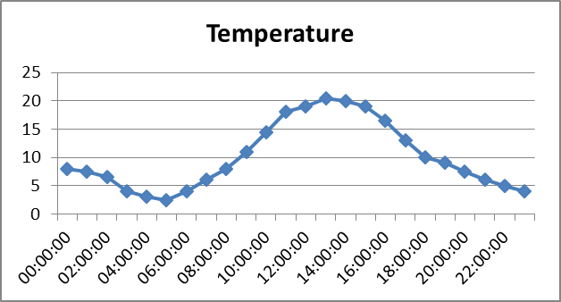
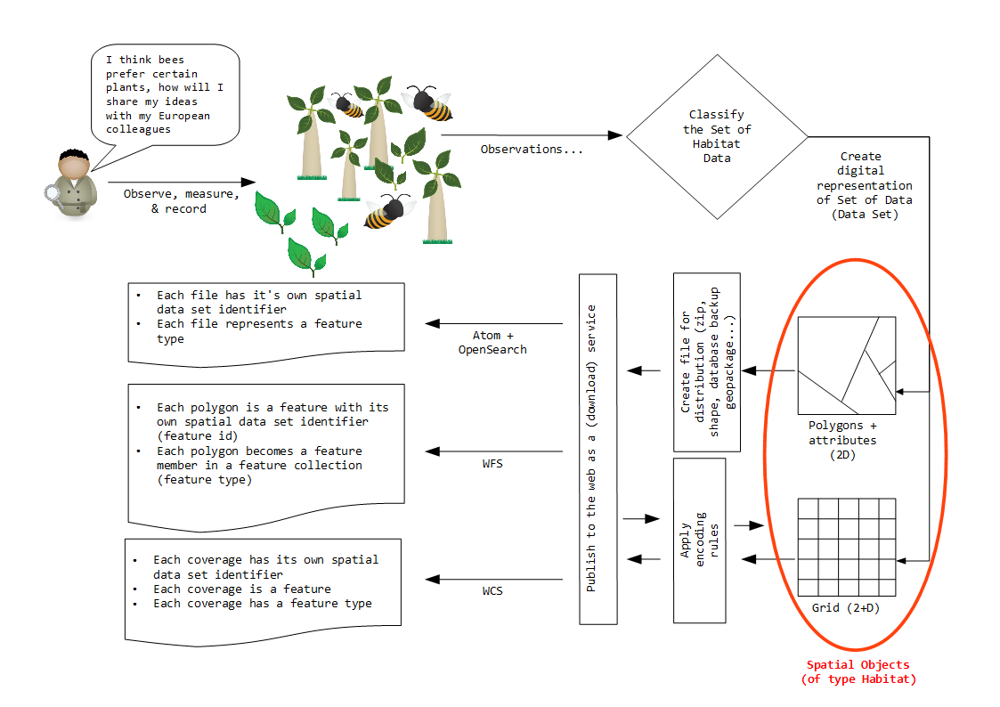
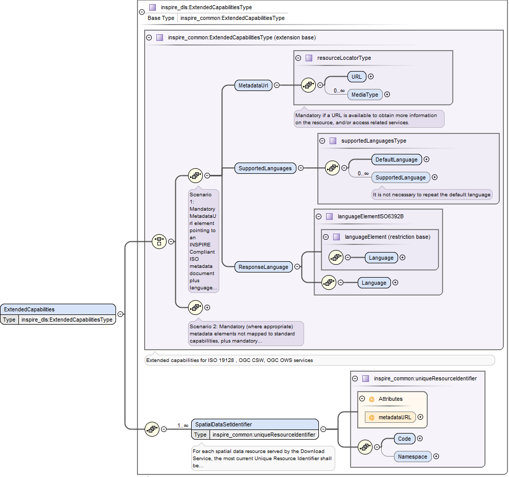
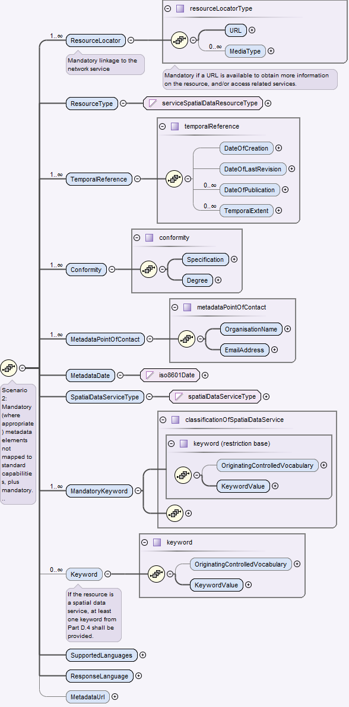

// Admonition icons:
// TG Requirement
:important-caption: 📕
// TG Recommendation
:tip-caption: 📒
// Conformance class
:note-caption: 📘

// TOC placement using macro (manual)
:toc: macro

// Empty TOC title (the title is in the document)
:toc-title:

// TOC level depth
:toclevels: 5

// Section numbering level depth
:sectnumlevels: 8

// Line Break Doc Title
:hardbreaks-option:

:appendix-caption: Annex

image::./media/image1.png[./media/image1,width=107,height=107]
**INSPIRE** *Infrastructure for Spatial Information in Europe*

[discrete]
= Technical Guidance for the implementation of INSPIRE Download Services using Web Coverage Services (WCS)

[width="100%",cols="29%,71%",]
|===
|*Title* |Technical Guidance for the implementation of INSPIRE Download Services using Web Coverage Services (WCS)
|*Creator* |Temporary MIG subgroup for action MIWP-7b
|*Date of publication* |2016-12-16
|*Subject* |INSPIRE Download Services
|*Status* a|
Version 1.0

This document has been endorsed by the INSPIRE maintenance and implementation group (MIG) in its meeting on 30/11-1/12/2016__, pending a scrutiny reserve from France__footnote:[France will submit this document to a national stakeholder consultation (until end of January 2017), as foreseen as an option under the workflow of the MIWP 2014-2016.].

|*Publisher* |INSPIRE Maintenance and Implementation Group (MIG)
|*Type* |Text
|*Description* |This document defines technical guidance for INSPIRE Download Services using Web Coverage Services
|*Format* |MS Word (docx)
|*Licence* |Creative Commons Attribution (cc-by) 4.0 (https://creativecommons.org/licenses/by/4.0/)
|*Identifier* |http://inspire.ec.europa.eu/id/document/tg/download-wcs/1.0
|*Corrigenda* |Corrigenda to this document will be published at http://inspire.ec.europa.eu/id/document/tg/download-wcs/1.0/corrigenda
|*Language* |EN
|===

<<<
[discrete]
== List of tables

[cols=","]
|===
|Table 1 |Revision history link:#_Toc462151555
|Table 2 |Annex II spatial data themes with coverage data link:#_Toc462151556
|Table 3 |Annex III spatial data themes with coverage data link:#_Toc462151557
|Table 4 |Summary of operations that SHALL be supported by download services link:#_Toc462151558
|Table 5 |Get Download Service Metadata - WCS Implementation link:#_Toc462151559
|Table 6 |Get Spatial Data Set - WCS Implementation link:#_Toc462151560
|Table 7 |Describe Spatial Data Set - WCS Implementation link:#_Toc462151561
|Table 8: |Link Download Service - WCS Implementation link:#_Toc462151562
|Table 9 |Describe Spatial Object Type - WCS Implementation link:#_Toc462151563
|Table 10 |Get Spatial Object - WCS Implementation link:#_Toc462151564
|Table 11 |Mapping the Spatial Data Set Identifier parameter link:#_Toc462151565
|Table 12 |Conformance Classes for Download Service Technical Guidance link:#_Toc462151566
|Table 13 |HTTP-URI identifiers for 2D, 3D, and Compound coordinate reference systems; modified from [*INS CRS*]. link:#_Toc462151567
|Table 14 |List of common output formats, and type of coverage data they can best provide link:#_Toc462151568
|Table 15 |Codes for the language request parameter link:#_Toc462151569
|Table 16 |Mapping INSPIRE Metadata elements to the WCS GetCapabilities response elements link:#_Toc462151570
|Table 17 |Codes for language response parameters link:#_Toc462151571
|===

<<<
[discrete]
== List of figures

[cols=","]
|===
|Figure 1 |Relationship between the INSPIRE Implementing Rules and the associated Technical Guidance. link:#_Toc351558232
|Figure 2 |Examples of a rectified grid (left) and a referenceable grid (center) and an orthoimage timeseries (right) link:#_Toc465069671
|Figure 3 |Example of a time series which might be a sample or a WCS timeseries extracted from, e.g., a 3-D x/y/t orthoimage timeseries or an x/y/z/t weather forecast link:#_Toc465069672
|Figure 4 |Structure of a CIS 1.0 coverage (taken from [*CIS 1.0*]) link:#_Ref464672666
|Figure 5 |Schematic diagram showing the process of mapping of the real world through the classification of spatial objects to the delivery of data through a download service. link:#_Toc465069674
|Figure 6 |Structure of the extended capabilities schema for download services, with detail for a scenario 1 metadata response. link:#_Toc441590742
|Figure 7 |Structure detail for a scenario 2 metadata response as part of the extended capabilities schema for download services. link:#_Toc441590743
|Figure 8 |Detailed Sequence Diagram Download Service link:#_Toc364080482
|===

<<<
[discrete]
== List of examples

[cols=","]
|===
|Example 1 |Use of weighting measure for language negotiation link:#_Toc462151502
|Example 2 |Use of Accept-Language parameter in an HTTP HEAD request link:#_Toc462151503
|Example 3 |Exception report showing language of the response link:#_Toc462151504
|Example 4 |Minimal GetCapabilities request using XML/POST link:#_Toc462151505
|Example 5 |Minimal GetCapabilities request using KVP/GET link:#_Toc462151506
|Example 6 |GetCapabilities request with version negotiation using XML/POST link:#_Toc462151507
|Example 7 |GetCapabilities request with version negotiation using KVP/GET link:#_Toc462151508
|Example 8 |GetCapabilities request with version and language negotiation using KVP/GET link:#_Toc462151509
|Example 9 |GetCapabilities request with version and language negotiation using XML/POST link:#_Toc462151510
|Example 10 |inspire_dls:ExtendedCapabilities section in a scenario 1 response link:#_Toc462151511
|Example 11 |inspire_dls:ExtendedCapabilities section in a scenario 2 response link:#_Toc462151512
|Example 12 |Response to any GetCapabilities-Request (only German supported) link:#_Toc462151513
|Example 13 |Response to OGC-GetCapabilities-Request for English (en) in a multi-lingual service) link:#_Toc462151514
|Example 14 |Response to OGC-GetCapabilities-Request for French (fr) link:#_Toc462151515
|Example 15 |DescribeCoverage request for two coverages using XML/POST link:#_Toc462151516
|Example 16 |DescribeCoverage request for two coverages using GET/KVP link:#_Toc462151517
|Example 17 |DescribeCoverage request for two coverages, with language negotiation (GET/KVP) link:#_Toc462151518
|Example 18 |DescribeCoverage request for two coverages, with language negotiation (XML/POST) link:#_Toc462151519
|Example 19 |GetCoverage request (XML/POST) link:#_Toc462151520
|Example 20 |GetCoverage request (KVP/GET) link:#_Toc462151521
|Example 21 |GetCoverage request with language negotiation (XML/POST) link:#_Toc462151522
|Example 22 |GetCoverage request with language negotiation (KVP/GET) link:#_Toc462151523
|Example 23 |Section of a GetCapabilities response showing CRS that are supported for reprojection of coverages in a service link:#_Toc462151524
|Example 24 |GetCoverage with reprojection request and with language negotiation (XML/POST) link:#_Toc462151525
|Example 25 |GetCoverage with reprojection request and with language negotiation (KVP/GET) link:#_Toc462151526
|Example 26 |GML Domain Set response from a DescribeCoverage request showing the names of the axes that must be used in any subsetting request link:#_Toc462151527
|Example 27 |GetCoverage subsetting request applying a trim on two axes, assuming default CRS for the subsetting axes (KVP/GET) link:#_Toc462151528
|Example 28 |GetCoverage subsetting request applying a trim on two axes (XML/POST) link:#_Toc462151529
|Example 29 |GetCoverage subsetting request applying a trim on two axes, explicitly supplying CRS of the subsetting axes (KVP/GET) link:#_Toc462151530
|Example 30 |GetCoverage subsetting request applying a slice on one axis (XML/POST) link:#_Toc462151531
|Example 31 |GetCoverage subsetting request applying a slice on one axis (KVP/GET) link:#_Toc462151532
|Example 32 |A slicing query on a coverage using a ProcessCoverages request (XML/POST) link:#_Toc462151533
|Example 33 |GetCapabilities response showing updateSequence link:#_Toc462151534
|Example 34 |Using cURL to send an HTTP HEAD request to help quantify a WCS operation response time link:#_Toc462151535
|Example 35 |Pseudo DescribeSpatialObjectType request with Spatial Object Type specified. link:#_Toc462151536
|Example 36 |Pseudo DescribeSpatialObjectType request no Spatial Object Type specified link:#_Toc462151537
|Example 37 |ISO 19139 metadata excerpt showing how Spatial Object Types supported by a service could be advertised. link:#_Toc462151538
|Example 38 |Use of an Atom feed to provide information on spatial object types supported by a service. link:#_Toc462151539
|Example 39 |Use of the coverage summary in a GetCapabilities response to link to an Atom feed listing the spatial object types that are supported by the coverage. link:#_Toc462151540
|Example 40 |List all formats supported by the service (GetCapabilities) link:#_Toc462151541
|Example 41 |List all coverage identifiers (Spatial Data Set Identifiers) provided by the service (GetCapabilities) link:#_Toc462151542
|Example 42 |List all Coverage sub types provided by the service (GetCapabilities) link:#_Toc462151543
|Example 43 |List the Envelope information for a Coverage (DescribeCoverage) link:#_Toc462151544
|Example 44 |List the default SRS for a coverage (DescribeCoverage) link:#_Toc462151545
|Example 45 |List the Spatial Data Theme (DescribeCoverage) link:#_Toc462151546
|===

<<<
[discrete]
== Acknowledgements

Many individuals and organisations have contributed to the development of these Guidelines.

The Maintenance and implementation work programme working group for WCS-based download services (MIWP-7b) responsible for this Technical Guidance included: Peter Baumann, Mauritz Bomark, Jachym Cepicky, Bart Cosyn, David Dixson, Tim Duffy, Jordi Escriu, Diomede Illuzzi, Jeroen Hogeboom, Simon Jirka, Andreas Krimbacher, Ouns Kissiyar, Chris Little, James Passmore, Jukka Rahkonen, Jari Reini, Ilkka Rinne, Dimitse Sarafinof, Mikko Visa.

The team at the Joint Research Centre of the European Commission that contributed to this version of the guidelines includes: Michael Lutz and Alexander Kotsev.

The editing work was done by James Passmore of the British Geological Survey (BGS) under contract for the European Commission Joint Research Centre (JRC).

*Contact information*

European Commission Joint Research Centre
B.6 Digital Economy
inspire-info@jrc.ec.europa.eu

<<<
[discrete]
== Foreword

Directive 2007/2/EC of the European Parliament and of the Council [*INS DIR*], adopted on 14 March 2007 aims at establishing an Infrastructure for Spatial Information in the European Community (INSPIRE) for environmental policies, or policies and activities that have an impact on the environment. INSPIRE will make available relevant, harmonised and quality geographic information to support the formulation, implementation, monitoring and evaluation of policies and activities, which have a direct or indirect impact on the environment.

INSPIRE is based on the infrastructures for spatial information established and operated by the 28 Member States of the European Union. The Directive addresses 34 spatial data themes needed for environmental applications, with key components specified through technical implementing rules. This makes INSPIRE a unique example of a legislative "regional" approach.

To ensure that the spatial data infrastructures of the Member States are compatible and usable in a Community and trans-boundary context, the Directive requires that common Implementing Rules (IR) are adopted in the following areas.

* Metadata;
* The interoperability and harmonisation of spatial data and services for selected themes (as described in Annexes I, II, III of *[INS DIR]*);
* Network Services;
* Measures on sharing spatial data and services;
* Co-ordination and monitoring measures.

The Implementing Rules are adopted as Commission Decisions or Regulations, and are legally binding.

In particular with respect the Network Services, Implementing Rules are required for the following services (Article 11(1) of *[INS DIR]*):

[loweralpha]
. _discovery services search for spatial data sets and spatial data services on the basis of the content of corresponding metadata, and display the metadata content;_
. _view services as a minimum, display, navigate, zoom in/out, pan, or overlay spatial data sets and display legend information and any relevant content of metadata;_
. _download services enabling copies of complete spatial data sets, or of parts of such sets, to be downloaded;_
. _transformation services enabling spatial data sets to be transformed with a view to achieving interoperability;_
. _invoke spatial data services "enabling data services to be invoked."_

In addition to the Implementing Rules, non-binding Technical Guidance documents describe detailed implementation aspects and relations with existing standards, technologies and practices in order to support the technical implementation process. They may need to be revised during the course of implementing the infrastructure to take into account the evolution of technology, new requirements, and cost benefit considerations. In other words, these Technical Guidance documents are supporting material to assist in the technical implementation of the INSPIRE Directive but no additional obligations can be derived from these documents over and above the obligations set out in the Directive and the Implementing Rules. The Technical Guidance documents are also not intended to interpret legal obligations. Figure 1 illustrates the relationship between the INSPIRE Regulations containing Implementing Rules and their corresponding Technical Guidance documents.

The scope of this document is to provide Technical Guidance for the implementation of the requirements related to download services included in [*INS NS*] using Web Coverage Services (WCS), such that these services can be implemented consistently across Europe. Other Technical Guidance exist for describing implementations of the requirements for download services using other specifications, such as for Atom Syndication Format, and WFS.

Implementing this Technical Guidance are designed to maximise the interoperability of INSPIRE services. Technical Guidance documents describe how Member States might implement the Implementing Rules described in a Commission Regulation. The technical provisions and the underlying concepts are often illustrated by use case diagrams and accompanied by examples. Technical Guidance documents may also include non-binding technical recommendations that should be satisfied if a Member State chooses to conform to the Technical Guidance. However, these recommendations have no legally binding effect.

image::./media/image2.png[TG vs IR,width=600,height=450]

[.text-center]
*Figure 1: Relationship between the INSPIRE Implementing Rules and the associated Technical Guidance.*

[cols=""]
|===
*Disclaimer*

This document has been developed collaboratively through the INSPIRE maintenance and implementation framework, involving experts of the European Commission services, the European Environment Agency, EU Member States, the Accession and EFTA Countries. The document should be regarded as presenting an informal consensus position on best practice agreed by all partners. However, the document does not necessarily represent the official, formal position of any of the partners. To the extent that the European Commission's services provided input to this technical document, such input does not necessarily reflect the views of the European Commission and its services. This document does not bind the Commission and its services, nor can the Commission and its services be held responsible for any use which may be made of the information contained herein.

The technical document is intended to facilitate the implementation of Directive 2007/2/EC and is not legally binding. Any authoritative reading of the law should only be derived from Directive 2007/2/EC itself and other applicable legal texts or principles such as the related Implementing Rules. Only the Court of Justice of the European Union is competent to authoritatively interpret Union legislation.

|===

<<<
[discrete]
== Revision history

[width="100%",cols="16%,10%,21%,53%",options="header",]
|===
|*Date* |*Release* |*Editor* |*Description*
|2015-11-24 |0.1 |James Passmore |Initial work on creating a structure for the document based on the template used in the SOS TG. Some attempt made at commenting on extended capabilities section
|2015-12-16 |0.2 |James Passmore |Added the suggested mapping of WCS operations to the [*INS NS]* download operations. Fleshed out normative references
|2016-01-22 |0.3 |James Passmore |Substantial reworking of the document structure. Updates to language handling including error responses. Details given on how WCS operations can be constructed to adhere to [*INS NS]* download operations and requirements. Comments on issues to be addressed in QoS.
|2016-01-26 |0.4 |James Passmore |Started section on CRS, corrected typos elsewhere
|2016-01-26 |0.5 |James Passmore |Added time slice example, formatting corrections
|2016-01-29 |0.6 |James Passmore |Added background information in the intro based on the ToR draft, corrected typos copied over from existing TG. Updated terms listing.
|2016-02-05 |0.7 |James Passmore |First stab at correct acknowledgements, removed Coveragecollections section, removed many inline comments replacing with suggested text etc. informative section on describe spatial object type added.
|2016-02-23 |0.8 |James Passmore |Corrections and amendments following MIWP formal review. Substantial edit to QoS section, mapping requirements to WCS operations. Update to sections in relation to conditional operations.
|2016-03-21 |0.9 |James Passmore |Tidying up text for language response codes, incorporating comments from ML and AK
|2016-03-22 |0.10 |James Passmore |Adding further clarification to schematic diagram.
|2016-03-23 |1.0-RC1 |James Passmore |Corrected formatting, removed citing of CRS from [*INS ISSDS*] in 4.4 as changes to this IR are mooted
|2016-09-21 |1.0-RC2 |James Passmore |Addressed comments from MIG-T feedback
|2016-12-12 |1.0 |Michael Lutz |Editorial changes for publication
|===

[.text-center]
*Table 1: Revision history*

<<<
[discrete]
= Table of contents
toc::[]

:sectnums:

<<<
== Introduction

Directive 2007/2/EC of the European Parliament and of the Council of 14 March 2007 establishing an Infrastructure for Spatial Information in the European Community (INSPIRE) was published in the official Journal on the 25th April 2007. The INSPIRE Directive entered into force on the 15th May 2007.

The purpose of the infrastructure is to enable the formulation, implementation, monitoring activities and evaluation of Community environmental policies at all levels – European, national and local – and to provide public information.

INSPIRE builds on the infrastructures for spatial information that have already been created by the Member States. The components of those infrastructures include: metadata, spatial data themes (as described in Annexes I, II, III of *[INS DIR]*), network services and technologies; agreements on data sharing, access and use; coordination and monitoring mechanisms, processes and procedures.

The guiding principles of INSPIRE are:

* that the infrastructures for spatial information in the Member States should be designed to ensure that spatial data are stored, made available and maintained at the most appropriate level;
* that it is possible to combine spatial data from different sources across the Community in a consistent way and share them between several users and applications;
* that it is possible for spatial data collected at one level of public authority to be shared between all the different levels of public authorities;
* that spatial data are made available under conditions that do not restrict their extensive use; and
* that it is easy to discover available spatial data, to evaluate their fitness for purpose and to know the conditions applicable to their use.

The text of the INSPIRE Directive is available from available from the European Union Law website (EU-LEX) http://eur-lex.europa.eu/legal-content/EN/ALL/?uri=CELEX:32007L0002. The Directive identified what needed to be achieved, and Member States had two years from the date of adoption to bring into force national legislation, regulations, and administrative procedures that define how the agreed objectives will be met taking into account the specific situation of each Member State. To ensure that the spatial data infrastructures of the Member States are compatible and usable in a Community and trans-boundary context, the Directive requires that common Implementing Rules (IR) are adopted in a number of specific areas. Implementing Rules are adopted as Commission Decisions, and are binding in their entirety.

According to Article 5(4) of the Directive, the INSPIRE Implementing Rules shall take account of relevant, existing international standards and user requirements.

The scope of this document is to provide Technical Guidance based on the Implementing Rules for the implementation of service interfaces for INSPIRE Download Services using Web Coverage Services (WCS), such that these services can be implemented consistently across Europe. Other Technical Guidance exist for describing implementations using other service interfaces, such as for Atom Syndication Format, and WFS.

These Implementing Rules are, as much as possible, in conformance with European and international standards, current practices in stakeholder communities and relevant European initiatives such as e‑Government, and the EU interoperability framework.

=== Background

Many INSPIRE spatial data themes (Orthoimagery, Elevation, Geology, Atmospheric conditions/Meteorological geographical features, Oceanographic geographical features, Soil, Land cover, Natural risk zones, Energy resources) include data that, according to the INSPIRE data specifications, have to be made available as coverages. The 'Habitats and biotopes' and Environmental monitoring facilities' specifications mention that the use of coverage model should be considered once mature implementations appear.

Other data specifications such as 'Sea regions' whilst not mandating data should be provided as coverages, would benefit from having the ability to provide data as coverages.

Whilst coverage data can be provided using Atom feeds or WFS, these options are not well suited for many coverage data sets, because single coverages are often several GB or even TB in size and users are typically only interested in some sub-set of the data, e.g. as defined by

* a user-defined bounding box or time period (trimming)

* queries that reduce the dimension of the result coverage (slicing), e.g. extracting a temperature surface at a certain depth from a 3D ocean temperature coverage

This technical guidance shows how the operations required by the [*INS NS*] for download services can be mapped to the WCS 2.0 standard. A second document will be provided to show how the data specifications that have a requirement to provide coverage data, might encode their data to provision it through an INSPIRE conformant download service based on WCS as documented in this guidance.

The below tables give a fuller description of the spatial data themes defined by the [*INS DIR*] which are likely to provision data as coverages. None of the Annex I spatial data themes are believed to be directly in scope.

[align=center,width="100%",cols="17%,83%",options="header",]
|===
2+|*SPATIAL DATA THEMES in [INS DIR, Annex II]*
.2+|Spatial data theme (common abbreviation) |Definition of the Spatial data theme
|[blue]#Spatial Object Types# (_and data types_) thought to be in scope for the Spatial data theme
.2+|Elevation (EL) |Digital elevation models for land, ice and ocean surface. Includes terrestrial elevation, bathymetry and shoreline. a|
[blue]#ElevationGridCoverage#
[blue]#ElevationTIN#
.2+|
Geology
(GE)
|Geology characterised according to composition and structure. Includes bedrock, aquifers and geomorphology.
a|
[blue]#HydrogeologicalObject# (_HydrogeologicalSurface, PiezometricState_)
[blue]#GeophProfile#
[blue]#GeophSwath#
[blue]#GeophStation#

.2+|Land cover (LC) |Physical and biological cover of the earth's surface including artificial surfaces, agricultural areas, forests, (semi-)natural areas, wetlands, water bodies
|[blue]#LandCoverGridCoverage#
.2+|Orthoimagery (OI) |Geo-referenced image data of the Earth's surface, from either satellite or airborne sensors.
|[blue]#OrthoimageCoverage#
|===

[.text-center]
*Table 2: Annex II spatial data themes with coverage data*

[align=center,width="100%",cols="18%,82%",options="header",]
|===
2+|*SPATIAL DATA THEMES in [INS DIR, Annex III]*
.2+|Spatial data theme (common abbreviation) |Definition of the Spatial data theme
|[blue]#Spatial Object Types# (_and data types_) thought to be in scope for the Spatial data theme
.2+|Soil (SO) |Soils and subsoil characterised according to depth, texture, structure and content of particles and organic material, stoniness, erosion, where appropriate mean slope and anticipated water storage capacity.
a|
[blue]#SoilThemeCoverage#
[blue]#SoilThemeDescriptiveCoverage#
.2+|Land use (LU) |Territory characterised according to its current and future planned functional dimension or socio-economic purpose (e.g. residential, industrial, commercial, agricultural, forestry, recreational).
|[blue]#ExistingLandUseGrid#
.2+|Environmental monitoring facilities (EF) |Location and operation of environmental monitoring facilities includes observation and measurement of emissions, of the state of environmental media and of other ecosystem parameters (biodiversity, ecological conditions of vegetation, etc.) by or on behalf of public authorities.
[blue]#|EnvironmentalMonitoringFacility#
.2+|Natural risk zones (NZ) |Vulnerable areas characterised according to natural hazards (all atmospheric, hydrologic, seismic, volcanic and wildfire phenomena that, because of their location, severity, and frequency, have the potential to seriously affect society), e.g. floods, landslides and subsidence, avalanches, forest fires, earthquakes, volcanic eruptions.
a|
[blue]#ExposedElementCoverage#
[blue]#HazardCoverage#
[blue]#ObservedEventCoverage#
[blue]#RiskCoverage#
.2+|Atmospheric conditions (AC) |Physical conditions in the atmosphere. Includes spatial data based on measurements, on models or on a combination thereof and includes measurement locations.
a|
[blue]#SamplingCoverageObservation# (PointObservation)

[blue]#SamplingCoverageObservation# (PointTimeSeriesObservation)

[blue]#SamplingCoverageObservation# (MultiPointObservation)

[blue]#SamplingCoverageObservation# (GridObservation)

[blue]#SamplingCoverageObservation# (GridSeriesObservation)

[blue]#SamplingCoverageObservation# (ProfileObservation)

[blue]#SamplingCoverageObservation# (TrajectoryObservation)

.2+|Meteorological geographical features (MF) |Weather conditions and their measurements; precipitation, temperature, evapotranspiration, wind speed and direction.
a|
[blue]#SamplingCoverageObservation# (PointObservation)
[blue]#SamplingCoverageObservation# (PointTimeSeriesObservation)
[blue]#SamplingCoverageObservation# (MultiPointObservation)
[blue]#SamplingCoverageObservation# (GridObservation)
[blue]#SamplingCoverageObservation# (GridSeriesObservation)
[blue]#SamplingCoverageObservation# (ProfileObservation)
[blue]#SamplingCoverageObservation# (TrajectoryObservation)
.2+|Oceanographic geographical features (OF) |Physical conditions of oceans (currents, salinity, wave heights, etc.).
a|
[blue]#SamplingCoverageObservation# (PointObservation)
[blue]#SamplingCoverageObservation# (PointTimeSeriesObservation)
[blue]#SamplingCoverageObservation# (MultiPointObservation)
[blue]#SamplingCoverageObservation# (GridObservation)
[blue]#SamplingCoverageObservation# (GridSeriesObservation)

.2+|Sea regions (SR) |Physical conditions of seas and saline water bodies divided into regions and sub-regions with common characteristics.
a|
[blue]#MarineLayer#
[blue]#SeaBedArea#
[blue]#SeaSurfaceArea#

.2+|Habitats and biotopes (HB) |Geographical areas characterised by specific ecological conditions, processes, structure, and (life support) functions that physically support the organisms that live there. Includes terrestrial and aquatic areas distinguished by geographical, abiotic and biotic features, whether entirely natural or semi-natural.
|[blue]#Habitat#
.2+|Energy resources (ER) |Energy resources including hydrocarbons, hydropower, bio-energy, solar, wind, etc., where relevant including depth/height information on the extent of the resource.
|[blue]#RenewableAndWastePotentialCoverage#
|===

[.text-center]
*Table 3: Annex III spatial data themes with coverage data*

The Spatial Object Types defined in [*INS ISSDS*] that can be mapped as coverages for these Spatial data themes are discussed elsewhere.

=== What is a coverage

Coverages are used to describe characteristics of real-world phenomena that vary over space and/or time. In practice, the notion of coverages encompasses regular and irregular grids, point clouds, and general meshes. Typical examples are 1-D temperature (time series or vertical profile)footnote:[These can also be encoded in, e.g., WaterML and be served via SOS.], 2-D elevation, 2-D precipitation, 2-D imagery, 2-D x/y/t image timeseries and x/y/z geophysical voxel data, and 4-D x/y/z/t weather data. A coverage contains a set of such values, each associated with one of the elements in a spatial, temporal or spatio-temporal domain. Typical spatial domains are point sets (e.g. sensor locations), curve sets (e.g. isolines), grids (e.g. orthoimages, elevation models), etc.

In INSPIRE application schemas, coverages are defined according to ISO 19123.To improve alignment with coverage standards on the implementation level (e.g. ISO 19136 and the OGC Web Coverage Service) and to improve the cross-theme harmonisation on the use of coverages in INSPIRE, an application schema for coverage types is included in the Generic Conceptual Model in 9.9.4. This application schema contains the following coverage types:

* _RectifiedGridCoverage_: coverage whose domain consists of a rectified grid – a grid for which there is an affine transformation between the grid coordinates and the coordinates of a coordinate reference system (see Figure 2, left).
* _ReferenceableGridCoverage_: coverage whose domain consists of a referenceable grid – a grid associated with a transformation that can be used to convert grid coordinate values to values of coordinates referenced to a coordinate reference system (see Figure 2, centre).

[align=center,width="100%",cols="38%,41%,21%"]
|===
a|image::./media/image3.png[image] a|image::./media/image4.png[image] a|image::./media/image5.png[image]
^|(Source: ISO 19136:2007) ^|(Source: GML 3.3.0) ^|(Source: CIS 1.1)
|===

[.text-center]
*Figure 2: Examples of a rectified grid (left) and a referenceable grid (center) and an orthoimage timeseries (right)*

[.text-center]
*Figure 3: Example of a time series which might be a sample or a WCS timeseries extracted from, e.g., a 3-D x/y/t orthoimage timeseries or an x/y/z/t weather forecast*

*[CIS 1.0]* states that: _Coverages represent digital geospatial information representing space/time-varying phenomena. OGC Abstract Topic 6 [OGC 07-011] – which is identical to ISO 19123 – defines an abstract model of coverages. Coverage instances may be encoded using the Geography Markup Language (GML) 3.2 [07-036], an XML grammar written in XML Schema for the description of application schemas as well as the transport and storage of geographic information._

_However, the definition contained in GML 3.2.1 has turned out to not contain sufficient information to describe coverage instances in a flexible, interoperable, and harmonized manner._

With the OGC "GML 3.2.1 Application Schema – coverages" standard (meanwhile renamed to Coverage Implementation Schema [*CIS 1.0*]) the OGC WCS group developed an extension to the conceptual model of GML 3.2.1, which can be mapped to GML or any other suitable format. The structure of a coverage so described by this standard is shown in the below Figure 4.

image::./media/image8.png[./media/image8,width=605,height=467]

[.text-center]
*Figure 4: Structure of a CIS 1.0 coverage (taken from [CIS 1.0])*

Within the WCS 2.0 interface standard the term coverage is intended to mean a coverage as defined by [*CIS 1.0*] – in other words, WCS 2.0 can serve coverages adhering to the [*CIS 1.0*] specification**.**

Where possible, only these coverage types (or a subtype thereof) are used in INSPIRE application schemas.

<<<
== References 

The following referenced documents are indispensable for the application of this document. For dated references, only the edition cited applies. For undated references, the latest edition of the referenced document (including any amendments) applies.

=== Normative references

INSPIRE Directive, *INS DIR*, Directive 2007/2/EC of the European Parliament and of the Council of 14 March 2007 establishing an Infrastructure for Spatial Information in the European Community (INSPIRE)

INSPIRE Network Services Regulation, *INS NS*, COMMISSION REGULATION (EU) No 976/2009 of 23 November 2010 as amended by Regulation (EC) No 1088/2010 as regards download services and transformation services

INSPIRE Metadata Regulation, *INS MD*, COMMISSION REGULATION (EC) No 1205/2008 of 3 December 2008 implementing Directive 2007/2/EC of the European Parliament and of the Council as regards metadata. See also Corrigendum to INSPIRE Metadata Regulation.

INSPIRE Metadata Implementing Rules, *IR MDTG*, Guidelines based on EN ISO 19115 and EN ISO 19119 for Commission Regulation (EC) No 1205/2008 of 3 December 2008 implementing Directive 2007/2/EC of the European Parliament and of the Council as regards metadata

INSPIRE Regulation on the interoperability of spatial data sets and services Regulation, *INS ISSDS,* COMMISSION REGULATION (EU) No 1089/2010 of 23 November 2010 implementing Directive 2007/2/EC of the European Parliament and of the Council as regards interoperability of spatial data sets and services

Commission Decision 2009/442/EC, *INS M&R*, Implementing Directive 2007/2/EC of the European Parliament and of the Council as regards monitoring and reporting

=== Technical references

D2.8.I.1 Data Specification on Coordinate Reference Systems – Technical Guidelines, *INS CRS*

D2.5: Generic Conceptual Model, *INS GCM*

ISO 19135-1:2005, *ISO 19135,* Geographic information — Procedures for item registration

ISO 19101-1:2014, *ISO 19101,* Geographic information -- Reference model -- Part 1: Fundamentals

ISO/TS 19103:2005, *ISO/TS 19103,* Geographic information -- Conceptual schema language

ISO 19107:2003, *ISO 19107*, Geographic information -- Spatial schema

ISO 19115:2003, *ISO 19115*, Geographic information -- Metadata

OGC 06-121r9, *OWS 2*, OGC Web Services Common Standard, version 2.0

OGC 09-110r4, *OGC* *WCS*, OGC WCS 2.0 Interface Standard – Core, version 2.0

OGC 09-149r1, *WCS XML*, OGC Web Coverage Service 2.0 Interface Standard – XML/SOAP Protocol Binding Extension, version 1.0,

OGC 09-147r3, *WCS KVP*, WCS 2.0 Interface Standard – KVP Protocol Binding Extension, version 1.0

OGC 09-146r2, *CIS 1.0*, (Coverage Implementation Schema 1.0 or CIS 1.0, formerly known as GML 3.2.1 Application Schema Coverages or GMLCOV)

OGC 12-100r1, *GT COV*, GML Application Schema - Coverages – GeoTIFF Coverage Encoding Profile

OGC 08-059r4, *WCS PE*, OGC Web Coverage Service WCS Interface Standard - Processing Extension, version 2.0

<<<
== Terms and abbreviations

=== Terms

[arabic, start=1]
. *application schema*
+
conceptual schema for data required by one or more applications [*ISO 19101*]

[arabic, start=2]
. *conceptual model*
+
model that defines concepts of a universe of discourse [*ISO 19101*]

[arabic, start=3]
. *conceptual schema*
+
formal description of a *conceptual model* [*ISO 19101*]
+
EXAMPLE ISO 19107 contains a formal description of geometrical and topological concepts using the conceptual schema language UML.

[arabic, start=4]
. *conceptual schema language*
+
formal language based on a conceptual formalism for the purpose of representing *conceptual schemas* [*ISO 19101*]
+
EXAMPLE UML, EXPRESS, ORM and INTERLIS are examples of conceptual schema languages.

[arabic, start=5]
. *coordinate reference system*
+
System for uniquely referencing spatial information in space as a set of coordinates (x, y, z) and/or latitude and longitude and height, based on a geodetic horizontal and vertical datum [*INS DIR*]
+
NOTE While INSPIRE considers CRSs to be spatial only, OGC coverages can be spatio-temporal. Technically, this is reflected by OGC coverages having n additional time axis in the CRS where needed.

[arabic, start=6]
. *coverage*
+
*spatial object* that acts as a function to return values from its range for any direct position within its spatial, temporal or spatiotemporal domain, in accordance with ISO 19123:2007 [*INS ISDSS*]
+
EXAMPLE Orthoimage, Image time series, digital elevation model (as grid or TIN), point grids etc.

[arabic, start=7]
. *data set* 
+
identifiable collection of data [*ISO 19115*]
+
Note sometimes used instead of 'spatial data set', same meaning as 'spatial data set'.

[arabic, start=8]
. *domain* 
+
well-defined set [*ISO/TS 19103*]

[arabic, start=9]
. *download service*
+
*network service* enabling copies of spatial data sets, or parts of such sets, to be downloaded and, where practicable, accessed directly [*INS DIR*]

[arabic, start=10]
. *feature*
+
abstraction of a real world phenomenon [I**SO 19101**]

[arabic, start=11]
. *function*
+
rule that associates each element from a domain (source or domain of the function) to a unique element in another domain (target, co-domain or range) [*ISO 19107*]

[arabic, start=12]
. *geographical grid system*
+
harmonised multi-resolution grid with a common point of origin and standardised location and size of grid cells. [*INS DIR*]
+
NOTE 1 Geographical grid systems are not limited to rectified grids or grids using cell axes parallel to the meridians.
+
NOTE 2 The [*INS GCM*] document adopts the definition of the 2003 Workshop on European Reference Grids, which includes not only the grid describing the domain of a coverage but also its range. Thus, a 'geographical grid' is equivalent to an ISO 19123 coverage. The unqualified term 'grid' may refer either to a grid geometry or a geographical grid (coverage) depending on the context.

[arabic, start=13]
. *INSPIRE application schema*
+
*application schema* specified in an INSPIRE data specification [*INS GCM*]

[arabic, start=14]
. *metadata*
+
information describing spatial data sets and spatial data services and making it possible to discover, inventory and use them [*INS DIR*]

[arabic, start=15]
. *network service*
+
_Network services are necessary for sharing spatial data between the various levels of public authority in the Community. Those network services *should make it possible to discover, transform, view and download spatial data and to invoke spatial data and e-commerce services*. The services of the network should work in accordance with commonly agreed specifications and minimum performance criteria in order to ensure the interoperability of the infrastructures established by the Member States. The network of services should also include the technical possibility to enable public authorities to make their spatial data sets and services available._ [*INS DIR*]

[arabic, start=16]
. *range* [of a coverage]
+
set of feature attribute values associated by a function with the elements of the domain of a coverage [*ISO 19123*]

[arabic, start=17]
. *register*
+
set of files containing identifiers assigned to items with descriptions of the associated items [*ISO 19135*]

[arabic, start=18]
. *registry*
+
information system on which a *register* is maintained [*ISO 19135*]
+
EXAMPLE the *INSPIRE registry,* the official registry containing definitions for terms and feature concepts in INSPIRE. http://inspire.ec.europa.eu/registry

[arabic, start=19]
. *spatial data*
+
any data with a direct or indirect reference to a specific location or geographic area [*INS DIR*]
+
NOTE The use of the word 'spatial' in INSPIRE is unfortunate as in the everyday language its meaning goes beyond the meaning of 'geographic', which is considered by the Drafting Team as the intended scope, and includes subjects such as medical images, molecules, or other planets to name a few. However, since the term is used as a synonym for geographic in the Directive, this document uses the term 'spatial data' as a synonym for the term 'geographic data' used by the ISO 19100 series of International Standards and which is defined as 'data with implicit or explicit reference to a location relative to the Earth'. Further, spatial data – and particularly coverages, such as weather data – may also have a temporal dimension.

[arabic, start=20]
. *spatial data service*
+
operations which may be performed, by invoking a computer application, on the spatial data contained in spatial data sets or on the related metadata [*INS DIR*]

[arabic, start=21]
. *spatial data set*
+
an identifiable collection of spatial data [*INS DIR*]

[arabic, start=22]
. *spatial object*
+
an abstract representation of a real world phenomenon related to a specific location or geographical area [*INS DIR*]
+
NOTE The term '(geographic) feature' as used in the ISO 19100 series of International Standards, in other specifications like IHO S-57, and in the [*INS GCM*] document is used synonymously with *spatial object.* [Note modified from *INS GCM*]

[arabic, start=23]
. *spatial object type*
+
classification of *spatial objects*
+
NOTE In the conceptual schema language UML a spatial object type will be described by a class with stereotype <<featureType>>.

=== Abbreviations

[cols=","]
|===
|CIS |Coverage Implementation Schema
|CRS |Coordinate Reference System
|DLS |Download Service
|GCM |INSPIRE Generic Conceptual Model, referring to D2.5_v3.4
|GET |HTTP GET method, referring to IETF rfc7230
|GML |Geography Markup Language
|GMLCOV |GML Application Schema for Coverages, referring to OGC 09-146r2
|HEAD |HTTP HEAD method, referring to IETF rfc7230
|HTTP |Hypertext Transfer Protocol, referring to IETF rfc7230
|IETF |Internet Engineering Task Force
|INSPIRE |Infrastructure for Spatial Information in Europe
|IR |Implementing Rule
|ISO |International Organisation for Standardisation
|JRC |Joint Research Centre
|KVP |Key/Value Pair
|NS |Network Services
|OGC |Open Geospatial Consortium
|OWS |OGC Web Services Common Standard, referring to OGC 06-121r9
|POST |HTTP POST method, referring to IETF rfc7230
|WCS |Web Coverage Service, referring to OGC 09-110r4
|XML |eXtensible Markup Language
|===

=== Verbal forms for the expression of provisions

In accordance with the ISO rules for drafting, the following verbal forms shall be interpreted in the given way:

* "shall" / "shall not": a requirement, mandatory to comply with the technical guidance
* "should" / "should not": a recommendation, but an alternative approach may be chosen for a specific case if there are reasons to do so
* "may" / "need not": a permission

*Technical Guidance Conformance Classes notation*

The Technical Guidance in this document is divided into Conformance Classes, so that it is possible to declare conformance to specific parts of the Technical Guidance. _To conform to a Conformance Class it is necessary to meet all of the Requirements (see next section) in that Conformance Class._

Conformance Classes are identified in the document as follows:

[NOTE]
====
*TG Conformance Class #: [TITLE]* conformance classes are shown using this style
====

*Technical Guidance Requirements and Recommendations notation*

Requirements and the recommendations for INSPIRE Download Services within this technical guidance are highlighted and numbered as shown below:

[IMPORTANT]
====
*TG Requirement #* requirements are shown using this style
====

[TIP]
====
*TG Recommendation #* recommendations are shown using this style.
====
It is important to note that, implementation requirements and implementation recommendations may refer to either service or client implementations. Requirements and recommendations belong to the conformance class in which they are found in this document.

*Note*: It is worth noting that requirements as specified in the INSPIRE Regulations and Implementing Rules are legally binding, and that requirements and recommendations as specified in INSPIRE Technical Guidance are *not* legally binding. Therefore, within this technical guidance we have used the terms 'TG requirement' and 'TG recommendation' to indicate what is technically required or recommended to conform to the Technical Guidance.

*XML Example notation*

XML Examples are shown using Courier New on a grey background with yellow for emphasis as below:

[source,xml,subs="+quotes",align=center]
----
<inspire:example>
  <inspire:highlight>
    Highlighted Text for emphasis
  </inspire:highlight>
</inspire:example>
----

*Note*: XML Examples are informative and are provided for information only and are expressly not normative.

=== References

References within this document are denoted using "Section" or "Annex". For example, Section 5.3.1 or Annex A.

References to other documents refer to the list of normative references in Section 3 and use the abbreviated title as indicated in *Bold* text. For example, [*INS NS*] uses the abbreviated title for the document as shown below:

INSPIRE Network Services Regulation, *INS NS,* COMMISSION REGULATION (EU) No 1088/2010 of 23 November 2010 amending Regulation (EC) No 976/2009 as regards download services and transformation services

References within other documents are show as above using the abbreviated title, together with the appropriate section within the document. For example, [*INS NS,* Section 2.2.3], refers to Section 2.2.3 within the document as listed above.

=== Future updates of this document

There are some issues that are foreseen, but are not covered or only partially covered in this version of the Technical Guidance.

These are:

* Extensions to the Coverage Data Model (GML 3.2.1 Application Schema - Coverages version 1.0.1, OGC 09-146r2, is advanced to Coverage Implementation Schema 1.1)
* WCS 2.1 standard publication which reflects inclusion of CIS 1.1
* CIS and WCS becoming ISO standards

<<<
== INSPIRE Download Services

This document provides Technical Guidance for the implementation of technical service interfaces for INSPIRE Download Services using WCS. Other Technical Guidance exists for describing implementations using other service interfaces such as for Atom Syndication Format, WFS, and SOS (unpublished). This WCS guidance is based on the abstract model established in the INSPIRE Network Services Regulation [*INS NS*].

The Network Services Regulation describes the following four download operations [*INS NS*, Annex IV, Part A] that _must_ be implemented by _all_ Download Services:

* Get Download Service Metadata
* Get Spatial Data Set
* Describe Spatial Data Set
* Link Download Service

The [*INS DIR,* Article 11] when talking about download services tell us that they enable _copies of spatial data sets, or parts of such sets, to be downloaded and, where practicable, accessed directly._

The Network Services Regulation states that where a direct access download service is provided, the following two operations [*INS NS*, Annex IV, Part B] _shall_ be implemented:

* Get Spatial Object
* Describe Spatial Object Type

Furthermore, for the _Get Spatial Object_ operation particular search capabilities [*INS NS*, Annex IV, Part C] shall also be implemented; that is in addition to support for the standard request query parameters used in a Get Spatial Data Set operation (language, coordinate reference system, and spatial data set identifier).

These capabilities include the ability to search by:

* Unique identifier of the Spatial Data Set
* Key attributes of spatial objects, and temporal dimensions including the date of update
* Bounding Box
* Spatial data theme
* Combinations of the above

[*INS NS*] defines a direct access download service as a download service which provides access to the Spatial Objects in Spatial Data Sets based upon a query. The query acts on predefined coverages according to the coverage identifiers made accessible through the service. The query does not imply any actual transformation of the coverage data. Data transformation and the creation of new data sets is covered in [*INS NS,* Annex V].

In practice therefore, this means there are _two_ types of Download Services that may be implemented; those that satisfy the minimum functional requirements from the Regulation [*INS NS*, Annex IV, Part A] and those that satisfy the full functional requirements [*INS NS*, Annex IV, Parts A, B & C], as summarized in table 4.

[width="100%",cols=",,,,,,",options="header",]
|===
|*Operations defined by IR* |*Get Download Service Metadata* | *Get Spatial Data Set* | *Describe Spatial Data Set* |*Link Download Service* |*Get Spatial Object*
|*Describe Spatial Object Type*
|_*Restrictions* on Request (Query) parameters_ |N/A |*Constrained* |N/A |N/A |*Open* |N/A
a|
*_Direct access_*
_download services_
6+|
SHALL
SUPPORT
|*_Other_* _download services_ 4+|
SHALL
SUPPORT

2+|NOT
SUPPORTED

[.small]#This is by definition, if a service can support both of these operations it becomes a Direct Access DLS#

|===

[.text-center]
*Table 4: Summary of operations that SHALL be supported by download services*

There are no additional operational requirements for a direct access service over those required for any other type of download service. The differences between the two types of services are generally seen in the results of any data fetching operation. When a service has indirect access to the data set, or when the data set is a static file, the result of a data request (query) will most likely be predefined, that is the same request will fetch the same set of data, a typical example would be the provision of download service as an Atom feed. Conversely, when a service has access to a live database or dynamic file system (for example one in which coverage data is being continuously updated), the same request (for example a simple GetCoverage request), may result in a different set of data being delivered (for the same coverage) in separate requests.

[.text-center]
*Figure 5: Schematic diagram showing the process of mapping of the real world through the classification of spatial objects to the delivery of data through a download service.*

In these guidelines we map the term "coverage" to the digital data set (the classified representation of the real world), as shown in the red circle in figure 5, in other words a coverage can be mapped to the term spatial object.

The encoding rules in figure 5 are mapped to the data specifications. They provide the interface to the coverage data/spatial objects, through which a user can access or query the data in a harmonized way to allow integration with other similar data sets.

The following sections of this document provide detailed Technical Guidance for implementing Download Services using existing standards:

* _Chapter 5_ contains Technical Guidance for implementing the mandatory download operations for data set download services using the OGC Web Coverage Service core interface standard *[OGC WCS]* and OGC Web Coverage Service interface standard extensions.
* _Chapter 6_ contains Technical Guidance for implementing the additional download operations that are required when you provision a direct access download services using the OGC Web Coverage Service core interface standard *[OGC WCS]* and OGC Web Coverage Service interface standard extensions.

=== How the Technical Guidance maps to the Implementing Rules

The purpose of this Technical Guidance is to provide practical guidance for implementation that is guided by, and satisfies, the requirements of the underlying legislation. The tables in the following sections demonstrate how the WCS implementations described in this document satisfy the legal requirements of the Network Services Regulation [*INS NS*]. The underlying legislation is rarely referred to in the rest of this document, so these tables should be referred back to if necessary.

==== Mapping the WCS-based Technical Guidance to the Implementing Rules

The following set of tables shows how the guidance for WCS implementations given in Chapters 5 and 6 satisfy the Network Services Regulation [*INS NS*]. Each operation is listed in a separate table.

===== Mandatory download operations

[align=center,width="100%",cols="21%,69%,10%",]
|===
2+|*Get Download Service Metadata* |*M/O/C* footnote:[M = Mandatory, O = Optional, C = Conditional]
2+a|
[.small]#*Description in [INS NS (Annex IV, Part A)]*#

[.small]#Provides all necessary information about the service, the available Spatial Data Sets, and describes the service capabilities.#

* [.small]#*Request*#
** [.small]#The Get Download Service Metadata request parameter shall indicate the natural language to be used for the content of the Get Download Service Metadata response#
* [.small]#*Response*#

[.small]#The Get Download Service Metadata response shall contain the following sets of parameters#

* [.small]#Download Service Metadata _(which shall contain at least the INSPIRE metadata elements)_#
* [.small]#Operations Metadata#
* [.small]#Languages _(which shall include the natural language used by the response and a list of the natural languages supported by the download service)_#
* [.small]#Spatial Data Sets Metadata _(which shall contain for each data set a list of the supported CRS and which must include at least one required CRS as referred to in Regulation (EU) no 1089/2010.)_#
|M
3+|*_Recommended WCS-based implementation_*
|*_Get Download Service Metadata Request_* 2+|
Metadata records for Download Services shall be available in a Discovery Service. The Resource Locator metadata element for the Download Service shall contain a link to the service endpoint, to which a WCS GetCapabilities request can be made.

The Get Download Service Metadata request shall be a GetCapabilities request to the WCS indicated in the metadata record.

|*_Get Download Service Metadata Response_* 2+|
The Get Download Service Metadata Response shall be a WCS capabilities document, which includes the download service INSPIRE metadata, operations metadata, response and supported languages, and the spatial data sets metadata, or links to resources that provide such metadata.

Additional metadata for the coverage data provided by the service may be retrieved in a WCS DescribeCoverage response document.

|*_WCS Conformance Classes_* 2+|WCS 2.0 Core |
|===

[.text-center]
*Table 5: Get Download Service Metadata - WCS Implementation*

[align=center,width="100%",cols="25%,65%,10%",]
|===
2+|*Get Spatial Data Set* |*M/O/C*
2+a|
[.small]#*Description in [INS NS (Annex IV, Part A)]*#

[.small]#The Get Spatial Data Set operation allows the retrieval of a Spatial Data Set.#

* [.small]#*Request* (the request shall contain the following parameters)#
** [.small]#Language _(which shall indicate the natural language requested for the response)_#
** [.small]#Spatial Data Set Identifier _(the parameter shall contain the Unique Resource Identifier of the Spatial Data)_#
** [.small]#Coordinate Reference System _(which shall contain one of the required CRS listed as supported by the data set in its metadata response_)#
* [.small]#*Response*#
** [.small]#Requested Spatial Data Set in the requested language and CRS#

|M
3+|*_Recommended WCS-based implementation_*
|*_Get Spatial Data Set Request_* 2+|Spatial data sets (coverages) and subsets of these data sets in different CRS/Language combinations shall be requested through a WCS GetCoverage request
|*_Get Spatial Data Set Response_* 2+|The WCS shall return a coverage or a subset of a coverage corresponding to the requested Spatial Data Set Identifier, Language, and CRS.
|*_WCS Conformance Classes_* 2+|WCS 2.0 Core
|===

[.text-center]
*Table 6: Get Spatial Data Set - WCS Implementation*

[align=center,width="100%",cols="25%,65%,10%",]
|===
2+|*Describe Spatial Data Set* |*M/O/C*
2+a|
[.small]#*Description in [INS NS (Annex IV, Part A)]*#

[.small]#This operation returns the description of all the types of Spatial Objects contained in the Spatial Data Set.#

* [.small]#*Request* _(the request shall contain the following parameters)_#
** [.small]#Language#
** [.small]#Spatial Data Set Identifier#
* [.small]#*Response*#
** [.small]#Description of the Spatial Objects in the requested Spatial Data Set and in the requested language.#

|M
3+|*_Recommended WCS-based implementation_*
|*_Describe Spatial Data Set Request_* 2+|Spatial data sets (coverages) shall be described in different language combinations, through a WCS DescribeCoverage request.
|*_Describe Spatial Data Set Response_* 2+|The WCS shall return one or more coverage descriptions corresponding to the requested Spatial Data Set Identifiers and Language.
|*_WCS Conformance Classes_* 2+|WCS 2.0 Core
|===

[.text-center]
*Table 7: Describe Spatial Data Set - WCS Implementation*

[align=center,width="100%",cols="24%,66%,10%",]
|===
2+|*Link Download Service* |*M/O/C*
2+a|
[.small]#*Description in [INS NS (Annex IV, Part A)]*#

[.small]#Allows the declaration, by a Public Authority or a Third Party, of the availability of a Download Service for downloading Spatial Data Sets or, where practicable, Spatial Objects, through the Member State's Download Service while maintaining the downloading capability at the Public Authority or the Third Party location.#

|M
3+|*_Recommended WCS-based implementation_*
3+a|
[.small]#This operation allows the declaration of the availability of a Download Service compliant with the IR, for the download of resources through the Member State's Download Service while maintaining the resources at the owner location.#

* [.small]#*Request* (the request shall provide all information about the Public Authority's or Third Party's Download Service to provide access to Spatial Data Sets and where practicable to Spatial Objects from the Download service#

To be implemented by uploading the Download Service INSPIRE metadata and the INSPIRE data set or data series metadata for coverages provided by the service, to the INSPIRE network as referred to in Article 11 using the PublishMetadata function of an INSPIRE compliant discovery service. The resource locator metadata element of the Download service metadata record shall contain a link to the service end point of the WCS to which appropriate GetCapabilities request parameters can be appended or where practicable to which GetCoverage request parameters can be appended.
|*_WCS Conformance Classes_* 2+|None
|===

[.text-center]
*Table 8: Link Download Service - WCS Implementation*

===== Conditional download operations

[align=center,width="100%",cols="25%,65%,10%",]
|===
2+|*Describe Spatial Object Type* |*M/O/C*
2+a|
[.small]#*Description in [INS NS (Annex IV, Part B)]*#

[.small]#This operation returns the description of the specified Spatial Objects types [sic].#

* [.small]#*Request* _(The Describe Spatial Object Type request shall contain the following parameters)_#
** [.small]#Language _(which shall indicate the natural language requested for the description of the Spatial Object type)_#
** [.small]#Spatial Object Type _(which shall the language-neutral name of the Spatial Object Type as specified in EU 1089/2010. Where the parameter is not provided, it shall be assumed that all types of Spatial Objects have been selected)_#
* [.small]#*Response*#
** [.small]#Description of the Spatial Object Type in conformity with regulation (EU) No.1089/2010#

a|
[.small]#C#

[.small]#(Direct access download only)#

3+|*_Recommended WCS-based implementation_*
3+a|
It is not possible to completely map the Describe Spatial Object Type operation to any WCS 2.0 core operation or any extension of WCS 2.0; however the WCS DescribeCoverage operation provides sufficient information to be able to construct a query to enable a Get Spatial Object operation.

Annex B discusses possibilities for implementing a Describe Spatial Type operation to be used as part of a Direct Access Download service to ensure full compliance.

|*_WCS Conformance Classes_* 2+|None
|===

[.text-center]
*Table 9: Describe Spatial Object Type - WCS Implementation*

[align=center,width="100%",cols="25%,65%,10%",]
|===
2+|*Get Spatial Object* |*M/O/C*
2+a|
[.small]#*Description in [INS NS (Annex IV, Part B)]*#

[.small]#This operation allows the retrieval of Spatial Objects based upon a query.#

* [.small]#*Request* _(The Get Spatial Object request shall support the following parameters)_#
** [.small]#Language _(which shall indicate the natural language requested for the spatial objects)_#
** [.small]#Spatial Data Set Identifier _(which shall contain the Unique Resource Identifier of the required Spatial Data Set. When the parameter is not provided it shall be assumed that all available Spatial Data Sets have been selected)_#
** [.small]#Coordinate Reference System _(which shall contain one of the required CRS)_#
** [.small]#Query _(which shall support the ability to search on Unique Resource Identifiers, Spatial Data Theme, bounding box, temporal dimensions, and all key attributes and relationships set out in EU regulation No 1089/2010)_#
* [.small]#*Response* _(the Get Spatial Object response shall contain the following parameters)_#
** [.small]#Spatial Objects Set _(which shall be the set of Spatial Objects which fulfil the search criteria in the requested language, and the requested Coordinate Reference System)_.#
** [.small]#Spatial Objects Set Metadata _(which shall contain at least the INSPIRE metadata elements of the set of Spatial Objects)_#

a|
[.small]#C#

[.small]#(Direct access download only)#

3+|*_Recommended WCS-based implementation_*
|*_Get Spatial Object Request_* 2+|Spatial objects (coverages) and subsets of these spatial objects in different CRS/Language combinations and shall be requested as part of a query of Spatial Objects and their properties through a WCS ProcessCoverages request.
|*_Get Spatial Object Response_* 2+|The WCS shall return a coverage or a subset of a coverage corresponding to the query.
|*_WCS Conformance Classes_* 2+|WCS 2.0 Core, WCS Processing Extension
|===

[.text-center]
*Table 10: Get Spatial Object - WCS Implementation*

==== Mapping of Spatial Data Set Identifier parameter

The Spatial Data Set Identifier parameter is defined in the Network Service regulation [*INS NS*] as _"The Spatial Data Set Identifier parameter shall contain the Unique Resource Identifier of the Data Set"_

The following table demonstrates how the Spatial Data Set Identifier is mapped between the WCS based Technical Guidance and the corresponding ISO metadata of the spatial data set. The Spatial Data Set Identifier parameter maps to either the RS_Identifier or the MD_Identifier depending on what type of Spatial Data Set Identifier is used in the corresponding ISO metadata.

[align=center,width="100%",cols="11%,51%,19%,19%",options="header",]
|===
| |*INSPIRE Download Service* |*RS_Identifier* |*MD_Identifier*
.2+|*WCS* |inspire_dls:SpatialDataSetIdentifier/inspire_common:Code |gmd:RS_Identifier/code |gmd:MD_Identifier/code
|inspire_dls:SpatialDataSetIdentifier/inspire_common:Namespace |gmd:RS_Identifier/codespace |
|===

[.text-center]
*Table 11: Mapping the Spatial Data Set Identifier parameter*

Note that the [*INS NS*] term '_Unique Resource Identifier' does NOT imply a 'Uniform Resource Identifier'_ (as defined by the IETF RFC2396 document Uniform Resource Identifiers (URI): Generic Syntax); although an IETF URI may be used as an INSPIRE unique resource identifier, in which case it is placed in the 'code' field.

=== Conformance Classes for Download Services Technical Guidance

In order to declare a level of conformance with this Technical Guidance it is necessary to meet the requirements of any conformance class to which conformance is declared.

The following conformance classes are defined in this document.

[width="99%",cols="18%,42%,30%,10%",options="header",]
|===
|*Conformance Class* |*Description* |*M/O/C* |*Chapter*
|WCS-MAN: Download Operations |Implementation of required download operations in a download service using WCS ^|C, shall be M if no other service such as Atom, WFS, or SOS is conformed to ^|5
|WCS-CON: Direct Access Download Operations |Implementation of direct access download operations in a download service using WCS ^|C, shall be M if the download service provides direct access to spatial data sets, otherwise can be omitted ^|6
|WCS-QOS: Quality of Service |Quality of Service criteria and requirements ^|M ^|7
|===

[.text-center]
*Table 12: Conformance Classes for Download Service Technical Guidance*

Conformance may be declared in the Download Service ISO 19139 metadata record.

If a WCS service does not conform to [*INS NS,* Annex IV, Part A], it cannot on its own be considered compliant with the requirements of the Regulation. Only the combination of another service conformant with part A with a WCS conformant to Parts B and C can be considered compliant.

=== _Language Requirements_

The Network Services Regulation requires that multilingual aspects for network services are supported [*INS NS*], the following basic principles shall be used for INSPIRE Network Services (including Download Services):

_A network service [Download Service] metadata response shall contain a list of the natural languages supported by the service. This list shall contain one or more languages that are supported_.

_A client may specify a specific language in a request. If the requested language is contained in the list of supported languages, the natural language fields of the service response shall be in the requested language._

For each relevant Conformance Class in this document these statements are defined as requirements and additional implementation guidance is given.

==== Optional language considerations

Although further multilingual support is not required for INSPIRE Network Services, it may be desired by a service provider to implement further multilingual support such as:

* multilingual error messages
* multilingual support for additional Operations including HTTP/POST, HTTP/GET, HTTP-HEAD bindings

WCS 2.0 services that are more than _trivially conformant_ to the language handling functionality described in [*OWS 2*] may in addition to the AcceptLanguages parameter (or technically instead of, though this is normally seen as a fall-back position) allow requests for languages through the HTTP *Accept-Language* header field, or through an *HTTP_ACCEPT_LANGUAGE* environment variable instead.

Use of these HTTP methods for language negotiation, further allows a weighting to be applied to the language preference, as in the below example, something that is not possible using the AcceptLanguages parameter of a WCS request.

[align=center,width="100%",cols="100%"]
|===
a|
_Accept-Language: da, en-gb;q=0.8, en;q=0.7_

_Would mean: "I prefer Danish, but will accept British English and other types of English"._

|===

[.text-center]
*Example 1: Use of weighting measure for language negotiation*

Ref: https://tools.ietf.org/html/rfc7231#section-5.3.5

The Accept-Language parameter is one of the optional HTTP request headers, an example of how such an HTTP client request might look like is shown below.

[width="100%",cols="100%"]
|===
a|
[source, html]
--
HEAD /cgi-bin/some-service/ows?service=WCS&acceptversions=2.0.1, 2.0.0&request=GetCapabilities& HTTP/1.1

User-Agent: curl/7.37.1

Host: ogcdev.bgs.ac.uk

Accept: */*

Accept-Language: en-gb, en-us;q=0.9, en;q=0.5
--
|===

[.text-center]
*Example 2: Use of Accept-Language parameter in an HTTP HEAD request*

[TIP]
====
*TG Recommendation 1* Services should support language negotiation of the WCS response through the HTTP header.
====

For error reports the [*OWS 2*] Service exception report allows for the optional reporting of the language of the response using the xml:lang attribute. The language shall be a populated as an IETF RFC 4646 identifier. [*OWS 2*] also tells us that if the language is unknown the xml:lang attribute shall be specified as an empty string.

[TIP]
====
*TG Recommendation 2* Exception reports should report the language of the response.
====

[TIP]
====
*TG Recommendation 3* In multi-lingual services, exception reports should be in the language of the request.
====

[source, xml]
--
<?xml version="1.0" encoding="UTF-8"?>
<ows:ExceptionReport xmlns:ows="http://www.opengis.net/ows/2.0"
    xmlns:xsd="http://www.w3.org/2001/XMLSchema-instance" 
    xmlns:xlink="http://www.w3.org/1999/xlink"
    version="2.0.0" 
    xml:lang="en"
    xsd:schemaLocation="http://www.opengis.net/ows/2.0   http://schemas.opengis.net/ows/2.0/owsExceptionReport.xsd">
    <ows:Exception exceptionCode="InvalidRequest">
        <ows:ExceptionText>No WCS version specified.</ows:ExceptionText>
    </ows:Exception>
</ows:ExceptionReport>

--

[.text-center]
*Example 3: Exception report showing language of the response*

=== Requirements for coordinate reference systems

The requirements for coordinate reference systems (CRS) used by INSPIRE data sets is defined in Annex II of _'INSPIRE Regulation on the interoperability_ of _spatial data sets and services,_ [*INS ISSDS]_, _*_COMMISSION REGULATION (EU) No 1089/2010 of 23 November 2010 implementing Directive 2007/2/EC of the European Parliament and of the Council as regards interoperability of spatial data sets and services'._

The following identifiers are suggested for coordinate reference systems (and components therein) defined in the IR under sections 1.3.1, 1.3.2, and 1.3.3, to fulfil those requirements

[width="100%",cols="33%,19%,48%", options="header"]
|===
|*Coordinate reference system* |*Short name* |*HTTP-URI identifier*
3+|*_Three-dimensional Coordinate Reference Systems_*
a|
_Cartesian in ETRS89_

_(X,Y,Z)_

|_ETRS89-XYZ_ |_http://www.opengis.net/def/crs/EPSG/0/4936_
a|
_geodetic in ETRS89 on GRS80_

_(Latitude, Longitude, Ellipsoidal height)_

|_ETRS89-GRS80h_ |_http://www.opengis.net/def/crs/EPSG/0/4937_
3+|*_Two-dimensional Coordinate Reference Systems_*
|_geodetic in ETRS89 on GRS80 (Latitude, Longitude)_ |_ETRS89-GRS80_ |_http://www.opengis.net/def/crs/EPSG/0/4258_
a|
_LAEA projection in ETRS89_

_on GRS80 (Y,X)_

|_ETRS89-LAEA_ |_http://www.opengis.net/def/crs/EPSG/0/3035_
|_LCC projection in ETRS89 on GRS80 (N,E)_ |_ETRS89-LCC_ |_http://www.opengis.net/def/crs/EPSG/0/3034_
|_TM projection in ETRS89 on GRS80, zone 26N (30°W to 24°W) (N,E)_ |_ETRS89-TM26N_ |_http://www.opengis.net/def/crs/EPSG/0/3038_
|_TM projection in ETRS89 on GRS80, zone 27N (24°W to 18°W) (N,E)_ |_ETRS89-TM27N_ |_http://www.opengis.net/def/crs/EPSG/0/3039_
|_TM projection in ETRS89 on GRS80, zone 28N (18°W to 12°W) (N,E)_ |_ETRS89-TM28N_ |_http://www.opengis.net/def/crs/EPSG/0/3040_
|_TM projection in ETRS89 on GRS80, zone 29N (12°W to 6°W) (N,E)_ |_ETRS89-TM29N_ |_http://www.opengis.net/def/crs/EPSG/0/3041_
|_TM projection in ETRS89 on GRS80, zone 30N (6°W to 0°) (N,E)_ |_ETRS89-TM30N_ |_http://www.opengis.net/def/crs/EPSG/0/3042_
|_TM projection in ETRS89 on GRS80, zone 31N (0° to 6°E) (N,E)_ |_ETRS89-TM31N_ |_http://www.opengis.net/def/crs/EPSG/0/3043_
|_TM projection in ETRS89 on GRS80, zone 32N (6°E to 12°E) (N,E)_ |_ETRS89-TM32N_ |_http://www.opengis.net/def/crs/EPSG/0/3044_
|_TM projection in ETRS89 on GRS80, zone 33N (12°E to 18°E) (N,E)_ |_ETRS89-TM33N_ |_http://www.opengis.net/def/crs/EPSG/0/3045_
|_2D TM projection in ETRS89 on GRS80, zone 34N (18°E to 24°E) (N,E)_ |_ETRS89-TM34N_ |_http://www.opengis.net/def/crs/EPSG/0/3046_
|_2D TM projection in ETRS89 on GRS80, zone 35N (24°E to 30°E) (N,E)_ |_ETRS89-TM35N_ |_http://www.opengis.net/def/crs/EPSG/0/3047_
|_2D TM projection in ETRS89 on GRS80, zone 36N (30°E to 36°E) (N,E)_ |_ETRS89-TM36N_ |_http://www.opengis.net/def/crs/EPSG/0/3048_
|_TM projection in ETRS89 on GRS80, zone 37N (36°E to 42°E)_ |_ETRS89-TM37N_ |_http://www.opengis.net/def/crs/EPSG/0/3049_
|_TM projection in ETRS89 on GRS80, zone 38N (42°E to 48°E) (N,E)_ |_ETRS89-TM38N_ |_http://www.opengis.net/def/crs/EPSG/0/3050_
|_TM projection in ETRS89 on GRS80, zone 39N (48°E to 54°E) (N,E)_ |_ETRS89-TM39N_ |_http://www.opengis.net/def/crs/EPSG/0/3051_
3+|*_Vertical component (Compound Coordinate Reference Systems)_*
|_Height in EVRS (H)_ |_EVRS_ |_http://www.opengis.net/def/crs/EPSG/0/5730_
|_Depth referred to LAT (D)_ |_LAT_ |_http://www.opengis.net/def/crs/EPSG/0/5861_
|_Depth referred to MSL (D)_ |_MSL_ |_http://www.opengis.net/def/crs/EPSG/0/5715_
|_Pressure coordinate in the free atmosphere (P)_ |_ISA_ |_<http URI Identifier>_
3+|*Three-dimensional _Compound Coordinate Reference Systems_*
|2D geodetic in ETRS89 on GRS80, and EVRS height (Latitude, Longitude, H) |ETRS89-GRS80-EVRS |_http://www.opengis.net/def/crs/EPSG/0/7409_
|===

[.text-center]
*Table 13: HTTP-URI identifiers for 2D, 3D, and Compound coordinate reference systems; modified from [INS CRS].*

Other variants of coordinate reference systems are possible, for example the MetOcean application profile supports n axes through the use of compound coordinate references.

[*INS ISSDS*, Annex II, Section 2] also defines a preferred geographical grid system (based on ETRS89 Lambert Azimuthal Equal Area (ETRS89-LAEA) for use as a geo-referencing framework. This grid system is out of scope for the delivery of coverage data as part of download service. It applies to tiling systems such as an OGC WMTS service, such as might be used to provide Orthrectified aerial photographs.

<<<
== Web Coverage Service Implementation of required download operations for a Download Service

[NOTE]
====
*TG Conformance WCS-MAN: Mandatory Download Operations*

Implement download operations ("Part A") in a download service using a Web Coverage Service.

_This conformance class is inclusive of:_

_TG Requirement 1 to TG Requirement 12_

_TG Recommendation 1 to TG Recommendation 4_

====

=== Conformance to 'Core WCS' Conformance Class

In order to implement access using WCS it is necessary to conform to the 'core WCS' conformance classes as described in [*OGC WCS*].

Note that the _OGC WCS 2.0 Core_ specification in turn requires conformance to the following classes

OGC 07-036, _Geography Markup Language (GML) Encoding Standard_, version 3.2.1

Conformance classes used:

* GML writing

OGC 06-121r9, _OGC Web Service Common Specification_, version 2.0

Conformance classes used:

* GetCapabilities operation (Clause 7)

OGC 09-146r2, _OGC® GML Application Schema for Coverages_, version 1.0

Conformance classes used:

* gml-coverage

[IMPORTANT]
====
*TG Requirement 1* The WCS download service instance shall conform to WCS 2.0 Conformance Class 'core WCS'
====

The WCS core specification specifies the core operations required to be implemented by any WCS, remaining agnostic of the request encoding; but does not specify any protocol binding, protocol bindings are WCS extensions.

Three protocol bindings are currently supported by WCS 2.0:

* OGC 09-148r1, OGC Web Coverage Service 2.0 Interface Standard – POST Protocol Binding Extension, version 1.0

Note that the _POST Protocol Binding Extension_ specification in addition to conforming to WCS core also conforms to the following classes:

OGC 06-121r9, _OGC Web Service Common Specification_, version 2.0

Conformance classes used:

* HTTP POST
+
Support for this protocol binding is indicated in a WCS GetCapabilities response as:
+
[source, xml]
--
<ows:Profile>
http://www.opengis.net/spec/WCS_protocol-binding_post-xml/1.0
</ows:Profile>

--

* OGC 09-149r1, OGC Web Coverage Service 2.0 Interface Standard – XML/SOAP Protocol Binding Extension, version 1.0
+
Note that the _XML/SOAP Protocol Binding Extension_ specification in addition to conforming to WCS core also conforms to the following classes:
+
OGC 06-121r9, _OGC Web Service Common Specification_, version 2.0
+
Conformance classes used:
+
** HTTP POST
** SOAP encoding

+
Support for this protocol binding is indicated in a WCS GetCapabilities response as:
+
[source, xml]
--
<ows:Profile>
http://www.opengis.net/spec/WCS_protocol-binding_soap/1.0
</ows:Profile>

--

* OGC 09-147r3, WCS 2.0 Interface Standard – KVP Protocol Binding Extension, version 1.0
+
Note that the _KVP Protocol Binding Extension_ specification in addition to conforming to WCS core also conforms to the following classes:
+
OGC 06-121r9, _OGC Web Service Common Specification_, version 2.0
+
Conformance classes used:
+
** HTTP GET
** KVP encoding
+
Support for this protocol binding is indicated in a WCS GetCapabilities response as:
+
[source, xml]
--
<ows:Profile>
http://www.opengis.net/spec/WCS_protocol-binding_get-kvp/1.0.1
</ows:Profile>
--

NOTE A WCS REST binding is proposed as unofficial draft on the OGC Coverages.DWG wikifootnote:[https://portal.opengeospatial.org/files/?artifact_id=51832], but due to fundamental discussions of RESTfulness has not been adopted as of yet.

An implementation must support one of these bindings to have a working service.

[IMPORTANT]
====
*TG Requirement 2* The WCS download service instance shall support at least one of the WCS protocol bindings, KVP, POST or XML/SOAP.
====

We do not specify any conformance to any single output format here. GML is already included as part of WCS core, i.e. if you make a GetCoverage request and do not specify any output format the range set will be delivered in XML. However for large gridded data sets XML is not appropriate, so individual INSPIRE data specifications or profiles may make support of one of more output formats an additional conformance requirement.

The following table shows reasons for the support of particular output formats, that might be specified in the INSPIRE data specifications.

[align=center,width="100%",cols="19%,81%"]
|===
|TIFF/GeoTIFF |Referenced and non-referenced imagery
|JPEG 2000 |Referenced and non-referenced imagery (such as Orthoimagery)
|NetCDF |general data (such as 3-D x/y/t image time series cut outs)
|GML |canonical metadata and for 1-D extracts
|JSON |canonical metadata and for 1-D extracts
|PNG |browser display of 2-D data
|GRIB 1/2 |weather model data
|HDF5 |raw weather radar data
|ASCII GRID |2-D model output
|BAG |A profile of HDF5 for bathymetric data (elevation  uncertainty)
|===

[.text-center]
*Table 14: List of common output formats, and type of coverage data they can best provide*

==== Get Download Service Metadata operation

In a WCS the Get Download Service Metadata operation is provided through the GetCapabilities operation, which allows a WCS client to retrieve service metadata and coverages offered by a WCS server.

The minimum parameters to send to a service to obtain service metadata (through a GetCapabilities request and response) is the _service_ type parameter value which will always be '*WCS*', and the _request_ type parameter value which will always be '*GetCapabilities*'.

Note that in OGC services KVP syntax (**name**=**value**&) it is the *value* that is case sensitive, the parameter *name* is not case sensitive. In XML syntax the element name is also case sensitive. In this document we use the spelling of the XML element names to ensure compliance with the specifications.

XML/POST

[source, xml]
--
<?xml version="1.0" encoding="UTF-8"?>
<wcs:GetCapabilities xmlns:wcs="http://www.opengis.net/wcs/2.0"
    xmlns:xsi="http://www.w3.org/2001/XMLSchema-instance"
    xsi:schemaLocation="http://www.opengis.net/wcs/2.0 
    http://schemas.opengis.net/wcs/2.0/wcsAll.xsd" 
    service="WCS">
</wcs:GetCapabilities>
--

[.text-center]
*Example 4: Minimal GetCapabilities request using XML/POST*

KVP/GET

[align=center,width="100%",cols="100%"]
|===
|http://myserver.ac.uk/some/folders/ows?service=**WCS**&request=**GetCapabilities**&
|===

[.text-center]
*Example 5: Minimal GetCapabilities request using KVP/GET*

By default in a request to a WCS where the version of the service implementation is not specified, the service should reply with a response in the highest version of the standard supported by the service. To express a preference for the version (or versions) that a client wishes to receive a request must also include one or more values in an _AcceptVersions_ parameter. When specifying multiple versions those specified first have precedence over those that come later. Note, A version number shall contain three non-negative integers separated by decimal points, in the form "x.y.z". The integers y and z shall not exceed 99.

XML/POST

[source, xml]
--
<?xml version="1.0" encoding="UTF-8"?>
<wcs:GetCapabilities xmlns:wcs="http://www.opengis.net/wcs/2.0"
    xmlns:xsi="http://www.w3.org/2001/XMLSchema-instance"
    xsi:schemaLocation="http://www.opengis.net/wcs/2.0 
    http://schemas.opengis.net/wcs/2.0/wcsAll.xsd" 
    service="WCS">
    <ows:AcceptVersions xmlns:ows="http://www.opengis.net/ows/2.0">
        <ows:Version>2.0.1</ows:Version>
        <ows:Version>2.0.0</ows:Version>
    </ows:AcceptVersions>
</wcs:GetCapabilities>
--

[.text-center]
*Example 6: GetCapabilities request with version negotiation using XML/POST*

KVP/GET

[width="100%",cols="100%"]
|===
a|
http://myserver.ac.uk/some/folders/ows?

service=**WCS**&

request=**GetCapabilities**&

AcceptVersions=**2.0.1**, *2.0.0*&

|===

[.text-center]
*Example 7: GetCapabilities request with version negotiation using KVP/GET*

By default in a request to a WCS where the language of the service implementation is not specified, the service shall return a human readable text in a language of the server's choice. To express a preference for a response in a language or languages of your choice a request should also include one or more language values in an _AcceptLanguages_ parameter, or alternatively as part of an HTTP HEAD request such as with the _Accept-Language_ header or with an HTTP_ACCEPT_LANGUAGE environment variable.

KVP/GET

[width="100%",cols="100%"]
|===
a|
http://myserver.ac.uk/some/folders/ows?

service=**WCS**&

request=**GetCapabilities**&

AcceptVersions=**2.0.1**, *2.0.0*&

AcceptLanguages=**sk,en,***&

|===

[.text-center]
*Example 8: GetCapabilities request with version and language negotiation using KVP/GET*

XML/POST

[source, xml]
--
<?xml version="1.0" encoding="UTF-8"?>
<wcs:GetCapabilities xmlns:wcs="http://www.opengis.net/wcs/2.0"
    xmlns:xsi="http://www.w3.org/2001/XMLSchema-instance"
    xsi:schemaLocation="http://www.opengis.net/wcs/2.0 
    http://schemas.opengis.net/wcs/2.0/wcsAll.xsd" 
    service="WCS">
    <ows:AcceptVersions xmlns:ows="http://www.opengis.net/ows/2.0">
        <ows:Version>2.0.1</ows:Version>
        <ows:Version>2.0.0</ows:Version>
    </ows:AcceptVersions>
    <AcceptLanguages xmlns="http://www.opengis.net/ows/2.0">
        <Language>sk</Language>
        <Language>en</Language>
        <Language>*</Language>
    </AcceptLanguages>
</wcs:GetCapabilities>
--

[.text-center]
*Example 9: GetCapabilities request with version and language negotiation using XML/POST*

[IMPORTANT]
====
*TG Requirement 3* If a client provides a language as part of a request and if that language is contained in the list of supported languages, the natural language fields of the service response shall be in the requested language.
====

===== Further considerations for language request parameters in download service operations

The AcceptLanguages request parameter as defined by the [*OWS 2*] standard used by [*OGC WCS*] accepts one or more RFC 4646 5 language codes and an optional special character "***" as input values. The AcceptLanguages parameter is intended to be useable on all operation requests, not just in language negotiation in an initial GetCapabilities response. The intention within the [*OWS 2*] standard is to allow multi-lingual responses in any operation; it is different in that respect from interface version negotiation ~ you can only ever have one version of a WCS respond from any single request, but in theory a response can have mixed languages. For INSPIRE conformance though the requirement is for a service to only respond in a single language in any operation.

For INSPIRE conformance, if a client request specifies a supported language the following fields of the GetCapabilities-Response are affected:

* Titles
* Abstracts

[width="100%",cols="21%,42%,14%,23%",options="header",]
|===
|*Parameter Name* |*Parameter Value* |*Mandatory for a Client Request?* |*Mandatory support by the Service?*
|AcceptLanguages a|
Codelist values shall be RFC 4646 5 character codes either, complete (e.g.

en-GB), or abbreviated 2 character codes (e.g. en). In addition to the RFC 4646 codes, the server shall support the single special value *** which is used to indicate any language.

The list of codes for the 24 official EU languages and the languages of the EFTA Countries is:

[cols=",,,"]
!===
!Bulgarian !*bg* !Italian !*it*
!Czech !*cs* !Latvian !*lv*
!Danish !*da* !Liechtenstein !*de*
!Dutch !*nl* !Lithuanian !*lt*
!English !*en* !Maltese !*mt*
!Polish !*pl* !Norwegian !*no*
!Estonian !*et* !Portuguese !*pt*
!Finnish !*fi* !Romanian !*ro*
!French !*fr* !Romansh !*roh*
!German !*de* !Slovak !*sk*
!Greek !*el* !Slovenian !*sl*
!Hungarian !*hu* !Spanish !*es*
!Irish !*ga* !Swedish !*sv*
!Croatian !*hr* !Icelandic !*is*
!===

|No, it is optional. |Yes, it is mandatory to be supported and shall be processed if the parameter is present in a client's request with a supported language code. If the parameter is absent in a client's request or it requested an unsupported language the service shall response in the service default language.
|===

[.text-center]
*Table 15: Codes for the language request parameter*

===== Publishing INSPIRE metadata in the GetCapabilities response (using ows:ExtendedCapabilities)

In order to make the Download Service INSPIRE metadata elements available via a standard WCS it is necessary to use ows:ExtendedCapabilites in the WCS capabilities response and publish the INSPIRE metadata according to an extension schema within an _inspire_dls:ExtendedCapabilities_ element. The INSPIRE extension schema and example instance documents can be found at: http://inspire.ec.europa.eu/schemas/inspire_dls/ The schema document itself is at http://inspire.ec.europa.eu/schemas/inspire_dls/1.0/inspire_dls.xsd

There are two possible options that may be used for providing service metadata through a GetCapabilities response and it is up to the implementing Member State public authority to decide which is more appropriate according to need. In both cases metadata is populated into the ows:ExtendedCapabilities section of the GetCapabilities response document.

[IMPORTANT]
====
*TG Requirement 4* The Extended Capabilities shall be valid against the XML Schema for download services as defined in the INSPIRE online schema repository.
====

[.text-center]
*Figure 6: Structure of the extended capabilities schema for download services, with detail for a scenario 1 metadata response.*

The first option (scenario 1) is to publish a minimal amount of metadata within the service, limited to the language (or languages) supported by the service, together with a link to a Download Service metadata record. (for example in a discovery service). This metadata link should be published using a <inspire_common:MetadataUrl> in the extended capabilities section. The full structure of the metadata required under the scenario 1 option is shown in the below diagram. The second option (scenario 2) is to publish all the metadata elements directly in the WCS capabilities response document. The scenario 2 option is collapsed in figure 6, but expanded in figure 7.

[.text-center]
*Figure 7: Structure detail for a scenario 2 metadata response as part of the extended capabilities schema for download services.*

The mapping of the mandatory and conditional INSPIRE metadata to the elements of WCS capabilities response including the extended capabilities section for a scenario 2 response is shown in the following table.

[align=center,width="100%",cols="22%,78%",options="header",]
|===
a|
*INSPIRE Metadata elements*
*([.underline]#Mandatory - [.underline]Conditional#)*

a|
*ISO 19142 elements of*
*<WCS_Capabilities>*

a|
Resource
Title (M)
a|[source, xml]
ows:ServiceIdentification/ows:Title
a|
Resource
Abstract (M)
a|[source, xml]
ows:ServiceIdentification/ows:Abstract
a|
Resource
Type (M)
a|[source, xml]
inspire_common:ResourceType

(_ExtendedCapabilities_)
a|
Resource
Locator (C)
a|[source, xml]
inspire_common:ResourceLocator

(_ExtendedCapabilities_)

a|
Coupled
Resource (C)
a|[source, xml]
ows:Metadata

(_per coverage_)

a|
Spatial Data Service
Type (M)
a|[source, xml]
inspire_common:SpatialDataServiceType

(_ExtendedCapabilities_)

|Keyword (M) a|[source, xml]
ows:ServiceIdentification/ows:Keywords/ows:Keyword;

AND

[source, xml]
inspire_common:MandatoryKeyword/ inspire_common:KeywordValue

(_ExtendedCapabilities_)

a|
Geographic
Bounding Box (M)
a|[source, xml]
ows:BoundingBox

(CoverageSummary)

a|
Temporal
Reference (M)
a|[source, xml]
inspire_common:TemporalReference

(_ExtendedCapabilities_)

|Spatial Resolution \(C) a|[source, xml]
ows:ServiceIdentification/ows:Abstract
a|
Conformity*

*refers to conformity

to the Data Specifications (M)

a|[source, xml]
inspire_common:Conformity

(_ExtendedCapabilities_)

a|
Conditions for
Access & Use (M)

a|[source, xml]
ows:ServiceIdentification/ows:Fees
a|
Limitations on
Public Access (M)

a|[source, xml]
ows:ServiceIdentification/ows:AccessConstraints
a|
Responsible
Organisation (M)
a|[source, xml]
ows:ServiceProvider/ows:ProviderName

AND

[source, xml]
ows:ServiceProvider/ows:ServiceContact/ows:ContactInfo

a|
Metadata Point
of Contact (M)
a|[source, xml]
inspire_common:MetadataPointOfContact

_(ExtendedCapabilities)_

a|
Metadata
Date (M)
a|[source, xml]
inspire_common:MetadataDate

_(ExtendedCapabilities)_

a|
Metadata
Language (M)
a|[source, xml]
inspire_common:SupportedLanguages

_(ExtendedCapabilities)_

a|
Unique
Resource
Identifier (M)

a|[source, xml]
inspire_dls:SpatialDataSetIdentifier/inspire_common:Code

AND _(optional)_

[source, xml]
inspire_dls:SpatialDataSetIdentifier/inspire_common:Namespace

_(ExtendedCapabilities)_

|===

[.text-center]
*Table 16: Mapping INSPIRE Metadata elements to the WCS GetCapabilities response elements*

[IMPORTANT]
====
*TG Requirement 5* A Download Service metadata response shall contain a list of the natural languages supported by the service. This list shall contain one or more languages that are supported
====

[IMPORTANT]
====
*TG Requirement 6* INSPIRE Metadata for the Download Service shall EITHER be linked to via an <inspire_common:MetadataUrl> in an extended capabilities section, OR the extended capabilities section shall contain all the INSPIRE Metadata for the Download Service in accordance with Table 16 and the inspire_dls:ExtendedCapabilities schema.
====

[source, xml]
--
<ows:ExtendedCapabilities>
    <inspire_dls:ExtendedCapabilities>
        <inspire_common:MetadataUrl>
            <inspire_common:URL>
						http://someplace.ac.uk/metadata.xml
					</inspire_common:URL>
            <inspire_common:MediaType>
						application/xml
					</inspire_common:MediaType>
        </inspire_common:MetadataUrl>
        <inspire_common:SupportedLanguages>
            <inspire_common:DefaultLanguage>
                <inspire_common:Language>eng</inspire_common:Language>
            </inspire_common:DefaultLanguage>
        </inspire_common:SupportedLanguages>
        <inspire_common:ResponseLanguage>
            <inspire_common:Language>eng</inspire_common:Language>
        </inspire_common:ResponseLanguage>
        <inspire_dls:SpatialDataSetIdentifier
					metadataURL="http://link-to-a-resolver-service/csw?">
            <!-- gmd:MD_Identifier -->
            <inspire_common:Code>
						ba209999-0c6c-11d2-97cf-00c04f8eea45
					</inspire_common:Code>
        </inspire_dls:SpatialDataSetIdentifier>
        <inspire_dls:SpatialDataSetIdentifier>
            <!-- gmd:RS_Identifier -->
            <inspire_common:Code>
						local-identifier-for-dataset
					</inspire_common:Code>
            <inspire_common:Namespace>
						ftps://some/place/to/resolve-resourceids/
            </inspire_common:Namespace>
        </inspire_dls:SpatialDataSetIdentifier>
    </inspire_dls:ExtendedCapabilities>
</ows:ExtendedCapabilities>

--

[.text-center]
*Example 10: inspire_dls:ExtendedCapabilities section in a scenario 1 response*

[source, xml]
--
<!— Example (scenario 2 extended capabilities response) -->
<ows:ExtendedCapabilities>
  <inspire_dls:ExtendedCapabilities>
    <inspire_common:ResourceLocator>
      <inspire_common:URL>http://earthserver.bgs.ac.uk/rasdaman/ows?
      </inspire_common:URL>
    </inspire_common:ResourceLocator>
    <inspire_common:ResourceType>service
    </inspire_common:ResourceType>
    <inspire_common:TemporalReference>
      <inspire_common:DateOfLastRevision>2014-07-01
      </inspire_common:DateOfLastRevision>
    </inspire_common:TemporalReference>
    <inspire_common:Conformity>
      <inspire_common:Specification>
        <inspire_common:Title>
   Technical Guidance for INSPIRE Download Services 3.1 
        </inspire_common:Title>
        <inspire_common:DateOfLastRevision>2013-08-09
        </inspire_common:DateOfLastRevision>
      </inspire_common:Specification>
      <inspire_common:Degree>notEvaluated
      </inspire_common:Degree>
    </inspire_common:Conformity>
    <inspire_common:MetadataPointOfContact>
      <inspire_common:OrganisationName>British Geological Survey
      </inspire_common:OrganisationName>
      <inspire_common:EmailAddress>enquiries@bgs.ac.uk
      </inspire_common:EmailAddress>
    </inspire_common:MetadataPointOfContact>
    <inspire_common:MetadataDate>2012-11-26</inspire_common:MetadataDate>
    <inspire_common:SpatialDataServiceType>download
    </inspire_common:SpatialDataServiceType>
    <inspire_common:MandatoryKeyword>
    		<inspire_common:KeywordValue>infoCoverageAccessService
    		</inspire_common:KeywordValue>
    </inspire_common:MandatoryKeyword>
    <inspire_common:SupportedLanguages>
      <inspire_common:DefaultLanguage>
        <inspire_common:Language>eng</inspire_common:Language>
      </inspire_common:DefaultLanguage>
    </inspire_common:SupportedLanguages>
    <inspire_common:ResponseLanguage>
      <inspire_common:Language>eng</inspire_common:Language>
    </inspire_common:ResponseLanguage>
    <inspire_dls:SpatialDataSetIdentifier>
      <inspire_common:Code>fc929094-8a30-2617-e044-002128a47908
      </inspire_common:Code>
    </inspire_dls:SpatialDataSetIdentifier>
    <inspire_dls:SpatialDataSetIdentifier>
      <inspire_common:Code>13603180</inspire_common:Code>
      <inspire_common:Namespace>http://data.bgs.ac.uk/id/dataHolding/  
      </inspire_common:Namespace>
    </inspire_dls:SpatialDataSetIdentifier>
  </inspire_dls:ExtendedCapabilities>
</ows:ExtendedCapabilities>

--

[.text-center]
*Example 11: inspire_dls:ExtendedCapabilities section in a scenario 2 response*

A SpatialDataSetIdentifier with Code only should be interpreted as representing a gmd:MD_Identifier, a SpatialDataSetIdentifier with Code and Namespace should be interpreted representing a RS_Identifier.

[TIP]
====
*TG Recommendation 4* A WCS shall use the *infoCoverageAccessService* keyword for the inspire_common:MandatoryKeyword
====

===== Language requirements for GetCapabilities responses from a WCS

[IMPORTANT]
====
*TG Requirement 7* If a client request does not specify the AcceptLanguages parameter in the request, or otherwise provides a language parameter unknown to the server, the above fields [Title, Abstract] shall be provided in the service default language.
====

This behaviour ensures backwards compatibility so that any existing clients may interact with the service using the default OGC standard.

[align=center,width="100%",cols="32%,68%",options="header",]
|===
|*Parameter Name* |*Parameter Value*
|<inspire_common:Language> a|
Codelist (See ISO/TS 19139) based on alpha-3 codes of ISO 639-2.

Use only three-letter codes from ISO 639-2/B (bibliographic codes).

The list of codes for the 24 official EU languages and the languages of the EFTA Countries is:

[cols=",,,"]
!===
!Bulgarian !*bg* !Italian !*it*
!Czech !*cs* !Latvian !*lv*
!Danish !*da* !Liechtenstein !*de*
!Dutch !*nl* !Lithuanian !*lt*
!English !*en* !Maltese !*mt*
!Polish !*pl* !Norwegian !*no*
!Estonian !*et* !Portuguese !*pt*
!Finnish !*fi* !Romanian !*ro*
!French !*fr* !Romansh !*roh*
!German !*de* !Slovak !*sk*
!Greek !*el* !Slovenian !*sl*
!Hungarian !*hu* !Spanish !*es*
!Irish !*ga* !Swedish !*sv*
!Croatian !*hr* !Icelandic !*is*
!===

The complete list of codes is defined at

http://www.loc.gov/standards/iso639-2/

Regional languages are also included in this list.

|===

[.text-center]
*Table 17: Codes for language response parameters*

The INSPIRE common schema (http://inspire.ec.europa.eu/schemas/common/1.0/common.xsd) should also contain these language codes to help with validation of XML responses, where applicable, but it is noted that presently some of the language codes seem to be missing from the enumeration list for euLanguageISO6392B.

[IMPORTANT]
====
*TG Requirement 8* The Extended Capabilities shall contain the *list of supported languages* indicated in <inspire_common:SupportedLanguages>. 
 
This *list of supported languages* shall consist of 

. exactly one element <inspire_common:DefaultLanguage> indicating the service default language, and 
. zero or more elements <inspire_common:SupportedLanguage> to indicate all additional supported languages. 
 
Regardless of the response language, the *list of supported languages* is invariant for each GetCapabilities-Response.
====

[IMPORTANT]
====
*TG Requirement 9* The Extended Capabilities shall indicate the response language used for the GetCapabilities-Response: Depending on the requested language the value of the <inspire_common:ResponseLanguage> corresponds to the current used language. If a supported language was requested, <inspire_common:ResponseLanguage> shall correspond to that requested language. If an unsupported language was requested or if no specific language was requested <inspire_common:ResponseLanguage> shall correspond to the service default language <inspire_common:DefaultLanguage>

====

*Examples*

For a service that only supports German the service must provide a response that gives the default language (as a ISO 639-2/B alpha 3 code) and also the response language as German using the same code.

[source,xml,subs="+quotes",align=center]
----
<inspire_dls:ExtendedCapabilities>
…
	<inspire_common:SupportedLanguages>
		<inspire_common:DefaultLanguage>
			<inspire_common:Language>ger</inspire_common:Language>
		</inspire_common:DefaultLanguage>
	</inspire_common:SupportedLanguages>
	<inspire_common:ResponseLanguage>
		<inspire_common:Language>ger</inspire_common:Language>
	</inspire_common:ResponseLanguage>
…
</inspire_dls:ExtendedCapabilities>
----

[.text-center]
*Example 12: Response to any GetCapabilities-Request (only German supported)*

A service supports French and English and the service default language is French. In such a service a request using the AcceptLanguages parameter asking for an English response (using the RFC 4646 language code), shows the response language as English (as a ISO 639-2/B alpha 3 code), the default language as French and English as a supported language (as shown in Example 13).

[source,xml,subs="+quotes",align=center]
----
<inspire_dls:ExtendedCapabilities>
…
	<inspire_common:SupportedLanguages>
		<inspire_common:DefaultLanguage>
			<inspire_common:Language>fre</inspire_common:Language>
		</inspire_common:DefaultLanguage>
		<inspire_common:SupportedLanguage>
			<inspire_common:Language>eng</inspire_common:Language>
		</inspire_common:SupportedLanguage>
	</inspire_common:SupportedLanguages>
	<inspire_common:ResponseLanguage>
		<inspire_common:Language>eng</inspire_common:Language>
	</inspire_common:ResponseLanguage 
…
</inspire_dls:ExtendedCapabilities>
----

[.text-center]
*Example 13: Response to OGC-GetCapabilities-Request for English (en) in a multi-lingual service)*

A service supports French and English and the service default language is French. In such a service a

request using the AcceptLanguages parameter asking for a French response (using the RFC 4646 language code), shows the response language as French (as a ISO 639-2/B alpha 3 code), the default language as French and English as a supported language (as shown in Example 14).

[source,xml,subs="+quotes",align=center]
----
<inspire_dls:ExtendedCapabilities>
…
	<inspire_common:SupportedLanguages>
		<inspire_common:DefaultLanguage>
			<inspire_common:Language>fre</inspire_common:Language>
		</inspire_common:DefaultLanguage>
		<inspire_common:SupportedLanguage>
			<inspire_common:Language>eng</inspire_common:Language>
		</inspire_common:SupportedLanguage>
	</inspire_common:SupportedLanguages>
	<inspire_common:ResponseLanguage>
		<inspire_common:Language>fre</inspire_common:Language>
	</inspire_common:ResponseLanguage>
…
</inspire_dls:ExtendedCapabilities>
----

[.text-center]
*Example 14: Response to OGC-GetCapabilities-Request for French (fr)*

==== Describe Spatial Data Set operation

In a WCS the Describe Spatial Data Set operation is provided through the DescribeCoverage operation. A DescribeCoverage request submits a list of one or more coverage identifiers (Spatial Data Set Identifiers) from the list of identifiers provided in the GetCapabilities response and returns, for each identifier a description of the coverage.

The minimum parameters to send to a service to obtain a data set description (through a DescribeCoverage request and response) is the _service_ type parameter value which will always be '*WCS*', the _request_ type parameter value which will always be '*DescribeCoverage*', the _version_ number in x.y.z format, which must be one of the versions reported in the GetCapabilities response, and which must be at least 2.0.0 to be INSPIRE compliant, and at least one of the coverage identifiers reported in the GetCapabilities response.

XML/POST

[source, xml]
--
<?xml version="1.0" encoding="UTF-8"?>
<wcs:DescribeCoverage xmlns:wcs="http://www.opengis.net/wcs/2.0"
    xmlns:xsi="http://www.w3.org/2001/XMLSchema-instance"
    xsi:schemaLocation="http://www.opengis.net/wcs/2.0 http://schemas.opengis.net/wcs/2.0/wcsAll.xsd" 
    service="WCS" version="2.0.1">
    <wcs:CoverageId>glasgow_bron_b</wcs:CoverageId>
    <wcs:CoverageId>glasgow_bron_t</wcs:CoverageId>
</wcs:DescribeCoverage>

--

[.text-center]
*Example 15: DescribeCoverage request for two coverages using XML/POST*

KVP/GET

[align=center,width="100%",cols="100%"]
|===
a|
http://myserver.ac.uk/some/folders/ows?

service=**WCS**&

request=**DescribeCoverage**&

version=**2.0.1**&

CoverageId=**glasgow_bron_t**,*glasgow_bron_b*&

|===

[.text-center]
*Example 16: DescribeCoverage request for two coverages using GET/KVP*

Where a service reports through its GetCapabilities response that it can supply responses in more than one language, a client can express a language preference in the request based on the reported languages supported. To express a preference for a response in a language or languages a request should also include one or more language values in an AcceptLanguages parameter, or alternatively as part of an HTTP HEAD request such as with the Accept-Language header or with an HTTP_ACCEPT_LANGUAGE environment variable, as described elsewhere in this document.

KVP/GET

[width="100%",cols="100%"]
|===
a|
http://myserver.ac.uk/some/folders/ows?

service=**WCS**&

request=**DescribeCoverage**&

version=**2.0.1**&

CoverageId=**glasgow_bron_t**,*glasgow_bron_b*&

AcceptLanguages=**en,***&

|===

[.text-center]
*Example 17: DescribeCoverage request for two coverages, with language negotiation (GET/KVP)*

XML/POST

[source, xml]
--
<?xml version="1.0" encoding="UTF-8"?>
<wcs:DescribeCoverage xmlns:wcs="http://www.opengis.net/wcs/2.0"
    xmlns:xsi="http://www.w3.org/2001/XMLSchema-instance"
    xsi:schemaLocation="http://www.opengis.net/wcs/2.0 http://schemas.opengis.net/wcs/2.0/wcsAll.xsd" 
    service="WCS" version="2.0.1">
    <wcs:Extension>
        <AcceptLanguages xmlns="http://www.opengis.net/ows/2.0">
            <Language>en</Language>
            <Language>*</Language>
        </AcceptLanguages>      
    </wcs:Extension> 
    <wcs:CoverageId>glasgow_bron_b</wcs:CoverageId>
    <wcs:CoverageId>glasgow_bron_t</wcs:CoverageId>
</wcs:DescribeCoverage>

--

[.text-center]
*Example 18: DescribeCoverage request for two coverages, with language negotiation (XML/POST)*

==== Get Spatial Data Set operation

In a WCS the Get Spatial Data Set operation is provided through the GetCoverage operation. A GetCoverage request submits a coverage identifier (Spatial Data Set Identifier) from the list of identifiers provided in the GetCapabilities response together with any domain subsetting parameters needed to constrain the response to an envelope (or "bounding box"), and the response is a derived coverage.

The minimum parameters to send to a service to obtain a data set (a coverage) through a GetCoverage request and response) is the _service_ type parameter value which will always be '*WCS*', the _request_ type parameter value which will always be '*GetCoverage*', the _version_ number in x.y.z format, which must be one of the versions reported in the GetCapabilities response, and which must be at least 2.0.0 to be INSPIRE compliant, and one of the coverage identifiers reported in the GetCapabilities response.

The coverage data provided in the response to such a GetCoverage request is supplied in the native coordinate reference system, as advertised in the DescribeCoverage response (Describe Spatial Data Set operation) within the srsName of the GML::DomainSet.

XML/POST

[source, xml]
--
<?xml version="1.0" encoding="UTF-8"?>
<wcs:GetCoverage xmlns:wcs="http://www.opengis.net/wcs/2.0"
    xmlns:xsi="http://www.w3.org/2001/XMLSchema-instance"
    xsi:schemaLocation="http://www.opengis.net/wcs/2.0
http://schemas.opengis.net/wcs/2.0/wcsAll.xsd" 
    service="WCS" version="2.0.1">
    <wcs:CoverageId>glasgow_bron_b</wcs:CoverageId>
</wcs:GetCoverage>
--

[.text-center]
*Example 19: GetCoverage request (XML/POST)*

KVP/GET

[width="100%",cols="100%"]
|===
a|
http://myserver.ac.uk/some/folders/ows?

service=**WCS**&

request=**GetCoverage**&

version=**2.0.1**&

CoverageId=**glasgow_bron_b**&

|===

[.text-center]
*Example 20: GetCoverage request (KVP/GET)*

Where a service reports through its GetCapabilities response that it can supply responses in more than one language, a client can express a language preference in the request based on the reported languages supported. To express a preference for a response in a language or languages a request should also include one or more language values in an AcceptLanguages parameter, or alternatively as part of an HTTP HEAD request such as with the Accept-Language header or with an HTTP_ACCEPT_LANGUAGE environment variable, as described elsewhere in this document.

XML/POST

[source, xml]
--
<?xml version="1.0" encoding="UTF-8"?>
<wcs:GetCoverage xmlns:wcs="http://www.opengis.net/wcs/2.0"
    xmlns:xsi="http://www.w3.org/2001/XMLSchema-instance"
    xsi:schemaLocation="http://www.opengis.net/wcs/2.0 http://schemas.opengis.net/wcs/2.0/wcsAll.xsd" 
    service="WCS" version="2.0.1">
    <wcs:Extension>
        <AcceptLanguages xmlns="http://www.opengis.net/ows/2.0">
            <Language>en</Language>
            <Language>*</Language>
        </AcceptLanguages>      
    </wcs:Extension>
    <wcs:CoverageId>glasgow_bron_b</wcs:CoverageId>
</wcs:GetCoverage>
--

[.text-center]
*Example 21: GetCoverage request with language negotiation (XML/POST)*

KVP/GET

[width="100%",cols="100%"]
|===
a|
http://myserver.ac.uk/some/folders/ows?

service=**WCS**&

request=**GetCoverage**&

version=**2.0.1**&

CoverageId=**glasgow_bron_b**&

AcceptLanguages=**en**,***&

|===

[.text-center]
*Example 22: GetCoverage request with language negotiation (KVP/GET)*

Whilst it is common for OGC web services to support reprojection of the data sets it operates on, it is important to note that it is not a requirement for any INSPIRE download service to provide any transformation capabilities, including reprojection. It is a recommendation of the INSPIRE D2.8.I.1 Data Specification on Coordinate Reference Systems – Technical Guidelines document that _projections referred in section 1.3.2 of Annex II of Commission Regulation (EU) No 1089/2010) are available in INSPIRE transformation services._ These Technical Guidelines tell us too that _Users may benefit of INSPIRE download and transformation services to get and re-project data sets according their aims. Moreover, different INSPIRE themes or applications where INSPIRE compliant data is integrated should use appropriate map projections. This is especially important when analysis is being done in large scales_.

A data supplier then may choose to make available their large coverage data set in a single CRS which for INSPIRE compliance must be one of CRS defined in [*INS ISSDS*] (see Section 4 for a summary) which is most suited for analysis, and not offer any transformation. This decision to provide no reprojection in the download service may also be for performance reasons, but whatever the reason there is no requirement for there to be any transformation operations in a download service.

Where the WCS service lists support for Coordinate transformation in its GetCapabilities response, a client can request a coverage transformation operation as part of a GetCoverage operation, according to the list of supported CRSs, that is, they can request a reprojection to any of the CRS listed in the GetCapabilities response.

Support for the extension is indicated in the GetCapabilities response by the following profile information:

[source, xml]
--
<ows:Profile>
http://www.opengis.net/spec/WCS_service-extension_crs/1.0/conf/crs
</ows:Profile>
--

[source, xml]
--
<ows:Profile>
http://www.opengis.net/spec/WCS_service-extension_crs/1.0/conf/crs-gridded-coverage
</ows:Profile>

--

[source, xml]
--
…
<wcs:Extension>
    <crs:crsSupported>
        http://www.opengis.net/def/crs/EPSG/0/4326
    </crs:crsSupported>
    <crs:crsSupported>
        http://www.opengis.net/def/crs/EPSG/0/3031
    </crs:crsSupported>
    <crs:crsSupported>
        http://www.opengis.net/def/crs/EPSG/0/3034
    </crs:crsSupported>
    <crs:crsSupported>
        http://www.opengis.net/def/crs/EPSG/0/3413
    </crs:crsSupported>
    <crs:crsSupported>
        http://www.opengis.net/def/crs/EPSG/0/3857
    </crs:crsSupported>
    <crs:crsSupported>
        http://www.opengis.net/def/crs/EPSG/0/4258
    </crs:crsSupported>
</wcs:Extension>
--

[.text-center]
*Example 23: Section of a GetCapabilities response showing CRS that are supported for reprojection of coverages in a service*

The list of reported supported CRS is NOT in any order and cannot be used to imply the native CRS of any coverage.

XML/POST

[source, xml]
--
<?xml version="1.0" encoding="UTF-8"?>
<wcs:GetCoverage xmlns:wcs="http://www.opengis.net/wcs/2.0"
    xmlns:xsi="http://www.w3.org/2001/XMLSchema-instance"
    xmlns:wcscrs="http://www.opengis.net/wcs/service-extension/crs/1.0"
    xsi:schemaLocation="http://www.opengis.net/wcs/2.0 http://schemas.opengis.net/wcs/2.0/wcsAll.xsd" 
    service="WCS" version="2.0.1">
    <wcs:Extension>
        <AcceptLanguages xmlns="http://www.opengis.net/ows/2.0">
            <Language>en</Language>
        </AcceptLanguages>
        <wcscrs:outputCrs>
            http://www.opengis.net/def/crs/EPSG/0/4258
        </wcscrs:outputCrs>  
    </wcs:Extension>
    <wcs:CoverageId>
        BGS_EMODNET__AdriaticIonianCentralMedMCol
    </wcs:CoverageId>
</wcs:GetCoverage>
--

[.text-center]
*Example 24: GetCoverage with reprojection request and with language negotiation (XML/POST)*

KVP/GET

[width="100%",cols="100%"]
|===
a|
http://myserver.ac.uk/some/folders/ows?

service=**WCS**&

request=**GetCoverage**&

version=**2.0.1**&

CoverageId=**BGS_EMODNET_AegeanLevantineSeasMCol**&

AcceptLanguages=**en,***&

outputCrs= *http://www.opengis.net/def/crs/EPSG/0/4258*&

|===

[.text-center]
*Example 25: GetCoverage with reprojection request and with language negotiation (KVP/GET)*

If the service cannot support a coordinate transformation then the coverage must be available in a coordinate reference system defined by [*INS ISSDS,* Annex II]. A service provider may choose to supply the same coverage data in one or more predefined CRS, rather than allow on-the-fly coordinate transformation for performance reasons, in such a situation at least one of these coverages must be available in a CRS defined by [*INS ISSDS,* Annex II].

In the future (through the proposed Coveragecollections extension) there will be a way to group coverages into collections; such collections could be used to group a set of coverages that differ only in their projection.

A request without an outputCrs parameter is implicitly asking for the native projection, that is, in the CRS as the coverage is stored in the server.

A GetCoverage request may also include one or more domain subsetting parameters to return a part of the coverage. Such a subsetting request can be made using any of axes advertised in the DescribeCoverage response (Describe Spatial Data Set operation) for the coverage; the request must use the axisLabels reported.

For example in the following response part (from a DescribeCoverage request for a coverage with id of BGS_EMODNET_AegeanLevantineSeasMCol) the axes are labelled _'Lat'_ and _'Long'_, so any subsetting request must use these labels (which are case sensitive). Each subsetting parameter shall operate on a single axis, and only one subsetting parameter for each axis is allowed in any GetCoverage request.

[source, xml]
--
<gml:domainSet xmlns:gml="http://www.opengis.net/gml/3.2">
    <gml:RectifiedGrid
        dimension="2"
        gml:id="grid_BGS_EMODNET_AegeanLevantineSeasMCol">
        <gml:limits>
            <gml:GridEnvelope>
                <gml:low>0 0</gml:low>
                <gml:high>3479 2637</gml:high>
            </gml:GridEnvelope>
        </gml:limits>
        <gml:axisLabels>Lat Long</gml:axisLabels>
        <gml:origin>
            <gml:Point
                gml:id="grid_origin_BGS_EMODNET_AegeanLevantineSeasMCol" 
                srsName="http://www.opengis.net/def/crs/EPSG/0/4258">
                <gml:pos>41.389583 22.235417</gml:pos>
            </gml:Point>
        </gml:origin>
        <gml:offsetVector
            srsName="http://www.opengis.net/def/crs/EPSG/0/4258">
            0 0.004167
        </gml:offsetVector>
        <gml:offsetVector
            srsName="http://www.opengis.net/def/crs/EPSG/0/4258">
          -0.004167 0
        </gml:offsetVector>
    </gml:RectifiedGrid>
</gml:domainSet>
--

[.text-center]
*Example 26: GML Domain Set response from a DescribeCoverage request showing the names of the axes that must be used in any subsetting request*

KVP/GET

[width="100%",cols="100%"]
|===
a|
http://myserver.ac.uk/some/folders/ows?

service=**WCS**&

version=**2.0.1**&

request=**GetCoverage**&

CoverageId=**BGS_EMODNET_AegeanLevantineSeasMCol**&

subset=**Lat(34.53627,38.88686)**&

subset=**Long(25.43366,31.32234)**&

|===

[.text-center]
*Example 27: GetCoverage subsetting request applying a trim on two axes, assuming default CRS for the subsetting axes (KVP/GET)*

XML/POST

[source, xml]
--
<?xml version="1.0" encoding="UTF-8"?>
<wcs:GetCoverage xmlns:wcs="http://www.opengis.net/wcs/2.0"
    xmlns:xsi="http://www.w3.org/2001/XMLSchema-instance"
    xsi:schemaLocation="http://www.opengis.net/wcs/2.0 http://schemas.opengis.net/wcs/2.0/wcsAll.xsd"
    service="WCS" version="2.0.1">
    <wcs:CoverageId>BGS_EMODNET_AegeanLevantineSeasMCol</wcs:CoverageId>
    <wcs:DimensionTrim>
        <wcs:Dimension>Lat</wcs:Dimension>
        <wcs:TrimLow>34.53627</wcs:TrimLow>
        <wcs:TrimHigh>38.88686</wcs:TrimHigh>
    </wcs:DimensionTrim>
    <wcs:DimensionTrim>
        <wcs:Dimension>Long</wcs:Dimension>
        <wcs:TrimLow>25.43366</wcs:TrimLow>
        <wcs:TrimHigh>31.32234</wcs:TrimHigh>
    </wcs:DimensionTrim>
</wcs:GetCoverage>
--

[.text-center]
*Example 28: GetCoverage subsetting request applying a trim on two axes (XML/POST)*

The request can be made using only the axis labels and subsetting coordinates, omitting the coordinate reference system URI; in such a situation the coverage is returned in the native coordinate reference system.

KVP/GET

[width="100%",cols="100%"]
|===
a|
http://myserver.ac.uk/some/folders/ows?

service=**WCS**&

version=**2.0.1**&

request=**GetCoverage**&

CoverageId=**BGS_EMODNET_AegeanLevantineSeasMCol**&

subset=**Lat,http://www.opengis.net/def/crs/EPSG/0/4258(34.53627,38.88686)**&

subset=**Long,http://www.opengis.net/def/crs/EPSG/0/4258(25.43366,31.32234)**&

|===

[.text-center]
*Example 29: GetCoverage subsetting request applying a trim on two axes, explicitly supplying CRS of the subsetting axes (KVP/GET)*

Domain subsetting can be performed on any of the data set dimensions, so if for example your data set deals with a phenomenon (range) that varies in x,y,time dimensions (crudely speaking representing a cube of data) you can slice the data at any point on any of those axes. The below example shows such a slicing operation at a point in time. The result is a 2D data set (each slicing operation in a request reduces the number of axes by one in the result set) with the values in the coverage along the x,y axes at the slice point.

XML/POST

[source,xml,subs="+quotes",align=center]
----
<?xml version="1.0" encoding="UTF-8"?>
<wcs:GetCoverage xmlns:wcs="http://www.opengis.net/wcs/2.0"
    xmlns:xsi="http://www.w3.org/2001/XMLSchema-instance"
    xsi:schemaLocation="http://www.opengis.net/wcs/2.0 
        http://schemas.opengis.net/wcs/2.0/wcsAll.xsd"
    service="WCS" version="2.0.1">
    <wcs:CoverageId>mycoverage</wcs:CoverageId>
    <wcs:DimensionSlice>
        <wcs:Dimension>time</wcs:Dimension>
        <wcs:SlicePoint>2016-01-14T00:00:00.000Z</wcs:SlicePoint>
    </wcs:DimensionSlice>
    <wcs:format>image/geotiff</wcs:format>
</wcs:GetCoverage>
----

[.text-center]
*Example 30: GetCoverage subsetting request applying a slice on one axis (XML/POST)*

KVP/GET

[width="100%",cols="100%"]
|===
a|
http://myserver/geoserver/gdd/wcs?

service=**WCS**&

version=**2.0.1**&

request=**GetCoverage**&

CoverageId=**mycoverage**&

format=**image/geotiff**&

SUBSET=**time**("*2016-01-14T00:00:00.000Z*")&

|===

[.text-center]
*Example 31: GetCoverage subsetting request applying a slice on one axis (KVP/GET)*

<<<
== Web Coverage Service and service extensions implementation of Direct Access Download Service

A direct access service is effectively defined by [*INS NS,* (Annex IV)] as a service that allows a client/user to directly query a set of spatial data through a service according to a specific set of search criteria as defined in [*INS NS,* Part C**]** , to allow the retrieval of a data set (or part of a data set). The principal requirement here is to allow the querying of all relevant key attributes and the relationship between the Spatial Objects set out in [*INS ISSDS]*

Where the WCS service is a direct access service, in addition to the download operations specified by [*INS NS,* Annex IV, Part A] that are covered in Chapter 5 services, shall support two other download operations as covered by [*INS NS,* Annex IV Part B].

More simply the two operations can be thought of as a discovery operation and a retrieval operation; the Describe Spatial Object Type operation lets you discover what Spatial Object types are available in the service and what properties are supported/included, so that you can subsequently construct a search query using those object types and properties as part of a Get Spatial Object operation.

If a network service cannot support both of these two additional operations it cannot be classified as an INSPIRE direct access download service. In such a situation a hybrid network service may be employed where one or other (or both) of the operations is supplied by a different services.

[NOTE]
====
*TG Conformance Class WCS-CON:* *Direct Access Download Operations*

Implement download operations ("Part B") in a download service using a Web Coverage Service.

_This conformance class is inclusive of:_

_TG Requirement 13_

_TG Recommendation 5 to TG Recommendation 10_

====

=== Describe Spatial Object Type operation

It is not possible to completely map the Describe Spatial Object Type operation to any WCS 2.0 core operation or any extension of WCS 2.0; however the WCS DescribeCoverage operation provides sufficient information to be able to construct a query to enable a Get Spatial Object operation.

Annex B discusses possibilities for implementing a Describe Spatial Type operation to be used as part of a Direct Access Download service to ensure full compliance.

=== Get Spatial Object operation

In addition to WCS 2.0 core operations the following extension must also be available to enable the Get Spatial Object Operation:

_OGC Web Coverage Service WCS Interface Standard - Processing Extension, version 2.0_

Support for the extension is indicated in the GetCapabilities response by the following profile information:

[source,xml,subs="+quotes",align=center]
----
<ows:Profile>
http://www.opengis.net/spec/WCS_service-extension_processing/2.0/conf/processing
</ows:Profile>
----

The following conformance classes dependencies apply to the processing extension:

* OGC 09-146r2, GML 3.2.1 Application Schema for Coverages, version 1.0
* OGC 09-110, OGC Web Coverage Service 2.0 Interface Standard -Core, version 2.0
* OGC 08-068r2, OGC Web Coverage Processing Service (WCPS) Language Interface Standard, version 2.0

The Get Spatial Object requirements for Download services as defined by [*INS NS* (Annex IV parts B and C)] do not deal with any transformational queries, the requirements are solely for defining search criteria. *[INS NS]* deals separately with transformational services in Annex V, however discussion of requirements for such transformational services is out of scope for these technical guidelines. Discussions on range subsetting, scaling, and even CRS transformation are therefore out of scope, and extensions that support such operations are not required to be supported by any INSPIRE Download Service operation.

In a WCS the Get Spatial object operation is provided through the ProcessCoverages operation. A ProcessCoverages request submits a coverage identifier from the list of identifiers provided in the GetCapabilities response together with any domain subsetting parameters needed to constrain the response to an envelope (or "bounding box"), and the response is a derived coverage.

The minimum parameters to send to a service to obtain a data set (a coverage) through a ProcessCoverages request and response) is the _service_ type parameter value which will always be '*WCS*', the _request_ type parameter value which will always be '*ProcessCoverages*', the _version_ number in x.y.z format, which must be one of the versions reported in the GetCapabilities response, and which must be at least 2.0.0 to be INSPIRE compliant, and a _query_ string expressed in WCPS Abstract Syntax.

Whilst the GET/KVP encoding is supported with the ProcessCoverages extension, it should be noted that *[WCS PE]* tells us that _it may be unwieldy or even impossible to transmit complex, large data structures like coverage as parameters using GET/KVP; it is recommended to use a POST encoding instead. A main use case is simple scalar parameter passing._

XML/POST

[source,xml,subs="+quotes",align=center]
--
<?xml version="1.0" encoding="UTF-8"?>
<ProcessCoveragesRequest service="WCS" version="2.0.1"
 xmlns="http://www.opengis.net/wcps/1.0 http://schemas.opengis.net/wcps/1.0/wcpsProcessCoverages.xsd">
<query>
<abstractSyntax>
for c in (glasgow_bron_th) 
return
encode 
   (
    c[E:"http://www.opengis.net/def/crs/EPSG/0/27700"(260000),
      N:"http://www.opengis.net/def/crs/EPSG/0/27700"(665000)],
      "csv"
    )
</abstractSyntax>
</query>
</ProcessCoveragesRequest>
--

[.text-center]
*Example 32: A slicing query on a coverage using a ProcessCoverages request (XML/POST)*

Whilst there is a requirement as part of Get Spatial object operation to be able to query on the date of update (of a spatial object) and whilst the WCS 2.0 standard (through the *[OWS 2]* capabilities operations) has a method to report an update date, the meaning of such a date stamp is thought to be too ambiguous. For a service where there the data sets provisioned are static files, the updateSequence date might align closely to an update of the coverage data, but in a service with direct access to a live database there is likely to be no relationship between the sequence date and the coverages provided. Similarly a service may (is likely to) operate on more than one coverage, each updating at a different time. Use of the updateSequence should be restricted therefore to advertising changes to the service metadata, not the coverages themselves.

[source, xml]
--
<wcs:GetCapabilities xmlns:wcs="http://www.opengis.net/wcs/2.0"
    xmlns:xsi="http://www.w3.org/2001/XMLSchema-instance"
    xsi:schemaLocation="http://www.opengis.net/wcs/2.0 
    http://schemas.opengis.net/wcs/2.0/wcsAll.xsd" 
    service="WCS" updateSequence="xyz123">
--

[.text-center]
*Example 33: GetCapabilities response showing updateSequence*

[TIP]
====
*TG Recommendation 5* The WCS GetCapabilities updateSequence should not be used to advertise the date that a coverage has been updated.

The date of update of a coverage should be advertised in the coverage metadata.
====

<<<
== Quality of Service

[NOTE]
====
*TG Conformance Class WCS-QOS: Quality of Service*

Meet Quality of Service requirements.

_This conformance class is inclusive of:_

_TG Requirement 14 to TG Requirement 26_
====

[*INS NS*, Annex I] lists a set of criteria relating to performance, capacity and availability of any INSPIRE network service that shall apply to ensure the expected quality of service (QoS). Third party network services linked to the service under inspection shall not be taken into account in any QoS appraisal.

Since quality of service (QoS) depends on the specific testing procedure for a given service, this section describes the testing procedure that is to be applied for the assessment of QoS for a given INSPIRE download service.

The monitoring parameter NSi4 in [*INS* *M&R]* measures the conformity of all network services with the implementing rules. The conformity of a network service requires the compliance with the Quality of Service as defined in [*INS NS* Annex I]

=== General requirements

Two options exist for the measurements of Quality of Services:

* Option 1. Quality of Services requirements are measured at the service side exposed to the Internet.
* Option 2. Quality of Services requirements are measured from a central network node within the infrastructure.

Option 2 above was included for practical reasons. If a Member State uses a central network node in the testing infrastructure, it shall take into account the network transport time. For a detailed overview of the testing procedure when using a central node, see Figure 5. Based on the evaluation of experiences this option may be revisited in the future.

For feasibility reasons the testing procedure is based on the following simplifications:

* For the transport of a small size of data over the network, the network latency can be considered as a constant value and is denoted x. So each network transport (request and response) is considered to consume the duration of x/2.
** In case of option 1, x shall be set to 0.
** In case of option 2, a member state should initiate a comparison between sample measures from the central node to sample measures at the service side, to find a realistic value of x for the specific national setting.
* It is assumed that the network transport rate is not slower than the rate of the service response output stream to avoid any data jam at the production stream.

image::./media/image12.png[./media/image12,width=461,height=321]

[.text-center]
*Figure 8: Detailed Sequence Diagram Download Service*

=== Performance

==== Implementation requirements mandated by the Implementing Rule

_The normal situation represents periods out of peak load. It is set at 90 % of the time._

_The response time for sending the initial response to a discovery service request shall be maximum 3 seconds in normal situation._

_For a 470 Kilobytes image (e.g. 800 × 600 pixels with a colour depth of 8 bits), the response time for sending the initial response to a Get Map Request to a view service shall be maximum 5 seconds in normal situation._

_For the Get Download Service Metadata operation, the response time for sending the initial response shall be maximum 10 seconds in normal situation._

_For the Get Spatial Data Set operation and for the Get Spatial Object operation, and for a query consisting exclusively of a bounding box, the response time for sending the initial response shall be maximum 30 seconds in normal situation then, and still in normal situation, the download service shall maintain a sustained response greater than 0,5 Megabytes per second or greater than 500 Spatial Objects per second._

_For the Describe Spatial Data Set operation and for the Describe Spatial Object Type operation, the response time for sending the initial response shall be maximum 10 seconds in normal situation then, and still in normal situation, the download service shall maintain a sustained response greater than 0,5 Megabytes per second or greater than 500 descriptions of Spatial Objects per second._

These [*INS NS]* rules are translated into the below requirements for the operations of a Web Coverage Service. Each operation criterion is measured independently.

===== Service Performance (peak load)

[IMPORTANT]
====
*TG Requirement 10* A download service should ensure that it is sufficiently performant to ensure that peak load occurs for only 10% of its uptime.
====

===== GetCapabilities

[IMPORTANT]
====
*TG Requirement 11* The response to a WCS GetCapabilities request shall take no longer than 10 seconds to start to respond, in normal operation.
====

===== DescribeCoverage

[IMPORTANT]
====
*TG Requirement 12* The response to a DescribeCoverage request, for a single coverage, shall take no longer than 10 seconds to start to respond, in normal operation.
====

[IMPORTANT]
====
*TG Requirement 13* Once initiated a DescribeCoverage response shall, in normal operation, maintain a sustained response of greater than 0.5 MB per second.
====

===== GetCoverage

[IMPORTANT]
====
*TG Requirement 14* The response to a GetCoverage request, for a single coverage, with or without any subsetting operations shall take no longer than 30 seconds to start to respond, in normal operation.
====

[IMPORTANT]
====
*TG Requirement 15* Once initiated a GetCoverage response shall maintain a sustained response of greater than 0.5 MB per second, in normal operation.
====

===== ProcessCoverages

[IMPORTANT]
====
*TG Requirement 16* The response to a ProcessCoverages request, for a single coverage, with or with without any subsetting operations shall take no longer than 30 seconds to start to respond, in normal operation.
====

[IMPORTANT]
====
*TG Requirement 17* Once initiated a ProcessCoverages response shall maintain a sustained response of greater than 0.5 MB per second, in normal operation.
====

===== Measuring performance

Details on how to configure your service to ensure it is sufficiently performant, and details on how to measure the performance of a WCS service are generally out of scope for this technical guidance. It is generally regarded as quite difficult to measure the response time for the first byte of any network service response, so any guidance given here should be regarded as indicative only.

One method to help you quantify the response times from your service is to use an HTTP HEAD request (this is essentially the same as an HTTP GET request but the response does not include the data). Tools such as the console based cURL (https://curl.haxx.se/) may be used to generate the request and have it give you a measured time for the start of data transfer.

[width="100%",cols="100%"]
|===
a|
curl

--silent

--write-out "%\{time_starttransfer}"

--request HEAD "http://your.wcs/ows?service=WCS&request=...&"

|===

[.text-center]
*Example 34: Using cURL to send an HTTP HEAD request to help quantify a WCS operation response time*

=== Capacity

==== Implementation requirements mandated by the Implementing Rule

_The minimum number of simultaneous requests to a download service to be served in accordance with the quality of service performance criteria shall be 10 requests per second. The number of requests processed in parallel may be limited to 50._

[IMPORTANT]
====
*TG Requirement 18* The measured capacity shall fulfil the requirements of the regulation (both capacity and performance) for all operations that are provided by the service.
====

=== Availability

==== Implementation requirements mandated by the Implementing Rule

_"The probability of a Network Service to be available shall be 99% of the time."_

[IMPORTANT]
====
*TG Requirement 19* A service should normally be expected to be available for 99% of the time. i.e. In any year period the service should have a cumulative outage period of no greater than 5256 minutes.
====

<<<
[appendix]
== Abstract Test Suites

This chapter only contains the structure of the Abstract Test Suites and the contained Conformance Classes for testing the download service instances against the requirements of this specification. The Test Cases for the Conformance Classes are provided in a separate repositoryfootnote:[At the time of writing, the test cases for these Conformance Classes were not yet published. The repository for the Conformance Classes will be made available at http://inspire.ec.europa.eu/id/ats/download-service-wcs/1.0.].

=== Conformance Class WCS-MAN: Mandatory download operations

This section contains test cases covering all the TG Requirements of Conformance Class WCS-MAN: Mandatory download operations (http://inspire.ec.europa.eu/id/ats/download-service-wcs/1.0/wcs-mandatory).

=== Conformance Class WCS-CON: Direct access download operations

This section contains test cases covering all the TG Requirements of Conformance Class WCS-CON: Direct access download operations (http://inspire.ec.europa.eu/id/ats/download-service-wcs/1.0/wcs-direct).

<<<
[appendix]
== Options for implementing a Describe Spatial Object Type operation

For those coming from a background of WFS this might at first appear a bit odd, but what you need to remember is that in a WCS each coverage is a feature with its own feature type, and you can have multiple coverages each representing a single spatial object type in a slightly different (yet conformant to the spatial object type definition) encoding; whereas in a WFS for any spatial object type represented there is a single feature type with multiple features. In a WFS to represent different variants of a Spatial Object Type you need to give each variant feature type a different name, or provide them in a different service. To be able to build a query of the feature members of a feature type in a WFS you need some description of the properties of the feature type, whereas in a WCS you only need a description of the feature itself. In a WFS you therefore need a DescribeFeatureType operation (which maps well to the INSPIRE Describe Spatial Object Type operation), but in a WCS there is no such need and therefore no such equivalent operation. Indeed there is the added complication that because you can have multiple encodings of the same Spatial Object Type in a WCS that it would a Describe Spatial Object Type operation might return more than one answer.

The WCS DescribeCoverage operation is regarded as not being in scope here, because it technically returns information on a feature and not on a feature type (or spatial object type).

The below is informative to show the type of operation that is required here and to assist with a service operator provisioning such a service.

A pseudo KVP/GET request might look like:

[width="100%",cols="100%"]
|===
a|
http://my.network.service/ows?

service=OWS&

request=**DescribeSpatialObjectType**&

typename=**RiskCoverage**&

|===

[.text-center]
*Example 35: Pseudo DescribeSpatialObjectType request with Spatial Object Type specified.*

In such a request the required response is a description of the RiskCoverage spatial object type provided by the service. The response is not a coverage of type RiskCoverage.

Alternatively, a pseudo KVP/GET request might look like:

[width="100%",cols="100%"]
|===
a|
http://my.network.service/ows?

service=**WPS**&

request=Execute&

language=en-GB&

identifier=**DescribeSpatialObjectType**&

datainputs=someservicemetadata&

|===

[.text-center]
*Example 36: Pseudo DescribeSpatialObjectType request no Spatial Object Type specified*

In such a request, where no Spatial Object Type is specified, the required response is a description of the ALL spatial object types provided by the service. The response is not a coverage of any type.

Metadata for the Spatial Object Types supported by a service could be added to its metadata record (like in the below example) and thus be exposed to the discovery service operations.

[source, xml]
--
<gmd:descriptiveKeywords xmlns:gmd="http://www.isotc211.org/2005/gmd">
    <gmd:MD_Keywords>
        <gmd:keyword>
            <gco:CharacterString>RenewableAndWastePotentialCoverage</gco:CharacterString>
        </gmd:keyword>
        <gmd:keyword>
            <gco:CharacterString>RiskCoverage</gco:CharacterString>
        </gmd:keyword>
        <gmd:type>
            <gmd:MD_KeywordTypeCode codeList="http://inspire.ec.europa.eu/featureconcept" codeListValue="Coverage">Spatial Object Types</gmd:MD_KeywordTypeCode>
       </gmd:type>
        <gmd:thesaurusName>
            <gmd:CI_Citation>
                <gmd:title>
                    <gco:CharacterString>COMMISSION REGULATION (EU) No 1253/2013 of 21 October 2013 amending Regulation (EU) No 1089/2010 implementing Directive 2007/2/EC as regards interoperability of spatial data sets and services</gco:CharacterString>
                </gmd:title>
                <gmd:alternateTitle>
                    <gco:CharacterString>INS ISDSS</gco:CharacterString>
                </gmd:alternateTitle>
                <gmd:date>
                    <gmd:CI_Date>
                        <gmd:date>
                            <gco:Date>2013-10-21</gco:Date>
                        </gmd:date>
                        <gmd:dateType>
                            <gmd:CI_DateTypeCode codeList="http://standards.iso.org/ittf/PubliclyAvailableStandards/ISO_19139_Schemas/resources/Codelist/gmxCodelists.xml#CI_DateTypeCode" codeListValue="revision">revision</gmd:CI_DateTypeCode>
                        </gmd:dateType>
                    </gmd:CI_Date>
                </gmd:date>
            </gmd:CI_Citation>
        </gmd:thesaurusName>
    </gmd:MD_Keywords>
</gmd:descriptiveKeywords>
--

[.text-center]
*Example 37: ISO 19139 metadata excerpt showing how Spatial Object Types supported by a service could be advertised.*

Similarly metadata for the Spatial Object Types supported by a service could be added to an Atom feed (like in the below example) and linked to from a metadata hook in the GetCapabilities response either for the service or per coverage (in the coverage summary).

[source, xml]
--
<?xml version="1.0" encoding="UTF-8"?>
<feed xmlns="http://www.w3.org/2005/Atom"
   xmlns:xsi="http://www.w3.org/2001/XMLSchema-instance"
   xsi:schemaLocation="http://www.w3.org/2005/Atom
   http://www.ogcnetwork.net/schemas/atom/2005/atom.xsd" xml:lang="en">
   <link title="service implementing download operations"    
      href="http://my.ogc.wcs.service/ows?request=
      GetCapabilities&amp;service=WCS&amp;" 
      rel="related" 
      type="text/xml"></link>
    <category term="SpatialObjectType" 
      scheme="http://inspire.ec.europa.eu/glossary/" 
      label="spatial object type"
      xml:lang="en-GB"/>
    <category term="Coverage" 
      scheme="http://inspire.ec.europa.eu/featureconcept" 
      label="Coverage" 
      xml:lang="en-GB"/>
    <title type="text" xml:lang="en">INSPIRE spatial object types</title>
    <subtitle type="text" xml:lang="en-GB">
    A listing of spatial object types supported by the referenced WCS, and 
    a description of their representation</subtitle>
    <!—-  updated date is date of update of feed metadata not 
    update of coverage data -->
    <updated xml:lang="en-GB">2006-05-04T18:13:51.0</updated>
    <!— The following links are definitions of Spatial Object Types NOT    
    descriptions of the Spatial Object Types -->
    <link title="Definition of referenced INSPIRE spatial object type"
 href="http://inspire.ec.europa.eu/featureconcept/CoverageByDomainAndRange" 
        rel="definedBy" hreflang="en"
        type="text/html; charset=UTF-8"
        length="16182"
        xml:lang="en-GB">Coverage (Domain And Range Representation)</link>
    <link href="http://inspire.ec.europa.eu/featureconcept/RiskCoverage" 
        rel="definedBy" hreflang="en"
        type="text/html; charset=UTF-8" 
        title="Definition of referenced INSPIRE spatial object type" 
        length="15753"
        xml:lang="en-GB">Risk coverage</link>
</feed>
--

[.text-center]
*Example 38: Use of an Atom feed to provide information on spatial object types supported by a service.*

[source, xml]
--
<CoverageSummary>
    <CoverageId>glasgow_kel_b</CoverageId>
    <CoverageSubtype>RectifiedGridCoverage</CoverageSubtype>
    <CoverageSubtypeParent>
        <CoverageSubtype>AbstractDiscreteCoverage</CoverageSubtype>
        <CoverageSubtypeParent>
            <CoverageSubtype>AbstractCoverage</CoverageSubtype>
        </CoverageSubtypeParent>
    </CoverageSubtypeParent>
    <ows:Metadata 
        xlink:href="http://feed.defining.spatial.object.types/atom.xml" 
        about="http://inspire.ec.europa.eu/glossary/SpatialObjectType" 
        xmlns:ows="http://www.opengis.net/ows/2.0" 
        xmlns:xlink="http://www.w3.org/1999/xlink"/>
</CoverageSummary>
--

[.text-center]
*Example 39: Use of the coverage summary in a GetCapabilities response to link to an Atom feed listing the spatial object types that are supported by the coverage.*

Descriptions of the spatial object types could similarly be added to the service metadata record, or perhaps better to the metadata for coverage within the service and accessed through XPath operations. Below we list some simple example XPath expressions that might be used to query the Coverage description and metadata to extract information that could be used to construct a subsequent query of the spatial objects.

[width="100%",cols="100%"]
|===
|*_//wcs:formatSupported_*
a|
[source, xml]
--
 <wcs:formatSupported>application/netcdf</wcs:formatSupported>
 <wcs:formatSupported>image/jp2</wcs:formatSupported>
 <wcs:formatSupported>image/tiff</wcs:formatSupported>
 <wcs:formatSupported>application/gml+xml</wcs:formatSupported>
--
|===

[.text-center]
*Example 40: List all formats supported by the service (GetCapabilities)*

[width="100%",cols="100%"]
|===
|*_//wcs:CoverageSummary/wcs:CoverageId_*
|===

[.text-center]
*Example 41: List all coverage identifiers (Spatial Data Set Identifiers) provided by the service (GetCapabilities)*

[width="100%",cols="100%"]
|===
|*_//wcs:CoverageSummary/wcs:CoverageSubtype_*
|===

[.text-center]
*Example 42: List all Coverage sub types provided by the service (GetCapabilities)*

Complete information concerning the default CRS, axis labels, units of measure for each axis and the number of dimensions etc. Can be extracted by using the below XPATH expression on a query of the DescribeCoverage response.

[width="100%",cols="100%"]
|===
|*_//gml:Envelope_*
a|
[source, xml]
--
<Envelope 
  srsName="http://www.opengis.net/def/crs/EPSG/0/27700" 
  axisLabels="E N"
  uomLabels="metre metre" 
  srsDimension="2">
    <lowerCorner>254750 659824.9</lowerCorner>
    <upperCorner>265250 670024.9</upperCorner>
</Envelope>
--
|===

[.text-center]
*Example 43: List the Envelope information for a Coverage (DescribeCoverage)*

Aspects of the envelope can be extracted by adding specific attributes as below.

[width="100%",cols="100%"]
|===
|*_//gml:Envelope@srsName_*
a|
[source, xml]
srsName="http://www.opengis.net/def/crs/EPSG/0/27700"
|===

[.text-center]
*Example 44: List the default SRS for a coverage (DescribeCoverage)*

The spatial data theme for the coverage can be added to the metadata, along with any other metadata required to describe the coverage in greater detail, and then extracted like below.

[width="100%",cols="100%"]
|===
|*_//ows:DatasetDescriptionSummary/ows:Identifier_*
a|
[source, xml]
--
    <gmlcov:metadata>
      <gmlcov:Extension xmlns:gsmlst="http://xmlns.geosciml.org/GeologicStructure/3.2" xmlns:gsml="http://xmlns.geosciml.org/GeoSciML-Core/3.2" xmlns:gco="http://www.isotc211.org/2005/gco" xmlns:gsmlgu="http://xmlns.geosciml.org/GeologicUnit/3.2" xmlns:gsmlga="http://xmlns.geosciml.org/GeologicAge/3.2" xmlns:gsmlem="http://xmlns.geosciml.org/EarthMaterial/3.2" xmlns:gsmlu="http://xmlns.geosciml.org/Utilities/3.2">
        <ows:DatasetDescriptionSummary>
          <ows:Identifier>Geology</ows:Identifier>
        </ows:DatasetDescriptionSummary>
        <gsmlst:Contact gml:id="BRON-BASE">
--
|===

[.text-center]
*Example 45: List the Spatial Data Theme (DescribeCoverage)*

The result of any Describe Spatial Object Type operation needs to be informative to the user or client wishing to make a subsequent ProcessCoverages request. There is no requirement for it to be an XML schema, but an XML schema that describes the implementation of the spatial object type in a feature type (or groups of feature types) may be in scope.
