// Admonition icons:
// TG Requirement
:important-caption: 📕
// TG Recommendation
:tip-caption: 📒
// Conformance class
//:note-caption:

// TOC placement using macro (manual)
:toc: macro

// Empty TOC title (the title is in the document)
:toc-title:

// TOC level depth
:toclevels: 4

// Section numbering level depth
:sectnumlevels: 8

// Line Break Doc Title
:hardbreaks-option:

:appendix-caption: Annex

// Document properties
:author: Temporary MIWP 2021-2024 sub-group 2.3.1
:copyright: Public
:description: This document defines the implementation requirements and recommendations and describes the implementation guidelines for INSPIRE View Services to fulfil the requirements of the INSPIRE directive and the Regulation on INSPIRE Network Services, Annex III View Services.
:keywords: INSPIRE View Services
:lang: en
:producer: INSPIRE Maintenance and Implementation Group (MIG)
:revdate: 2022-08-01
:revremark: https://github.com/INSPIRE-MIF/technical-guidelines/releases/tag/2022.2
:title: Technical Guidance for the implementation of INSPIRE View Services

 **INSPIRE** *Infrastructure for Spatial Information in Europe*

[discrete]
= {doctitle}

[width="100%",cols="29%,71%",]
|===
|*Title* |{doctitle}
|*Creator* |{author}
|*Date of publication* |{revdate}
|*Subject* |{keywords}
|*Status* |Version 3.2.0
|*Publisher* |{producer}
|*Type* |Text
|*Description* |{description}
|*Format* |AsciiDoc
|*Licence* |Creative Commons Attribution (cc-by) 4.0 (https://creativecommons.org/licenses/by/4.0/)
|*Rights* |{copyright}
|*Identifier* |Technical Guidance View Services v3.2.0
|*Changelog* |{revremark}
|*Language* |{lang}
|*Relation* |Commission Regulation (EC) No 976/2009 of 19 October 2009 implementing Directive 2007/2/EC of the European Parliament and of the Council as regards the Network Services
|===

[discrete]
== TABLE OF CONTENTS
toc::[]

== Acknowledgements

Many individuals and organisations have contributed to the development of these Guidelines.

The Network Services Drafting Team responsible for the Technical Guidance v2.0 included: Jean-Jacques Serrano (FR), Graham Vowles (UK), Olaf Østensen (NO), Didier Richard (FR), Markus Müller (DE), Lars Bernard (DE), Michel Grothe (NL), Marek Brylski (PL), Lassi Lehto (FI), Christian Elfers (DE), Roland-Michael Wagner (DE), Dominique Flandroit (BE), Tapani Sarjakoski (FI).

The Initial Operating Capability Task Force has assumed responsibility of the Technical Guidance document following v2.0 and an IOC TF Service Team was tasked to update the Technical Guidance Document. The following members of the Initial Operating Capability Task Force or the Initial Operating Capability Task Force Service Team have greatly contributed to this version: Marek Brylski (PL), Anders Friis-Christensen (DK), Bart Cosyn (BE), Andreas von Dömming (DE), Timothy Duffy (UK), Christian Elfers (DE), Jani Kylmäaho (FI), Didier Richard (FR), Joeri Robbrecht (BE) and Wolfgang Tinkl (AT).

We are grateful for the comments received from all the IOC Task Force Members.

We appreciate the comments and suggestions made by Jim Shibbald of ESRI UK that led to the present update of the Technical Guidance.

The team at the Joint Research Centre that contributed to these Guidelines includes: Ioannis Kanellopoulos, Gianluca Luraschifootnote:[Currently with the European Maritime Safety Agency], Michel Millot and Angelo Quaglia.

Graham Vowels (UK) edited the 3.0 version of this document. The EC JRC Team edited all subsequent versions.

*Contact information*

Ioannis Kanellopoulos
European Commission, Joint Research Centre
Institute for Environment and Sustainability
TP262, Via Fermi 2749
I-21027 Ispra (VA)
ITALY

E-mail: mailto:vanda.lima@jrc.ec.europa.eu[ioannis.kanellopoulos@jrc.ec.europa.eu]

http://ec.europa.eu/dgs/jrc/
http://inspire.jrc.ec.europa.eu/

== Foreword

Directive 2007/2/EC of the European Parliament and of the Council [*Directive 2007/2/EC*], adopted on 14 March 2007 aims at establishing an Infrastructure for Spatial Information in the European Community (INSPIRE) for environmental policies, or policies and activities that have an impact on the environment. INSPIRE will make available relevant, harmonised and quality geographic information to support the formulation, implementation, monitoring and evaluation of policies and activities, which have a direct or indirect impact on the environment.

INSPIRE is based on the infrastructures for spatial information established and operated by the 27 Member States of the European Union. The Directive addresses 34 spatial data themes needed for environmental applications, with key components specified through technical implementing rules. This makes INSPIRE a unique example of a legislative "regional" approach.

To ensure that the spatial data infrastructures of the Member States are compatible and usable in a Community and trans-boundary context, the Directive requires that common Implementing Rules (IR) are adopted in the following areas.

* Metadata;
* The interoperability and harmonisation of spatial data and services for selected themes (as described in Annexes I, II, III of the Directive);
* Network Services;
* Measures on sharing spatial data and services;
* Co-ordination and monitoring measures.

The Implementing Rules are adopted as Commission Decisions or Regulations, and are binding in their entirety.

In particular with respect the Network Services, Implementing Rules are required for the following services (Article 11(1) of the Directive):

[loweralpha]
. _"discovery services search for spatial data sets and spatial data services on the basis of the content of corresponding metadata, and display the metadata content;_
. _view services as a minimum, display, navigate, zoom in/out, pan, or overlay spatial data sets and display legend information and any relevant content of metadata;_
. _download services enabling copies of complete spatial data sets, or of parts of such sets, to be downloaded;_
. _transformation services enabling spatial data sets to be transformed with a view to achieving interoperability;_
. _invoke spatial data services" enabling data services to be invoked."_

In addition to the Implementing Rules, non-binding Technical Guidance documents describe detailed implementation aspects and relations with existing standards, technologies, and practices. They may need to be revised during the course of implementing the infrastructure to take into account the evolution of technology, new requirements, and cost benefit considerations. Figure 1 illustrates the relationship between the INSPIRE Regulations containing Implementing Rules and their corresponding Technical Guidance documents.

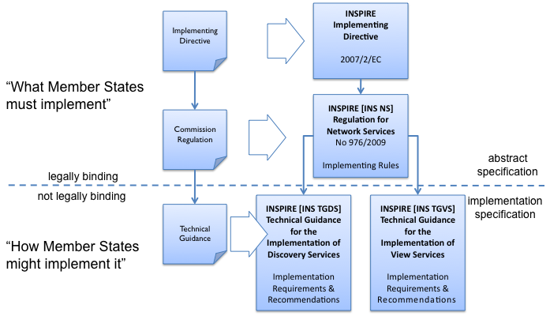

[.text-center]
*Figure 1*: Relationship between INSPIRE Implementing Rules and Technical Guidance

Technical Guidance documents define how Member States might implement the Implementing Rules described in a Commission Regulation. Technical Guidance documents may include non-binding technical requirements that must be satisfied if a Member State chooses to conform to the Technical Guidance. Implementing this technical guidance will maximise the interoperability of INSPIRE services.

This Technical Guidance concerns the INSPIRE View Services. The Technical Guidance contains detailed technical documentation highlighting the mandatory and the recommended elements related to the implementation of INSPIRE View Services. The technical provisions and the underlying concepts are often illustrated by use case diagrams and accompanied by examples.

*This document will be publicly available as a 'non-paper', as it does not represent an official position of the Commission, and as such cannot be invoked in the context of legal procedures.*

*Legal Notice*

Neither the European Commission nor any person acting on behalf of the Commission is responsible for the use, which might be made of this publication.

== Revision History

[align=center,width="100%",cols="16%,10%,20%,54%",options="header",]
|===
|*Date* |*Release* |*Editor* |*Description*
|28Jul2009 |2.0 |Network Services Drafting Team |
|17Jun2010 |2.12 |Initial Operating Capability Task Force a|
The INSPIRE extended Capabilities XML schema has been included in Annex B.

Links with other technical components in INSPIRE have been described based on the INSPIRE domain model.

A new interpretation and recommended implementation of the Link Discovery Service operation has been described.

An approach to implement the required Language parameter has been recommended.

General editorial changes.

|24Jan2011 |2.14 |IOC ST, +
Graham Vowles |Editorial Review to improve accuracy and clarity
|28Jan2011 |2.15 |IOC ST |Update to include edits made during IOC TF – Services Meeting in Copenhagen
|3Feb2011 |2.16 |IOC ST, +
Graham Vowles |Update to Implementation Requirements and Implementation Recommendations. +
Update to Language Requirement Section.
|8 Feb2011 |2.17 |IOC ST, +
Graham Vowles |Update of XML Examples
|10Feb2011 |2.18 |IOC ST, +
Graham Vowles |Added use cases and rationale of extended capabilities approach. Added INSPIRE Profile of WMTS 1.0.0.
|17Feb2011 |2.19 |IOC ST, +
Graham Vowles |Update to link view service, removal of unnecessary Annexes.
|21Feb2011 |2.20 |IOC ST, +
Graham Vowles |Updated to accommodate schema changes and update to WMTS, WMS-C and WMS1.1.1
|22Feb2011 |2.21 |IOC ST, +
Graham Vowles |Finalised for IOC TF review.
|15Mar2011 |2.22 |IOC ST, EC JRC a|
Updated following the IOC TF comments.

Changed sections on Coupled resource. There is now only one section referring to the Coupled resource (4.2.3.3.1.5).

|16Mar2011 |2.23 |IOC ST, EC JRC a|
The layer metadata element Geographic Bounding Box is mapped to <wms:BoundingBox> element and not to the +
<wms: EX_GeographicBoundingBox>. Updated Sections (4.2.3.3.1.8 and 4.2.3.3.4.4) and related examples.

Changed Recommendation in section 4.2.3.3.4.6 (Name of Layer) to Requirement

|17Mar2011 |2.24 |IOC ST, EC JRC a|
Corrected examples for WMS 1.1.1 (Annex B) and WMS-C profile for WMS 1.1.1 (Annex A).

Added Example of Extended Capabilities Response Scenario 1 in Annex C and Example of Extended Capabilities Response Scenario 2 in Annex D.

|20Mar2011 |2.25 |IOC ST, EC JRC |Editorial review
|21Mar2011 |2.26 |IOC ST, EC JRC, Graham Vowles |Final editorial review.
|29Mar2011 |3.0 |IOC Task Force |IOC TF Approved Version
|07Nov2011 |3.1 |IOC ST, EC JRC |Added Chapter 6 on Quality of Services (QoS). Deleted Annex F on QoS.
|07Nov2011 |3.1 |EC JRC a|
Corrected Typographical errors in Section 4.1: +
xmlns:inspire_commmon to xmlns:inspire_common and xmlns:inspire_ds="http://inspire.ec.europa.eu/schemas/inspire_ds/1.0"

to xmlns:inspire_vs="http://inspire.ec.europa.eu/schemas/inspire_vs/1.0"

|07Nov2011 |3.1 |IOC TF |IOC TF Approved
|18Feb2013 |3.11 |EC JRC |Replaced all instances of INSPIRECRS84QUAD in the XML examples with InspireCRS84Quad for consistency
|18Feb2013 |3.11 |EC JRC |Added explicit reference to schemas location and namespace definitions for WMTS (Chapter 5)
|05Mar2013 |3.11 |EC JRC |Added Figure 11 in Chapter 5.2.7.1 to illustrate the GoogleCRS84Quad and for better clarifying the difference to InspireCRS84Quad
|15Mar2013 |3.11 |EC JRC |The URN scheme urn:ogc:def:crs:OGC:1.3:CRS84 is now deprecated. All instances (Examples 40, 42, 43, 44 and Section 5.2.7.1) have been replaced with http://www.opengis.net/def/crs/OGC/1.3/CRS84.
|15Mar2013 |3.11 |EC JRC |Added recommendation in Section 5.1 to use http URIs instead of URNs.
|===

:sectnums:

== Introduction

INSPIRE View Services allow users and computer programs to view spatial datasets. This document specifies Technical Guidance for Member States to implement INSPIRE View Services as mandated by the Regulation on INSPIRE Network Services [*INS NS*, Annex III].

Following this Technical Guidance will ensure that INSPIRE View Services are implemented in a consistent and compatible way across Europe. It is based on European and international standards, current practices in related stakeholder communities and relevant European initiatives such as e‑Government, and the EU Interoperability Framework.

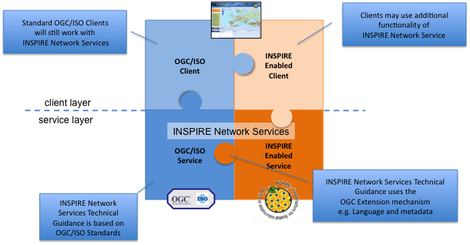

[.text-center]
*Figure 2*: Extending ISO and OGC Standards for INSPIRE Requirements

This document specifies requirements and recommendations based on the European de jure standard [*ISO 19128*] – Web Map Service (WMS) 1.3.0. It defines an INSPIRE Profile of [*ISO 19128*] to implement the following operations:

* Get View Services Metadata: Get metadata about a specific view service;
* Get Map: Returns a map for a specified area;
* Link View Service: Allows the linking of view services together.

The INSPIRE Profile of [ISO 19128] also make use of the OGC™ Styled Layer Descriptor Profile [*OGC SLD*], and the OGC™ Symbology Encoding Implementation Specification [*OGC SEIS*]. In addition this document defines how to handle multilingual aspects of INSPIRE View Services.

While the recommended approach to implement INSPIRE view services is the [*ISO 19128*] – Web Map Service (WMS) 1.3.0, an INSPIRE View Service may also be implemented based on the OGC™ WMS 1.1.1 or OGC™ Web Mapping Tiling Service - WMTS 1.0.0 specifications. An INSPIRE Profile of WMTS 1.0.0 is defined in Section 0 and examples of WMS-C (Tile Cashing WMS) profile for WMS 1.1.1 and WMS 1.1.1 are given in Annex A and Annex B respectively.

This is the initial version of the Technical Guidance document and it has been validated and tested in collaboration with the Initial Operating Capability Task Force. It may be used by the Member States for the initial implementation of the INSPIRE View Services.

== Normative references

This technical guidance incorporates, by dated or undated references, provisions from other publications. For dated references, subsequent amendments to or revisions of any of these publications apply to this guide only when incorporated in it by amendment or revision. For undated references, the latest edition of the publication referred to applies (including amendments).

These normative references are cited at the appropriate places in the text and the publications are listed hereafter:

INSPIRE, Implementing *Directive 2007/2/EC* of the European Parliament and of the Council as regards interoperability of spatial data sets and services

INSPIRE, *INS MD* Commission Regulation (EC) No 1205/2008 of 3 December 2008 implementing Directive 2007/2/EC of the European Parliament and of the Council as regards metadata (Text with EEA relevance). See also Corrigendum to INSPIRE Metadata Regulation

INSPIRE, *INS NS,* Commission Regulation (EC) No 976/2009 of 19 October 2009 implementing Directive 2007/2/EC of the European Parliament and of the Council as regards the Network Services

INSPIRE, *INS DS,* Commission Regulation (EU) No 1089/2010 of 23 November 2010 implementing Directive 2007/2/EC of the European Parliament and of the Council as regards interoperability of spatial data sets and services

INSPIRE, *INS MDTG*, INSPIRE Metadata Implementing Rules: Technical Guidelines based on EN ISO 19115 and EN ISO 19119, v1.1 (2009-02-18)

INSPIRE, *INS GCM*, INSPIRE Generic Conceptual Model (D2.5_v3.2).

INSPIRE, *INS DSTG*, Technical Guidance for the implementation of INSPIRE Discovery Services

*ISO 19115*: _2003: Geographic Information – Metadata_

*ISO 19119*: _2005, Geographic information – Services_

*ISO 19119: 2005 PDAM 1,* _Geographic information – Services_

*ISO 19128*: _2005, Geographic information — Web map server interface_

*ISO/IEC 2382-1*: _1993, Information technology – Vocabulary – Part 1: Fundamental terms_

OGC 05-077r4, *OGC SEIS*, OGC™ Symbology Encoding Implementation Specification, version 1.1.0 (Release 4)

OGC 05-078r4, *OGC SLD*, OGC™ Styled Layer Descriptor profile of the Web Map Service Implementation Specification, version 1.1.0 (Release 4) and its corrigendum1 for OGC Implementation Specification SLD 1.1.0 (07-123r1)

OGC 07-045, *CSW ISO AP,* OGC™ Catalogue Services Specification 2.0.2 - ISO Metadata Application Profile for CSW 2.0, version 1.0.0 (2007).

*OGC 07-057r7 –* OGC Web Map Tile Service (WMTS) 1.0.0

*OGC 06-121r3* *–* OGC Web Services Common Specification (OWS) 1.1.0

*IETF RFC 4646* - Tags for Identifying Languages

== Terms and abbreviations

=== Terms

[arabic]
. *application* *profile* +
set of one or more base standards and - where applicable - the identification of chosen clauses, classes, subsets, options and parameters of those base standards that are necessary for accomplishing a particular function [ISO 19101, ISO 19106]
. *discovery services* +
making it possible to search for spatial data sets and services on the basis of the content of the corresponding metadata and to display the content of the metadata [INSPIRE Directive]
. *metadata* +
information describing spatial data sets and spatial data services and making it possible to discover, inventory and use them [INSPIRE Directive]
. *metadata element* +
a discrete unit of metadata, in accordance with [ISO 19115]
. *network services* +
network services should make it possible to discover, transform, view and download spatial data and to invoke spatial data and e-commerce services [INSPIRE Directive]
. *queryable* +
a metadata element that can be queried upon
. **spatial data +
**data with a direct or indirect reference to a specific location or geographic area [INSPIRE Directive]
. **spatial data set +
**identifiable collection of spatial data [INSPIRE Directive]
. *view service* +
making it possible, as a minimum, to display, navigate, zoom in/out, pan, or overlay viewable spatial data sets and to display legend information and any relevant content of metadata [INSPIRE Directive]

=== Abbreviations

[cols="10,40"]
|===
|GET| HTTP Get Method
|INSPIRE| Infrastructure for Spatial Information in Europe
|IOC| Initial Operations Capability
|ISO| International Organisation for Standardisation
|MD| Metadata
|NS| Network Services
|OGC| Open Geospatial Consortium
|OWS| OGC Web Services
|SLD| Styled Layer Descriptor
|TF| Task Force
|URL| Universal Resource Locator
|UUID| Universal Unique Identifier
|WMS| Web Map Service
|WMS-C| WMS Tile Cashing
|WMTS| Web Map Tiling Service
|XML| eXtended Markup Language
|===

=== Verbal forms for the expression of provisions

In accordance with the ISO rules for drafting, the following verbal forms shall be interpreted in the given way:

* "shall" / "shall not": a requirement, mandatory to comply with the technical guidance
* "should" / "should not": a recommendation, but an alternative approach may be chosen for a specific case if there are reasons to do so
* "may" / "need not": a permission

*Implementation Requirements and Recommendations notation*

To make it easier to identify the requirements and the recommendations for INSPIRE View Services within this technical guidance, they are highlighted and numbered as shown below:

[IMPORTANT]
====
*Implementation Requirements #* are shown using this style
====

[TIP]
====
*Implementation Recommendations #* are shown using this style.
====

It is important to note that, implementation requirements and implementation recommendations may refer to either service or client implementations.

*Note*: It is worth noting that requirements as specified in the INSPIRE Regulations and Implementing Rules are legally binding, and that requirements and recommendations as specified in INSPIRE Technical Guidance are *not* legally binding. Therefore, within this technical guidance we have used the terms 'implementation requirement' and 'implementation recommendation' to indicate what is technically required or recommended to conform to the Technical Guidance.

*XML Example notation*

XML Examples are shown using Courier New on a grey background as below:

[source,xml,subs="+quotes",align=center]
----
<inspire:example>
  <inspire:highlight>
    Highlighted Text for emphasis
  </inspire:highlight>
</inspire:example>
----

*Note*: XML Examples are informative and are provided for information only and are expressly not normative. A reference implementation of the example XML is available on the following link:

http://inspire.ec.europa.eu/schemas/

=== References

To aid readability for a non-technical audience, references within this document are denoted using "Section" or "Annex". For example, Section 5.3.1 or Annex A.

References to other documents refer to the list of normative references in Section 3 and use the abbreviated title as indicated in *Bold* text. For example, [*CSW ISO AP*] uses the abbreviated title for the document as shown below:

____
OGC 07-045, *CSW ISO AP*, OGC™ Catalogue Services Specification 2.0.2 - ISO Metadata Application Profile for CSW 2.0, version 1.0.0 (2007).
____

References within other documents are show as above using the abbreviated title, together with the appropriate section within the document. For example, [*CSW ISO AP,* Section 8.2.3.1], refers to Section 8.2.3.1 within the document as listed above.

== INSPIRE Profile of ISO 19128

=== General background

The base specification of an INSPIRE View Service relies on the [*ISO 19128*] International standard.

[IMPORTANT]
====
*Implementation Requirement 1* An INSPIRE View Service shall implement the minimal mandatory behaviour from an [*ISO 19128*] service, extended with the extensions required by the INSPIRE Directive and the Implementing Rules for View services.
====

Section 4.2 and subsequent sections specify required extensions to the base specification. They are laid down following the [*ISO 19128,* Section 6.9] document structure.

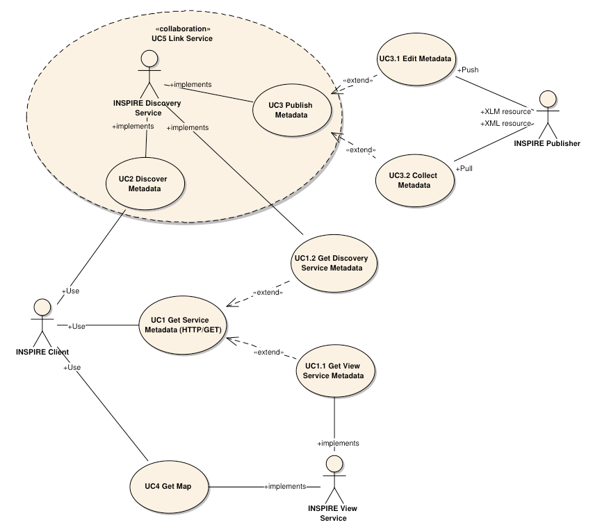

[.text-center]
*Figure 3*: INSPIRE Generic Use Case

Figure 3 illustrates use cases for the creation and publication of metadata, their discovery through a discovery service and viewing of spatial data sets via an INSPIRE View service.

[IMPORTANT]
====
*Implementation Requirement 2* The use of [*ISO 19128*] de jure standard as a basis for implementing an INSPIRE View service means that this service shall comply with the "basic WMS" conformance class as defined in this de jure standard.
====

Compliance with the "basic WMS" conformance class should augment the feasibility of reaching Initial Operation Capability (IOC) by the legal deadline of May 9th 2011 as INSPIRE conformant WMSs can be built based on available software that has obtained certification for this standard.

*Rationale behind the choice of an INSPIRE Schema for implementing the extended capabilities of INSPIRE Network Services*

The INSPIRE Network Service Regulation [*INS NS*] requires a Network Service to respond to a Get Network Service Metadata request with a response that contains as one of its parameters the Network Service INSPIRE metadata.

At the time of writing this Technical Guidance the OGC GetCapabilities response document does not include all required INSPIRE metadata for the Network Service and in order to do so the Extended Capabilities mechanism is used. Through this mechanism it is possible to link INSPIRE metadata with the GetCapabilities response, either by including the missing INSPIRE metadata elements of the Network Service, or by including a reference to the INSPIRE Network Service metadata record.

The initial approach was to re-use, for extended capabilities elements, the ISO 19139 data types. The Advantages of using the ISO 19139 data types are:

* new data types do not need to be defined 
* existing client applications already have the necessary bindings to read and write the information. Type redefinition was however necessary for the following elements:
** INSPIRE Service Type (implemented as gco:GenericName_PropertyType)
** Languages
** CurrentLanguage
** TemporalReference

Which, however breaks compatibility with existing clients. The disadvantages of this approach on the other hand are:

* ISO 19139 data types currently have a double implementation;
** The schemas from ISO 19139 version 2005-DIS (Draft International Standard) dated 2006 May 4 (http://schemas.opengis.net/iso/19139/20060504/[+++20060504/+++]) depend on the unofficial GML 3.2.0 version, but on the other hand is used in ISO AP 1.0 for CSW;
** The ISO/TS 19139 Schemas dated 2007 April 17 (http://schemas.opengis.net/iso/19139/20070417/[+++20070417/+++]) depend on the official GML version 3.2.1 which relies on a different namespace but does not make available the implementation for the "srv" namespace for service metadata;
* CSW schema version 2.0.2 includes OGC filter version 1.1.0 which in turn includes GML version 3.1.1;
* An INSPIRE View Service may also be implemented using WMS 1.1.1. The WMS 1.1.1 schema however is officially implemented only through DTD technology. There is no official DTD implementation for ISO 19139.

As a result for the discovery service capabilities document this approach would require reference to three different versions of GML in the same document.

*It has therefore been decided to use a custom INSPIRE schema for the missing INSPIRE metadata elements in the Extended Capabilities section. This allows for an easy integration with all OGC services and full validation of INSPIRE compliance using standard XML validation.* Table 3 *shows the mapping between the INSPIRE metadata elements and the ISO 19128 Capabilities metadata elements.*

*Note: the schema will be aligned to the relevant standards once these support the INSPIRE requirements. Alignment between The OGC OWS Common Implementation specification and ISO 19119 should also help addressing some of the issues.*

The custom INSPIRE schemas are available at http://inspire.ec.europa.eu/schemas/

This Technical Guidance uses the following namespace definitions:

xmlns:inspire_vs="http://inspire.ec.europa.eu/schemas/inspire_vs/1.0" xmlns:inspire_common="http://inspire.ec.europa.eu/schemas/common/1.0"

The following sections specify the required extensions to the given specifications.

=== View service operations

[IMPORTANT]
====
*Implementation Requirement 3* The following ISO 19128 operations shall be implemented for an INSPIRE View service: GetCapabilities; GetMap.
====

[.text-center]
*Table 1* : View Service Operations

[width="100%",cols="47%,53%",align="center"]
|===
^|*INSPIRE View Service operations* ^|*ISO 19128 WMS operations*
|Get View Service Metadata |GetCapabilities
|Get Map |GetMap
|Link View Service |See Section 4.2.5
|===

The first two operations use parameters defined in the [*ISO 19128*] WMS standard, but this section specifies the role of some parameters in the INSPIRE context. As stated in [*ISO 19128,* Section 6.3.1] support for the GET method is mandatory.

[TIP]
====
*Implementation Recommendation 1* It is recommended that the GET method is used for the view service operations.
====

==== Common requests parameters for the View Service operations

*Common request parameters for the View Service operations:*

|===
|VERSION |The VERSION parameter specifies the protocol version number. It is optional for the GetCapabilities operation and mandatory for the GetMap operation.
|REQUEST |The mandatory REQUEST parameter indicates which service operation is being invoked. The value shall be the name of one of the operations offered by the Web Map Server.
|FORMAT |The FORMAT parameter specifies the output format of the response to an operation. It is optional for the GetCapabilities operation and mandatory for the GetMap operation.
|EXCEPTIONS |The optional EXCEPTIONS request parameter states the format in which to report errors.
|SERVICE |The SERVICE parameter specifies the type of service and shall have the value "WMS"
|LANGUAGE |See Section 0 Language Requirements (INSPIRE extension)
|===

==== View service exceptions

Internationalisation of service exceptions is optional.

[TIP]
====
*Implementation Recommendation 2* If service exceptions are internationalised then the error messages (exceptions) are either expressed in the service's default language (suppose that the request is incorrect and the LANGUAGE parameter has not been interpreted before issuing the error/exception text) or in the preferred (requested) language in other cases.
====

See also Section 4.3.2 Common concept for other operations.

==== Get View Service Metadata operation

===== General

According to [*INS NS*, Annex III, Section 2.2] the Get View Service Metadata shall contain the following sets of parameters:

* View Service Metadata, containing at least the INSPIRE metadata elements of the View Service;
* Operations Metadata to provide metadata about the operations implemented by the View Service;
* Languages, including the Supported languages and Response language; and
* Layers Metadata parameters;

Figure 4 illustrates the Get View Service metadata use case.

[IMPORTANT]
====
*Implementation Requirement 4* The metadata response parameters shall be provided through the service Capabilities, as defined in the WMS Standard [*ISO 19128*, Section 7.2.4]. These capabilities are mandatory and defined when a WMS is set up. They consist of service information, supported operations and parameters values. The extended capabilities section shall be used to fully comply with the INSPIRE View Service metadata requirements (see section 4.2.3.3.1).
====

===== GetCapabilities operation

[IMPORTANT]
====
*Implementation Requirement 5* The operation for implementing INSPIRE "Get View Service Metadata" operation is the GetCapabilities operation. The parameters defined within the [*ISO 19128*] standard shall be used to convey relevant information in order to get the expected responses as described in [*INS NS*, Annex III, Section 2.2] of the Regulation on INSPIRE Network Services.
====

[.text-center]
*Table 2*: GetCapabilities core parameters

[align=center,width="100%",cols="31%,12%,57%",options="header"]
|===
|*Request parameter* |*Mandatory / optional* |*Description*
|VERSION=version |O |Request version: 1.3.0
|SERVICE=WMS |M a|
Service type. Fixed value: WMS.
The ServiceType for an ISO 19128:2005(E) – WMS1.3.0 is fixed to "WMS".
|REQUEST=GetCapabilities |M |Request name. Fixed value: GetCapabilities
|LANGUAGE=code |O |Request language (INSPIRE extension).
|FORMAT=MIME_type |O |Output format of service metadata. Defaults to text/xml.
|===

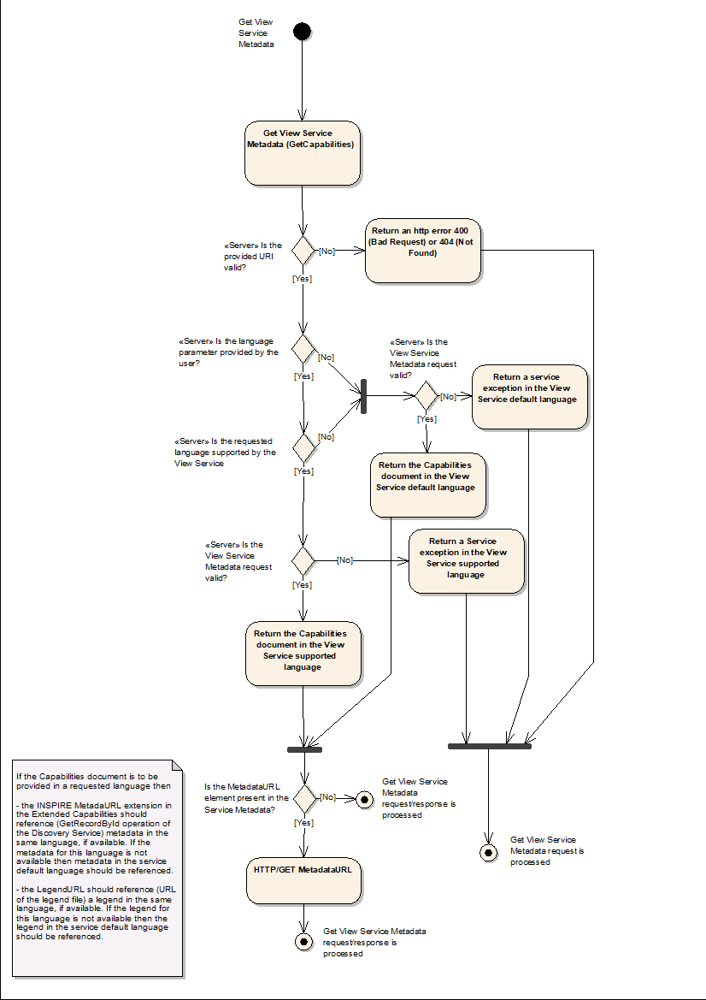

[.text-center]
*Figure 4*: Get View Service Metadata Use Case (UC1)

===== GetCapabilities response

====== View service metadata

Two scenarios have been identified for publishing View Service metadata conforming to the Regulation on INSPIRE Network Services [*INS NS*] and on Metadata [*INS MD*]. It is up to the Member State to choose which scenario best fits its needs. As these scenarios are not mutually exclusive, a Member State may choose to implement both.

*Scenario 1: INSPIRE network service metadata in a Discovery Service is referenced through an extended capability.*

This scenario involves adding a reference to an online INSPIRE metadata resource in the extended INSPIRE capabilities.

[IMPORTANT]
====
*Implementation Requirement 6* The <inspire_common:MetadataURL> element within the extended INSPIRE capabilities of an [*ISO 19128*] – WMS 1.3.0 <wms:Capability> element shall be used to reference the INSPIRE service metadata available through an INSPIRE Discovery Service. Mandatory [*ISO 19128*] – WMS 1.3.0 metadata elements shall be mapped to INSPIRE metadata elements to implement a consistent interface.
====

*Scenario 2: Use (extended) capabilities to map all INSPIRE metadata elements to the [ISO 19128] – WMS1.3.0 elements.*

This scenario involves mapping all INSPIRE metadata elements to [*ISO 19128*] – WMS 1.3.0 elements.

[IMPORTANT]
====
*Implementation Requirement 7* INSPIRE metadata are mapped to WMS capabilities elements to its full extent. It is mandatory to use the mapping provided in this Technical Guideline (described in Section 4.2.3.3.1.1 to 4.2.3.3.1.16. INSPIRE metadata elements that cannot be mapped to available [*ISO 19128*] – WMS1.3.0 elements are implemented as Extended Capabilities.  Metadata are published through a service's capabilities document and can be harvested by an INSPIRE Discovery service.
====

[IMPORTANT]
====
*Implementation Requirement* *8* Regardless of the scenario chosen to be implemented, a language section shall be added in the extended capability of the service to fulfil the language requirements of the Network Services Regulation [*INS NS*].
====

In scenario 1, INSPIRE View service metadata are managed in an INSPIRE Discovery catalogue and need to be partially mapped to [*ISO 19128*] – WMS 1.3.0 elements and extended capabilities.

In scenario 2, INSPIRE service metadata are fully mapped to [*ISO 19128*] – WMS 1.3.0 elements and extended capabilities and are managed through service capabilities.

A graphical illustration of the XML schema for the extended capabilities for both scenarios as required for the INSPIRE View Services is shown in Figure 5. Examples of extended capabilities response for both scenarios are provided in Annexes Annex C and Annex D.

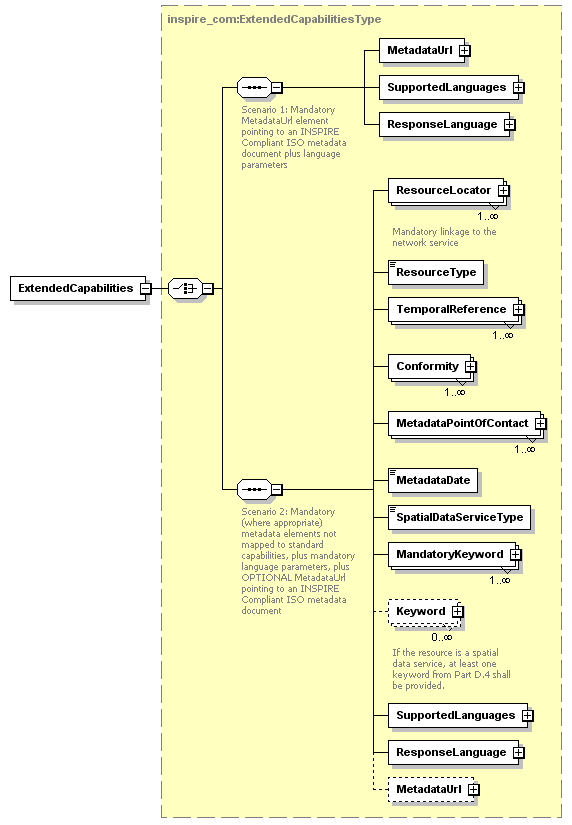

[.text-center] 
*Figure 5*: Illustration of the Extended Capabilities for Scenario 1 and 2 for INSPIRE View Services

[IMPORTANT]
====
*Implementation Requirement 9* Regardless of the scenario chosen to be implemented View Service Metadata shall be published in an INSPIRE Discovery Service. This is required to support a) the INSPIRE View Link service operation and b) discovery of View services by client applications such as the INSPIRE geoportal
====

[IMPORTANT]
====
*Implementation Requirement 10* An INSPIRE View service shall contain the INSPIRE metadata elements set out in the Metadata Regulation [*INS* *MD*] as shown in Table 3.
====

INSPIRE metadata are mapped to the <WMS_Capabilities> element of the GetCapabilities response as illustrated in Table 3. In Sections 4.2.3.3.1.1 through 4.2.3.3.1.16 the mandatory mappings for supporting these scenarios are described in detail.

[.text-center] 
*Table 3*: Mapping between INSPIRE metadata elements and [ISO 19128] WMS elements

[width="100%",cols="36%,64%",options="header"]
|===
^|*INSPIRE Metadata elements* +
*(+++M+++andatory - +++C+++onditional)*

^|*ISO 19128 elements of* +
*<WMS_Capabilities>*

|Resource Title (M) |wms:Title
|Resource Abstract (M) |wms:Abstract
|Resource Type (M) |inspire_common:ResourceType +
(ExtendedCapabilities)

|Resource Locator \(C) |inspire_common:ResourceLocator +
(ExtendedCapabilities)

|Coupled Resource \(C) |wms:MetadataURL (Layer property)
|Spatial Data Service Type (M) | inspire_common:SpatialDataServiceType +
(ExtendedCapabilities)

|Keyword (M) |wms:Keyword; inspire_common:Keyword
|Geographic Bounding Box (M) |wms:EX_GeographicBoundingBox (Layer property)
|Temporal Reference (M) |inspire_common:TemporalReference +
(ExtendedCapabilities)

|Spatial Resolution \(C) |wms:Abstract
|Conformity (M) |inspire_common:Conformity +
(ExtendedCapabilities)

|Conditions for Access and Use (M) |wms:Fees
|Limitations on Public Access (M) |wms:AccessConstraints
|Responsible Organisation (M) |wms:ContactInformation
|Metadata Point of Contact (M) |inspire_common:MetadataPointOfContact +
(ExtendedCapabilities)

|Metadata Date (M) |inspire_common:MetadataDate +
(ExtendedCapabilities)

|Metadata Language (M) |inspire_common:SupportedLanguages +
(ExtendedCapabilities)
|===

4.2.3.3.1.1 RESOURCE TITLE

This is a characteristic and often-unique name by which the resource is known. It is mapped with the <wms:Title> element.

[.text-center]
*Example 1*: Resource title

[source,xml,subs="+quotes",align=center]
----
<wms:WMS_Capabilities version="1.3.0" xmlns:wms="http://www.opengis.net/wms">
<wms:service>
  <wms:name>
    WMS
  </wms:name>
  <wms:title>
    Member State INSPIRE View Service
  </wms:title>
  ...
</wms:service>
----

4.2.3.3.1.2 RESOURCE ABSTRACT

This is a brief narrative summary of the content of the resource. It is mapped with the <wms:Abstract> element.

[.text-center]
*Example 2*: Resource abstract

[source,xml,subs="+quotes",align=center]
----
<wms:WMS_Capabilities version="1.3.0" xmlns:wms="http://www.opengis.net/wms">
<wms:service>
  <wms:name>
    WMS
  </wms:name>
  <wms:title>
    Member State INSPIRE View Service
  </wms:title>
  <wms:abstract>
    View Service for protected sites spatial data theme
  </wms:abstract>
  ...
</wms:service>
----

4.2.3.3.1.3 RESOURCE TYPE

This is the type of the resource being described by the metadata. The value domain of this metadata element is defined in [INS MD, Part D.1]

[IMPORTANT]
====
*Implementation Requirement 11* Within the scope defined by the INSPIRE directive the value of the Resource Type shall be fixed to 'service' for spatial data services. As the Resource Type is not supported by [*ISO 19128*] – WMS 1.3.0, an extension shall be used to map this to an <inspire_common:ResourceType> element within an <inspire_vs:ExtendedCapabilities> element.
====

4.2.3.3.1.4 RESOURCE LOCATOR

The Resource Locator defines the link, commonly expressed as a Uniform Resource Locator(s) (URL) to the service. The Resource Locator may be one of the following:

* A link to the service capabilities document;
* A link to the service WSDL document (SOAP Binding);
* A link to a web page with further instructions;
* A link to a client application that directly accesses the service.

The <wms:OnlineResource> element within the <wms:Service> element would be the preferred choice for mapping the Resource Locator metadata element. But, for consistency with the INSPIRE Discovery service metadata in the capabilities document it has been decided that:

[IMPORTANT]
====
*Implementation Requirement 12* An extension shall be used to map Resource Locator to an <inspire_common:ResourceLocator> element within an <inspire_vs:ExtendedCapabilities> element.
====

4.2.3.3.1.5 COUPLED RESOURCE

The Coupled Resource identifies, where relevant, the target spatial data sets of the service through their unique resource identifiers.

[IMPORTANT]
====
*Implementation Requirement 13* Coupled Resource shall be mapped to the <MetadataURL> elements of the Layer elements of the service capabilities. If linkage to the data sets or series on which the service operates are available, then the linkage to these resources shall be provided as stated by the INSPIRE Metadata Technical Guidance [*INS MDTG*].
====

[IMPORTANT]
====
*Implementation Requirement 14* Each of the <MetadataURL> elements shall be populated with a URL that allows access to an unambiguous metadata record. The URL shall be either an HTTP/GET call on the GetRecordById operation of the Discovery Service or a direct link to the ISO 19139 metadata document.
====

_Example:_

For the spatial data set _protectedSites.NL_. A metadata document describing this spatial dataset is available through a discovery service. The metadata includes a metadata identifier "_ac9f8250-3ae5-49e5-9818-d14264a4fda4_" and a unique resource identifier _protectedSites.NL_. The view service exposes the spatial dataset through a layer _PS.ProtectedSite_ (harmonized name defined in the IR on interoperability of spatial data sets and services). As part of the capabilities metadata, the layer includes a MetadataURL pointing to the metadata document in the discovery service:

[source,xml,subs="+quotes"]
----
http://.../discovery?Service=CSW&Request=GetRecordById&Version=2.0.2&[http://.../discovery?Service=CSW&Request=GetRecordById&Version=2.0.2 +
&]id=ac9f8250-3ae5-49e5-9818-d14264a4fda4 +
&outputSchema=http://www.isotc211.org/2005/gmd&elementSetName=full
----

[.text-center]
*Example 3*: Coupled resource (MetadataURL)

[source,xml,subs="+quotes",align=center]
----
<wms:WMS_Capabilities version="1.3.0" xmlns:wms="http://www.opengis.net/wms">
  <wms:Service>
    ...
  </wms:Service>
  <wms:Capability>
    ...
    <wms:Layer>
      ...
    <wms:Title>Transport networks: Road Area</wms:Title>
    <wms:Abstract>
      View Service for making available a road transport network...
    </wms:Abstract>
    <wms:KeywordList>
      <wms:Keyword vocabulary="GEMET">GEMET keyword</wms:Keyword>
      ...
     </wms:KeywordList>
     ...
     <wms:ex_geographicboundingbox>
      <wms:westBoundLongitude>-31.2</wms:westBoundLongitude>
      <wms:eastBoundLongitude>69.1</wms:eastBoundLongitude>
      <wms:southBoundLatitude>27.2</wms:southBoundLatitude>
      <wms:northBoundLatitude>90</wms:northBoundLatitude>
     </wms:ex_geographicboundingbox>
     ...
      <MetadataURL type="ISO19115:2003">
        <Format>text/xml</Format>
          <OnlineResource xmlns:xlink="http://www.w3.org/1999/xlink"
            xlink:type="simple"
            xlink:href="http://.../discovery?Service=CSW&Request=GetRecordById&Version=2.0.2&id=[METADATA_IDENTIFIER]&outputSchema=http://www.isotc211.org/2005/gmd&elementSetName=full"/>
      </MetadataURL>
      ...
    </wms:Layer>
  </wms:Capability>
</wms:WMS_Capabilities>
----

4.2.3.3.1.6 SPATIAL DATA SERVICE TYPE

Given that [*ISO 19128*] – WMS 1.3.0 has been identified as one of the relevant standards to implement INSPIRE View Services, the technical spatial data service type defined by [*ISO 19128*] – WMS 1.3.0 is mapped to the <wms:Name> element and has a fixed "WMS" value.

[IMPORTANT]
====
*Implementation Requirement 15* For the Spatial Data Service Type as defined by the INSPIRE Metadata Regulation [*INS MD*] ('view') an extension shall be used to map this to an <inspire_common:SpatialDataServiceType> element within an <inspire_vs:ExtendedCapabilities> element. For an INSPIRE View Service the Spatial Data Service Type shall have a fixed value "view" according to INSPIRE Metadata Regulation [INS MD Part 3].
====

4.2.3.3.1.7 KEYWORD

Commonly used word(s), formalized word(s) or phrase(s) used to describe the resource.

[IMPORTANT]
====
*Implementation Requirement 16* The INSPIRE Metadata Regulation [*INS MD*] mandates that in the case of spatial data services at least one keyword from the "Classification of Spatial data Services" (Part D.4 from *INS MD*] shall be provided.
====

[TIP]
====
*Implementation Recommendation 3* Additional keywords may be described as a free text or may originate from any Controlled Vocabulary. If they originate from a Controlled Vocabulary, for example GEMET, then the citation of the originating Controlled Vocabulary shall be provided in the extended capabilities.
====

[IMPORTANT]
====
*Implementation Requirement 17* If additional keywords are provided they shall be mapped with the <wms:KeywordList> element, the individual keywords shall be mapped to the <wms:Keyword> element, the referenced vocabulary shall be mapped to the 'vocabulary' attribute of the <wms:Keyword> element.
====

[.text-center]
*Example 4*: Keyword

[source,xml,subs="+quotes",align=center]
----
<wms:WMS_Capabilities version="1.3.0" xmlns:wms="http://www.opengis.net/wms">
  <wms:Service>
    <wms:Name>WMS</wms:Name>
    <wms:Title>Member State INSPIRE View Service</wms:Title>
    <wms:Abstract>Service for making available INSPIRE spatial data themes</wms:Abstract>
    <wms:KeywordList>
      <!-- vocabulary in WMS 1.3.0 only -->
      <wms:Keyword vocabulary="ISO">infoMapAccessService</wms:Keyword>
      <wms:Keyword vocabulary="GEMET">keyword</wms:Keyword>
      <wms:Keyword>keyword</wms:Keyword>
      ...
    </wms:KeywordList>
    ...
  </wms:Service>
</wms:WMS_Capabilities>
----

Typing keywords according to the Metadata Technical Guidance and [*ISO 19115*] allow for the detailed description of the thesaurus a keyword belongs to. To provide this functionality and to keep a similar interface as for the Discovery Service, this approach for describing keywords is provided as an extended capability.

[IMPORTANT]
====
*Implementation Requirement 18* The keywords shall be mapped to the capabilities extension <inspire_common:Keyword> and <inspire_common:MandatoryKeyword> within an <inspire_vs:ExtendedCapabilities> element.
====

4.2.3.3.1.8 GEOGRAPHIC BOUNDING BOX

[IMPORTANT]
====
*Implementation Requirement 19* Geographic Bounding Box shall be mapped to the EX_GeographicBoundingBox element of Layer elements.
====

Note that this metadata element is different to the Layer Metadata Geographic Bounding Box element which is mapped to the <wms:BoundingBox> element (see Section 4.2.3.3.4.4)

[.text-center]
*Example 5*: Geographic bounding box

[source,xml,subs="+quotes",align=center]
----
<wms:WMS_Capabilities version="1.3.0" xmlns:wms="http://www.opengis.net/wms">
  <wms:Service>
    ...
  </wms:Service>
  <wms:Capability>
    ...
    <wms:Layer>
      ...
      <wms:Title>Transport networks: Road Area</wms:Title>
      <wms:Abstract>View Service for making available a road transport network…</wms:Abstract>
      <wms:KeywordList>
        <wms:Keyword vocabulary="GEMET">GEMET keyword</wms:Keyword>
        ...
      </wms:KeywordList>
      ...
      <wms:EX_GeographicBoundingBox>
        <wms:westBoundLongitude>-31.2</wms:westBoundLongitude>
        <wms:eastBoundLongitude>69.1</wms:eastBoundLongitude>
        <wms:southBoundLatitude>27.2</wms:southBoundLatitude>
        <wms:northBoundLatitude>80.9</wms:northBoundLatitude>
      </wms:EX_GeographicBoundingBox>
      ...
    </wms:Layer>
  </wms:Capability>
</wms:WMS_Capabilities>
----

4.2.3.3.1.9 TEMPORAL REFERENCE

The creation, publishing or revision date of the INSPIRE View Service.

[IMPORTANT]
====
*Implementation Requirement 20* To be compliant with the INSPIRE Metadata Regulation [*INS MD*] and with [*ISO 19115*] one of following dates shall be used: date of publication, date of last revision, or the date of creation. Date of last revision is preferred. The date shall be expressed in conformity with the [*INS MD*]
====

INSPIRE also allows the use of a Temporal Extent as Temporal Reference, which is not supported by [*ISO 19115*].

[IMPORTANT]
====
*Implementation Requirement 21* As the Temporal Reference is not directly supported by [*ISO 19128*] – WMS 1.3.0 an extension shall be used to map this to an <inspire_common:TemporalReference> element within an <inspire_vs:ExtendedCapabilities> element.
====

4.2.3.3.1.10 SPATIAL RESOLUTION

Spatial resolution refers to the level of detail of the data set. As stated by the INSPIRE Metadata Technical Guidance [*INS MDTG*], it is not possible to express the restriction of a service concerning the spatial resolution in the current version of [*ISO 19119*].

[TIP]
====
*Implementation Recommendation 4* While this issue is being addressed by the standardisation community, spatial resolution restrictions for services shall be written in the Abstract as mandated by the Metadata Technical Guidance [*INS MDTG*]. Spatial Resolution restrictions at service metadata level shall be declaratively described in the <wms:Abstract> element.
====

Nevertheless is it possible to describe the Spatial Resolution of an individual Layer in the "resx" and "resy" attributes of a <wms:BoundingBox> element. Additional to any Spatial Resolution restrictions expressed in the <wms:Abstract> element, the Spatial Resolution for every published Layer may be documented in the in the "resx" and "resy" attributes of the <wms:BoundingBox> for this Layer. This is not required by INSPIRE Regulations at this moment.

4.2.3.3.1.11 CONFORMITY

[IMPORTANT]
====
*Implementation Requirement 22* The INSPIRE Metadata Regulation [*INS MD*] requires that metadata shall include information on the degree of conformity with the implementing rules provided in Art. 7.1 (Interoperability of spatial data sets and services) of the INSPIRE Directive [*Directive 2007/2/EC*].
====

The INSPIRE Metadata Regulation [*INS MD*, Part D 5] defines three degrees of conformity which shall be reported in the capabilities:

* "conformant" or "not conformant" : When the conformity to the cited Specification has been evaluated, it shall be reported as a domain consistency element. In that case, if the evaluation has passed, the degree is confomant, otherwise it is not conformant.
* "not evaluated": When the conformity to the cited Specification has not been evaluated it shall it shall be reported as a domain consistency element with a value of "not evaluated". Note that in the INSPIRE Metadata Technical Guidance [*INS MDTG]*, the absence of [*ISO 19115*] metadata related to the conformity to an INSPIRE specification implies that the conformity has not been evaluated.

There is no element available in [*ISO 19128*] – WMS 1.3.0 that allows the description of the degree of conformity with a specific specification.

[IMPORTANT]
====
*Implementation Requirement 23* An extension shall be used to map this to an <inspire_common:Conformity> element within an <inspire_vs:ExtendedCapabilities> element.
====

4.2.3.3.1.12 CONDITIONS FOR ACCESS AND USE

Defines the conditions for access and use of spatial data sets and services, and where applicable, corresponding fees

[IMPORTANT]
====
*Implementation Requirement 24* This metadata element shall be mapped to the <wms:Fees>  element of the capabilities. If no conditions apply to the access and use of the resource, "no conditions apply" shall be used. If conditions are unknown "conditions unknown" shall be used.
====

[.text-center]
*Example 6*: Conditions for access and use

[source,xml,subs="+quotes",align=center]
----
<wms:WMS_Capabilities version="1.3.0" xmlns:wms="http://www.opengis.net/wms">
<wms:service>
  <wms:name>
    WMS
  </wms:name>
  <wms:title>
    Member State INSPIRE View Service
  </wms:title>
  <wms:abstract>
    Service for making available INSPIRE spatial data themes
  </wms:abstract>
  <wms:keywordlist>
    <wms:keyword>
      keyword
    </wms:keyword>
    ...
  </wms:keywordlist>
  ...
  <wms:fees>
    no conditions apply
  </wms:fees>
</wms:service>
----

4.2.3.3.1.13 LIMITATIONS ON PUBLIC ACCESS

This metadata element shall provide information on the limitations (if they exist) and the reasons for such limitations. It is mapped with <wms:AccessConstraints> element.

No precise syntax has been defined for the text content of these elements in [*ISO 19128*].

[TIP]
====
*Implementation Recommendation 5* The use of "None" is recommended when no limitations on public access apply. When constraints are imposed, the MD_RestrictionCode codelist names may be used as defined in [*ISO 19115*, Annex B – Data Dictionary, Section 5.24].
====

[.text-center]
*Example 7*: Limitations on public access

[source,xml,subs="+quotes",align=center]
----
<wms:WMS_Capabilities version="1.3.0" xmlns:wms="http://www.opengis.net/wms">
<wms:service>
  <wms:name>
    WMS
  </wms:name>
  <wms:title>
    Member State INSPIRE View Service
  </wms:title>
  <wms:abstract>
    Service for making available INSPIRE spatial data themes
  </wms:abstract>
  <wms:keywordlist>
    <wms:keyword>
      keyword
    </wms:keyword>
    ...
  </wms:keywordlist>
  ...
  <wms:fees>
    no conditions apply
  </wms:fees>
  <wms:accessconstraints>
    None
  </wms:accessconstraints>
</wms:service>
----

4.2.3.3.1.14 RESPONSIBLE ORGANISATION

Description of the organisation responsible for the establishment, management, maintenance and distribution of the resource. It shall be mapped to the <wms:ContactInformation> element where the most relevant properties are:

* Organisation
* Role
* Contact address: postal address
* Phone
* Email: It is recommended to use an organisation level email address. +
Personal email addresses are not recommended.

[IMPORTANT]
====
*Implementation Requirement 25* Responsible Party as described in the INSPIRE Metadata Regulation [*INS MD*] shall be mapped to the <wms:ContactOrganization> element of the <wms:ContactPersonPrimary> within the <wms:ContactInformation> element.
====

[IMPORTANT]
====
*Implementation Requirement 26* The value domain of the Responsible Party role shall comply with the INSPIRE Metadata Regulation [*INS MD,* Part D6]. The Responsible Party Role shall be mapped to the <wms:ContactPosition> of the <wms:ContactInformation> element.
====

[.text-center]
*Example 8*: Responsible organisation

[source,xml,subs="+quotes",align=center]
----
<wms:WMS_Capabilities version="1.3.0" xmlns:wms="http://www.opengis.net/wms">
	<wms:Service>
		<wms:Name>WMS</wms:Name>
		<wms:Title>Member State INSPIRE View Service</wms:Title>
		<wms:Abstract>
Service for making available INSPIRE spatial data themes
		</wms:Abstract>
		<wms:KeywordList>
			<wms:Keyword>keyword</wms:Keyword>
			...
		</wms:KeywordList>
		...
		<wms:ContactInformation>
 	 <ContactPersonPrimary>
   <ContactPerson>person or department</ContactPerson>
   <ContactOrganization>organisation</ContactOrganization>
 </ContactPersonPrimary>
 <ContactPosition>custodian</ContactPosition>
			<wms:ContactAddress>
				<wms:AddressType>postal</AddressType>
				<wms:Address>Street nr., Street name</wms:Address>
				<wms:City>City</wms:City>
				<wms:StateOrProvince>if relevant or empty</wms:StateOrProvince>
				<wms:PostCode>postal code</wms:PostCode>
				<wms:Country>MS name</wms:Country>
			</wms:ContactAddress>
			<wms:ContactVoiceTelephone>Phone number</wms:ContactVoiceTelephone>
			<wms:ContactElectronicMailAddress>
contactPoint@organisation.country
			</wms:ContactElectronicMailAddress>
		</wms:ContactInformation>
		<wms:Fees>no conditions apply</wms:Fees>
		<wms:AccessConstraints>None</wms:AccessConstraints>
	</wms:Service>
	...
</wms:WMS_Capabilities>
----

4.2.3.3.1.15 METADATA POINT OF CONTACT

The Metadata Point Of Contact describes the organisation responsible for the creation and maintenance of the metadata [INS MD].

[IMPORTANT]
====
*Implementation Requirement 27* INSPIRE is more demanding than [*ISO 19115*] by mandating both the name of the organisation, and a contact e-mail address. The role of the responsible party serving as a metadata point of contact is out of scope of the Metadata Regulation [INS MD], but this property is mandated by [*ISO 19115*]. Its value shall be defaulted to "pointOfContact".
====

[IMPORTANT]
====
*Implementation Requirement 28* Since only one <wms:ContactInformation> element is allowed in [*ISO 19128*] – WMS 1.3.0 (to which Responsible Organisation is mapped), an extension shall be used to map this to an <inspire_common:MetadataPointOfContact> element within an <inspire_vs:ExtendedCapabilities> element.
====

4.2.3.3.1.16 METADATA DATE

The date when the INSPIRE View Service metadata was created or updated. [*ISO 19115*] is more restrictive because this element shall only contain the "date that the metadata was created". The INSPIRE Metadata Implementing Rules also allows the date it was updated. The update date is preferred.

[IMPORTANT]
====
*Implementation Requirement 29* As the Metadata Date is not supported by [*ISO 19128*] – WMS 1.3.0, an extension shall be used to map this to an <inspire_common:MetadataDate> element within an <inspire_vs:ExtendedCapabilities> element. The date shall be expressed in conformity with the [INS MD].
====

====== Operations Metadata

The operations metadata are mapped with the <wms:Request> element. There are two mandatory operations to be defined in the Operations Metadata: "Get View Service Metadata" implemented with the GetCapabilities WMS operation and "Get Map" implemented with the GetMap WMS operation.

The third mandatory operation "Link View Service", which allows a Public Authority or a Third Party to declare a view Service for the viewing of its resources through the Member State View Service while maintaining the viewing capability at the Public Authority or the Third party location, shall be implemented through the "Discover Metadata" operation of the Discovery Service which allows for View service metadata to be retrieved.

4.2.3.3.2.1 GETCAPABILITIES OPERATIONS METADATA

[IMPORTANT]
====
*Implementation Requirement 30* GetCapabilities operation metadata shall be mapped to the <wms:GetCapabilities> element.
====

[.text-center]
*Example 9*: Operations metadata

[source,xml,subs="+quotes",align=center]
----
<wms:WMS_Capabilities version="1.3.0" xmlns:wms="http://www.opengis.net/wms">
	<wms:Service>
		...
	</wms:Service>
	<wms:Capability>
		<wms:Request>
			<wms:GetCapabilities>
				<wms:Format>text/xml</wms:Format>
				...
				<wms:DCPType>
					<wms:HTTP>
						<wms:Get>
							<wms:OnlineResource
								xmlns:xlink="http://www.w3.org/1999/xlink"
								xlink:type="simple"
								xlink:href="http://hostname/path?"
							/>
						</wms:Get>
					</wms:HTTP>
				</wms:DCPType>
			</wms:GetCapabilities>
		</wms:Request>
		...
	</wms:Capability>
</wms:WMS_Capabilities>
----

4.2.3.3.2.2 GETMAP OPERATION METADATA

[IMPORTANT]
====
*Implementation Requirement 31* GetMap operation metadata shall be mapped to the <wms:GetMap> element. Either PNG or GIF format (without LZW compression) with transparency shall be supported by the View service [*INS NS*, Annex III, Part B].
====

[TIP]
====
*Implementation Recommendation 6* If PNG format is supported; the View service may select an appropriate bit depth for the returned PNG image. For layers with up to 256 colours, the recommended format is 8-bit indexed PNG. For layers with more than 256 colours, a higher bit depth should be used.
====

[.text-center]
*Example 10*: GetMap operation metadata

[source,xml,subs="+quotes",align=center]
----
<wms:WMS_Capabilities version="1.3.0"
 xmlns:wms="http://www.opengis.net/wms">
	<wms:Service>
		...
	</wms:Service>
	<wms:Capability>
		<wms:Request>
			<wms:GetCapabilities>
				<wms:Format>text/xml</wms:Format>
				...
				<wms:DCPType>
					<wms:HTTP>
						<wms:Get>
							<wms:OnlineResource
								xmlns:xlink="http://www.w3.org/1999/xlink"
								xlink:type="simple"
								xlink:href="http://hostname/path?"
							/>
						</wms:Get>
					</wms:HTTP>
				</wms:DCPType>
			</wms:GetCapabilities>
			<wms:GetMap>
				<wms:Format>image/png</wms:Format>
				...
				<wms:DCPType>
					<wms:HTTP>
						<wms:Get>
							<wms:OnlineResource
								xmlns:xlink="http://www.w3.org/1999/xlink"
								xlink:type="simple"
								xlink:href="http://hostname/path?"
							/>
						</wms:Get>
					</wms:HTTP>
				</wms:DCPType>
			</wms:GetMap>
		</wms:Request>
		...
	</wms:Capability>
</wms:WMS_Capabilities>
----

4.2.3.3.2.3 LINK VIEW SERVICE OPERATION METADATA

[TIP]
====
*Implementation Recommendation 7* The use of the "Discover Metadata" operation of the INSPIRE Discovery service is recommended for implementing the Link View Service operation.
====

The mechanism for publishing a view service's service metadata and discovering a View Service through its service metadata is described in [*INS DSTG*].

====== Languages

Refer to METADATA LANGUAGE element in Table 3.

====== Layers Metadata

The metadata elements listed in Table 3 of the INSPIRE Network Services regulation [*INS NS*, Annex III] shall be provided for each layer (see Table 4 below). The layers metadata are mapped with the <wms:Layer> element.

[.text-center]
*Example 11*: Layers Metadata

[source,xml,subs="+quotes",align=center]
----
<wms:WMS_Capabilities version="1.3.0"
xmlns:wms="http://www.opengis.net/wms">
	<wms:Service>
		...
	</wms:Service>
	<wms:Capability>
		...
		<wms:Layer>
			...
		</wms:Layer>
	</wms:Capability>
</wms:WMS_Capabilities>
----

[IMPORTANT]
====
*Implementation Requirement 32* The description of a layer shall use elements defined for the service capabilities in the [*ISO 19128*] standard. This description shall specify the role of some parameters for the INSPIRE View Service as stated in the Regulation on INSPIRE Network Services [*INS NS*].
====

[.text-center]
*Table 4*: Mapping between INSPIRE layer metadata elements and ISO 19128 WMS elements

[align=center,width="100%",cols="46%,54%",options="header",]
|===
^|*Metadata elements* ^|*ISO 19128 standard elements of <wms:Layer>*
|Resource Title |wms:Title
|Resource Abstract |wms:Abstract
|Keyword |wms:KeywordList
|Geographic Bounding Box |wms:BoundingBox
|Unique Resource Identifier |wms:Identifier + wms:AuthorityURL
|Name |wms:Name
|Coordinate Reference Systems |wms:CRS
|Styles |wms:Style
|Legend URL |wms:Style/wms:LegendURL
|Dimension Pairs |wms:Dimension[@name,@units]
|===

In addition to the above layer metadata elements the Coupled Resource View Service metadata element (see section 4.2.3.3.1.5) is mapped to the MetadataURL of the ISO 19128 standard elements of <wms:Layer>.

4.2.3.3.4.1 RESOURCE TITLE

The title of the layer, used for human communication, for presentation of the layer e.g. in a menu.

[IMPORTANT]
====
*Implementation Requirement 33* It is mapped with <wms:Title>. The harmonised title of a layer for an INSPIRE spatial data theme is defined by [*INS DS*] and shall be subject to multilingualism (translations shall appear in each mono-lingual capabilities localised documents).
====

[.text-center]
*Example 12*: Resource title

[source,xml,subs="+quotes",align=center]
----
<wms:WMS_Capabilities version="1.3.0"  xmlns:wms="http://www.opengis.net/wms">
	<wms:Service>
		...
	</wms:Service>
	<wms:Capability>
		...
		<wms:Layer>
			...
			<wms:Title>Transport networks: Road Area</wms:Title>
			...
		</wms:Layer>
	</wms:Capability>
</wms:WMS_Capabilities>
----

4.2.3.3.4.2 RESOURCE ABSTRACT

Layer abstract.

[IMPORTANT]
====
*Implementation Requirement 34* Text describing the layer. Subject to multilingualism. It shall be mapped with the <wms:Abstract> element.
====

[.text-center]
*Example 13*: Resource abstract

[source,xml,subs="+quotes",align=center]
----
<wms:WMS_Capabilities version="1.3.0" xmlns:wms="http://www.opengis.net/wms">
	<wms:Service>
		...
	</wms:Service>
	<wms:Capability>
		...
		<wms:Layer>
			...
			<wms:Title>The road network theme: roads</wms:Title>
			<wms:Abstract>
				View Service for making available a road transport network…
			</wms:Abstract>
			...
		</wms:Layer>
	</wms:Capability>
</wms:WMS_Capabilities>
----

4.2.3.3.4.3 KEYWORD

Additional Keywords describing the layer.

[IMPORTANT]
====
*Implementation Requirement 35*, It shall be mapped to the <wms:KeywordList> element.
====

[TIP]
====
*Implementation Recommendation 8* It is recommended to harmonise the Additional Keywords with the INSPIRE service metadata element Keyword, to facilitate searches.
====

[.text-center]
*Example 14*: Keyword

[source,xml,subs="+quotes",align=center]
----
<wms:WMS_Capabilities version="1.3.0" xmlns:wms="http://www.opengis.net/wms">
	<wms:Service>
		...
	</wms:Service>
	<wms:Capability>
		...
		<wms:Layer>
			...
			<wms:Title>Transport networks: Road Area</wms:Title>
			<wms:Abstract>
				View Service for making available a road transport network…
			</wms:Abstract>
			<wms:KeywordList>
				<wms:Keyword vocabulary="GEMET">GEMET keyword</wms:Keyword>
				...
			</wms:KeywordList>
			...
		</wms:Layer>
	</wms:Capability>
</wms:WMS_Capabilities>
----

4.2.3.3.4.4 GEOGRAPHIC BOUNDING BOX

Minimum bounding rectangle in all supported Coordinate reference systems (CRS) of the area covered by the layer.

[IMPORTANT]
====
*Implementation Requirement 36* This Layer metadata element shall be mapped to the <wms:BoundingBox> element. The minimum bounding rectangle of the area covered by the Layer in all supported CRS shall be given.
====

[.text-center]
*Example 15*: Geographic bounding box

[source,xml,subs="+quotes",align=center]
----
<wms:WMS_Capabilities version="1.3.0"
 xmlns:wms="http://www.opengis.net/wms">
	<wms:Service>
		...
	</wms:Service>
	<wms:Capability>
		...
		<wms:Layer>
			...
			<wms:Title>Transport networks: Road Area</wms:Title>
			<wms:Abstract>
				...
			</wms:Abstract>
			<wms:KeywordList>
				<wms:Keyword vocabulary="GEMET">GEMET keyword</wms:Keyword>
				...
			</wms:KeywordList>
			...
			<wms:EX_GeographicBoundingBox>
				<wms:westBoundLongitude>2.56</wms:westBoundLongitude>
				<wms:eastBoundLongitude>5.94</wms:eastBoundLongitude>
				<wms:southBoundLatitude>50.65</wms:southBoundLatitude>
			 	<wms:northBoundLatitude>51.50</wms:northBoundLatitude>
			</wms:EX_GeographicBoundingBox>
			<wms:BoundingBox CRS="CRS:84" minx="2.56" miny="50.65" maxx="5.94" maxy="51.50" />
  			<wms:BoundingBox CRS="EPSG:4326" minx="2.56" miny="50.65" maxx="5.94" maxy="51.50" />
  			<wms:BoundingBox CRS="EPSG:4258" minx="2.56" miny="50.65" maxx="5.94" maxy="51.50" />
  			<wms:BoundingBox CRS="EPSG:31370" minx="22000" miny="150000" maxx="259000" maxy="245000" />
  			<wms:BoundingBox CRS="EPSG:3812" minx="52000" miny="650000" maxx="759000" maxy="745000" />
  			<wms:BoundingBox CRS="EPSG:3043" minx="469000" miny="5610000" maxx="704000" maxy="5710000" />
			...
		</wms:Layer>
	</wms:Capability>
</wms:WMS_Capabilities>
----

4.2.3.3.4.5 UNIQUE RESOURCE IDENTIFIER

The Unique Resource Identifier of the resource used to create the layer. In [*INS MD*] the Identifier type is defined as an external unique object identifier published by the responsible body, which may be used by external applications to reference the spatial object. This type minimally consists of:

* A local identifier, assigned by the data provider. The local identifier is unique within the namespace, to ensure that no other spatial object carries the same unique identifier.
* A Namespace uniquely identifying the data source of the spatial object.

[IMPORTANT]
====
*Implementation Requirement 37* The [*INS MD*] Regulation defines a Unique Resource Identifier as a value uniquely identifying an object within a namespace. The code property shall be specified at a minimum, and a codeSpace (namespace) property may be provided.
====

[TIP]
====
*Implementation Recommendation 9* If a codeSpace is provided, the data type to be used shall be RS_Identifier. The value of the "id" attribute assigned to the MD_DataIdentification element should be used for cross-references within the document, or as the fragment identifier in links to the element from external resources.
====

_Sample from INS MD Regulation demonstrating this concept:_

[.text-center]
*Example 16*: Sample from Metadata Technical Guidance [INS MDTG] demonstrating this concept

[source,xml,subs="+quotes",align=center]
----
<gmd:MD_Metadata …
…
<gmd:identificationInfo>
  <gmd:MD_DataIdentification id="image2000_1_nl2_multi" >
    <gmd:citation>
      <gmd:CI_Citation>
      …
       <gmd:identifier>
        <gmd:RS_Identifier>
         <gmd:code>
           <gco:CharacterString>image2000_1_nl2_multi</gco:CharacterString>
         </gmd:code>
         <gmd:codeSpace>
           <gco:CharacterString>http://image2000.jrc.it</gco:CharacterString>
         </gmd:codeSpace>
       </gmd:RS_Identifier>
     </gmd:identifier>
    </gmd:CI_Citation>
   </gmd:citation>
   …
  </gmd:MD_DataIdentification>
</gmd:identificationInfo>
…
</gmd:MD_Metadata>
----

[IMPORTANT]
====
*Implementation Requirement 38* To be able to map the concept of a responsible body/codeSpace and local identifier/code to [*ISO 19128*]), AuthorityURL and Identifier elements shall be used. The authority name and explanatory URL shall be defined in a separate AuthorityURL element, which may be defined once and inherited by subsidiary layers. Identifiers themselves are not inherited.
====

[TIP]
====
*Implementation Recommendation 10* The usage of a UUID (Universal Unique Identifier, as specified by IETF (http://www.ietf.org)) is recommended to ensure identifier's uniqueness.
====

[.text-center]
*Example 17*: Authority URL

[source,xml,subs="+quotes",align=center]
----
<wms:WMS_Capabilities version="1.3.0"
 xmlns:wms="http://www.opengis.net/wms">
	<wms:Service>
		...
	</wms:Service>
	<wms:Capability>
		...
		<wms:Layer>
			<wms:Name>HY.PHYSICALWATERS.WATERBODIES</wms:Name>
			<wms:Title>Hydrography Physical Waters : Waterbodies</wms:Title>
       <AuthorityURL name="AGIVId">
         <OnlineResource xmlns:xlink=http://www.w3.org/1999/xlink
          xlink:type="simple"
          xlink:href="http://www.agiv.be/index.html"/>
       </AuthorityURL>
			<MetadataURL type="ISO19115:2003">
	     	<Format>text/xml</Format>
   	     	<OnlineResource xmlns:xlink="http://www.w3.org/1999/xlink"                    
     	          xlink:type="simple"
       		        xlink:href=" http://.../discovery?Service=CSW&Request=GetRecordById&Version=2.0.2&id=[METADATA_IDENTIFIER]&outputSchema=http://www.isotc211.org/2005/gmd&elementSetName=full"
            />
       	</MetadataURL>
			<wms:Layer>
				<wms:Name>
					HY.PHYSICALWATERS.WATERBODIES.WATERCOURSE
				</wms:Name>
				<wms:Title>
					The hydrography physical waters theme : waterbodies
				</wms:Title>
				<wms:Abstract>As defined by TWG</wms:Abstract>
				<wms:KeywordList>
					<wms:Keyword vocabulary="GEMET">GEMET keyword</wms:Keyword>
					...
				</wms:KeywordList>
				...
				<wms:EX_GeographicBoundingBox>
					<wms:westBoundLongitude>-31.2</wms:westBoundLongitude>
					<wms:eastBoundLongitude>69.1</wms:eastBoundLongitude>
					<wms:southBoundLatitude>27.2</wms:southBoundLatitude>
					<wms:northBoundLatitude>90</wms:northBoundLatitude>
				</wms:EX_GeographicBoundingBox>
				...
<!-- Identifier whose meaning is defined in an AuthorityURL 
     element -->
<Identifier authority="AGIVId">
  06B42F5-9971-441B-BB4B-5B382388D534
</Identifier>
				<MetadataURL type="ISO19115:2003">
	         <Format>text/xml</Format>
   	         <OnlineResource xmlns:xlink="http://www.w3.org/1999/xlink"                    
     	          xlink:type="simple"
       		        xlink:href=" http://.../discovery?Service=CSW&Request=GetRecordById&Version=2.0.2&id=[METADATA_IDENTIFIER]&outputSchema=http://www.isotc211.org/2005/gmd&elementSetName=full"
             />
       		</MetadataURL>
			...
			</wms:Layer>
			<wms:Layer>
				<wms:Name>
					HY.PHYSICALWATERS.WATERBODIES.STANDINGWATER
				</wms:Name>
				<wms:Title>
					The hydrography physical waters theme:standing water
				</wms:Title>
				<wms:Abstract>As defined by TWG</wms:Abstract>
				<wms:KeywordList>
					<wms:Keyword vocabulary="GEMET">GEMET keyword</wms:Keyword>
					...
				</wms:KeywordList>
				...
				<wms:EX_GeographicBoundingBox>
					<wms:westBoundLongitude>-31.2</wms:westBoundLongitude>
					<wms:eastBoundLongitude>69.1</wms:eastBoundLongitude>
					<wms:southBoundLatitude>27.2</wms:southBoundLatitude>
					<wms:northBoundLatitude>90</wms:northBoundLatitude>
				</wms:EX_GeographicBoundingBox>
				...
<Identifier authority="AGIVId">
  0245A84E-15B8-4228-B11E-334C91ABA34F
</Identifier>
				<MetadataURL type="ISO19115:2003">
	         <Format>text/xml</Format>
   	         <OnlineResource xmlns:xlink="http://www.w3.org/1999/xlink"                    
     	          xlink:type="simple"
       		        xlink:href=" http://.../discovery?Service=CSW&Request=GetRecordById&Version=2.0.2&id=[METADATA_IDENTIFIER]&outputSchema=http://www.isotc211.org/2005/gmd&elementSetName=full"
             />
       		</MetadataURL>
				...
			</wms:Layer>
		</wms:Layer>
	</wms:Capability>
</wms:WMS_Capabilities>
----

4.2.3.3.4.6 NAME

The harmonised name of a layer for an INSPIRE spatial data theme as defined by [*INS DS*].

[IMPORTANT]
====
*Implementation Requirement 39* Name shall be mapped with the <wms:Name> element. The harmonised name of a layer shall comply with the Layer requirements of the [*INS DS,* Article 14]
====

[.text-center]
*Table 5*: Annexes I harmonised name examples

[align=center,width="100%",cols="33%,67%"]
|===
^|*Theme* ^|*Examples of layer names*
|Geographical names |GN.GeographicalNames
|Administrative units |AU.AdministrativeUnit
|Addresses |AD.Address
|Cadastral parcels |CP.CadastralParcel
|Transport networks |TN.RoadTransportNetwork.RoadArea
|Hydrography |HY.Network
|Protected sites |PS.ProtectedSite
|===

[.text-center]
*Example 18*: Name

[source,xml,subs="+quotes",align=center]
----
<wms:WMS_Capabilities version="1.3.0"
 xmlns:wms="http://www.opengis.net/wms">
	<wms:Service>
		...
	</wms:Service>
	<wms:Capability>
		...
		<wms:Layer>
			<wms:Name>TN.RoadTransportNetwork.RoadArea</wms:Name>
			<wms:Title> Transport networks : Road Area</wms:Title>
			<wms:Abstract>As defined by TWG</wms:Abstract>
			<wms:KeywordList>
				<wms:Keyword vocabulary="GEMET">GEMET keyword</wms:Keyword>
				...
			</wms:KeywordList>
			...
			<wms:EX_GeographicBoundingBox>
				<wms:westBoundLongitude>-31.2</wms:westBoundLongitude>
				<wms:eastBoundLongitude>69.1</wms:eastBoundLongitude>
				<wms:southBoundLatitude>27.2</wms:southBoundLatitude>
				<wms:northBoundLatitude>90</wms:northBoundLatitude>
			</wms:EX_GeographicBoundingBox>
			...
       <MetadataURL type="ISO19115:2003">
         <Format>text/xml</Format>
            <OnlineResource xmlns:xlink="http://www.w3.org/1999/xlink"                    
               xlink:type="simple"
               xlink:href=" http://.../discovery?Service=CSW&Request=GetRecordById&Version=2.0.2&id=[MEMETADATA_IDENTIFIER]&outputSchema=http://www.isotc211.org/2005/gmd&elementSetName=full"
             />
       </MetadataURL>
       ...
		</wms:Layer>
	</wms:Capability>
</wms:WMS_Capabilities>           
----

4.2.3.3.4.7 COORDINATE REFERENCE SYSTEMS

List of Coordinate Reference Systems in which the layer is available: coordinate reference system as defined in Annex I of the INSPIRE Directive [*Directive 2007/2/EC]* .

[IMPORTANT]
====
*Implementation Requirement 40* It is mandatory to use geographical coordinate system based on ETRS89 in continental Europe and ITRS outside continental Europe.
====

The value of the CRS parameter depends on the coordinate reference systems catalogue being used, for example, using EPSG repository (http://www.epsg.org/), the relevant code would be: "EPSG:4258".

[TIP]
====
*Implementation Recommendation 11* As two types of CRS identifiers are permitted ("label" with EPSG, CRS and AUTO2 namespaces, and "URL" identifiers as fully-qualified Uniform Resource Locator that references a publicly-accessible file containing a definition of the CRS that is compliant with ISO 19111), it is recommended to set up a register for the INSPIRE framework.
====

[.text-center]
*Table 6*: CRS recommended codes

[align=center,width="100%",cols="33%,67%",]
|===
^|*CRS value* ^|*Usage*
|EPSG:4258 |ETRS89 geographic (Continental Europe)
|EPSG:4326 |WGS 84 (World), Low resolution datasets
|CRS:84 |WGS 84 (Outside continental Europe)
|===

[.text-center]
*Example 19*: Coordinate reference systems

[source,xml,subs="+quotes",align=center]
----
<wms:WMS_Capabilities version="1.3.0"
 xmlns:wms="http://www.opengis.net/wms">
	<wms:Service>
		...
	</wms:Service>
	<wms:Capability>
		...
		<wms:Layer>
			<wms:Name>TN.ROADTRANSPORTNETWORK.ROADAREA</wms:Name>
			<wms:Title>Transport networks : Road Area</wms:Title>
			<wms:Abstract>As defined by TWG</wms:Abstract>
			<wms:KeywordList>
				<wms:Keyword vocabulary="GEMET">GEMET keyword</wms:Keyword>
				...
			</wms:KeywordList>
			<wms:CRS>EPSG:4258</wms:CRS>
			
			<wms:CRS>EPSG:4326</wms:CRS>
			<wms:CRS>CRS:84</wms:CRS>
			<wms:EX_GeographicBoundingBox>
				<wms:westBoundLongitude>-31.2</wms:westBoundLongitude>
				<wms:eastBoundLongitude>69.1</wms:eastBoundLongitude>
				<wms:southBoundLatitude>27.2</wms:southBoundLatitude>
				<wms:northBoundLatitude>90</wms:northBoundLatitude>
			</wms:EX_GeographicBoundingBox>
			...
       <MetadataURL type="ISO19115:2003">
         <Format>text/xml</Format>
            <OnlineResource xmlns:xlink="http://www.w3.org/1999/xlink"                    
               xlink:type="simple"
               xlink:href=" http://.../discovery?Service=CSW&Request=GetRecordById&Version=2.0.2&id=[METADATA_IDENTIFIER]&outputSchema=http://www.isotc211.org/2005/gmd&elementSetName=full"
             />
       </MetadataURL>
       ...
		</wms:Layer>
	</wms:Capability>
----

4.2.3.3.4.8 STYLES

List of the rendering styles available for the layer. A style shall be composed of a title and a unique identifier [INS NS].

[IMPORTANT]
====
*Implementation Requirement 41* A Style shall be composed of a Title and a Unique Identifier.
====

[IMPORTANT]
====
*Implementation Requirement 42* An <inspire_common:DEFAULT> style for each theme shall be as defined in the "Portrayal" section of the [*INS DS,* Article 14].
====

[IMPORTANT]
====
*Implementation Requirement 43* For layers with no associated default style, the INSPIRE Generic Conceptual Model [*INS GCM*] defines simple styles shall be used in data portrayal, derived from Symbology Encoding Implementation Specification [*OGC SEIS*]: Point: grey square, 6 pixels; Curve: black solid line, 1 pixel; Surface: black solid line, 1 pixel, grey fill.
====

[TIP]
====
*Implementation Recommendation 12* In addition to the <inspire_common:DEFAULT> style, the View Service should provide additional thematic or national styles for each layer, for example IGNF:TN.ROADTRANSPORTNETWORKS.ROADS.
====

[IMPORTANT]
====
*Implementation Requirement 44* If no style is specified in the request or the style parameter is empty, the <inspire_common:DEFAULT> style shall be used in layer rendering.
====

[IMPORTANT]
====
*Implementation Requirement 45* A legend shall be provided for each style and supported language defined in the View Service.
====

[IMPORTANT]
====
*Implementation Requirement 46* Style shall be mapped to the <wms:Style> element. The human-readable name shall be mapped to the <wms:Title> element and the Unique Identifier shall be mapped to the <wms:Name> element.
====

[.text-center]
*Example 20*: Styles

[source,xml,subs="+quotes",align=center]
----
<wms:WMS_Capabilities version="1.3.0"
 xmlns:wms="http://www.opengis.net/wms">
	<wms:Service>
		...
	</wms:Service>
	<wms:Capability>
		...
		<wms:Layer>
			<wms:Name>TN.ROADTRANSPORTNETWORK.ROADAREA</wms:Name>
			<wms:Title>Transport networks : Road Area</wms:Title>
			<wms:Abstract>
				...
			</wms:Abstract>
			<wms:KeywordList>
				...
			</wms:KeywordList>
			<wms:CRS>EPSG:4258</wms:CRS>
			<wms:CRS>EPSG:4326</wms:CRS>
			<wms:CRS>CRS:84</wms:CRS>

			<wms:EX_GeographicBoundingBox>
				...
			</wms:EX_GeographicBoundingBox>
			...
			<wms:Style>
				<wms:Name>inspire_common:DEFAULT</wms:Name>
				<wms:Title>Style for roads</wms:Title>
				...
			</wms:Style>
			...
		</wms:Layer>
	</wms:Capability>
</wms:WMS_Capabilities>
----

4.2.3.3.4.9 LEGEND URL

Location of the legend for each style, language and dimension pairs.

[IMPORTANT]
====
*Implementation Requirement 47* As the capabilities document is a mono-lingual document, internationalized legend may be placed in a different capabilities document for each value of the LANGUAGE parameter. It shall be mapped with the <wms:LegendURL> element.
====

[TIP]
====
*Implementation Recommendation 13* It is recommended to use "image/png" or "image/gif" mime types for a legend.
====

[.text-center]
*Example 21*: Legend URL

[source,xml,subs="+quotes",align=center]
----
<wms:WMS_Capabilities version="1.3.0"
 xmlns:wms="http://www.opengis.net/wms">
	<wms:Service>...</wms:Service>
	<wms:Capability>
		...
		<wms:Layer>
			<wms:Name>TN.ROADTRANSPORTNETWORK.ROADAREA</wms:Name>
			<wms:Title>Transport networks : Road Area</wms:Title>
			<wms:Abstract>As defined by TWG</wms:Abstract>
			<wms:KeywordList>
				<wms:Keyword vocabulary="GEMET">GEMET keyword</wms:Keyword>
				...
			</wms:KeywordList>			
			<wms:CRS>EPSG:4258</wms:CRS>
			<wms:CRS>EPSG:4326</wms:CRS>
			<wms:CRS>CRS:84</wms:CRS>
			<wms:EX_GeographicBoundingBox>
				<wms:westBoundLongitude>-31.2</wms:westBoundLongitude>
				<wms:eastBoundLongitude>69.1</wms:eastBoundLongitude>
				<wms:southBoundLatitude>27.2</wms:southBoundLatitude>
				<wms:northBoundLatitude>90</wms:northBoundLatitude>
			</wms:EX_GeographicBoundingBox>
			...
       <MetadataURL type="ISO19115:2003">
         <Format>text/xml</Format>
            <OnlineResource xmlns:xlink="http://www.w3.org/1999/xlink"                    
               xlink:type="simple"
               xlink:href=" http://.../discovery?Service=CSW&Request=GetRecordById&Version=2.0.2&id=[METADATA_IDENTIFIER]&outputSchema=http://www.isotc211.org/2005/gmd&elementSetName=full"
             />
       </MetadataURL>
       ...
			<wms:Style>
				<wms:Name>inspire_common:DEFAULT</wms:Name>
				<wms:Title>Style for roads</wms:Title>
				<wms:LegendURL width="100" height="100">
					<wms:Format>image/png</wms:Format>
					<wms:OnlineResource xmlns:xlink="http://www.w3.org/1999/xlink"
						xlink:type="simple"
						xlink:href="URL"
					/>
				<wms:LegendURL>
			</wms:Style>
			...
		</wms:Layer>
	</wms:Capability>
</wms:WMS_Capabilities>
----

4.2.3.3.4.10 DIMENSION PAIRS

Indicates the supported two dimensional axis pairs for multi-dimensional spatial data sets and spatial data sets series; some geographic information may be available at other dimensions (for example, satellite images in different wavelength bands).

[TIP]
====
*Implementation Recommendation 14* The optional <wms:Dimension> element should be used in service metadata to declare that one or more dimensional parameters are relevant to a layer or group of layers.
====

For more information, refer to [*ISO 19128*, Annex C].

[TIP]
====
*Implementation Recommendation 15* When the map is fully defined by its two-dimensional axis (defined in the CRS), this metadata element should not be provided.
====

[IMPORTANT]
====
*Implementation Requirement 48* In other cases such as time and elevation, <wms:Dimension> shall be used according to [*INS NS*].
====

[.text-center]
*Example 22*: Dimension Pairs

[source,xml,subs="+quotes",align=center]
----
<wms:WMS_Capabilities version="1.3.0"
 xmlns:wms="http://www.opengis.net/wms">
	<wms:Service>
		...
	</wms:Service>
	<wms:Capability>
		...
		<wms:Layer>
			<wms:Name>TN.ROADTRANSPORTNETWORK.ROADAREA</wms:Name>
			<wms:Title>Transport networks : Road Area</wms:Title>					<wms:Abstract>
				...
			</wms:Abstract>
			<wms:KeywordList>
				<wms:Keyword vocabulary="GEMET">GEMET keyword</wms:Keyword>
				...
			</wms:KeywordList>
			<wms:CRS>EPSG:4258</wms:CRS>
			<wms:CRS>EPSG:4326</wms:CRS>
			<wms:CRS>CRS:84</wms:CRS>
			<wms:EX_GeographicBoundingBox>
				<wms:westBoundLongitude>-31.2</wms:westBoundLongitude>
				<wms:eastBoundLongitude>69.1</wms:eastBoundLongitude>
				<wms:southBoundLatitude>27.2</wms:southBoundLatitude>
				<wms:northBoundLatitude>90</wms:northBoundLatitude>
			</wms:EX_GeographicBoundingBox>
			<wms:Dimension name="time" units="ISO8601" defaults="2009-06-16">
				2005-01-01/2012-01-01/PID
			</wms:Dimension>
			...
			<MetadataURL type="ISO19115:2003">
				<Format>text/xml</Format>
					<OnlineResource xmlns:xlink="http://www.w3.org/1999/xlink"                    
               xlink:type="simple"
               xlink:href=" http://.../discovery?Service=CSW&Request=GetRecordById&Version=2.0.2&id=[METADATA_IDENTIFIER]&outputSchema=http://www.isotc211.org/2005/gmd&elementSetName=full"/>
			</MetadataURL>
			...
			<wms:Style>
				<wms:Name>inspire_common:DEFAULT</wms:Name>
				<wms:Title>Style for roads</wms:Title>
				<wms:LegendURL width="100" height="100">
					<wms:Format>image/png</wms:Format>
					<wms:OnlineResource
	xmlns:xlink="http://www.w3.org/1999/xlink"
						xlink:type="simple"
						xlink:href="URL"/>
				<wms:LegendURL>
			</wms:Style>
			...
		</wms:Layer>
	</wms:Capability>
</wms:WMS_Capabilities>
----

4.2.3.3.4.11 CATEGORY LAYER

[TIP]
====
*Implementation Recommendation 16* Category Layers should be used to describe a layer including more than one featuretype (e.g. Hydrography Layers in INSPIRE Regulation as regards interoperability of spatial data sets and services [*INS DS*]) or a layer consisting of regional separated spatial datasets.
====

[IMPORTANT]
====
*Implementation Requirement 49* A containing Category Layer itself includes a Name by which a map portraying all of the nested layers can be requested at once. If a metadata description of this category composition exists then the MetadataURL for the Category Layer shall be provided.
====

For instance, the Category Layer Hydrography Physical Waters Waterbodies could contain HY.PhysicalWaters.Waterbodies.Watercourse and HY.PhysicalWaters.Waterbodies.StandingWater nested layers.

[.text-center]
*Example 23*: Category layer

[source,xml,subs="+quotes",align=center]
----
<wms:WMS_Capabilities version="1.3.0"
 xmlns:wms="http://www.opengis.net/wms">
	<wms:Service>
		...
	</wms:Service>
	<wms:Capability>
		...
		<wms:Layer>
			<wms:Name>HY.PHYSICALWATERS.WATERBODIES</wms:Name>
			<wms:Title>Hydrography Physical Waters : Waterbodies</wms:Title>
			<MetadataURL type="ISO19115:2003">
	     	<Format>text/xml</Format>
   	     	<OnlineResource xmlns:xlink="http://www.w3.org/1999/xlink"                    
     	          xlink:type="simple"
       		        xlink:href=" http://.../discovery?Service=CSW&Request=GetRecordById&Version=2.0.2&id=[METADATA_IDENTIFIER]&outputSchema=http://www.isotc211.org/2005/gmd&elementSetName=full"/>
       	</MetadataURL>
			<wms:Layer>
				<wms:Name>
					HY.PHYSICALWATERS.WATERBODIES.WATERCOURSE
				</wms:Name>
				<wms:Title>
					The hydrography physical waters theme : waterbodies
				</wms:Title>
				<wms:Abstract>
					...
				</wms:Abstract>
				<wms:KeywordList>
					<wms:Keyword vocabulary="GEMET">GEMET keyword</wms:Keyword>
					...
				</wms:KeywordList>
				...
				<wms:EX_GeographicBoundingBox>
					<wms:westBoundLongitude>-31.2</wms:westBoundLongitude>
					<wms:eastBoundLongitude>69.1</wms:eastBoundLongitude>
					<wms:southBoundLatitude>27.2</wms:southBoundLatitude>
					<wms:northBoundLatitude>90</wms:northBoundLatitude>
				</wms:EX_GeographicBoundingBox>
				...
 				<MetadataURL type="ISO19115:2003">
	         <Format>text/xml</Format>
   	         <OnlineResource xmlns:xlink="http://www.w3.org/1999/xlink"                    
     	          xlink:type="simple"
       		        xlink:href=" http://.../discovery?Service=CSW&Request=GetRecordById&Version=2.0.2&id=[METADATA_IDENTIFIER]&outputSchema=http://www.isotc211.org/2005/gmd&elementSetName=full"/>
       		</MetadataURL>
			...
			</wms:Layer>
			<wms:Layer>
				<wms:Name>
					HY.PHYSICALWATERS.WATERBODIES.STANDINGWATER
				</wms:Name>
				<wms:Title>
					The hydrography physical waters theme:standing water
				</wms:Title>
				<wms:Abstract>
					...
				</wms:Abstract>
				<wms:KeywordList>
					<wms:Keyword vocabulary="GEMET">GEMET keyword</wms:Keyword>
					...
				</wms:KeywordList>
				...
				<wms:EX_GeographicBoundingBox>
					<wms:westBoundLongitude>-31.2</wms:westBoundLongitude>
					<wms:eastBoundLongitude>69.1</wms:eastBoundLongitude>
					<wms:southBoundLatitude>27.2</wms:southBoundLatitude>
					<wms:northBoundLatitude>90</wms:northBoundLatitude>
				</wms:EX_GeographicBoundingBox>
				...
				<MetadataURL type="ISO19115:2003">
	         <Format>text/xml</Format>
   	         <OnlineResource xmlns:xlink="http://www.w3.org/1999/xlink"                    
     	          xlink:type="simple"
       		        xlink:href=" http://.../discovery?Service=CSW&Request=GetRecordById&Version=2.0.2&id=[METADATA_IDENTIFIER]&outputSchema=http://www.isotc211.org/2005/gmd&elementSetName=full"/>
       		</MetadataURL>
				...
			</wms:Layer>
		</wms:Layer>
	</wms:Capability>
</wms:WMS_Capabilities>
----

==== Get Map Operation

===== GetMap operation

The GetMap operation returns a map. Upon receiving a GetMap request, a WMS shall either satisfy the request or issue a service exception.

[*INS NS*] states that "..._this map is an image spatially referenced_": the GetMap request is geo-referencing the returned image at least by the use of the Bounding box and Coordinate Reference System parameters.

Table 7 shows the INSPIRE parameters that shall be used within the WMS GetMap operation according to the [*INS NS*]:

[.text-center]
*Table 7*: INSPIRE and ISO 19128 parameters mapping

[align=center,width="100%",cols="39%,61%",]
|===
^|*INSPIRE parameters* ^|*ISO 19128 parameters*
|Layers |LAYERS
|Styles |STYLES
|Coordinate Reference System |CRS
|Bounding box |BBOX
|Image width |WIDTH
|Image height |HEIGHT
|Image format |FORMAT
|Language |None. See LANGUAGE section
|Dimension Pair a|TIME, ELEVATION or other sample dimension(s). +
In case of 2D request, the standard does not require this parameter.
|===

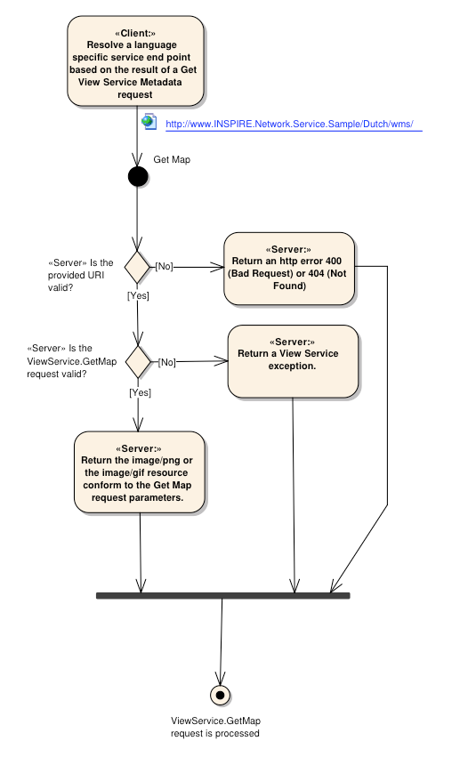

[.text-center]
*Figure 6*: Get Map Activity (Use case 4)

====== GetMap request parameters

[.text-center]
*Table 8*: GetMap core parameters

[align=center,width="100%",cols="34%,13%,53%",options="header",]
|===
^|*Request parameter* ^|*Mandatory/optional* ^|*Description*
|VERSION=1.3.0 |M |Request version
|REQUEST=GetMap |M |Request name
|LAYERS=name,name |M |Comma-separated list of one or more map layers names. Names are harmonized INSPIRE layers names.
|STYLES=name,name |M |Comma-separated list of one rendering style per layer requested. When the STYLES parameter is left blank in the GetMap request, the INSPIRE default styling applies in the GetMap response to all layers (inspire_common:DEFAULT)
|CRS=namespace:identifier |M |Coordinate reference system
|BBOX=minx,miny,maxx,maxy |M |Bounding box corners (lower left, upper right) in CRS units and in the axis order of the CRS
|WIDTH=output_width |M |Width in pixels of map picture
|HEIGHT=output_height |M |Height in pixels of map picture
|FORMAT=output_format |M |Output format of map. At least supported : Portable Network Graphics format(PNG; MIME type "image/png") or the GIF (Graphics Interchange Format) without LZW compression (MIME type "image/gif")
|TRANSPARENT=TRUE|FALSE |O |Background transparency of map (default=FALSE)
|BGCOLOR=color_value |O |Hexadecimal red-green-blue colour value for the background color (default=0xFFFFFF)
|EXCEPTIONS=error_format |O |The format in which exceptions are to be reported by the WMS (default=XML)
|TIME=time |C |Time value of layer desired
|ELEVATION=elevation |C |Elevation of layer desired
|Other sample dimension(s) |C |Value of other dimensions as appropriate
|===

4.2.4.1.1.1 VERSION

[IMPORTANT]
====
*Implementation Requirement 50* The mandatory VERSION parameter. The value "1.3.0" shall be used for GetMap requests that comply with the [*ISO 19128*] standard.
====

4.2.4.1.1.2 REQUEST

[IMPORTANT]
====
*Implementation Requirement 51* The mandatory REQUEST parameter is defined in [*ISO 19128*, Section 6.9.2]. To invoke the GetMap operation, the value "GetMap" shall be used to comply with the [*ISO 19128*] standard.
====

4.2.4.1.1.3 LAYERS

[IMPORTANT]
====
*Implementation Requirement 52* The mandatory LAYERS parameter lists the map layer(s) to be returned by this GetMap request. The value of the LAYERS parameter shall be a comma-separated list of one or more valid INSPIRE harmonized layer names.
====

4.2.4.1.1.4 STYLES

[IMPORTANT]
====
*Implementation Requirement 53* The mandatory STYLES parameter lists the style in which each layer is to be rendered. The value of the STYLES parameter shall be a comma-separated list of one or more valid INSPIRE style names. A client may request the default Style using a null value (as in "STYLES=").
====

4.2.4.1.1.5 CRS

[IMPORTANT]
====
*Implementation Requirement 54* The CRS request parameter states what Layer CRS applies to the BBOX request parameter. Values must be CRS that are defined in the INSPIRE Annex I, theme 1, Coordinate Reference System.
====

Recommended CRS are listed in Section 4.2.3.3.4.7.

4.2.4.1.1.6 BBOX

[IMPORTANT]
====
*Implementation Requirement 55* The mandatory BBOX parameter allows a Client to request a particular Bounding Box. The value of the BBOX parameter in a GetMap request shall be a list of comma-separated real numbers in the form "minx,miny,maxx,maxy". These values specify the minimum X, minimum Y, maximum X, and maximum Y values of a region in the Layer CRS of the request. The units, ordering and direction of increment of the X and Y axes shall be as defined by the Layer CRS. The four bounding box values indicate the outside limits of the region.
====

4.2.4.1.1.7 WIDTH AND HEIGHT

[IMPORTANT]
====
*Implementation Requirement 56* The mandatory WIDTH and HEIGHT parameters specify the size in integer pixels of the map to be produced.
====

4.2.4.1.1.8 FORMAT

[IMPORTANT]
====
*Implementation Requirement 57* The mandatory FORMAT parameter states the desired format of the map. The [*INS NS*, Annex III, Part B, Section 2] Image format states that at least one of "image/png" or "image/gif" must be supported and therefore advertised in the GetCapabilities operation.
====

4.2.4.1.1.9 TRANSPARENT

[IMPORTANT]
====
*Implementation Requirement 58* The optional TRANSPARENT parameter specifies whether the map background is to be made transparent or not. The service is required to implement this.
====

4.2.4.1.1.10BGCOLOR

The optional BGCOLOR parameter is a string that specifies the color to be used as the background (nodata) pixels of the map.

4.2.4.1.1.11 EXCEPTIONS

[IMPORTANT]
====
*Implementation Requirement 59* The default value shall be "XML" if this parameter is absent from the request. Other valid values are INIMAGE and BLANK.
====

4.2.4.1.1.12 TIME, ELEVATION AND OTHER SAMPLE DIMENSION(S)

Used when issuing a request using the Temporal coordinate system, height coordinate system or other dimensions. For more information, see [*ISO 19128*, Annexes C and D].

In case of a 2D request, the standard does not require this parameter.

==== Link View Service operation

[IMPORTANT]
====
*Implementation Requirement 60* As stated in [*INS NS]*, the Link View Service operation allows a Public Authority or a Third Party to declare a View Service for the viewing of its resources through the Member State View Service while maintaining the viewing capability at the Public Authority or the Third party location. Furthermore, the Link View Service parameter shall provide all information about the Public Authority's or Third Party's View Service compliant with this regulation, enabling the Member State View Service to get a map from the Public Authority's or Third Party's View Service and to collate it with other maps.
====

The above INSPIRE requirement defines the need for a mechanism that allows third parties to publish their View Services to the INSPIRE network through a Member State INSPIRE network service. If a Third Party publishes its View Service metadata through a Member State Discovery Service, it shall be possible to view Third Party resources by discovering the Third Party's View Service metadata in the Member State's Discovery Service. The retrieval of this View Service metadata can be handled by the client through a search on View Service metadata in a Member State's Discovery Service.

[IMPORTANT]
====
*Implementation Requirement 61* This operation shall be implemented with the Discover Metadata operation of the Discovery Service.
====

Based on the View Service's service metadata obtained from a Discovery Service through the Discover Metadata (CSW GetRecords) operation, the capabilities document of a remote INSPIRE View Service may be requested and resources published as Layers defined in this View Service can be consumed by a View Service client.

[.text-center]
*Example 24*: Link View Service – View Service search (CSW.GetRecords request)

[source,xml,subs="+quotes",align=center]
----
<csw:GetRecords xmlns:csw="http://www.opengis.net/cat/csw/2.0.2" service="CSW" resultType="results"
                       outputFormat="application/xml" outputSchema="http://www.isotc211.org/2005/gmd" 
                       startPosition="1" maxRecords="10">
    <csw:Query typeNames="gmd:MD_Metadata">
		<csw:ElementSetName typeNames="gmd:MD_Metadata">full</csw:ElementSetName>
        <csw:Constraint version="1.1.0">
            <ogc:Filter xmlns:ogc="http://www.opengis.net/ogc">
                <ogc:And>
                    <ogc:PropertyIsEqualTo>
                        <ogc:PropertyName>apiso:Language</ogc:PropertyName>
                        <ogc:Literal>eng</ogc:Literal>
                    </ogc:PropertyIsEqualTo>
                    <ogc:PropertyIsEqualTo>
                    <ogc:PropertyName>apiso:ServiceType</ogc:PropertyName>
                        <ogc:Literal>view</ogc:Literal>
                    </ogc:PropertyIsEqualTo>
                </ogc:And>
            </ogc::Filter>
        </csw:Constraint>        
    </csw:Query>
</csw:GetRecords>
----

If the Member State's View Service supports cascading, the Member State can publish the Third Party's View Service as part of its own capabilities document. In this case Third Party View Services can be consumed through the Member State's View Service. To let the View Service client choose whether he wants to consume the Third Party's View Service directly at the Third Party location or via a cascading View Service at the Member State's location, the View Service metadata of the Third Party's View Service shall be published in a Discovery Service that is part of the network via the Discovery Publish Metadata operation (see *[INS DSTG]* for more information on this operation).

In general there are three possible scenarios: the centralised, the view client and the View Service scenario.

===== Centralised scenario

If the Member State provides all View Service metadata, viewing capabilities and View Services centralised at national level, then the link View Service operation as required by the INSPIRE Regulation [*INS NS*] is implicitly fulfilled.

_Response Parameters_
____
GetCapabilities Response:

No additional parameters are required.
____

===== View client scenario

In this case the collation of maps served by different View Services is handled by the client application. The client consumes View Services that are discovered via the Discover Metadata operation at the Member State's location and are published at different locations.

Disadvantages:

* Get Map request/responses for remote View Services have to be processed by every client.
* View Services which are not directly accessible (e.g. running behind a firewall in an intranet) cannot be accessed.

Advantages:

* View Services can be processed by the client: so the client has more control over the Get Map operation.

The response time of a single Get Map request may be more predictable as no hidden requests to third party View Services are involved.

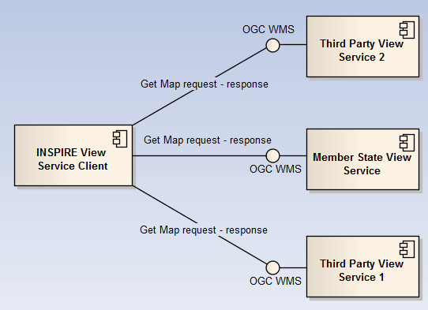

[.text-center]
*Figure 7*: Client approach

_Response Parameters_

____
GetCapabilities Response:
No additional parameters are required.
____

===== View Service scenario

In this case the Member State's View Service supports cascading and is responsible for collating the maps from third party View Service providers.

[IMPORTANT]
====
*Implementation Requirement 62* In the case where it is more preferable to collate maps in a View Service (for example: the Member State View Service collates maps that are served locally with maps that are served remote by a Third Party), the Member State's View Service shall include the service's layer metadata in his own service metadata (capabilities document).
====

[IMPORTANT]
====
*Implementation Requirement 63* The "cascaded" attribute of the <wms:Layer> element shall be used to indicate that the layer is hosted by a remote View Service.
====

[IMPORTANT]
====
*Implementation Requirement 64* Every time a map from a View Service is cascaded through another View Service the value of the "cascaded" attribute shall be incremented by 1. The actual collation of maps is out-of-scope for this Technical Guideline.
====

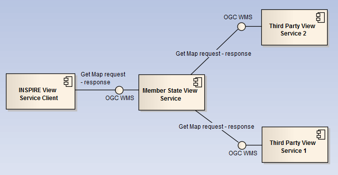

[.text-center]
*Figure 8*: Service approach

Disadvantages:

* The Member State's View Service has to support the cascading of View Services.
* Get Map requests/responses must be processed by every View Service in the cascade.
* The response time for a single Get Map request may be less predictable as possibly hidden requests to (potentially slow) third party View Services are involved.

Advantages:

* View Services behind a firewall can be accessed via the Member State's View Service.
* Get Map request/responses for remote View Services don't have to be processed by every client.

_Response Parameters_
____
GetCapabilities Response:
No additional parameters are required.
____

===== General requirement when collating maps

[IMPORTANT]
====
*Implementation Requirement 65* To support collation with other maps for both supported image formats (GIF and PNG), the transparency parameter (TRANSPARENT) of the WMS GetMap request shall be set to "true" and the background parameter (BGCOLOR) for all layers shall be set to the same colour.
====

=== Language Requirements

The Network Services Regulation requires that multilingual aspects for network services are supported [*INS NS*]. As there is no standard way to deal with multilingualism within the current ISO or OGC specifications, the following basic principle shall be used for INSPIRE Network Services:

[IMPORTANT]
====
*Implementation Requirement 66* A network service metadata response shall contain a list of the natural languages supported by the service. This list shall contain one or more languages that are supported.
====

[IMPORTANT]
====
*Implementation Requirement 67* A client may specify a specific language in a request. If the requested language is contained in the list of supported languages, the natural language fields of the service response shall be in the requested language. It the requested language is not supported by the service, then this parameter shall be ignored.
====

==== GetCapabilities-Operation

*GetCapabilities-Request:* +
The HTTP/GET binding of the GetCapabilities-Operation is extended by an additional parameter that indicates the client's preferred language.

[IMPORTANT]
====
*Implementation Requirement 68* The name of this parameter shall be "LANGUAGE". The parameter values are based on ISO 639-2/B alpha 3 codes as used in [*INS MDTG*].
====

[.text-center]
*Table 9*: Language parameter

[align=center,width="100%",cols="17%,43%,17%,23%",options="header",]
|===
|*Parameter Name* |*Parameter Value* |*Is mandatory for a Client Request?* |*Is mandatory to support for the Service?*
|LANGUAGE a|
Codelist (See ISO/TS 19139) based on alpha-3 codes of ISO 639-2.

Use only three-letter codes from in ISO 639-2/B (bibliographic codes),

The list of codes for the 23 official EU languages and EFTA Countries is:
!===

!Bulgarian – *bul* !Italian – *ita*

!Czech – *cze* !Latvian – *lav*

!Danish – *dan* !Liechenstein – *ger*

!Dutch – *dut* !Lithuanian – *lit*

!English – *eng* !Maltese – *mlt*

!Polish – *pol* !Norwegian – *nor*

!Estonian – *est* !Portuguese – *por*

!Finnish – *fin* !Romanian – *rum*

!French – *fre* !Romansh - *roh*

!German – *ger* !Slovak – *slo*

!Greek – *gre* !Slovenian – *slv*

!Hungarian – *hun* !Spanish – *spa*

!Irish – *gle* !Swedish – *swe*

!Icelandic – *ice* !

!===

The list of all the codes is defined at 
http://www.loc.gov/standards/iso639-2/ +
Regional languages also are included in this list.

|No, it is optional. |Yes, it is mandatory to be supported and shall be processed if the parameter is present in a client's request with a supported language code. If the parameter is absent in a clients request or it requested an unsupported language the service shall response in the service default language.
|===

|===

|Schema: +
[OCG-GetCapabilities-Request]&LANGUAGE=<ISO639-2/B alpha 3 code>

Example: +
\http://inspire.network.service.example/service?SERVICE=[...]&VERSION=[...]&LANGUAGE=eng

|===

*GetCapabilities-Response:* +
If a client request specifies a supported language the following fields of the GetCapabilties-Response are affected:

* Titles
* Abstracts

[IMPORTANT]
====
*Implementation Requirement 69* If a client request specifies an unsupported language, or the parameter is absent in the request, the above fields shall be provided in the service default language.
====

This behaviour ensures backward compatibility so that any existing clients may interact with the service using the default OGC standard.

*Extended Capabilities*

To advertise the supported languages the service shall respond with Extended Capabilities:

[IMPORTANT]
====
*Implementation Requirement 70* The Extended Capabilities shall indicate the *response language* used for the GetCapabilities-Response: Depending on the *requested language* the value of the <inspire_common:ResponseLanguage> corresponds to the current used language. If a supported language was requested, <inspire_common:ResponseLanguage> shall correspond to that requested language. If an unsupported language was requested or if no specific language was requested <inspire_common:ResponseLanguage> shall correspond to the *service default language <inspire_common:DefaultLanguage>*
====

[IMPORTANT]
====
*Implementation Requirement 71* The Extended Capabilities shall contain the *list of supported languages* indicated in <inspire_common:SupportedLanguages>. +
 +
This *list of supported languages* shall consist of +
1. exact one element <inspire_common:DefaultLanguage> indicating the service default language, and +
2. zero or more elements <inspire_common:SupportedLanguage> to indicate all additional supported languages. +
 +
Regardless of the response language, the *list of supported languages* is invariant for each GetCapabilities-Response.
====

[IMPORTANT]
====
*Implementation Requirement 72* The Extended Capabilities shall use the XML Schema as defined in the INSPIRE online schema repository.
====

*Examples:*

A service supports French and English and the service default language is French:

[.text-center]
*Example 25*: Response to [OGC-GetCapabilities-Request]&LANGUAGE=eng

[source,xml,subs="+quotes",align=center]
----
<inspire_vs:ExtendedCapabilities>
...
	<inspire_common:SupportedLanguages>
		<inspire_common:DefaultLanguage>
			<inspire_common:Language>fre</inspire_common:Language>
		</inspire_common:DefaultLanguage>
		<inspire_common:SupportedLanguage>
			<inspire_common:Language>eng</inspire_common:Language>
		</inspire_common:SupportedLanguage>
	</inspire_common:SupportedLanguages>
	<inspire_common:ResponseLanguage>
		<inspire_common:Language>eng</inspire_common:Language>
	</inspire_common:ResponseLanguage 
...	
</inspire_vs:ExtendedCapabilities> 
----

[.text-center]
*Example 26*: Response to [OGC-GetCapabilities-Request] or +
[OGC-GetCapabilities-Request]&LANGUAGE=fre

[source,xml,subs="+quotes",align=center]
----
<inspire_vs:ExtendedCapabilities>
...
	<inspire_common:SupportedLanguages>
		<inspire_common:DefaultLanguage>
			<inspire_common:Language>fre</inspire_common:Language>
		</inspire_common:DefaultLanguage>
		<inspire_common:SupportedLanguage>
			<inspire_common:Language>eng</inspire_common:Language>
		</inspire_common:SupportedLanguage>
	</inspire_common:SupportedLanguages>
	<inspire_common:ResponseLanguage>
		<inspire_common:Language>fre</inspire_common:Language>
	</inspire_common:ResponseLanguage> 
...
</inspire_vs:ExtendedCapabilities>
----

A service supports only German:

[.text-center]
*Example 27*: Response to any GetCapabilities-Request

[source,xml,subs="+quotes",align=center]
----
<inspire_vs:ExtendedCapabilities>
...
	<inspire_common:SupportedLanguages>
		<inspire_common:DefaultLanguage>
			<inspire_common:Language>ger</inspire_common:Language>
		</inspire_common:DefaultLanguage>
	</inspire_common:SupportedLanguages>
	<inspire_common:ResponseLanguage>
		<inspire_common:Language>ger</inspire_common:Language>
	</inspire_common:ResponseLanguage>
...
</inspire_vs:ExtendedCapabilities>
----

===== GetMap-Operation

Neither the INSPIRE Network Services [*INS NS*] Regulation or the Regulation as regards interoperability of spatial data sets and services [*INS DS*] require that text rendered on the map has to be in a specific language.

[IMPORTANT]
====
*Implementation Requirement 73* If any portrayal rules require language support for rendered text - e.g. by further amendments for Annex II or Annex III - INSPIRE View Services shall implement the common concept as stated in Section 4.3.2.
====

==== Common concept for other operations (optional)

Although further multilingual support is not required for INSPIRE Network Services, it may be desired by a service provider to implement further multilingual support such as:

* multilingual error messages
* multilingual support for additional Operations including HTTP/POST- and HTTP/GET-Binding

For that reason a further implementation concept for multilingual aspects is recommended as follows:

The recommended INSPIRE Extension described before already provides language specific capabilities for a service.

[TIP]
====
*Implementation Recommendation 17* For further language support for other operation it is recommended to replace the operation-online-resources in each language specific GetCapabilities-Response by a specific operation-online-resource for that language. To support the additional operation-online-resources the service shall listen at the language specific operation end-points to distinguish for the requested languages.
====

An example of this behaviour is given below, showing how to extend the WMS.getMap() operation to support multilingual error messages.

[arabic]
. The client sends the initial Request for Capabilities: [OCG-GetCapabilities-Request]
. The service responses with extended Capabilities including the supported Languages:

[.text-center]
*Example 28*: Service response including supported languages

[source,xml,subs="+quotes",align=center]
----
<inspire_vs:ExtendedCapabilities>
...
<inspire_common:SupportedLanguages>
  <inspire_common:DefaultLanguage>fre</inspire_common:DefaultLanguage> 
  <inspire_common:SupportedLanguage>eng</inspire_common:SupportedLanguage> 
</inspire_common:SupportedLanguages>
<inspire_common:SupportedLanguage>dut</inspire_common:SupportedLanguage>
<inspire_common:ResponseLanguage>eng</inspire_common:ResponseLanguage> 
...
</inspire_vs:ExtendedCapabilities>
----

[arabic, start=3]
. The Client sends a language specific request for capabilities: +
[OCG-GetCapabilities-Request]&LANGUAGE=eng
. The service response with language specific capabilities containing:
[loweralpha]
.. translated natural language fields (titles, abstracts)
.. *language specific entry points* for the language specific operations using this concept.

[.text-center]
*Example 29*: Response to [OCG-GetCapabilities-Request]&LANGUAGE=eng +
or [OCG-GetCapabilities-Request

[source,xml,subs="+quotes",align=center]
----
<WMS_Capabilities[…]
  <Capability>
    <Request>[…]
      <GetMap>[…]
        <DCPType>
          <HTTP>
            <Get>
              <OnlineResource xlink:href="http://someHOST.example/eng/GetMap?"/>
            </Get>
          </HTTP>
        </DCPType>
      </GetMap>[…]
    </Request>[…]
  <Capability>[…]
</WMS_Capabilities>
----

[.text-center]
*Example 30*: Response to [OCG-GetCapabilities-Request]&LANGUAGE=ger

[source,xml,subs="+quotes",align=center]
----
<WMS_Capabilities[…]
  <Capability>
    <Request>[…]
      <GetMap>[…]
        <DCPType>
          <HTTP>
            <Get>
              <OnlineResource xlink:href="http://someHOST.example/ger/GetMap?"/>
            </Get>
          </HTTP>
        </DCPType>
      </GetMap>[…]
    </Request>[…]
  <Capability>[…]
</WMS_Capabilities>
----

[arabic, start=5]
. The Client sends an invalid request to either the English or the German operation endpoint.

.. English operation end point: +
Request: +
_\http://someHOST.example/*eng*/GetMap?SERVICE=WMS&LAYERS=nonexistentLayer&[...]_ +
Response: +
The service responses with an exception including an English exception message: e.g. "The request is invalid. Reason is ... ".

.. German operation end point: +
Request: +
_\http://someHOST.example/*ger*/GetMap?SERVICE=WMS&LAYERS=nonexistentLayer&[...]_ +
Response: +
The service responses with an exception including a German exception message: e.g. "Die Anfrage ist fehlerhaft aufgrund ...".

==== Further Perspectives

With the ongoing development of OWS Common it is expected that future versions of OGC Standards will include language support. For specific technical reasons, the concepts used for OWS common are not suitable to extend the current standards. However, with the availability of future versions of the OGC base standards the recommended approach to support multilingualism may need to be revisited.

IETF RFC 4646 is supported by OGC standards relying upon OWS 1.1.0.

[TIP]
====
*Implementation Recommendation 18* The support of IETF RFC 4646 is recommended wherever the support of ISO/639 B alpha3 for languages infringes the conformity with the standard used for implementing the [*INS NS*].
====

[.text-center]
*Table 10*: Mapping between ISO 639/B alpha 3 and the two forms of IETF RFC 4646 supported by OWS 1.1.0

[align=center,width="100%",cols="28%,33%,39%",]
|===
|*ISO639/B alpha 3* |*IETF RFC 4646 short* |*IETF RFC 4646 long*
|bul |bg |bg-BG
|cze |cs |cs-CZ
|dan |da |da-DK
|dut |nl |nl-NL
|eng |en |en-GB
|est |et |et-EE
|fin |fi |fi-FI
|fre |fr |fr-CH, fr-FR
|ger |de |de-AT, de-CH, de-DE, de-LI
|gre |el |el-GR
|hun |hu |hu-HU
|gle |ga |ga-IE
|ice |is |Is-IS
|ita |it |it-CH, it-IT
|lav |lv |lv-LV
|lit |lt |lt-LT
|mlt |mt |mt-MT
|nor |no |no-NO
|pol |pl |pl-PL
|por |pt |pt-PT
|roh |rm |rm-CH
|rum |ro |ro-RO
|slo |sk |sk-SK
|slv |sl |sl-SI
|spa |es |es-ES
|swe |sv |sv-SE
|===

== INSPIRE Profile of WMTS 1.0.0

This section specifies requirements and recommendations based on the OGC standard [*OGC 07-057r7*] – Web Map Tile Service (WMTS) 1.0.0. It defines an INSPIRE Profile of [*OGC 07-057r7*] to implement the following operations:

* Get View Services Metadata: Get metadata about a specific view service;
* Get Map: Returns a map for a specified area;
* Link View Service: Allows the linking of view services together.

The custom INSPIRE schemas are available at http://inspire.ec.europa.eu/schemas/

This Technical Guidance uses the following namespace definitions in WMTS:

xmlns:inspire_vs="http://inspire.ec.europa.eu/schemas/inspire_vs_ows11/1.0"

xmlns:inspire_common="http://inspire.ec.europa.eu/schemas/common/1.0"

The following sections specify the required extensions to the given specifications.

=== General background

[IMPORTANT]
====
*Implementation Requirement 74* An INSPIRE View Service shall implement the mandatory behaviour from an *[OGC 07-057r7]* service, extended with the extensions required by the INSPIRE Directive and the Implementing Rules for View services.
====

[TIP]
====
*Implementation Recommendation 19* It is recommended that http URIs be used instead of URNsfootnote:[In June 2010 OGC revised the naming policy to use http URIs to identify persistent OGC resources instead of URNs. For more information see http://www.opengeospatial.org/projects/groups/ogcnasc.].
====

=== View service operations

[IMPORTANT]
====
*Implementation Requirement 75* The following *[OGC 07-057r7]* operations shall be implemented for an INSPIRE View service: GetCapabilities; GetTile.
====

[.text-center]
*Table 11*: View Service Operations

[align=center,width="100%",cols="47%,53%",]
|===
^|*INSPIRE View Service operations* ^|*OCG WMTS operations*
|Get View Service Metadata |GetCapabilities
|Get Map |GetTile
|Link View Service |
|===

[IMPORTANT]
====
*Implementation Requirement 76* The Link View Service operation shall be handled by the INSPIRE Discovery Service [*INS DSTG*].
====

As stated in [*OGC 07-057r7,* Section 7.4] support for the GET method is available for a WMTS service operations.

[TIP]
====
*Implementation Recommendation 20* It is recommended that the GET method is used for the view service operations.
====

==== Common requests parameters for the View Service operations

[IMPORTANT]
====
*Implementation Requirement 77* Common request parameters for the View Service operations:

*SERVICE* The SERVICE parameter is the service type identifier. The value shall be "WMTS".

*REQUEST* The mandatory REQUEST parameter indicates which service operation is being invoked. The value shall be the name of one of the operations offered by the Web Map Tile Service.

*LANGUAGE* See Section 0 Language Requirements (INSPIRE extension)

====

==== View service exceptions

Identical to INSPIRE Profile of OGC WMTS.

Note: As described in [*OGC 06-121r3,* Section 8] – OGC Web Services Common, WMTS exceptions MAY contain a _lang_ element. This element describes the language used by all included exception text values. The values of this element are language codes as specified by [*IETF RFC 4646*].

==== Get View Service Metadata operation

===== General

[IMPORTANT]
====
*Implementation Requirement 78* The following metadata response parameters shall be contained in a Get View Service Metadata response:

- View Service Metadata;

- Operations Metadata;

- Layers Metadata;

- Languages.

Most of the necessary metadata can be provided through the service Capabilities, as defined in the WMTS Standard [*OGC 07-057r7*, Section 7.1.1]. These capabilities are mandatory and defined when a WMTS is set up. They consist of server's information, supported operations and parameters values.

====

[IMPORTANT]
====
*Implementation Requirement 79* Layers shall provide a link to the metadata description of the spatial dataset using the "ows:Metadata" element as part of the layer metadata. This element shall be populated with a URL that allows access to an unambiguous metadata record. The URL may be either: A HTTP/GET call on the GetRecordById operation of the Discovery Service using the identifier of the metadata document; or a direct link to the metadata document.
====

*Example*:

The use of the ows:Metadata element of [*OGC 06-121r3*] – OGC Web Services Common Specification (OWS) 1.1.0 is explicitly described in the [*OGC 07-057r7*] – Web Map Tile Service (WMTS) 1.0.0.

[source,xml,subs="+quotes",align=center]
----
<Layer> 
  <ows:Title>etopo2</ows:Title> 	
	...
  <ows:Metadata xlink:href="http://.../discovery?Service=CSW&Request=GetRecordById&Version=2.0.2&id=[METADATA_IDENTIFIER]&outputSchema=http://www.isotc211.org/2005/gmd&elementSetName=full"/> 
	...
</Layer> 
----

Note: The metadata on the spatial dataset explain the spatial dataset itself; however they do not replace the other metadata on the layer as part of the capabilities.

===== GetCapabilities operation

*Table 12*: GetCapabilities core parameters

[width="99%",cols="31%,12%,57%,",options="header",]
|===
^|*Request parameter* ^|*Mandatory / optional* ^|*Description* |
|SERVICE=WMTS |M a|
Service type. Fixed value: WMTS.

The ServiceType for an OGC 06-121r3 – WMTS is fixed to "WMTS".

|
|REQUEST=GetCapabilities |M |Request name. Fixed value: GetCapabilities |
|ACCEPTVERSIONS |O a|
Prioritized sequence of one or more standard versions accepted by client, with preferred versions listed first.

Value is list of "x.y.z" version values. SHALL contain "1.0.0". When omitted, latest supported version is implied.

|
|SECTIONS |O a|
Unordered list of zero or more names of requested sections in complete service metadata document.

Value is list of section names. Allowed section names are in [*OGC 06-121r3*] Table 18. When omitted or not supported by server, return complete service metadata document.

|
|UPDATESEQUENCE |O a|
Service metadata document version, value is "increased" whenever any change is made in complete service metadata document.

Values are selected by each server, and are always opaque to clients. When omitted or not supported by server, return latest service metadata document.

|
|ACCEPTFORMATS |O a|
Prioritized sequence of zero or more response formats desired by client, with preferred formats listed first.

Value is list of format identifiers. Identifiers are MIME types of

formats useful for service metadata documents. When omitted or not supported by server, return service metadata document using MIME type "application/xml".

|
|LANGUAGE=code |O |Request language (INSPIRE extension). |
|===

===== GetCapabilities response

====== View service metadata

A scenario has been identified for publishing View Service metadata conform with the Regulation on INSPIRE Network Services [*INS NS*] and on Metadata [*INS MD*].

[*OGC 06-121r3*] 7.1.1 describes the response document of a GetCapabilities request called the WMTS _ServiceMetadata_ document. This document based on [*OGC 06-121r3*] OWS specifications contains the following structures:

* _ServiceIdentification_ (from [*OGC 06-121r3*] OWS Service Identification)
* _ServiceProvider_ (from [*OGC 06-121r3*] OWS Service Provider)
* _OperationsMetadata_ (from [*OGC 06-121r3*] OWS Operations Metadata)
* _Contents_ (from [*OGC 06-121r3*] OWS Contents)
* _Themes_ (WMTS GetCapabilities specific)

It also contains the following elements:

* Version
* updateSequence
* WSDL
* serviceMetadataURL

*Example 31*: WMTS GetCapabilities structure

[source,xml,subs="+quotes",align=center]
----
<?xml version="1.0" encoding="UTF-8"?> 
<Capabilities xmlns="http://www.opengis.net/wmts/1.0" xmlns:ows="http://www.opengis.net/ows/1.1" xmlns:xlink="http://www.w3.org/1999/xlink" xmlns:xsi="http://www.w3.org/2001/XMLSchema-instance" xmlns:inspire_common="http://inspire.ec.europa.eu/schemas/common/1.0" xmlns:inspire_vs="http://inspire.ec.europa.eu/schemas/inspire_vs_ows11/1.0" version="1.0.0" xsi:schemaLocation="http://www.opengis.net/wmts/1.0 http://schemas.opengis.net/wmts/1.0/wmtsGetCapabilities_response.xsd http://inspire.ec.europa.eu/schemas/inspire_vs_ows11/1.0 http://inspire.ec.europa.eu/schemas/inspire_vs_ows11/1.0/inspire_vs_ows_11.xsd">
    <ows:ServiceIdentification>
        ...
    </ows:ServiceIdentification>
    <ows:ServiceProvider>
        ...
    </ows:ServiceProvider>
    <ows:OperationsMetadata>
        ...
        <inspire_vs:ExtendedCapabilities>
            ...
        </inspire_vs:ExtendedCapabilities>
    </ows:OperationsMetadata>
    <Contents>...</Contents>
    <Themes>...</Themes>
    <WSDL xlink:href="..."/>
    <ServiceMetadataURL xlink:href="..."/>
</Capabilities>
----

To allow a WMTS instance using the INSPIRE Profile to supply the required metadata concerning the service, an Extended Capabilities element is added in the place provided by OGC OWS 1.1 specification:

[source,xml,subs="+quotes",align=center]
----
<?xml version="1.0" encoding="UTF-8"?> 
<Capabilities xmlns="http://www.opengis.net/wmts/1.0" 
...
    <ows:ServiceIdentification>
        ...
    </ows:ServiceIdentification>
    <ows:ServiceProvider>
        ...
    </ows:ServiceProvider>
    <ows:OperationsMetadata>
        ...
        <inspire_vs:ExtendedCapabilities>
            ...
        </inspire_vs:ExtendedCapabilities>
    </ows:OperationsMetadata>
    <Contents>...</Contents>
    <Themes>...</Themes>
    <WSDL xlink:href="..."/>
    <ServiceMetadataURL xlink:href="..."/>
</Capabilities>
----

The schema file for inspire_vs:ExtendedCapabilities defined for OWS 1.1 based services is attached at the end of this document.

====== Operations Metadata

Operations metadata are mapped to the <ows:OperationsMetadata> element. There are two mandatory operations in the Operations Metadata: "Get View Service Metadata" implemented with the GetCapabilities WMTS operation and "Get Map" implemented with the GetTile WMTS operation.

[IMPORTANT]
====
*Implementation Requirement 80* The third mandatory operation "Link View Service", which allows a Public Authority or a Third Party to declare a view Service for the viewing of its resources through the Member State View Service while maintaining the viewing capability at the Public Authority or the Third party location, shall be implemented through the "Discover Metadata" operation of the Discovery Service which allows for View service metadata to be retrieved.
====

5.2.3.3.2.1 GETCAPABILITIES OPERATION METADATA

[IMPORTANT]
====
*Implementation Requirement 81* The GetCapabilities operation metadata shall be mapped to the <ows:Operation name="GetCapabilities"> element.
====

[.text-center]
*Example 32*: GetCapabilities Operation Metadata

[source,xml,subs="+quotes",align=center]
----
<ows:OperationsMetadata> 
  <ows:Operation name="GetCapabilities"> 
    <ows:DCP> 
      <ows:HTTP> 
        <ows:Get xlink:href="http://www.maps.bob/cgi-bin/MiraMon5_0.cgi?"> 
          <ows:Constraint name="GetEncoding"> 
            <ows:AllowedValues> 
              <ows:Value>KVP</ows:Value> 
            </ows:AllowedValues> 
          </ows:Constraint> 
        </ows:Get> 
      </ows:HTTP> 
    </ows:DCP> 
  </ows:Operation>
...
</ows:OperationsMetadata> 
----

5.2.3.3.2.2 GETTILE OPERATION METADATA

[IMPORTANT]
====
*Implementation Requirement 82* The GetTile operation metadata shall be mapped to the <ows:Operation name="GetTile"> element. Either PNG or GIF format (without LZW compression) shall be supported by the View service [*INS NS*, Annex III, Part B ].
====

[.text-center]
*Example 33*: GetMap operation metadata

[source,xml,subs="+quotes",align=center]
----
<ows:OperationsMetadata> 
...
    <ows:Operation name="GetTile"> 
      <ows:DCP> 
        <ows:HTTP> 
          <ows:Get xlink:href="http://www.maps.bob/cgi-bin/MiraMon5_0.cgi?"> 
            <ows:Constraint name="GetEncoding"> 
              <ows:AllowedValues> 
                <ows:Value>KVP</ows:Value> 
              </ows:AllowedValues> 
            </ows:Constraint> 
          </ows:Get> 
        </ows:HTTP> 
      </ows:DCP> 
    </ows:Operation> 
...
</ows:OperationsMetadata>
----

In the case of a WMTS service the output format is specific to a layer. The constraint on output format shall be enforced inside the WMTS GetCapabilities elements _Layer._

5.2.3.3.2.3 LINK VIEW SERVICE OPERATION METADATA

*Implementation Requirement 83* The use of the "Discover Metadata" operation of the INSPIRE Discovery service is recommended for implementing the Link View Service operation.

====== Languages

[.text-center]
*Example 34*: Languages

[source,xml,subs="+quotes",align=center]
----
<inspire_vs:ExtendedCapabilities>
…
	<inspire_common:SupportedLanguages>
		<inspire_common:DefaultLanguage>
			<inspire_common:Language>pol</inspire_common:Language>
		</inspire_common:DefaultLanguage>
	</inspire_common:SupportedLanguages>
	<inspire_common:ResponseLanguage>
		<inspire_common:Language>eng</inspire_common:Language>
	</inspire_common:ResponseLanguage>
 …
</inspire_vs:ExtendedCapabilities>
----

====== Layers Metadata

These metadata are mapped with the <Layer> element of the <Contents> structure.

[.text-center]
*Example 35*: Layers Metadata

[source,xml,subs="+quotes",align=center]
----
<?xml version="1.0" encoding="UTF-8"?> 
<Capabilities xmlns="http://www.opengis.net/wmts/1.0" 
...
    <ows:ServiceIdentification>
        ...
    </ows:ServiceIdentification>
    <ows:ServiceProvider>
        ...
    </ows:ServiceProvider>
    <ows:OperationsMetadata>
        ...
        <inspire_vs:ExtendedCapabilities>
            ...
        </inspire_vs:ExtendedCapabilities>
    </ows:OperationsMetadata>
    <Contents>
        <Layer>
            ...
        </Layer>
            ...
    </Contents>
    <Themes>
        ...
    </Themes>
    <ServiceMetadataURL xlink:href="..."/>
</Capabilities>
----

[IMPORTANT]
====
*Implementation Requirement 84* The description of a layer shall use elements defined for the service capabilities in the [*OGC 07-057r7*] standard. This description shall specify the role of some parameters for the INSPIRE View Service as stated in the Regulation on INSPIRE Network Services [*INS NS*]:
====

[.text-center]
*Table 13*: Mapping between INSPIRE layer metadata elements and OGC WMTS elements

[align=center,width="100%",cols="46%,54%",options="header"]
|===
^|*Metadata elements* ^|*OGC WMTS standard elements of <wmts:Layer>* 
|Resource Title |ows:Title
|Resource Abstract |ows:Abstract
|Keyword |ows:Keywords
|Geographic Bounding Box |ows:WGS84BoundingBox
|Unique Resource Identifier |ows:Identifier
|Name |ows:Identifier 
|Coordinate Reference Systems |TileMatrixSetLink
|Styles |Style
|Legend URL |Style/LegendURL
|Dimension Pairs |Dimension[@name,@units]
|===

5.2.3.3.4.1 RESOURCE TITLE

[IMPORTANT]
====
*Implementation Requirement 85* The Resource title of the layer, used for human communication, for exmple presentation of the layer in a menu. It is mapped with <ows:Title>. The harmonised title of a layer for an INSPIRE spatial data theme is defined by [*Directive 2007/2/EC*] and shall be subject to multilingualism (translations shall appear in each mono-lingual capabilities localized documents).
====

[.text-center]
*Example 36*: Resource title

[source,xml,subs="+quotes",align=center]
----
<?xml version="1.0" encoding="UTF-8"?> 
<Capabilities xmlns="http://www.opengis.net/wmts/1.0" 
...
    <ows:ServiceIdentification>
        ...
    </ows:ServiceIdentification>
    <ows:ServiceProvider>
        ...
    </ows:ServiceProvider>
    <ows:OperationsMetadata>
        ...
        <inspire_vs:ExtendedCapabilities>
            ...
        </inspire_vs:ExtendedCapabilities>
    </ows:OperationsMetadata>
    <Contents>
        <Layer>
            ...
            <ows:Title>Transport networks : Road Area</ows:Title>
            ...
        </Layer>  
            ...
    </Contents>
    <Themes>
        ...
    </Themes>
    <ServiceMetadataURL xlink:href="..."/>
</Capabilities>
----

5.2.3.3.4.2 RESOURCE ABSTRACT

[IMPORTANT]
====
*Implementation Requirement 86* Layer abstract: text describing the layer. Subject to multilingualism. It shall be mapped with the <ows:Abstract> element.
====

[.text-center]
*Example 37*: Resource abstract

[source,xml,subs="+quotes",align=center]
----
<?xml version="1.0" encoding="UTF-8"?> 
<Capabilities xmlns="http://www.opengis.net/wmts/1.0" 
...
    <ows:ServiceIdentification>
        ...
    </ows:ServiceIdentification>
    <ows:ServiceProvider>
        ...
    </ows:ServiceProvider>
    <ows:OperationsMetadata>
        ...
        <inspire_vs:ExtendedCapabilities>
            ...
        </inspire_vs:ExtendedCapabilities>
    </ows:OperationsMetadata>
    <Contents>
        <Layer>
            ...
            <ows:Title>Transport networks : Road Area</ows:Title>
		<ows:Abstract>As defined by TWG</ows:Abstract>
            ...
        </Layer>  
            ...
    </Contents>
    <Themes>
        ...
    </Themes>
    <ServiceMetadataURL xlink:href="..."/>
</Capabilities>
----

5.2.3.3.4.3 KEYWORDS

[IMPORTANT]
====
*Implementation Requirement 87* Additional Keywords: list of keywords describing the layer, to support catalog search (to be harmonised the INSPIRE metadata element Keyword Value, see [*INS DSTG,* Section 3.2.3] It shall be mapped to the <ows:Keywords> element.
====

[.text-center]
*Example 38*: Keywords

[source,xml,subs="+quotes",align=center]
----
<?xml version="1.0" encoding="UTF-8"?> 
<Capabilities xmlns="http://www.opengis.net/wmts/1.0" 
...
    <ows:ServiceIdentification>
        ...
    </ows:ServiceIdentification>
    <ows:ServiceProvider>
        ...
    </ows:ServiceProvider>
    <ows:OperationsMetadata>
        ...
        <inspire_vs:ExtendedCapabilities>
            ...
        </inspire_vs:ExtendedCapabilities>
    </ows:OperationsMetadata>
    <Contents>
        <Layer>
            ...
            <Title>Transport networks : Road Area</Title>
		<ows:Abstract>As defined by TWG</ows:Abstract>
            <ows:Keywords>
                <ows:Keyword>GEMET keyword </ows:Keyword>
                ...
            </ows:Keywords>
            ...
        </Layer>  
            ...
    </Contents>
    <Themes>
        ...
    </Themes>
    <ServiceMetadataURL xlink:href="..."/>
</Capabilities>
----

5.2.3.3.4.4 GEOGRAPHIC BOUNDING BOX

[IMPORTANT]
====
*Implementation Requirement 88* Geographic Bounding Box element is used to facilitate geographic searches. It shall be mapped to the <ows:WGS84BoundingBox> element. The minimum bounding rectangle in decimal degrees of the area covered by the Layer shall be supplied regardless of what CRS the tileMatrixSet may define and shall use WGS:84 as Coordinate Reference System.
====

[.text-center]
*Example 39*: Geographic Bounding Box

[source,xml,subs="+quotes",align=center]
----
<?xml version="1.0" encoding="UTF-8"?> 
<Capabilities xmlns="http://www.opengis.net/wmts/1.0" 
…
    <ows:ServiceIdentification>
        ...
    </ows:ServiceIdentification>
    <ows:ServiceProvider>
        ...
    </ows:ServiceProvider>
    <ows:OperationsMetadata>
        ...
        <inspire_vs:ExtendedCapabilities>
            ...
        </inspire_vs:ExtendedCapabilities>
    </ows:OperationsMetadata>
    <Contents>
        <Layer>
            ...
            <Title>Transport networks : Road Area</Title>
		<ows:Abstract>As defined by TWG</ows:Abstract>
            <ows:Keywords>
                <ows:Keyword>GEMET keyword </ows:Keyword>
                ...
            </ows:Keywords>
		<ows:WGS84BoundingBox> 
                <ows:LowerCorner>-180 -90</ows:LowerCorner> 
                <ows:UpperCorner>180 90</ows:UpperCorner> 
		</ows:WGS84BoundingBox>
            ...
        </Layer>  
            ...
    </Contents>
    <Themes>
        ...
    </Themes>
    <ServiceMetadataURL xlink:href="..."/>
</Capabilities>
----

5.2.3.3.4.5 UNIQUE RESOURCE IDENTIFIER

[*OGC 07-057r7*] states that the Layer identifier SHALL be *unique* for each layer listed in the GetCapabilities response. Therefore, this identifier, which has previously been mapped to the Name metadata of the layer, can also be used as the unique resource identifier metadata of the layer.

[.text-center]
*Example 40*: Unique resource identifier

[source,xml,subs="+quotes",align=center]
----
<?xml version="1.0" encoding="UTF-8"?> 
<Capabilities xmlns="http://www.opengis.net/wmts/1.0" 
...
    <ows:ServiceIdentification>
        ...
    </ows:ServiceIdentification>
    <ows:ServiceProvider>
        ...
    </ows:ServiceProvider>
    <ows:OperationsMetadata>
        ...
        <inspire_vs:ExtendedCapabilities>
            ...
        </inspire_vs:ExtendedCapabilities>
    </ows:OperationsMetadata>
    <Contents>
        <Layer>
            ...
            <Title>Transport networks : Road Area</Title>
		<ows:Abstract>As defined by TWG</ows:Abstract>
		<ows:Identifier>
                TN.RoadTransportNetwork.RoadArea
		</ows:Identifier>
            <ows:Keywords>
                <ows:Keyword>GEMET keyword </ows:Keyword>
                ...
            </ows:Keywords>
		<ows:WGS84BoundingBox> 
                <ows:LowerCorner>-180 -90</ows:LowerCorner> 
                <ows:UpperCorner>180 90</ows:UpperCorner> 
		</ows:WGS84BoundingBox>
		<ows:Metadata  
                xlink:href="=" http://.../discovery?Service=CSW&Request=GetRecordById&Version=2.0.2&id=[METADATA_IDENTIFIER]&outputSchema=http://www.isotc211.org/2005/gmd&elementSetName=full"/>
            <TileMatrixSetLink> 
                <TileMatrixSet>InspireCRS84Quad</TileMatrixSet>
            </TileMatrixSetLink>
            
         ...
        </Layer> 
        <TileMatrixSet>
            <ows:Identifier>InspireCRS84Quad</ows:Identifier> 
            <ows:SupportedCRS>
                http://www.opengis.net/def/crs/OGC/1.3/CRS84
            </ows:SupportedCRS> 
            <TileMatrix>
            ...
            </TileMatrix>           
            ...
        </TileMatrixSet>
    </Contents>
    <Themes>
        ...
    </Themes>
    <ServiceMetadataURL xlink:href="..."/>
</Capabilities>
----

Consequently, the resource unique identifier will be an INSPIRE harmonized name in the case of a WMTS Server.

5.2.3.3.4.6 NAME

It is mapped to the <ows:Identifier> element.

[.text-center]
*Example 41*: Name

[source,xml,subs="+quotes",align=center]
----
<?xml version="1.0" encoding="UTF-8"?> 
<Capabilities xmlns="http://www.opengis.net/wmts/1.0" 
...
    <ows:ServiceIdentification>
        ...
    </ows:ServiceIdentification>
    <ows:ServiceProvider>
        ...
    </ows:ServiceProvider>
    <ows:OperationsMetadata>
        ...
        <inspire_vs:ExtendedCapabilities>
            ...
        </:Inspire_vs:ExtendedCapabilities>
    </ows:OperationsMetadata>
    <Contents>
        <Layer>
            ...
            <Title>Transport networks : Road Area</Title>
		<ows:Abstract>As defined by TWG</ows:Abstract>
		<ows:Identifier>
                TN.RoadTransportNetwork.RoadArea
		</ows:Identifier>
            <ows:Keywords>
                <ows:Keyword>GEMET keyword </ows:Keyword>
                ...
            </ows:Keywords>
		<ows:WGS84BoundingBox> 
                <ows:LowerCorner>-180 -90</ows:LowerCorner> 
                <ows:UpperCorner>180 90</ows:UpperCorner> 
		</ows:WGS84BoundingBox>
		<ows:Metadata  
                xlink:href="=" http://.../discovery?Service=CSW&Request=GetRecordById&Version=2.0.2&id=[METADATA_IDENTIFIER]&outputSchema=http://www.isotc211.org/2005/gmd&elementSetName=full"/>
            ...
        </Layer>  
            ...
    </Contents>
    <Themes>
        ...
    </Themes>
    <ServiceMetadataURL xlink:href="..."/>
</Capabilities>
----

5.2.3.3.4.7 COORDINATE REFERENCE SYSTEMS

[IMPORTANT]
====
*Implementation Requirement 89* It is mandatory to use geographical coordinate system based on ETRS89 in continental Europe and ITRS outside continental Europe.
====

Each layer of a WMTS Server is linked to a unique _TileMatrixSet_ which defines the tiles pyramid structure.

* A _TileMatrixSet_ is a collection of tile matrices defined at different scales for a unique CRS.
* A _TileMatrix_ is a collection of tiles for a fixed scale.
* A _Tile_ is a rectangular pictorial representation of geographic data, often part of a set of such elements, covering a spatially contiguous extent and sharing similar information content and graphical styling, which can be uniquely defined by a pair of indices for the column and row along with an identifier for the tile matrix.

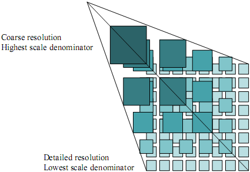

[.text-center]
*Figure 9*: TILEMATRIXSET concept

image::./media/image11.png[image,width=482,height=298,align="center"]

[.text-center]
*Figure 10*: TILEMATRIXSET concept

As a result, the unique link between a layer and a _TileMatrixSet_ implicitly defines the CRS for this layer.

[.text-center]
*Example 42*: Link to TILEMATRIXSET on the spatial dataset

[source,xml,subs="+quotes",align=center]
----
<?xml version="1.0" encoding="UTF-8"?> 
<Capabilities xmlns="http://www.opengis.net/wmts/1.0" 
...
    <ows:ServiceIdentification>
        ...
    </ows:ServiceIdentification>
    <ows:ServiceProvider>
        ...
    </ows:ServiceProvider>
    <ows:OperationsMetadata>
        ...
        <inspire_vs:ExtendedCapabilities>
            ...
        </inspire_vs:ExtendedCapabilities>
    </ows:OperationsMetadata>
    <Contents>
        <Layer>
            ...
            <Title>Transport networks : Road Area</Title>
		<ows:Abstract>As defined by TWG</ows:Abstract>
		<ows:Identifier>
                TN.RoadTransportNetwork.RoadArea
		</ows:Identifier>
            <ows:Keywords>
                <ows:Keyword>GEMET keyword </ows:Keyword>
                ...
            </ows:Keywords>
		<ows:WGS84BoundingBox> 
                <ows:LowerCorner>-180 -90</ows:LowerCorner> 
                <ows:UpperCorner>180 90</ows:UpperCorner> 
		</ows:WGS84BoundingBox>
		<ows:Metadata  
                xlink:href="=" http://.../discovery?Service=CSW&Request=GetRecordById&Version=2.0.2&id=[METADATA_IDENTIFIER]&outputSchema=http://www.isotc211.org/2005/gmd&elementSetName=full"/>
            <TileMatrixSetLink> 
                <TileMatrixSet>InspireCRS84Quad</TileMatrixSet>
            </TileMatrixSetLink> 
         ...
        </Layer> 
        <TileMatrixSet>
            <ows:Identifier>InspireCRS84Quad</ows:Identifier> 
            <ows:SupportedCRS>
                http://www.opengis.net/def/crs/OGC/1.3/CRS84
            </ows:SupportedCRS> 
            <TileMatrix>
            ...
            </TileMatrix>           
            ...
        </TileMatrixSet>
    </Contents>
    <Themes>
        ...
    </Themes>
    <ServiceMetadataURL xlink:href="..."/>
</Capabilities>
----

5.2.3.3.4.8 STYLES

[IMPORTANT]
====
*Implementation Requirement 90* Style shall be mapped to the 
			...
		</Layer> 
		<TileMatrixSet>
			<ows:Identifier>InspireCRS84Quad</ows:Identifier> 
			<ows:SupportedCRS>http://www.opengis.net/def/crs/OGC/1.3/CRS84 </ows:SupportedCRS> 
			<TileMatrix>...</TileMatrix>           
            ...
		</TileMatrixSet>
	</Contents>
	<Themes>...</Themes>
	<ServiceMetadataURL xlink:href="..."/>
</Capabilities>
----

5.2.3.3.4.9LEGEND URL

[IMPORTANT]
====
*Implementation Requirement 91* As the capabilities document is a mono-lingual document, internationalized legend may be placed in different capabilities document for each value of the LANGUAGE parameter. It shall be mapped with the <ows:LegendURL> element.
====

[.text-center]
*Example 44*: Legend URL

[source,xml,subs="+quotes",align=center]
----
<?xml version="1.0" encoding="UTF-8"?> 
<Capabilities xmlns="http://www.opengis.net/wmts/1.0" 
...
    <ows:ServiceIdentification>
        ...
    </ows:ServiceIdentification>
    <ows:ServiceProvider>
        ...
    </ows:ServiceProvider>
    <ows:OperationsMetadata>
        ...
        <inspire_vs:ExtendedCapabilities>
            ...
        </inspire_vs:ExtendedCapabilities>
    </ows:OperationsMetadata>
    <Contents>
        <Layer>
            ...
            <Title>Transport networks : Road Area</Title>
		<ows:Abstract>As defined by TWG</ows:Abstract>
		<ows:Identifier>
                TN.RoadTransportNetwork.RoadArea
		</ows:Identifier>
            <ows:Keywords>
                <ows:Keyword>GEMET keyword </ows:Keyword>
                ...
            </ows:Keywords>
		<ows:WGS84BoundingBox> 
                <ows:LowerCorner>-180 -90</ows:LowerCorner> 
                <ows:UpperCorner>180 90</ows:UpperCorner> 
		</ows:WGS84BoundingBox>
		<ows:Metadata  
                xlink:href="=" http://.../discovery?Service=CSW&Request=GetRecordById&Version=2.0.2&id=[METADATA_IDENTIFIER]&outputSchema=http://www.isotc211.org/2005/gmd&elementSetName=full"/>
            <TileMatrixSetLink> 
                <TileMatrixSet>InspireCRS84Quad</TileMatrixSet>
            </TileMatrixSetLink>
            
         ...
        </Layer> 
        <TileMatrixSet>
            <ows:Identifier>InspireCRS84Quad</ows:Identifier> 
            <ows:SupportedCRS>
                http://www.opengis.net/def/crs/OGC/1.3/CRS84
            </ows:SupportedCRS> 
            <TileMatrix>
            ...
            </TileMatrix>
            ...
        </TileMatrixSet>
    </Contents>
    <Themes>
        ...
    </Themes>
    <WSDL xlink:href="..."/>
    <ServiceMetadataURL xlink:href="..."/>
</Capabilities>
----

==== Get Map Operation

INSPIRE Get Map operation is mapped with the GetTile operation of OGC WMTS.

===== GetTile operation

The GetTile operation allows WMTS clients to request a particular tile of a particular tile matrix set in a predefined format.

[IMPORTANT]
====
*Implementation Requirement 92* Table 15 shows INSPIRE parameters that shall be used within the WMTS GetTile operation according to the [*INS NS*]:
====

*Table 14*: INSPIRE and WMS parameters mapping

[width="99%",cols="49%,51%"]
|===
^|*INSPIRE parameters* ^|*OGC 07-057r7 parameters*
|Layers |LAYER
|Styles |STYLE
|Coordinate Reference System |TILEMATRIXSET
|Bounding box |TILEMATRIX + TILEROW / TILECOL
|Image width |TILEMATRIXSET
|Image height |TILEMATRIXSET
|Image format |FORMAT
|Language |None. See LANGUAGE section
|Dimension Pair |TIME, ELEVATION or other sample dimension(s).
|===

====== GetTile request parameters

*Table 15*: GetTile core parameters

[width="100%",cols="31%,13%,56%",options="header"]
|===
^|*Request parameter* ^|*Mandatory/optional* ^|*Description*
|VERSION=1.0.0 |M |Request version
|REQUEST=GetTile |M |Request name
|LAYER=name |M |Identifier that is defined in the ServiceMetadata document
|STYLE=name |M |Identifier that is defined in the ServiceMetadata document. When the STYLES parameter is left blank in the GetTile request, the INSPIRE default styling applies in the GetMap response to all layers (inspire_common:DEFAULT)
|FORMAT=image/png |M |Value that is defined in theServiceMetadata document
|TILEMATRIXSET= InspireCRS84Quad |M |Identifier that is defined in theServiceMetadata document
|TILEMATRIXSET=integer |M |Value that is defined in theServiceMetadata document
|TILEROW=integer |M a|
value between 0 and MatrixHeight-1 of this tile matrix

defined in the ServiceMetadata document

|TILEROW=integer |M a|
value between 0 and MatrixWidth-1 of this tile matrix

defined in the ServiceMetadata document

|Other sample dimension(s) |O a|
Value allowed for this dimension

A single value from a list or a range defined in the ServiceMetadata document.
|===

==== Link View Service operation

This operation will be implemented using the Discover Metadata operation of a Discovery Service.

==== Language Requirements

===== GetCapabilities 

[*OGC 06-121r3*] OWS specification suggests to use the *xml:lang* to define the content language of an XML element in a Capabilities document.

[source,xml,subs="+quotes",align=center]
----
<ServiceIdentification> 
    <Title xml:lang="en">Acme Corp. Map Server</Title> 
    <Title xml:lang="fr">Serveur de Carte par Acme Corp.</Title>
----

Using this simple method for the following elements is possible and will lead to a multilingual ServiceMetadata document in any case:

* Titles
* Abstracts
* Descriptions

WMTS follows INSPIRE language requirements as shown in INSPIRE Profile of ISO 19128.

===== Exceptions

[*OGC 06-121r3*] OWS specification suggests to use the *xml:lang* to define the content language of an ExceptionReport element.

[source,xml,subs="+quotes",align=center]
----
<ExceptionReport xmlns="http://www.opengis.net/ows/1.1" 
xmlns:xsi="http://www.w3.org/2001/XMLSchema-instance" 
xsi:schemaLocation="http://www.opengis.net/ows/1.1 
owsExceptionReport.xsd" version="1.0.0" xml:lang="en">
----

==== Interoperability: TileMatrixSet

[TIP]
====
*Implementation Recommendation 21* Every layer offered by a INSPIRE WMTS should use the InspireCRS84Quad MatrixSet
====

This document specifies a _TileMatrixSet :_ InspireCRS84Quad.

The main reason for recommending a common _TileMatrixSet_ for every INSPIRE WMTS is to ensure that every INSPIRE WMTS layer will be available with the same resolutions pyramid (and with the same CRS). The interoperability between different INSPIRE will consequently be eased.

The [*OGC 07-057r7*] specification offers four _Well Known Scale Sets_ :

* Two of these scale sets are "irregular" global CRS84 scales sets designed, for cartographic purposes.
* The third one is defined to allow quad-tree pyramids in CRS84. In addition, this pyramid offers the same Scale Denominator than the ones used by Google.
* The last scale set is the usual Google scale set in Pseudo-Mercator (EPSG:3857).

The _TileMatrixSet_ described here is based on the third _Well Known Scale Sets_ of [*OGC 07-057r7*] (GoogleCRS84Quad). The difference between InspireCRS84Quad scale set and GoogleCRS84Quad is also explained.

===== InspireCRS84Quad

[.text-center]
*Table 16*: InspireCRS84Quad – Pixel size for each level

[align=center,width="100%",cols="10%,30%"]
|===
^|*Level* ^|*Pixel Size (degrees)*
|0 |0,703125000000000000
|1 |0,351562500000000000
|2 |0,175781250000000000
|3 |0,087890625000000000
|4 |0,043945312500000000
|5 |0,021972656250000000
|6 |0,010986328125000000
|7 |0,005493164062500000
|8 |0,002746582031250000
|9 |0,001373291015625000
|10 |0,000686645507812500
|11 |0,000343322753906250
|12 |0,000171661376953125
|13 |0,000085830688476563
|14 |0,000042915344238281
|15 |0,000021457672119141
|16 |0,000010728836059570
|17 |0,000005364418029785
|===

[.text-center]
*CRS:* http://www.opengis.net/def/crs/OGC/1.3/CRS84 +
*TILING ORIGIN:* (-180, 90) +
*EXTENT:* (-180,180); (-90,90) +
*PIXEL SIZE FORMULA:* (180 / 2^(8+_i_)^) +
*TILE HEIGHT:* 256 pixels +
*TILE WIDTH:* 256 pixels +

*DIFFERENCE BETWEEN GoogleCRS84Quad AND InspireCRS84Quad*

Level 0 of _InspireCRS84Quad_ is similar to level 1 of _GoogleCRS84Quad with a change in the origin of the tiles_. Level 1 of _GoogleCRS84Quad_ allows representing the whole world in a four 256x256 pixels tiles where the first 128 lines of the top tiles and last 128 lines of the bottom tiles are left blank.

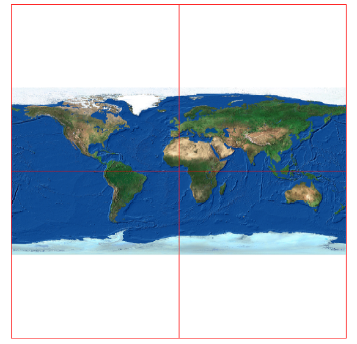

[.text-center]
*Figure 11*: Level 1 GoogleCRS84Quad, Four 256x256 pixels tiles

To avoid this situation the level 0 of InspireCRS84Quad is composed of two tiles representing exactly the whole world.

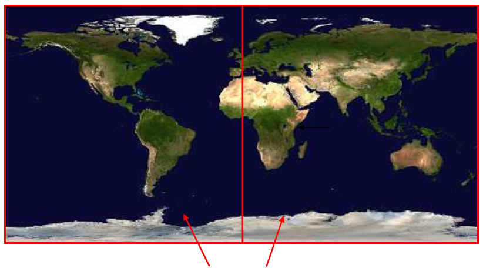

[.text-center]
*Figure 12*: Level 0 InspireCRS84Quad. Two 256x256 pixels tiles.

===== Schema definition for extended capabilities for OWS 1.1 (inspire_vs_ows_11.xsd)

[source,xml,subs="+quotes",align=center]
----
<?xml version="1.0" encoding="UTF-8"?>
 <schema xmlns:inspire_vs="http://inspire.ec.europa.eu/schemas/inspire_vs_ows11/1.0" xmlns:inspire_com="http://inspire.ec.europa.eu/schemas/common/1.0" xmlns:ows="http://www.opengis.net/ows/1.1" xmlns="http://www.w3.org/2001/XMLSchema" xmlns:xlink="http://www.w3.org/1999/xlink" targetNamespace="http://inspire.ec.europa.eu/schemas/inspire_vs_ows11/1.0" elementFormDefault="qualified" attributeFormDefault="unqualified" version="1.0.0">
	<import namespace="http://www.opengis.net/ows/1.1" schemaLocation="http://schemas.opengis.net/ows/1.1.0/owsAll.xsd"/>
	<import namespace="http://inspire.ec.europa.eu/schemas/common/1.0" schemaLocation="../../common/1.0/common.xsd"/>
	<element name="ExtendedCapabilities" type="inspire_com:ExtendedCapabilitiesType" substitutionGroup="ows:ExtendedCapabilities"/>
</schema>
----

== Quality of Services

Since quality of service (QoS) depends on the specific testing procedure for a given service, this section describes and normalizes the testing procedure that is to be applied for the assessment of QoS for a given INSPIRE view service.

The monitoring parameter NSi4 in the Commission decision for monitoring and reporting measures the conformity of all network services with the implementing rules. The conformity of a network service requires the compliance with the Quality of Service as defined in Annex I of the NS regulation (in particular NSi4.1 and NSi4.2 for the current monitoring period).

=== General requirements

____
Two options exist for the measurements of Quality of Services:

1. Quality of Services requirements are measured at the service side exposed to the Internet.

2. Quality of Services requirements are measured from a central network node within the infrastructure.
____

NOTE 1: If a member state uses a central network node in the testing infrastructure (option 2), it shall take into account the network transport time, such that:

_Performance = Response time from network node to central node - network transport time_

The network transport time is denoted X. In this case, a member state should initiate a comparison between sample measures from the central node to sample measures at the service side, to find a realistic value of X for the specific national setting.

NOTE 2: Option 2 was included for practical reasons. Based on the evaluation of experiences the IOC TF will revisit this option.

=== Performance

==== Implementation requirements mandated by the Implementing Rule

_"For a 470 Kilobytes image (e.g. 800x600 pixels with a colour depth of 8 bits), the response time for sending the initial response to a Get Map Request to a view service shall be maximum 5 seconds in normal situation._

_[...]_

_Normal situation represents periods out of peak load. It is set at 90% of the time."_

==== Normalized testing procedure

____
Performance shall be measured consistently based on sample reference requests to a given service. Minimum 10 reference requests per hour shall be issued to the service continuously during its lifetime.
____

____
Structure of the sample reference request:

- The reference request shall request images of 800x600 pixels with a colour depth of 8 bits according to the image formats mandated by the regulation.

- The reference request shall request only 1 layer at a time.
____

----
The structure of the sample reference request is recommended to:

- Be based on varying BBOX parameters.
----

____
Evaluation and assessment criteria:

- The response of the service shall be valid according to the source data of the service and to the parameters in the capabilities for the requested area, i.e. min-max scale.

- A blank image is not valid if data is present for the given request parameters (BBOX, scale, etc.)

- The initial response time of 5 seconds refer to first byte returned by the service to the internet.

- A minimum of 90% of the initial services responses have to comply with the mandated 5 seconds response time, thus, a normal situation is identified by the 90% best performing sample reference requests.
____

NOTE It is assumed that the request is completely processed by the service before the first byte is delivered. At the server side the network transport time is negligible compared to the request processing time. Therefore, it is seen as equal to measure the last byte returned

=== Capacity

==== Implementation requirements mandated by the Implementing Rule

_"The minimum number of served simultaneous service requests to a view service according to the performance quality of service shall be 20 per second."_

==== Normalized testing procedure

____
Capacity shall be measured consistently based on sample reference request packages to a given service. The amount of request per package shall be 20 per second and shall be issued every second during a measurement timeframe of 1 min. A measurement shall take place at least once before launching the service in a production environment and monitored at regular intervals thereof to ensure that the compliance with the capacity requirement is still ensured.
____

NOTE: The result of capacity measurements in a production system may be ambiguous due to the amount of user load that the service processes at the same time and therefore it is recommended capacity tests to be processed during maintenance time frames only.

----
The frequency of the capacity tests is recommended to be monthly, e.g., during systems maintenance.
----

____
Structure of the sample reference request packages:

- For a Get Map request, the reference request shall request images of 800x600 pixels with a colour depth of 8 bits according to the image formats mandated by the regulation.
____

----
The structure of the sample reference request packages is recommended to:

- Be composed of composed of 10% Get View Service Metadata requests and 90% Get Map requests.
----

____
The measured capacity shall fulfil the requirements of the regulation (both capacity and performance) for all operations that are provided by the service.
____

=== Availability

==== Implementation requirements mandated by the Implementing Rule

_"The probability of a Network Service to be available shall be 99% of the time."_

==== Normalized testing procedure

____
Availability shall be measured consistently based on sample reference requests to a given service. Minimum 10 reference requests per hour shall be issued to the service continuously during its lifetime.
____

----
The sample request issued to the service to measure performance can be used to measure availability as well, thus also fulfilling the same evaluation and assessment criteria.
----

____
The availability shall be based on a time frame of one year meaning a maximum unplanned downtime of 3.63 days per year. Periods of planned downtime e.g. because of system maintenance, shall not be included in the measure. Downtime is considered planned when notified to the community well in advance (minimum 1 week), e.g. via notifications to registered users or on portals.
____

NOTE: It is assumed that the availability is calculated in the following way: +
_100% ↔ 365 x 24 - (planned downtime), +
99% ↔ [365 x 24 - (planned downtime)] * 0.99, +
etc._

----
Planned downtime is recommended to be less than 10 hours per month (i.e. less than 120 hours per year).
----

The following table shows the maximum downtime according to the implementing rules:

[.text-center]
*Table 17*: Downtime per week, month, year

[align=center,width="100%",cols="27%,24%,24%,25%",options="header"]
|===
^|%Uptime ^|Max. Downtime/week ^|Max. Downtime/month ^|Max. Downtime/year
|98% |3.4 hours |14.55 hours |7.27 days
|98.6% |2.4 hours |10.19 hours |5.09 days
|99% |1.7 hours |7.27 hours |3.63 days
|99.5% |0.8 hours |3.64 hours |1.82 days
|99.9% |10 minutes |0.73 hours |8.73 hours
|99.99% |1 minute |4 minutes |52 minutes
|99.999% |6 seconds |26 seconds |5 minutes
|===

[appendix]
## INSPIRE Profile of Tiling WMS

_This annex is to be considered for future work._

_Note: Operating a WMS can be demanding for a Member State infrastructure particularly when Member State's datasets are large and the INSPIRE performance requirements have to be met. In order to overcome the performance issues associated with view services, as an alternative a tiling service may be used. Since OGC has already published a tiling service standard called WMTS (Web Map Tile Service) WMTS 1.0 shall be a primary choice for tiling. For those who still operate a previous version of WMS (1.1.1) a lightweight profile of WMS may be used to lower the initial effort to bring datasets to the network._

*_WMS-C profile for WMS 1.1.1_*

_As a result of FOSS4G 2007 and based on OGC's WMS 1.1.1, it is possible to use a Tile caching service as defined in http://wiki.osgeo.org/wiki/Tile_Map_Service_Specification or a Cache WMS as defined in http://wiki.osgeo.org/wiki/WMS_Tiling_Client_Recommendation._

_The main differences with the ISO 19128:2005(E) are in the GetCapabilities and GetMap operations :_

_1. The GetMap operation supports a new parameter called TILED whose value is always TRUE ;_

_2. The CRS parameter of GetMap operation is now named SRS, but values for the INSPIRE view service are still relevant. It is worth noting that WMS 1.1.1 allows only EPSG and AUTO namespaces ;_

[TIP]
====
*Implementation Recommendation 22* It is recommended to use ETRS89 ellipsoidal coordinate reference system when using a tile cache map service : "EPSG:4258".
====

_The most important point bound to the SRS is the tiling scheme definition (pyramid resolutions and tiles width and height)._

[TIP]
====
*Implementation Recommendation 23* _It is recommended to link:#_InspireCRS84Quad[InspireCRS84Quad] as he tiling scheme definition_
====

[.text-center]
*Example 45*: INSPIRE Profile for Tiling WMS

[source,xml,subs="+quotes",align=center]
----
<?xml version="1.0" encoding="UTF-8"?>
<!DOCTYPE WMT_MS_Capabilities SYSTEM "http://schemas.opengeospatial.net/wms/1.1.1/WMS_MS_Capabilities.dtd" [
<!ELEMENT VendorSpecificCapabilities (inspire_vs:ExtendedCapabilities, TileSet*)>
<!-- Scenario 1: Mandatory MetadataUrl element pointing to an INSPIRE Compliant ISO metadata document plus language parameters  -->
<!-- Scenario 2: Mandatory (where appropriate) metadata elements not mapped to standard capabilities, plus mandatory language parameters, plus OPTIONAL MetadataUrl pointing to an INSPIRE Compliant ISO metadata document -->
<!ELEMENT inspire_vs:ExtendedCapabilities ((
                                            inspire_common:MetadataUrl,
                                            inspire_common:SupportedLanguages,
                                            inspire_common:ResponseLanguage
                                        ) | (
                                            inspire_common:ResourceLocator+,
                                            inspire_common:ResourceType,
                                            inspire_common:TemporalReference+,
                                            inspire_common:Conformity+,
inspire_common:MetadataPointOfContact+,
                                            inspire_common:MetadataDate,
                                            inspire_common:SpatialDataServiceType,
                                            inspire_common:MandatoryKeyword+,
                                            inspire_common:Keyword*,
                                            inspire_common:SupportedLanguages,
                                            inspire_common:ResponseLanguage,
                                            inspire_common:MetadataUrl?
                                        ))>
<!ATTLIST inspire_vs:ExtendedCapabilities
  xmlns:inspire_vs CDATA #FIXED 'http://inspire.ec.europa.eu/schemas/inspire_vs/1.0'>
<!ELEMENT inspire_common:MetadataUrl (inspire_common:URL, inspire_common:MediaType*)>
<!ATTLIST inspire_common:MetadataUrl
  xmlns:inspire_common CDATA #FIXED 'http://inspire.ec.europa.eu/schemas/common/1.0'
  xmlns:xsi            CDATA #FIXED 'http://www.w3.org/2001/XMLSchema-instance'
  xsi:type             CDATA #FIXED 'inspire_common:resourceLocatorType'>
<!ELEMENT inspire_common:URL (#PCDATA)>
<!ATTLIST inspire_common:URL
  xmlns:inspire_common CDATA #FIXED 'http://inspire.ec.europa.eu/schemas/common/1.0'>
<!-- inspire_common:MediaType content:
text/plain
text/html
text/xml
application/xml
application/json
application/pdf
application/rdf+xml
application/json
application/soap+xml
application/vnd.eu.europa.ec.inspire.resource+xml
application/vnd.google-earth.kml+xml
application/vnd.google-earth.kml
application/vnd.google-earth.kmx
application/vnd.msword
application/vnd.ms-excel
application/vnd.ms-powerpoint
application/vnd.oasis.opendocument.text
application/vnd.oasis.opendocument.spreadsheet
application/vnd.oasis.opendocument.presentation
application/vnd.oasis.opendocument.graphics
application/gml+xml
application/vnd.ogc.wms_xml
application/vnd.ogc.csw_xml
application/vnd.ogc.csw.capabilities.response_xml
application/vnd.ogc.csw.GetRecordByIdResponse_xml
application/vnd.ogc.csw.GetRecordsResponse_xml
application/vnd.ogc.wfs_xml
application/vnd.ogc.se_xml
application/vnd.iso.19139+xml
  -->
<!ELEMENT inspire_common:MediaType (#PCDATA)>
<!ATTLIST inspire_common:MediaType
  xmlns:inspire_common CDATA #FIXED 'http://inspire.ec.europa.eu/schemas/common/1.0'>
<!ELEMENT inspire_common:SupportedLanguages (inspire_common:DefaultLanguage, inspire_common:SupportedLanguage*)>
<!ATTLIST inspire_common:SupportedLanguages
  xmlns:inspire_common CDATA #FIXED 'http://inspire.ec.europa.eu/schemas/common/1.0'>
<!ELEMENT inspire_common:DefaultLanguage (inspire_common:Language)>
<!ATTLIST inspire_common:DefaultLanguage
  xmlns:inspire_common CDATA #FIXED 'http://inspire.ec.europa.eu/schemas/common/1.0'>
<!ELEMENT inspire_common:SupportedLanguage (inspire_common:Language)>
<!ATTLIST inspire_common:SupportedLanguage
  xmlns:inspire_common CDATA #FIXED 'http://inspire.ec.europa.eu/schemas/common/1.0'>
<!ELEMENT inspire_common:ResponseLanguage (inspire_common:Language)>
<!ATTLIST inspire_common:ResponseLanguage
  xmlns:inspire_common CDATA #FIXED 'http://inspire.ec.europa.eu/schemas/common/1.0'>
<!-- inspire_common:Language:
bul
cze
dan
dut
eng
est
fin
fre
ger
gre
hun
gle
ita
lav
lit
mlt
pol
por
rum
slo
slv
spa
swe
  -->
<!ELEMENT inspire_common:Language (#PCDATA)>
<!ATTLIST inspire_common:Language
  xmlns:inspire_common CDATA #FIXED 'http://inspire.ec.europa.eu/schemas/common/1.0'>
<!ELEMENT inspire_common:ResourceLocator (inspire_common:URL, inspire_common:MediaType*)>
<!ATTLIST inspire_common:ResourceLocator
  xmlns:inspire_common CDATA #FIXED 'http://inspire.ec.europa.eu/schemas/common/1.0'>
<!-- inspire_common:ResourceType content:
service
  -->
<!ELEMENT inspire_common:ResourceType (#PCDATA)>
<!ATTLIST inspire_common:ResourceType
  xmlns:inspire_common CDATA #FIXED 'http://inspire.ec.europa.eu/schemas/common/1.0'>
<!ELEMENT inspire_common:TemporalReference (inspire_common:DateOfCreation?, inspire_common:DateOfLastRevision?, inspire_common:DateOfPublication*, inspire_common:TemporalExtent*)>
<!ATTLIST inspire_common:TemporalReference
  xmlns:inspire_common CDATA #FIXED 'http://inspire.ec.europa.eu/schemas/common/1.0'>
<!-- YEAR MONTH DAY-TIME-FRACTIONAL SECONDS-TIME ZONE -->
<!ELEMENT inspire_common:DateOfCreation (#PCDATA)>
<!ATTLIST inspire_common:DateOfCreation
  xmlns:inspire_common CDATA #FIXED 'http://inspire.ec.europa.eu/schemas/common/1.0'>
<!-- YEAR MONTH DAY-TIME-FRACTIONAL SECONDS-TIME ZONE -->
<!ELEMENT inspire_common:DateOfLastRevision (#PCDATA)>
<!ATTLIST inspire_common:DateOfLastRevision
  xmlns:inspire_common CDATA #FIXED 'http://inspire.ec.europa.eu/schemas/common/1.0'>
<!-- YEAR MONTH DAY-TIME-FRACTIONAL SECONDS-TIME ZONE -->
<!ELEMENT inspire_common:DateOfPublication (#PCDATA)>
<!ATTLIST inspire_common:DateOfPublication
  xmlns:inspire_common CDATA #FIXED 'http://inspire.ec.europa.eu/schemas/common/1.0'>
<!ELEMENT inspire_common:TemporalExtent (inspire_common:IndividualDate | inspire_common:IntervalOfDates)>
<!ATTLIST inspire_common:TemporalExtent
  xmlns:inspire_common CDATA #FIXED 'http://inspire.ec.europa.eu/schemas/common/1.0'>
<!-- YEAR MONTH DAY-TIME-FRACTIONAL SECONDS-TIME ZONE -->
<!ELEMENT inspire_common:IndividualDate (#PCDATA)>
<!ATTLIST inspire_common:IndividualDate
  xmlns:inspire_common CDATA #FIXED 'http://inspire.ec.europa.eu/schemas/common/1.0'>
<!ELEMENT inspire_common:IntervalOfDates (inspire_common:StartingDate, inspire_common:EndDate)>
<!ATTLIST inspire_common:IntervalOfDates
  xmlns:inspire_common CDATA #FIXED 'http://inspire.ec.europa.eu/schemas/common/1.0'>
<!-- YEAR MONTH DAY-TIME-FRACTIONAL SECONDS-TIME ZONE -->
<!ELEMENT inspire_common:StartingDate (#PCDATA)>
<!ATTLIST inspire_common:StartingDate 
  xmlns:inspire_common CDATA #FIXED 'http://inspire.ec.europa.eu/schemas/common/1.0'>
<!-- YEAR MONTH DAY-TIME-FRACTIONAL SECONDS-TIME ZONE -->
<!ELEMENT inspire_common:EndDate (#PCDATA)>
<!ATTLIST inspire_common:EndDate
  xmlns:inspire_common CDATA #FIXED 'http://inspire.ec.europa.eu/schemas/common/1.0'>
<!ELEMENT inspire_common:Conformity (inspire_common:Specification, inspire_common:Degree)>
<!ATTLIST inspire_common:Conformity
  xmlns:inspire_common CDATA #FIXED 'http://inspire.ec.europa.eu/schemas/common/1.0'>
<!ELEMENT inspire_common:Specification (inspire_common:Title,
                                  (
                                    inspire_common:DateOfPublication
                                  |
                                    inspire_common:DateOfCreation
                                  |
                                    inspire_common:DateOfLastRevision
                                  ),
                                  inspire_common:URI*,
                                  inspire_common:ResourceLocator*)>
<!ATTLIST inspire_common:Specification
  xmlns:inspire_common CDATA #FIXED 'http://inspire.ec.europa.eu/schemas/common/1.0'>
<!ELEMENT inspire_common:Title (#PCDATA)>
<!ATTLIST inspire_common:Title
  xmlns:inspire_common CDATA #FIXED 'http://inspire.ec.europa.eu/schemas/common/1.0'>
<!ELEMENT inspire_common:URI (#PCDATA)>
<!ATTLIST inspire_common:URI
  xmlns:inspire_common CDATA #FIXED 'http://inspire.ec.europa.eu/schemas/common/1.0'>
<!-- inspire_common:Degree content:
conformant
notConformant
notEvaluated
  -->
<!ELEMENT inspire_common:Degree (#PCDATA)>
<!ATTLIST inspire_common:Degree
  xmlns:inspire_common CDATA #FIXED 'http://inspire.ec.europa.eu/schemas/common/1.0'>
<!ELEMENT inspire_common:MetadataPointOfContact (inspire_common:OrganisationName, inspire_common:EmailAddress)>
<!ATTLIST inspire_common:MetadataPointOfContact
  xmlns:inspire_common CDATA #FIXED 'http://inspire.ec.europa.eu/schemas/common/1.0'>
<!ELEMENT inspire_common:OrganisationName (#PCDATA)>
<!ATTLIST inspire_common:OrganisationName
  xmlns:inspire_common CDATA #FIXED 'http://inspire.ec.europa.eu/schemas/common/1.0'>
<!ELEMENT inspire_common:EmailAddress (#PCDATA)>
<!ATTLIST inspire_common:EmailAddress
  xmlns:inspire_common CDATA #FIXED 'http://inspire.ec.europa.eu/schemas/common/1.0'>
<!-- YEAR MONTH DAY-TIME-FRACTIONAL SECONDS-TIME ZONE -->
<!ELEMENT inspire_common:MetadataDate (#PCDATA)>
<!ATTLIST inspire_common:MetadataDate
  xmlns:inspire_common CDATA #FIXED 'http://inspire.ec.europa.eu/schemas/common/1.0'>
<!-- inspire_common:SpatialDataServiceType content:
discovery
view
download
transformation
invoke
other
  -->
<!ELEMENT inspire_common:SpatialDataServiceType (#PCDATA)>
<!ATTLIST inspire_common:SpatialDataServiceType
  xmlns:inspire_common CDATA #FIXED 'http://inspire.ec.europa.eu/schemas/common/1.0'>
<!ELEMENT inspire_common:MandatoryKeyword (inspire_common:KeywordValue)>
<!ATTLIST inspire_common:MandatoryKeyword
  xmlns:inspire_common CDATA #FIXED 'http://inspire.ec.europa.eu/schemas/common/1.0'>
<!-- inspire_common:KeywordValue content for inspire_common:MandatoryKeywords:
chainDefinitionService
comEncodingService
comGeographicCompressionService
comGeographicFormatConversionService
comMessagingService
comRemoteFileAndExecutableManagement
comService
comTransferService
humanCatalogueViewer
humanChainDefinitionEditor
humanFeatureGeneralizationEditor
humanGeographicDataStructureViewer
humanGeographicFeatureEditor
humanGeographicSpreadsheetViewer
humanGeographicSymbolEditor
humanGeographicViewer
humanInteractionService
humanServiceEditor
humanWorkflowEnactmentManager
infoCatalogueService
infoCoverageAccessService
infoFeatureAccessService
infoFeatureTypeService
infoGazetteerService
infoManagementService
infoMapAccessService
infoOrderHandlingService
infoProductAccessService
infoRegistryService
infoSensorDescriptionService
infoStandingOrderService
metadataGeographicAnnotationService
metadataProcessingService
metadataStatisticalCalculationService
spatialCoordinateConversionService
spatialCoordinateTransformationService
spatialCoverageVectorConversionService
spatialDimensionMeasurementService
spatialFeatureGeneralizationService
spatialFeatureManipulationService
spatialFeatureMatchingService
spatialImageCoordinateConversionService
spatialImageGeometryModelConversionService
spatialOrthorectificationService
spatialPositioningService
spatialProcessingService
spatialProximityAnalysisService
spatialRectificationService
spatialRouteDeterminationService
spatialSamplingService
spatialSensorGeometryModelAdjustmentService
spatialSubsettingService
spatialTilingChangeService
subscriptionService
taskManagementService
temporalProcessingService
temporalProximityAnalysisService
temporalReferenceSystemTransformationService
temporalSamplingService
temporalSubsettingService
thematicChangeDetectionService
thematicClassificationService
thematicFeatureGeneralizationService
thematicGeocodingService
thematicGeographicInformationExtractionService
thematicGeoparsingService
thematicGoparameterCalculationService
thematicImageManipulationService
thematicImageProcessingService
thematicImageSynthesisService
thematicImageUnderstandingService
thematicMultibandImageManipulationService
thematicObjectDetectionService
thematicProcessingService
thematicReducedResolutionGenerationService
thematicSpatialCountingService
thematicSubsettingService
workflowEnactmentService
  -->
<!ELEMENT inspire_common:KeywordValue (#PCDATA)>
<!ATTLIST inspire_common:KeywordValue
  xmlns:inspire_common CDATA #FIXED 'http://inspire.ec.europa.eu/schemas/common/1.0'>
<!ELEMENT inspire_common:Keyword (inspire_common:OriginatingControlledVocabulary?, inspire_common:KeywordValue)>
<!ATTLIST inspire_common:Keyword
  xmlns:inspire_common CDATA #FIXED 'http://inspire.ec.europa.eu/schemas/common/1.0'
  xmlns:xsi            CDATA #FIXED 'http://www.w3.org/2001/XMLSchema-instance'
  xsi:type       (
                    inspire_common:inspireTheme_bul|
                    inspire_common:inspireTheme_cze|
                    inspire_common:inspireTheme_dan|
                    inspire_common:inspireTheme_dut|
                    inspire_common:inspireTheme_eng|
                    inspire_common:inspireTheme_est|
                    inspire_common:inspireTheme_fin|
                    inspire_common:inspireTheme_fre|
                    inspire_common:inspireTheme_ger|
                    inspire_common:inspireTheme_gre|
                    inspire_common:inspireTheme_hun|
                    inspire_common:inspireTheme_gle|
                    inspire_common:inspireTheme_ita|
                    inspire_common:inspireTheme_lav|
                    inspire_common:inspireTheme_lit|
                    inspire_common:inspireTheme_mlt|
                    inspire_common:inspireTheme_pol|
                    inspire_common:inspireTheme_por|
                    inspire_common:inspireTheme_rum|
                    inspire_common:inspireTheme_slo|
                    inspire_common:inspireTheme_slv|
                    inspire_common:inspireTheme_spa|
                    inspire_common:inspireTheme_swe
                 ) #IMPLIED>
<!--
inspire_common:Title content's : GEMET - INSPIRE themes => inspire_common:DateOfPublication content's : 2008-06-01
  -->
<!ELEMENT inspire_common:OriginatingControlledVocabulary (inspire_common:Title,
                                                    (
                                                        inspire_common:DateOfPublication
                                                    |
                                                        inspire_common:DateOfCreation
                                                    |
                                                        inspire_common:DateOfLastRevision
                                                    ),
                                                    inspire_common:URI*,
                                                    inspire_common:ResourceLocator*)>
<!ATTLIST inspire_common:OriginatingControlledVocabulary
  xmlns:inspire_common CDATA #FIXED 'http://inspire.ec.europa.eu/schemas/common/1.0'>
<!ELEMENT TileSet (SRS, BoundingBox?, Resolutions, Width, Height, Format, Layers*, Styles*) >
<!ELEMENT Resolutions (#PCDATA) >
<!ELEMENT Width (#PCDATA) >
<!ELEMENT Height (#PCDATA) >
<!ELEMENT Layers (#PCDATA) >
<!ELEMENT Styles (#PCDATA) >
]>
<WMT_MS_Capabilities version="1.1.1">
    <Service>
        <Name>WMS</Name>
        <Title>INSPIRE View Service ...</Title>
        <Abstract>Service for making available INSPIRE themes</Abstract>
        <KeywordList>
            <Keyword>view</Keyword>
            <Keyword>tiled</Keyword>
            <Keyword>infoMapAccessService</Keyword><!-- ISO -->
            <Keyword>keyword</Keyword><!-- for themes exposed -->
        </KeywordList>
        <OnlineResource xmlns:xlink="http://www.w3.org/1999/xlink" xlink:type="simple" xlink:href="serviceURL"/>
        <ContactInformation>
            <ContactElectronicMailAddress>contactPoint@organisation.country</ContactElectronicMailAddress>
        </ContactInformation>
        <Fees>none|no conditions apply|...</Fees>
        <AccessConstraints>none|need a key/token ...|...</AccessConstraints>
    </Service>
    <Capability>
        <Request>
            <GetCapabilities>
                <Format>text/xml</Format>
                <DCPType>
                    <HTTP>
                        <Get>
                            <OnlineResource xmlns:xlink="http://www.w3.org/1999/xlink" xlink:type="simple"
                                xlink:href="URL"
                            />
                        </Get>
                    </HTTP>
                </DCPType>
            </GetCapabilities>
            <GetMap>
                <Format>image/png</Format>
                <Format>image/gif</Format>
                <DCPType>
                    <HTTP>
                        <Get>
                            <OnlineResource xmlns:xlink="http://www.w3.org/1999/xlink" xlink:type="simple"
                                xlink:href="URL"
                            />
                        </Get>
                    </HTTP>
                </DCPType>
            </GetMap>
        </Request>
        <Exception>
            <Format>application/vnd.ogc.se_xml</Format>
        </Exception>
        <VendorSpecificCapabilities>
            <inspire_vs:ExtendedCapabilities xmlns:inspire_vs="http://inspire.ec.europa.eu/schemas/inspire_vs/1.0">
                <!-- SC1: link INSPIRE metadata for this NS -->
                <inspire_common:MetadataUrl xmlns:inspire_common="http://inspire.ec.europa.eu/schemas/common/1.0" xmlns:xsi="http://www.w3.org/2001/XMLSchema-instance" xsi:type="inspire_common:resourceLocatorType">
                    <inspire_common:URL xmlns:inspire_common="http://inspire.ec.europa.eu/schemas/common/1.0">discoveryServiceURL?Service=CSW&amp;Request=GetRecordById&amp;Version=2.0.2&amp;id=METADATA_IDENTIFIER&amp;outputSchema=http://www.isotc211.org/2005/gmd&amp;elementSetName=full</inspire_common:URL>
                    <inspire_common:MediaType xmlns:inspire_common="http://inspire.ec.europa.eu/schemas/common/1.0">application/vnd.ogc.csw.GetRecordByIdResponse_xml</inspire_common:MediaType>
                </inspire_common:MetadataUrl>
                <inspire_common:SupportedLanguages xmlns:inspire_common="http://inspire.ec.europa.eu/schemas/common/1.0">
                    <inspire_common:DefaultLanguage>
                        <inspire_common:Language xmlns:inspire_common="http://inspire.ec.europa.eu/schemas/common/1.0">fre</inspire_common:Language>
                    </inspire_common:DefaultLanguage>
                    <inspire_common:SupportedLanguage>
                        <inspire_common:Language xmlns:inspire_common="http://inspire.ec.europa.eu/schemas/common/1.0">eng</inspire_common:Language>
                    </inspire_common:SupportedLanguage>
                </inspire_common:SupportedLanguages>
                <inspire_common:ResponseLanguage xmlns:inspire_common="http://inspire.ec.europa.eu/schemas/common/1.0">
                    <inspire_common:Language xmlns:inspire_common="http://inspire.ec.europa.eu/schemas/common/1.0">eng</inspire_common:Language>
                </inspire_common:ResponseLanguage>
            </inspire_vs:ExtendedCapabilities>
            <TileSet>
                <SRS>EPSG:4258</SRS>
                <BoundingBox SRS="EPSG:4258" minx="LON_MIN" miny="LAT_MIN" maxx="LON_MAX" maxy="LAT_MAX" />
                <Resolutions>x 2x 4x ...</Resolutions><!--TODO: fix resolutions in INSPIRE impl.-->
                <Width>256</Width>
                <Height>256</Height>
                <Format>image/png|image/gif</Format>
                <Layers>HARMONIZED.NAME ...</Layers>
            </TileSet>
        </VendorSpecificCapabilities>
        <Layer>
            <Title>Layers of Web Map Service Cached for MS</Title>
            <Layer>
                <Name>HARMONIZED.NAME</Name>
                <Title>Data specification theme title</Title>
                <Abstract>As defined by Data specification</Abstract>
                <KeywordList>
                    <Keyword>GEMET keyword</Keyword>
                </KeywordList>
                <SRS>EPSG:4258</SRS><!-- in WMS 1.1.1 + aliases -->
                <LatLonBoundingBox minx="LON_MIN" miny="LAT_MIN" maxx="LON_MAX" maxy="LAT_MAX"/>
                <!-- if needed :
                <Dimension name="time" units="ISO8601" defaults="2009-06-16">2005-01-01/2012-01-01/PID</Dimension>
                  -->
                <MetadataURL type="TC211"><!-- in WMS 1.1.1 -->
                    <!-- INSPIRE: the URL + ID is then processed to issue a discovery query -->
                    <Format>text/xml</Format>
                    <OnlineResource xmlns:xlink="http://www.w3.org/1999/xlink" xlink:type="simple" xlink:href="discoveryServiceURL?Service=CSW&amp;Request=GetRecordById&amp;Version=2.0.2&amp;id=METADATA_IDENTIFIER&amp;outputSchema=http://www.isotc211.org/2005/gmd&amp;elementSetName=full"/>
                </MetadataURL>
                
            </Layer>
            <!-- Compound layer : -->
            <Layer>
                <Title>Data specification theme title</Title>
                <Abstract>As defined by Data specification</Abstract>
                <KeywordList>
                    <Keyword>GEMET keyword</Keyword>
                </KeywordList>
                <SRS>EPSG:4258</SRS><!-- in WMS 1.1.1 + aliases -->
                <!-- WMS 1.1.1 : extent of aggregation -->
                <LatLonBoundingBox minx="LON_MIN" miny="LAT_MIN" maxx="LON_MAX" maxy="LAT_MAX"/>
                <!-- if needed :
                <Dimension name="time" units="ISO8601" defaults="2009-06-16">2005-01-01/2012-01-01/PID</Dimension>
                  -->
                <MetadataURL type="TC211"><!-- in WMS 1.1.1 -->
                    <!-- INSPIRE: the URL + ID is then processed to issue a discovery query -->
                    <Format>text/xml</Format>
                    <OnlineResource xmlns:xlink="http://www.w3.org/1999/xlink" xlink:type="simple" xlink:href="discoveryServiceURL?Service=CSW&amp;Request=GetRecordById&amp;VVersion=2.0.2&amp;id=METADATA_IDENTIFIER&amp;outputSchema=http://www.isotc211.org/2005/gmd&amp;elementSetName=full"/>
                </MetadataURL>
                
                <!-- aggregation of : 1..*-->
                <Layer>
                    <Name>HARMONIZED.NAME</Name><!--several sub-layers may have the same name nothing prevents that in the standard so far-->
                    <Title>Data specification theme title</Title>
                    <!-- WMS 1.1.1 : its extent -->
                    <LatLonBoundingBox minx="LON_MIN" miny="LAT_MIN" maxx="LON_MAX" maxy="LAT_MAX"/>
                    <MetadataURL type="TC211"><!-- in WMS 1.1.1 -->
                        <!-- INSPIRE: the URL + ID is then processed to issue a discovery query -->
                        <Format>text/xml</Format>
                        <OnlineResource xmlns:xlink="http://www.w3.org/1999/xlink" xlink:type="simple" xlink:href="discoveryServiceURL?Service=CSW&amp;Request=GetRecordById&amp;Version=2.0.2&amp;id=METADATA_IDENTIFIER&amp;outputSchema=http://www.isotc211.org/2005/gmd&amp;elementSetName=full"/>
                    </MetadataURL>
                    <!--FIXME: ScaleHint to help-->
                </Layer>
            </Layer>
        </Layer>
    </Capability>
</WMT_MS_Capabilities>
----

[appendix]
## Capabilities extension for other profiles

*WMS 1.1.1 Profile*

[.text-center]
*Example 46*: WMS 1.1.1 Profile

[source,xml,subs="+quotes",align=center]
----
<?xml version="1.0" encoding="UTF-8"?>
<!DOCTYPE WMT_MS_Capabilities SYSTEM "http://schemas.opengeospatial.net/wms/1.1.1/WMS_MS_Capabilities.dtd" [
<!ELEMENT VendorSpecificCapabilities (inspire_vs:ExtendedCapabilities)>
<!-- Scenario 1: Mandatory MetadataUrl element pointing to an INSPIRE Compliant ISO metadata document plus language parameters  -->
<!-- Scenario 2: Mandatory (where appropriate) metadata elements not mapped to standard capabilities, plus mandatory language parameters, plus OPTIONAL MetadataUrl pointing to an INSPIRE Compliant ISO metadata document -->
<!ELEMENT inspire_vs:ExtendedCapabilities ((
                                            inspire_common:MetadataUrl,
                                            inspire_common:SupportedLanguages,
                                            inspire_common:ResponseLanguage
                                        ) | (
                                            inspire_common:ResourceLocator+,
                                            inspire_common:ResourceType,
                                            inspire_common:TemporalReference+,
                                            inspire_common:Conformity+,
                                            inspire_common:MetadataPointOfContact+,
                                            inspire_common:MetadataDate,
                                            inspire_common:SpatialDataServiceType,
                                            inspire_common:MandatoryKeyword+,
                                            inspire_common:Keyword*,
                                            inspire_common:SupportedLanguages,
                                            inspire_common:ResponseLanguage,
                                            inspire_common:MetadataUrl?
                                        ))>
<!ATTLIST inspire_vs:ExtendedCapabilities
  xmlns:inspire_vs CDATA #FIXED 'http://inspire.ec.europa.eu/schemas/inspire_vs/1.0'>
<!ELEMENT inspire_common:MetadataUrl (inspire_common:URL, inspire_common:MediaType*)>
<!ATTLIST inspire_common:MetadataUrl
  xmlns:inspire_common CDATA #FIXED 'http://inspire.ec.europa.eu/schemas/common/1.0'
  xmlns:xsi            CDATA #FIXED 'http://www.w3.org/2001/XMLSchema-instance'
  xsi:type             CDATA #FIXED 'inspire_common:resourceLocatorType'>
<!ELEMENT inspire_common:URL (#PCDATA)>
<!ATTLIST inspire_common:URL
  xmlns:inspire_common CDATA #FIXED 'http://inspire.ec.europa.eu/schemas/common/1.0'>
<!-- inspire_common:MediaType content:
text/plain
text/html
text/xml
application/xml
application/json
application/pdf
application/rdf+xml
application/json
application/soap+xml
application/vnd.eu.europa.ec.inspire.resource+xml
application/vnd.google-earth.kml+xml
application/vnd.google-earth.kml
application/vnd.google-earth.kmx
application/vnd.msword
application/vnd.ms-excel
application/vnd.ms-powerpoint
application/vnd.oasis.opendocument.text
application/vnd.oasis.opendocument.spreadsheet
application/vnd.oasis.opendocument.presentation
application/vnd.oasis.opendocument.graphics
application/gml+xml
application/vnd.ogc.wms_xml
application/vnd.ogc.csw_xml
application/vnd.ogc.csw.capabilities.response_xml
application/vnd.ogc.csw.GetRecordByIdResponse_xml
application/vnd.ogc.csw.GetRecordsResponse_xml
application/vnd.ogc.wfs_xml
application/vnd.ogc.se_xml
application/vnd.iso.19139+xml
  -->
<!ELEMENT inspire_common:MediaType (#PCDATA)>
<!ATTLIST inspire_common:MediaType
  xmlns:inspire_common CDATA #FIXED 'http://inspire.ec.europa.eu/schemas/common/1.0'>
<!ELEMENT inspire_common:SupportedLanguages (inspire_common:DefaultLanguage, inspire_common:SupportedLanguage*)>
<!ATTLIST inspire_common:SupportedLanguages
  xmlns:inspire_common CDATA #FIXED 'http://inspire.ec.europa.eu/schemas/common/1.0'>
<!ELEMENT inspire_common:DefaultLanguage (inspire_common:Language)>
<!ATTLIST inspire_common:DefaultLanguage
  xmlns:inspire_common CDATA #FIXED 'http://inspire.ec.europa.eu/schemas/common/1.0'>
<!ELEMENT inspire_common:SupportedLanguage (inspire_common:Language)>
<!ATTLIST inspire_common:SupportedLanguage
  xmlns:inspire_common CDATA #FIXED 'http://inspire.ec.europa.eu/schemas/common/1.0'>
<!ELEMENT inspire_common:ResponseLanguage (inspire_common:Language)>
<!ATTLIST inspire_common:ResponseLanguage
  xmlns:inspire_common CDATA #FIXED 'http://inspire.ec.europa.eu/schemas/common/1.0'>
<!-- inspire_common:Language:
bul
cze
dan
dut
eng
est
fin
fre
ger
gre
hun
gle
ita
lav
lit
mlt
pol
por
rum
slo
slv
spa
swe
  -->
<!ELEMENT inspire_common:Language (#PCDATA)>
<!ATTLIST inspire_common:Language
  xmlns:inspire_common CDATA #FIXED 'http://inspire.ec.europa.eu/schemas/common/1.0'>
<!ELEMENT inspire_common:ResourceLocator (inspire_common:URL, inspire_common:MediaType*)>
<!ATTLIST inspire_common:ResourceLocator
  xmlns:inspire_common CDATA #FIXED 'http://inspire.ec.europa.eu/schemas/common/1.0'>
<!-- inspire_common:ResourceType content:
service
  -->
<!ELEMENT inspire_common:ResourceType (#PCDATA)>
<!ATTLIST inspire_common:ResourceType
  xmlns:inspire_common CDATA #FIXED 'http://inspire.ec.europa.eu/schemas/common/1.0'>
<!ELEMENT inspire_common:TemporalReference (inspire_common:DateOfCreation?, inspire_common:DateOfLastRevision?, inspire_common:DateOfPublication*, inspire_common:TemporalExtent*)>
<!ATTLIST inspire_common:TemporalReference
  xmlns:inspire_common CDATA #FIXED 'http://inspire.ec.europa.eu/schemas/common/1.0'>
<!-- YEAR MONTH DAY-TIME-FRACTIONAL SECONDS-TIME ZONE -->
<!ELEMENT inspire_common:DateOfCreation (#PCDATA)>
<!ATTLIST inspire_common:DateOfCreation
  xmlns:inspire_common CDATA #FIXED 'http://inspire.ec.europa.eu/schemas/common/1.0'>
<!-- YEAR MONTH DAY-TIME-FRACTIONAL SECONDS-TIME ZONE -->
<!ELEMENT inspire_common:DateOfLastRevision (#PCDATA)>
<!ATTLIST inspire_common:DateOfLastRevision
  xmlns:inspire_common CDATA #FIXED 'http://inspire.ec.europa.eu/schemas/common/1.0'>
<!-- YEAR MONTH DAY-TIME-FRACTIONAL SECONDS-TIME ZONE -->
<!ELEMENT inspire_common:DateOfPublication (#PCDATA)>
<!ATTLIST inspire_common:DateOfPublication
  xmlns:inspire_common CDATA #FIXED 'http://inspire.ec.europa.eu/schemas/common/1.0'>
<!ELEMENT inspire_common:TemporalExtent (inspire_common:IndividualDate | inspire_common:IntervalOfDates)>
<!ATTLIST inspire_common:TemporalExtent
  xmlns:inspire_common CDATA #FIXED 'http://inspire.ec.europa.eu/schemas/common/1.0'>
<!-- YEAR MONTH DAY-TIME-FRACTIONAL SECONDS-TIME ZONE -->
<!ELEMENT inspire_common:IndividualDate (#PCDATA)>
<!ATTLIST inspire_common:IndividualDate
  xmlns:inspire_common CDATA #FIXED 'http://inspire.ec.europa.eu/schemas/common/1.0'>
<!ELEMENT inspire_common:IntervalOfDates (inspire_common:StartingDate, inspire_common:EndDate)>
<!ATTLIST inspire_common:IntervalOfDates
  xmlns:inspire_common CDATA #FIXED 'http://inspire.ec.europa.eu/schemas/common/1.0'>
<!-- YEAR MONTH DAY-TIME-FRACTIONAL SECONDS-TIME ZONE -->
<!ELEMENT inspire_common:StartingDate (#PCDATA)>
<!ATTLIST inspire_common:StartingDate 
  xmlns:inspire_common CDATA #FIXED 'http://inspire.ec.europa.eu/schemas/common/1.0'>
<!-- YEAR MONTH DAY-TIME-FRACTIONAL SECONDS-TIME ZONE -->
<!ELEMENT inspire_common:EndDate (#PCDATA)>
<!ATTLIST inspire_common:EndDate
  xmlns:inspire_common CDATA #FIXED 'http://inspire.ec.europa.eu/schemas/common/1.0'>
<!ELEMENT inspire_common:Conformity (inspire_common:Specification, inspire_common:Degree)>
<!ATTLIST inspire_common:Conformity
  xmlns:inspire_common CDATA #FIXED 'http://inspire.ec.europa.eu/schemas/common/1.0'>
<!ELEMENT inspire_common:Specification (inspire_common:Title,
                                  (
                                    inspire_common:DateOfPublication
                                  |
                                    inspire_common:DateOfCreation
                                  |
                                    inspire_common:DateOfLastRevision
                                  ),
                                  inspire_common:URI*,
                                  inspire_common:ResourceLocator*)>
<!ATTLIST inspire_common:Specification
  xmlns:inspire_common CDATA #FIXED 'http://inspire.ec.europa.eu/schemas/common/1.0'>
<!ELEMENT inspire_common:Title (#PCDATA)>
<!ATTLIST inspire_common:Title
  xmlns:inspire_common CDATA #FIXED 'http://inspire.ec.europa.eu/schemas/common/1.0'>
<!ELEMENT inspire_common:URI (#PCDATA)>
<!ATTLIST inspire_common:URI
  xmlns:inspire_common CDATA #FIXED 'http://inspire.ec.europa.eu/schemas/common/1.0'>
<!-- inspire_common:Degree content:
conformant
notConformant
notEvaluated
  -->
<!ELEMENT inspire_common:Degree (#PCDATA)>
<!ATTLIST inspire_common:Degree
  xmlns:inspire_common CDATA #FIXED 'http://inspire.ec.europa.eu/schemas/common/1.0'>
<!ELEMENT inspire_common:MetadataPointOfContact (inspire_common:OrganisationName, inspire_common:EmailAddress)>
<!ATTLIST inspire_common:MetadataPointOfContact
  xmlns:inspire_common CDATA #FIXED 'http://inspire.ec.europa.eu/schemas/common/1.0'>
<!ELEMENT inspire_common:OrganisationName (#PCDATA)>
<!ATTLIST inspire_common:OrganisationName
  xmlns:inspire_common CDATA #FIXED 'http://inspire.ec.europa.eu/schemas/common/1.0'>
<!ELEMENT inspire_common:EmailAddress (#PCDATA)>
<!ATTLIST inspire_common:EmailAddress
  xmlns:inspire_common CDATA #FIXED 'http://inspire.ec.europa.eu/schemas/common/1.0'>
<!-- YEAR MONTH DAY-TIME-FRACTIONAL SECONDS-TIME ZONE -->
<!ELEMENT inspire_common:MetadataDate (#PCDATA)>
<!ATTLIST inspire_common:MetadataDate
  xmlns:inspire_common CDATA #FIXED 'http://inspire.ec.europa.eu/schemas/common/1.0'>
<!-- inspire_common:SpatialDataServiceType content:
discovery
view
download
transformation
invoke
other
  -->
<!ELEMENT inspire_common:SpatialDataServiceType (#PCDATA)>
<!ATTLIST inspire_common:SpatialDataServiceType
  xmlns:inspire_common CDATA #FIXED 'http://inspire.ec.europa.eu/schemas/common/1.0'>
<!ELEMENT inspire_common:MandatoryKeyword (inspire_common:KeywordValue)>
<!ATTLIST inspire_common:MandatoryKeyword
  xmlns:inspire_common CDATA #FIXED 'http://inspire.ec.europa.eu/schemas/common/1.0'>
<!-- inspire_common:KeywordValue content for inspire_common:MandatoryKeywords:
chainDefinitionService
comEncodingService
comGeographicCompressionService
comGeographicFormatConversionService
comMessagingService
comRemoteFileAndExecutableManagement
comService
comTransferService
humanCatalogueViewer
humanChainDefinitionEditor
humanFeatureGeneralizationEditor
humanGeographicDataStructureViewer
humanGeographicFeatureEditor
humanGeographicSpreadsheetViewer
humanGeographicSymbolEditor
humanGeographicViewer
humanInteractionService
humanServiceEditor
humanWorkflowEnactmentManager
infoCatalogueService
infoCoverageAccessService
infoFeatureAccessService
infoFeatureTypeService
infoGazetteerService
infoManagementService
infoMapAccessService
infoOrderHandlingService
infoProductAccessService
infoRegistryService
infoSensorDescriptionService
infoStandingOrderService
metadataGeographicAnnotationService
metadataProcessingService
metadataStatisticalCalculationService
spatialCoordinateConversionService
spatialCoordinateTransformationService
spatialCoverageVectorConversionService
spatialDimensionMeasurementService
spatialFeatureGeneralizationService
spatialFeatureManipulationService
spatialFeatureMatchingService
spatialImageCoordinateConversionService
spatialImageGeometryModelConversionService
spatialOrthorectificationService
spatialPositioningService
spatialProcessingService
spatialProximityAnalysisService
spatialRectificationService
spatialRouteDeterminationService
spatialSamplingService
spatialSensorGeometryModelAdjustmentService
spatialSubsettingService
spatialTilingChangeService
subscriptionService
taskManagementService
temporalProcessingService
temporalProximityAnalysisService
temporalReferenceSystemTransformationService
temporalSamplingService
temporalSubsettingService
thematicChangeDetectionService
thematicClassificationService
thematicFeatureGeneralizationService
thematicGeocodingService
thematicGeographicInformationExtractionService
thematicGeoparsingService
thematicGoparameterCalculationService
thematicImageManipulationService
thematicImageProcessingService
thematicImageSynthesisService
thematicImageUnderstandingService
thematicMultibandImageManipulationService
thematicObjectDetectionService
thematicProcessingService
thematicReducedResolutionGenerationService
thematicSpatialCountingService
thematicSubsettingService
workflowEnactmentService
  -->
<!ELEMENT inspire_common:KeywordValue (#PCDATA)>
<!ATTLIST inspire_common:KeywordValue
  xmlns:inspire_common CDATA #FIXED 'http://inspire.ec.europa.eu/schemas/common/1.0'>
<!ELEMENT inspire_common:Keyword (inspire_common:OriginatingControlledVocabulary?, inspire_common:KeywordValue)>
<!ATTLIST inspire_common:Keyword
  xmlns:inspire_common CDATA #FIXED 'http://inspire.ec.europa.eu/schemas/common/1.0'
  xmlns:xsi            CDATA #FIXED 'http://www.w3.org/2001/XMLSchema-instance'
  xsi:type       (
                    inspire_common:inspireTheme_bul|
                    inspire_common:inspireTheme_cze|
                    inspire_common:inspireTheme_dan|
                    inspire_common:inspireTheme_dut|
                    inspire_common:inspireTheme_eng|
                    inspire_common:inspireTheme_est|
                    inspire_common:inspireTheme_fin|
                    inspire_common:inspireTheme_fre|
                    inspire_common:inspireTheme_ger|
                    inspire_common:inspireTheme_gre|
                    inspire_common:inspireTheme_hun|
                    inspire_common:inspireTheme_gle|
                    inspire_common:inspireTheme_ita|
                    inspire_common:inspireTheme_lav|
                    inspire_common:inspireTheme_lit|
                    inspire_common:inspireTheme_mlt|
                    inspire_common:inspireTheme_pol|
                    inspire_common:inspireTheme_por|
                    inspire_common:inspireTheme_rum|
                    inspire_common:inspireTheme_slo|
                    inspire_common:inspireTheme_slv|
                    inspire_common:inspireTheme_spa|
                    inspire_common:inspireTheme_swe
                 ) #IMPLIED>
<!--
inspire_common:Title content's : GEMET - INSPIRE themes => inspire_common:DateOfPublication content's : 2008-06-01
  -->
<!ELEMENT inspire_common:OriginatingControlledVocabulary (inspire_common:Title,
                                                    (
                                                        inspire_common:DateOfPublication
                                                    |
                                                        inspire_common:DateOfCreation
                                                    |
                                                        inspire_common:DateOfLastRevision
                                                    ),
                                                    inspire_common:URI*,
                                                    inspire_common:ResourceLocator*)>
<!ATTLIST inspire_common:OriginatingControlledVocabulary
  xmlns:inspire_common CDATA #FIXED 'http://inspire.ec.europa.eu/schemas/common/1.0'>
]>
<WMT_MS_Capabilities version="1.1.1">
    <Service>
        <Name>WMS</Name>
        <Title>INSPIRE View Service ...</Title>
        <Abstract>Service for making available INSPIRE themes</Abstract>
        <KeywordList>
            <Keyword>view</Keyword>
            <Keyword>infoMapAccessService</Keyword><!-- ISO -->
            <Keyword>keyword</Keyword><!-- for themes exposed -->
        </KeywordList>
        <OnlineResource xmlns:xlink="http://www.w3.org/1999/xlink" xlink:type="simple" xlink:href="serviceURL"/>
        <ContactInformation>
            <ContactElectronicMailAddress>contactPoint@organisation.country</ContactElectronicMailAddress>
        </ContactInformation>
        <Fees>none|no conditions apply|...</Fees>
        <AccessConstraints>none|need a key/token ...|...</AccessConstraints>
    </Service>
    <Capability>
        <Request>
            <GetCapabilities>
                <Format>text/xml</Format>
                <DCPType>
                    <HTTP>
                        <Get>
                            <OnlineResource xmlns:xlink="http://www.w3.org/1999/xlink" xlink:type="simple"
                                xlink:href="URL"
                            />
                        </Get>
                    </HTTP>
                </DCPType>
            </GetCapabilities>
            <GetMap>
                <Format>image/png</Format>
                <Format>image/gif</Format>
                <DCPType>
                    <HTTP>
                        <Get>
                            <OnlineResource xmlns:xlink="http://www.w3.org/1999/xlink" xlink:type="simple"
                                xlink:href="URL"
                            />
                        </Get>
                    </HTTP>
                </DCPType>
            </GetMap>
        </Request>
        <Exception>
            <Format>application/vnd.ogc.se_xml</Format>
        </Exception>
        <VendorSpecificCapabilities>
            <inspire_vs:ExtendedCapabilities xmlns:inspire_vs="http://inspire.ec.europa.eu/schemas/inspire_vs/1.0">
                <!-- SC1: link INSPIRE metadata for this NS -->
                <inspire_common:MetadataUrl xmlns:inspire_common="http://inspire.ec.europa.eu/schemas/common/1.0" xmlns:xsi="http://www.w3.org/2001/XMLSchema-instance" xsi:type="inspire_common:resourceLocatorType">
                    <inspire_common:URL xmlns:inspire_common="http://inspire.ec.europa.eu/schemas/common/1.0">discoveryServiceURL?Service=CSW&amp;Request=GetRecordById&amp;Version=2.0.2&amp;id=METADATA_IDENTIFIER&amp;outputSchema=http://www.isotc211.org/2005/gmd&amp;elementSetName=full</inspire_common:URL>
                    <inspire_common:MediaType xmlns:inspire_common="http://inspire.ec.europa.eu/schemas/common/1.0">application/vnd.ogc.csw.GetRecordByIdResponse_xml</inspire_common:MediaType>
                </inspire_common:MetadataUrl>
                <inspire_common:SupportedLanguages xmlns:inspire_common="http://inspire.ec.europa.eu/schemas/common/1.0">
                    <inspire_common:DefaultLanguage>
                        <inspire_common:Language xmlns:inspire_common="http://inspire.ec.europa.eu/schemas/common/1.0">fre</inspire_common:Language>
                    </inspire_common:DefaultLanguage>
                    <inspire_common:SupportedLanguage>
                        <inspire_common:Language xmlns:inspire_common="http://inspire.ec.europa.eu/schemas/common/1.0">eng</inspire_common:Language>
                    </inspire_common:SupportedLanguage>
                </inspire_common:SupportedLanguages>
                <inspire_common:ResponseLanguage xmlns:inspire_common="http://inspire.ec.europa.eu/schemas/common/1.0">
                    <inspire_common:Language xmlns:inspire_common="http://inspire.ec.europa.eu/schemas/common/1.0">eng</inspire_common:Language>
                </inspire_common:ResponseLanguage>
            </inspire_vs:ExtendedCapabilities>
        </VendorSpecificCapabilities>
        <Layer>
            <Title>Layers of Web Map Service for MS</Title>
            <!-- Layer made up by one dataset : -->
            <Layer>
                <Name>HARMONIZED.NAME</Name>
                <Title>Data specification theme title</Title>
                <Abstract>As defined by Data specification</Abstract>
                <KeywordList>
                    <Keyword>GEMET keyword</Keyword>
                </KeywordList>
                <SRS>EPSG:4258</SRS><!-- in WMS 1.1.1 + aliases -->
                <LatLonBoundingBox minx="LON_MIN" miny="LAT_MIN" maxx="LON_MAX" maxy="LAT_MAX"/>
                <!-- if needed :
                <Dimension name="time" units="ISO8601" defaults="2009-06-16">2005-01-01/2012-01-01/PID</Dimension>
                  -->
                <MetadataURL type="TC211">
                    <!-- INSPIRE: the URL + ID is then processed to issue a discovery query -->
                    <Format>text/xml</Format>
                    <OnlineResource xmlns:xlink="http://www.w3.org/1999/xlink" xlink:type="simple"
                        xlink:href="discoveryServiceURL?Service=CSW&amp;Request=GetRecordById&amp;Version=2.0.2&amp;id=METADATA_IDENTIFIER&amp;outputSchema=http://www.isotc211.org/2005/gmd&amp;elementSetName=full"
                    />
                </MetadataURL>
                
            </Layer>
            <!-- Compound layer : -->
            <Layer>
                <Title>Data specification theme title</Title>
                <Abstract>As defined by Data specification</Abstract>
                <KeywordList>
                    <Keyword>GEMET keyword</Keyword>
                </KeywordList>
                <SRS>EPSG:4258</SRS><!-- in WMS 1.1.1 + aliases -->
                <!-- WMS 1.1.1 : extent of aggregation -->
                <LatLonBoundingBox minx="LON_MIN" miny="LAT_MIN" maxx="LON_MAX" maxy="LAT_MAX"/>
                <!-- if needed :
                <Dimension name="time" units="ISO8601" defaults="2009-06-16">2005-01-01/2012-01-01/PID</Dimension>
                  -->
                <MetadataURL type="TC211">
                    <!-- INSPIRE: the URL + ID is then processed to issue a discovery query -->
                    <Format>text/xml</Format>
                    <OnlineResource xmlns:xlink="http://www.w3.org/1999/xlink" xlink:type="simple" xlink:href="discoveryServiceURL?Service=CSW&amp;Request=GetRecordById&amp;Version=2.0.2&amp;id=METADATA_IDENTIFIER&amp;outputSchema=http://www.isotc211.org/2005/gmd&amp;elementSetName=full"/>
                </MetadataURL>
                
                <!-- aggregation of : 1..*-->
                <Layer>
                    <Name>HARMONIZED.NAME</Name><!--several sub-layers may have the same name nothing prevents that in the standard so far-->
                    <Title>Data specification theme title</Title>
                    <!-- WMS 1.1.1 : its extent -->
                    <LatLonBoundingBox minx="LON_MIN" miny="LAT_MIN" maxx="LON_MAX" maxy="LAT_MAX"/>
                    <MetadataURL type="TC211"><!-- in WMS 1.1.1 -->
                        <!-- INSPIRE: the URL + ID is then processed to issue a discovery query -->
                        <Format>text/xml</Format>
                        <OnlineResource xmlns:xlink="http://www.w3.org/1999/xlink" xlink:type="simple" xlink:href="discoveryServiceURL?Service=CSW&amp;Request=GetRecordById&amp;Version=2.0.2&amp;id=METADATA_IDENTIFIER&amp;outputSchema=http://www.isotc211.org/2005/gmd&amp;elementSetName=full"/>
                    </MetadataURL>
                    <!--FIXME: ScaleHint to help-->
                </Layer>
            </Layer>
        </Layer>
    </Capability>
</WMT_MS_Capabilities>
----

[appendix]
## Example of Extended Capabilities Response Scenario 1

[.text-center]
*Example 47*: Extended Capabilities Response Scenario 1

[source,xml,subs="+quotes",align=center]
----
<?xml version="1.0" encoding="UTF-8"?>
<WMS_Capabilities version="1.3.0" xmlns="http://www.opengis.net/wms" xmlns:inspire_common="http://inspire.ec.europa.eu/schemas/common/1.0" xmlns:inspire_vs="http://inspire.ec.europa.eu/schemas/inspire_vs/1.0" xmlns:xlink="http://www.w3.org/1999/xlink" xmlns:xsi="http://www.w3.org/2001/XMLSchema-instance" xsi:schemaLocation="http://inspire.ec.europa.eu/schemas/inspire_vs/1.0 http://inspire.ec.europa.eu/schemas/inspire_vs/1.0/inspire_vs.xsd">
	<Service>
		<Name>WMS</Name>
		<Title>BE INSPIRE View Service ...</Title>
		<Abstract>Service for making available INSPIRE themes</Abstract>
		<KeywordList>
			<Keyword vocabulary="ISO">infoMapAccessService</Keyword>
			<Keyword>keyword</Keyword>
		</KeywordList>
		<OnlineResource xmlns:xlink="http://www.w3.org/1999/xlink" xlink:type="simple" xlink:href="http://www.company.country"/>
		<ContactInformation>
			<ContactElectronicMailAddress>contactPoint@organisation.country</ContactElectronicMailAddress>
		</ContactInformation>
	</Service>
	<Capability>
		<Request>
			<GetCapabilities>
				<Format>text/xml</Format>
				<DCPType>
					<HTTP>
						<Get>
							<OnlineResource xmlns:xlink="http://www.w3.org/1999/xlink" xlink:type="simple" xlink:href="URL"/>
						</Get>
					</HTTP>
				</DCPType>
			</GetCapabilities>
			<GetMap>
				<Format>image/png</Format>
				<Format>image/gif</Format>
				<DCPType>
					<HTTP>
						<Get>
							<OnlineResource xmlns:xlink="http://www.w3.org/1999/xlink" xlink:type="simple" xlink:href="URL"/>
						</Get>
					</HTTP>
				</DCPType>
			</GetMap>
		</Request>
		<Exception>
			<Format>XML</Format>
		</Exception>
		<inspire_vs:ExtendedCapabilities>
			<inspire_common:MetadataUrl xsi:type="inspire_common:resourceLocatorType">
	<inspire_common:URL>http://discoveryServiceURL.be?Service=CSW&amp;Request=GetRecordById&amp;Version=2.0.2&amp;id=qc7f8260-3pe9-66e0-9031-d15699a4fda4&amp;outputSchema=http://www.isotc211.org/2005/gmd&amp;elementSetName=full</inspire_common:URL>
				<inspire_common:MediaType>application/vnd.ogc.csw.GetRecordByIdResponse_xml</inspire_common:MediaType>
			</inspire_common:MetadataUrl>
			<inspire_common:SupportedLanguages xsi:type="inspire_common:supportedLanguagesType">
				<inspire_common:DefaultLanguage>
					<inspire_common:Language>dut</inspire_common:Language>
				</inspire_common:DefaultLanguage>
				<inspire_common:SupportedLanguage>
					<inspire_common:Language>eng</inspire_common:Language>
				</inspire_common:SupportedLanguage>
			</inspire_common:SupportedLanguages>
			<inspire_common:ResponseLanguage>
				<inspire_common:Language>dut</inspire_common:Language>
			</inspire_common:ResponseLanguage>
		</inspire_vs:ExtendedCapabilities>
		<!-- Compound layer : -->
		<Layer>
			<Title>Data specification theme title</Title>
			<Abstract>As defined by Data specification</Abstract>
			<KeywordList>
				<Keyword>GEMET keyword</Keyword>
			</KeywordList>
			<CRS>CRS:84</CRS>
			<CRS>EPSG:4326</CRS>
			<CRS>EPSG:4258</CRS>
			<CRS>EPSG:31370</CRS>
			<CRS>EPSG:3812</CRS>
			<CRS>EPSG:3043</CRS>
			<EX_GeographicBoundingBox>
				<westBoundLongitude>2.56</westBoundLongitude>
				<eastBoundLongitude>5.94</eastBoundLongitude>
				<southBoundLatitude>50.65</southBoundLatitude>
				<northBoundLatitude>51.50</northBoundLatitude>
			</EX_GeographicBoundingBox>
			<BoundingBox CRS="CRS:84" minx="2.56" miny="50.65" maxx="5.94" maxy="51.50"/>
			<BoundingBox CRS="EPSG:4326" minx="2.56" miny="50.65" maxx="5.94" maxy="51.50"/>
			<BoundingBox CRS="EPSG:4258" minx="2.56" miny="50.65" maxx="5.94" maxy="51.50"/>
			<BoundingBox CRS="EPSG:31370" minx="22000" miny="150000" maxx="259000" maxy="245000"/>
			<BoundingBox CRS="EPSG:3812" minx="52000" miny="650000" maxx="759000" maxy="745000"/>
			<BoundingBox CRS="EPSG:3043" minx="469000" miny="5610000" maxx="704000" maxy="5710000"/>
			
			<!-- aggregation of : 1..*-->
			<Layer>
				<Name>HARMONIZED.NAME</Name>
				<Title>Data specification theme title</Title>
				<CRS>CRS:84</CRS>
				<CRS>EPSG:4326</CRS>
				<CRS>EPSG:4258</CRS>
				<CRS>EPSG:31370</CRS>
				<CRS>EPSG:3812</CRS>
				<CRS>EPSG:3043</CRS>
				<BoundingBox CRS="CRS:84" minx="2.56" miny="50.65" maxx="5.94" maxy="51.50"/>
				<BoundingBox CRS="EPSG:4326" minx="2.56" miny="50.65" maxx="5.94" maxy="51.50"/>
				<BoundingBox CRS="EPSG:4258" minx="2.56" miny="50.65" maxx="5.94" maxy="51.50"/>
				<BoundingBox CRS="EPSG:31370" minx="22000" miny="150000" maxx="259000" maxy="245000"/>
				<BoundingBox CRS="EPSG:3812" minx="52000" miny="650000" maxx="759000" maxy="745000"/>
				<BoundingBox CRS="EPSG:3043" minx="469000" miny="5610000" maxx="704000" maxy="5710000"/>
				<MetadataURL type="ISO19115:2005">
					<Format>text/xml</Format>
					<OnlineResource xmlns:xlink="http://www.w3.org/1999/xlink" xlink:type="simple" xlink:href="http://discoveryServiceURL.be?Service=CSW&amp;Request=GetRecordById&amp;Version=2.0.2&amp;id=ac9f8250-3ae5-49e5-9818-d14264a4fda4&amp;outputSchema=http://www.isotc211.org/2005/gmd&amp;elementSetName=full"/>
				</MetadataURL>
			</Layer>
		</Layer>
	</Capability>
</WMS_Capabilities>
----

[appendix]
## Example of Extended Capabilities Response Scenario 2

[.text-center]
*Example 48*: Extended Capabilities Response Scenario 2

[source,xml,subs="+quotes",align=center]
----
<?xml version="1.0" encoding="UTF-8"?>
<WMS_Capabilities version="1.3.0" xmlns="http://www.opengis.net/wms" xmlns:inspire_common="http://inspire.ec.europa.eu/schemas/common/1.0" xmlns:inspire_vs="http://inspire.ec.europa.eu/schemas/inspire_vs/1.0" xmlns:xlink="http://www.w3.org/1999/xlink" xmlns:xsi="http://www.w3.org/2001/XMLSchema-instance" xsi:schemaLocation="http://inspire.ec.europa.eu/schemas/inspire_vs/1.0 http://inspire.ec.europa.eu/schemas/inspire_vs/1.0/inspire_vs.xsd">
	<Service>
		<Name>WMS</Name>
		<Title>BE INSPIRE View Service ...</Title>
		<Abstract>Service for making available INSPIRE themes</Abstract>
		<KeywordList>
			<Keyword vocabulary="ISO">infoMapAccessService</Keyword>
			<Keyword>keyword</Keyword>
		</KeywordList>
		<OnlineResource xmlns:xlink="http://www.w3.org/1999/xlink" xlink:type="simple" xlink:href="http://www.company.country"/>
		<ContactInformation>
			<ContactElectronicMailAddress>contactPoint@organisation.country</ContactElectronicMailAddress>
		</ContactInformation>
	</Service>
	<Capability>
		<Request>
			<GetCapabilities>
				<Format>text/xml</Format>
				<DCPType>
					<HTTP>
						<Get>
							<OnlineResource xmlns:xlink="http://www.w3.org/1999/xlink" xlink:type="simple" xlink:href="URL"/>
						</Get>
					</HTTP>
				</DCPType>
			</GetCapabilities>
			<GetMap>
				<Format>image/png</Format>
				<Format>image/gif</Format>
				<DCPType>
					<HTTP>
						<Get>
							<OnlineResource xmlns:xlink="http://www.w3.org/1999/xlink" xlink:type="simple" xlink:href="URL"/>
						</Get>
					</HTTP>
				</DCPType>
			</GetMap>
		</Request>
		<Exception>
			<Format>XML</Format>
		</Exception>
		<inspire_vs:ExtendedCapabilities>
			<inspire_common:ResourceLocator>
	<inspire_common:URL>http://ogc.beta.agiv.be/ogc/wms/vrbgINSP?</inspire_common:URL>
				<inspire_common:MediaType>application/vnd.ogc.wms_xml</inspire_common:MediaType>
			</inspire_common:ResourceLocator>
			<inspire_common:ResourceType>service</inspire_common:ResourceType>
			<inspire_common:TemporalReference>
				<inspire_common:DateOfCreation>2003-01-01</inspire_common:DateOfCreation>
				<inspire_common:DateOfPublication>2003-01-01</inspire_common:DateOfPublication>
				<inspire_common:TemporalExtent>
					<inspire_common:IndividualDate>2003-01-01T09:30:47Z</inspire_common:IndividualDate>
				</inspire_common:TemporalExtent>
			</inspire_common:TemporalReference>
			<inspire_common:Conformity>
				<inspire_common:Specification xsi:type="inspire_common:citationInspireNSRegulation_dut">
					<inspire_common:Title>Verordening (EG) nr. 976/2009 van de Commissie van 19 oktober 2009 tot uitvoering van Richtlijn 2007/2/EG van het Europees Parlement en de Raad wat betreft de netwerkdiensten</inspire_common:Title>
					<inspire_common:DateOfPublication>2009-10-19</inspire_common:DateOfPublication>
					<inspire_common:URI>CELEX:32009R0976:NL:NOT</inspire_common:URI>
					<inspire_common:ResourceLocator>
						<inspire_common:URL>http://eur-lex.europa.eu/LexUriServ/LexUriServ.do?uri=CELEX:32009R0976:NL:NOT</inspire_common:URL>
						<inspire_common:MediaType>text/html</inspire_common:MediaType>
					</inspire_common:ResourceLocator>
				</inspire_common:Specification>
				<inspire_common:Degree>notEvaluated</inspire_common:Degree>
			</inspire_common:Conformity>
			<inspire_common:MetadataPointOfContact>
				<inspire_common:OrganisationName>MScontact
</inspire_common:OrganisationName>
				<inspire_common:EmailAddress> contactPoint@organisation.country	</inspire_common:EmailAddress>
			</inspire_common:MetadataPointOfContact>
			<inspire_common:MetadataDate>2010-11-27</inspire_common:MetadataDate>
			<inspire_common:SpatialDataServiceType>view</inspire_common:SpatialDataServiceType>
			<inspire_common:MandatoryKeyword xsi:type="inspire_common:classificationOfSpatialDataService">
				<inspire_common:KeywordValue>infoMapAccessService</inspire_common:KeywordValue>
			</inspire_common:MandatoryKeyword>
			<inspire_common:Keyword xsi:type="inspire_common:inspireTheme_dut">
				<inspire_common:OriginatingControlledVocabulary xsi:type="inspire_common:originatingControlledVocabularyGemetInspireThemes">
					<inspire_common:Title>GEMET - INSPIRE themes</inspire_common:Title>
					<inspire_common:DateOfPublication>2008-06-01</inspire_common:DateOfPublication>
				</inspire_common:OriginatingControlledVocabulary>
				<inspire_common:KeywordValue>Administratieve eenheden</inspire_common:KeywordValue>
			</inspire_common:Keyword>
			<inspire_common:Keyword>
				<inspire_common:KeywordValue xsi:type="inspire_common:topicCategory">boundaries</inspire_common:KeywordValue>
			</inspire_common:Keyword>
			<inspire_common:SupportedLanguages xsi:type="inspire_common:supportedLanguagesType">
				<inspire_common:DefaultLanguage>
					<inspire_common:Language>dut</inspire_common:Language>
				</inspire_common:DefaultLanguage>
				<inspire_common:SupportedLanguage>
					<inspire_common:Language>eng</inspire_common:Language>
				</inspire_common:SupportedLanguage>
			</inspire_common:SupportedLanguages>
			<inspire_common:ResponseLanguage>
				<inspire_common:Language>dut</inspire_common:Language>
			</inspire_common:ResponseLanguage>
		</inspire_vs:ExtendedCapabilities>
		<!-- Compound layer : -->
		<Layer>
			<Title>Data specification theme title</Title>
			<Abstract>As defined by Data specification</Abstract>
			<KeywordList>
				<Keyword>GEMET keyword</Keyword>
			</KeywordList>
			<CRS>CRS:84</CRS>
			<CRS>EPSG:4326</CRS>
			<CRS>EPSG:4258</CRS>
			<CRS>EPSG:31370</CRS>
			<CRS>EPSG:3812</CRS>
			<CRS>EPSG:3043</CRS>
			<EX_GeographicBoundingBox>
				<westBoundLongitude>2.56</westBoundLongitude>
				<eastBoundLongitude>5.94</eastBoundLongitude>
				<southBoundLatitude>50.65</southBoundLatitude>
				<northBoundLatitude>51.50</northBoundLatitude>
			</EX_GeographicBoundingBox>
			<BoundingBox CRS="CRS:84" minx="2.56" miny="50.65" maxx="5.94" maxy="51.50"/>
			<BoundingBox CRS="EPSG:4326" minx="2.56" miny="50.65" maxx="5.94" maxy="51.50"/>
			<BoundingBox CRS="EPSG:4258" minx="2.56" miny="50.65" maxx="5.94" maxy="51.50"/>
			<BoundingBox CRS="EPSG:31370" minx="22000" miny="150000" maxx="259000" maxy="245000"/>
			<BoundingBox CRS="EPSG:3812" minx="52000" miny="650000" maxx="759000" maxy="745000"/>
			<BoundingBox CRS="EPSG:3043" minx="469000" miny="5610000" maxx="704000" maxy="5710000"/>
			
			<!-- aggregation of : 1..*-->
			<Layer>
				<Name>HARMONIZED.NAME</Name>
				<Title>Data specification theme title</Title>
				<CRS>CRS:84</CRS>
				<CRS>EPSG:4326</CRS>
				<CRS>EPSG:4258</CRS>
				<CRS>EPSG:31370</CRS>
				<CRS>EPSG:3812</CRS>
				<CRS>EPSG:3043</CRS>
				<BoundingBox CRS="CRS:84" minx="2.56" miny="50.65" maxx="5.94" maxy="51.50"/>
				<BoundingBox CRS="EPSG:4326" minx="2.56" miny="50.65" maxx="5.94" maxy="51.50"/>
				<BoundingBox CRS="EPSG:4258" minx="2.56" miny="50.65" maxx="5.94" maxy="51.50"/>
				<BoundingBox CRS="EPSG:31370" minx="22000" miny="150000" maxx="259000" maxy="245000"/>
				<BoundingBox CRS="EPSG:3812" minx="52000" miny="650000" maxx="759000" maxy="745000"/>
				<BoundingBox CRS="EPSG:3043" minx="469000" miny="5610000" maxx="704000" maxy="5710000"/>
				<MetadataURL type="ISO19115:2005">
					<Format>text/xml</Format>
					<OnlineResource xmlns:xlink="http://www.w3.org/1999/xlink" xlink:type="simple" xlink:href="http://discoveryServiceURL.be?Service=CSW&amp;Request=GetRecordById&amp;Version=2.0.2&amp;id=ac9f8250-3ae5-49e5-9818-d14264a4fda4&amp;outputSchema=http://www.isotc211.org/2005/gmd&amp;elementSetName=full"/>
				</MetadataURL>
			</Layer>
		</Layer>
	</Capability>
</WMS_Capabilities>
----

[appendix]
## Examples of SLD usage

The following XML description is an example of SLD (Styled Layer Descriptor) to define a symbol for a point representing a borehole (FeatureType : BSS_Sondage). Three rules are used to define this symbol according to values of some properties.

[.text-center]
*Example 49*: Examples of SLD usage

[source,xml,subs="+quotes",align=center]
----
<StyledLayerDescriptor version="1.1.0" xmlns:ogc="http://www.opengis.net/ogc" xmlns:xlink="http://www.w3.org/1999/xlink">
	<NamedLayer>
		<Name>BSS_Sondages</Name>
		<UserStyle>
			<FeatureTypeStyle>
				<FeatureTypeName>BSS_Sondage</FeatureTypeName>
----

_Rule #1: If there is more than one image (NB_IMAGES>1) then a border is drawn (border.gif)_

[source,xml,subs="+quotes",align=center]
----
				<Rule>
					<ogc:Filter>
						<ogc:PropertyIsGreaterThan>
							<ogc:PropertyName>NB_IMAGES</ogc:PropertyName>
							<ogc:Literal>0</ogc:Literal>
						</ogc:PropertyIsGreaterThan>
					</ogc:Filter>
					<PointSymbolizer>
						<Graphic>
							<ExternalGraphic>
								<OnlineResource xlink:type="simple" xlink:href="http://.../images/bss/bordure.gif"/>
								<Format>image/gif</Format>
							</ExternalGraphic>
							<Size>15</Size>
						</Graphic>
					</PointSymbolizer>
				</Rule>
----

_Rule #2 : If a « COUPE »(borehole description or drawing) is available then the symbol is filled with the « remp.gif » background_

[source,xml,subs="+quotes",align=center]
----
				<Rule>
					<ogc:Filter>
						<ogc:Or>
							<ogc:PropertyIsEqualTo>
								<ogc:PropertyName>COUPE_GEOLOGIQUE</ogc:PropertyName>
								<ogc:Literal>Presente</ogc:Literal>
							</ogc:PropertyIsEqualTo>
							<ogc:PropertyIsEqualTo>
								<ogc:PropertyName>COUPE_SIMPLIFIEE</ogc:PropertyName>
								<ogc:Literal>Presente</ogc:Literal>
							</ogc:PropertyIsEqualTo>
						</ogc:Or>
					</ogc:Filter>
					<PointSymbolizer>
						<Graphic>
							<ExternalGraphic>
								<OnlineResource xlink:type="simple" xlink:href="http://.../images/bss/remp.gif"/>
								<Format>image/gif</Format>
							</ExternalGraphic>
							<Size>15</Size>
						</Graphic>
					</PointSymbolizer>
				</Rule
----

_Rule #3 : If the borehole is an « OUVRAGE » then the symbol « croix.gif » is drawn_

[source,xml,subs="+quotes",align=center]
----
				<Rule>
					<ogc:Filter>
						<ogc:PropertyIsEqualTo>
							<ogc:PropertyName>OUVRAGE</ogc:PropertyName>
							<ogc:Literal>OUI</ogc:Literal>
						</ogc:PropertyIsEqualTo>
					</ogc:Filter>
					<PointSymbolizer>
						<Graphic>
							<ExternalGraphic>
								<OnlineResource xlink:type="simple" xlink:href="http://.../images/bss/croix.gif"/>
								<Format>image/gif</Format>
							</ExternalGraphic>
							<Size>15</Size>
						</Graphic>
					</PointSymbolizer>
				</Rule>
			</FeatureTypeStyle>
		</UserStyle>
	</NamedLayer>
</StyledLayerDescriptor>
----

[appendix]
## INSPIRE Network Services Regulation Compliance

This compliance matrix shows how the View Service Technical Guidance within the main body of this document conforms to the INSPIRE Network Services Regulation [INS NS].

[.text-center]
*Table 18*: INSPIRE Network Services Regulation Compliance

[align=center,width="100%",cols="12%,54%,12%,12%,10%",]
|===
^|*Item* |*INSPIRE Network Services Regulation [INS NS] - Annex III* 3+^|*Technical Guidance for View Service*
|  ^|VIEW SERVICES |  |  | 
|  ^|PART A |  |  | 
|  ^|Operations |  |  | 
|  |1.LISTOFOPERATIONS |  ^|WMS ^|WMTS
|1 |In order to be in conformity with Article 11(1) of Directive 2007/2/EC, the View Service shall provide the operations listed in Table 1: Get View Service Metadata:Provides all necessary information about the service and describes service capabilities; Get Map:Returns a map containing the geographic and thematic information coming from the available spatial datasets. This map is an image spatially referenced |Section |4.2 |5.2.3
|2 |In order to be in conformity with Article 12 of Directive 2007/2/EC, the view Service shall support the operations listed in Table 2 of this Annex: Link View Service Allows a Public Authority or a Third Party to declare a view Service for the viewing of its resources through the Member State View Service while maintaining the viewing capability at the Public Authority or the Third party location |Section |4.2.5 |5.2.5
|3 |The request and response parameters of each operation complete the description of each operation and form an integral part of the View Service technical specification. |Section |4.2 |5.2.3.2
|  |2. GETVIEWSERVICEMETADATAOPERATION |  |  | 
|  |2.1. Get View Service Metadata Request |  |  | 
|4 |2.1.1. Get View Service Metadata Request parameters: The Get View Service Metadata Request parameter indicates the natural language requested for the content of the Get View Service Metadata Response. |Section |4.2.3 |5.2.3
|5 |2.2.Get View Service Metadata Response parameters: The Get View Service Metadata Response shall contain the following set of parameters:- View Service Metadata, - Operations Metadata, - Languages, - Layers Metadata. |Section |4.2.3 |5.2.3
|6 |2.2.1. View Service Metadata parameters The View Service Metadata parameters shall at least contain the INSPIRE metadata elements of the View Service. |Section |4.2.3 |5.2.3
|7 |2.2.2. Operations Metadata parameters: The Operation Metadata parameter describes the operations of the View Service and shall contain as a minimum a description of the data exchanged and the network address of each operation. |Section |4.2.3.2 |5.2.3.2
|8 |2.2.3. Languages parameters Two language parameters shall be provided:- the Response Language parameter indicating the natural language used in the Get Service Metadata Response parameters,- the Supported Languages parameter containing the list of the natural languages supported by this view service. |Section |0 |5.2.6
|9 |2.2.4. Layers Metadata parameters The metadata elements listed in Table 3 shall be provided for each layer. |Section |4.2.3.2 |5.2.3.2
|10 |Table 3:Resource Title [etc]...The layer specific parameters listed in Table 4 shall be provided for each layer .Name [etc]... |Section |4.2.3.2 |5.2.3.2
|  |3. GETMAPOPERATION |  |  | 
|  |3.1. Get Map Request |  |  | 
|  |3.1.1. Get Map Request parameters |  |  | 
|11 |The Get Map Request parameters listed in Table 5 shall be provided. Table 5 Layers [etc]... |Section |0 |5.2.4
|  ^|PART B |  |  | 
|  ^|Other characteristics |  |  | 
|  ^|The View Service shall have the following characteristics. |  |  | 
|12 |1. Coordinate Reference Systems: The layers shall be simultaneously viewed using a single coordinate reference system and the View Service shall support at least the Coordinate Reference Systems in Annex I, point 1 of Directive 2007/2/EC. |Section |0 |5.2.4
|13 |2. Image Format The View Service shall support at least one of the following image formats:- the Portable Network Graphics (PNG) format, - the Graphics Interchange Format (GIF), without compression. |Section |0 |5.2.4
|===
