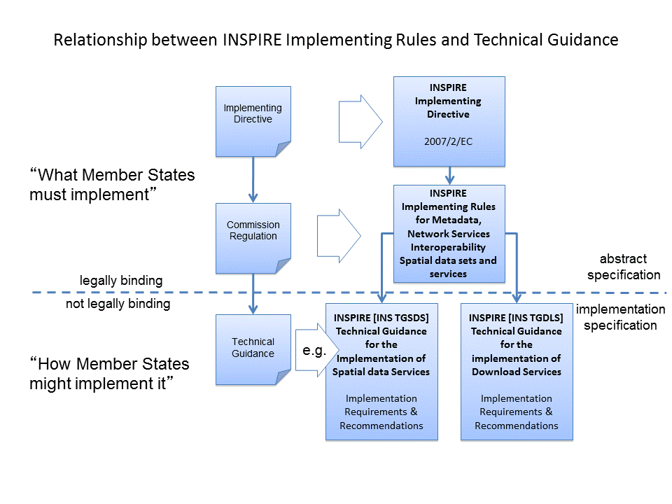
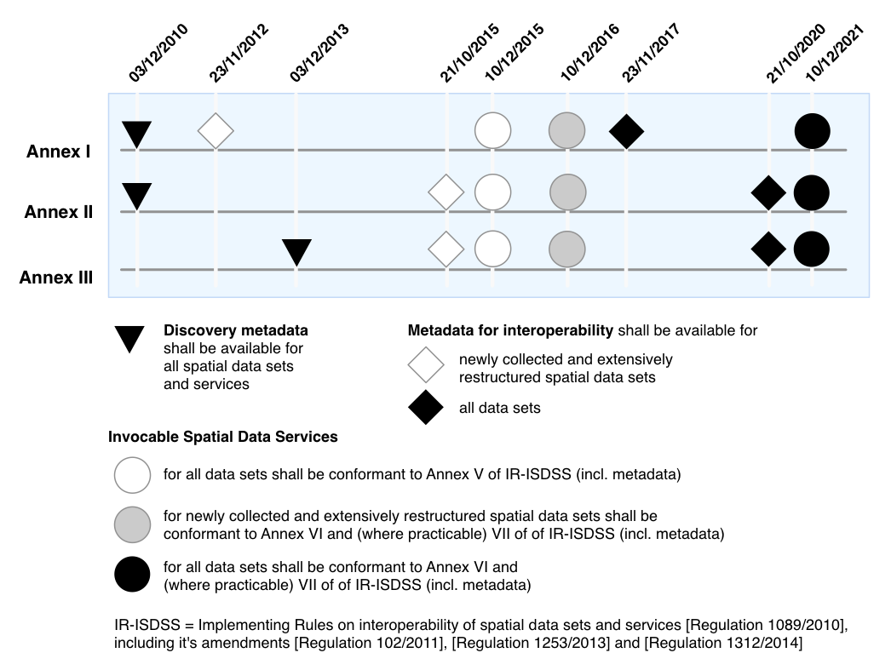
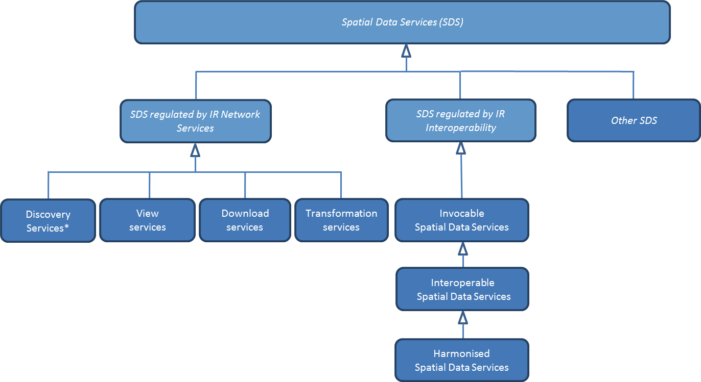
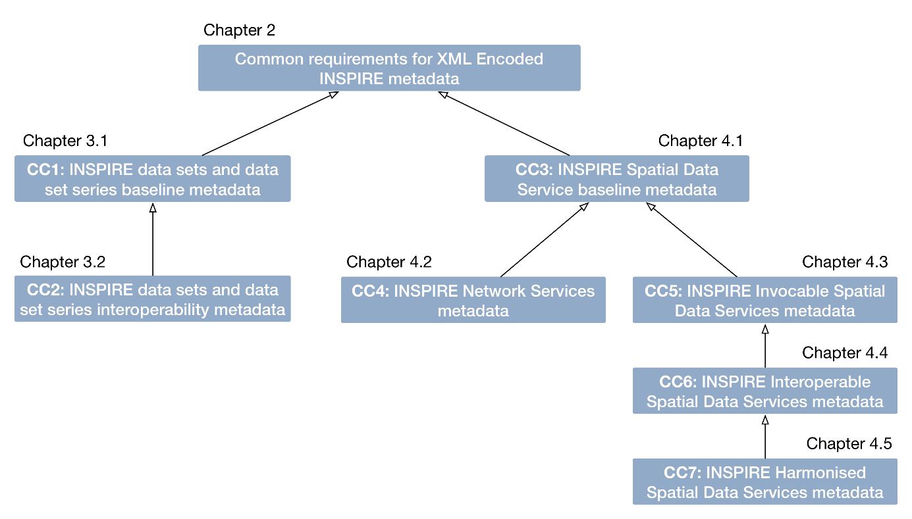
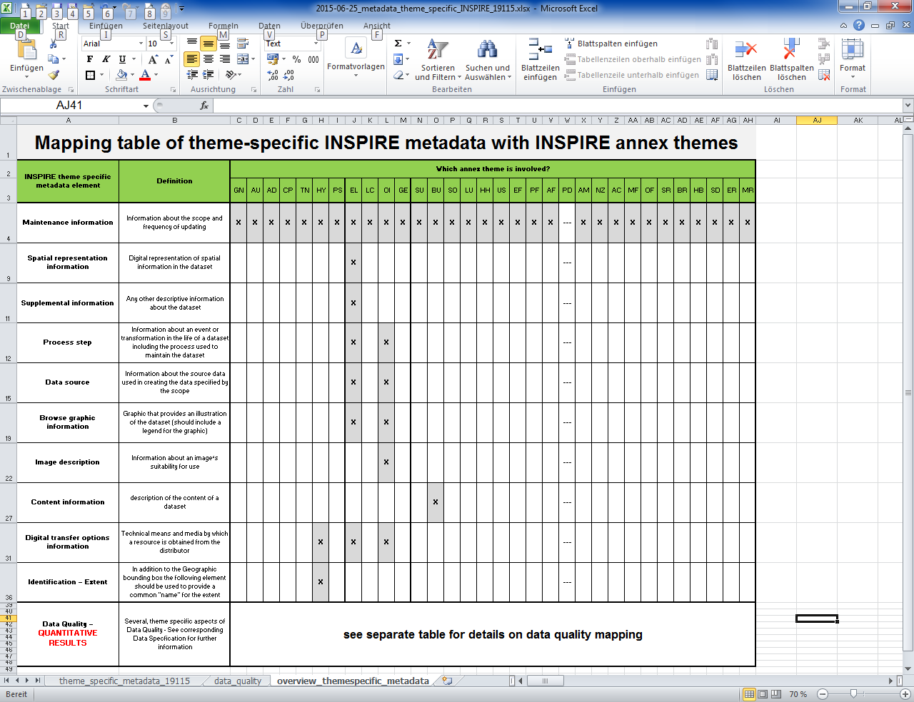
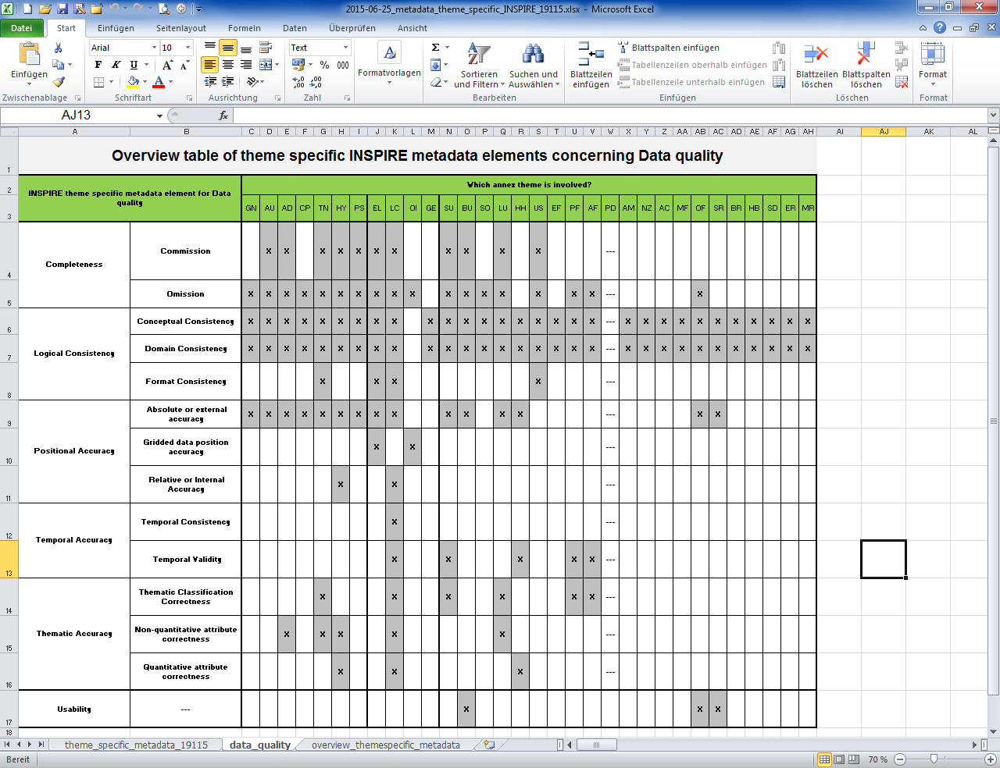

**INSPIRE**

**Infrastructure for Spatial Information in Europe**

**Technical Guidance for the implementation of INSPIRE dataset and
service metadata based on ISO/TS 19139:2007**

<table>
<tbody>
<tr class="odd">
<td><strong>Title</strong></td>
<td>Technical Guidelines for implementing dataset and service metadata based on ISO/TS 19139:2007</td>
</tr>
<tr class="even">
<td><strong>Creator</strong></td>
<td>Temporary MIG subgroup for action MIWP-8</td>
</tr>
<tr class="odd">
<td><strong>Date of publication</strong></td>
<td>2017-08-31</td>
</tr>
<tr class="even">
<td><strong>Subject</strong></td>
<td>Technical Guidance for INSPIRE metadata for datasets and services</td>
</tr>
<tr class="odd">
<td><strong>Status</strong></td>
<td>
Version 2.0.2

This document contains minor bug fixes (see release notes) of the version endorsed by the INSPIRE maintenance and implementation group (MIG) in its meeting on 30/11-1/12/2016 (see meeting minutes at <a href="https://ies-svn.jrc.ec.europa.eu/projects/mig-p/wiki/5th_MIG-P_meeting">https://ies-svn.jrc.ec.europa.eu/projects/mig-p/wiki/5th_MIG-P_meeting</a>).
</td>
</tr>
<tr class="even">
<td><strong>Publisher</strong></td>
<td>INSPIRE Maintenance and Implementation Group (MIG)</td>
</tr>
<tr class="odd">
<td><strong>Type</strong></td>
<td>Text</td>
</tr>
<tr class="even">
<td><strong>Description</strong></td>
<td>Implementation specification for defining metadata for INSPIRE datasets and services in ISO/TS 19139 based XML format in compliance with the INSPIRE Implementing Rules for metadata.</td>
</tr>
<tr class="odd">
<td><strong>Format</strong></td>
<td>MS Word (doc)</td>
</tr>
<tr class="even">
<td><strong>Licence</strong></td>
<td>Creative Commons Attribution (cc-by) 4.0 (<a href="https://creativecommons.org/licenses/by/4.0/">https://creativecommons.org/licenses/by/4.0/</a>)</td>
</tr>
<tr class="odd">
<td><strong>Identifier</strong></td>
<td>
<a href="http://inspire.ec.europa.eu/id/document/tg/metadata-iso19139/2.0">http://inspire.ec.europa.eu/id/document/tg/metadata-iso19139/2.0</a> (latest bugfix version of v2.0)

<a href="http://inspire.ec.europa.eu/id/document/tg/metadata-iso19139/2.0.2">http://inspire.ec.europa.eu/id/document/tg/metadata-iso19139/2.0.2</a> (this bugfix version)
</td>
</tr>
<tr class="even">
<td><strong>Corrigenda</strong></td>
<td><a href="http://inspire.ec.europa.eu/id/document/tg/metadata-iso19139/2.0/corrigenda">http://inspire.ec.europa.eu/id/document/tg/metadata-iso19139/2.0/corrigenda</a></td>
</tr>
<tr class="odd">
<td><strong>Language</strong></td>
<td>EN</td>
</tr>
</tbody>
</table>

Table of Contents

[Table of Contents II](#_Toc476300502)

[Acknowledgements VI](#_Toc476300503)

[Foreword VII](#_Toc476300504)

[Foreword to this version IX](#_Toc476300505)

[Revision history XI](#_TOC14991)

[Normative references XIV](#_TOC22676)

[Other references XVI](#_TOC25384)

[Terms and abbreviations XVII](#_TOC26944)

[Verbal forms for expression of provisions XIX](#_TOC33481)

[1 Overview 1](#overview)

[1.1 Introduction 1](#introduction)

[1.1.1 Roadmap and timelines for provisioning INSPIRE metadata
2](#roadmap-and-timelines-for-provisioning-inspire-metadata)

[1.1.2 Categories of INSPIRE Spatial Data Services
3](#categories-of-inspire-spatial-data-services)

[1.2 XML Encoding of ISO metadata 4](#xml-encoding-of-iso-metadata)

[1.3 INSPIRE Validator Service 4](#inspire-validator-service)

[1.4 Position and structure of this document
5](#position-and-structure-of-this-document)

[1.4.1 TG Requirements, TG Recommendations and conformance
6](#tg-requirements-tg-recommendations-and-conformance)

[2 Common requirements for ISO/TC 19139:2007 based INSPIRE metadata
records
7](#common-requirements-for-isotc-191392007-based-inspire-metadata-records)

[2.1 Metadata structure and encoding
7](#metadata-structure-and-encoding)

[2.1.1 Encoding of code list values 8](#encoding-of-code-list-values)

[2.1.2 Encoding of free text values 8](#encoding-of-free-text-values)

[2.2 General requirements 11](#general-requirements)

[2.2.1 File identifier 11](#file-identifier)

[2.2.2 Metadata language 11](#metadata-language)

[2.2.3 Metadata point of contact 12](#metadata-point-of-contact)

[2.2.4 Metadata date 14](#metadata-date)

[2.3 Identification info section 14](#identification-info-section)

[2.3.1 Resource title 14](#resource-title)

[2.3.2 Resource abstract 15](#resource-abstract)

[2.3.3 Responsible organisation and point of contact for the described
resource
16](#responsible-organisation-and-point-of-contact-for-the-described-resource)

[2.3.4 Temporal references 17](#temporal-references)

[2.3.5 Using keywords 20](#using-keywords)

[2.3.6 Limitations on public access 23](#limitations-on-public-access)

[2.3.7 Conditions applying to access and use
25](#conditions-applying-to-access-and-use)

[2.3.8 Geographic bounding box 27](#geographic-bounding-box)

[2.4 Data quality info section 29](#_Toc476300537)

[2.4.1 Conformity 29](#conformity)

[3 Conformance Classes for data sets
33](#conformance-classes-for-data-sets)

[3.1 Baseline metadata for data sets and data set series
33](#baseline-metadata-for-data-sets-and-data-set-series)

[3.1.1 Direct properties of MD\_Metadata element
33](#direct-properties-of-md_metadata-element)

[3.1.1.1 Resource type 33](#resource-type)

[3.1.2 Identification info section 34](#identification-info-section-1)

[3.1.2.1 Unique resource identifier 34](#_Toc476300544)

[3.1.2.2 Keywords for Spatial Data Theme(s)
37](#keywords-for-spatial-data-themes)

[3.1.2.3 Spatial resolution 38](#spatial-resolution)

[3.1.2.4 Resource language 40](#resource-language)

[3.1.2.5 Topic category 41](#topic-category)

[3.1.3 Distribution info section 42](#distribution-info-section)

[3.1.3.1 Resource locator for data set or series
42](#resource-locator-for-data-set-or-series)

[3.1.4 Data quality info section 44](#data-quality-info-section-1)

[3.1.4.1 Scope 44](#scope)

[3.1.4.2 Conformity 44](#conformity-1)

[3.1.4.3 Lineage 46](#lineage)

[3.2 Interoperability metadata for data sets and data set series
48](#interoperability-metadata-for-data-sets-and-data-set-series)

[3.2.1 Direct properties of MD\_Metadata element
48](#direct-properties-of-md_metadata-element-1)

[3.2.1.1 Coordinates reference systems
48](#coordinates-reference-systems)

[3.2.1.2 Temporal reference systems 50](#temporal-reference-systems)

[3.2.2 Identification info section 51](#identification-info-section-2)

[3.2.2.1 Spatial representation type 51](#spatial-representation-type)

[3.2.2.2 Character encoding 52](#character-encoding)

[3.2.3 Distribution info section 53](#distribution-info-section-1)

[3.2.3.1 Data encoding 53](#data-encoding)

[3.2.4 Data quality info section 54](#data-quality-info-section-2)

[3.2.4.1 Topological consistency 54](#topological-consistency)

[3.2.5 Recommended theme-specific metadata elements
59](#recommended-theme-specific-metadata-elements)

[4 Conformance Classes for Spatial Data Services
60](#conformance-classes-for-spatial-data-services)

[4.1 Baseline metadata for Spatial Data Services
60](#baseline-metadata-for-spatial-data-services)

[4.1.1 Direct properties of MD\_Metadata element
60](#direct-properties-of-md_metadata-element-2)

[4.1.1.1 Resource type 60](#resource-type-1)

[4.1.2 Identification info section 61](#identification-info-section-3)

[4.1.2.1 Restriction on the spatial resolution
61](#restriction-on-the-spatial-resolution)

[4.1.2.2 Spatial Data Service category keywords
62](#spatial-data-service-category-keywords)

[4.1.2.3 Spatial Data Service type 63](#spatial-data-service-type)

[4.1.2.4 Linking to provided data sets using coupled resource
64](#linking-to-provided-data-sets-using-coupled-resource)

[4.1.3 Distribution info section 66](#distribution-info-section-2)

[4.1.3.1 Resource locator for services
66](#resource-locator-for-services)

[4.1.4 Data quality info section 68](#_Toc476300578)

[4.1.4.1 Scope 68](#scope-1)

[4.2 Metadata for Network Services 70](#metadata-for-network-services)

[4.2.1 Identification info section 70](#identification-info-section-4)

[4.2.1.1 Spatial Data Service type 70](#spatial-data-service-type-1)

[4.2.2 Data quality info section 70](#data-quality-info-section-4)

[4.2.2.1 Conformity 70](#conformity-2)

[4.3 Metadata for Invocable Spatial Data Services
73](#metadata-for-invocable-spatial-data-services)

[4.3.1 Identification info section 73](#identification-info-section-5)

[4.3.1.1 Spatial Data Service type 73](#spatial-data-service-type-2)

[4.3.2 Distribution info section 73](#distribution-info-section-3)

[4.3.2.1 Resource locator 73](#resource-locator)

[4.3.3 Data quality info section 75](#data-quality-info-section-5)

[4.3.3.1 Conformity to INSPIRE Implementation Rules
75](#conformity-to-inspire-implementation-rules)

[4.3.3.2 Category of the Spatial Data Service
76](#category-of-the-spatial-data-service)

[4.3.3.3 Conformity to technical specifications
78](#conformity-to-technical-specifications)

[4.4 Metadata for Interoperable Spatial Data Services
81](#metadata-for-interoperable-spatial-data-services)

[4.4.1 Direct properties of MD\_Metadata element
81](#direct-properties-of-md_metadata-element-3)

[4.4.1.1 Coordinate Reference System Identifier
81](#coordinate-reference-system-identifier)

[4.4.2 Identification info section 82](#identification-info-section-6)

[4.4.2.1 Conditions applying to access and use – technical restrictions
82](#conditions-applying-to-access-and-use-technical-restrictions)

[4.4.2.2 Responsible party – custodian 82](#responsible-party-custodian)

[4.4.3 Data quality info section 83](#data-quality-info-section-6)

[4.4.3.1 Minimum estimated Quality of Service
83](#minimum-estimated-quality-of-service)

[4.5 Metadata for Harmonised Spatial Data Services
86](#metadata-for-harmonised-spatial-data-services)

[4.5.1 Identification info section 86](#identification-info-section-7)

[4.5.1.1 Invocation metadata 86](#invocation-metadata)

[Annex A Abstract Test Suites 89](#_Toc476300605)

[A.1 ATS: Metadata for INSPIRE datasets and data set series
89](#ats-metadata-for-inspire-datasets-and-data-set-series)

[A.1.1 Conformance Class 1: Baseline metadata for data sets and data set
series
89](#conformance-class-1-baseline-metadata-for-data-sets-and-data-set-series)

[A.1.2 Conformance Class 2: Interoperability metadata for data sets and
data set series
89](#conformance-class-2-interoperability-metadata-for-data-sets-and-data-set-series)

[A.2 ATS: Metadata for INSPIRE Spatial Data Services
89](#ats-metadata-for-inspire-spatial-data-services)

[A.2.1 Conformance Class 3: Baseline metadata for Spatial Data Services
89](#conformance-class-3-baseline-metadata-for-spatial-data-services)

[A.2.2 Conformance Class 4: Metadata for INSPIRE Network Services
89](#conformance-class-4-metadata-for-inspire-network-services)

[A.2.3 Conformance Class 5: Metadata for Invocable Spatial Data Services
89](#conformance-class-5-metadata-for-invocable-spatial-data-services)

[A.2.4 Conformance Class 6: Metadata for Interoperable Spatial Data
Services
89](#conformance-class-6-metadata-for-interoperable-spatial-data-services)

[A.2.5 Conformance Class 7: Metadata for Harmonised Spatial Data
Services
90](#conformance-class-7-metadata-for-harmonised-spatial-data-services)

[Annex B Mapping of ISO 19115:2003 Core elements and INSPIRE
Implementing Rules for metadata (informative)
91](#mapping-of-iso-191152003-core-elements-and-inspire-implementing-rules-for-metadata-informative)

[B.1 Spatial dataset and spatial dataset series
91](#spatial-dataset-and-spatial-dataset-series)

[B.2 Services 92](#services)

[B.3 Conclusion 94](#_Toc476300618)

[Annex C INSPIRE metadata element catalog (informative)
95](#inspire-metadata-element-catalog-informative)

[C.1 Overview of the required INSPIRE metadata elements
96](#overview-of-the-required-inspire-metadata-elements)

[C.1.1 Spatial data sets and data sets series
96](#spatial-data-sets-and-data-sets-series)

[C.1.2 Spatial Data Services 98](#spatial-data-services)

[C.2 INSPIRE Implementing Rules for metadata (regulation 1205/2008)
102](#inspire-implementing-rules-for-metadata-regulation-12052008)

[C.2.1 Resource title 102](#resource-title-1)

[C.2.2 Resource abstract 102](#resource-abstract-1)

[C.2.3 Resource type 103](#_Toc476300626)

[C.2.4 Resource locator 103](#resource-locator-1)

[C.2.5 Unique resource identifier 104](#_Toc476300628)

[C.2.6 Coupled resource 105](#coupled-resource)

[C.2.7 Resource language 106](#_Toc476300630)

[C.2.8 Topic category 106](#_Toc476300631)

[C.2.9 Spatial data service type 107](#_Toc476300632)

[C.2.10 Keyword value 107](#keyword-value)

[C.2.11 Originating controlled vocabulary
108](#originating-controlled-vocabulary)

[C.2.12 Geographic bounding box 109](#_Toc476300635)

[C.2.13 Temporal extent 110](#_Toc476300636)

[C.2.14 Date of publication 110](#_Toc476300637)

[C.2.15 Date of last revision 111](#_Toc476300638)

[C.2.16 Date of creation 111](#_Toc476300639)

[C.2.17 Lineage 112](#_Toc476300640)

[C.2.18 Spatial resolution 112](#_Toc476300641)

[C.2.19 Specification 113](#_Toc476300642)

[C.2.20 Degree 114](#_Toc476300643)

[C.2.21 Conditions applying to access and use 114](#_Toc476300644)

[C.2.22 Limitations on public access
117](#limitations-on-public-access-1)

[C.2.23 Responsible party 117](#responsible-party)

[C.2.24 Responsible party role 118](#_Toc476300647)

[C.2.25 Metadata point of contact 118](#metadata-point-of-contact-1)

[C.2.26 Metadata date 119](#_Toc476300649)

[C.2.27 Metadata language 119](#_Toc476300650)

[C.3 Implementing Rules for interoperability of spatial data sets and
services (regulations 1089/2010 and 1253/2013)
120](#implementing-rules-for-interoperability-of-spatial-data-sets-and-services-regulations-10892010-and-12532013)

[C.3.1 Coordinate Reference System 120](#coordinate-reference-system)

[C.3.2 Temporal Reference System 121](#_Toc476300653)

[C.3.3 Encoding 122](#encoding)

[C.3.4 Character Encoding 122](#character-encoding-1)

[C.3.5 Spatial representation type 123](#spatial-representation-type-1)

[C.3.6 Topological Consistency 123](#_Toc476300657)

[C.4 Implementing Rules for Invocable Spatial Data Services (Regulation
1312/2014, Annex I)
125](#implementing-rules-for-invocable-spatial-data-services-regulation-13122014-annex-i)

[C.4.1 Category 125](#category)

[C.4.2 Resource locator 126](#resource-locator-2)

[C.4.3 Specification 127](#specification-1)

[C.5 Implementing Rules for Interoperable Spatial Data Services
(Regulation 1312/2014, Annex II)
128](#implementing-rules-for-interoperable-spatial-data-services-regulation-13122014-annex-ii)

[C.5.1 Coordinate Reference System 128](#coordinate-reference-system-1)

[C.5.2 Criteria 129](#criteria)

[C.5.3 Measurement 129](#measurement)

[C.6 Implementing Rules for Harmonised Spatial Data Services (Regulation
1312/2014, Annex III)
130](#implementing-rules-for-harmonised-spatial-data-services-regulation-13122014-annex-iii)

[C.6.1 Invocation metadata 130](#invocation-metadata-1)

[C.7 Theme-specific metadata elements from INSPIRE Data Specifications
131](#theme-specific-metadata-elements-from-inspire-data-specifications)

[C.7.1 Maintenance information 136](#maintenance-information)

[C.7.2 Spatial representation information
136](#spatial-representation-information)

[C.7.3 Supplemental information 137](#supplemental-information)

[C.7.4 Process step 137](#process-step)

[C.7.5 Data source 139](#data-source)

[C.7.6 Browse graphic information 140](#browse-graphic-information)

[C.7.7 Image description 140](#image-description)

[C.7.8 Content information 141](#content-information)

[C.7.9 Digital transfer options information
142](#digital-transfer-options-information)

[C.7.10 Extent 142](#extent)

[C.7.11 Data Quality 143](#data-quality)

[Annex D Referenced code lists and code list values
145](#referenced-code-lists-and-code-list-values)

[D.1 Limitations on public access 145](#limitations-on-public-access-2)

[D.2 Conditions Applying To Access And Use
146](#conditions-applying-to-access-and-use-2)

[D.3 Quality of Service criteria code
146](#quality-of-service-criteria-code)

[D.4 Default Coordinate Reference Systems
147](#default-coordinate-reference-systems)

[Annex E Mapping between IR element numbers and TG Requirements
150](#mapping-between-ir-element-numbers-and-tg-requirements)

[Annex F Mapping for Requirements in previous TG versions
153](#mapping-for-requirements-in-previous-tg-versions)

[Annex G Examples of complete INSPIRE metadata records
157](#examples-of-complete-inspire-metadata-records)

Acknowledgements

Many individuals and organisations have contributed to the development
of these Guidelines.

The original INSPIRE Drafting Team on Metadata (2006-08) included:
Marcel Reuvers (Netherlands), Nicolas Lesage (France), Kristian Senkler
(Germany), Michael Gould (Spain), Gil Ross (UK), Stefano Nativi (Italy),
Jan Hjelmager (Denmark), Franz Daffner (European Environment Agency),
Per Ryghaud (Norway), Thomas Vögele and Fred Kruse (Germany), David
Danko (USA).

This version 2.0 is an extensive revision of the previous version 1.3
both in structure and content based on the work of the INSPIRE
Maintenance and Implementation Group (MIG) subgroup for the Work Package
8: Metadata (MIWP-8). The editing work including restructuring of the
text into Conformance Class chapters and TG Requirement text revisions
for added XML element level precision was done by Ilkka Rinne of
Spatineo Inc under contract for the European Commission Joint Research
Centre (JRC) in January - April 2016.

We wish to thank the members of the MIWP-8 group as well as Michael
Lutz, Angelo Quaglia and Freddy Fierens of the JRC for the thorough
groundwork, insightful feedback and contributions to document during the
editing work.The MIWP-8 group was chaired by Michael Östling (Sweden),
and included the following members (in alphabetical order): Christian
Ansorge (EEA), Lars Inge Arnevik (Norway), Vincent Bombaerts (Belgium),
Pierluigi Cara (Italy), Radoslav Chudý (Czech Republic), Ine de Visser
(Netherlands), Daniele Francioli (JRC), Christine Gassner (Austria),
Alejandro Guinea de Salas (Spain), Paul Hasenohr (EEA), Željko Hecimovic
(Croatia), Frédéric Houbie (France), Lucie Kondrova (Czech Republic),
Peter Kochmann (Germany), Marc Léobet (France), Marie Lambois (France),
Darja Lihteneger (EEA), Manfred Mittelboeck, (Austria), Javier Nogueras
Iso (Spain), Geraldine Nolf (Belgium), Andrea Perego (JRC), Tomas Reznik
(Czech Republic), James Reid (UK), Eliane Roos (France), Antonio
Rotundo, (Italy), Martin Seiler (Germany), Kristian Senkler (Germany),
André Schneider (Switzerland), Age Sild (Estonia), and Pawel Soczewski
(Poland).

**Contact information**

European Commission Joint Research Centre

B.6 Digital Economy

<https://inspire.ec.europa.eu/feedback>

Foreword

Directive 2007/2/EC of the European Parliament and of the Council \[INS
DIR\], adopted on 14 March 2007 aims at establishing an Infrastructure
for Spatial Information in the European Community (INSPIRE) for
environmental policies, or policies and activities that have an impact
on the environment. INSPIRE will make available relevant, harmonised and
quality geographic information to support the formulation,
implementation, monitoring and evaluation of policies and activities,
which have a direct or indirect impact on the environment.

INSPIRE is based on the infrastructures for spatial information
established and operated by the 28 Member States of the European Union.
The Directive addresses 34 spatial data themes needed for environmental
applications, with key components specified through technical
implementing rules. This makes INSPIRE a unique example of a legislative
“regional” approach.

To ensure that the spatial data infrastructures of the Member States are
compatible and usable in a Community and trans-boundary context, the
Directive requires that common Implementing Rules (IR) are adopted in
the following areas.

-   Metadata;

-   The interoperability and harmonisation of spatial data and services
    for selected themes (as described in Annexes I, II, III of the
    Directive);

-   Network Services;

-   Measures on sharing spatial data and services;

-   Co-ordination and monitoring measures.

The Implementing Rules are adopted as Commission Decisions or
Regulations, and are legally binding.

In addition to the Implementing Rules, non-binding Technical Guidance
documents describe detailed implementation aspects and relations with
existing standards, technologies and practices in order to support the
technical implementation process. They may need to be revised during the
course of implementing the infrastructure to take into account the
evolution of technology, new requirements, and cost benefit
considerations. In other words, these Technical Guidance documents are
supporting material to assist in the technical implementation of the
INSPIRE Directive but no additional obligations can be derived from
these documents over and above the obligations set out in the Directive
and the Implementing Rules. The Technical Guidance documents are also
not intended to interpret legal obligations. Figure 1 illustrates the
relationship between the INSPIRE Regulations containing Implementing
Rules and their corresponding Technical Guidance documents.

This Technical Guidance document relates to the implementation of the
requirements related to metadata for spatial data sets and series and
spatial data services (including network services) included in
\[Regulation 1205/2008\] and \[Regulation 1089/2010\].

Implementing this Technical Guidance are designed to maximise the
interoperability of INSPIRE services. Technical Guidance documents
describe how Member States might implement the Implementing Rules
described in a Commission Regulation. The technical provisions and the
underlying concepts are often illustrated by use case diagrams and
accompanied by examples. Technical Guidance documents may also include
non-binding technical recommendations that should be satisfied if a
Member State chooses to conform to the Technical Guidance. However,
these recommendations have no legally binding effect.

**Figure** **1:** Relationship between the INSPIRE Implementing Rules
and the associated Technical Guidance.

<table>
<tbody>
<tr class="odd">
<td>
<strong>Disclaimer</strong>

This document has been developed collaboratively through the INSPIRE maintenance and implementation framework, involving experts of the European Commission services, the European Environment Agency, EU Member States, the Accession and EFTA Countries. The document should be regarded as presenting an informal consensus position on best practice agreed by all partners. However, the document does not necessarily represent the official, formal position of any of the partners. To the extent that the European Commission's services provided input to this technical document, such input does not necessarily reflect the views of the European Commission and its services. This document does not bind the Commission and its services, nor can the Commission and its services be held responsible for any use which may be made of the information contained herein.

The technical document is intended to facilitate the implementation of Directive 2007/2/EC and is not legally binding. Any authoritative reading of the law should only be derived from Directive 2007/2/EC itself and other applicable legal texts or principles such as the related Implementing Rules. Only the Court of Justice of the European Union is competent to authoritatively interpret Union legislation.
</td>
</tr>
</tbody>
</table>

Foreword to this version

The previous version 1.3 of this Technical Guidelines document has been
widely used since its publication in 2013. It has led to a lot of
feedback concerning unclear TG Requirements and implementation choices,
which this version aims to answer and clarify. This work has been done
under INSPIRE Maintenance and Implementation Group (MIG) temporary
sub-group for work package 8 (MIWP-8: Metadata). According to its terms
of reference[1], this new version of the TG document addresses the
following issues:

-   Integrate metadata for Spatial Data Services

-   Integrate metadata for interoperability

-   Integrate theme-specific metadata

-   Language neutral identifiers – more use of Anchors

-   Review and possibly revise guidelines for implementing the *Unique
    Resource Identifier* element

-   Review and possibly revise guidelines for implementing
    “data-service-coupling” (coupled resources)

-   Guidelines for implementing the element *conditions applying to
    access and use* are not in line with EN ISO 19115:2005.

Possible future work related to metadata (in relation also to other
actions in the MIWP 2016-2020) not necessarily involving an update of
these guidelines:

-   Harmonized restrictions/licenses

-   Relation to ISO19115-1:2014

-   References to conformance classes in registry (see action 2016.3)

-   Using metadata for INSPIRE monitoring and reporting (see action
    2016.2)

-   Add Abstract Test suite (see action 2016.3)

-   Revising the XPaths used in the document to be less restrictive, so
    that they also match the corresponding elements in all profiles
    conformant with \[ISO 19139\]

Another important driver for this revision has been the activities of
the group MIWP-5: Validation & conformity testing concerning the
Conformance Classes and Abstract Test Suites for the INSPIRE metadata.
Several issues concerning the testability and interpretation of
technical requirements of the Implementation Rules for metadata
expressed in version 1.3 of this document were raised during the
drafting of the Test Cases for INSPIRE metadata.

This new version aims at clarifying and expressing technical
requirements for INSPIRE metadata, improving the readability of the
document, and combining the metadata related technical requirements for
INSPIRE data sets, data set series and Spatial Data Services in one
document. The technical requirements have been organised into
Conformance Classes based on both the type of the described resources
(data sets & services) and the different INSPIRE Regulations containing
the legal requirements for providing INSPIRE metadata.

In the versions 1.0 - 1.3 of this document the definition of a formal
INSPIRE profile of ISO 19115 combined with elements from ISO 19119
formed the basis of the presented technical requirements. The ISO 19115
Core element set was extended with INSPIRE specific constraints and
extensions. The mapping from the ISO 19115/19119 elements into XML
elements according to ISO/TS 19139 was then implicitly given in the text
of the technical requirements and the mapping tables for each of the
required metadata element described in the INSPIRE Implementing Rule
documents. This hybrid approach of presenting the INSPIRE requirements
as an abstract ISO 19115 profile while at the same time stating explicit
XML element level requirements in the technical requirements, led to
some confusion to what is actually required by the technical
specification.

The technical requirements in this version of the specification are
presented within the context of the corresponding INSPIRE Regulations,
and expressed by mentioning the required XML elements and attributes
explicitly. Thus the document aims to provide a clear guidance on how to
use the ISO 19139 XML Schemas combined with the XML Schema
implementation of ISO 19119 as published by the Open Geospatial
Consortium (OGC) for providing all the required metadata elements of the
relevant INSPIRE Regulations in an XML format. This clarification in the
level of abstraction of the technical requirements was carried out to
emphasise that the XML encoding of the metadata based on ISO 19139
standard is required in order to be compliant with this technical
specification.

Special care has been taken to not make any unnecessary changes in the
required metadata elements in between the version 1.3 and 2.0. The goal
has been to only clarify the existing requirements in cases where more
than one interpretation of the Implementation Rules existed, or where
the required XML encoding was unclear or ambiguous. Some harmonisation
between the XML encodings of the elements required by different INSPIRE
Regulations has also been done to make the work of the metadata
providers and INSPIRE metadata handling software providers easier.

Reading guidance and transition period

As the structure of the document and the expressions have changed
considerably from the previous version of the document, the following
sections have been included to help the readers in locating the specific
elements and technical requirements in this version of the document:

-   The informative Annex B contains the mapping between the ISO
    > 19115:2003 Core elements and INSPIRE Implementing Rules for
    > metadata in section 1.1 of version 1.3.

-   The informative Annex C contains detailed tables for all the INSPIRE
    > metadata elements described in the INSPIRE Regulations for
    > discovery and interoperability metadata. The first section of this
    > annex contains on overview table for these elements with the
    > Regulation references and required INSPIRE multiplicities and
    > conditions of each element.

-   Annex D contains a listing of the code lists referenced in this
    > document including the URI’s of the code lists and their current
    > content.

-   Annex E contains a mapping table between the Implementation Rule
    > sections containing the required metadata elements and the TG
    > Requirements as expressed in the indicated sections in this
    > document.

-   Annex F contains a mapping table between the TG Requirements
    > contained in the version 1.3 and the corresponding TG Requirements
    > in this document. This table also contains the mapping between the
    > Implementation Requirements and Recommendations contained in \[TG
    > SDS\] and the TG Requirements and Recommendations concerning
    > Spatial Data Services in this document.

As many Member States have already implemented the previous version of
the Technical Guidance for metadata, the transition between version 1.3
and 2.0 will require some developments. It is especially true for
elements where it has been necessary to modify or clarify the structure
or content of the required XML elements. The metadata handling and
validating tools created to comply with the Technical Guidance version
1.3 may need updating to fully comply with this version.

To facilitate a smooth transition from version 1.3 to version 2.0, a
transitional period of 3 years has been defined, starting from 19
December 2016. During this period, the metadata records compliant with
both version 1.3 and 2.0 implementations will be considered as
“compliant with the INSPIRE Technical Guidelines for Metadata”. During
the transitional period, the validator used in the INSPIRE geoportal
will validate against and will provide validation reports for both
versions 1.3 and 2.0. The better result will be used for the value of
the compliance meter. After the transitional period, the geoportal will
only validate against version 2.0.

Revision history

Changes from the version 1.3 to 2.0

Due to the extensiveness of the structural changes and revision of the
textual content for this version, the following list only includes
changes directly affecting the TG Requirements and Recommendations.

**<u>Requirements/recommendations removed (compared to version
1.3):</u>**

-   Section 1.2 INSPIRE specific constraints (SC) has been removed. The
    > restrictions have been integrated into the relevant TG
    > Requirements in the document.

-   TG Recommendation 6 has been removed.

-   TG Recommendations 7 and 8 have been removed.

-   TG Requirement 6 concerning the use of RS\_Identifier has been
    > removed.

-   TG Requirement 11 has been removed as redundant due to the required
    > values being specified as an enumeration in the XML Schema.

-   TG Recommendation 13 concerning using both code and human-readable
    > keywords has been removed.

**<u>New requirements/recommendations in version 2.0:</u>**

-   A new *TG Requirement C.1* has been added to explicitly require
    > using one of the listed XML Schemas for encoding the \[ISO 19115\]
    > and \[ISO 19119\] metadata elements.

-   A new *TG Requirement C.2* has been added to require the use of
    > MD\_Metadata as the parent element for the metadata records.

-   A new *TG Requirement C.3* has been added to specify encoding the
    > code list values.

-   A new *TG Requirement C.4* has been added to specify encoding the
    > Non-empty Free Text Elements.

-   New *TG Recommendation 1.8* and *TG Recommendation 3.4* have been
    > added to recommend the use on name, description and function
    > properties of CI\_OnlineResource element in providing the Resource
    > locator element.

-   A new *TG Recommendation 1.2* for using resolvable URIs for the data
    > set identification has been added.

-   A new *TG Requirement C.13* was added to explicitly require that at
    > most one date of last revision is given.

-   A new *TG Requirement C.14* was added to require the XML encoding of
    > the temporal extent, if given.

-   New *TG Requirement 1.9* and *TG Requirement 3.8* have been created
    > to cover the INSPIRE specific constraint SC6 concerning declaring
    > the scope of the *dataQualityInfo*.

-   A new *TG Requirement C.7* has been added to explicitly require the
    > Metadata date element described in section 2.11.2 of the version
    > 1.3.

-   New *TG Requirement 2.1* and *TG Requirement 2.2* were added for
    > requiring describing the Coordinate Reference System
    > (interoperability metadata).

-   A new *TG Requirement 2.3* was added for requiring describing the
    > Temporal reference systems (interoperability metadata).

-   A new *TG Requirement 2.4* was added for requiring describing the
    > Spatial representation type (interoperability metadata).

-   A new *TG Requirement 2.5* was added for requiring describing the
    > Character encoding (interoperability metadata).

-   A new *TG Requirement 2.6* was added for requiring describing the
    > Data encoding (interoperability metadata).

-   New *TG Requirement 2.7* and *TG Requirement 2.8* were added for
    > requiring describing the topological consistency (interoperability
    > metadata).

-   A new *TG Requirement 3.2* was added to explicitly require
    > *srv:SV\_ServiceIdentification* element to be used for identifying
    > Spatial Data Services.

-   A new *TG Requirement 3.3* was added to require describing
    > restrictions on spatial resolution for Spatial Data Services
    > within the abstract element.

**<u>Changed requirements/recommendations:</u>**

-   Providing a non-empty Resource title element (section 2.2.1) is now
    > explicitly required in *TG Requirement C.8*.

-   Providing a non-empty Resource abstract element (section 2.2.2) is
    > now explicitly required in *TG Requirement C.9*.

**<u>Renumbered, moved, combined requirements/recommendations:</u>**

-   Section 1.1 ISO Core Metadata Elements has been moved into Annex B.

-   TG Requirement 3 concerning the Resource locator element for data
    > sets and dataset series is now the *TG Requirement 1.8.* This
    > requirement also now contains explicit XML element required.

-   TG Requirement 4 concerning the Resource locator element for
    > Services is now the *TG Requirement 3.7*. This requirement also
    > now contains explicit XML element required. The list of the
    > possible resource types the provided URL should point to has been
    > moved into *TG Recommendation 3.5*.

-   TG Requirement 5 concerning the Unique Resource Identifier for data
    > sets and data set series is now the *TG Requirement 1.3*. The IR
    > Requirement for providing both the code and the code space has
    > been interpreted as integrated parts of a single URI character
    > string.

-   TG Recommendation 9 about deleting the Unique Resource Identifiers
    > has been clarified as *TG Recommendation 1.3*.

-   TG Recommendations 3, 4 and 5 have been combined as *TG
    > Recommendation C.4*.

-   The *hierachyLevel* element required in TG Requirements 1 and 2 is
    > now stated in *TG Requirement 1.1* (for data sets and data set
    > series) and *TG Requirement 3.1* (for Spatial Data Services)

-   The content of the TG Requirement 7 concerning Coupled resource for
    > services has been clarified and is now the *TG Requirement 3.6*.

-   The TG Requirements 8 and 9 concerning Resource language are now
    > combined in *TG Requirement 1.6*.

-   The TG Recommendation 10 about the default value for Resource
    > language has now been integrated in *TG Requirement 1.6*. For data
    > sets and series containing non-textual information only, the ISO
    > 639-2/B value "zxx" is now required instead of the previous
    > recommendation for using the metadata language.

-   TG Requirement 10 concerning Topic category is now the *TG
    > Requirement 1.7.*

-   TG Requirement 12 concerning the Spatial data service type is now
    > stated as *TG Requirement 3.5*, *TG Requirement 4.1* (Network
    > services) and *TG Requirement 5.1* (Invocable Spatial Data
    > Services).

-   TG Requirements 13, 14 and 15 concerning using at least one keyword
    > are now stated as *TG Requirement 1.4* (for data sets and data set
    > series) and *TG Requirement 3.4* (for Spatial Data Services).

-   TG Requirement 16 concerning keywords from controlled vocabularies
    > is now integrated into *TG Requirement C.15*.

-   TG Recommendation 11 has been reworded into *TG Recommendation C.7*.

-   TG Recommendation 12 has been split into *TG Recommendation 1.5*
    > (for data sets and data set series) and *TG Recommendation 3.3*
    > (for Spatial Data Services).

-   TG Requirements 17 and 18 concerning Originating controlled
    > vocabularies of keywords are now combined in *TG Requirement
    > C.15*.

-   TG Requirement 19 concerning grouping of the keywords referring to
    > the same controlled vocabulary is now stated as the *TG
    > Requirement C.16*.

-   TG Requirements 20 and 21 concerning the Geographic bounding box are
    > now combined into *TG Requirement C.19*. The INSPIRE specific
    > constraint SC13 for specifying the use of any coordinate reference
    > system with Greenwich Prime Meridian has been removed, as the ISO
    > 19139 XML Schema explicitly requires the use in WGS 84 coordinate
    > reference system coordinates in the EX\_GeographicBoundingBox
    > element.

-   The TG Requirements 22, 23 and 24 concerning Temporal references
    > have been combined in *TG Requirement C.11*.

-   The TG Requirement 25 has been rephrased as *TG Requirement C.12* to
    > clarify that the creation date is not mandatory, but one of date
    > of publication, date of creation or date of last revision.

-   TG Requirement 26 concerning the Lineage element is now stated in
    > *TG Requirement 1.11*.

-   TG Requirement 27 concerning Spatial resolution is now stated in *TG
    > Requirement 1.5* (for data sets and data sets series) and in *TG
    > Requirement 3.3* (for Spatial Data Services).

-   TG Requirements 28 and 29 concerning the conformity declarations
    > against the INSPIRE Implementation Rules for interoperability of
    > spatial data sets and services is now stated in *TG Requirement
    > 1.10* (for data sets and data set series) and *TG Requirement 5.3*
    > (for Invocable Spatial Data Services). TG Recommendation 19
    > concerning the conformity declarations against the INSPIRE
    > Implementation Rules for network services is now stated in *TG
    > Recommendation 4.1*. The common structure for declaring the
    > conformity against a specification is given in *TG Requirement
    > C.20*, *TG Requirement C.21* and *TG Requirement C.22*.

-   The TG Requirements 30, 31, 32, 33 and 34 concerning the Limitations
    > on public access and the Conditions applying to access and use
    > elements have been revised and split into *TG Requirement C.17*
    > about Limitations on public access, and *TG Requirement C.18*
    > about Conditions applying to access and use. The XML encoding of
    > these elements have been clarified and harmonised. For both
    > elements only the *MD\_LegalConstraints* shall now be used
    > containing a combination of *accessConstraints*, *useConstraints*
    > and *otherConstraints* as described in sections 2.3.6 and 2.3.7.
    > Referring to the new INSPIRE code lists for the reason of the
    > Limitations on public access as well as Conditions applying to
    > access and use ("no conditions" or "unknown") is now mandatory
    > using the *gmx:Anchor* element.

-   TG Requirements 35 and 36 as well as the INSPIRE specific constraint
    > SC14 concerning the responsible organisation are now covered by
    > *TG Requirement C.10*.

-   TG Requirements 37 and 38 concerning the Metadata point of contact
    > are now given as *TG Requirement C.6*.

-   TG Requirement 39 concerning the Metadata language is now stated as
    > *TG Requirement C.5*.

Normative references

The following referenced documents are indispensable for the application
of this document. For dated references, only the edition cited applies.
For undated references, the latest edition of the referenced document
(including any amendments) applies. For ISO standards that have also
been adopted as EN by CEN, the relevant CEN reference and adoption date
are given, with the ISO number and adoption date in parentheses.

\[ISO/IEC Directives Part 2\] ISO/IEC Directives Part 2: Principles to
structure and draft documents intended to become International
Standards, Technical Specifications or Publicly Available
Specifications, 7th edition, 2016.

\[ISO 19105\] EN ISO 19105:2005, Geographic Information – Conformance
and testing (ISO 19105:2000)

\[ISO 19108\] EN ISO 19108:2005, Geographic Information – Temporal
Schema (ISO 19108:2002)

\[ISO 19112\] EN ISO 19112:2005, Geographic Information – Spatial
referencing by geographic identifiers (ISO 19112:2003)

\[ISO 19115\] EN ISO 19115:2005, Geographic information – Metadata (ISO
19115:2003)

\[ISO 19119\] EN ISO 19119:2005, Geographic information – Services (ISO
19119:2005)

\[ISO 19139\] ISO/TS 19139:2007, Geographic information – Metadata – XML
schema implementation

\[ISO 639-2\] ISO 639-2:1998, Codes for the representation of names of
languages – Part 2: Alpha-3 code

\[ISO 8601\] ISO 8601:2004, Data elements and interchange formats –
Information interchange – Representation of dates and times

\[CSW2 AP ISO\] OpenGIS Catalogue Services Specification 2.0.2 - ISO
Metadata Application Profile, Version 1.0.0, OGC 07-045, 2007

\[INSPIRE Directive\] Directive 2007/2/EC of the European Parliament and
of the Council of 14 March 2007 establishing an Infrastructure for
Spatial Information in the European Community (INSPIRE)

\[Regulation 1205/2008\] Commission Regulation (EC) No 1205/2008 of 3
December 2008 implementing Directive 2007/2/EC of the European
Parliament and of the Council as regards metadata.

NOTE \[Regulation 1205/2008\] is informally also known as "Implementing
Rules for metadata".

\[Regulation 976/2009\] Commission Regulation (EC) No 976/2009 of 19
October 2009 implementing Directive 2007/2/EC of the European Parliament
and of the Council as regards the Network Services, as amended by

-   Commission Regulation (EC) No 1088/2010 of 23 November 2010 amending
    Regulation (EC) No 976/2009 as regards download services and
    transformation services; and

-   Commission Regulation (EU) No 1311/2014 of 10 December 2014 amending
    Regulation (EC) No 976/2009 as regards the definition of an INSPIRE
    metadata element

NOTE \[Regulation 976/2009\] is informally also known as "Implementing
Rules for network services".

\[Regulation 1089/2010\] Commission Regulation (EU) No 1089/2010 of 23
November 2010 implementing Directive 2007/2/EC of the European
Parliament and of the Council as regards interoperability of spatial
data sets and services, as amended by

-   Commission Regulation (EU) No 102/2011 of 4 February 2011 amending
    Regulation (EU) No 1089/2010 implementing Directive 2007/2/EC of the
    European Parliament and of the Council as regards interoperability
    of spatial data sets and services;

-   Commission Regulation (EU) No 1253/2013 of 21 October 2013 amending
    Regulation (EU) No 1089/2010 implementing Directive 2007/2/EC as
    regards interoperability of spatial data sets and services; and

-   Commission Regulation (EU) No 1312/2014 of 10 December 2014 amending
    Regulation (EU) No 1089/2010 implementing Directive 2007/2/EC of the
    European Parliament and of the Council as regards interoperability
    of spatial data services.

NOTE \[Regulation 1089/2010\] is informally also known as "Implementing
Rules for interoperability of spatial data sets and services" or
IR-ISDSS for short.

\[OGC Specification Model\] The Specification Model – A Standard for
Modular specifications, Open Geospatial Consortium, OGC 08-131r3,
<https://portal.opengeospatial.org/files/?artifact_id=34762>

Other references

\[TG SDS\] Technical Guidance for INSPIRE Spatial Data Services and
services allowing spatial data services to be invoked, version 4.0,
<http://inspire.ec.europa.eu/id/document/tg/sds/4.0>

\[TG DiscoveryS\] Technical Guidance for INSPIRE Discovery Services,
version 3.1,
<http://inspire.jrc.ec.europa.eu/documents/Network_Services/TechnicalGuidance_DiscoveryServices_v3.1.pdf>

\[TG ViewS\] Technical Guidance for the implementation of INSPIRE View
Services, version 3.11,
<http://inspire.ec.europa.eu/documents/Network_Services/TechnicalGuidance_ViewServices_v3.11.pdf>

\[TG DownloadS\] Technical Guidance for the implementation of INSPIRE
Download Services, version 3.1,
<http://inspire.ec.europa.eu/documents/Network_Services/Technical_Guidance_Download_Services_v3.1.pdf>

\[TG DS\] Technical Guidelines – INSPIRE data specifications,
<http://inspire.ec.europa.eu/index.cfm/pageid/2>

\[ISO 19115-1\] ISO 19115-1:2014, Geographic information – Metadata –
Part 1: Fundamentals

\[ISO 19115-3\] ISO/TS 19115-3:2016, Geographic information – Metadata –
Part 3: XML schema implementation for fundamental concepts

\[ISO 19157\] ISO 19157:2013, Geographic information -- Data quality.

NOTE This document is not listed under normative references because it
is only referred as an inspiration for the ISO 19139 encoding of the
INSPIRE metadata elements Topological consistency and Data quality. The
ISO 19157:2013 standard should be used together with a newer version of
ISO metadata standard for geographic information, \[ISO 19115-1\].

\[ISO 10646\] ISO/IEC 10646:2014, Information technology -- Universal
Coded Character Set (UCS)

\[ISO 15836\] ISO 15836:2009, Information and documentation – The Dublin
Core metadata element set

Terms and abbreviations

The terms concerning requirements, conformance test classes and tests
are based on the OGC document The Specification Model - A Standard for
Modular specifications (08-131r3)[2]. Note that the intermediate
structuring entities "requirements module" and "conformance module" are
not included here for simplicity. Instead, the requirements are directly
included in requirements classes and conformance tests in conformance
test classes.

**Abstract test suite (ATS)** is a set of *conformance classes* that
define tests for all requirements of a specification \[derived from OGC
Specification Model and ISO 19105\]

**Access point** (of a Spatial Data Service) is an URL for retrieving a
detailed description of a *Spatial Data Service*, including a list of
*end points* to allow its execution.

**Conformance class** is a set of *conformance test modules* that must
be applied to receive a single certificate of conformance \[OGC
Specification Model\]

**Conformance test module** (or abstract test module) is a set of
related *conformance test cases*, all within a single *conformance
class* \[OGC Specification Model\]

**Conformance test case** (or abstract test case) is a test for a
particular *requirement* or a set of related requirements \[OGC
Specification Model\].

NOTE: An abstract or conformance test case is a formal basis for
deriving executable test cases. It should be complete in the sense that
it is sufficient to enable a test verdict to be assigned unambiguously
to each potentially observable test outcome.

**(Spatial) data set** is an identifiable collection of (spatial) data
\[INSPIRE Directive\].

**(Spatial) data set series** is a collection of (spatial) data sets
sharing the same product specification \[Regulation 1205/2008\].

**Discovery Service** is a service that makes it possible to search for
spatial data sets and services on the basis of the content of the
corresponding metadata and to display the content of the metadata
\[INSPIRE Directive, Art. 11\].

**Download Service** is a service enabling copies of spatial data sets,
or parts of such sets, to be downloaded and, where practicable, accessed
directly \[INSPIRE Directive, Art. 11\].

**End point** (of a Spatial Data Service) is an URL used for directly
calling an operation provided by the *Spatial Data Service*.

**Executable test suite** (ETS) is a set of executable test cases \[ISO
19105\].

**Harmonised Spatial Data Service** is an interoperable spatial data
service which fulfils the requirements of Annex VII \[Regulation
1089/2010, Art. 1\].

**Interoperable Spatial Data Service** is an invocable spatial data
service which fulfils the requirements of Annex VI \[Regulation
1089/2010, Art. 1\].

**Invocable Spatial Data Service** is a spatial data service that (a)
has metadata which fulfils the requirements of \[Regulation 1205/2008\],
(b) has at least one resource locator that is an access point, (c) is
conformant with a documented and publicly available set of technical
specifications providing the information necessary for its execution
\[Regulation 1089/2010, Art. 1\].

**Network Services** are services provided for in Article 11(1) of
\[INSPIRE Directive\] for the discovery, viewing, download and
transformation of spatial data sets and services. The service shall be
conformant regarding the specific requirements in \[Regulation
976/2009\].

**Non-empty Free Text Element** is an XML element with textual content
encoded either using *gco:CharacterString*, *gmx:Anchor* or
*gmd:PT\_FreeText* element of the ISO 19139 XML Schema. See section 2.2
for more information.

NOTE The technical specifications could e.g. be a web site documentation
explaining how to use the service, or they could be more formal, e.g. a
WSDL document or a description of a RESTful interface.

**Recommendation** is an expression in the content of a document
conveying a suggested possible choice or course of action deemed to be
particularly suitable without necessarily mentioning or excluding
others. In the negative form, a recommendation is the expression that a
suggested possible choice or course of action is not preferred but it is
not prohibited \[ISO/IEC Directives Part 2\].

**Requirement** is an expression in the content of a document conveying
criteria to be fulfilled if compliance with the document is to be
claimed and from which no deviation is permitted. \[ISO/IEC Directives
Part 2\].

**Spatial Data Services** are the operations which may be performed, by
invoking a computer application, on the spatial data contained in
spatial data sets or on the related metadata \[INSPIRE Directive, Art.
3\].

**Statement of conformity** is the result of running an *executable test
suite*, and it contains statements about the conformity of the
particular *conformance subject* against the *conformance test classes*
implemented in the used *executable test suite.* The statement of
conformity has no legal significance as itself, but it can be a useful
tool for evaluating the conformity of the particular *conformity
subject* against the legal regulations the tests in the *conformance
test classes* of the particular *conformance test suites* are founded
on.

**Transformation Service** is a service enabling spatial data sets to be
transformed with a view to achieving interoperability \[INSPIRE
Directive, Art. 11\].

**View Service** is a service making it possible, as a minimum, to
display, navigate, zoom in/out, pan, or overlay viewable spatial data
sets and to display legend information and any relevant content of
metadata \[INSPIRE Directive, Art. 11\].

Verbal forms for expression
of provisions

In accordance with the ISO rules for drafting, the following verbal
forms shall be interpreted in the given way:

-   “shall” / “shall not”: a requirement, mandatory to comply with the
    technical guidelines

-   “should” / “should not”: a recommendation, but an alternative
    approach may be chosen for a specific case if there are reasons to
    do so

-   “may” / “need not”: a permission

Requirements and recommendations notation

Requirements and the recommendations for INSPIRE Metadata Implementing
Rules within this specification are highlighted and numbered as shown
below:

**TG Requirement \#.\#:
metadata/2.0/req/&lt;conformance-class-id&gt;/&lt;requirement-id&gt;**

Technical Guidelines Requirements are shown using this style

**TG Recommendation \#.\#:
metadata/2.0/rec/&lt;conformance-class-id&gt;/&lt;requirement-id&gt;**

Technical Guidelines Recommendations are shown using this style.

The requirements and recommendations are grouped into Conformance
Classes containing all the requirements specific to a particular type of
metadata record or a requirement set originating with a particular
Implementation Rule document.

The Conformance Class definitions in this specification are highlighted
and numbered as shown below:

**Conformance Class \#**: **metadata/2.0/&lt;conformance-class-id&gt;**

Conformance Classes are shown using this style.

Recommendations and requirements are prefixed with the number of their
conformance class and numbered consecutively. Requirements and
recommendations that are common to several conformance classes (see
section 2) are prefixed with C (for “Common”).

Each conformance class, requirement and recommendation also have a
unique identifier consisting of a common namespace (**metadata/2.0/,
metadata/2.0/req/** and **metadata/2.0/rec/**, respectively), the id of
the conformance class and the id of the requirement or recommendation.

NOTE Requirements as specified in the INSPIRE Regulations and
Implementing Rules are legally binding, and that requirements and
recommendations as specified in INSPIRE Technical Guideline are not
legally binding. Therefore, within this technical guideline we have used
the terms ‘TG requirement’ and ‘TG recommendation’ to indicate what is
technically required or recommended to conform to this Technical
Guidelines specification.

Quoted INSPIRE Regulation text

Directed quotations from INSPIRE Implementation Rules and other legally
mandated regulations are expressed as quoted text blocks using the
following style:

5\. TEMPORAL REFERENCE

This metadata element addresses the requirement to have information on
the temporal dimension of the data as referred to in Article 8(2)(d) of
Directive 2007/2/EC. At least one of the metadata elements referred to
in points 5.1 to 5.4 shall be provided. The value domain of the metadata
elements referred to in points 5.1 to 5.4 is a set of dates. Each date
shall refer to a temporal reference system and shall be expressed in a
form compatible with that system. The default reference system shall be
the Gregorian calendar, with dates expressed in accordance with ISO
8601.

XPath expressions

XML Path Language (XPath) is a W3C Recommendation for addressing parts
of an XML document[3]. This compact notation allows many defaults and
abbreviations for common cases. The simplest XPath takes a form such as
/A/B/C which selects C elements that are children of B elements that are
children of the A element that forms the outermost element of the model.
More complex expressions can be constructed by specifying an axis other
than the default 'child' axis, a node test other than a simple name, or
predicates, which can be written in square brackets after any step. The
main rules are the following ones:

\* selects all element children of the context node;

text() selects all text node children of the context node;

@name selects the name attribute of the context node;

@\* selects all the attributes of the context node;

. selects the context node;

.//para selects the para element descendants at any level of the context
node;

.. selects the parent of the context node.

In this document XPath expressions are used for exactly specifying the
locations of the required and recommended XML elements within the XML
document structure containing the metadata content. Sometimes, in order
to manage the polymorphism, the XPath expression deals with some
elements in the path in a generic way (e.g.,
property\_element\_name/\*/datatype\_property\_name). This is done for
example for some requirements and examples to be applicable to both data
set and service identification elements.

Where profiles conformant to \[ISO 19139\] are being used to encode
INSPIRE metadata records, the XPath expressions used in the text of TG
requirements may need to be adapted to match the profile.

XML examples

The XML examples are numbered for easier referencing and shown as text
blocks with a fixed-width font on a grey background:

**/gmd:MD\_Metadata/gmd:hierarchyLevel:**

&lt;gmd:hierarchyLevel&gt; &lt;gmd:MD\_ScopeCode

codeList=http://standards.iso.org/iso/19139/resources/gmxCodelists.xml\#MD\_ScopeCode
codeListValue="dataset"/&gt;

&lt;/gmd:hierarchyLevel&gt;

**Example X.Y**: Resource type "dataset" given using gmd:hierarchyLevel
property

The location of the XML elements within the document structure is given
using XPath syntax at the top of the text block in bold font.

NOTE XML Examples are informative and are provided for information only
and are expressly not normative.

Numbering of requirements, examples, figures and tables

The TG Requirements, TG Recommendations, XML examples, tables and
figures are numbered using two-part, dot-separated identifiers: The
first part refers to the containing Conformance Class and the second is
a running number within the Conformance Class. In the chapter 2 "Common
requirements for ISO/TC 19139:2007 based INSPIRE metadata records" which
does not comprise a Conformance Class, but is referred to from the
Conformance Class chapters, the first part is a letter "C". This
numbering style is used to help associating the referred requirements
with their containing Conformance Classes.

XML namespaces and prefixes used in this document

XML element prefixes are used in this document to refer to the
namespaces as follows:

<table>
<tbody>
<tr class="odd">
<td><strong>prefix</strong></td>
<td><strong>Namespace URI</strong></td>
</tr>
<tr class="even">
<td>gmd</td>
<td>http://www.isotc211.org/2005/gmd</td>
</tr>
<tr class="odd">
<td>gco</td>
<td>http://www.isotc211.org/2005/gco</td>
</tr>
<tr class="even">
<td>gmx</td>
<td>http://www.isotc211.org/2005/gmx</td>
</tr>
<tr class="odd">
<td>srv</td>
<td>http://www.isotc211.org/2005/srv</td>
</tr>
<tr class="even">
<td>gml</td>
<td>http://www.opengis.net/gml/3.2 (for GML 3.2.1) or 
http://www.opengis.net/gml (for GML 3.2.0)</td>
</tr>
<tr class="odd">
<td>xsi</td>
<td>http://www.w3.org/2001/XMLSchema-instance</td>
</tr>
<tr class="even">
<td>xlink</td>
<td>http://www.w3.org/1999/xlink</td>
</tr>
</tbody>
</table>

# Overview

## Introduction

Data sets and the Spatial Data Services providing them need to be
discoverable by the people requiring the provided information to be
available. In INSPIRE the discoverability of these resources is based on
two equally important things: the data and service providers describing
their resources using the metadata elements according to rules mandated
by the INSPIRE Regulations, and on the other hand, the Discovery
Services providing online access to query the provided metadata.

Both of the components mentioned above need to be functional and kept
up-to-date to enable the Infrastructure of Spatial Information in
Europe. The technical requirements for providing Discovery Services are
given in \[TG DiscoveryS\], and the requirements for the metadata
content and structure in this document.

\[INSPIRE Directive\], recital 15:

\(15\) The loss of time and resources in searching for existing spatial
data or establishing whether they may be used for a particular purpose
is a key obstacle to the full exploitation of the data available. Member
States should therefore provide descriptions of available spatial data
sets and services in the form of metadata.

\[INSPIRE Directive\], Article 5(1):

1\. Member States shall ensure that metadata are created for the spatial
data sets and services corresponding to the themes listed in Annexes I,
II and III, and that those metadata are kept up to date.

According to Article 5(4) of \[INSPIRE Directive\], Implementing Rules
shall be adopted taking account of relevant, existing international
standards and user requirements. In the context of metadata for spatial
data and Spatial Data Services, the standards \[ISO 19115\], \[ISO
19119\], \[ISO 19139\] and \[ISO 15836\] (Dublin Core) have been
identified as important standards or technical specifications.

\[Regulation 1205/2008\] containing the legal requirements for providing
the INSPIRE metadata was adopted on of 3rd December 2008, and
published on the Official Journal of the European Union on
4th December (*OJ L 326, 4.12.2008, p. 12–30)*. Any reference
in this document to “Implementing Rules for Metadata” refers to the
above-mentioned regulation.

The \[Regulation 1205/2008\] sets out the requirements for the creation
and maintenance of metadata for spatial data sets, spatial data set
series and Spatial Data Services corresponding to the themes listed in
Annexes I, II and III of the \[INSPIRE Directive\][4]. It defines a
number of metadata elements, their multiplicities and the value domains
to be used in the metadata.

In addition to \[Regulation 1205/2008\], \[Regulation 1089/2010\] and
its first two sub-sequent amendments[5],,[6] define six
additional *metadata elements for interoperability* as well as some
theme-specific requirements for the discovery metadata elements[7]. Any
reference in this document to “Implementing Rules for interoperability
of spatial data sets and services” refers to the above-mentioned
Regulation.

The third of the most relevant documents concerning INSPIRE metadata is
\[Regulation 1312/2014\] amending \[Regulation 1089/2010\]. It contains
additional requirements for the metadata of INSPIRE Spatial Data
Services categorised in three levels of harmonisation: Invocable,
Interoperable and Harmonised Spatial Data Services. The additional
requirements for each category were added as Annexes V to VII of
\[Regulation 1089/2010\].

The aim of this document is to define how the requirements of the
mentioned INSPIRE regulations for metadata can be implemented using an
XML format defined in \[ISO 19139\] based on data models of \[ISO
19115\] and \[ISO 19119\] to achieve harmonised technical access and use
of the INSPIRE metadata for spatial data sets from all INSPIRE themes
and Spatial Data Services used for providing and processing them across
all EU Member States.

### Roadmap and timelines for provisioning INSPIRE metadata

The timelines relevant for the provision of discovery metadata are
different from those for metadata for interoperability. The former need
to be provided according to the deadlines specified in the INSPIRE
Directive for the Implementing Rules for Metadata (2 years after
adoption for Annex I and II and 5 years after adoption for Annex III),
while the latter need to be provided according to the deadlines
specified in the INSPIRE Directive for the Implementing Rules for
interoperability of spatial data sets and services (2 years after
adoption for newly created or extensively restructured data sets, and 7
years for all other data sets).

Figure 2 gives an overview of the dates at which the requirements
included in the two Implementing Rules for data sets related to Annex I,
II or III have to be met[8].

**Figure** **2:** Illustration of Implementation Roadmap for discovery
metadata, metadata for interoperability, and metadata for Invocable
Spatial Data Services.

### Categories of INSPIRE Spatial Data Services

The spatial data services covered by the INSPIRE Directive are defined
in Art. 4(3) as follows:

“This Directive shall also cover the spatial data services relating to
the data contained in the spatial data sets referred to in paragraph 1.”

This means, the Directive covers all SDS that relate to INSPIRE-relevant
data as defined in Art. 4(1) of \[INSPIRE Directive\]. In addition, an
SDS could also include other data.

According to Art. 5(1) of \[INSPIRE Directive\], all SDSs within INSPIRE
shall be described with metadata in conformity with \[Regulation
1205/2008\].

The SDSs that Member States establish and operate according to Art. 11
of \[INSPIRE Directive\] are called *network services*. All network
services shall meet the requirements specified in \[Regulation
976/2009\].

Those SDS that are not network services, but fulfil the requirements of
\[Regulation 1205/2008\], have at least one resource locator and follow
a publicly available technical specification are called *invocable
spatial data services*. All invocable SDS shall meet the requirements
specified in \[Regulation 1089/2010\]. All other SDS are referred to in
this document as *other SDS*.

SDS regulated by \[Regulation 1089/2010\] are further divided into three
different categories depending on level of interoperability: Invocable
SDS, Interoperable SDS and Harmonised SDS. SDS regulated by \[Regulation
976/2009\] (i.e. *network services*) consist of four different types of
services: discovery services, view services, download services and
transformation services.

Figure 3 gives an overview of the different types of spatial data
services.

**Figure** **3**: Spatial data services in the context of INSPIRE and
their relationships to different types and categories of services. \*
Discovery Services also take the role as making it possible to invoke a
service. \[TG SDS\]

## XML Encoding of ISO metadata

This encoding of the INSPIRE metadata in this technical specification is
based on the ISO Standards \[ISO 19115\], \[ISO 19119\] and \[ISO
19139\]. The abstract standards \[ISO 19115\] and \[ISO 19119\] provide
a structural model and specify the content of the set of metadata
elements used in this specification, but they do not specify the
encodings of those elements. The \[ISO 19139\] specifies an XML encoding
of \[ISO 19115\] elements, but not for the service-specific metadata
elements contained in \[ISO 19119\]. To provide an XML encoding also for
the INSPIRE service metadata, XML Schemas implementing the \[ISO 19119\]
model have been published by the OGC[9]. These XML Schemas, though not
officially endorsed by ISO, are widely used within the metadata
community, and have been chosen to be used also in INSPIRE since version
1.0 of this specification.

NOTE Currently, the *gmx* namespace is not included in the referenced
schema for \[ISO 19119\]. Consequently, all elements defined in the gmx
namespace (e.g. gmx:Anchor) are not valid according to this schema. This
issue has been raised with OGC[10]. Until the OGC agrees to host a
version of the xml schema that fixes the known problems, these will be
hosted by JRC[11].

The requirements defined in this document are based on \[ISO 19139\],
which in turn is an implementation of the \[ISO 19115\], and OGC XML
Schema implementation of the \[ISO 19119\].

NOTE ISO 19115:2003 has been recently replaced by the new Standard named
19115-1:2014, describing general-purpose metadata. This new revision is
a part of an overall ISO standard 19115 on geographic metadata, along
with 19115-2, regarding the extensions for acquisition and processing,
and 19115-3 defining the XML schema implementation of metadata
fundamentals. In relation with the issues addressed in this document,
the main changes in the new standard are the following:

-   The concept of ‘Core metadata’ was removed and was translated into
    > the normative Annex F (of \[ISO 19115-1\]) describing the
    > discovery metadata for geographic resources (datasets, series and
    > services);

-   Metadata for services deriving from ISO 19119 was included;

-   Metadata concerning data quality was moved to the new specific
    > Standard ISO 19157.

It was decided in the MIWP-8 sub-group that new versions of the ISO
19115 standard were out of scope for this version of this specification.
The future versions of this Technical Guidelines may be revised taking
into account the new ISO 19115 family standards.

A comparison between the core metadata given in \[ISO 19115\], the
INSPIRE metadata elements for spatial datasets, spatial dataset series
and services as defined in \[Regulation 1205/2008\], and the discovery
metadata for geographic datasets, series and services defined in \[ISO
19115-1\] is available in the Annex III of the GeoDCAT-AP
specification[12].

## INSPIRE Validator Service

A RESTful Web service that can be invoked by http request to validate
INSPIRE Metadata has been created by the JRC
(<http://inspire-geoportal.ec.europa.eu/validator2/>).

NOTE The validator is not intended to be an operational tool, and at the
time of writing only supports validation against version 1.3 of the
metadata technical guidelines.

All the files of the Validator including documentation are available
under EU Public License from the JoinUp Platform
(<https://joinup.ec.europa.eu/software/validator/home>). Interested
stakeholders are welcome to adapt the current Validator to their own
language, and contribute it back through JoinUp to enrich the collective
portfolio of tools supporting the implementation of INSPIRE.

At the time of writing, the design and implementation of a new, more
comprehensive INSPIRE validator containing validation functionality for
data sets, services and metadata is in progress under the work of the
MIG temporary sub group MIWP-5: Validation and conformity testing, with
support through the ISA Action ARE3NA (A Reusable INSPIRE Reference
Platform, <https://joinup.ec.europa.eu/community/are3na/description>).
This new validator will implement the Conformance Classes for
requirements in versions 1.3 and 2.0.

## Position and structure of this document

This document is a technical specification for implementing the legal
requirements of the \[INSPIRE Directive\] and related Commission
Regulations for providing the spatial data sets and Spatial Data
Services metadata. The purpose of this specification is to provide a
standards compliant and unambiguous technical method for providing all
the required metadata required by INSPIRE Regulations using XML encoding
based on \[ISO 19139\] standard.

In addition to the structural requirements formalized through required
XML elements in the Technical Guidelines Requirements of this
specification, the conformance to INSPIRE is a matter of semantics of
the information provided. The minimum requirements expressed in the
Implementing Rules also have to be met semantically, i.e. with metadata
contents strictly satisfying the INSPIRE requirements.

The INSPIRE Maintenance and Implementation Group (MIG) strongly
recommends the EU Member States follow the technical requirements given
in this specification for providing the metadata describing the INSPIRE
spatial data sets and Spatial Data Services. Harmonisation beyond the
abstract level of requirements contained in the INSPIRE Regulations is
necessary for reaching the goals of data set and service
interoperability and information reuse set for the Infrastructure of
Spatial Information in Europe.

This specification consists of 7 Conformance Classes (see also **Figure
4**):

-   Conformance Class 1: INSPIRE data sets and data set series baseline
    metadata (section 3.1),

    -   Conformance Class 2: INSPIRE data sets and data set series
        > interoperability metadata (section 3.2),

-   Conformance Class 3: INSPIRE Spatial Data Service baseline metadata
    (section 4.1),

    -   Conformance Class 4: INSPIRE Network Services metadata (section
        > 4.2),

    -   Conformance Class 5: INSPIRE Invocable Spatial Data Services
        > metadata (section (4.3),

        -   Conformance Class 6: INSPIRE Interoperable Spatial Data
            > Services metadata (section 4.4), and

        -   Conformance Class 7: INSPIRE Harmonised Spatial Data
            > Services metadata (section 4.5).

The indention of the above list indicates the requirement inclusion
hierarchy between Conformance Classes: A Conformance Class intended as
sub-element in the list also includes all the TG Requirements of the
parent level Conformance Classes. Section 2 contains TG Requirements and
Recommendations describing metadata elements that shall be used in the
same way in more than one of the mentioned Conformance Classes.

**Figure** **4**: Structure of the conformance classes in this Technical
Guidance document.

### TG Requirements, TG Recommendations and conformance

The TG Requirements of this specification have been selected to cover
all the requirements of the INSPIRE Implementing Rule regulations for
the metadata descriptions of the INSPIRE data set and services. All the
TG Requirements included in each of the Conformance Classes of this
specification shall be fulfilled in order for conformance subject
(metadata record) to be considered compliant with the Conformance Class.
Furthermore, any metadata record fulfilling all the TG Requirements
included in a Conformance Class shall be considered compliant with that
Conformance Class.

In addition to the TG Requirements, the document sections defining the
Conformance Classes also include TG Recommendations. These
recommendations suggest additional, non-mandatory methods for increasing
the interoperability, and harmonisation of the provided metadata, or
propose good defaults to content of structure of the metadata, where
several options for expression are allowed. The TG Recommendations
should be followed if there are no compelling reasons not to. Following
or not following TG Recommendations shall not be considered as measure
of conformance against their containing Conformance Classes.

The conformity with a Conformance Class shall be evaluated as defined in
the Abstract Test Suites in Annex A, which shall include Test cases for
each of the TG Requirements included in the Conformance Class. The
Abstract Test Suites may also include tests for fulfilling the TG
Recommendations to provide further interoperability improvement or
deprecation hints to help both the metadata providers and the INSPIRE
metadata handling software developers. If included, the failure or
success of passing these TG Recommendation tests shall not have an
effect of the evaluated conformance measure of the metadata record under
test.

# Common requirements for ISO/TC 19139:2007 based INSPIRE metadata records

## Metadata structure and encoding

**TG Requirement C.1: metadata/2.0/req/common/xml-schema**

INSPIRE metadata records shall be encoded in XML format valid against
one of the following XML Schemas:- \[**CSW2 AP ISO**\] XML Schema[13],-
\[**ISO 19139**\] XML Schema as available in the ISO repository[14], or-
\[**ISO 19139**\] XML Schema as available in the OGC schema
repository[15].All three of these XML Schemas declare the same namespace
[*http://www.isotc211.org/2005/gmd*](http://www.isotc211.org/2005/gmd).

The metadata identification info property for INSPIRE Spatial Data
Services shall be encoded using the service metadata XML Schema
available in the OGC schema repository. This schema is an XML
implementation of the \[ISO 19119\] service metadata, and it declares
the namespace http://www.isotc211.org/2005/srv.

NOTE These guidelines extensively use XPath expressions in the
requirements and recommendations. If profiles conformant to \[ISO
19139\] are being used to encode INSPIRE metadata records, these XPath
expressions may need to be adapted to match the profile.

The choice of which XML Schemas to use for encoding the metadata records
depends on the existing technical solutions available, as well as on the
GML version wished to be used:

-   If the delivery of the metadata records is done via a Discovery
    > Service supporting the \[CSW2 AP ISO\] standard, using the XML
    > Schema of this specification is a natural choice. The \[CSW2 AP
    > ISO\] XML Schema imports the OGC version 2006-05-04 of the *gmd*
    > namespace, and through it the OGC GML XML Schema version 3.2.0.
    > The \[CSW2 AP ISO\] XML Schema also imports the *srv* namespace
    > for describing service metadata. Note that GML 3.2.0 has target
    > namespace *http://www.opengis.net/gml,* the same as GML version
    > 3.1.1.

-   If using GML version 3.2.1 in the metadata (namespace
    > *http://www.opengis.net/gml/3.2*), then it is recommended to use
    > either the official \[ISO 19139\] XML Schema available at the ISO
    > schema repository, or the nearly identical version “2007-04-07”
    > available in the OGC schema repository. Note that in this case,
    > the same *srv* namespace elements referring to GML 3.2.0 would
    > still be required for describing service metadata. This means that
    > for service metadata records there may two versions of GML in use
    > at the same time from namespaces *http://www.opengis.net/gml* and
    > *http://www.opengis.net/gml/3.2*.

**TG Requirement C.2: metadata/2.0/req/common/root-element**

The metadata for an INSPIRE data set, data set series or service shall
be encoded using exactly one gmd:*MD\_Metadata* element as specified in
the XML Schema rules and in the TG Requirements of the Conformance
Classes in this specification.Additionally the requirements of \[ISO
19139\], \[ISO 19115\] and \[ISO 19119\] shall be followed for
describing the metadata records in cases where neither the XML Schemas
nor the TG Requirements in this specification require otherwise.

Note that the use of these guidelines to create INSPIRE metadata ensures
that the metadata is not in conflict with \[ISO 19115\] or \[ISO
19119\]. However, full conformance to \[ISO 19115\] implies the
provision of additional metadata elements which are not required by the
INSPIRE Implementing Rules and thus out-of-scope of this specification.

### Encoding of code list values

INSPIRE metadata elements that are mapped to code lists from \[ISO
19139\], the relevant requirements mention the code list to be used.

**TG Requirement C.3: metadata/2.0/req/common/code-list-value**

The code list value shall be encoded using the *codeListValue* attribute
of the relevant ISO 19139 element. The value shall be the identifier of
the code list value, as defined in the name column of the tables in
\[ISO 19115\], Annex B.

Note that \[ISO 19115\] allows code lists to be extended. In cases,
where, for the INSPIRE metadata elements, only the values defined in
\[ISO 19115, Annex B\] (or a subset thereof), can or should be used,
this is stated in the relevant requirement or recommendation. Additional
extended values may still be used, but may be ignored by INSPIRE
metadata clients.

Both the value of the codeList attribute (a URL that references a code
list definition within a register or a code list catalogue) and the
textual content of the ISO 19139 element are purely informative. The
codeList value may e.g. point to the code list dictionary in the ISO
19139 repository at
<http://standards.iso.org/iso/19139/resources/codelist/>, and if a text
is provided, it may contain the translation of the code list value in
the language of the metadata.

&lt;CI\_DateTypeCode
codeList="http://standards.iso.org/iso/19139/resources/codelist/gmxCodelists.xml\#CI\_DateTypeCode"
codeListValue="creation"&gt;Creazione&lt;/CI\_DateTypeCode&gt;

**Example** **2.1**: An instance of CI\_DateTypeCode expressed in the
default language of the metadata (here: Italian).

In some cases, an INSPIRE metadata element is mapped to a free-text
element in ISO 19139, but these TGs recommend or require the use of a
code list value through an *gmx:Anchor* element (see section 2.1.2). In
these cases, the relevant requirements/recommendations specify how to
use the *gmx:Anchor* element.

### Encoding of free text values

The ISO 19139 XML Schemas allow using alternative ways of encoding free
text. The basic element for providing text of unrestricted length with
no internal XML structure is *gco:CharacterString*. This element is
appropriate when the text does not refer to a specific external resource
or registry, and it is not necessary to highlight the fact that the text
is provided using a particular natural language or locale.

&lt;gmd:keyword&gt;

**&lt;gco:CharacterString&gt;weather data&lt;/gco:CharacterString&gt;**

&lt;/gmd:keyword&gt;

**Example** **2.2**: A (user-defined) keyword declared using
gco:CharacterString.

When the provided text is a term or code referring to an externally
defined explanation or registry value, *gmx:Anchor* element is
recommended over *gco:CharacterString*. It contains and additional
attribute group enabling linking the provided piece of text with an
external describing resource. The most important of these attributes in
this context is *xlink:href*, which contains the actual reference in
URI[16] format.

&lt;gmd:keyword&gt;

**&lt;gmx:Anchor
xlink:href="http://inspire.ec.europa.eu/theme/mf"&gt;Meteorological
geographical features&lt;/gmx:Anchor&gt;**

&lt;/gmd:keyword&gt;

**Example** **2.3**: A keyword declared using gmx:Anchor element
pointing to the controlled vocabulary from which it is taken (in this
case, the INSPIRE theme register).

The text value of the *gmx:Anchor* element should be still be given in
addition to the *xlink:href* attribute, and it should be given in a form
intended for human observation. If the text is a natural language term,
and there is well-known translation of it in the language of the
metadata record, the translation could be used as the value of the
element.

In the ISO 19139 XML Schema the *gmx:Anchor* element is defined as
substitution to *gco:CharacterString* meaning that it is syntactically
allowed to use *gmx:Anchor* element instead of *gco:CharacterString* in
any parts of the XML document where *gco:CharacterString* element is
required by the XML Schema rules.

There is also a third element defined in the ISO 19139 XML Schema for
expressing free text: *gmd:PT\_FreeText*. This element is intended for
providing textual data with an explicit mention of the locale of the
provided text. The *gmd:PT\_FreeText* element is not defined as the head
of the substitution group for *gco:CharacterString element*, and thus
cannot be used as a drop-in replacement for it in the way that the
*gmx:Anchor* element can. However, its structure can still be re-used by
dynamically re-typing the parent element using *xsi:type* attribute.
Through this mechanism it is possible to narrow down the type of an XML
element to a type derived from the one originally defined for the
element in the XML Schema rules. In this case the parent elements
containing the *gco:CharacterString* element (of type
*gco:CharacterString\_PropertyType*) can be locally re-typed to
*gmd:PT\_FreeText\_PropertyType* (see Example 2.4).

&lt;gmd:organisationName xsi:type="gmd:PT\_FreeText\_PropertyType"&gt;
&lt;gco:CharacterString&gt;Ilmatieteen
laitos&lt;/gco:CharacterString&gt; &lt;gmd:PT\_FreeText&gt;
&lt;gmd:textGroup&gt; &lt;gmd:LocalisedCharacterString
locale="\#locale-swe"&gt;Meteorologiska
institutet&lt;/gmd:LocalisedCharacterString&gt; &lt;/gmd:textGroup&gt;
&lt;gmd:textGroup&gt; &lt;gmd:LocalisedCharacterString
locale="\#locale-en"&gt;Finnish Meteorological
Institute&lt;/gmd:LocalisedCharacterString&gt; &lt;/gmd:textGroup&gt;
&lt;/gmd:PT\_FreeText&gt;&lt;/gmd:organisationName&gt;

**Example** **2.4**: gmd:organisationName element dynamically re-typed
to gmd:PT\_FreeText\_PropertyType allowing gmd:PT\_FreeText to be added
in addition to gco:CharacterString child element.

When re-typed, the property element allows both *gco:CharacterString*
and *gmd:PT\_FreeText* children to be provided. A *gmd:PT\_FreeText*
element may in turn contain zero or more *gmd:textGroup* elements, each
containing a localised textual content with an explicit locale attribute
referring to a locale *description* with a language code and a character
set, and optionally a country. The element *gmd:MD\_Metatada/gmd:locale*
may be used for defining the referred locale definitions within the
metadata record using a local XPointer URL[17] reference (see Example
C.4). Note that providing the *gco:CharacterString* element in addition
to the *gmd:PT\_FreeText* element is required to make it easier for
automatic metadata processing systems to find the free text content even
if they are not able to understand the *gmd:PT\_FreeText* structure.

Note that using explicitly localised free text is usually not required
in INSPIRE metadata records, as the entire metadata record must be
provided using the same natural language (see section 2.3.1). Localised
versions of the metadata records are provided by using the language
selection mechanism of the INSPIRE Discovery Service[18].

**TG Requirement C.4: metadata/2.0/req/common/free-text**

Free text elements of type *gco:CharacterString\_PropertyType* in
INSPIRE metadata shall be expressed in one of the following ways:1.
using the *gco:CharacterString* child element,2. using *gmx:Anchor*
child element, or3. re-typing the containing element to
*gmd:PT\_FreeText\_PropertyType* using the *xsi:type* attribute and
providing both *gco:CharacterString* and *gmd:PT\_FreeText* child
elements.For options 1 and 2 the character string content of elements
shall be provided in the language of the metadata. For option 3 the
definition of the used locale shall be provided either using an URI
pointing to a *gmd:MD\_Metadata/gmd:locale* element within the same
document or to an externally provided *gmd:PT\_Locale* element. The
character string content shall not be empty unless explicitly allowed in
the element specific TG Requirements.

For convenience and requirement text brevity reasons a special reserved
term "Non-empty Free Text Element" is used in this document where any of
these three options is allowed.

**  
**

**/gmd:MD\_Metadata/gmd:locale:**

&lt;gmd:locale&gt; &lt;gmd:PT\_Locale id="locale-swe"&gt;
&lt;gmd:languageCode&gt; &lt;gmd:LanguageCode
codeList="http://www.loc.gov/standards/iso639-2"
codeListValue="swe"&gt;Swedish&lt;/gmd:LanguageCode&gt;
&lt;/gmd:languageCode&gt; &lt;gmd:characterEncoding&gt;
&lt;gmd:MD\_CharacterSetCode

codeList="http://standards.iso.org/iso/19139/resources/  
gmxCodelists.xml\#MD\_CharacterSetCode"
codeListValue="utf8"&gt;UTF-8&lt;/gmd:MD\_CharacterSetCode&gt;
&lt;/gmd:characterEncoding&gt;
&lt;/gmd:PT\_Locale&gt;&lt;/gmd:locale&gt;

**Example** **2.5**: Locale definition for Swedish language provided for
referencing using the gmd:locale element. The gmd:PT\_Locale child
element has the id attribute "locale-swe" which can be used as the URL
fragment identifier in a local XPointer referring to this element from
within the same XML document.

## General requirements

### File identifier

When regularly harvesting metadata from discovery services of several
Member States (as done by the EU INSPIRE geoportal), it is helpful to be
able to identify duplicate metadata elements and updates of metadata
records. This can be ensured by providing a globally unique and
persistent identifier of the metadata record through the
*fileIdentifier* element.

**TG Recommendation C.1: metadata/2.0/rec/common/fileIdentifier**

The metadata record should contain a globally unique and persistent
*fileIdentifier* element.

Global uniqueness of the *fileIdentifier* can be ensured, for example,
by

-   using UUIDs, e.g. 123e4567-e89b-12d3-a456-426655440000, or

-   using an identifier scheme including a country coce prefix, e.g.
    FR\_IGNF\_BDCARTOr\_3-1\_TOPONYMIE
    (FR\_&lt;producer&gt;\_&lt;product&gt;\_&lt;version&gt;\_&lt;theme&gt;)

NOTE The fileIdentifier element is mandatory in \[CSW2 AP ISO\], which
also requires that “to simplify catalogue mining, each
*MD\_DataIdentification* instance being part of a *MD\_Metadata*
instance must have an identifier having a code value that is equal to
the *fileIdentifier* of the owning *MD\_Metadata* instance”.

### Metadata language

The element for the language in which the metadata content is provided,
is described in \[Regulation 1205/2008\], Part B, 10.3:

10.3. Metadata language

This is the language in which the metadata elements are expressed.The
value domain of this metadata element is limited to the official
languages of the Community expressed in conformity with ISO 639-2.

In the Tables 1 and 2 of \[Regulation 1205/2008\], Part C, the
multiplicity of this element is exactly one for both data sets and
services.

**TG Requirement C.5: metadata/2.0/req/common/metadata-language-code**

The language of the provided metadata content shall be given. It shall
be encoded using *gmd:MD\_Metadata*/*gmd:language*/*gmd:LanguageCode*
element pointing to one of the three-letter language codes of the ISO
639-2/B code list[19].Only the code values for the official languages of
the European Union[20] shall be used.The multiplicity of this element is
1.

**TG Recommendation C.1:
metadata/2.0/rec/common/metadata-language-name**

The name of the language(s) of the described resource in the language of
the metadata should be used as the text content of the
*gmd:LanguageCode* element.

### Metadata point of contact

The element for providing the name and contact information for the
organisation responsible for the creation of maintenance of the metadata
is described in \[Regulation 1205/2008\], Part B, 10.1:

10.1. Metadata point of contact

This is the description of the organisation responsible for the creation
and maintenance of the metadata.

This description shall include:

— the name of the organisation as free text,

— a contact e-mail address as a character string

In the Tables 1 and 2 of \[Regulation 1205/2008\], Part C, the
multiplicity of this element is one or more for both data sets and
services.

**TG Requirement C.6: metadata/2.0/req/common/md-point-of-contact**

Point of contact for the responsible party for the provided metadata
shall be given using element
*gmd:MD\_metadata*/*gmd:*contact/*gmd:CI\_ResponsibleParty*.The
multiplicity of this element is 1..\*.The *gmd:CI\_ResponsibleParty*
element shall contain the following child elements: The name of the
responsible organisation shall be provided as the value of
*gmd:organisationName* element with a Non-empty Free Text Element
content.The email address of the organisation shall be provided as the
value of
*gmd:contactInfo*/*gmd:CI\_Contact*/*gmd:address*/*gmd:CI\_Address*/*gmd:electronicMailAddress*
element with a Non-empty Free Text Element containing a functioning
email address of the responsible party. The value of
*gmd:role*/*gmd:CI\_RoleCode* shall point to the value "pointOfContact"
of \[ISO 19139\] code list CI\_RoleCode[21].

**TG Recommendation C.2: metadata/2.0/rec/common/organisation-name**

The name of the organisation should be given in full, without
abbreviations. It is recommended to use an email address of the
organisation instead of personal email address.

Example fragment of the metadata document fulfilling TG Requirement C.6
is given as Example 2.6.

**/gmd:MD\_Metadata/gmd:contact:**

&lt;gmd:contact&gt; &lt;gmd:CI\_ResponsibleParty&gt;
&lt;gmd:organisationName&gt; &lt;gco:CharacterString&gt;European
Commission, Joint Research Centre&lt;gco:CharacterString&gt;
&lt;/gmd:organisationName&gt; &lt;gmd:contactInfo&gt;
&lt;gmd:CI\_Contact&gt; &lt;gmd:address&gt; &lt;gmd:CI\_Address&gt;
&lt;gmd:electronicMailAddress&gt; &lt;gco:CharacterString&gt;

ies-contact@jrc.ec.europa.eu&lt;/gco:CharacterString&gt;
&lt;/gmd:electronicMailAddress&gt; &lt;/gmd:CI\_Address&gt;
&lt;/gmd:address&gt; &lt;/gmd:CI\_Contact&gt; &lt;/gmd:contactInfo&gt;
&lt;gmd:role&gt; &lt;gmd:CI\_RoleCode

codeList="http://standards.iso.org/iso/19139/resources/gmxCodelists.xml\#CI\_RoleCode"

codeListValue="pointOfContact"&gt;&lt;/gmd:CI\_RoleCode&gt;
&lt;/gmd:role&gt; &lt;/gmd:CI\_ResponsibleParty&gt;&lt;/gmd:contact&gt;

**Example** **2.6**: Providing metadata point of contact information.

### Metadata date

The metadata date element is described in \[Regulation 1205/2008\], Part
B, 10.2:

10.2. Metadata date

The date which specifies when the metadata record was created or
updated. This date shall be expressed in conformity with ISO 8601.

In the Tables 1 and 2 of \[Regulation 1205/2008\], Part C, the
multiplicity of this element is exactly one for both data sets and
services.

**TG Requirement C.7: metadata/2.0/req/common/md-date**

The latest update date of the metadata description shall be given for
each metadata record. It shall be encoded using the
*gmd:MD\_Metadata*/*gmd:dateStamp* element. If no updates to the
metadata have been made since publishing it, the creation date of the
metadata shall be used instead.The multiplicity of this element is 1.

## Identification info section

The metadata elements described in this section are contained within the
first *gmd:identificationInfo* property of *gmd:MD\_Metadata* element.

Note that *gmd:MD\_DataIdentification* object shall be used as the value
of *gmd:identificationInfo* property for data sets and series and
*srv:SV\_ServiceIdentification* object used for services, as described
in sections 3.1 and 4.1 correspondingly.

### Resource title

The elements for the resource is described in \[Regulation 1205/2008\],
Part B, 1.1:

1.1. Resource title

This a characteristic, and often unique, name by which the resource is
known.The value domain of this metadata element is free text

In the Tables 1 and 2 of \[Regulation 1205/2008\], Part C, the
multiplicity of this element is exactly one for both data sets and
services. The Implementation Rules requirements above are reflected in
this specification as the following Requirement:

**TG Requirement C.8: metadata/2.0/req/common/resource-title**

A human readable, non-empty title of the described data set, data set
series or service shall be provided. It shall be encoded using the
*gmd:citation*/*gmd:CI\_Citation/gmd:title* element with a Non-empty
Free Text Element content in the language of the metadata.The
multiplicity of the element is 1.

**TG Recommendation C.3: metadata/2.0/rec/common/resource-title**

The Resource title should be concise and clearly understandable. It
should not contain unexplained acronyms or abbreviations. It is
recommended a maximum length of 250 characters and keeping the
similarity with the original title of the resource, in the sense of the
‘official naming’.

If the data or service is part of a larger project, it is recommended to
indicate the Project at the end of the title, in brackets. In case of
Project names, abbreviations are allowed, as long as the rest of the
title follows the guidelines above and the abbreviation is spelled out
immediately in the abstract.

### Resource abstract

The element for the resource abstract is described in \[Regulation
1205/2008\], Part B, 1.2:

1.2. Resource abstract

This is a brief narrative summary of the content of the resource. The
value domain of this metadata element is free text

In the Tables 1 and 2 of \[Regulation 1205/2008, Part C\], the
multiplicity of this element is exactly one for both data sets and
services. The Implementation Rules requirements above are reflected in
this specification as the following Requirement:

**TG Requirement C.9: metadata/2.0/req/common/resource-abstract**

A non-empty brief narrative summary of the content of the described data
set, data set series or service shall be provided. It shall be encoded
using the *gmd:abstract* element with a Non-empty Free Text Element
content in the language of the metadata.The multiplicity of this element
is 1.

**TG Recommendation C.4: metadata/2.0/rec/common/resource-abstract**

The resource abstract is a succinct description that can include:- A
brief summary with the most important details that summarise the data or
service- Coverage: linguistic transcriptions of the extent or location
in addition to the bounding box- Main attributes- Data sources- Legal
references- Importance of the workThe most important details of the
description should be summarised in the first sentence or the first 256
characters.Unexplained acronyms should not be used.

### Responsible organisation and point of contact for the described resource

The \[INSPIRE Directive\], Article 5 requires the information about the
public authorities responsible for the establishment, management,
maintenance and distribution of spatial data sets and services to be
included in the metadata. \[INSPIRE Directive, Article 11(2)(g)\]
requires this information to be provided also as search criteria in
INSPIRE Discovery Services. The element for describing the responsible
party for the resource is given in \[Regulation 1205/2008, Part B 9.1
and 9.2\]:

9.1. Responsible party

This is the description of the organisation responsible for the
establishment, management, maintenance and distribution of the resource.

This description shall include:

— the name of the organisation as free text,

— a contact e-mail address as a character string.

9.2. Responsible party role

This is the role of the responsible organisation.

The value domain of this metadata element is defined in Part D.

In the Tables 1 and 2 of \[Regulation 1205/2008, Part C\], the
multiplicity of this element is defined as at least one.

**TG Requirement C.10:
metadata/2.0/req/common/responsible-organisation**

The point of contact for the organisation responsible for the
establishment, management, maintenance and distribution of the described
resource shall be given using element
*gmd:pointOfContact*/*gmd:CI\_ResponsibleParty*.The multiplicity of this
element is 1..\*.The *gmd:CI\_ResponsibleParty* element shall contain
the following child elements: The name of the organisation shall be
given as the value of
*gmd:pointOfContact*/*gmd:CI\_ResponsibleParty*/*gmd:organisationName*
element with a Non-empty Free Text Element content.The email address of
the organisation shall be provided as the value of
*gmd:pointOfContact*/*gmd:CI\_ResponsibleParty*/*gmd:contactInfo*/*gmd:CI\_Contact*/*gmd:address*/*gmd:CI\_Address*/*gmd:electronicMailAddress*
element with a Non-empty Free Text Element containing a functioning
email address of the responsible party.The value of
*gmd:pointOfContact*/*gmd:CI\_ResponsibleParty*/*gmd:role*/*gmd:CI\_RoleCode*
shall point to the most relevant value of ISO 19139 code list
CI\_RoleCode[22].

**TG Recommendation C.5:
metadata/2.0/rec/common/responsible-organisation**

The name of the organisation should be given in full, without
abbreviations. It is recommended to use an email address of the
organisation instead of personal email address.

The structure and content of the *gmd:pointOfContact* property is the
same as the property with same name used for the metadata point of
contact (*gmd:MD\_Metadata*/*gmd:contact*). The only exception is the
role code, which is restricted only to value "pointOfContact" for
metadata point of contact. In here on the contrary the most appropriate
value from the code list shall be used for the role code.For an XML
example of the responsible party element, see section 2.2.3.

### Temporal references

The Implementation Rule text in \[Regulation 1205/2008\], Part B 5, and
the Tables 1 and 2 in its Part C require at least one of the following
temporal references to be given for INSPIRE data sets and services:

5\. TEMPORAL REFERENCE

This metadata element addresses the requirement to have information on
the temporal dimension of the data as referred to in Article 8(2)(d) of
Directive 2007/2/EC. At least one of the metadata elements referred to
in points 5.1 to 5.4 shall be provided. The value domain of the metadata
elements referred to in points 5.1 to 5.4 is a set of dates. Each date
shall refer to a temporal reference system and shall be expressed in a
form compatible with that system. The default reference system shall be
the Gregorian calendar, with dates expressed in accordance with ISO
8601.

Thus one of the following information is required by \[Regulation
1205/2008\]:

-   temporal extent of the described resource,

-   date of publication,

-   date of last revision or,

-   date of creation.

ISO 19115 data model is more demanding than INSPIRE in this respect.
Therefore, whilst providing a temporal extent for the resource would
suffice to satisfy the \[Regulation 1205/2008\], it is not enough to be
compliant with ISO 19115, which requires to use at least one of date of
publication, date of last revision, or the date of creation.
Additionally the XML Schema of \[ISO 19139\] requires the date or time
expression to be encoded using \[ISO 8601\].

To fulfil both INSPIRE and ISO 19115/19139 requirements the following is
required in this specification:

**TG Requirement C.11: metadata/2.0/req/common/temporal-reference**

At least one temporal reference describing the resource shall be given
using *gmd:citation/gmd:CI\_Citation/gmd:date/gmd:CI\_Date/gmd:date*
element, with one of the following date types:- *publication* for date
of publication of the resource,- *revision* for the date of last
revision of the resource, or- *creation* for the date of creation of the
resource*.*The date type shall be given using the
*gmd:citation*/*gmd:CI\_Citation*/*gmd:date*/*gmd:CI\_Date*/*gmd:dateType*/*gmd:CI\_DateTypeCode*
element and it shall point to the corresponding value of \[ISO 19139\]
code list CI\_DateTypeCode mentioned above[23].The date values shall be
expressed using Gregorian calendar and in accordance with \[ISO 8601\]
with either date precision or date and time precision. For date
precision the *gmd:CI\_Date*/*gmd:date*/*gco:Date* element, and for date
and time precision *gmd:CI\_Date*/*gmd:date*/*gco:DateTime* element
shall be used.

Additionally the \[Regulation 1205/2008\] restricts the multiplicity of
the date of last revision and the date of creation to the maximum of
one. To comply with these Implementation Rules, the following two
Requirements must be fulfilled:

**TG Requirement C.12: metadata/2.0/req/common/max-1-date-of-creation**

Not more than one date of creation for the described resource shall be
given.

**TG Requirement C.13:
metadata/2.0/req/common/max-1-date-of-last-revision**

Not more than one date of last revision for the described resource shall
be given.

**TG Recommendation C.6:
metadata/2.0/rec/common/date-of-last-revision-dataset**

In case of spatial data set, at least the date of the last revision of
the spatial data set should be reported.

**TG Requirement C.14: metadata/2.0/req/common/temporal-extent**

If a temporal reference is provided using the temporal extent, it shall
be encoded using the *gmd:extent/gmd:EX\_Extent* element with one or
more *gmd:temporalElement/gmd:EX\_TemporalExtent/gmd:extent* child
elements. The value of each of these element may be an individual date
or a time period between two dates.The multiplicity of this element is
0..\*.A single individual date or a time period shall be encoded using
one *gmd:temporalElement/gmd:EX\_TemporalExtent/gmd:extent* element. For
individual dates this element shall contain a
*gml:TimeInstant/gml:timePosition* element with the date value given
according to \[ISO 8601\].For a single time period the
*gmd:temporalElement/gmd:EX\_TemporalExtent/gmd:extent* element shall
contain a *gml:TimePeriod* element containing start and end dates of the
period. In case the time period is open-ended with either the start or
the end date unknown, the elements *gml:startPosition* or
*gml:endPosition* may be used with an empty value and the attribute
*indeterminatePosition* with value "unknown". If the temporal extent is
on-going, the *gml:endPosition* may be used with an empty value and the
attribute *indeterminatePosition* with value "now".Individual dates and
time periods may be combined to form a complex temporal extent using
multiple *gmd:temporalElement/gmd:EX\_TemporalExtent/gmd:extent*
elements.

An example XML fragment with only a *gmd:CI\_Citation* element with the
revision date of a service provided as the temporal reference, is given
as Example 2.7.

**/gmd:MD\_Metadata/gmd:identificationInfo/\*/gmd:citation/gmd:CI\_Citation:**

&lt;gmd:CI\_Citation&gt; &lt;gmd:title&gt;
&lt;gco:CharacterString&gt;INSPIRE compliant View Service for the
Finnish Cadastral Parcels&lt;/gco:CharacterString&gt; &lt;/gmd:title&gt;
&lt;gmd:date&gt; &lt;gmd:CI\_Date&gt; &lt;gmd:date&gt;
&lt;gco:Date&gt;2013-02-21&lt;/gco:Date&gt; &lt;/gmd:date&gt;
&lt;gmd:dateType&gt; &lt;gmd:CI\_DateTypeCode

codeList="http://standards.iso.org/iso/19139/resources/  
gmxCodelists.xml\#CI\_DateTypeCode"

codeListValue="revision"&gt;révision&lt;/gmd:CI\_DateTypeCode&gt;
&lt;/gmd:dateType&gt; &lt;/gmd:CI\_Date&gt;
&lt;/gmd:date&gt;&lt;/gmd:CI\_Citation&gt;

**Example** **2.7**: Revision date for a View Service provided as the
only mandatory temporal reference. Note the use of localised French term
"révision" as the textual value of the date type code element pointing
to the non-localised code list value "revision".

&lt;gmd:MD\_Metadata …

…

&lt;gmd:identificationInfo&gt;

&lt;gmd:MD\_DataIdentification&gt;

…

&lt;gmd:extent&gt;

&lt;gmd:EX\_Extent&gt;

&lt;gmd:temporalElement&gt;

&lt;**gmd:EX\_TemporalExtent&gt;**

**&lt;gmd:extent&gt;**

**&lt;gml:TimePeriod
gml:id="IDd2febbb4-e66f-4ac8-ba76-8fd9bc7c8be6"&gt;**

**&lt;gml:beginPosition&gt;2008-01-01T11:45:30&lt;/gml:beginPosition&gt;**

**&lt;gml:endPosition&gt;2008-12-31T09:10:00&lt;/gml:endPosition&gt;**

**&lt;/gml:TimePeriod&gt;**

**&lt;/gmd:extent&gt;**

**&lt;/gmd:EX\_TemporalExtent&gt;**

&lt;/gmd:temporalElement&gt;

&lt;/gmd:EX\_Extent&gt;

&lt;/gmd:extent&gt;

…

&lt;/gmd:MD\_DataIdentification&gt;

…

&lt;/gmd:identificationInfo&gt;

…

&lt;/gmd:MD\_Metadata&gt;

**Example** **2.8**: Temporal extent

### Using keywords

The keyword value is a commonly used word, formalised word or phrase
used to describe the subject. While the topic category is too coarse for
detailed queries, keywords help narrowing a full text search and they
allow for structured keyword search. \[INSPIRE Directive\], Article
11(2)(a) requires keyword information to be provided as search criteria
in INSPIRE Discovery Services.

Exact references to the controlled vocabulary keywords are necessary for
using the keywords in cross-data set and cross-service searches.
Specifying the origin of a keyword originating from a controlled
vocabulary is described in \[Regulation 1205/2008\], Part B, 3.2:

3.2. Originating controlled vocabulary

If the keyword value originates from a controlled vocabulary (thesaurus,
ontology), for example GEMET, the citation of the originating controlled
vocabulary shall be provided. This citation shall include at least the
title and a reference date (date of publication, date of last revision
or of creation) of the originating controlled vocabulary.

**TG Requirement C.15: metadata/2.0/req/common/keyword-originating-cv**

When using keywords originating from a controlled vocabulary, the
originating controlled vocabulary shall be cited using
*gmd:descriptiveKeywords*/*gmd:MD\_Keywords/gmd:thesaurusName/gmd:CI\_Citation*
element.The title of the vocabulary shall be given using *gmd:title
element* with a Non-empty Free Text Element content. *The publication
date of the vocabulary shall be given using the
gmd:date/gmd:CI\_Date/gmd:date/gco:Date* and
*gmd:dateType/gmd:CI\_DateTypeCode*[24] elements.

NOTE Specifying the correct publication date of the thesaurus is
important for knowing which version of the thesaurus has been used.

**TG Recommendation C.7: metadata/2.0/rec/common/use-cvs**

If keyword values are made available as a collection of specific,
well-defined terms (controlled vocabularies), those should be preferred
over free-text terms.

**TG Recommendation C.8:
metadata/2.0/rec/common/use-anchors-for-cv-keywords**

If the keywords from controlled vocabularies are used and the individual
keywords have a specified canonical URI within that controlled
vocabulary, these keywords should be encoded using the
*gmd:keyword/gmx:Anchor* element. The *xlink:href* attribute of the
*gmx:Anchor* element should be used for referring to the canonical URI
of the keyword.

**TG Recommendation 1.9:
metadata/2.0/rec/common/use-anchors-for-thesauri**

For references to well-known thesauri or controlled vocabularies, the
*title* element of the *thesaurusName* should be encoded using the
*gmd:title/gmx:Anchor* element. The *xlink:href* attribute of the
*gmx:Anchor* element should be used for referring to the URI of the
thesaurus or controlled vocabulary.

**/gmd:MD\_Metadata/gmd:identificationInfo/gmd:MD\_DataIdentification/gmd:descriptiveKeywords/gmd:MD\_Keywords/gmd:thesaurusName**

&lt;gmd:thesaurusName&gt;

&lt;gmd:CI\_Citation&gt;

&lt;gmd:title&gt;

**&lt;gmx:Anchor
xlink:href="http://www.eionet.europa.eu/gemet/inspire\_themes"&gt;GEMET
- INSPIRE themes, version 1.0&lt;/gmx:Anchor&gt;**

&lt;/gmd:title&gt; &lt;gmd:date&gt; &lt;gmd:CI\_Date&gt;
&lt;gmd:date&gt; &lt;gco:Date&gt;2008-06-01&lt;/gco:Date&gt;
&lt;/gmd:date&gt; &lt;gmd:dateType&gt; &lt;gmd:CI\_DateTypeCode
codeList="http://standards.iso.org/iso/19139/resources/gmxCodelists.xml\#CI\_DateTypeCode"
codeListValue="publication"&gt;publication&lt;/gmd:CI\_DateTypeCode&gt;
&lt;/gmd:dateType&gt; &lt;/gmd:CI\_Date&gt; &lt;/gmd:date&gt;
&lt;/gmd:CI\_Citation&gt; &lt;/gmd:thesaurusName&gt;

**Example** **2.9:** Use of gmx:Anchor elements for the vocabulary
title, with a reference to the vocabulary, the GEMET – INSPIRE themes
thesaurus in this case.

In addition, XML fragment documents containing the *CI\_Citation*
elements for commonly used thesauri and controlled vocabularies will be
made available in the <http://inspire.ec.europa.eu/id/citation/>
namespace. References to these *CI\_Citation* fragment documents may be
used to encode the specification element by reference, using the
*xlink:href* attribute of the *gmd:thesaurusName* element (see Example
2.10).

NOTE 1 The pre-defined *CI\_Citation* elements will be designed to
fulfil TG requirement C.15 and will be made available in different
languages. The appropriate language version of the *CI\_Citation*
element can be accessed using content negotiation (using the
*Accept-Language* HTTP header).

NOTE 2 In order to ensure compatibility with all clients (including
those that cannot resolve xlinks**)**, the *gmd:thesaurusName* can also
contain the *CI\_Citation* fragment (see Example 2.11**Example 2.19**).
In this case, according to \[ISO 19136\], *"if both a link and content
are present in an instance of a property element, then the object found
by traversing the xlink:href link shall be the normative value of the
property. The object included as content shall be used by the data
recipient only if the remote instance cannot be resolved; this may be
considered to be a "cached" version of the object."*

The use of *gmx:Anchor* elements and pre-defined XML fragments for
*CI\_Citations* will help avoid issues with spelling errors or similar
mistakes when providing the *thesaurusName* elements. They will also
allow the unique identification of controlled vocabularies in the
metadata.

**/gmd:MD\_Metadata/gmd:identificationInfo/gmd:MD\_DataIdentification/gmd:descriptiveKeywords/gmd:MD\_Keywords/gmd:thesaurusName**

&lt;gmd:thesaurusName
**xlink:href="http://inspire.ec.europa.eu/id/citation/voc/gemet-inspire-themes-1.0"**/&gt;

**Example** **2.10:** Encoding the thesaurusName by reference to an XML
fragment document containing the CI\_Citation element.

**/gmd:MD\_Metadata/gmd:identificationInfo/gmd:MD\_DataIdentification/gmd:descriptiveKeywords/gmd:MD\_Keywords/gmd:thesaurusName**

&lt;gmd:thesaurusName
**xlink:href="http://inspire.ec.europa.eu/id/citation/voc/gemet-inspire-themes-1.0"**&gt;

&lt;gmd:CI\_Citation&gt;

&lt;gmd:title&gt;

&lt;gmx:Anchor
xlink:href="http://www.eionet.europa.eu/gemet/inspire\_themes"&gt;GEMET
- INSPIRE themes, version 1.0&lt;/gmx:Anchor&gt;

&lt;/gmd:title&gt; &lt;gmd:date&gt; &lt;gmd:CI\_Date&gt;
&lt;gmd:date&gt; &lt;gco:Date&gt;2008-06-01&lt;/gco:Date&gt;
&lt;/gmd:date&gt; &lt;gmd:dateType&gt; &lt;gmd:CI\_DateTypeCode
codeList="http://standards.iso.org/iso/19139/resources/gmxCodelists.xml\#CI\_DateTypeCode"
codeListValue="publication"&gt;publication&lt;/gmd:CI\_DateTypeCode&gt;
&lt;/gmd:dateType&gt; &lt;/gmd:CI\_Date&gt; &lt;/gmd:date&gt;
&lt;/gmd:CI\_Citation&gt; &lt;/gmd:thesaurusName&gt;

**Example** **2.11:** Including the CI\_Citation element in addition to
a reference to a pre-defined XML fragment document.

The following keyword grouping requirement is added for ISO 19115
compliance:

**TG Requirement C.16: metadata/2.0/req/common/group-keywords-by-cv**

All keywords originating from the same controlled vocabulary, or its
version, shall be grouped under one
*gmd:descriptiveKeywords*/*gmd:MD\_Keywords* element. A single
*gmd:MD\_Keywords* element may only contain keywords originating from
the one cited controlled vocabulary, or its version.

Further requirements for using keywords are given in the Conformance
Class 1 data sets and data set series (section 3.1.2.2), Conformance
Class 2 Spatial Data Services (section 4.1.2.2).

**/gmd:MD\_Metadata/gmd:identificationInfo/\*/gmd:descriptiveKeywords/gmd:MD\_Keywords:**

&lt;gmd:MD\_Keywords&gt;

&lt;gmd:keyword&gt;

&lt;gmx:Anchor
xlink:href="http://inspire.ec.europa.eu/theme/ac"&gt;Atmospheric
conditions&lt;/gmx:Anchor&gt;

&lt;/gmd:keyword&gt;

&lt;gmd:keyword&gt;

&lt;gmx:Anchor
xlink:href="http://inspire.ec.europa.eu/theme/mf"&gt;Meteorological
geographical features&lt;/gmx:Anchor&gt;

&lt;/gmd:keyword&gt;

&lt;gmd:thesaurusName&gt;

&lt;gmd:CI\_Citation&gt;

&lt;gmd:title&gt;

&lt;gmx:Anchor
xlink:href="http://www.eionet.europa.eu/gemet/inspire\_themes"&gt;GEMET
- INSPIRE themes, version 1.0&lt;/gmx:Anchor&gt;

&lt;/gmd:title&gt;

&lt;gmd:date&gt;

&lt;gmd:CI\_Date&gt;

&lt;gmd:date&gt;

&lt;gco:Date&gt;2008-06-01&lt;/gco:Date&gt;

&lt;/gmd:date&gt;

&lt;gmd:dateType&gt;

&lt;gmd:CI\_DateTypeCode

codeList="http://standards.iso.org/iso/19139/resources/gmxCodelists.xml\#CI\_DateTypeCode"

codeListValue="publication" /&gt;

&lt;/gmd:dateType&gt;

&lt;/gmd:CI\_Date&gt;

&lt;/gmd:date&gt;

&lt;/gmd:CI\_Citation&gt;

&lt;/gmd:thesaurusName&gt;

&lt;/gmd:MD\_Keywords&gt;

**Example** **2.12**: Using and grouping keywords from controlled
vocabularies

### Limitations on public access

The element for the limitations on public access is described in
\[Regulation 1205/2008\], Part B, 8.2:

8.2. Limitations on public access

When Member States limit public access to spatial data sets and spatial
data services under Article 13 of Directive 2007/2/EC, this metadata
element shall provide information on the limitations and the reasons for
them.

If there are no limitations on public access, this metadata element
shall indicate that fact.

The value domain of this metadata element is free text.

In the Tables 1 and 2 of \[Regulation 1205/2008\], Part C, the
multiplicity of this element is one or more for both data sets and
services.

The Article 13 of the \[INSPIRE Directive\] contains a list of cases
where limitations to public access can be set. Concerning providing the
metadata for the data sets and services through Discovery services, the
limitations on public access can be set on the base of reasons of
international relations, public security or national defence.

Concerning providing View, Download or Transformation Services, or
e-commerce services referred to in Article 14(3) of \[INSPIRE
Directive\], limitations on public access can be set on the base of the
following reasons (\[INSPIRE Directive\], Article 13):

> *(a) the confidentiality of the proceedings of public authorities,
> where such confidentiality is provided for by law;*
>
> *(b) international relations, public security or national defence;*
>
> *(c) the course of justice, the ability of any person to receive a
> fair trial or the ability of a public authority to conduct an enquiry
> of a criminal or disciplinary nature;*
>
> *(d) the confidentiality of commercial or industrial information,
> where such confidentiality is provided for by national or Community
> law to protect a legitimate economic interest, including the public
> interest in maintaining statistical confidentiality and tax secrecy;*
>
> *(e) intellectual property rights;*
>
> *(f) the confidentiality of personal data and/or files relating to a
> natural person where that person has not consented to the disclosure
> of the information to the public, where such confidentiality is
> provided for by national or Community law;*
>
> *(g) the interests or protection of any person who supplied the
> information requested on a voluntary basis without being under, or
> capable of being put under, a legal obligation to do so, unless that
> person has consented to the release of the information concerned;*
>
> *(h) the protection of the environment to which such information
> relates, such as the location of rare species.*

ISO 19115 provides a general mechanism for documenting different
categories of constraints applicable to the resource (or its metadata).
In ISO 19139 XML Schema this mechanism is supported by the element
*gmd:MD\_Constraints* and its specifications:

-   *gmd:MD\_LegalConstraints* for legal constraints;

-   *gmd:MD\_SecurityConstraints* for security constraints.

Since *gmd:MD\_SecurityConstraints* has for many countries only military
use, only the element *gmd:MD\_LegalConstraints* is used for this
information in the context of this specification.

To make the references to the allowed reasons in Article 13 for limiting
public access explicit, an INSPIRE code list (Annex D.1 “Limitations on
public access) with all the reason values is used in
*gmd:otherConstraints* elements. However, because the domain of the
*gmd:otherConstraints* is a character string (free text), the references
to the code list values are done using *gmx:Anchor* and its *xlink:href*
attribute with the URL pointing to the specified code list value in the
INSPIRE Registry.

**TG Requirement C.17:
metadata/2.0/req/common/limitations-on-public-access**

Limitations on public access (or lack of such limitations) for the
described resource shall be described using exactly one
*gmd:resourceConstraints/gmd:MD\_LegalConstraints* element. This element
shall not be the same one as used for describing conditions applying to
access and use (see 2.4.7).

The limitations on public access (or lack of such limitations) based on
reasons referred to in point (a) or in points (c) to (h) of Article
13(1) of INSPIRE Directive quoted above, the
gmd:resourceConstraints/gmd:MD\_LegalConstraints element shall include a
combination of

\- one instance of *gmd:accessConstraints*/*gmd:MD\_RestrictionCode*
element with code list value "otherRestrictions"[25] and- at least one
instance of *gmd:otherConstraints*/*gmx:Anchor* pointing to one of the
values from the code list for LimitationsOnPublicAccess[26]. If there
are no limitations on public access, the element shall point to the code
list value "noLimitations".

Example 2.13 shows a fragment of the metadata document declaring
limitation on public access based on Article 13(1) a of the \[INSPIRE
Directive\].

**/gmd:MD\_Metadata/gmd:identificationInfo/\*/gmd:resourceConstraints**:

&lt;gmd:resourceConstraints&gt; &lt;gmd:MD\_LegalConstraints&gt;
&lt;gmd:accessConstraints&gt; &lt;gmd:MD\_RestrictionCode
codeList="http://standards.iso.org/iso/19139/resources/gmxCodelists.xml\#MD\_RestrictionCode"
codeListValue="otherRestrictions" /&gt; &lt;/gmd:accessConstraints&gt;
&lt;gmd:otherConstraints&gt; &lt;gmx:Anchor
xlink:href="http://inspire.ec.europa.eu/metadata-codelist/LimitationsOnPublicAccess/INSPIRE\_Directive\_Article13\_1a"&gt;

Limitation d’accés public basé sur l’article 13(1) de la directive
INSPIRE

&lt;/gmx:Anchor&gt; &lt;/gmd:otherConstraints&gt;
&lt;/gmd:MD\_LegalConstraints&gt;&lt;/gmd:resourceConstraints&gt;

**Example** **2.13**: Limitations on public access based on the Article
13(1) a described using a combination of gmd:accessConstraints and
gmd:otherConstraints with the xlink:href attribute of the Anchor element
pointing to the non-localized code list in the INSPIRE Registry. The
textual content of the gmx:Anchor element is given in the language of
the metadata (French in this case).

### Conditions applying to access and use

The information about conditions for accessing the spatial data sets and
services are discussed in \[INSPIRE Directive\], Article 5 (b), stating
that metadata shall include:

\(b\) conditions applying to access to, and use of, spatial data sets
and services and, where applicable, corresponding fees;

\[INSPIRE Directive\], Article 11(2)(f) requires these conditions to be
provided also as search criteria in INSPIRE Discovery Services.

The element for the limitations on public access is described in
\[Regulation 1205/2008\], Part B, 8.1:

8.1. Conditions applying to access and use

This metadata element defines the conditions for access and use of
spatial data sets and services, and where applicable, corresponding fees
as required by Article 5(2)(b) and Article 11(2)(f) of Directive
2007/2/EC.

The value domain of this metadata element is free text.

The element must have values. If no conditions apply to the access and
use of the resource, ‘no conditions apply’ shall be used. If conditions
are unknown, ‘conditions unknown’ shall be used.

This element shall also provide information on any fees necessary to
access and use the resource, if applicable, or refer to a uniform
resource locator (URL) where information on fees is available.

In the Tables 1 and 2 of \[Regulation 1205/2008\], Part C, the
multiplicity of this element is one or more for both data sets and
services.

**TG Requirement C.18:
metadata/2.0/req/common/conditions-for-access-and-use**

Conditions for access and use of the described resource shall be
described using exactly one
*gmd:resourceConstraints/gmd:MD\_LegalConstraints* element. This element
shall not be the same used for describing limitations on public access
(see 2.4.6).

The *gmd:resourceConstraints/gmd:MD\_LegalConstraints* element for
conditions for access and use shall be encoded as follows:One instance
of either *gmd:accessConstraints* or *gmd:useConstraints* element shall
be given. In both cases this element shall contain a
*gmd:MD\_RestrictionCode element* with code list value
"otherRestrictions"[27].Additionally at least one instance of
*gmd:otherConstraints shall be given* describing the actual
conditions.If no conditions apply the *gmd:otherConstraints* shall
include a *gmx:Ancho*r element pointing to the value "noConditionsApply"
in the code list ConditionsApplyingToAccessAndUse[28].If the conditions
are unknown *gmd:otherConstraints* shall include a *gmx:Anchor* element
pointing to the value "conditionsUnknown" in the code list
ConditionsApplyingToAccessAndUse[29].In other cases
*gmd:otherConstraints* shall include a Non-empty Free Text Element with
a textual description of the conditions in the language of the metadata.
This text shall include descriptions of terms and conditions, including
where applicable, the corresponding fees or an URL pointing to an online
resource where these terms and conditions are described.

NOTE the *gmd:otherConstraints* element shall NOT contain an
*gmx:Anchor* link to the code list for LimitationsOnPublicAccess,
because it is reserved only for documenting LimitationsOnPublicAccess
(see section 2.3.6).

**TG Recommendation C.10: metadata/2.0/rec/common/licences**

For detailed information about the licensing of the resource it is
recommended to provide a link to a license type (e.g.
<http://creativecommons.org/licenses/by/3.0>), a website or to a
document containing the necessary information.

Example 2.14 shows an XML fragment of a data set metadata record with
both limitations on public access and conditions applying to access and
use described using separate *gmd:resourceConstraints* elements.

**/gmd:MD\_Metadata/gmd:identificationInfo/\*/gmd:resourceConstraints:**

&lt;gmd:resourceConstraints&gt; &lt;gmd:MD\_LegalConstraints&gt;
&lt;gmd:accessConstraints&gt; &lt;gmd:MD\_RestrictionCode
codeList="http://standards.iso.org/iso/19139/resources/gmxCodelists.xml\#MD\_RestrictionCode"
codeListValue="otherRestrictions" /&gt; &lt;/gmd:accessConstraints&gt;
&lt;gmd:otherConstraints&gt; &lt;gmx:Anchor
xlink:href="http://inspire.ec.europa.eu/metadata-codelist/LimitationsOnPublicAccess/noLimitations"&gt;

No limitations on public access

&lt;/gmx:Anchor&gt; &lt;/gmd:otherConstraints&gt;
&lt;/gmd:MD\_LegalConstraints&gt;&lt;/gmd:resourceConstraints&gt;&lt;gmd:resourceConstraints&gt;
&lt;gmd:MD\_LegalConstraints&gt; &lt;gmd:useConstraints&gt;
&lt;gmd:MD\_RestrictionCode
codeList="http://standards.iso.org/iso/19139/resources/gmxCodelists.xml\#MD\_RestrictionCode"
codeListValue="otherRestrictions" /&gt; &lt;/gmd:useConstraints&gt;
&lt;gmd:otherConstraints&gt; &lt;gmx:Anchor
xlink:href="http://inspire.ec.europa.eu/metadata-codelist/

ConditionsApplyingToAccessAndUse/noConditionsApply"&gt;

No conditions apply to access and use

&lt;/gmx:Anchor&gt; &lt;/gmd:otherConstraints&gt;
&lt;/gmd:MD\_LegalConstraints&gt;&lt;/gmd:resourceConstraints&gt;

**Example** **2.14**: Limitations on public access together with
conditions of access and use are provided using two
gmd:resourceConstraints elements. In this case there are no limitations
on public access nor conditions for access and use. The
gmd:useConstraints element is used in this example for declaring
conditions for access and use.

### Geographic bounding box

Defining the geographic containing boundary of the described resource
enables searches for resources using their area or location of interest.
\[INSPIRE Directive, Article 11(2)(e)\] therefore requires this
information to be provided also as search criteria in INSPIRE Discovery
Services.

\[Regulation 1205/2008, Part B, 4.1\] describes an element intended for
this purpose as follows:

4.1. Geographic bounding box

This is the extent of the resource in the geographic space, given as a
bounding box.

The bounding box shall be expressed with westbound and eastbound
longitudes, and southbound and northbound latitudes in decimal degrees,
with a precision of at least two decimals.

The multiplicity of this element is one or more for data sets or data
set series as defined in Table 1 and zero or more for services as
defined in Table 2 of \[Regulation 1205/2008\], Part C. For services
this information is only required if the described Spatial Data Service
has an explicit geographic extent.

**TG Requirement C.19: metadata/2.0/req/common/bounding-box**

A minimal containing geographic bounding box of the data set or data set
series shall be described. This bounding box shall be encoded using one
or more
*gmd:extent*/*gmd:EX\_Extent*/*gmd:geographicElement*/*gmd:EX\_GeographicBoundingBox*
elements.The multiplicity of this element is 1..\* for data sets and
data set series, and 0..n for services.The bounding coordinate values
for west and east bound longitudes and south and north bound latitudes
shall be given in decimal degree values using WGS 84 Coordinate
Reference System, as specified for the EX\_GeographicBoundingBox class
of the \[ISO 19115\] data model. The coordinates shall be given with at
least 2 decimal precision.

**/gmd:MD\_Metadata/gmd:identificationInfo/\*/gmd:extent:**

&lt;gmd:extent&gt; &lt;gmd:EX\_Extent&gt; &lt;gmd:geographicElement&gt;
&lt;gmd:EX\_GeographicBoundingBox&gt; &lt;gmd:westBoundLongitude&gt;
&lt;gco:Decimal&gt;-15.00&lt;/gco:Decimal&gt;
&lt;/gmd:westBoundLongitude&gt; &lt;gmd:eastBoundLongitude&gt;
&lt;gco:Decimal&gt;45.00&lt;/gco:Decimal&gt;
&lt;/gmd:eastBoundLongitude&gt; &lt;gmd:southBoundLatitude&gt;
&lt;gco:Decimal&gt;35.00&lt;/gco:Decimal&gt;
&lt;/gmd:southBoundLatitude&gt; &lt;gmd:northBoundLatitude&gt;
&lt;gco:Decimal&gt;72.00&lt;/gco:Decimal&gt;
&lt;/gmd:northBoundLatitude&gt; &lt;/gmd:EX\_GeographicBoundingBox&gt;
&lt;/gmd:geographicElement&gt;
&lt;/gmd:EX\_Extent&gt;&lt;/gmd:extent&gt;

**Example** **2.15:** Geographic bounding box for a data set or service
provided using gmd:EX\_GeographicBoundingBox.

## Data quality info section

The metadata elements described in this section are contained within the
*gmd:dataQualityInfo/gmd:DQ\_DataQuality* child element of
*gmd:MD\_Metadata* element.

### Conformity

The declared conformity of the described resource to INSPIRE
Implementing Rules and other specifications shall be given in the
metadata element Specification and Degree as stated in \[Regulation
1205/2008\], Part B 7:

7.1. Specification

This is a citation of the implementing rules adopted under Article 7(1)
of Directive 2007/2/EC or other specification to which a particular
resource conforms.

A resource may conform to more than one implementing rules adopted under
Article 7(1) of Directive 2007/2/EC or other specification.

This citation shall include at least the title and a reference date
(date of publication, date of last revision or of creation) of the
implementing rules adopted under Article 7(1) of Directive 2007/2/EC or
of the specification.

7.2. Degree

This is the degree of conformity of the resource to the implementing
rules adopted under Article 7(1) of Directive 2007/2/EC or other
specification.

The value domain of this metadata element is defined in Part D.

In the Tables 1 and 2 of \[Regulation 1205/2008\], Part C, the
multiplicity of this element is one or more for both data sets and
services.

These conformity declarations help the users of the Discovery services
in finding spatial data sets and services conforming to the INSPIRE or
other specifications in the use cases where such conformity is required
or preferred. Discovery services may contain metadata for both
conforming and not conforming to these specifications. \[INSPIRE
Directive\], Article 11(2)(d) requires this information to be provided
as search criteria in INSPIRE Discovery Services.

In this specification the above Implementing Rule text is interpreted to
mean that the conformity shall be declared at least to the following
regulations depending on the described INSPIRE resource type:

-   **Data sets and data set series** shall declare conformity to
    > \[Regulation 1089/2010\].

-   **Network Services** should declare conformity to \[Regulation
    > 976/2009\].

-   **Invocable Spatial Data Services** (including interoperable and
    > harmonised Spatial Data Services) shall declare conformity to
    > \[Regulation 1089/2010\].

The specific TG Requirements for adding these conformity declarations
are included in the corresponding Conformance Classes for these resource
type. The TG Requirements below shall be followed for encoding the
conformity for all of these resource types.

**TG Requirement C.20: metadata/2.0/req/common/conformity**

The degree of conformity of the described resource with an INSPIRE
Implementing Rule, specification document or Conformance Class, shall be
given using one or several *gmd:DQ\_ConformanceResult* elements under
*gmd:report*/*gmd:DQ\_DomainConsistency/gmd:result*. For each conformity
statement (i.e. for each specification), a separate
*gmd:DQ\_ConformanceResult* element shall be used.

The multiplicity of this element is 1..\*.

**/gmd:MD\_Metadata/:**

&lt;dataQualityInfo&gt;

&lt;DQ\_DataQuality&gt;

&lt;scope (…) /&gt;

&lt;report&gt;

&lt;DQ\_DomainConsistency&gt;

&lt;result&gt;

&lt;DQ\_ConformanceResult&gt;

(…)

&lt;/DQ\_ConformanceResult&gt;

&lt;/result&gt;

&lt;/DQ\_DomainConsistency&gt;

&lt;/report&gt;

&lt;report&gt;

&lt;DQ\_DomainConsistency&gt;

&lt;result&gt;

&lt;DQ\_ConformanceResult&gt;

(…)

&lt;/DQ\_ConformanceResult&gt;

&lt;/result&gt;

&lt;/DQ\_DomainConsistency&gt;

&lt;/report&gt;

&lt;/DQ\_DataQuality&gt;

&lt;/dataQualityInfo&gt;

**Example** **2.16:** Providing several conformity statements

**TG Requirement C.21:
metadata/2.0/req/common/conformity-specification**

Each
*gmd:report*/*gmd:DQ\_DomainConsistency/gmd:result/gmd:DQ\_ConformanceResult*
element shall include a citation of the INSPIRE Implementing Rule,
specification document or Conformance Class, including its official
title and the date of publication of the document, using
*gmd:specification*/*gmd:CI\_Citation* element.The title shall be given
using the *gmd:title* child element of the citation element with a
Non-empty Free Text Element content. For the INSPIRE Implementation Rule
documents the value of the title element shall match exactly the
official title of the cited document in the language of the metadata.The
publication date of the cited document shall be given using *gmd:date*
child element. The date value shall be expressed in accordance with ISO
8601 with only the date part included.The date type code element
*gmd:date*/*gmd:CI\_Date*/*gmd:dateType*/*gmd:CI\_DateTypeCode* shall be
given and it shall point to the value "publication" of the ISO 19139
code list CI\_DateTypeCode[30].

**TG Recommendation C.11:
metadata/2.0/rec/common/use-anchors-for-specifications**

For references to well-known INSPIRE legal acts, technical guidance
documents or conformance classes, the title element of the specification
should be encoded using the *gmd:title/gmx:Anchor* element. The
*xlink:href* attribute of the *gmx:Anchor* element should be used for
referring to the URI of the specification.

**/gmd:MD\_Metadata/gmd:dataQualityInfo/gmd:DQ\_DataQuality/gmd:report/gmd:DQ\_DomainConsistency/gmd:result/gmd:specification**

&lt;gmd:specification&gt; &lt;gmd:CI\_Citation&gt; &lt;gmd:title&gt;
**&lt;gmx:Anchor
xlink:href="http://data.europa.eu/eli/reg/2010/1089"&gt;**COMMISSION
REGULATION (EU) No 1089/2010 of 23 November 2010 implementing Directive
2007/2/EC of the European Parliament and of the Council as regards
interoperability of spatial data sets and
services&lt;/**gmx:Anchor**&gt; &lt;/gmd:title&gt; &lt;gmd:date&gt;
&lt;gmd:CI\_Date&gt; &lt;gmd:date&gt;
&lt;gco:Date&gt;2010-12-08&lt;/gco:Date&gt; &lt;/gmd:date&gt;
&lt;gmd:dateType&gt; &lt;gmd:CI\_DateTypeCode
codeList="http://standards.iso.org/iso/19139/resources/gmxCodelists.xml\#CI\_DateTypeCode"
codeListValue="publication"&gt;publication&lt;/gmd:CI\_DateTypeCode&gt;
&lt;/gmd:dateType&gt; &lt;/gmd:CI\_Date&gt; &lt;/gmd:date&gt;
&lt;/gmd:CI\_Citation&gt; &lt;/gmd:specification&gt;

**Example** **2.17:** Using an gmx:Anchor element for the specification
title

In addition, XML fragment documents containing the *CI\_Citation*
elements for the INSPIRE legal acts, technical guidance documents and
conformance classes will be made available in the
<http://inspire.ec.europa.eu/id/citation/> namespace. References to
these *CI\_Citation* fragment documents may be used to encode the
specification element by reference, using the *xlink:href* attribute of
the *gmd:specification* element (see Example 2.18).

NOTE 1 The pre-defined *CI\_Citation* elements will be designed to
fulfil TG requirement C.21 and will be made available in different
languages. The appropriate language version of the *CI\_Citation*
element can be accessed using content negotiation (using the
*Accept-Language* HTTP header).

NOTE 2 In order to ensure compatibility with all clients (including
those that cannot resolve xlinks**)**, the *gmd:specification* can also
contain the *CI\_Citation* fragment (see Example 2.19). In this case,
according to \[ISO 19136\], *"if both a link and content are present in
an instance of a property element, then the object found by traversing
the xlink:href link shall be the normative value of the property. The
object included as content shall be used by the data recipient only if
the remote instance cannot be resolved; this may be considered to be a
"cached" version of the object."*

The use of *gmx:Anchor* elements and pre-defined XML fragments for
*CI\_Citations* will help avoid issues with spelling errors or similar
mistakes when providing the specification elements. They will also allow
the unique identification of specifications in the metadata.

**/gmd:MD\_Metadata/gmd:dataQualityInfo/gmd:DQ\_DataQuality/gmd:report/gmd:DQ\_DomainConsistency/gmd:result/gmd:specification**

&lt;gmd:specification
**xlink:href="http://inspire.ec.europa.eu/id/citation/ir/reg-1089-2010"**/&gt;

**Example** **2.18:** Encoding the specification by reference to an XML
fragment document containing the CI\_Citation element.

**/gmd:MD\_Metadata/gmd:dataQualityInfo/gmd:DQ\_DataQuality/gmd:report/gmd:DQ\_DomainConsistency/gmd:result/gmd:specification**

&lt;gmd:specification
**xlink:href="http://inspire.ec.europa.eu/id/citation/ir/reg-1089-2010"**&gt;
&lt;gmd:CI\_Citation&gt; &lt;gmd:title&gt;
&lt;gco:CharacterString&gt;COMMISSION REGULATION (EU) No 1089/2010 of 23
November 2010 implementing Directive 2007/2/EC of the European
Parliament and of the Council as regards interoperability of spatial
data sets and services&lt;/gco:CharacterString&gt; &lt;/gmd:title&gt;
&lt;gmd:date&gt; &lt;gmd:CI\_Date&gt; &lt;gmd:date&gt;
&lt;gco:Date&gt;2010-12-08&lt;/gco:Date&gt; &lt;/gmd:date&gt;
&lt;gmd:dateType&gt; &lt;gmd:CI\_DateTypeCode
codeList="http://standards.iso.org/iso/19139/resources/gmxCodelists.xml\#CI\_DateTypeCode"
codeListValue="publication"&gt;publication&lt;/gmd:CI\_DateTypeCode&gt;
&lt;/gmd:dateType&gt; &lt;/gmd:CI\_Date&gt; &lt;/gmd:date&gt;
&lt;/gmd:CI\_Citation&gt; &lt;/gmd:specification&gt;

**Example** **2.19:** Including the CI\_Citation element in addition to
a reference to a pre-defined XML fragment document.

**TG Requirement C.22: metadata/2.0/req/common/conformity-degree**

Each
*gmd:report*/*gmd:DQ\_DomainConsistency/gmd:result/gmd:DQ\_ConformanceResult*
element containing a specification citation described in Requirement
C.21 shall also include the degree of declared conformity against this
specification using *gmd:pass* property with *gco:Boolean* value of
"true" for a conformant resource and "false" for non-conformant
resource. If the conformity has not yet been evaluated, the *gmd:pass*
element shall be empty and contain a nil reason attribute with value
"unknown"[31].

# Conformance Classes for data sets

## Baseline metadata for data sets and data set series

**Conformance Class 1: metadata/2.0/datasets-and-series**

**Title:** INSPIRE data sets and data set series baseline
metadata**Conformance subject**: Metadata records describing an INSPIRE
data set or data set series encoded in ISO 19139 based XML format.A
metadata record fulfilling all the TG Requirements of this Conformance
Class is compliant with the INSPIRE metadata Implementation Rules for
data sets and data set series as defined in \[**Regulation
1205/2008**\].This Conformance Class includes TG Requirements C.1 – C.22
and TG Requirements 1.1 – 1.11 from this specification.

The metadata elements described in the section 3.1.1 are direct child
elements of *gmd:MD\_Metadata* element. The metadata elements contained
within properties *gmd:identificationInfo*, *gmd:distributionInfo* and
*gmd:dataQualityInfo* are described in sections 3.1.2 - 3.1.4
correspondingly.

### Direct properties of MD\_Metadata element

#### Resource type

The element for declaring the type of the resource is described in
\[Regulation 1205/2008\], Part B, 1.3:

1.3. Resource type

This is the type of resource being described by the metadata. The value
domain of this metadata element is defined in Part D.1

Table 1 contained in Part C of the same document defines the
multiplicity of this element to exactly one for data sets and data set
series. The resources conforming to this Conformance Class are either
datasets or data set series, and thus this Implementation Rule
requirement is reflected into the following technical Requirement:

**TG Requirement 1.1:
metadata/2.0/req/datasets-and-series/resource-type**

The resource type shall be declared as "dataset" or "series" using the
first *gmd:hierarchyLevel* child element of *gmd:MD\_Metadata.* The
*gmd:hierarchyLevel* shall contain a *gmd:MD\_ScopeCode* element[32].

/gmd:MD\_Metadata/gmd:hierarchyLevel:

&lt;gmd:hierarchyLevel&gt; &lt;gmd:MD\_ScopeCode
codeList="http://standards.iso.org/iso/19139/resources/gmxCodelists.xml\#MD\_ScopeCode"
codeListValue="dataset" /&gt;

&lt;/gmd:hierarchyLevel&gt;

**Example** **3.1:** Resource type "dataset" given using
gmd:hierarchyLevel property.

### Identification info section

The metadata elements described in this section are contained within the
first *gmd:identificationInfo* property of the *gmd:MD\_Metadata*
element.

**TG Requirement 1.2:
metadata/2.0/req/datasets-and-series/only-one-md-data-identification**

The first gmd:*identificationInfo* property of *gmd:MD\_Metadata*
element shall contain only one *gmd:MD\_DataIdentification* element for
identifying the described INSPIRE data set or data set series.

The ISO 19139 XML Schema allows more than one *gmd:IdentificationInfo*
properties to be given for each *gmd:MD\_Metadata* element. The purpose
of this requirement is to harmonise the structure of the ISO 19139 based
INSPIRE metadata records by declaring that while more than one instance
can be given, readers can safely assume that only the first instance is
used for INSPIRE resource identification.

**TG Recommendation 1.1:
metadata/2.0/rec/datasets-and-series/md-element-id**

The *gmd:MD\_DataIdentification* elements should contain a unique
identifier of the element itself to be used for referring from within
the Spatial Data Service metadata records to indicate a coupled
resource. This identifier should be provided as the value of attribute
i*d* of *gmd:MD\_DataIdentification* element.This identifier should be
persistent for a particular data set or service, and unique within the
all the *id* elements of the metadata record document and other XML
documents it may appear in (like GetRecords responses of Discovery
Service). The persistence of the *id* attributes is important to prevent
breaking the coupled resource links between the service metadata and the
data set metadata.

NOTE A unique identifier of the *gmd:MD\_DataIdentification* element is
not necessary when building the coupled resource link by providing a
Unique Resource Identifier that is resolved to a URL containing an
abstract pointer to the gmd:MD\_DataIdentification element (see section
4.1.2.4).

See Example 3.2 for an example of providing the *id* attribute.

#### Unique resource identifier

The \[Regulation 1205/2008\], Part B, 1.5 describes an element for
uniquely identifying the described resource:

1.5. Unique resource identifier

A value uniquely identifying the resource.

The value domain of this metadata element is a mandatory character
string code, generally assigned by the data owner, and a character
string namespace uniquely identifying the context of the identifier code
(for example, the data owner).

Table 1 contained in Part C of the same document defines the
multiplicity of this element to one or more for data sets and data set
series.

**TG Requirement 1.3: metadata/2.0/req/datasets-and-series/dataset-uid**

A unique identifier shall be given for each described dataset or data
sets series. This identifier shall be a URI consisting of a namespace
uniquely identifying a naming context governed by an identifier
authority, and a code unique within this namespace.The identifying URI
shall be encoded using
*gmd:citation*/*gmd:CI\_Citation*/*gmd:identifier*/*\**/*gmd:code*
element with a Non-empty Free Text Element content.The multiplicity of
this element is 1..\*.

NOTE The \[ISO 19139\] xml schemas allow the use of either the
*MD\_Identifier* type or its sub-type *RS\_Identifier*, which, in
addition to the mandatory *code* property, also contains an optional
*codeSpace* property. Since many applications only consider the code
attribute and semantically *RS\_Identifier* is intended as an
*"identifier (…) for reference systems"* \[ISO 19115\], the
*MD\_Identifier* type should be used wherever possible and the complete
URI should be encoded in the code element. This also facilitates the
implementation of data-service-coupling based on the unique resource
identifier (see also 4.1.2.4).

**TG Recommendation 1.1:
metadata/2.0/rec/datasets-and-series/use\_md\_identifier**

It is strongly recommended to use the *MD\_Identifier* instead of the
the *RS\_Identifier* type and to encode the complete URI in the code
element.

In accordance with the Best Practices that are currently being developed
for (spatial) data on the web[33], it is recommended to use resolvable
and persistent identifiers (in particular, HTTP URIs). This will also
make it easier to provide direct links to data sets and their
descriptions from outside the INSPIRE infrastructure.

**TG Recommendation 1.2:
metadata/2.0/rec/datasets-and-series/resolvable-uid**

It is recommended to make the unique resource identifier resolvable into
a document providing information about described data set or data sets
series. In the case of HTTP URIs[34], the public DNS and the usual HTTP
URI resolving mechanisms should be used for implementing this
resolvability. For other types of URIs, a resolving service should be
provided implementing similar functionality.This document retrieved as
the result of the resolving process may be, but is not required to be,
the metadata description of the described resource. It is also
recommended that viewing of the provided document does not require user
authentication, authorisation or specialised viewing tools beyond a
typical web browser.

**TG Recommendation 1.3:
metadata/2.0/rec/datasets-and-series/persistent-uid**

The providers of unique resource identifiers should take great care in
ensuring that the issued identifiers remain valid and available for the
entire availability period of the identified resource, and preferably
also after the data set or the data set series has been made
unavailable.If a published unique identifier for a resource must be
changed during the availability time of the resource, both the old and
the new identifier should resolve to the same document described in TG
Recommendation 1.2. If this is not possible, the old identifier should
resolve to document providing information about the change in the unique
identifier and provide the new unique identifier of the described
resource.Assigning a published unique resource identifier to another or
an extensively restructured data set or data set series should be
avoided. Instead a new unique resource identifier should be assigned to
the data set in these cases.The persistence and process of preventing
breaking the identifier resolvability is crucial for keeping the links
between the services and the provided data sets functional.

**/gmd:MD\_Metadata/gmd:identificationInfo/gmd:MD\_DataIdentification:**

&lt;gmd:MD\_DataIdentification id="md-so-1002001"&gt;

&lt;gmd:citation&gt;

&lt;gmd:CI\_Citation&gt;

&lt;gmd:title&gt;
&lt;gco:CharacterString&gt;INSPIRE\_Flurstücke\_ALKIS\_NRW&lt;/gco:CharacterString&gt;
&lt;/gmd:title&gt; &lt;gmd:date&gt; &lt;gmd:CI\_Date&gt;
&lt;gmd:date&gt; &lt;gco:Date&gt;2016-07-01&lt;/gco:Date&gt;
&lt;/gmd:date&gt; &lt;gmd:dateType&gt; &lt;gmd:CI\_DateTypeCode
codeList="http://standards.iso.org/iso/19139/resources/gmxCodelists.xml\#CI\_DateTypeCode"
codeListValue="publication" /&gt; &lt;/gmd:dateType&gt;
&lt;/gmd:CI\_Date&gt; &lt;/gmd:date&gt;

&lt;gmd:identifier&gt; &lt;gmd:MD\_Identifier&gt; &lt;gmd:code&gt;
&lt;gmx:Anchor
xlink:href="https://registry.gdi-de.org/id/de.nw/inspire-cp-alkis"&lt;/gmx:Anchor&gt;
&lt;/gmd:code&gt; &lt;/gmd:MD\_Identifier&gt; &lt;/gmd:identifier&gt;

&lt;/gmd:CI\_Citation&gt;

&lt;/gmd:citation&gt;

...

&lt;/gmd:MD\_DataIdentification&gt;

**Example** **3.2:** Unique identifier for a INSPIRE ProtectedSites data
set given using gmd:identifier element within the gmd:citation element.
Note also the recommended id attribute of the gmd:MD\_DataIdentifier to
be used for couple resource linking

#### Keywords for Spatial Data Theme(s)

The \[Regulation 1205/2008\], Part B, 3 describes how the Keyword
elements shall be used for describing the relevant INSPIRE spatial data
themes for the described data set or data set series:

3\. KEYWORD

(…)

If a resource is a spatial data set or spatial data set series, at least
one keyword shall be provided from the general environmental
multilingual thesaurus (GEMET) describing the relevant spatial data
theme as defined in Annex I, II or III to Directive 2007/2/EC.

**TG Requirement 1.4:
metadata/2.0/req/datasets-and-series/inspire-theme-keyword**

The INSPIRE Spatial Data Theme(s), to which the data set belongs to,
shall be declared using at least one keyword from the INSPIRE Spatial
Data Themes vocabulary of the general environmental multilingual
thesaurus (GEMET). The keyword values shall be the exact text values of
the terms in this vocabulary.These keywords shall be encoded using an
*gmd:descriptiveKeywords*/*gmd:MD\_Keywords* element referring to the
GEMET INSPIRE themes controlled vocabulary as specified in section
2.4.5. The value of the *gmd:thesaurusName/gmd:CI\_Citation/gmd:title*
element shall contain value "GEMET - INSPIRE themes, version 1.0".For
each INSPIRE Spatial Data Theme, a *gmd:keyword* element shall be
included with the title of the theme as a Non-empty Free Text Element
content in the language of the metadata.

**TG Recommendation 1.4:
metadata/2.0/rec/datasets-and-series/use-anchors-for-gemet**

For references to the GEMET – INSPIRE themes controlled vocabulary, the
*title* element of the *thesaurusName* should be encoded using the
*gmd:title/gmx:Anchor* element, with the *xlink:href* attribute
referring to <http://www.eionet.europa.eu/gemet/inspire_themes>.

The INSPIRE themes keywords should be encoded using the
*gmd:keyword/gmx:Anchor* element, with the *xlink:href* attribute
referring to the URI of the theme defined in the GEMET – INSPIRE themes
controlled vocabulary.

NOTE The URIs of the INSPIRE themes are also available in the INSPIRE
theme register at <http://inspire.ec.europa.eu/theme>.

See Example 3.3 for an example of the XML fragment containing GEMET
keywords for INSPIRE themes.

**/gmd:MD\_Metadata/gmd:identificationInfo/gmd:MD\_DataIdentification/gmd:descriptiveKeywords/gmd:MD\_Keywords:**

&lt;gmd:MD\_Keywords&gt; &lt;gmd:keyword&gt;

&lt;gmx:Anchor
xlink:href="http://inspire.ec.europa.eu/theme/ac"&gt;Atmospheric
conditions&lt;/gmx:Anchor&gt;

&lt;/gmd:keyword&gt;

&lt;gmd:keyword&gt;

&lt;gmx:Anchor
xlink:href="http://inspire.ec.europa.eu/theme/mf"&gt;Meteorological
geographical features&lt;/gmx:Anchor&gt;

&lt;/gmd:keyword&gt; &lt;gmd:thesaurusName&gt; &lt;gmd:CI\_Citation&gt;
&lt;gmd:title&gt; &lt;gmx:Anchor
xlink:href="http://www.eionet.europa.eu/gemet/inspire\_themes"&gt;GEMET
- INSPIRE themes, version 1.0&lt;/gmx:Anchor&gt;

&lt;/gmd:title&gt; &lt;gmd:date&gt; &lt;gmd:CI\_Date&gt;
&lt;gmd:date&gt; &lt;gco:Date&gt;2008-06-01&lt;/gco:Date&gt;
&lt;/gmd:date&gt; &lt;gmd:dateType&gt; &lt;gmd:CI\_DateTypeCode
codeList="http://standards.iso.org/iso/19139/resources/gmxCodelists.xml\#CI\_DateTypeCode"
codeListValue="publication" /&gt; &lt;/gmd:dateType&gt;
&lt;/gmd:CI\_Date&gt; &lt;/gmd:date&gt; &lt;/gmd:CI\_Citation&gt;
&lt;/gmd:thesaurusName&gt;&lt;/gmd:MD\_Keywords&gt;

**Example** **3.3:** Keywords element for a data set belonging to two
INSPIRE Spatial Data Themes: Atmospheric conditions and Meteorological
geographical features.

**TG Recommendation 1.5:
metadata/2.0/rec/datasets-and-series/additional-keywords**

In addition to the required keywords from the GEMET - INSPIRE themes
vocabulary, it is recommended to provide at least two other keywords
describing the data set or data set series.

#### Spatial resolution

Spatial resolution refers to the level of detail of the data set. It
shall be expressed as a set of zero to many resolution distances
(typically for gridded data and imagery-derived products) or equivalent
scales (typically for maps or map-derived products).

6.2. Spatial resolution

Spatial resolution refers to the level of detail of the data set. It
shall be expressed as a set of zero to many resolution distances
(typically for gridded data and imagery-derived products) or equivalent
scales (typically for maps or map-derived products).

An equivalent scale is generally expressed as an integer value
expressing the scale denominator.

A resolution distance shall be expressed as a numerical value associated
with a unit of length.

The \[Regulation 1205/2008\], Part B, 6.2 describes an element intended
for describing this information:

The multiplicity of this element as defined in \[Regulation 1205/2008\],
Part C, Table 1 is zero or more, and it is "mandatory for data sets and
data set series if an equivalent scale or a resolution distance can be
specified."

**TG Requirement 1.5:
metadata/2.0/req/datasets-and-series/spatial-resolution**

Spatial resolution for data set or data set series shall be given using
either equivalent scale or a resolution distance, provided that these
have been specified for the described data sets. If both ways have been
specified, only one of the ways shall be used. The spatial resolution as
equivalent scale shall be encoded using
*gmd:spatialResolution*/*gmd:MD\_Resolution*/*gmd:equivalentScale*/*gmd:MD\_RepresentativeFraction*/*gmd:denominator*/*gco:Integer*
element.The spatial resolution as resolution distance shall be encoded
using
*gmd:spatialResolution*/*gmd:MD\_Resolution*/*gmd:distance*/*gco:Distance*
element.The multiplicity of this element is 0..n.

**TG Recommendation 1.6:
metadata/2.0/rec/datasets-and-series/spatial-resolution-interval**

If the spatial resolution is an interval, both bounding values of the
interval should be given (either as equivalent scale or resolution
distance) as two instances of the
*gmd:spatialResolution*/*gmd:MD\_Resolution* element.

**/gmd:MD\_Metadata/gmd:identificationInfo/gmd:MD\_DataIdentification/gmd:spatialResolution:**

&lt;gmd:spatialResolution&gt; &lt;gmd:MD\_Resolution&gt;
&lt;gmd:equivalentScale&gt; &lt;gmd:MD\_RepresentativeFraction&gt;
&lt;gmd:denominator&gt; &lt;gco:Integer&gt;50000&lt;/gco:Integer&gt;
&lt;/gmd:denominator&gt; &lt;/gmd:MD\_RepresentativeFraction&gt;
&lt;/gmd:equivalentScale&gt;
&lt;/gmd:MD\_Resolution&gt;&lt;/gmd:spatialResolution&gt;

**Example** **3.4:** Spatial resolution of a data set expressed using
equivalent scale.

**/gmd:MD\_Metadata/gmd:identificationInfo/gmd:MD\_DataIdentification/gmd:spatialResolution:**

&lt;gmd:spatialResolution&gt; &lt;gmd:MD\_Resolution&gt;
&lt;gmd:distance&gt;

&lt;gco:Distance uom="dd"&gt;0.25&lt;/gco:Distance&gt;

&lt;/gmd:distance&gt;
&lt;/gmd:MD\_Resolution&gt;&lt;/gmd:spatialResolution&gt;

**Example** **3.5:** Spatial resolution of a data set expressed using
distance.

**  
**

**/gmd:MD\_Metadata/gmd:identificationInfo/gmd:MD\_DataIdentification/gmd:spatialResolution:**

&lt;gmd:spatialResolution&gt; &lt;gmd:MD\_Resolution&gt;
&lt;gmd:distance&gt;

&lt;gco:Distance uom="dd"&gt;0.24&lt;/gco:Distance&gt;

&lt;/gmd:distance&gt; &lt;/gmd:MD\_Resolution&gt;

&lt;gmd:MD\_Resolution&gt; &lt;gmd:distance&gt;

&lt;gco:Distance uom="dd"&gt;0.26&lt;/gco:Distance&gt;

&lt;/gmd:distance&gt;
&lt;/gmd:MD\_Resolution&gt;&lt;/gmd:spatialResolution&gt;

**Example** **3.6:** Spatial resolution of a data set expressed using an
interval of distances.

#### Resource language

The \[Regulation 1205/2008\], Part B, 1.7 describes an element for the
language(s) used within the resource:

1.7. Resource language

The language(s) used within the resource.

The value domain of this metadata element is limited to the languages
defined in ISO 639-2.

Table 1 contained in Part C of \[Regulation 1205/2008\] defines the
multiplicity of this element to zero or more for data sets and data set
series, allowing it to be left out if the resource does not contain
textual information. However, the *gmd:language* property used for
encoding this element has multiplicity 1..\* in ISO 19115 and in ISO
19139 XML Schema. To comply with ISO 19155 and the XML Schema rules, the
element must always be given.

**TG Requirement 1.6:
metadata/2.0/req/datasets-and-series/resource-language**

For data sets or data set series containing textual information, the
language(s) used in the resource shall be given. The language(s) used
shall be encoded using one or more *gmd:language*/*gmd:LanguageCode*
elements pointing to one of the three-letter language codes of the ISO
639-2/B code list[35].

The multiplicity of the *gmd:language* element is 1..\*.If the described
resource does not contain textual information expressed in a natural
language the special code value "zxx" of the ISO 639-2/B reserved for
"no linguistic content; not applicable" shall be used.

**TG Recommendation 1.7:
metadata/2.0/rec/datasets-and-series/language-name**

The name of the language(s) of the described resource in the language of
the metadata should be used as the text content of the
*gmd:LanguageCode* element.

**/gmd:MD\_Metadata/gmd:identificationInfo/gmd:MD\_DataIdentification/gmd:language:**

&lt;gmd:language&gt; &lt;gmd:LanguageCode
codeList="http://www.loc.gov/standards/iso639-2/"
codeListValue="fin"&gt;Suomi&lt;/gmd:LanguageCode&gt;&lt;/gmd:language&gt;

**Example** **3.7:** Resource language for a data set provided in
Finnish. Note the content of the gmd:LanguageCode "Suomi": it is the
name of the Finnish language in Finnish (the language of the metadata).

#### Topic category

The topic category is a high-level classification scheme to assist in
the grouping and topic-based search of available spatial data resources.
A correct categorisation is very important to help users to search and
find the resources they are looking for.

The \[Regulation 1205/2008\], Part B, 2.1 describes the topic category
element as follows:

2.1. Topic category

The topic category is a high-level classification scheme to assist in
the grouping and topic-based search of available spatial data resources.

The value domain of this metadata element is defined in Part D.2.

The topic categories defined in Part D 2 of the \[Regulation 1205/2008\]
are derived directly from the topic categories defined in
MD\_TopicCategoryCode (B.5.27 of ISO 19115).

The multiplicity of this element as defined in \[Regulation 1205/2008\],
Part C, Table 1 is one or more.

**TG Requirement 1.7:
metadata/2.0/req/datasets-and-series/topic-category**

The main theme(s) of the data set shall be described using of the ISO
19115 topic category code list values. The topic categories shall be
encoded using *gmd:topicCategory*/*gmd:MD\_TopicCategoryCode*
element[36].The multiplicity of this element is 1..\*.

Note that contrary to many other code lists which are defined in the ISO
19139 XML Schema as references to an external code list,
*gmd:MD\_TopicCategoryCode* element is defined as a string enumeration.

**/gmd:MD\_Metadata/gmd:identificationInfo/gmd:MD\_DataIdentification/gmd:topicCategory:**

&lt;gmd:topicCategory&gt;
&lt;gmd:MD\_TopicCategoryCode&gt;environment&lt;/gmd:MD\_TopicCategoryCode&gt;&lt;/gmd:topicCategory&gt;

**Example** **3.8:** Topic category element with enumeration value
"environment".

### Distribution info section

The metadata elements described in this section are contained within the
*gmd:distributionInfo/gmd:MD\_Distribution* child element of
*gmd:MD\_Metadata* element.

#### Resource locator for data set or series

The Resource Locator is the ‘navigation section’ of a metadata record
which point users to the location (URL) where the data can be
downloaded, or to where additional information about the resource may be
provided.

Setting up the correct resource locators is important for the connection
between the data and the services that provide access to them or for
providing additional information concerning the resource.

The \[Regulation 1205/2008\], Part B, 1.4 describes an element intended
for describing this information:

1.4. Resource locator

The resource locator defines the link(s) to the resource and/or the link
to additional information about the resource.

The value domain of this metadata element is a character string,
commonly expressed as uniform resource locator (URL).

The multiplicity of this element as defined in \[Regulation 1205/2008\],
Part C, Table 1 is zero or more, and it is "mandatory if a URL is
available to obtain more information on the resource, and/or access
related services."

**TG Requirement 1.8:
metadata/2.0/req/datasets-and-series/resource-locator**

A Resource locator linking to the service(s) providing online access to
the described data set or data set series shall be given, if such online
access is available.If no online access for the data set or data set
series is available, but there is a publicly available online resource
providing additional information about the described data set or data
set series, the URL pointing to this resource shall be given
instead.These links shall be encoded using
*gmd:transferOptions*/*gmd:MD\_DigitalTransferOptions*/*gmd:onLine*/*gmd:CI\_OnlineResource*/*gmd*:
*linkage*/*gmd:URL* element.The multiplicity of this element is 0..n.

A Resource Locator encoded using the gmd:CI\_OnlineResource element may
also include *gmd:name*, *gmd:description*, and *gmd:function*
properties.

**TG Recommendation 1.8:
metadata/2.0/rec/datasets-and-series/resource-locator-additional-info**

The *gmd:name*, *gmd:description*, and
*gmd:function*/*gmd:CI\_OnLineFunctionCode* child elements of
*gmd:CI\_OnlineResource* element containing the given *gmd:linkage*
element should also be provided, if possible, to give additional
information about the provided URL link. The *gmd:name* and the
*gmd:description* elements should contain Non-empty Free Text
Elements.If provided, the *gmd:CI\_OnLineFunctionCode* element should
point to one of the values of the ISO 19139 code list
CI\_OnLineFunctionCode[37]*.*

**TG Recommendation 1.9*:
metadata/2.0/rec/datasets-and-series/resource-locator-url***

The URL provided as the value of the
*gmd:transferOptions*/*gmd:MD\_DigitalTransferOptions*/*gmd:onLine*/*gmd:CI\_OnlineResource*/*gmd*:
*linkage*/*gmd:URL* element should point to one of following type of
resources:- direct access for downloading the described data set,- a
service metadata (capabilities) document of a Spatial Data Service used
for providing this data set,- a service WSDL[38] document of a Spatial
Data Service used for providing this data set (if SOAP[39] binding is
available), - a client application that directly accesses the described
data set, or- a web page with further instructions for accessing the
described data set.

**/gmd:MD\_Metadata/gmd:distributionInfo/gmd:MD\_Distribution/gmd:transferOptions:**

&lt;gmd:transferOptions&gt; &lt;gmd:MD\_DigitalTransferOptions&gt;
&lt;gmd:onLine&gt; &lt;gmd:CI\_OnlineResource&gt; &lt;gmd:linkage&gt;
&lt;gmd:URL&gt;http://example.com/wfs?VERSION=2.0.0&amp;SERVICE=WFS&amp;REQUEST=GetFeature&amp;STOREDQUERY\_ID=urn:ogc:def:query:OGC-WFS::GetFeatureById&amp;ID=123345&lt;/gmd:URL&gt;
&lt;/gmd:linkage&gt;

&lt;gmd:name&gt; &lt;gco:CharacterString&gt;WFS GetFeature request for
downloading the data set&lt;/gco:CharacterString&gt; &lt;/gmd:name&gt;
&lt;gmd:function&gt; &lt;gmd:CI\_OnLineFunctionCode
codeList="http://standards.iso.org/iso/19139/resources/gmxCodelists.xml\#CI\_OnLineFunctionCode"
codeListValue="download" /&gt; &lt;/gmd:function&gt;
&lt;/gmd:CI\_OnlineResource&gt; &lt;/gmd:onLine&gt;
&lt;/gmd:MD\_DigitalTransferOptions&gt;&lt;/gmd:transferOptions&gt;

**Example** **3.9:** Data set resource locator pointing directly to a
WFS GetFeature operation for downloading the described data set.

**/gmd:MD\_Metadata/gmd:dataQualityInfo/gmd:DQ\_DataQuality/gmd:scope/gmd:DQ\_Scope:**

&lt;gmd:DQ\_Scope&gt; &lt;gmd:level&gt; &lt;gmd:MD\_ScopeCode
codeList="http://standards.iso.org/iso/19139/resources/gmxCodelists.xml\#MD\_ScopeCode"
codeListValue="dataset" /&gt; &lt;/gmd:level&gt;&lt;/gmd:DQ\_Scope&gt;

**Example** **3.10:** Scope of the Data quality info is set to the
entire described data set by giving the code (gmd:level) with value
"dataset".

### Data quality info section

The metadata elements described in this section are contained within the
*gmd:dataQualityInfo/gmd:DQ\_DataQuality* child element of
*gmd:MD\_Metadata* element.

#### Scope

**TG Requirement 1.9:
metadata/2.0/req/datasets-and-series/one-data-quality-element**

There shall be exactly one *gmd:dataQualityInfo/gmd:DQ\_DataQuality*
element scoped to the entire described data set or data set series.The
scoping shall be encoded using
*gmd:scope*/*gmd:DQ\_Scope*/*gmd:level/gmd:MD\_ScopeCode* element
referring to value "dataset" or "series" of ISO 19139 code list
MD\_ScopeCode[40].

#### Conformity

In conformance to \[INSPIRE Directive\], the metadata shall include a
statement on the degree of conformity with the specifications against
which its conformity has been evaluated.

**TG Requirement 1.10: metadata/2.0/req/datasets-and-series/conformity**

Metadata for an INSPIRE data set or data set series shall declare
conformity to the Implementing Rules for interoperability of spatial
data sets and services, and it shall be encoded using
*gmd:report*/*gmd:DQ\_DomainConsistency/gmd:result/gmd:DQ\_ConformanceResult*
element as specified in TG Requirement C.20[41]. This element shall
contain citation of the \[Regulation 1089/2010\] encoded according to TG
Requirement C.21[42]. The degree of conformity shall be encoded as
according to TG Requirement C.22[43].

**TG Recommendation 1.10:
metadata/2.0/rec/datasets-and-series/uri-for-regulation-1089-2010**

If providing the specification title as an *gmx:Anchor* element (as
recommended in TG Recommendation C.10), the following URI should be used
to refer to \[Regulation 1089/2010\]:
<http://data.europa.eu/eli/reg/2010/1089>.

NOTE A pre-defined XML fragment containing the corresponding
*CI\_Citation* element for \[Regulation 1089/2010\] will be provided at
<http://inspire.ec.europa.eu/id/citation/ir/reg-1089-2010>.

**/gmd:MD\_Metadata/gmd:dataQualityInfo/gmd:DQ\_DataQuality/gmd:report/gmd:DQ\_DomainConsistency/gmd:result:**

&lt;gmd:result&gt; &lt;gmd:DQ\_ConformanceResult&gt;
&lt;gmd:specification
xlink:href="http://inspire.ec.europa.eu/id/citation/ir/reg-1089-2010"&gt;
&lt;gmd:CI\_Citation&gt; &lt;gmd:title&gt; &lt;gmx:Anchor
xlink:href="http://data.europa.eu/eli/reg/2010/1089"&gt;COMMISSION
REGULATION (EU) No 1089/2010 of 23 November 2010 implementing Directive
2007/2/EC of the European Parliament and of the Council as regards
interoperability of spatial data sets and services&lt;/gmx:Anchor&gt;
&lt;/gmd:title&gt; &lt;gmd:date&gt; &lt;gmd:CI\_Date&gt;
&lt;gmd:date&gt; &lt;gco:Date&gt;2010-12-08&lt;/gco:Date&gt;
&lt;/gmd:date&gt; &lt;gmd:dateType&gt; &lt;gmd:CI\_DateTypeCode
codeList="http://standards.iso.org/iso/19139/resources/gmxCodelists.xml\#CI\_DateTypeCode"
codeListValue="publication"&gt;publication&lt;/gmd:CI\_DateTypeCode&gt;
&lt;/gmd:dateType&gt; &lt;/gmd:CI\_Date&gt; &lt;/gmd:date&gt;
&lt;/gmd:CI\_Citation&gt; &lt;/gmd:specification&gt;
&lt;gmd:explanation&gt; &lt;gco:CharacterString&gt;This data set is
conformant with the INSPIRE Implementing Rules for the interoperability
of spatial data sets and services&lt;/gco:CharacterString&gt;
&lt;/gmd:explanation&gt; &lt;gmd:pass&gt;
&lt;gco:Boolean&gt;true&lt;/gco:Boolean&gt; &lt;/gmd:pass&gt;
&lt;/gmd:DQ\_ConformanceResult&gt;&lt;/gmd:result&gt;

**Example** **3.11:** Conformity declaration against the \[Regulation
1089/2010\].

Metadata for an INSPIRE data set or data set series can also include
additional declarations of conformity, in particular to the abstract
test suites and conformance classes defined for the INSPIRE data
specifications.

**TG Recommendation 1.11:
metadata/2.0/rec/datasets-and-series/uris-for-ats-and-cc**

If declaring conformity to an abstract test suite or a conformance class
using an *gmx:Anchor* element (as recommended in TG Recommendation
C.11), the URI identifying the abstract test suite or a conformance
class should be used in the *xlink:href* attribute of the specification
title element.

NOTE It is not currently planned to provide pre-defined XML fragments
containing the *CI\_Citation* elements for the INSPIRE TG documents in
the <http://inspire.ec.europa.eu/id/citation/> namespace. However, such
fragments can be added if this is deemed useful by INSPIRE data
providers.

**  
**

**/gmd:MD\_Metadata/gmd:dataQualityInfo/gmd:DQ\_DataQuality/gmd:report/gmd:DQ\_DomainConsistency/gmd:result:**

&lt;gmd:result&gt; &lt;gmd:DQ\_ConformanceResult&gt;
&lt;gmd:specification&gt; &lt;gmd:CI\_Citation&gt; &lt;gmd:title&gt;
**&lt;gmx:Anchor
xlink:href="http://inspire.ec.europa.eu/id/ats/data-hy/3.1"&gt;D2.8.I.8
Data Specification on Hydrography – Technical Guidelines, version
3.1&lt;/gmx:Anchor&gt;** &lt;/gmd:title&gt; &lt;gmd:date&gt;
&lt;gmd:CI\_Date&gt; &lt;gmd:date&gt;
&lt;gco:Date&gt;2014-04-17&lt;/gco:Date&gt; &lt;/gmd:date&gt;
&lt;gmd:dateType&gt; &lt;gmd:CI\_DateTypeCode
codeList="http://standards.iso.org/iso/19139/resources/gmxCodelists.xml\#CI\_DateTypeCode"
codeListValue="publication"&gt;publication&lt;/gmd:CI\_DateTypeCode&gt;
&lt;/gmd:dateType&gt; &lt;/gmd:CI\_Date&gt; &lt;/gmd:date&gt;
&lt;/gmd:CI\_Citation&gt; &lt;/gmd:specification&gt;
&lt;gmd:explanation&gt; &lt;gco:CharacterString&gt;This data set is
conformant with the INSPIRE Data Specification on Hydrography –
Technical Guidelines, version 3.1&lt;/gco:CharacterString&gt;
&lt;/gmd:explanation&gt; &lt;gmd:pass&gt;
&lt;gco:Boolean&gt;true&lt;/gco:Boolean&gt; &lt;/gmd:pass&gt;
&lt;/gmd:DQ\_ConformanceResult&gt;&lt;/gmd:result&gt;

**Example** **3.12:** Conformity declaration against an Abstract Test
Suite.

#### Lineage

The processing history of result data set or data set series can provide
valuable information about the applicability of the data for a
particular use. This information may include information on the source
data used and the main transformation steps that took place in creating
the current data set or data set series.

6.1. Lineage

This is a statement on process history and/or overall quality of the
spatial data set. Where appropriate it may include a statement whether
the data set has been validated or quality assured, whether it is the
official version (if multiple versions exist), and whether it has legal
validity.

The value domain of this metadata element is free text.

The \[Regulation 1205/2008\], Part B, 6.1 describes an element intended
for describing this information:

The multiplicity of this element as defined in \[Regulation 1205/2008\],
Part C, Table 1 is one.

**TG Requirement 1.11: metadata/2.0/req/datasets-and-series/lineage**

The lineage statement for the described data set or data set series
shall be given. It shall be included in the
*gmd:dataQualityInfo*/*gmd:DQ\_DataQuality* element scoped to the entire
described data sets or data sets series as specified by TG Requirement
1.9.The lineage shall be encoded using the
*gmd:lineage*/*gmd:LI\_Lineage*/*gmd:statement* element with a Non-empty
Free Text Element content, and it shall contain the description of the
lineage of the described data set or series.The multiplicity of this
element is 1.

**TG Recommendation 1.12:
metadata/2.0/rec/datasets-and-series/use-iso-dq-elements-and-measures**

If a data provider has a procedure for the quality management of their
spatial data set (series) then the appropriate ISO data quality elements
and measures should be used to evaluate and report (in the metadata) the
results in addition to the Lineage metadata element.

**TG Recommendation 1.13:
metadata/2.0/rec/datasets-and-series/lineage-avoid-acronyms**

The use of abbreviations (including acronyms) should be avoided. If
used, their meaning should be explained.

## Interoperability metadata for data sets and data set series

**Conformance Class 2: metadata/2.0/*isdss***

**Title:** INSPIRE data sets and data set series interoperability
metadata**Conformance subject**: Metadata records describing INSPIRE
data sets or data set series encoded in ISO 19139 based XML
format.Metadata record fulfilling all the Requirements of this
Conformance Class is compliant with the INSPIRE metadata Implementation
Rules for data sets and data set series as defined in \[Regulation
1205/2008\] and Article 13 "Metadata required for Interoperability" of
\[Regulation 1089/2010\] and its amendment \[Regulation 1253/2013\].This
Conformance Class includes TG Requirements C.1 – C.22, TG Requirements
1.1 – 1.11 and TG Requirements 2.1 – 2.8 from this specification.

The metadata elements described in the section 3.2.1 are direct child
elements of *gmd:MD\_Metadata* element. The metadata elements contained
within elements *gmd:identificationInfo*, *gmd:distributionInfo* and
*gmd:dataQualityInfo* are described in sections 3.2.2 - 3.2.4
correspondingly.

### Direct properties of MD\_Metadata element

#### Coordinates reference systems

Describing the coordinate reference system(s) used in the data set makes
discovering data sets with spatial coordinates provided in desired
reference systems possible.

The \[Regulation 1089/2010\], Article 13 (1) describes an element
intended for describing this information:

1\. Coordinate Reference System: Description of the coordinate reference
system(s) used in the data set.

The multiplicity of this element is one or more.

The \[Regulation 1089/2010\], Annex II, 1.5 states that the coordinate
reference system identifiers used must originate from a common register:

1.5. Coordinate Reference System Identifiers

1\. Coordinate reference system parameters and identifiers shall be
managed in one or several common registers for coordinate reference
systems.

2\. Only identifiers contained in a common register shall be used for
referring to the coordinate reference systems listed in this Section.

**TG Requirement 2.1: metadata/2.0/req/isdss/crs**

The coordinate reference system(s) used in the described data set or
data set series shall be given using element
*gmd:referenceSystemInfo/gmd:MD\_ReferenceSystem/gmd:referenceSystemIdentifier/gmd:RS\_Identifier*.The
multiplicity of this element is 1..\*.The *gmd:code* child element of
*gmd:RS\_Identifier* is mandatory. The *gmd:codeSpace* child element
shall be used if the code alone does not uniquely identify the referred
coordinate reference system. Both *gmd:code* and *gmd:codeSpace* element
(if given) shall contain Non-empty Free Text Elements.Only the
coordinate reference system identifiers specified in a well-known common
register shall be used.

**TG Recommendation 2.1: metadata/2.0/rec/isdss/source-crs**

If the data set is provided through a download service that provides
coordinate transformation functionality (i.e. allows to provide the data
set in any coordinate reference system supported by the service), the
source coordinate reference system(s) of the data set should be
documented in the metadata.

**TG Requirement 2.2: metadata/2.0/req/isdss/crs-id**

If the coordinate reference system is listed in the table Default
Coordinate Reference System Identifiers in Annex D.4, the value of the
HTTP URI Identifier column shall be used as the value of
*gmd:referenceSystemInfo/gmd:MD\_ReferenceSystem/  
gmd:referenceSystemIdentifier/gmd:RS\_Identifier/gmd:code* element.The
*gmd:codeSpace* element shall not be used in this case.

**/gmd:MD\_Metadata/gmd:referenceSystemInfo:**

&lt;gmd:referenceSystemInfo&gt; &lt;gmd:MD\_ReferenceSystem&gt;
&lt;gmd:referenceSystemIdentifier&gt; &lt;gmd:RS\_Identifier&gt;
**&lt;gmd:code&gt; &lt;gmx:Anchor
xlink:href="http://www.opengis.net/def/crs/EPSG/0/4258"&gt;EPSG:4258&lt;/gmx:Anchor&gt;
&lt;/gmd:code&gt;** &lt;/gmd:RS\_Identifier&gt;
&lt;/gmd:referenceSystemIdentifier&gt;
&lt;/gmd:MD\_ReferenceSystem&gt;&lt;/gmd:referenceSystemInfo&gt;

**Example** **3.13:** The coordinate reference system ETRS89-GRS80
declared as used in the provided data set using the gmx:Anchor free text
element.

Some data sets (e.g. polulation distribution or health statistics) may
have no direct spatial reference (i.e. a geometry attribute), but only
an indirect one (e.g. to a statistical or administrative unit). In such
cases, the data set providing the spatial reference (e.g. a data set of
the NUTS statistical regions) should be considered as the spatial
reference system for the data set. According to \[ISO 19112\], such
reference systems are called “spatial reference systems using geographic
identifiers”, but these are not conisered by \[ISO 19139\].

**TG Recommendation 2.2:
metadata/2.0/rec/isdss/srs-using-geographic-identifiers**

Also spatial reference systems using geographic identifiers should be
identified using the element
*gmd:referenceSystemInfo/gmd:MD\_ReferenceSystem/  
gmd:referenceSystemIdentifier/gmd:RS\_Identifier/gmd:code*. A
*gmx:Anchor* element should be used, whose *xlink:href* attribute refers
to a URI that provides further information about the spatial reference
systems using geographic identifiers.

NOTE Best practices and examples on what URIs to use for spatial
reference systems using geographic identifiers should be discussed on
the thematic clusters platform[44].

**/gmd:MD\_Metadata/gmd:referenceSystemInfo:**

&lt;gmd:referenceSystemInfo&gt; &lt;gmd:MD\_ReferenceSystem&gt;
&lt;gmd:referenceSystemIdentifier&gt; &lt;gmd:RS\_Identifier&gt;
**&lt;gmd:code&gt; &lt;gmx:Anchor
xlink:href="http://publications.europa.eu/resource/authority/atu"&gt;Administrative
territoral units NAL&lt;/gmx:Anchor&gt; &lt;/gmd:code&gt;**
&lt;/gmd:RS\_Identifier&gt; &lt;/gmd:referenceSystemIdentifier&gt;
&lt;/gmd:MD\_ReferenceSystem&gt;&lt;/gmd:referenceSystemInfo&gt;

**Example** **3.14:** Anchor element referring to a spatial reference
systems using geographic identifiers (the list of the various
administrative territorial units of the EU Member States, published by
the EU Publications Office).

#### Temporal reference systems

Describing the temporal reference system(s) used in the data set makes
discovering data sets with temporal coordinates provided in desired
reference systems possible.

The \[Regulation 1089/2010\], Article 13 (2) describes an element
intended for describing this information:

2\. Temporal Reference System: Description of the temporal reference
system(s) used in the data set.This element is mandatory only if the
spatial data set contains temporal information that does not refer to
the default temporal reference system.

The multiplicity of this element is zero or more: it is not required if
all temporal information in the data set uses the default temporal
reference system. The default temporal reference system as regards to
the INSPIRE metadata is Gregorian Calendar as defined in \[Regulation
1205/2008\], Annex, Part B, point 5.

**TG Requirement 2.3: metadata/2.0/req/isdss/temportal-rs**

The temporal reference system(s) used in the described data set or data
set series shall be given using element
*gmd:referenceSystemInfo/gmd:MD\_ReferenceSystem/gmd:referenceSystemIdentifier/gmd:RS\_Identifier*.The
multiplicity of this element is 0..n.The *gmd:code* child element of
*gmd:RS\_Identifier* is mandatory. The *gmd:codeSpace* child element
shall be used if the code alone does not uniquely identify the referred
coordinate reference system. Both *gmd:code* and *gmd:codeSpace* element
(if given) shall contain Non-empty Free Text Elements.

**TG Recommendation 2.1: metadata/2.0/rec/isdss/**

If a commonly known unique identifier for the referred temporal
reference system is available in a common register, the registered
identifier should be used as the value of the
*gmd:referenceSystemInfo/gmd:MD\_ReferenceSystem/gmd:referenceSystemIdentifier/gmd:RS\_Identifier/gmd:code*
element.

NOTE The OGC Temporal Domain Working Group (TemporalDWG)[45] is working
on an OGC Best Practice document covering temporal coordinate reference
systems and their identifiers. Unfortunately at the time of writing this
document was still in early draft version. It is expected that the
unambiguous identification of temporal reference systems will become
easier in the future as the OGC Naming Authority will endorse HTTP URI
format identifiers for the most typically used temporal reference
systems.

**/gmd:MD\_Metadata/gmd:referenceSystemInfo:**

&lt;gmd:referenceSystemInfo&gt; &lt;gmd:MD\_ReferenceSystem&gt;
&lt;gmd:referenceSystemIdentifier&gt; &lt;gmd:RS\_Identifier&gt;
&lt;gmd:code&gt; &lt;gco:CharacterString&gt;Julian
calendar&lt;/gco:CharacterString&gt; &lt;/gmd:code&gt;
&lt;/gmd:RS\_Identifier&gt; &lt;/gmd:referenceSystemIdentifier&gt;
&lt;/gmd:MD\_ReferenceSystem&gt;&lt;/gmd:referenceSystemInfo&gt;

**Example** **3.15:** Julian calendar declared as the temporal reference
system used in the provided data set.

### Identification info section

The metadata elements described in this section are contained within the
first *gmd:identificationInfo/gmd:MD\_DataIdentification* child element
of the *gmd:MD\_Metadata* element.

#### Spatial representation type

The type in which the spatial data is represented may be of importance
when evaluating the fit for purpose of the data set. The \[Regulation
1089/2010\], Article 13 (6) amended by \[Regulation 1253/2013\]
describes an element intended for describing this information:

6\. Spatial Representation Type: The method used to spatially represent
geographic information.

The multiplicity of this element is one or more. From the values allowed
in \[ISO 19139\], only the values vector, grid, TIN[46] and
textTable[47] should be used.

**TG Requirement 2.4:**
**metadata/2.0/req/isdss/spatial-representation-type**

The spatial representation type shall be given using element
*gmd:spatialRepresentationType/gmd:MD\_SpatialRepresentationTypeCode*
referring to one of the values of ISO 19139 code list
MD\_SpatialRepresentationTypeCode and one of the code list values
"vector", "grid", "tin" or “textTable”[48].Multiplicity of this element
is 1..\*.

**/gmd:MD\_Metadata/gmd:identificationInfo/gmd:MD\_DataIdentification/gmd:spatialRepresentationType**

&lt;gmd:spatialRepresentationType&gt;
&lt;gmd:MD\_SpatialRepresentationTypeCode
codeList="http://standards.iso.org/iso/19139/resources/gmxCodelists.xml\#MD\_SpatialRepresentationTypeCode"
codeListValue="vector" /&gt;&lt;/gmd:spatialRepresentationType&gt;

**Example** **3.16**: Spatial representation type of the described data
set described as vector.

#### Character encoding

The character encoding describes the way the characters of the textual
information are encoded in the described data set. The \[Regulation
1089/2010\], Article 13 (5) describes an element intended for describing
this information:

5\. Character Encoding: The character encoding used in the data set.

This element is mandatory only if an encoding is used that is not based
on UTF-8.

The multiplicity of this element is zero or more: this element is only
required if there are non UTF-8 based character encodings used in the
data set. UTF-8 is an 8-bit variable size Universal Coded Character Set
(UCS) transfer format specified in \[ISO 10646\][49], section 9.2.

**TG Requirement 2.5: metadata/2.0/req/isdss/character-encoding**

The character encoding(s) shall be given for data sets and data sets
series which use encodings not based on UTF-8 by using element
*gmd:characterSet/gmd:MD\_CharacterSetCode* referring to one of the
values of ISO 19139 code list MD\_CharacterSetCode[50].The multiplicity
of this element is 0..n.If more than one character encoding is used
within the described data set or data sets series, all used character
encodings, including UTF-8 (code list value "utf8"), shall be given
using this element.

NOTE UTF-8 should be used for character encoding of INSPIRE data sets
and data set series unless there are compelling and overriding reasons
not to use it.

**/gmd:MD\_Metadata/gmd:identificationInfo/gmd:MD\_DataIdentification/gmd:characterSet**

&lt;gmd:characterSet&gt; &lt;gmd:MD\_CharacterSetCode
codeList="http://standards.iso.org/iso/19139/resources/gmxCodelists.xml\#MD\_CharacterSetCode"
codeListValue="8859part1" /&gt;&lt;/gmd:characterSet&gt;

**Example** **3.17**: ISO/IEC 8859-1 (also known as Latin 1) declared as
the character encoding of the described data set.

### Distribution info section

The metadata elements described in this section are contained within the
*gmd:distributionInfo/gmd:MD\_Distribution* child element of
*gmd:MD\_Metadata* element.

#### Data encoding

To be able to determine if the data is encoded in a structure and format
the can be accessed using the tools and data processing systems
available in users' environments, it is necessary to declare the
encoding in metadata. The \[Regulation 1089/2010\], Article 13 (3)
describes an element intended for describing this information:

3\. Encoding: Description of the computer language construct(s)
specifying the representation of data objects in a record, file,
message, storage device or transmission channel.

The multiplicity of this element is one or more.

**TG Requirement 2.6: metadata/2.0/req/isdss/data-encoding**

The encoding and the storage or transmission format of the provided data
sets or data set series shall be given using the
*gmd:distributionFormat/gmd:MD\_Format* element.The multiplicity of this
element is 1..\*.The *gmd:name* and *gmd:version* child elements of
*gmd:MD\_Format* are mandatory. Both of these elements shall contain
Non-empty Free Text Elements.If the version of the encoding is unknown
or if the encoding is not versioned, the *gmd:version* shall be left
empty and the nil reason attribute shall be provided with either value
"unknown" or "inapplicable" correspondingly[51].

**/gmd:MD\_Metadata/gmd:distributionInfo/gmd:distributionFormat:**

&lt;gmd:distributionFormat&gt; &lt;gmd:MD\_Format&gt; &lt;gmd:name&gt;
&lt;gco:CharacterString&gt;Addresses GML Application
Schema&lt;/gco:CharacterString&gt;

&lt;/gmd:name&gt; &lt;gmd:version&gt;
&lt;gco:CharacterString&gt;3.0&lt;/gco:CharacterString&gt;
&lt;/gmd:version&gt; &lt;gmd:specification&gt;
&lt;gco:CharacterString&gt;D2.8.I.5 Data Specification on Addresses –
Technical Guidelines&lt;/gco:CharacterString&gt;
&lt;/gmd:specification&gt; &lt;/gmd:MD\_Format&gt;
&lt;/gmd:distributionFormat&gt; &lt;gmd:distributionFormat&gt;
&lt;gmd:MD\_Format&gt; &lt;gmd:name&gt; &lt;gmx:Anchor
xlink:href="http://inspire.ec.europa.eu/media-types/application/x-shapefile"&gt;Esri
Shapefile&lt;/gmx:Anchor&gt; &lt;/gmd:name&gt; &lt;gmd:version
gco:nilReason="unknown" /&gt;
&lt;/gmd:MD\_Format&gt;&lt;/gmd:distributionFormat&gt;

**Example** **3.18:** Data set has been declared to be available both in
the INSPIRE Addresses GML Application Schema (encoded in XML) and in
Esri Shapefile format. The gmx:Anchor is used to describe the latter, as
the format is included in the code list for supported INSPIRE media
types.

### Data quality info section

The metadata elements described in this section are contained within the
*gmd:dataQualityInfo/gmd:DQ\_DataQuality* child element of
*gmd:MD\_Metadata* element.

#### Topological consistency

Topological consistency is an important aspect of the data quality of a
spatial data set: it describes trustworthiness and consistency of the
geometry property values of the data set. Examples of such consistency
measures would be number of incorrect line intersections, incorrectly
closed polygons, duplicate curves or gaps in curves. These measures fall
under a wider category of logical consistency of the data set.
Topological consistency metadata element is described in \[Regulation
1089/2010\], Article 13 (4):

4\. Topological Consistency: Correctness of the explicitly encoded
topological characteristics of the data set as described by the scope.

The multiplicity of this element is zero or more with the following
condition: The element is mandatory if the data set includes types from
the Generic Network Model and does not assure centreline topology
(connectivity of centrelines) for the network.

While the \[Regulation 1089/2010\] does not provide further guidance on
how this element should be reported, the INSPIRE Data specifications
include guidance on reporting topological consistency in two ways based
on \[ISO 19157\]: by providing quantitative and descriptive results of
the tests or checks done for the described data set. The former are
expressed as numerical result values of specific topological consistency
tests, and the latter by textual descriptions of the topological
consistency checks.

**Providing quantitative results**

**TG Requirement 2.7:
metadata/2.0/req/isdss/topological-consistency-quantitative-results**

The quantitative results for topological consistency measures shall be
reported using the *gmd:report/gmd:DQ\_TopologicalConsistency* element
with a *gmd:DQ\_QuantitativeResult* element as the value of its
mandatory *gmd:result* property.The multiplicity of the element is
0..\*.The *gmd:valueUnit* and *gmd:value/gco:Record* child elements of
*gmd:DQ\_QuantitativeResult* are mandatory and shall be used for giving
a numerical or otherwise quantitative value of the evaluated topology
consistency measure for the described data set or data set series.The
type of the *gmd:value/gco:Record* element shall be chosen based on the
result type of the particular measure, and it shall be declared using
the *xsi:type* attribute of the *gco:Record element*.

**TG Recommendation 2.2:
metadata/2.0/rec/isdss/topological-consistency-measure-name**

The name of the topology consistency measure should be provided using
the *gmd:nameOfMeasure* child element of each of the
*gmd:DQ\_QuantitativeResult* elements*.* This element is a Non-empty
Free Text Element. In the case where the result reflects more than one
measure, a separate *gmd:nameOfMeasure* should be given to identify each
included measure.

**TG Recommendation 2.3:
metadata/2.0/rec/isdss/topological-consistency-evaluation-method**

It is recommended to provide a short description of the evaluation
method used for topological consistency check using the
gmd:evaluationMethodDescription child element of
*gmd:DQ\_QuantitativeResult* element*.* This element is a Non-empty Free
Text Element.If applicable, the evaluation method type should be
declared using the
*gmd:evaluationMethodType/gmd:DQ\_EvaluationMethodTypeCode* child
element of *gmd:DQ\_QuantitativeResult* element referring to one of the
values of ISO 19139 code list DQ\_EvaluationMethodTypeCode[52].

**TG Recommendation 2.4:
metadata/2.0/rec/isdss/topological-consistency/date**

It is recommended to provide the date of evaluating the topological
consistency check using the *gmd:dateTime/gco:DateTime* child element of
*gmd:DQ\_QuantitativeResult* element*.* The value shall be expressed
using Gregorian calendar and in accordance with \[ISO 8601\] date and
time precision.

Example 3.19 contains an example of the quantitative results of one
measure for the topological consistency evaluated for a data set in the
INSPIRE Hydrography theme.

**/gmd:MD\_Metadata/gmd:dataQualityInfo/gmd:DQ\_DataQuality/gmd:report/gmd:DQ\_TopologicalConsistency:**

&lt;gmd:DQ\_TopologicalConsistency&gt;

&lt;gmd:nameOfMeasure&gt;

  &lt;gco:CharacterString&gt;number of faulty point-curve
connections&lt;/gco:CharacterString&gt;

  &lt;/gmd:nameOfMeasure&gt;

  &lt;gmd:evaluationMethodType&gt;

  &lt;gmd:DQ\_EvaluationMethodTypeCode

   
codeList="http://standards.iso.org/iso/19139/resources/gmxCodelists.xml\#DQ\_EvaluationMethodTypeCode"

     
codeListValue="indirect"&gt;Indirect&lt;/gmd:DQ\_EvaluationMethodTypeCode&gt;

  &lt;/gmd:evaluationMethodType&gt;

  &lt;gmd:evaluationMethodDescription&gt;

  &lt;gco:CharacterString&gt;A point-curve connection exists where
different curves touch. These curves have an intrinsic topological
relationship that shall reflect the true constellation. If the
point-curve connection contradicts the universe of discourse, the
point-curve connection is faulty with respect to this data quality
measure. The data quality measure counts the number of errors of this
kind.&lt;/gco:CharacterString&gt;

  &lt;/gmd:evaluationMethodDescription&gt;

  &lt;gmd:dateTime&gt;

    &lt;gco:DateTime&gt;2015-04-01T16:20:00&lt;/gco:DateTime&gt;

  &lt;/gmd:dateTime&gt;

  &lt;gmd:result&gt;

    &lt;gmd:DQ\_QuantitativeResult&gt;

      &lt;gmd:valueUnit
xlink:href="http://www.opengis.net/def/uom/OGC/1.0/unity"/&gt;

      &lt;gmd:value&gt;

        &lt;gco:Record xmlns:xs="http://www.w3.org/2001/XMLSchema"

           xsi:type="xs:integer"&gt;12&lt;/gco:Record&gt;

      &lt;/gmd:value&gt;

    &lt;/gmd:DQ\_QuantitativeResult&gt;

  &lt;/gmd:result&gt;

&lt;/gmd:DQ\_TopologicalConsistency&gt;

**Example** **3.19:** Topological consistency reported using the
quantitative result of one measure "number of faulty point-curve
connections". The measure has been evaluated on 1st April 2015, and the
type of resulting gco:Record element has been defined as integer using
the local typing (xsi:type attribute).

**Providing descriptive results**

The descriptive topological consistency measure is properly described in
\[ISO 19157\], but unfortunately there is no obvious element for
encoding it in the \[ISO 19139\] XML Schemas. To make it possible to
encode the descriptive results without extending the \[ISO 19139\] XML
Schema, the *gmd:DQ\_TopologicalConsistency* element is used with a
specific type of *gmd:DQ\_ConformanceResult* element referring to the
INSPIRE Generic Network Model. The actual textual description of the
consistency result is reported using the *gmd:explanation* property.

**TG Requirement 2.8:
metadata/2.0/req/isdss/topological-consistency-descriptive-results**

If the data set includes types from the Generic Network Model, it does
not assure the centreline topology for the network, and the value of the
topological consistency checks is not available as quantitative results,
the result of the topological consistency shall be reported using the
descriptive results.The descriptive topological consistency measures
shall be reported using the
*gmd:report/gmd:DQ\_TopologicalConsistency/gmd:result  
/gmd:DQ\_ConformanceResult* element citing to the INSPIRE Generic
Network Model.The
*gmd:DQ\_ConformanceResult/gmd:specification/gmd:CI\_Citation/  
gmd:title/gco:CharacterString* element shall have the value "INSPIRE
Data Specifications - Base Models - Generic Network Model" regardless of
the metadata language.The
*gmd:DQ\_ConformanceResult/gmd:specification/gmd:CI\_Citation/
gmd:date/gmd:CI\_Date/gmd:date* shall contain the publication date of
the INSPIRE Generic Network Model document containing the geometry types
used in the data set.The date type code element
*gmd:DQ\_ConformanceResult/  
gmd:specification/gmd:CI\_Citation/*
gmd:date/gmd:CI\_Date/gmd:dateType/gmd:CI\_DateTypeCode shall be given
and it shall point to the value "publication" of the ISO 19139 code list
CI\_DateTypeCode.The value of the *gmd:DQ\_ConformanceResult/gmd:pass*
element shall always be "false" in this element to indicate that the
data set does not assure the centreline topology for the network.The
multiplicity of *gmd:report/gmd:DQ\_TopologicalConsistency/gmd:result/  
gmd:DQ\_ConformanceResult* elements as described above is 0..\*.The
textual description of the results of the topological consistency check
shall be given using the *gmd:DQ\_ConformanceResult/gmd:explanation*
element. This element is a Non-empty Free Text Element.

Example 3.20 contains an example of the descriptive results of the
topological consistency for a data set in the INSPIRE Transport networks
theme.

NOTE The value "true" of
gmd:report/gmd:DQ\_TopologicalConsistency/gmd:result/
gmd:DQ\_ConformanceResult/gmd:pass shall not be used to indicate a
successful passing of the topological consistency checks. Only
gmd:report/gmd:DQ\_TopologicalConsistency/gmd:result/
gmd:DQ\_ConformanceResult elements with the value of gmd:pass equal
"false" are considered as implementations of the descriptive results of
the topological consistency as defined in \[Regulation 1089/2010\].

**/gmd:MD\_Metadata/gmd:dataQualityInfo/gmd:DQ\_DataQuality/gmd:report/gmd:DQ\_TopologicalConsistency:**

&lt;gmd:DQ\_TopologicalConsistency&gt;

&lt;gmd:nameOfMeasure&gt;

  &lt;gco:CharacterString&gt;Network
connectivity&lt;/gco:CharacterString&gt;

  &lt;/gmd:nameOfMeasure&gt;

  &lt;gmd:evaluationMethodType&gt;

  &lt;gmd:DQ\_EvaluationMethodTypeCode

   
codeList="http://standards.iso.org/iso/19139/resources/gmxCodelists.xml\#DQ\_EvaluationMethodTypeCode"

      codeListValue="directInternal"&gt;Direct,
internal&lt;/gmd:DQ\_EvaluationMethodTypeCode&gt;

  &lt;/gmd:evaluationMethodType&gt;

  &lt;gmd:evaluationMethodDescription&gt;

  &lt;gco:CharacterString&gt;Check that wherever a connection exists in
a transport network, all connected link ends and the optional node that
take part in this connection are positioned at a distance of less than
the connectivity tolerance from each other. Check that link ends and
nodes that are not connected are always separated by a distance that is
greater than the connectivity tolerance. Check if in data sets where
both transport links and nodes are presented, the relative position of
nodes and link ends in relation to the specified connectivity tolerance
corresponds to the associations that exist between them in the data
set.&lt;/gco:CharacterString&gt;

  &lt;/gmd:evaluationMethodDescription&gt;

  &lt;gmd:dateTime&gt;

    &lt;gco:DateTime&gt;2015-04-01T16:20:00&lt;/gco:DateTime&gt;

  &lt;/gmd:dateTime&gt;

  &lt;gmd:result&gt;

    &lt;gmd:DQ\_ConformanceResult&gt;

    &lt;gmd:specification&gt;

      &lt;gmd:CI\_Citation&gt;

        &lt;gmd:title&gt;

          &lt;gco:CharacterString&gt;D2.10.1 INSPIRE Data Specifications
- Base Models - Generic Network Model&lt;/gco:CharacterString&gt;

          &lt;/gmd:title&gt;

          &lt;gmd:date&gt;

          &lt;gmd:CI\_Date&gt;

            &lt;gmd:date&gt;

              &lt;gco:Date&gt;2013-04-05&lt;/gco:Date&gt;

              &lt;/gmd:date&gt;

              &lt;gmd:dateType&gt;

              &lt;gmd:CI\_DateTypeCode

               
codeList="http://standards.iso.org/iso/19139/resources/gmxCodelists.xml\#CI\_DateTypeCode"

                 
codeListValue="publication"&gt;publication&lt;/gmd:CI\_DateTypeCode&gt;

              &lt;/gmd:dateType&gt;

            &lt;/gmd:CI\_Date&gt;

          &lt;/gmd:date&gt;

        &lt;/gmd:CI\_Citation&gt;

      &lt;/gmd:specification&gt;

      &lt;gmd:explanation&gt;

      &lt;gco:CharacterString&gt;Topological consistency has been
verified following the requirements of the INSPIRE Data Specification on
Transport Networks - Technical Guidelines. No errors have been
found.&lt;/gco:CharacterString&gt;

      &lt;/gmd:explanation&gt;

      &lt;gmd:pass&gt;

      &lt;gco:Boolean&gt;false&lt;/gco:Boolean&gt;

      &lt;/gmd:pass&gt;

    &lt;/gmd:DQ\_ConformanceResult&gt;

  &lt;/gmd:result&gt;

&lt;/gmd:DQ\_TopologicalConsistency&gt;


**Example** **3.20:** Topological consistency reported using the
descriptive result of one measure "Network connectivity".

### Recommended theme-specific metadata elements

The INSPIRE data specifications \[TG DS\] include a number of
“recommended theme-specific metadata elements” in their sections 8.3.
All of them are optional but recommended for certain INSPIRE annex
themes.

**TG Recommendation 2.5:
metadata/2.0/rec/isdss/recommended-theme-specific-md-elements**

The recommended metadata elements should be included to metadata
describing a spatial dataset or spatial dataset series related to the
annex themes specified for the relevant element in Annex C.7.

Many of these theme-specific metadata consider details of particular
INSPIRE annex themes in definitions and examples. These are listed in
Annex C.7.

# Conformance Classes for Spatial Data Services

## Baseline metadata for Spatial Data Services

**Conformance Class 3: metadata/2.0/*sds***

**Title:** INSPIRE Spatial Data Service baseline metadata**Conformance
subject**: Metadata records describing INSPIRE Spatial Data Services
encoded in ISO 19139 based XML format.Metadata record fulfilling all the
Requirements of this Conformance Class is compliant with the INSPIRE
metadata Implementation Rules for Spatial Data Services as defined in
\[**Regulation 1205/2008**\].This Conformance Class includes TG
Requirements C.1 – C.22 and TG Requirements 3.1 – 3.8 of this
specification.

This Conformance Class covers all the Technical Guidance Requirements
concerning metadata contained in \[TG SDS\].

The metadata elements described in the section 4.1.1 are direct child
elements of *gmd:MD\_Metadata* element. The metadata elements contained
within elements *gmd:identificationInfo*, *gmd:distributionInfo* and
*gmd:dataQualityInfo* are described in sections 4.1.2 - 4.1.4
correspondingly.

### Direct properties of MD\_Metadata element

#### Resource type

This is the type of resource being described by the metadata and it is
filled in with a value from a classification of the resource based on
its scope.

The element for declaring the type of the resource is described in
\[Regulation 1205/2008\], Part B, 1.3:

1.3. Resource type

This is the type of resource being described by the metadata. The value
domain of this metadata element is defined in Part D.1

Table 2 contained in Part C of the same document defines the
multiplicity of this element to exactly one for Spatial Data Services.

To comply with ISO 19115 the *hierarchyLevelName* element shall also be
given, if the value of *hierarchyLevel* is not "dataset".

**TG Requirement 3.1: metadata/2.0/req/sds/resource-type**

Resource type shall be declared as "service" using
*gmd:hierarchyLevel/gmd:MD\_ScopeCode* element[53].Additionally the name
of the hierarchy level shall be given using element
*gmd:hierarchyLevelName* element with a Non-empty Free Text Element
containing the term "service" in the language of the metadata.The
multiplicity of both of these elements is 1.

Example 4.1 gives an example of the XML code for these elements.

**/gmd:MD\_Metadata/gmd:hierarchyLevel:**

&lt;gmd:hierarchyLevel&gt; &lt;gmd:MD\_ScopeCode

codeList="http://standards.iso.org/iso/19139/resources/gmxCodelists.xml\#MD\_ScopeCode"

codeListValue="service" /&gt;

&lt;/gmd:hierarchyLevel&gt;

&lt;gmd:hierarchyLevelName&gt;
&lt;gco:CharacterString&gt;Service&lt;/gco:CharacterString&gt;&lt;/gmd:hierarchyLevelName&gt;

**Example** **4.1:** Resource type indicating a service given using
gmd:hierarchyLevel and gmd:hierarchyLevelName properties.

### Identification info section

The metadata elements described in this section are contained within the
first *gmd:identificationInfo* property of the *gmd:MD\_Metadata*
element.

**TG Requirement 3.2:
metadata/2.0/req/sds/service-identification-element**

The first *gmd:identificationInfo* property of *gmd:MD\_Metadata*
element shall contain a *srv:SV\_ServiceIdentification* element for
identifying an INSPIRE Spatial Data Service.

#### Restriction on the spatial resolution

Spatial resolution refers to the level of detail of the data set. It
shall be expressed as a set of zero to many resolution distances
(typically for gridded data and imagery-derived products) or equivalent
scales (typically for maps or map-derived products).

The \[Regulation 1205/2008\], Part B 6.2 describes the element for
expressing the spatial resolution of provided data sets:

6.2. Spatial resolution

Spatial resolution refers to the level of detail of the data set. It
shall be expressed as a set of zero to many resolution distances
(typically for gridded data and imagery-derived products) or equivalent
scales (typically for maps or map-derived products).

An equivalent scale is generally expressed as an integer value
expressing the scale denominator.

A resolution distance shall be expressed as a numerical value associated
with a unit of length.

The multiplicity of this element as defined in \[Regulation 1205/2008\],
Part C, Table 2 is zero or more, with the following condition:
"Mandatory when there is a restriction on the spatial resolution for
this service".

For services, it is not possible to express the restriction of a service
concerning the spatial resolution in using the ISO 19139 XML Schema.
This problem has been solved in the \[ISO 19115-3\] standard expected to
be published in summer 2016. This slightly inconvenient way of declaring
the Spatial resolution for Spatial Data Services shall be used until
this specification has been revised to comply with XML Schema rules of
\[ISO 19115-3\].

**TG Requirement 3.3: metadata/2.0/req/sds/spatial-resolution**

For services with restriction on the spatial resolution, these
restrictions shall be expressed in the *gmd:abstract* element with a
Non-empty Free Text Element content.The spatial resolution restriction
text shall include either an equivalent scale as integer valued scale
denominator or a resolution distance using a numerical length value and
with a unit of length.

**TG Recommendation 3.1:
metadata/2.0/rec/sds/spatial-resolution-interval**

If the spatial resolution is an interval, both bounding values of the
interval should be given.

#### Spatial Data Service category keywords

Each INSPIRE Spatial Data Service must be classified using ISO 19119
based list of categories and subcategories as defined in the
\[Regulation 1205/2008\], Part D 4. This classification helps users in
evaluating if the described service is useful in a particular use case.
\[INSPIRE Directive\], Article 11(2)(b) requires this classification
information to be provided also as search criteria in INSPIRE Discovery
Services.

The element for giving this information is described in \[Regulation
1205/2008\], Part B 3:

3\. KEYWORD

If the resource is a spatial data service, at least one keyword from
Part D.4 shall be provided.

**TG Requirement 3.4: metadata/2.0/req/sds/sds-category**

At least one Spatial Data Service category or subcategory for the
described service shall be given using the language-neutral keyword
values as defined in Part D 4 “Classification of Spatial Data Services”
of \[Regulation 1205/2008\].

**TG Recommendation 3.2: metadata/2.0/rec/sds/sds-category-cv**

To make the reference to the keywords values in \[Regulation
1205/2008\], Part D 4 clear, these keywords should be expressed as
keywords from a controlled vocabulary and using *gmx:Anchor* elements
with references to the *Classification of spatial data services* code
list in the INSPIRE registry[54]. The *gmd:thesaurusName* element of the
enclosing *gmd:MD\_Keywords* element should be added and it should
contain the citation to the \[Regulation 1205/2008\], Part D 4 and its
publication date according to section 2.4.5.

**TG Recommendation 3.3: metadata/2.0/rec/sds/additional-keywords**

In addition to the required keyword from the categories from part D 4 of
the \[Regulation 1205/2008\], it is suggested to choose a minimum of two
additional keywords describing the service or the data sets provided by
it.

For an XML example, see Example 4.2.

**/gmd:MD\_Metadata/gmd:identificationInfo/srv:SV\_ServiceIdentification/gmd:descriptiveKeywords/gmd:MD\_Keywords:**

&lt;gmd:MD\_Keywords&gt;

&lt;gmd:keyword&gt;

&lt;gmx:Anchor
xlink:href="http://inspire.ec.europa.eu/metadata-codelist/SpatialDataServiceCategory/humanCatalogueViewer"&gt;humanCatalogueViewer&lt;/gmx:Anchor&gt;

&lt;/gmd:keyword&gt;

&lt;gmd:thesaurusName&gt;

&lt;gmd:CI\_Citation&gt;

&lt;gmd:title&gt;

&lt;gco:CharacterString&gt;COMMISSION REGULATION (EC) No 1205/2008 of 3
December 2008 implementing Directive 2007/2/EC of the European
Parliament and of the Council as regards metadata, Part D 4,
Classification of Spatial Data Services&lt;/gco:CharacterString&gt;

&lt;/gmd:title&gt;

&lt;gmd:date&gt;

&lt;gmd:CI\_Date&gt;

&lt;gmd:date&gt;

&lt;gco:Date&gt;2008-12-03&lt;/gco:Date&gt;

&lt;/gmd:date&gt;

&lt;gmd:dateType&gt;

&lt;gmd:CI\_DateTypeCode

codeList="http://standards.iso.org/iso/19139/resources/gmxCodelists.xml\#CI\_DateTypeCode"

codeListValue="publication"/&gt;

&lt;/gmd:dateType&gt;

&lt;/gmd:CI\_Date&gt;

&lt;/gmd:date&gt;

&lt;/gmd:CI\_Citation&gt;

&lt;/gmd:thesaurusName&gt;

&lt;/gmd:MD\_Keywords&gt;

**Example** **4.2:** Declaring Spatial Data Service category or
subcategory as a keyword.

#### Spatial Data Service type

The \[Regulation 1205/2008\], Part B 2.2 describes the element for
providing a classification to assist in the search of available Spatial
Data Services.

2.2. Spatial data service type

This is a classification to assist in the search of available spatial
data services. A specific service shall be categorised in only one
category.The value domain of this metadata element is defined in Part
D.3.

The list of language-neutral values as in Part D3 of the \[Regulation
1205/2008\].

NOTE The value "invoke" should no longer be used, since the obligation
to provide (network) “services allowing spatial data services to be
invoked” is being fulfilled through the provision of the additional
metadata elements defined in Annexes V-VII of \[Regulation 1089/2010\].
See \[SDS TG, section 4.2.2\] for further details.

The multiplicity of this element as defined in \[Regulation 1205/2008\],
Part C, Table 2 is one.

**TG Requirement 3.5: metadata/2.0/req/sds/sds-type**

Spatial Data Service type shall be given using element
*srv:serviceType*/*gco:LocalName*.The multiplicity of this element is 1.

The specific TG Requirements for the allowed Spatial Data Service type
values are given in Requirement Classes for Network Services (section
4.2) and Invocable Spatial Data Services (section 4.3).

**/gmd:MD\_Metadata/gmd:identificationInfo/srv:SV\_ServiceIdentification/srv:serviceType:**

&lt;srv:serviceType&gt; &lt;gco:LocalName
codeSpace="http://inspire.ec.europa.eu/metadata-codelist/SpatialDataServiceType"&gt;view&lt;/gco:LocalName&gt;&lt;/srv:serviceType&gt;

**Example** **4.3:** Spatial Data Service type "view"

NOTE Since the value domain of this metadata element is restricted to
the values defined in Part D3 and the multiplicity of the element is 1,
it is not possible to provide a more detailed type for the service (e.g.
OGC:WMS or OGC:WMTS for a view service). Such addirional information can
be provided in several ways in the metadata, e.g. using keywords, the
*srv:serviceTypeVersion* element or the *gmd:protocol* element nested
inside the *gmd:transferOptions*.

#### Linking to provided data sets using coupled resource

This metadata element refers to, where relevant, the target spatial data
set(s) of the described service. It is implemented by reference, i.e.
through a URL that points to the metadata record of the data on which
the service operates. It helps therefore linking services to the
relevant datasets.

The element for giving this information is described in \[Regulation
1205/2008\], Part B 1.6:

1.6. Coupled resource

If the resource is a spatial data service, this metadata element
identifies, where relevant, the target spatial data set(s) of the
service through their unique resource identifiers (URI).

The value domain of this metadata element is a mandatory character
string code, generally assigned by the data owner, and a character
string namespace uniquely identifying the context of the identifier code
(for example, the data owner).

The multiplicity of this element as defined in \[Regulation 1205/2008\],
Part C, Table 2 is zero or more, with the following condition:
"Mandatory if linkage to data sets on which the service operates are
available". According to \[ISO 19119\] the coupled resource is encoded
using operatesOn property and it is value is the MD\_DataIdentification
element of the data set.

**TG Requirement 3.6: metadata/2.0/req/sds/coupled-resource**

Links pointing to the online metadata descriptions of data sets provided
by the described service shall be given using *srv:operatesOn*
element.The multiplicity of this element is 0..n.This property shall be
implemented by reference. The *xlink:href* attribute of each of the
*srv:operatesOn* elements shall contain a URI pointing to the
*gmd:MD\_DataIdentification* element of the metadata record of the
provided the data set or data set series.

“Implementation by reference” means that the xlink:href attribute is
pointing to an XML document that contains a *gmd:MD\_DataIdentification*
object.

The reference to the *gmd:MD\_DataIdentification* element can be
implemented e.g. in the following ways:

-   Point to the *gmd:MD\_DataIdentification* elements using so called
    fragment identifiers added at the end of the URL address of the
    metadata document separated by a hash mark "\#"[55]. The value of
    the fragment identifier should either match the value of the *id*
    attribute of the referred *gmd:MD\_DataIdentification* element or be
    another valid XPointer expression referring to the
    *gmd:MD\_DataIdentification* element. This kind of URL forms a valid
    XPointer[56] that can be understood and resolved and verified
    precisely by clients. (see Example 4.4 and Example 4.5).Note that
    the *id* attribute of *gmd:MD\_DataIdentification* is optional, so
    it may not always exist in the referred metadata record. See TG
    Recommendation 1.1 for more info.

-   Point to the *gmd:MD\_DataIdentification* element by using the
    Unique Resource Identifier of the target spatial dataset itself. The
    URI needs to resolve to the *gmd:MD\_DataIdentification* element,
    e.g. through a dedicated resolver service translating the URI into a
    CSW request. (see Example 4.6).

NOTE The INSPIRE metadata element 1.6 *Coupled resource* is not mapped
to the *srv:coupledResource*/*srv:SV\_CoupledResource* element.

/gmd:MD\_Metadata/gmd:identificationInfo/srv:SV\_ServiceIdentification/srv:operatesOn:

&lt;srv:operatesOn
xlink:href="http://example.com/csw?SERVICE=CSW&VERSION=2.0.2&REQUEST=**GetRecordById**&**ID=f9ee6623-cf4c-11e1-9105-0017085a97ab**&OUTPUTSCHEMA=http://www.isotc211.org/2005/gmd&ELEMENTSETNAME=full\#md-so-1002001"/&gt;

**Example** **4.4:** Coupled resource link given using the
srv:operatesOn element with URL containing a fragment identifier
pointing to the gmd:MD\_DataIdentification element with the
corresponding id attribute value "md-so-1002001".

/gmd:MD\_Metadata/gmd:identificationInfo/srv:SV\_ServiceIdentification/srv:operatesOn:

&lt;srv:operatesOn

xlink:href="
http://example.com/csw?SERVICE=CSW&VERSION=2.0.2&STARTPOSITION=1&MAXRECORDS=10&REQUEST=**GetRecords**&RESULTTYPE=results&OUTPUTFORMAT=application/xml&OUTPUTSCHEMA=http://www.isotc211.org/2005/gmd&TYPENAMES=gmd:MD\_Metadata&ELEMENTSETNAME=brief&CONSTRAINT\_LANGUAGE\_VERSION=1.1.0&CONSTRAINTLANGUAGE=CQL\_TEXT&NAMESPACE=xmlns%28ogc=http://www.opengis.net/ogc%29,xmlns%28gml=http://www.opengis.net/gml%29,xmlns%28apiso=http://www.opengis.net/cat/csw/apiso/1.0%29,xmlns%28csw=http://www.opengis.net/cat/csw/2.0.2%29**&constraint=apiso:identifier%20Like%20%27%26{Identifier
of the resource}%26%27&\#MD\_DataIdentification**"/&gt;

**Example** **4.5:** Coupled resource link given using the
srv:operatesOn element with URL containing a CSW GetRecords request
including a query for the resource identifier (shown as {Identifier of
the resource}).

/gmd:MD\_Metadata/gmd:identificationInfo/srv:SV\_ServiceIdentification/srv:operatesOn:

&lt;srv:operatesOn
xlink:href="**https://registry.gdi-de.org/id/de.nw/inspire-cp-alkis**"/&gt;

**Example** **4.6:** Coupled resource link given using the Unique
resource identifier URL of the referred data set as the value of the
xlink:href attribute of srv:operatesOn element. The given URL
automatically redirects to another URL[57] returning the
gmd:MD\_DataIdentification element

### Distribution info section

The metadata elements described in this section are contained within the
*gmd:distributionInfo/gmd:MD\_Distribution* child element of
*gmd:MD\_Metadata* element.

#### Resource locator for services

The Resource Locator for Spatial Data Services, if available, provides
the access point of the service, that is an Internet-resolvable address
containing a detailed description of a Spatial Data Service, including a
list of endpoints to allow an automatic execution.

The \[Regulation 1205/2008\], Part B, 1.4 describes an element intended
for this information:

1.4. Resource locator

The resource locator defines the link(s) to the resource and/or the link
to additional information about the resource.

The value domain of this metadata element is a character string,
commonly expressed as uniform resource locator (URL).

The multiplicity of this element as defined in \[Regulation 1205/2008\],
Part C, Table 2 is zero or more, and it is "mandatory if linkage to the
service is available".

**TG Requirement 3.7: metadata/2.0/req/sds/resource-locator**

A Resource locator linking to the described Spatial Data Service shall
be given, if online access to this service is available.If no online
access to the described Spatial Data Service is available, but there is
a publicly available online resource providing additional information
about the described service, the URL pointing to this resource shall be
given instead.These links shall be encoded using
*gmd:transferOptions*/*gmd:MD\_DigitalTransferOptions*/*gmd:onLine*/  
*gmd:CI\_OnlineResource*/*gmd*:*linkage*/*gmd:URL* element.The
multiplicity of this element is 0..n.

A Resource Locator encoded using the *gmd:CI\_OnlineResource* element
may also include *gmd:name*, *gmd:description*, and *gmd:function*
properties.

**TG Recommendation 3.4:
metadata/2.0/rec/sds/resource-locator-additional-info**

It is recommended that in addition to the mandatory *gmd:linkage*
element also *gmd:name*, *gmd:description*, and
*gmd:function*/*gmd:CI\_OnLineFunctionCode* child elements of
*gmd:CI\_OnlineResource* element are provided to give additional
information about the provided URL link. The *gmd:name* and the
*gmd:description* elements should contain Non-empty Free Text
Elements.If provided, the *gmd:CI\_OnLineFunctionCode* element should
point to one of the values of the ISO 19139 code list
CI\_OnLineFunctionCode[58]*.*

***TG Recommendation 3.5:
metadata/2.0/rec/sds/resource-type-url-target***

The URL provided as the value of the
*gmd:transferOptions*/*gmd:MD\_DigitalTransferOptions*/*gmd:onLine*/*gmd:CI\_OnlineResource*/*gmd*:
*linkage*/*gmd:URL* element should point to one of following type of
resources:- a service metadata (capabilities) document of described
Spatial Data Service,- a service WSDL[59] document of the described
Spatial Data Service (if SOAP[60] binding is available), or - a web page
with further instructions for accessing the described service.

**  
**

**/gmd:MD\_Metadata/gmd:distributionInfo/gmd:MD\_Distribution/gmd:transferOptions:**

&lt;gmd:transferOptions&gt; &lt;gmd:MD\_DigitalTransferOptions&gt;
&lt;gmd:onLine&gt; &lt;gmd:CI\_OnlineResource&gt; &lt;gmd:linkage&gt;

**&lt;gmd:URL&gt;http://example.com/wfs?VERSION=2.0.0&amp;SERVICE=WFS&amp;REQUEST=GetCapabilities&lt;/gmd:URL&gt;**
&lt;/gmd:linkage&gt;

&lt;gmd:name&gt; &lt;gco:CharacterString&gt;WFS GetCapabilities request
providing machine readable service metadata&lt;/gco:CharacterString&gt;
&lt;/gmd:name&gt; &lt;gmd:function&gt; **&lt;gmd:CI\_OnLineFunctionCode
codeList="http://standards.iso.org/iso/19139/resources/gmxCodelists.xml\#CI\_OnLineFunctionCode"
codeListValue="download" /&gt;** &lt;/gmd:function&gt;
&lt;/gmd:CI\_OnlineResource&gt; &lt;/gmd:onLine&gt;
&lt;/gmd:MD\_DigitalTransferOptions&gt;&lt;/gmd:transferOptions&gt;

**Example** **4.7:** Resource locator pointing to the GetCapabilities
operation of the described WFS service.

### Data quality info section

The metadata elements described in this section are contained within the
*gmd:dataQualityInfo/gmd:DQ\_DataQuality* child element of
*gmd:MD\_Metadata* element.

#### Scope

**TG Requirement 3.8: metadata/2.0/req/sds/only-one-dq-element**

There shall be exactly one *gmd:dataQualityInfo/gmd:DQ\_DataQuality*
element scoped to the entire described service.The scoping shall be
encoded using
*gmd:scope*/*gmd:DQ\_Scope*/*gmd:level*/*gmd:MD\_ScopeCode* element
referring to value "service" of \[ISO 19139\] code list
MD\_ScopeCode[61].Additionally the level shall be named using element
*gmd:scope/gmd:DQ\_Scope/gmd:levelDescription/gmd:MD\_ScopeDescription/gmd:other*
element with a Non-empty Free Text Element containing the term "service"
in the language of the metadata.

**/gmd:MD\_Metadata/gmd:dataQualityInfo/gmd:DQ\_DataQuality/gmd:scope/gmd:DQ\_Scope:**

&lt;gmd:DQ\_Scope&gt; **&lt;gmd:level&gt; &lt;gmd:MD\_ScopeCode
codeList="http://standards.iso.org/iso/19139/resources/gmxCodelists.xml\#MD\_ScopeCode"
codeListValue="service" /&gt; &lt;/gmd:level&gt;**
**&lt;gmd:levelDescription&gt;** &lt;gmd:MD\_ScopeDescription&gt;
&lt;gmd:other&gt;
**&lt;gco:CharacterString&gt;Service&lt;/gco:CharacterString&gt;**
&lt;/gmd:other&gt; &lt;/gmd:MD\_ScopeDescription&gt;
**&lt;/gmd:levelDescription&gt;**&lt;/gmd:DQ\_Scope&gt;

**Example** **4.8:** Scope of the Data quality info is set to the entire
described Spatial Data Service by giving both the code (gmd:level) and
the corresponding description of the level (gmd:levelDescription).

## Metadata for Network Services

**Conformance Class 4: metadata/2.0/*ns***

**Title:** INSPIRE Network Services metadata**Conformance subject**:
metadata record describing an INSPIRE Network Service encoded in ISO
19139 based XML format.Metadata record fulfilling all the Requirements
of this Conformance Class is compliant with the INSPIRE metadata
Implementation Rules for Spatial Data Services as defined in
\[**Regulation 1205/2008**\].[62]This Conformance Class includes TG
Requirements C.1 – C.22, TG Requirements 3.1 – 3.8, and TG Requirement
4.1 of this specification.

Most of the metadata requirements for INSPIRE Network Services are
contained in Conformance Class 3: INSPIRE Spatial Data Service baseline
metadata. Though brief, this Conformance Class is added here to make
clear which metadata requirements apply to Network Services.

The metadata elements contained within elements *gmd:identificationInfo*
and *gmd:dataQualityInfo* are described in sections 4.2.1 and 4.2.2
correspondingly.

### Identification info section

The metadata elements described in this section are contained within the
first *gmd:identificationInfo/srv:SV\_ServiceIdentification* child
element of the *gmd:MD\_Metadata* element.

#### Spatial Data Service type

**TG Requirement 4.1: metadata/2.0/req/ns/sds-type**

Spatial Data Service type shall be given encoded as specified in TG
Requirement 3.5. The value for the element shall be "view", "download",
"discovery" or "transformation" depending on the kind of the described
Network Service.The multiplicity of the *srv:serviceType/gco:LocalName*
element used for the above purpose is 1.

### Data quality info section

The metadata elements described in this section are contained within the
*gmd:dataQualityInfo/gmd:DQ\_DataQuality* child element of
*gmd:MD\_Metadata* element.

#### Conformity

In conformance to \[INSPIRE Directive\], the metadata shall include a
statement on the degree of conformity with the specifications against
which its conformity has been evaluated.

**TG Recommendation 4.1: metadata/2.0/rec/ns/conformity**

Metadata for an INSPIRE Network Services should declare the conformity
to the Network Services Implementation Rules, and it should be encoded
using *gmd:report*/*gmd:DQ\_DomainConsistency/gmd:result/  
gmd:DQ\_ConformanceResult* element as specified in the TG Requirement
C.20[63]. This element should contain a citation for the \[Regulation
976/2009\] encoded according to TG Requirement C.21[64]. The degree of
conformity should be encoded according to TG Requirement C.22[65].The
multiplicity of the
*gmd:report*/*gmd:DQ\_DomainConsistency/gmd:result/  
gmd:DQ\_ConformanceResult* element used for the above purpose is 1.

**TG Recommendation 4.2:
metadata/2.0/rec/ns/uri-for-regulation-976-2009**

If providing the specification title as an *gmx:Anchor* element (as
recommended in TG Recommendation C.11), the following URI should be used
to refer to \[Regulation 976/2009\]:
<http://data.europa.eu/eli/reg/2009/976>.

NOTE A pre-defined XML fragment containing the corresponding
*CI\_Citation* element for \[Regulation 976/2009\] will be provided at
<http://inspire.ec.europa.eu/id/citation/ir/reg-976-2009>

**/gmd:MD\_Metadata/gmd:dataQualityInfo/gmd:DQ\_DataQuality/gmd:report/gmd:DQ\_DomainConsistency/gmd:result:**

&lt;gmd:result&gt; &lt;gmd:DQ\_ConformanceResult&gt;
&lt;gmd:specification
xlink:href="http://inspire.ec.europa.eu/id/citation/ir/reg-976-2009"&gt;
&lt;gmd:CI\_Citation&gt; &lt;gmd:title&gt; &lt;gmx:Anchor
xlink:href="http://data.europa.eu/eli/reg/2009/976"&gt; COMMISSION
REGULATION (EC) No 976/2009 of 19 October 2009 implementing Directive
2007/2/EC of the European Parliament and of the Council as regards the
Network Services&lt;/gmx:Anchor&gt; &lt;/gmd:title&gt; &lt;gmd:date&gt;
&lt;gmd:CI\_Date&gt; &lt;gmd:date&gt;
&lt;gco:Date&gt;2010-12-08&lt;/gco:Date&gt; &lt;/gmd:date&gt;
&lt;gmd:dateType&gt; &lt;gmd:CI\_DateTypeCode
codeList="http://standards.iso.org/iso/19139/resources/gmxCodelists.xml\#CI\_DateTypeCode"
codeListValue="publication"&gt;publication&lt;/gmd:CI\_DateTypeCode&gt;
&lt;/gmd:dateType&gt; &lt;/gmd:CI\_Date&gt; &lt;/gmd:date&gt;
&lt;/gmd:CI\_Citation&gt; &lt;/gmd:specification&gt;
&lt;gmd:explanation&gt; &lt;gco:CharacterString&gt;This data set is
conformant with the INSPIRE Implementing Rules for Network
Services&lt;/gco:CharacterString&gt; &lt;/gmd:explanation&gt;
&lt;gmd:pass&gt; &lt;gco:Boolean&gt;true&lt;/gco:Boolean&gt;
&lt;/gmd:pass&gt; &lt;/gmd:DQ\_ConformanceResult&gt;&lt;/gmd:result&gt;

**Example** **4.9:** Conformity declaration against the \[Regulation
976/2009\].

Metadata for an INSPIRE network services can also include additional
declarations of conformity, in particular to the abstract test suites
and conformance classes defined for the INSPIRE technical guidance
documents.

**TG Recommendation 4.3: metadata/2.0/rec/ns/uris-for-ats-and-cc**

If declaring conformity to an abstract test suite or a conformance class
using an *gmx:Anchor* element (as recommended in TG Recommendation
C.11), the URI identifying the abstract test suite or a conformance
class should be used in the *xlink:href* attribute of the specification
title element.

NOTE It is not currently planned to provide pre-defined XML fragments
containing the *CI\_Citation* elements for the INSPIRE TG documents in
the <http://inspire.ec.europa.eu/id/citation/> namespace. However, such
fragments can be added if this is deemed useful by INSPIRE data
providers.

**/gmd:MD\_Metadata/gmd:dataQualityInfo/gmd:DQ\_DataQuality/gmd:report/gmd:DQ\_DomainConsistency/gmd:result:**

&lt;gmd:result&gt; &lt;gmd:DQ\_ConformanceResult&gt;
&lt;gmd:specification&gt; &lt;gmd:CI\_Citation&gt; &lt;gmd:title&gt;
&lt;gmx:Anchor
xlink:href="http://inspire.ec.europa.eu/id/ats/download-service/3.1/wfs-pre-defined"&gt;Technical
Guidance for Download Services, version 3.1 - Conformance class:
Pre-defined WFS&lt;/gmx:Anchor&gt; &lt;/gmd:title&gt; &lt;gmd:date&gt;
&lt;gmd:CI\_Date&gt; &lt;gmd:date&gt;
&lt;gco:Date&gt;2014-04-17&lt;/gco:Date&gt; &lt;/gmd:date&gt;
&lt;gmd:dateType&gt; &lt;gmd:CI\_DateTypeCode
codeList="http://standards.iso.org/iso/19139/resources/gmxCodelists.xml\#CI\_DateTypeCode"
codeListValue="publication"&gt;publication&lt;/gmd:CI\_DateTypeCode&gt;
&lt;/gmd:dateType&gt; &lt;/gmd:CI\_Date&gt; &lt;/gmd:date&gt;
&lt;/gmd:CI\_Citation&gt; &lt;/gmd:specification&gt;
&lt;gmd:explanation&gt; &lt;gco:CharacterString&gt;This data set is
conformant with Conformance class: Pre-defined WFS of the INSPIRE
Technical Guidance for Download Services, version
3.1&lt;/gco:CharacterString&gt; &lt;/gmd:explanation&gt;
&lt;gmd:pass&gt; &lt;gco:Boolean&gt;true&lt;/gco:Boolean&gt;
&lt;/gmd:pass&gt; &lt;/gmd:DQ\_ConformanceResult&gt;&lt;/gmd:result&gt;

**Example** **4.10:** Conformity declaration against a conformance
class.

## Metadata for Invocable Spatial Data Services

**Conformance Class 5: metadata/2.0/sds-invocable**

**Title:** INSPIRE Invocable Spatial Data Services metadata**Conformance
subject**: metadata record describing a Spatial Data Service encoded in
ISO 19139 based XML format.Metadata record fulfilling all the
Requirements of this Conformance Class is compliant with the INSPIRE
metadata Implementation Rules for Spatial Data Services as defined in
\[**Regulation 1205/2008**\], and the Article 14b "Interoperability
arrangements and harmonisation requirements for invocable spatial data
services" of amendment \[Regulation 1312/2014\] to \[Regulation
1089/2010\] adding its Annex V.This Conformance Class includes TG
Requirements C.1 – C.22, TG Requirements 3.1 – 3.8, and TG Requirements
5.1 – 5.5 of this specification.

The metadata elements contained within elements
*gmd:identificationInfo*, *gmd:distributionInfo* and
*gmd:dataQualityInfo* are described in sections 4.3.1 - 4.3.3
correspondingly.

### Identification info section

The metadata elements described in this section are contained within the
first *gmd:identificationInfo/srv:SV\_ServiceIdentification* child
element of the *gmd:MD\_Metadata* element.

#### Spatial Data Service type

**TG Requirement 5.1: metadata/2.0/req/sds-invocable/sds-type**

Spatial Data Service type shall be given encoded using element
*srv:serviceType*/*gco:LocalName* as specified in TG Requirement 3.5.
The value for the element shall be "other" for all Invocable Spatial
Data Services.

### Distribution info section

#### Resource locator 

This Conformance Class extends the requirements in section 4.1.3.1 by
requiring explicit declarations of the access points of the Spatial Data
Service. The \[Regulation 1312/2014\], Annex I, Part D 1 describes these
additional requirements:

1\. Resource Locator

The Resource Locator metadata element set out in Regulation (EC) No
1205/2008 shall also contain all access points from the spatial data
service provider and these access points shall be unambiguously
identified as such.

**TG Requirement 5.2: metadata/2.0/req/sds-invocable/access-point**

Each access point of the described Invocable Spatial Data Service shall
be described in the metadata record using a
*gmd:transferOptions/gmd:MD\_DigitalTransferOptions/gmd:onLine/  
gmd:CI\_OnlineResource* element.The *gmd:linkage/gmd:URL* child element
of *gmd:CI\_OnlineResource* shall contain the URL of the described
access point containing a detailed description of a spatial data
service, including a list of end points to allow its execution.The
*gmd:linkage/gmd:description* child element *gmd:CI\_OnlineResource*
shall contain a *gmx:Anchor* element pointing to the value "accessPoint"
of the code list OnLineDescriptionCode in the INSPIRE Registry[66].The
multiplicity of the
*gmd:transferOptions/gmd:MD\_DigitalTransferOptions/gmd:onLine/  
gmd:CI\_OnlineResource* element used for the above purpose is 1..\*.

**TG Recommendation 5.4:
metadata/2.0/rec/sds-invocable/access-point-additional-info**

It is recommended that in addition to the mandatory *gmd:linkage* and
*gmd:description* elements, also the *gmd:name*, the
*gmd:function*/*gmd:CI\_OnLineFunctionCode* child elements of
*gmd:CI\_OnlineResource* element are provided to give additional
information about the provided URL link. The *gmd:name* element should
contain a Non-empty Free Text Element.If provided, the
*gmd:CI\_OnLineFunctionCode* element should point to value "information"
of the ISO 19139 code list CI\_OnLineFunctionCode[67]*.*

**/gmd:MD\_Metadata/gmd:distributionInfo/gmd:MD\_Distribution/gmd:transferOptions:**

&lt;gmd:transferOptions&gt; &lt;gmd:MD\_DigitalTransferOptions&gt;
&lt;gmd:onLine&gt; &lt;gmd:CI\_OnlineResource&gt; &lt;gmd:linkage&gt;

&lt;gmd:URL&gt;http://www.dinoservices.nl:80/geo3dmodelwebservices-1/Geo3DModelService?wsdl&lt;/gmd:URL&gt;

&lt;/gmd:linkage&gt;

&lt;gmd:description&gt; &lt;gmx:Anchor

xlink:href="http://inspire.ec.europa.eu/metadata-codelist/OnLineDescriptionCode/accessPoint"&gt;accessPoint&lt;/gmx:Anchor&gt;
&lt;/gmd:description&gt; &lt;gmd:function&gt;
&lt;gmd:CI\_OnLineFunctionCode

codeList="http://standards.iso.org/iso/19139/resources/gmxCodelists.xml\#CI\_OnLineFunctionCode"

codeListValue="information"&gt;information&lt;/gmd:CI\_OnLineFunctionCode&gt;
&lt;/gmd:function&gt; &lt;/gmd:CI\_OnlineResource&gt;
&lt;/gmd:onLine&gt;
&lt;/gmd:MD\_DigitalTransferOptions&gt;&lt;/gmd:transferOptions&gt;

**Example** **4.11**: Resource locator pointing the access point of the
described Invocable Spatial Data Service.

### Data quality info section

The metadata elements described in this section are contained within the
*gmd:dataQualityInfo/gmd:DQ\_DataQuality* child element of
*gmd:MD\_Metadata* element.

#### Conformity to INSPIRE Implementation Rules

Invocable Spatial Data Services shall declare conformity to the
\[Regulation 1089/2010\].

**TG Requirement 5.3: metadata/2.0/req/sds-invocable/conformity**

Metadata for an INSPIRE Invocable Spatial Data Services shall declare
the conformity to the Implementing Rules for interoperability of spatial
data sets and services, and it shall be encoded using
*gmd:report*/*gmd:DQ\_DomainConsistency/gmd:result/  
gmd:DQ\_ConformanceResult* element as specified in **TG Requirement
C.20TG Requirement C.20**TG Requirement C.20[68]. This element shall
contain citation of the \[Regulation 1089/2010\] encoded according to TG
Requirement C.21[69]. The degree of conformity shall be encoded as
according to TG Requirement C.22[70].

The multiplicity of the
*gmd:report*/*gmd:DQ\_DomainConsistency/gmd:result/  
gmd:DQ\_ConformanceResult* element used for the above purpose is 1.

**TG Recommendation 5.5:
metadata/2.0/rec/sds-invocable/uri-for-regulation-1089-2010**

If providing the specification title as an *gmx:Anchor* element (as
recommended in TG Recommendation C.11), the following URI should be used
to refer to \[Regulation 1089/2010\]:
<http://data.europa.eu/eli/reg/2010/1089>.

NOTE A pre-defined XML fragment containing the corresponding
*CI\_Citation* element for \[Regulation 1089/2010\] will be provided at
<http://inspire.ec.europa.eu/id/citation/ir/reg-1089-2010>.

**/gmd:MD\_Metadata/gmd:dataQualityInfo/gmd:DQ\_DataQuality/gmd:report/gmd:DQ\_DomainConsistency/gmd:result:**

&lt;gmd:result&gt; &lt;gmd:DQ\_ConformanceResult&gt;
&lt;gmd:specification
xlink:href="http://inspire.ec.europa.eu/id/citation/ir/reg-1089-2010"&gt;

&lt;gmd:CI\_Citation&gt; &lt;gmd:title&gt; &lt;gmx:Anchor
xlink:href="http://data.europa.eu/eli/reg/2010/1089"&gt;COMMISSION
REGULATION (EU) No 1089/2010 of 23 November 2010 implementing Directive
2007/2/EC of the European Parliament and of the Council as regards
interoperability of spatial data sets and services&lt;/gmx:Anchor&gt;
&lt;/gmd:title&gt; &lt;gmd:date&gt; &lt;gmd:CI\_Date&gt;
&lt;gmd:date&gt; &lt;gco:Date&gt;2010-12-08&lt;/gco:Date&gt;
&lt;/gmd:date&gt; &lt;gmd:dateType&gt; &lt;gmd:CI\_DateTypeCode
codeList="http://standards.iso.org/iso/19139/resources/gmxCodelists.xml\#CI\_DateTypeCode"
codeListValue="publication"&gt;publication&lt;/gmd:CI\_DateTypeCode&gt;
&lt;/gmd:dateType&gt; &lt;/gmd:CI\_Date&gt; &lt;/gmd:date&gt;
&lt;/gmd:CI\_Citation&gt; &lt;/gmd:specification&gt;
&lt;gmd:explanation&gt; &lt;gco:CharacterString&gt;This Spatial Data
Service set is conformant with the INSPIRE Implementing Rules for the
interoperability of spatial data sets and
services&lt;/gco:CharacterString&gt; &lt;/gmd:explanation&gt;
&lt;gmd:pass&gt; &lt;gco:Boolean&gt;true&lt;/gco:Boolean&gt;
&lt;/gmd:pass&gt; &lt;/gmd:DQ\_ConformanceResult&gt;&lt;/gmd:result&gt;

**Example** **4.12:** Conformity declaration against the \[Regulation
1089/2010\].

Metadata for Invocable Spatial Data Services can also include additional
declarations of conformity, in particular to the abstract test suites
and conformance classes defined for the INSPIRE technical guidance
documents.

**TG Recommendation 5.6:
metadata/2.0/rec/datasets-and-series/uris-for-ats-and-cc**

If declaring conformity to an abstract test suite or a conformance class
using an *gmx:Anchor* element (as recommended in TG Recommendation
C.11), the URI identifying the abstract test suite or a conformance
class should be used in the *xlink:href* attribute of the specification
title element.

NOTE It is not currently planned to provide pre-defined XML fragments
containing the *CI\_Citation* elements for the INSPIRE TG documents in
the <http://inspire.ec.europa.eu/id/citation/> namespace. However, such
fragments can be added if this is deemed useful by INSPIRE data
providers.

#### Category of the Spatial Data Service

To discover the harmonisation level of the described Invocable Spatial
Data Service, the users must able to find out if the service fulfils the
additional requirements specified for an Interoperable or a Harmonised
Spatial Data Service. The Category element for providing information is
described in \[Regulation 1312/2014\], Annex I, Part B 1:

1\. Category

This is a citation of the status of the spatial data service versus
invocability. The value domain of this metadata element is as follows:

1.1. Invocable (invocable)

The spatial data service is an invocable spatial data service.

1.2. Interoperable (interoperable)

The invocable spatial data service is an interoperable spatial data
service.

1.3. Harmonised (harmonised)

The interoperable spatial data service is a harmonised spatial data
service.

In Table 1 of \[Regulation 1312/2014\], Annex I, Part C, the element is
defined as mandatory for an invocable spatial data services.

The Category element is mapped in to \[ISO 19139\] using the
*gmd:DQ\_DomainConsistency* and *gmd:DQ\_ConformanceResult* elements
citing the Conformance Classes for the Invocable Spatial Data Service
categories mentioned above.

**TG Requirement 5.4: metadata/2.0/req/sds-invocable/sds-category**

The category of the Invocable Spatial Data Service shall be given. It
shall be encoded using the
*gmd:report*/*gmd:DQ\_DomainConsistency/gmd:result/gmd:DQ\_ConformanceResult*
element as specified in TG Requirement C.20[71]. This element shall
contain a citation for one of the three Conformance Classes for
Invocable Spatial Data Service categories, and it shall be encoded
according to TG Requirement C.21[72].

The title of the cited Conformance Class shall be encoded using the
*gmd:DQ\_ConformanceResult/gmd:specification/gmd:CI\_Citation/gmd:title/gmx:Anchor*
element. The attribute *xlink:href* of this element shall contain the
permanent unique identifier of the Conformance Class, and the textual
content of the *gmx:Anchor* element shall contain the corresponding
language-neutral name of the category. The language-neutral names and
the permanent unique identifiers are given in Table 5.1.

The degree of conformity as specified by TG Requirement C.22[73] shall
indicate that the service is fully conformant with the cited Conformance
Class[74].

The multiplicity of the
*gmd:report*/*gmd:DQ\_DomainConsistency/gmd:result/gmd:DQ\_ConformanceResult*
element used for the above purpose is 1.

**  
**

**Table** **4.1:** The language-neutral names and the URIs of the
Invocable Spatial Data Service categories.

|                           |                                                                   |
|---------------------------|-------------------------------------------------------------------|
| **Language-neutral name** | **Permanent unique identifier of the Requirements Class**         |
| invocable                 | http://inspire.ec.europa.eu/id/ats/metadata/2.0/sds-invocable     |
| interoperable             | http://inspire.ec.europa.eu/id/ats/metadata/2.0/sds-interoperable |
| harmonised                | http://inspire.ec.europa.eu/id/ats/metadata/2.0/sds-harmonised    |

**/gmd:MD\_Metadata/gmd:dataQualityInfo/gmd:DQ\_DataQuality/gmd:report/gmd:DQ\_DomainConsistency/gmd:result:**

&lt;gmd:result&gt; &lt;gmd:DQ\_ConformanceResult&gt;
&lt;gmd:specification&gt; &lt;gmd:CI\_Citation&gt; &lt;gmd:title&gt;
&lt;gmx:Anchor

xlink:href="
http://inspire.ec.europa.eu/id/ats/metadata/2.0/sds-invocable"

xlink:title="INSPIRE Invocable Spatial Data Services
metadata"&gt;invocable&lt;/gmx:Anchor&gt; &lt;/gmd:title&gt;
&lt;gmd:date&gt; &lt;gmd:CI\_Date&gt; &lt;gmd:date&gt;
&lt;gco:Date&gt;2016-05-01&lt;/gco:Date&gt; &lt;/gmd:date&gt;
&lt;gmd:dateType&gt; &lt;gmd:CI\_DateTypeCode
codeList="http://standards.iso.org/iso/19139/resources/gmxCodelists.xml\#CI\_DateTypeCode"
codeListValue="publication"&gt;publication&lt;/gmd:CI\_DateTypeCode&gt;
&lt;/gmd:dateType&gt; &lt;/gmd:CI\_Date&gt; &lt;/gmd:date&gt;
&lt;/gmd:CI\_Citation&gt; &lt;/gmd:specification&gt;
&lt;gmd:explanation&gt; &lt;gco:CharacterString&gt;This Spatial Data
Service set is conformant with the INSPIRE requirements for Invocable
Spatial Data Services&lt;/gco:CharacterString&gt;
&lt;/gmd:explanation&gt; &lt;gmd:pass&gt;
&lt;gco:Boolean&gt;true&lt;/gco:Boolean&gt; &lt;/gmd:pass&gt;
&lt;/gmd:DQ\_ConformanceResult&gt;&lt;/gmd:result&gt;

**Example** **4.13:** Conformity declaration against the Requirements
Class "INSPIRE Invocable Spatial Data Services metadata".

#### Conformity to technical specifications

The requirement of declaring conformity not only to the INSPIRE
Implementation Rules, but also to technical specifications, including
the INSPIRE Technical Guidelines, is made more explicit for the
Invocable Spatial Data Services in \[Regulation 1312/2014\], Annex I,
Part D 2:

2\. Specification

The Specification metadata element set out in Regulation (EC) No
1205/2008 shall also refer to or contain technical specifications (such
as INSPIRE technical guidance but not only), to which the invocable
spatial data service fully conforms, providing all the necessary
technical elements (human, and wherever relevant, machine readable) to
allow its invocation.

The mentioned Specification element together with the Degree element
form the Conformity element as defined in \[Regulation 1205/2008\], Part
B 7. The \[ISO 19139\] mapping for this element is defined in section
2.5.1 of this specification.

The specification metadata element described above and the access point
given as the resource locator element (see section 4.3.2.1) together
shall to provide sufficient information to actually invoke the service
and enable its usage. If the specification metadata element does not
refer to or contain at least one technical specification to which the
Invocable Spatial Data Service fully conforms, providing all the
necessary technical elements, the service is not considered an INSPIRE
Invocable Spatial Data Service.

**TG Requirement 5.5:
metadata/2.0/req/sds-invocable/conformity-to-technical-specifications**

An Invocable Spatial Data Service shall declare full compliance with at
least one technical specification providing all the necessary technical
elements to actually invoke the service and enable its usage. This
declaration shall be encoded using
*gmd:report*/*gmd:DQ\_DomainConsistency/gmd:result/  
gmd:DQ\_ConformanceResult* element as specified in TG Requirement
C.20[75]. This element shall contain a citation for the technical
specification encoded according to TG Requirement C.21[76].

The degree of conformity as specified by TG Requirement C.22[77] shall
indicate that the service is fully conformant with the given
specification[78].

The multiplicity of the
*gmd:report*/*gmd:DQ\_DomainConsistency/gmd:result/gmd:DQ\_ConformanceResult*
element used for the above purpose is 1..\*.

**TG Recommendation 5.7:
metadata/2.0/rec/sds-invocable/specification-title-anchor**

In order to be machine readable, the specification title element should
be provided using the *gmx:Anchor* element referring to an official
publication URL address of the particular specification. The text
content of this element should contain the official title of the
referred technical specification.

**/gmd:MD\_Metadata/gmd:dataQualityInfo/gmd:DQ\_DataQuality/gmd:report/gmd:DQ\_DomainConsistency/gmd:result:**

&lt;gmd:result&gt; &lt;gmd:DQ\_ConformanceResult&gt;
&lt;gmd:specification&gt; &lt;gmd:CI\_Citation&gt; &lt;gmd:title&gt;
&lt;gmx:Anchor

xlink:href="http://www.iso.org/iso/iso\_catalogue/catalogue\_tc/catalogue\_detail.htm?csnumber=32546"&gt;EN
ISO 19128:2005(E): Geographic information — Web map server
interface&lt;/gmx:Anchor&gt; &lt;/gmd:title&gt; &lt;gmd:date&gt;
&lt;gmd:CI\_Date&gt; &lt;gmd:date&gt;
&lt;gco:Date&gt;2005-12-01&lt;/gco:Date&gt; &lt;/gmd:date&gt;
&lt;gmd:dateType&gt; &lt;gmd:CI\_DateTypeCode
codeList="http://standards.iso.org/iso/19139/resources/gmxCodelists.xml\#CI\_DateTypeCode"
codeListValue="publication"&gt;publication&lt;/gmd:CI\_DateTypeCode&gt;
&lt;/gmd:dateType&gt; &lt;/gmd:CI\_Date&gt; &lt;/gmd:date&gt;
&lt;/gmd:CI\_Citation&gt; &lt;/gmd:specification&gt;
&lt;gmd:explanation&gt; &lt;gco:CharacterString&gt;This Spatial Data
Service set is conformant with the ISO 19128:2005
specification&lt;/gco:CharacterString&gt; &lt;/gmd:explanation&gt;
&lt;gmd:pass&gt; &lt;gco:Boolean&gt;true&lt;/gco:Boolean&gt;
&lt;/gmd:pass&gt; &lt;/gmd:DQ\_ConformanceResult&gt;&lt;/gmd:result&gt;

**Example** **4.14:** Conformity declaration against the Web Map Service
specification (ISO 19128:2005).

## Metadata for Interoperable Spatial Data Services

**Conformance Class 6: metadata/2.0/sds-interoperable**

**Title:** INSPIRE Interoperable Spatial Data Services
metadata**Conformance subject**: metadata record describing a Spatial
Data Service encoded in ISO 19139 based XML format.Metadata record
fulfilling all the Requirements of this Conformance Class is compliant
with the INSPIRE metadata Implementation Rules for Spatial Data Services
as defined in \[**Regulation 1205/2008**\], and the Article 14b
"Interoperability arrangements and harmonisation requirements for
invocable spatial data services" of amendment \[Regulation 1312/2014\]
to \[Regulation 1089/2010\] adding its Annex VI.This Conformance Class
includes TG Requirements C.1 – C.22, TG Requirements 3.1 – 3.8, TG
Requirements 5.1 – 5.5, and TG Requirements 6.1 – 6.5 of this
specification.

The metadata elements described in section 4.4.1 are direct child
elements of *gmd:MD\_Metadata* element. The metadata elements contained
within elements *gmd:identificationInfo* and *gmd:dataQualityInfo* are
described in sections 4.4.2 – 4.4.3 correspondingly.

### Direct properties of MD\_Metadata element

#### Coordinate Reference System Identifier

It is mandatory for Interoperable Spatial Data Services indicate the
coordinate reference system identifiers supported by the service. The
element for describing this information is given in

\[Regulation1312/2014\], Annex II, Part B 3:

3\. Coordinate Reference System Identifier

Where appropriate, this is the list of coordinate reference systems
supported by the spatial data service.

Each supported coordinate reference system shall be expressed using an
identifier.

**TG Requirement 6.1: metadata/2.0/req/sds-interoperable/crs**

The coordinate reference system(s) supported by the described Spatial
Data Service shall be given using element
*gmd:referenceSystemInfo/gmd:MD\_ReferenceSystem/  
gmd:referenceSystemIdentifier/gmd:RS\_Identifier*.The multiplicity of
this element is 1..\*.The *gmd:code* child element of
*gmd:RS\_Identifier* is mandatory. The *gmd:codeSpace* child element
shall be used if the code alone does not uniquely identify the referred
coordinate reference system. Both *gmd:code* and *gmd:codeSpace* element
(if given) shall contain Non-empty Free Text Elements.Only the
coordinate reference system identifiers specified in a well-known common
register shall be used.

**TG Requirement 6.2: metadata/2.0/req/sds-interoperable/crs-http-uris**

If the coordinate reference system is listed in the table Default
Coordinate Reference System Identifiers in Annex D.4, the value of the
HTTP URI Identifier column shall be used as the value of
*gmd:referenceSystemInfo/gmd:MD\_ReferenceSystem/  
gmd:referenceSystemIdentifier/gmd:RS\_Identifier/gmd:code* element.The
*gmd:codeSpace* element shall not be used in this case.

### Identification info section

The metadata elements described in this section are contained within the
first *gmd:identificationInfo/srv:SV\_ServiceIdentification* child
element of the *gmd:MD\_Metadata* element.

#### Conditions applying to access and use – technical restrictions

In addition to the generic, often policy and licensing based
restrictions discussed in section 2.4.7, also possible technical
restrictions applying to the access and use of the Spatial Data Services
shall be declared in the metadata for Interoperable Spatial Data
Services, as described in \[Regulation1312/2014\], Annex II, Part A 1:

1\. Conditions applying to access and use

The technical restrictions applying to the access and use of the spatial
data service shall be documented in the metadata element “CONSTRAINT
RELATED TO ACCESS AND USE” set out in Regulation (EC) No 1205/2008.

**TG Requirement 6.3:
metadata/2.0/req/sds-interoperable/conditions-applying-to-access-and-use**

The technical restrictions applying to access and use of an
Interoperable Spatial Data Service shall be given in the metadata. This
information shall be encoded as described in the TG Requirement C.18.The
multiplicity of the *gmd:resourceConstraints/gmd:MD\_LegalConstraints*
element used for the above purpose is 1..\*.This information may be
combined within the same *gmd:resourceConstraints* element used for
describing the non-technical conditions applying to access and use of
the Spatial Data Service.

#### Responsible party – custodian

In addition to the information about the organisation responsible for
the establishment, management, maintenance and distribution described in
section 2.4.3, the metadata for Interoperable Spatial Data Service shall
contain the information about the responsible party for the service in
the role of the custodian. A custodian accepts accountability and
responsibility for the resource and ensures appropriate care and
maintenance of the resource. This additional requirement is described in
\[Regulation1312/2014\], Annex II, Part A 2:

2\. Responsible party

The responsible party set out in Regulation (EC) No 1205/2008 shall at
least describe the custodian responsible organisation, corresponding to
the Custodian responsible party role set out in Regulation (EC) No
1205/2008.

**TG Requirement 6.4:
metadata/2.0/req/sds-interoperable/responsible-party**

The responsible party for the Interoperable Spatial Data Service in the
role of the custodian shall be given. This element shall be encoded as
described in TG Requirement C.10.The value of
*gmd:pointOfContact*/*gmd:CI\_ResponsibleParty*/*gmd:role*/  
*gmd:CI\_RoleCode* shall point to the value "custodian" of ISO 19139
code list CI\_RoleCode[79]The multiplicity of the
*gmd:pointOfContact/gmd:CI\_ResponsibleParty* element used for the above
purpose is 1..\*.

In the TG Requirement C.9 the freedom of selecting the best fitting code
for the responsible party role is left to the metadata provider. In
cases when the responsible organisation responsible for the
establishment, management, maintenance and distribution of the Spatial
Data Service, is also responsible for the service in the role of the
custodian, it may be sufficient to use the same responsible party
element with only the role code custodian to represent the responsible
party for both roles. Note that if it is desirable to express all of the
distinct roles, a separate *gmd:pointOfContact/gmd:CI\_ResponsibleParty*
element must be used for each role as only one *gmd:role* child element
is allowed for *gmd:CI\_ResponsibleParty by the \[ISO 19139\] XML
Schema*.

### Data quality info section

The metadata elements described in this section are contained within the
*gmd:dataQualityInfo/gmd:DQ\_DataQuality* child element of
*gmd:MD\_Metadata* element.

#### Minimum estimated Quality of Service

The minimum Quality of Service criteria values for the Interoperable
Spatial Data Service shall be given in the metadata. These criteria are
described in \[Regulation1312/2014\], Annex II, Part B 4:

4.1. Criteria

These are the criteria to which the measurements refer. The value domain
of this metadata element is as follows:

4.1.1. Availability (availability)It describes the percentage of time
the service is available.

4.1.2. Performance (performance)

It describes how fast a request to the spatial data service can be
completed.

4.1.3. Capacity (capacity)

It describes the maximum number of simultaneous requests that can be
completed with the declared performance.

4.2. Measurement

4.2.1. Description

It describes the measurement for each criterion.

The value domain of this metadata element is free text.

4.2.2. Value (value)

It describes the value of the measurement for each criterion.

The value domain of this metadata element is free text.

4.2.3. Unit (unit)

It describes the Unit of the measurement for each criterion.

The value domain of this metadata element is free text.

In Table 1 of \[Regulation 1312/2014\], Annex II, Part C, the
multiplicity for the quality of service elements is defined as 3..\*.

**TG Requirement 6.5:
metadata/2.0/req/sds-interoperable/quality-of-service**

The minimum values for each of the Quality of Service criteria given in
Table 6.1 shall be given in the metadata. They shall be encoded using
one *gmd:report/gmd:DQ\_ConceptualConsistency* element within the
*gmd:DQ\_DataQuality* element scoped for the entire service.The value of
*gmd:DQ\_ConceptualConsistency/gmd:nameOfMeasure* shall be shall be an
*gmx:Anchor* element referring to the code list value for the criterion
in the INSPIRE Registry[80] and expressing the name of the criterion in
the language of the metadata.

The description of the measurement of the criterion shall be encoded
using the *gmd:DQ\_ConceptualConsistency/gmd:measureDescription*
element.

The value of the measurement of the criterion shall be encoded using the
*gmd:DQ\_ConceptualConsistency/gmd:result/gmd:DQ\_QuantitativeResult*
element.The *gmd:valueUnit* child element shall describe the unit of
measure of the criteria as given in Table 6.1. The numerical value of
the criteria shall be encoded using the *gmd:value/gco:Record* element.
The value type of shall be declared using the *xsi:type* attribute of
the *gco:Record* element as given in the Table 6.1.

The purpose of these quality of service metadata elements is to describe
the minimum provided service level for the given Spatial Data Service
over a long period of time. These values are not intended to be used for
publishing the real-time or short-term results of measured quality of
service criteria for the service. They should however reflect the true
Quality of Service of the particular service evaluated in realistic test
scenarios rather than the expected goals to reach for these criteria.

**Table** **4.2:** The Quality of Service criteria for Interoperable
Spatial Data Services.

| Minimum availability | Definition      | Lower limit of the percentage of time the service is estimated to be available on a yearly basis.                                                                                                                                                                              |
|----------------------|-----------------|--------------------------------------------------------------------------------------------------------------------------------------------------------------------------------------------------------------------------------------------------------------------------------|
|                      | Identifier URI  | <http://inspire.ec.europa.eu/metadata-codelist/QualityOfServiceCriteria/availability>                                                                                                                                                                                          |
|                      | Value type      | xsi:double between 0..100                                                                                                                                                                                                                                                      |
|                      | Unit of measure | urn:ogc:def:uom:OGC::percent                                                                                                                                                                                                                                                   |
| Minimum performance  | Definition      | The maximum response time within which a typical request to the Spatial Data Service can be carried out in a normal situation, by returning at least the initial part of the response. The normal situation represents periods out of peak load. It is set at 90% of the time. |
|                      | Identifier URI  | <http://inspire.ec.europa.eu/metadata-codelist/QualityOfServiceCriteria/performance>                                                                                                                                                                                           |
|                      | Value type      | xsi:double                                                                                                                                                                                                                                                                     |
|                      | Unit of measure | <http://www.opengis.net/def/uom/SI/second>                                                                                                                                                                                                                                     |
| Minimum capacity     | Definition      | Lower limit of the maximum number of simultaneous requests that can be completed within the limits of the declared performance.                                                                                                                                                |
|                      | Identifier URI  | <http://inspire.ec.europa.eu/metadata-codelist/QualityOfServiceCriteria/capacity>                                                                                                                                                                                              |
|                      | Value type      | xsi:integer                                                                                                                                                                                                                                                                    |
|                      | Unit of measure | <http://www.opengis.net/def/uom/OGC/1.0/unity>                                                                                                                                                                                                                                 |

**/gmd:MD\_Metadata/gmd:dataQualityInfo/gmd:DQ\_DataQuality/gmd:report:**

&lt;gmd:report&gt;

&lt;gmd:DQ\_ConceptualConsistency&gt;

&lt;gmd:nameOfMeasure&gt;

  &lt;gmx:Anchor

xlink:href="http://inspire.ec.europa.eu/metadata-codelist/QualityOfServiceCriteria/performance"&gt;performance&lt;/gmx:Anchor&gt;

  &lt;/gmd:nameOfMeasure&gt;

&lt;gmd:measureDescription&gt;

  &lt;gco:CharacterString&gt;The maximum time in which a typical request
to the Spatial Data Service can be carried out in a off-peak load
situation&lt;/gco:CharacterString&gt;

  &lt;/gmd:measureDescription&gt;

  &lt;gmd:result&gt;

  &lt;gmd:DQ\_QuantitativeResult&gt;

    &lt;gmd:valueUnit
xlink:href="http://www.opengis.net/def/uom/SI/second"/&gt;

      &lt;gmd:value&gt;

      &lt;gco:Record xmlns:xs="http://www.w3.org/2001/XMLSchema"

          xsi:type="xs:double"&gt;1.56&lt;/gco:Record&gt;

      &lt;/gmd:value&gt;

    &lt;/gmd:DQ\_QuantitativeResult&gt;

  &lt;/gmd:result&gt;

&lt;/gmd:DQ\_ConceptualConsistency&gt;

&lt;/gmd:report&gt;

**Example** **4.15:** Declared Quality of Service for the criteria
minimum performance. Similar gmd:report elements shall be given also for
the other criteria minimum availability and minimum capacity. The type
of the gco:Record element has been defined as a double precision
floating point number using the local typing (xsi:type attribute).

## Metadata for Harmonised Spatial Data Services

**Conformance Class 7: metadata/2.0/sds-harmonised**

**Title:** INSPIRE Harmonised Spatial Data Services
metadata**Conformance subject**: metadata record describing a Spatial
Data Service encoded in ISO 19139 based XML format.Metadata record
fulfilling all the Requirements of this Conformance Class is compliant
with the INSPIRE metadata Implementation Rules for Spatial Data Services
as defined in \[**Regulation 1205/2008**\], and the Article 14b
"Interoperability arrangements and harmonisation requirements for
invocable spatial data services" of amendment \[Regulation 1312/2014\]
to \[Regulation 1089/2010\] adding its Annex VII.This Conformance Class
includes TG Requirements C.1 – C.22, TG Requirements 3.1 – 3.8, TG
Requirements 5.1 – 5.5, TG Requirements 6.1 – 6.5, and TG Requirements
7.1 – 7.3 of this specification.

The metadata elements described in the section 4.5.1 are direct child
elements of *gmd:MD\_Metadata* element.

### Identification info section

The metadata elements described in this section are contained within the
first *gmd:identificationInfo/srv:SV\_ServiceIdentification* child
element of the *gmd:MD\_Metadata* element.

#### Invocation metadata

A harmonised spatial data service shall have well documented interfaces
and list the end points for each operation to enable machine to machine
communication. This invocation metadata element is described in
\[Regulation1312/2014\], Annex III, Part B 3:

3\. Invocation metadataThe invocation metadata element documents the
interfaces of the harmonised spatial data service and lists the end
points to enable machine-to machine communication.

**TG Requirement 7.1:
metadata/2.0/req/sds-harmonised/invocation-metadata**

The invocation metadata shall be given for Harmonised Spatial Data
Services. This information shall be encoded using one of the following
two options:**Option 1**: All operations and the list of end points for
them along with the information about the required and optional
parameters for each operation shall be provided within the metadata
record using the
*srv:containsOperations/srv:SV\_OperationMetadata/srv:connectPoint*
element. This element shall be the same as the element describing the
access point (see TG Requirement 5.2). In this option the information
provided by calling the access point together with the information about
the conformity with the technical specifications described according to
TG Requirement 5.5 shall fulfil the invocation metadata
requirements.**Option 2**: All operations and the list of end points for
them along with the information about the required and optional
parameters for each operation shall be provided within the metadata
record using one *srv:containsOperations/srv:SV\_OperationMetadata*
element for each provided operation. The contents of these element shall
be given according to \[ISO 19119, Section C.2\].When the metadata
record contains at least one
*srv:containsOperations/srv:SV\_OperationMetadata* element, it is
assumed that the option 2 has been chosen, otherwise it is assumed that
the option 1 has been chosen.

**TG Requirement 7.2:
metadata/2.0/req/sds-harmonised/operation-metadata**

If the metadata contains at least one the
*srv:containsOperations/srv:SV\_OperationMetadata* element the
invocation metadata within shall be encoded using at least the following
child elements*:srv:operationName* element shall contain a unique
identifier for interface described by the *srv:SV\_OperationMetadata*
element. The value of this element is a Non-empty Free Text Element. The
multiplicity of this element is 1.*srv:DCP/srv:DCPList* shall contain a
reference to the Distributed Computing Platform on which the operation
has been implemented. The multiplicity of this element is
1..\*.*srv:parameters/srv:SV\_Parameter* shall contain a description of
a single request parameter to be used in invoking the operation. The
content for this element shall be encoded as described in TG Requirement
7.3. The multiplicity of this element is 0..\*, and it is mandatory for
all required and optional parameters provided by the
operation.*srv:connectPoint/gmd:CI\_OnlineResource/gmd:URL* shall
contain an end point URL to be used for accessing the service for
executing the operation. The multiplicity of the element is 1..\*.

**TG Requirement 7.3:
metadata/2.0/req/sds-harmonised/operation-metadata-parameters**

For all the required and optional request parameters of all the
operations described using
*srv:containsOperations/srv:SV\_OperationMetadata* elements, the
following child elements of s*rv:parameters/srv:SV\_Parameter* element
shall be given*:srv:name/gco:aName* shall contain the name of the
parameter as used by the service. The content of this element is a
Non-empty Free Text Element. The element *srv:name/gco:attributeType*
shall contain the record or the type part of the attribute name. The
multiplicity of the *srv:name* element is 1.*srv:optionality* shall
contain information about whether the attribute is required or optional.
The content of this element is a Non-empty Free Text Element. The
multiplicity of this element is 1.srv:repeatability/gco:Boolean shall
contain indicate whether the attribute can be given more than once in
one operation. The value "true" shall be used indicate that the
attribute may be repeated, "false" that only it may be given only
once.*srv:valueType/gco:TypeName/gco:Name* shall indicate the data type
of the attribute.

# Abstract Test Suites

This Annex only contains the structure of the Abstract Test Suites and
the contained Conformance Classes for testing the metadata records
against the requirements of this specification. The Test Cases for the
Conformance Classes are provided in a separate repository[81].

## ATS: Metadata for INSPIRE datasets and data set series

### Conformance Class 1: Baseline metadata for data sets and data set series

This section contains test cases covering all the TG Requirements of
Conformance Class 1: INSPIRE data sets and data set series baseline
metadata
(<http://inspire.ec.europa.eu/id/ats/metadata/2.0/datasets-and-series>).

### Conformance Class 2: Interoperability metadata for data sets and data set series

This section contains test cases covering all the TG Requirements of
Conformance Class 2: INSPIRE data sets and data set series
interoperability metadata
(<http://inspire.ec.europa.eu/id/ats/metadata/2.0/isdss>).

## ATS: Metadata for INSPIRE Spatial Data Services

### Conformance Class 3: Baseline metadata for Spatial Data Services

This section contains test cases covering all the TG Requirements of
Conformance Class 3: INSPIRE Spatial Data Service baseline metadata
(<http://inspire.ec.europa.eu/id/ats/metadata/2.0/sds>).

### Conformance Class 4: Metadata for INSPIRE Network Services

This section contains test cases covering all the TG Requirements of
Conformance Class 4: INSPIRE Network Services metadata
(<http://inspire.ec.europa.eu/id/ats/metadata/2.0/ns>).

### Conformance Class 5: Metadata for Invocable Spatial Data Services

This section contains test cases covering all the TG Requirements of
Conformance Class 5: INSPIRE Invocable Spatial Data Services metadata
(<http://inspire.ec.europa.eu/id/ats/metadata/2.0/sds-invocable>).

### Conformance Class 6: Metadata for Interoperable Spatial Data Services

This section contains test cases covering all the TG Requirements of
Conformance Class 6: INSPIRE Interoperable Spatial Data Services
metadata
(<http://inspire.ec.europa.eu/id/ats/metadata/2.0/sds-interoperable>).

### Conformance Class 7: Metadata for Harmonised Spatial Data Services

This section contains test cases covering all the TG Requirements of
Conformance Class 7: INSPIRE Harmonised Spatial Data Services metadata
(<http://inspire.ec.europa.eu/id/ats/metadata/2.0/sds-harmonised>).

# Mapping of ISO 19115:2003 Core elements and INSPIRE Implementing Rules for metadata (informative)

## Spatial dataset and spatial dataset series

The table below compares the core elements of ISO 19115 (see Table 3 in
6.5 of EN ISO 19115:2003) to the requirements of INSPIRE for spatial
dataset and spatial dataset series as defined in the Implementing Rules
for metadata.

<table>
<tbody>
<tr class="odd">
<td>ISO 19115 Core</td>
<td>INSPIRE Implementing Rules for Metadata</td>
<td>Comments</td>
</tr>
<tr class="even">
<td>Dataset title (M)</td>
<td>Part B 1.1 Resource Title</td>
<td>-</td>
</tr>
<tr class="odd">
<td>Dataset reference date (M)</td>
<td>Part B 5 Temporal Reference</td>
<td>ISO 19115 is more demanding. The metadata shall contain a date of publication, revision or creation of the resource, while in INSPIRE the Temporal Reference can also be expressed through Temporal Extent.</td>
</tr>
<tr class="even">
<td>Dataset responsible party (O)</td>
<td>Part B 9 Responsible organisation</td>
<td>INSPIRE is more demanding by mandating both the name of the organisation, and a contact e-mail address</td>
</tr>
<tr class="odd">
<td>Geographic location of the dataset (C)</td>
<td>Part B 4.1 Geographic Bounding Box</td>
<td>INSPIRE is more restrictive. A Geographic bounding box is mandated</td>
</tr>
<tr class="even">
<td>Dataset language (M)</td>
<td>Part B 1.7 Resource Language</td>
<td>ISO 19115 is more demanding. It mandates the dataset language, even if the resource does not include any textual information. The ISO 19115 Dataset language is defaulted to the Metadata language.</td>
</tr>
<tr class="odd">
<td>Dataset character set (C)</td>
<td>-</td>
<td>
ISO 19115 is more demanding. The dataset character set has to be documented in ISO 19115 when ISO 10646-1 is not used.

The ISO 19115 element maps to the conditional “Character Encoding” metadata element defined in Art. 13(5) of the Implementing Rules on interoperability of spatial data sets and services. This element is mandatory only if an encoding is used that is not based on UTF-8 (the dominant encoding of ISO 10646-1).
</td>
</tr>
<tr class="even">
<td>Dataset topic category (M)</td>
<td>Part B 2.1 Topic Category</td>
<td>-</td>
</tr>
<tr class="odd">
<td>Spatial resolution of the dataset (O)</td>
<td>Part B 6.2 Spatial Resolution</td>
<td>-</td>
</tr>
<tr class="even">
<td>Abstract describing the dataset (M)</td>
<td>Part B 1.2 Resource abstract</td>
<td>-</td>
</tr>
<tr class="odd">
<td>Distribution format (O)</td>
<td>-</td>
<td>The ISO 19115 element maps to the mandatory “Encoding” metadata element defined in Art. 13(3) of the Implementing Rules on interoperability of spatial data sets and services.</td>
</tr>
<tr class="even">
<td>Additional extent information for the dataset (vertical and temporal) (O)</td>
<td>Part B 5.1 Temporal extent</td>
<td>INSPIRE is more demanding. A temporal reference is mandated, and can be expressed as a temporal extent.</td>
</tr>
<tr class="odd">
<td>Spatial representation type (O)</td>
<td>-</td>
<td>The ISO 19115 element maps to the mandatory “Spatial Representation Type” metadata element defined in Art. 13(6) of the Implementing Rules on interoperability of spatial data sets and services.</td>
</tr>
<tr class="even">
<td>Reference system (O)</td>
<td>-</td>
<td>The ISO 19115 element maps to the mandatory “Coordinate Reference System” and the conditional “Temporal Reference System” metadata elements defined in Art. 13(1) and (2) of the Implementing Rules on interoperability of spatial data sets and services set.</td>
</tr>
<tr class="odd">
<td>Lineage (O)</td>
<td>Part B 6.1 Lineage</td>
<td>INSPIRE is more demanding. A general lineage statement is mandated.</td>
</tr>
<tr class="even">
<td>On-line resource (O)</td>
<td>Part B 1.4 Resource Locator</td>
<td>-</td>
</tr>
<tr class="odd">
<td>Metadata file identifier (O)</td>
<td>-</td>
<td>-</td>
</tr>
<tr class="even">
<td>Metadata standard name (O)</td>
<td>-</td>
<td>-</td>
</tr>
<tr class="odd">
<td>Metadata standard version (O)</td>
<td>-</td>
<td>-</td>
</tr>
<tr class="even">
<td>Metadata language (C)</td>
<td>Part B 10.3 Metadata Language</td>
<td>INSPIRE is more demanding. The metadata language is mandated even if it is defined by the encoding.</td>
</tr>
<tr class="odd">
<td>Metadata character set (C)</td>
<td>-</td>
<td>ISO 19115 is more demanding. The metadata character set has to be documented in ISO 19115 when ISO 10646-1 is not used.</td>
</tr>
<tr class="even">
<td>Metadata point of contact (M)</td>
<td>Part B 10.1 Metadata point of contact</td>
<td>INSPIRE is more demanding by mandating both the name of the organisation, and a contact e-mail address.</td>
</tr>
<tr class="odd">
<td>Metadata date stamp (M)</td>
<td>Part B 10.2 Metadata Date</td>
<td>ISO is more restrictive because this element shall contain the “date that the metadata was created” and INSPIRE may contain the “date when the metadata record was created or updated</td>
</tr>
<tr class="even">
<td>-</td>
<td>Part B 1.3 Resource Type</td>
<td>INSPIRE is more demanding</td>
</tr>
<tr class="odd">
<td></td>
<td>Part B 1.5 Unique Resource Identifier</td>
<td>INSPIRE is more demanding</td>
</tr>
<tr class="even">
<td></td>
<td>Part B 3 Keyword</td>
<td>INSPIRE is more demanding</td>
</tr>
<tr class="odd">
<td>-</td>
<td>Part B 7 Conformity</td>
<td>INSPIRE is more demanding</td>
</tr>
<tr class="even">
<td>-</td>
<td>Part B 8.1 Conditions for access and use</td>
<td>INSPIRE is more demanding</td>
</tr>
<tr class="odd">
<td>-</td>
<td>Part B 8.2 Limitations on public access</td>
<td>INSPIRE is more demanding</td>
</tr>
</tbody>
</table>

## Services

The table below compares the core requirements of ISO 19115 (see Table 3
in 6.5 of ISO 19115:2003) to the requirements of INSPIRE for services as
defined in the Implementing Rules for metadata. The greyed lines
correspond to core metadata elements not applicable to services.

|                                                   |                                          |                                                                                                                                                                                                     |
|---------------------------------------------------|------------------------------------------|-----------------------------------------------------------------------------------------------------------------------------------------------------------------------------------------------------|
| ISO 19115 Core                                    | INSPIRE                                  | Comments                                                                                                                                                                                            |
| Dataset title (M)                                 | Part B 1.1 Resource Title                | \-                                                                                                                                                                                                  |
| Dataset reference date (M)                        | Part B 5 Temporal Reference              | ISO 19115 is more demanding. Despite its name, this ISO 19115 Core metadata element applies to services. A reference date of the service (date of publication, revision or creation …) is mandated. |
| Dataset responsible party (O)                     | Part B 9 Responsible organisation        | \-                                                                                                                                                                                                  |
| Geographic location of the dataset (C)            | \-                                       | See INSPIRE Geographic Bounding Box                                                                                                                                                                 |
| \-                                                | Part B 4.1 Geographic Bounding Box       | The Geographic Bounding Box is handled in ISO 19119 with a different metadata element from the one corresponding to “Geographic location of the dataset”                                            |
| Dataset language (M)                              | \-                                       | Not applicable to services                                                                                                                                                                          |
| Dataset character set (C)                         | \-                                       | Not applicable to services                                                                                                                                                                          |
| Dataset topic category (M)                        | \-                                       | Not applicable to services                                                                                                                                                                          |
| Spatial resolution of the dataset (O)             | Part B 6.2 Spatial Resolution            | In the current version of ISO 19119, it is not possible to express the restriction of a service concerning the spatial resolution                                                                   |
| Abstract describing the dataset (M)               | Part B 1.2 Resource abstract             | \-                                                                                                                                                                                                  |
| Distribution format (O)                           | \-                                       | \-                                                                                                                                                                                                  |
| Additional extent information for the dataset (O) | \-                                       | \-                                                                                                                                                                                                  |
| Spatial representation type (O)                   | \-                                       | \-                                                                                                                                                                                                  |
| Reference system (O)                              | \-                                       | \-                                                                                                                                                                                                  |
| Lineage (O)                                       | \-                                       | \-                                                                                                                                                                                                  |
| On-line resource (O)                              | Part B 1.4 Resource Locator              | \-                                                                                                                                                                                                  |
| Metadata file identifier (O)                      | \-                                       | \-                                                                                                                                                                                                  |
| Metadata standard name (O)                        | \-                                       | \-                                                                                                                                                                                                  |
| Metadata standard version (O)                     | \-                                       | \-                                                                                                                                                                                                  |
| Metadata language (C)                             | Part B 10.3 Metadata Language            | INSPIRE is more demanding. The metadata language is mandated.                                                                                                                                       |
| Metadata character set (C)                        | \-                                       | ISO 19115 is more demanding. The metadata character set has to be documented in ISO 19115 when ISO 10646-1 is not used.                                                                             |
| Metadata point of contact (M)                     | Part B 10.1 Metadata point of contact    | \-                                                                                                                                                                                                  |
| Metadata date stamp (M)                           | Part B 10.2 Metadata Date                | ISO is more restrictive because this element shall contain the “date that the metadata was created” and INSPIRE may contain the “date when the metadata record was created or updated               |
| \-                                                | Part B 1.3 Resource Type                 | INSPIRE is more demanding                                                                                                                                                                           |
| \-                                                | Part B 1.6 Coupled Resource              | Optional in INSPIRE                                                                                                                                                                                 |
| \-                                                | Part B 2.2 Spatial Data Service Type     | INSPIRE is more demanding                                                                                                                                                                           |
|                                                   | Part B 3 Keyword                         | INSPIRE is more demanding                                                                                                                                                                           |
| \-                                                | Part B 7 Conformity                      | INSPIRE is more demanding                                                                                                                                                                           |
| \-                                                | Part B 8.1 Conditions for access and use | INSPIRE is more demanding                                                                                                                                                                           |
| \-                                                | Part B 8.2 Limitations on public access  | INSPIRE is more demanding                                                                                                                                                                           |

## Conclusion

-   The conformance of an ISO 19115 metadata set to the ISO 19115 Core
    does not guarantee the conformance to INSPIRE;

-   The use of these guidelines to create INSPIRE metadata ensures that
    the metadata is not in conflict with ISO 19115. However, full
    conformance to ISO 19115 implies the provision of additional
    metadata elements which are not required by the INSPIRE Implementing
    Rule on Metadata.

# INSPIRE metadata element catalog (informative)

The following tables describe the mapping between the metadata elements
of INSPIRE, as defined in the \[Regulation 1205/2008\] and \[Regulation
1089/2010\] (including its amendments \[Regulation 1253/2013\] and
\[Regulation 1312/2014\]) and ISO 19115/ISO 19119. For each of the
INSPIRE Metadata element, the mapping is composed of the main
characteristics of the metadata element as they are defined in the
INSPIRE implementing rules (IR) for metadata and the main
characteristics of the corresponding metadata element of ISO 19115 or
ISO 19119:

-   The metadata element name as used in the INSPIRE implementing rules;

-   The reference to the paragraph of the INSPIRE implementing rules
    > describing the metadata element;

-   The definition, which gives the current ISO 19115 or ISO 19119 terms
    > for describing the metadata element (Annex B of ISO 19115
    > standard: Data Dictionary for geographic metadata or Annex C of
    > ISO 19119: Data dictionary for geographic service metadata);

-   The number and the name that identifies the metadata element inside
    > tables in ISO 19115 (or ISO 19119) published standard;

-   An XPath expression indicating the metadata element within the ISO
    > 19115 / ISO 19119 UML model (see 2.1.1);

-   The INSPIRE obligation/condition applicable to the metadata element;

-   The INSPIRE multiplicity of the metadata element;

-   The Data Type and the Domain required by the metadata element;

-   An example that illustrates the description of the metadata element
    > by providing a concrete case

-   Some comments, which give more information about the metadata
    > element

Apart from the tables collecting the main significant aspects,
additional information is provided regarding: the description of the
metadata element, advices on its fulfilment and important requirements
and recommendations.

The first section C.1 gives a list of all INSPIRE metadata elements for
spatial data sets and data set series as well as for Spatial Data
Services as described in the INSPIRE Implementing Rules \[Regulation
1205/2008\] and \[Regulation 1089/2010\] (including its amendments
\[Regulation 1253/2013\] and \[Regulation 1312/2014\]). Details of each
elements as well as its mapping to \[ISO 19115\] or \[ISO 19119\] and
\[ISO 19139\] is given in sections C.2 - C.6.

Section C.7 contains a collection of theme-specific metadata elements
described in the INSPIRE Data Specifications.

## Overview of the required INSPIRE metadata elements

### Spatial data sets and data sets series

1.  

|                                                              |                      |                                       |                      |                                                                                                                                                                                                                 |
|--------------------------------------------------------------|----------------------|---------------------------------------|----------------------|-----------------------------------------------------------------------------------------------------------------------------------------------------------------------------------------------------------------|
| Implementing rule                                            | Section / article    | Element name                          | INSPIRE multiplicity | INSPIRE obligation / condition / note                                                                                                                                                                           |
| \[Regulation 1205/2008\]                                     | Part B 1.1           | Resource title                        | 1                    | Mandatory                                                                                                                                                                                                       |
| \[Regulation 1205/2008\]                                     | Part B 1.2           | Resource abstract                     | 1                    | Mandatory                                                                                                                                                                                                       |
| \[Regulation 1205/2008\]                                     | Part B 1.3           | Resource type                         | 1                    | Mandatory                                                                                                                                                                                                       |
| \[Regulation 1205/2008\]                                     | Part B 1.4           | Resource locator                      | 0..\*                | Mandatory if a URL is available to obtain more information on the resources and/or access related services.                                                                                                     |
| \[Regulation 1205/2008\]                                     | Part B 1.5           | Unique resource identifier            | 1..\*                | Mandatory                                                                                                                                                                                                       |
| \[Regulation 1205/2008\]                                     | Part B 1.7           | Resource language                     | 0..\*                | Mandatory if the resource includes textual information.                                                                                                                                                         |
| \[Regulation 1205/2008\]                                     | Part B 2.1           | Topic category                        | 1..\*                | Mandatory                                                                                                                                                                                                       |
| \[Regulation 1205/2008\]                                     | Part B 3.1           | Keyword value                         | 1..\*                | Mandatory                                                                                                                                                                                                       |
| \[Regulation 1205/2008\]                                     | Part B 3.2           | Originating controlled vocabulary     | 0..1                 | Conditional: Mandatory for each keyword if the keyword value originates from a controlled vocabulary                                                                                                            |
| \[Regulation 1205/2008\]                                     | Part B 4.1           | Geographic bounding box               | 1..\*                | Mandatory                                                                                                                                                                                                       |
| \[Regulation 1205/2008\]                                     | Part B 5             | Temporal reference                    |                      | At least one of Temporal extent, Date of publication, Date of last revision or Date of creation must be given                                                                                                   |
| \[Regulation 1205/2008\]                                     | Part B 5.1           | Temporal extent                       | 0..\*                | Conditional                                                                                                                                                                                                     |
| \[Regulation 1205/2008\]                                     | Part B 5.2           | Date of publication                   | 0..\*                | Conditional                                                                                                                                                                                                     |
| \[Regulation 1205/2008\]                                     | Part B 5.3           | Date of last revision                 | 0..1                 | Conditional                                                                                                                                                                                                     |
| \[Regulation 1205/2008\]                                     | Part B 5.4           | Date of creation                      | 0..1                 | Conditional                                                                                                                                                                                                     |
| \[Regulation 1205/2008\]                                     | Part B 6.1           | Lineage                               | 1                    | Mandatory                                                                                                                                                                                                       |
| \[Regulation 1205/2008\]                                     | Part B 6.2           | Spatial resolution                    | 0..\*                | Mandatory if an equivalent scale or a resolution distance can be specified                                                                                                                                      |
| \[Regulation 1205/2008\]                                     | Part B 7             | Conformity                            | 1..\*                | Mandatory                                                                                                                                                                                                       |
| \[Regulation 1205/2008\]                                     | Part B 7.1           | Specification                         | 1                    | Mandatory for each conformity statement                                                                                                                                                                         |
| \[Regulation 1205/2008\]                                     | Part B 7.2           | Degree                                | 1                    | Mandatory for each conformity statement                                                                                                                                                                         |
| \[Regulation 1205/2008\]                                     | Part B 8.1           | Conditions applying to access and use | 1..\*                | Special values for unknown conditions or no applying conditions may be used                                                                                                                                     |
| \[Regulation 1205/2008\]                                     | Part B 8.2           | Limitations on public access          | 1..\*                | Special value for no limitations may be used                                                                                                                                                                    |
| \[Regulation 1205/2008\]                                     | Part B 9             | Responsible organisation              | 1..\*                | Mandatory                                                                                                                                                                                                       |
| \[Regulation 1205/2008\]                                     | Part B 9.1           | Responsible party                     | 1                    | Mandatory for each responsible organisation                                                                                                                                                                     |
| \[Regulation 1205/2008\]                                     | Part B 9.2           | Responsible party role                | 1                    | Mandatory for each responsible organisation                                                                                                                                                                     |
| \[Regulation 1205/2008\]                                     | Part B 10.1          | Metadata point of contact             | 1..\*                | Mandatory                                                                                                                                                                                                       |
| \[Regulation 1205/2008\]                                     | Part B 10.2          | Metadata date                         | 1                    | Mandatory                                                                                                                                                                                                       |
| \[Regulation 1205/2008\]                                     | Part B 10.3          | Metadata language                     | 1                    | Mandatory                                                                                                                                                                                                       |
| \[Regulation 1089/2010\]                                     | Article 13, clause 1 | Coordinate Reference System           | 1..\*                | Mandatory to comply with \[Regulation 1089/2010\]                                                                                                                                                               |
| \[Regulation 1089/2010\]                                     | Article 13, clause 2 | Temporal Reference System             | 0..\*                | Mandatory for compliance with \[Regulation 1089/2010\] only if a non-default temporal reference system (i.e. Gregorian Calendar or the Coordinated Universal Time) is used                                      |
| \[Regulation 1089/2010\]                                     | Article 13, clause 3 | Encoding                              | 1..\*                | Mandatory to comply with \[Regulation 1089/2010\]                                                                                                                                                               |
| \[Regulation 1089/2010\]                                     | Article 13, clause 4 | Topological consistency               | 0..\*                | Mandatory for compliance with \[Regulation 1089/2010\] only if the data set includes types from the Generic Network Model and does not assure centreline topology (connectivity of centrelines) for the network |
| \[Regulation 1089/2010\]                                     | Article 13, clause 5 | Character Encoding                    | 0..\*                | Mandatory for compliance with \[Regulation 1089/2010\] only if the data set is not using UTF-8 encoding                                                                                                         |
| \[Regulation 1089/2010\] amended by \[Regulation 1253/2013\] | Article 13, clause 6 | Spatial representation type           | 1..\*                | Mandatory to comply with \[Regulation 1089/2010\]                                                                                                                                                               |

### Spatial Data Services

|                                                         |                   |                                        |                      |                                                                                                                                                                                                               |
|---------------------------------------------------------|-------------------|----------------------------------------|----------------------|---------------------------------------------------------------------------------------------------------------------------------------------------------------------------------------------------------------|
| Implementing rule                                       | Section / article | Element name                           | INSPIRE multiplicity | INSPIRE obligation / condition / note                                                                                                                                                                         |
| \[Regulation 1205/2008\]                                | Part B 1.1        | Resource title                         | 1                    | Mandatory                                                                                                                                                                                                     |
| \[Regulation 1205/2008\]                                | Part B 1.2        | Resource abstract                      | 1                    | Mandatory                                                                                                                                                                                                     |
| \[Regulation 1205/2008\]                                | Part B 1.3        | Resource type                          | 1                    | Mandatory                                                                                                                                                                                                     |
| \[Regulation 1205/2008\]                                | Part B 1.4        | Resource locator                       | 0..\*                | Conditional, mandatory if linkage to service is available                                                                                                                                                     |
| \[Regulation 1205/2008\]                                | Part B 1.6        | Coupled resource                       | 0..\*                | Conditional, mandatory if linkage to data sets on which the service operates are available.                                                                                                                   |
| \[Regulation 1205/2008\]                                | Part B 2.2        | Spatial data service type              | 1                    | Mandatory                                                                                                                                                                                                     |
| \[Regulation 1205/2008\]                                | Part B 3.1        | Keyword value                          | 1..\*                | Mandatory                                                                                                                                                                                                     |
| \[Regulation 1205/2008\]                                | Part B 3.2        | Originating controlled vocabulary      | 0..1                 | Conditional, mandatory for each keyword if the keyword value originates from a controlled vocabulary                                                                                                          |
| \[Regulation 1205/2008\]                                | Part B 4.1        | Geographic bounding box                | 0..\*                | Conditional, mandatory for services with an explicit geographic extent.                                                                                                                                       |
| \[Regulation 1205/2008\]                                | Part B 5          | Temporal reference                     |                      | At least one of Temporal extent, Date of publication, Date of last revision or Date of creation must be given                                                                                                 |
| \[Regulation 1205/2008\]                                | Part B 5.1        | Temporal extent                        | 0..\*                | Conditional                                                                                                                                                                                                   |
| \[Regulation 1205/2008\]                                | Part B 5.2        | Date of publication                    | 0..\*                | Conditional                                                                                                                                                                                                   |
| \[Regulation 1205/2008\]                                | Part B 5.3        | Date of last revision                  | 0..1                 | Conditional                                                                                                                                                                                                   |
| \[Regulation 1205/2008\]                                | Part B 5.4        | Date of creation                       | 0..1                 | Conditional                                                                                                                                                                                                   |
| \[Regulation 1205/2008\]                                | Part B 6.2        | Spatial resolution                     | 0..\*                | Mandatory when there is a restriction on the spatial resolution for this service                                                                                                                              |
| \[Regulation 1205/2008\]                                | Part B 7          | Conformity                             | 1..\*                | Mandatory                                                                                                                                                                                                     |
| \[Regulation 1205/2008\]                                | Part B 7.1        | Specification                          | 1                    | Mandatory for each conformity statement                                                                                                                                                                       |
| \[Regulation 1205/2008\]                                | Part B 7.2        | Degree                                 | 1                    | Mandatory for each conformity statement                                                                                                                                                                       |
| \[Regulation 1205/2008\]                                | Part B 8.1        | Conditions applying to access and use  | 1..\*                | Special values for unknown conditions or no applying conditions may be used                                                                                                                                   |
| \[Regulation 1205/2008\]                                | Part B 8.2        | Limitations on public access           | 1..\*                | Special value for no limitations may be used                                                                                                                                                                  |
| \[Regulation 1205/2008\]                                | Part B 9          | Responsible organisation               | 1..\*                | Mandatory                                                                                                                                                                                                     |
| \[Regulation 1205/2008\]                                | Part B 9.1        | Responsible party                      | 1                    | Mandatory for each responsible organisation                                                                                                                                                                   |
| \[Regulation 1205/2008\]                                | Part B 9.2        | Responsible party role                 | 1                    | Mandatory for each responsible organisation                                                                                                                                                                   |
| \[Regulation 1205/2008\]                                | Part B 10.1       | Metadata point of contact              | 1..\*                | Mandatory                                                                                                                                                                                                     |
| \[Regulation 1205/2008\]                                | Part B 10.2       | Metadata date                          | 1                    | Mandatory                                                                                                                                                                                                     |
| \[Regulation 1205/2008\]                                | Part B 10.3       | Metadata language                      | 1                    | Mandatory                                                                                                                                                                                                     |
| \[Regulation 1089/2010\], Annex V, (Invocable SDS)      | Part B 1          | Category                               | 0..1                 | Conditional, mandatory for an Invocable Spatial Data Service in order to comply with Annex V of \[Regulation 1089/2010\]                                                                                      |
| \[Regulation 1089/2010\], Annex VI, (Interoperable SDS) | Part B 3          | Coordinate Reference System Identifier | 1..\*                | Mandatory if relevant for an Interoperable Spatial Data Service in order to comply with Annex VI of \[Regulation 1089/2010\]                                                                                  |
| \[Regulation 1089/2010\], Annex VI, (Interoperable SDS) | Part B 4          | Quality of service                     | 3..\*                | Mandatory for an Interoperable Spatial Data Service. Three criteria for minimum quality of service shall be given to comply with Annex VI of \[Regulation 1089/2010\]: Availability, Performance and Capacity |
| \[Regulation 1089/2010\], Annex VII, (Harmonised SDS)   | Part B 3          | Invocation metadata                    | 1..\*                | Mandatory for a Harmonised Spatial Data Service in order to comply with Annex VII of \[Regulation 1089/2010\]                                                                                                 |

## INSPIRE Implementing Rules for metadata (regulation 1205/2008)

### Resource title

|                                |                                              |
|--------------------------------|----------------------------------------------|
| Metadata element name          | Resource title                               |
| Reference                      | Part B 1.1                                   |
| Definition                     | Name by which the cited resource is known    |
| ISO 19115 number and name      | 360\. title                                  |
| ISO/TS 19139 path              | identificationInfo\[1\]/\*/citation/\*/title |
| INSPIRE obligation / condition | Mandatory                                    |
| INSPIRE multiplicity           | \[1\]                                        |
| Data type (and ISO 19115 no.)  | CharacterString                              |
| Domain                         | Free text                                    |
| Example                        | SPI: Standardized Precipitation Index        |
| Comments                       |                                              |

### Resource abstract

|                                |                                                                                                                                                                                                                                                                                                                                                                                                                                                                                                                                                                                                                                                                                                                                                                                                                                                                                                                                                                                       |
|--------------------------------|---------------------------------------------------------------------------------------------------------------------------------------------------------------------------------------------------------------------------------------------------------------------------------------------------------------------------------------------------------------------------------------------------------------------------------------------------------------------------------------------------------------------------------------------------------------------------------------------------------------------------------------------------------------------------------------------------------------------------------------------------------------------------------------------------------------------------------------------------------------------------------------------------------------------------------------------------------------------------------------|
| Metadata element name          | Resource abstract                                                                                                                                                                                                                                                                                                                                                                                                                                                                                                                                                                                                                                                                                                                                                                                                                                                                                                                                                                     |
| Reference                      | Part B 1.2                                                                                                                                                                                                                                                                                                                                                                                                                                                                                                                                                                                                                                                                                                                                                                                                                                                                                                                                                                            |
| Definition                     | Brief narrative summary of the content of the resource(s)                                                                                                                                                                                                                                                                                                                                                                                                                                                                                                                                                                                                                                                                                                                                                                                                                                                                                                                             |
| ISO 19115 number and name      | 25\. abstract                                                                                                                                                                                                                                                                                                                                                                                                                                                                                                                                                                                                                                                                                                                                                                                                                                                                                                                                                                         |
| ISO/TS 19139 path              | identificationInfo\[1\]/\*/abstract                                                                                                                                                                                                                                                                                                                                                                                                                                                                                                                                                                                                                                                                                                                                                                                                                                                                                                                                                   |
| INSPIRE obligation / condition | Mandatory                                                                                                                                                                                                                                                                                                                                                                                                                                                                                                                                                                                                                                                                                                                                                                                                                                                                                                                                                                             |
| INSPIRE multiplicity           | \[1\]                                                                                                                                                                                                                                                                                                                                                                                                                                                                                                                                                                                                                                                                                                                                                                                                                                                                                                                                                                                 |
| Data type (and ISO 19115 no.)  | CharacterString                                                                                                                                                                                                                                                                                                                                                                                                                                                                                                                                                                                                                                                                                                                                                                                                                                                                                                                                                                       |
| Domain                         | Free text                                                                                                                                                                                                                                                                                                                                                                                                                                                                                                                                                                                                                                                                                                                                                                                                                                                                                                                                                                             |
| Example                        | The Standardized Precipitation Index (SPI-n) is a statistical indicator comparing the total precipitation received at a particular location during a period of n months with the long-term rainfall distribution for the same period of time at that location. SPI is calculated on a monthly basis for a moving window of n months, where n indicates the rainfall accumulation period, which is typically 1, 3, 6, 9, 12, 24 or 48 months. The corresponding SPIs are denoted as SPI-1, SPI-3, SPI-6, etc. In order to allow for the statistical comparison of wetter and drier climates, SPI is based on a transformation of the accumulated precipitation into a standard normal variable with zero mean and variance equal to one. SPI results are given in units of standard deviation from the long-term mean of the standardized distribution. In 2010 WMO selected the SPI as a key meteorological drought indicator to be produced operationally by meteorological services |
| Comments                       |                                                                                                                                                                                                                                                                                                                                                                                                                                                                                                                                                                                                                                                                                                                                                                                                                                                                                                                                                                                       |

### Resource type

|                                |                                          |
|--------------------------------|------------------------------------------|
| Metadata element name          | Resource type                            |
| Reference                      | Part B 1.3                               |
| Definition                     | Scope to which metadata applies          |
| ISO 19115 number and name      | 6\. hierarchyLevel                       |
| ISO/TS 19139 path              | hierarchyLevel                           |
| INSPIRE obligation / condition | Mandatory                                |
| INSPIRE multiplicity           | \[1\]                                    |
| Data type (and ISO 19115 no.)  | MD\_ScopeCode                            |
| Domain                         | CodeList (see annex B.5.25 of ISO 19115) |
| Example                        | dataset                                  |
| Comments                       |                                          |

### Resource locator

<table>
<tbody>
<tr class="odd">
<td>Metadata element name</td>
<td>Resource locator</td>
</tr>
<tr class="even">
<td>Reference</td>
<td>Part B 1.4</td>
</tr>
<tr class="odd">
<td>Definition</td>
<td>Location (address) for on-line access using a Uniform Resource Locator address or similar addressing scheme</td>
</tr>
<tr class="even">
<td>ISO 19115 number and name</td>
<td>397. linkage</td>
</tr>
<tr class="odd">
<td>ISO/TS 19139 path</td>
<td>distributionInfo/*/transferOptions/*/onLine/*/linkage</td>
</tr>
<tr class="even">
<td>INSPIRE obligation / condition</td>
<td><ul>
<li>
Conditional for spatial dataset and spatial dataset series: Mandatory if a URL is available to obtain more information on the resources and/or access related services.
</li>
</ul></td>
</tr>
<tr class="odd">
<td>INSPIRE multiplicity</td>
<td>[0..*]</td>
</tr>
<tr class="even">
<td>Data type (and ISO 19115 no.)</td>
<td>URL</td>
</tr>
<tr class="odd">
<td>Domain</td>
<td>URL (IETF RFC1738 and IETF RFC 2056)</td>
</tr>
<tr class="even">
<td>Example</td>
<td>
http://edo.jrc.ec.europa.eu/chm/ows.php?VERSION=1.3.0&amp;SERVICE=WMS&amp;REQUEST=GetCapabilities

http://www.eea.europa.eu/data-and-maps/data/wise-river-basin-districts-rbds-1
</td>
</tr>
<tr class="odd">
<td>Comments</td>
<td>
A Resource Locator could be described, moreover, by other additional elements as a Title, a Description and a Function. In that case, the Title and the Description shall be free text and the Function shall be filled by the CI_OnLineFunctionCode (ISO 19115 code list).

Examples of Resource Locator with these additional elements:

<ul>
<li>
JRC EDO (European Drought Observatory) - Drought Indexes WMS

<ul>
<li><blockquote>

Linkage: http://edo.jrc.ec.europa.eu/chm/ows.php?VERSION=1.3.0&amp;SERVICE=WMS&amp;REQUEST=GetCapabilities

</blockquote></li>
<li><blockquote>

Title: JRC EDO (European Drought Observatory) - Drought Indexes WMS

</blockquote></li>
<li><blockquote>

Description: WMS delivering maps of drought indexes provided by the European Drought Observatory (EDO).

</blockquote></li>
<li><blockquote>

Function: information

</blockquote></li>
</ul></li>
<li>
WISE River basin districts (RBDs)

<ul>
<li><blockquote>

Linkage: http://www.eea.europa.eu/data-and-maps/data/wise-river-basin-districts-rbds-1

</blockquote></li>
<li><blockquote>

Title: WISE River basin districts (RBDs)

</blockquote></li>
<li><blockquote>

Description: Version 1.4 (06/2011) - River Basin Districts (RBDs) and/or their subunits (RBDSUs) are the main units for the management of river basins and have been delineated by Member States under Article 3 and updated by reporting to Article 13 of the Water Framework Directive.

</blockquote></li>
<li><blockquote>

Function: information

</blockquote></li>
</ul></li>
</ul></td>
</tr>
</tbody>
</table>

### Unique resource identifier

<table>
<tbody>
<tr class="odd">
<td>Metadata element name</td>
<td>Unique resource identifier</td>
</tr>
<tr class="even">
<td>Reference</td>
<td>Part B 1.5</td>
</tr>
<tr class="odd">
<td>Definition</td>
<td>Value uniquely identifying an object within a namespace</td>
</tr>
<tr class="even">
<td>ISO 19115 number and name</td>
<td>365. identifier</td>
</tr>
<tr class="odd">
<td>ISO/TS 19139 path</td>
<td>identificationInfo[1]/*/citation/*/identifier</td>
</tr>
<tr class="even">
<td>INSPIRE obligation / condition</td>
<td>Mandatory for dataset and dataset series</td>
</tr>
<tr class="odd">
<td>INSPIRE multiplicity</td>
<td>[1..*] for dataset and series</td>
</tr>
<tr class="even">
<td>Data type (and ISO 19115 no.)</td>
<td>205. MD_Identifier</td>
</tr>
<tr class="odd">
<td>Domain</td>
<td>URI (IETF RFC 3986)</td>
</tr>
<tr class="even">
<td>Example</td>
<td>
The Unique resource identifier semantically consisting of

<u>namespace</u>: <strong>https://example.org/</strong>

and <u>identifier</u>: <strong>ab749859</strong>

and is provided together in element <em>code:</em>

https://example.org/ab749859
</td>
</tr>
<tr class="odd">
<td>Comments</td>
<td>The unique resource identifier is needed to provide a queryable information when following data-service-coupling (see also 4.1.2.4). Therefore it is necessary to have the identifier itself together with the namespace in element code. The use of RS_Identifier (with a separate element codeSpace) is not suitable here</td>
</tr>
</tbody>
</table>

### Coupled resource

<table>
<tbody>
<tr class="odd">
<td>Metadata element name</td>
<td>Coupled resource</td>
</tr>
<tr class="even">
<td>Reference</td>
<td>Part B 1.6</td>
</tr>
<tr class="odd">
<td>Definition</td>
<td>Provides information about the datasets that the service operates on.</td>
</tr>
<tr class="even">
<td>ISO 19119 number and name</td>
<td>9 of table C.1. operatesOn</td>
</tr>
<tr class="odd">
<td>ISO/TS 19139 path</td>
<td>identificationInfo[1]/*/operatesOn</td>
</tr>
<tr class="even">
<td>INSPIRE obligation / condition</td>
<td><ul>
<li>
Not applicable to dataset and dataset series
</li>
<li>
Conditional to services: Mandatory if linkage to datasets on which the service operates are available.
</li>
</ul></td>
</tr>
<tr class="odd">
<td>INSPIRE multiplicity</td>
<td>
[0] for datasets and series

[0..*] for services
</td>
</tr>
<tr class="even">
<td>Data type (and ISO 19115 no.)</td>
<td>36. MD_DataIdentification</td>
</tr>
<tr class="odd">
<td>Domain</td>
<td>A unique resource identifier or locator (URL) of the MD_DataIdentification object</td>
</tr>
<tr class="even">
<td>Example</td>
<td><a href="http://vap-xgeodev.jrc.ec.europa.eu/geonetwork/srv/eng/csw?SERVICE=CSW&amp;VERSION=2.0.2&amp;REQUEST=GetRecordById&amp;ID=f9ee6623-cf4c-11e1-9105-0017085a97ab&amp;OUTPUTSCHEMA=http://www.isotc211.org/2005/gmd&amp;ELEMENTSETNAME=full#lakes"><u>http://vap-xgeodev.jrc.ec.europa.eu/geonetwork/srv/eng/csw?SERVICE=CSW&amp;VERSION=2.0.2&amp;REQUEST=GetRecordById&amp;ID=f9ee6623-cf4c-11e1-9105-0017085a97ab&amp;OUTPUTSCHEMA=http://www.isotc211.org/2005/gmd&amp;ELEMENTSETNAME=full#lakes</u></a></td>
</tr>
<tr class="odd">
<td>Comments</td>
<td>
The implementation of this element by reference means that the xlink:href element are pointing to a metadatarecord that contains a MD_DataIdentification object. The reference to the MD_DataIdentification object is done using the xpointer reference using the #-sign. The example above points to #lakes which is the ID of this object. Check example on xml encoding in section 0.

The Unique Resource Identifier for the can be explicilty defined for the target dataset using the optional uuidref.attribute.
</td>
</tr>
</tbody>
</table>

### Resource language

<table>
<tbody>
<tr class="odd">
<td>Metadata element name</td>
<td>Resource language</td>
</tr>
<tr class="even">
<td>Reference</td>
<td>Part B 1.7</td>
</tr>
<tr class="odd">
<td>Definition</td>
<td>Language(s) used within the datasets</td>
</tr>
<tr class="even">
<td>ISO 19115 number and name</td>
<td>39. language</td>
</tr>
<tr class="odd">
<td>ISO/TS 19139 path</td>
<td>identificationInfo[1]/*/language</td>
</tr>
<tr class="even">
<td>INSPIRE obligation / condition</td>
<td><ul>
<li>
Conditional for spatial dataset and spatial dataset series: Mandatory if the resource includes textual information.
</li>
<li>
Not applicable to services
</li>
</ul></td>
</tr>
<tr class="odd">
<td>INSPIRE multiplicity</td>
<td>
[0..*] for datasets and series

[0] for services
</td>
</tr>
<tr class="even">
<td>Data type (and ISO 19115 no.)</td>
<td>LanguageCode (ISO/TS 19139)</td>
</tr>
<tr class="odd">
<td>Domain</td>
<td>
Codelist (See ISO/TS 19139) based on alpha-3 codes of ISO 639-2. Use only three-letter codes from in ISO 639-2/B (bibliographic codes),

The list of codes for the 24 official EU languages is:

Bulgarian – bul Irish – gle

Croatian – hrv Italian – ita

Czech – cze Latvian – lav

Danish – dan Lithuanian – lit

Dutch – dut Maltese – mlt

English – eng Polish – pol

Estonian – est Portuguese – por

Finnish – fin Romanian – rum

French – fre Slovak – slo

German – ger Slovenian – slv

Greek – gre Spanish – spa

Hungarian – hun Swedish – swe

The list of all the codes is defined at <a href="http://www.loc.gov/standards/iso639-2/"><u>http://www.loc.gov/standards/iso639-2/</u></a>

Regional languages also are included in this list.
</td>
</tr>
<tr class="even">
<td>Example</td>
<td>eng</td>
</tr>
<tr class="odd">
<td>Comments</td>
<td><ol type="1">
<li></li>
</ol></td>
</tr>
</tbody>
</table>

### Topic category

<table>
<tbody>
<tr class="odd">
<td>Metadata element name</td>
<td>Topic category</td>
</tr>
<tr class="even">
<td>Reference</td>
<td>Part B 2.1</td>
</tr>
<tr class="odd">
<td>Definition</td>
<td>Main theme(s) of the dataset</td>
</tr>
<tr class="even">
<td>ISO 19115 number and name</td>
<td>41. topicCategory</td>
</tr>
<tr class="odd">
<td>ISO/TS 19139 path</td>
<td>identificationInfo[1]/*/topicCategory</td>
</tr>
<tr class="even">
<td>INSPIRE obligation / condition</td>
<td><ul>
<li>
Mandatory for datasets and dataset series
</li>
<li>
Not applicable to services
</li>
</ul></td>
</tr>
<tr class="odd">
<td>INSPIRE multiplicity</td>
<td>
[1..*] for datasets and dataset series

[0] for services
</td>
</tr>
<tr class="even">
<td>Data type (and ISO 19115 no.)</td>
<td>MD_TopicCategory</td>
</tr>
<tr class="odd">
<td>Domain</td>
<td>Enumeration (See B.5.27 of ISO 19115 or Part D 2 of [Regulation 1205/2008])</td>
</tr>
<tr class="even">
<td>Example</td>
<td>climatologyMeteorologyAtmosphere</td>
</tr>
<tr class="odd">
<td>Comments</td>
<td>The topic categories defined in Part D 2 of [Regulation 1205/2008] are derived directly from the topic categories defined in MD_TopicCategoryCode (B.5.27 of ISO 19115)</td>
</tr>
</tbody>
</table>

### Spatial data service type

<table>
<tbody>
<tr class="odd">
<td>Metadata element name</td>
<td>Spatial data service type</td>
</tr>
<tr class="even">
<td>Reference</td>
<td>Part B 2.2</td>
</tr>
<tr class="odd">
<td>Definition</td>
<td>A service type name from a registry of services</td>
</tr>
<tr class="even">
<td>ISO 19119 number and name</td>
<td>1 of table C.1. serviceType</td>
</tr>
<tr class="odd">
<td>ISO/TS 19139 path</td>
<td>identificationInfo[1]/*/serviceType</td>
</tr>
<tr class="even">
<td>INSPIRE obligation / condition</td>
<td><ul>
<li>
Not applicable to datasets and dataset series
</li>
<li>
Mandatory for services
</li>
</ul></td>
</tr>
<tr class="odd">
<td>INSPIRE multiplicity</td>
<td>
[1] for services

[0] for datasets and dataset series
</td>
</tr>
<tr class="even">
<td>Data type (and ISO 19115 no.)</td>
<td>GenericName</td>
</tr>
<tr class="odd">
<td>Domain</td>
<td>Code list. See Part D 3 of [Regulation 1205/2008]</td>
</tr>
<tr class="even">
<td>Example</td>
<td>view</td>
</tr>
<tr class="odd">
<td>Comments</td>
<td></td>
</tr>
</tbody>
</table>

### Keyword value

<table>
<tbody>
<tr class="odd">
<td>Metadata element name</td>
<td>Keyword value</td>
</tr>
<tr class="even">
<td>Reference</td>
<td>Part B 3.1</td>
</tr>
<tr class="odd">
<td>Definition</td>
<td>Commonly used word(s) or formalised word(s) or phrase(s) used to describe the subject</td>
</tr>
<tr class="even">
<td>ISO 19115 number and name</td>
<td>53. keyword</td>
</tr>
<tr class="odd">
<td>ISO/TS 19139 path</td>
<td>identificationInfo[1]/*/descriptiveKeywords/*/keyword</td>
</tr>
<tr class="even">
<td>INSPIRE obligation / condition</td>
<td>Mandatory</td>
</tr>
<tr class="odd">
<td>INSPIRE multiplicity</td>
<td>[1..*]</td>
</tr>
<tr class="even">
<td>Data type (and ISO 19115 no.)</td>
<td>CharacterString</td>
</tr>
<tr class="odd">
<td>Domain</td>
<td>Free text</td>
</tr>
<tr class="even">
<td>Example</td>
<td>
Atmospheric conditions (INSPIRE Spatial Data Theme)

humanCatalogueViewer (spatial data service subcategory)

water springs (AGROVOC)

rain water (GEMET Concepts)
</td>
</tr>
<tr class="odd">
<td>Comments</td>
<td>Each instance of ISO 19115 keyword may originate from a controlled vocabulary described through the thesaurusName property of the instance of descriptiveKeywords to which the keyword pertains</td>
</tr>
</tbody>
</table>

### Originating controlled vocabulary

<table>
<tbody>
<tr class="odd">
<td>Metadata element name</td>
<td>Originating controlled vocabulary</td>
</tr>
<tr class="even">
<td>Reference</td>
<td>Part B 3.2</td>
</tr>
<tr class="odd">
<td>Definition</td>
<td>Name of the formally registered thesaurus or a similar authoritative source of keywords</td>
</tr>
<tr class="even">
<td>ISO 19115 number and name</td>
<td>55. thesaurusName</td>
</tr>
<tr class="odd">
<td>ISO/TS 19139 path</td>
<td>identificationInfo[1]/*/descriptiveKeywords/*/thesaurusName</td>
</tr>
<tr class="even">
<td>INSPIRE obligation / condition</td>
<td>Conditional: Mandatory if the keyword value originates from a controlled vocabulary</td>
</tr>
<tr class="odd">
<td>INSPIRE multiplicity</td>
<td>[0..1] relative to a single Keyword, but there may be many keywords originating from different controlled vocabularies</td>
</tr>
<tr class="even">
<td>Data type (and ISO 19115 no.)</td>
<td>CI_Citation</td>
</tr>
<tr class="odd">
<td>Domain</td>
<td>
The following properties are expected:

<ul>
<li>
Title (characterString and free text)
</li>
<li>
Reference date (CI_Date):

<ul>
<li><blockquote>

dateType: creation, publication or revision

</blockquote></li>
<li><blockquote>

date: an effective date

</blockquote></li>
</ul></li>
</ul></td>
</tr>
<tr class="even">
<td>Example</td>
<td>
Identification for a keyword originating from GEMET- INSPIRE themes:

<ul>
<li>
title: GEMET - INSPIRE themes, version 1.0
</li>
<li>
date:

<ul>
<li><blockquote>

dateType: publication

</blockquote></li>
<li><blockquote>

date: 2008-06-01

</blockquote></li>
</ul></li>
</ul>

Identification for a keyword originating from GEMET - Concepts:

<ul>
<li>
title: GEMET - Concepts, version 2.4
</li>
<li>
date:

<ul>
<li><blockquote>

dateType: publication

</blockquote></li>
<li><blockquote>

date: 2010-01-13

</blockquote></li>
</ul></li>
</ul>

Identification for a keyword originating from AGROVOC:

<ul>
<li>
title: AGROVOC
</li>
<li>
date:

<ul>
<li><blockquote>

dateType: publication

</blockquote></li>
<li><blockquote>

date: 2008-04-14

</blockquote></li>
</ul></li>
</ul></td>
</tr>
<tr class="odd">
<td>Comments</td>
<td></td>
</tr>
</tbody>
</table>

### Geographic bounding box

<table>
<tbody>
<tr class="odd">
<td>Metadata element name</td>
<td>Geographic bounding box</td>
</tr>
<tr class="even">
<td>Reference</td>
<td>Part B 4.1</td>
</tr>
<tr class="odd">
<td>Definition</td>
<td>
Western-most coordinate of the limit of the dataset extent, expressed in longitude in decimal degrees (positive east).

Eastern-most coordinate of the limit of the dataset extent, expressed in longitude in decimal degrees (positive east)

Northern-most coordinate of the limit of the dataset extent, expressed in latitude in decimal degrees (positive north)

Southern-most coordinate of the limit of the dataset extent, expressed in latitude in decimal degrees (positive north).
</td>
</tr>
<tr class="even">
<td>ISO 19115 number and name</td>
<td>
344. westBoundLongitude

345. eastBoundLongitude

346. southBoundLatitude

347. northBoundLatitude
</td>
</tr>
<tr class="odd">
<td>ISO/TS 19139 path</td>
<td>
identificationInfo[1]/*/extent/*/geographicElement/*/westBoundLongitude

identificationInfo[1]/*/extent/*/geographicElement/*/eastBoundLongitude

identificationInfo[1]/*/extent/*/geographicElement/*/southBoundLatitude

identificationInfo[1]/*/extent/*/geographicElement/*/northBoundLatitude
</td>
</tr>
<tr class="even">
<td>INSPIRE obligation / condition</td>
<td><ul>
<li>
Mandatory for datasets and spatial dataset series
</li>
<li>
Conditional for spatial services: mandatory for services with an explicit geographic extent
</li>
</ul></td>
</tr>
<tr class="odd">
<td>INSPIRE multiplicity</td>
<td>
[1..*] for spatial data sets and spatial dataset series

[0..*] for spatial data services
</td>
</tr>
<tr class="even">
<td>Data type (and ISO 19115 no.)</td>
<td>Decimal</td>
</tr>
<tr class="odd">
<td>Domain</td>
<td>
-180.00 ≤ westBoundLongitude ≤ 180.00

-180.00 ≤ eastBoundLongitude ≤ 180.00

-90.00 ≤ southBoundingLatitude ≤ 90.00

-90.00 ≤ northBoundingLatitude ≤ 90.00
</td>
</tr>
<tr class="even">
<td>Example</td>
<td>
-15.00 (westBoundLongitude )

45.00 (eastBoundLongitude )

35.00 (southBoundLatitude)

72.00 (northBoundLatitude)
</td>
</tr>
<tr class="odd">
<td>Comments</td>
<td><ul>
<li>
There may be as many bounding boxes defining the geographic location of the resource as instances of identificationInfo[1]/*/extent/*/geographicElement having the westBoundLongitude, eastBoundLongitude, southBoundLatitude and northBoundLatitude properties. The four coordinates of the bounding box originate from the same instance.
</li>
<li>
If the bounding box crosses the 180 meridian, then the value of the westBoundLongitude will be greater than the eastBoundLongitude value.
</li>
</ul></td>
</tr>
</tbody>
</table>

### Temporal extent

|                                |                                                                                                         |
|--------------------------------|---------------------------------------------------------------------------------------------------------|
| Metadata element name          | Temporal extent                                                                                         |
| Reference                      | Part B 5.1                                                                                              |
| Definition                     | Time period covered by the content of the dataset                                                       |
| ISO 19115 number and name      | 351\. extent                                                                                            |
| ISO/TS 19139 path              | identificationInfo\[1\]/\*/extent/\*/temporalElement/\*/extent                                          |
| INSPIRE obligation / condition | Conditional: At least one temporal reference is required                                                |
| INSPIRE multiplicity           | \[0..\*\] for temporal extent but at least one temporal reference is required                           |
| Data type (and ISO 19115 no.)  | TM\_Primitive                                                                                           |
| Domain                         | As described in ISO 19108                                                                               |
| Example                        | From 2008-01-01T11:45:30 to 2008-12-31T09:10:00                                                         |
| Comments                       | The overall time period covered by the content of the resource may be composed of one or many instances |

### Date of publication

<table>
<tbody>
<tr class="odd">
<td>Metadata element name</td>
<td>Date of publication</td>
</tr>
<tr class="even">
<td>Reference</td>
<td>Part B 5.2</td>
</tr>
<tr class="odd">
<td>Definition</td>
<td>Reference date for the cited resource - publication</td>
</tr>
<tr class="even">
<td>ISO 19115 number and name</td>
<td>362. date</td>
</tr>
<tr class="odd">
<td>ISO/TS 19139 path</td>
<td>identificationInfo[1]/*/citation/*/date[./*/dateType/*/text()='publication']/*/date</td>
</tr>
<tr class="even">
<td>INSPIRE obligation / condition</td>
<td>Conditional: at least one date of publication / date of creation / date of revision is required</td>
</tr>
<tr class="odd">
<td>INSPIRE multiplicity</td>
<td>[0..*] but at least one date of publication / date of creation / date of revision or one temporal extent is required</td>
</tr>
<tr class="even">
<td>Data type (and ISO 19115 no.)</td>
<td>393. CI_Date</td>
</tr>
<tr class="odd">
<td>Domain</td>
<td>Described in ISO 19108 and ISO 8601</td>
</tr>
<tr class="even">
<td>Example</td>
<td>
2009-03-15

2009-03-15T11:15:00
</td>
</tr>
<tr class="odd">
<td>Comments</td>
<td></td>
</tr>
</tbody>
</table>

### Date of last revision

<table>
<tbody>
<tr class="odd">
<td>Metadata element name</td>
<td>Date of last revision</td>
</tr>
<tr class="even">
<td>Reference</td>
<td>Part B 5.3</td>
</tr>
<tr class="odd">
<td>Definition</td>
<td>Reference date for the cited resource - revision</td>
</tr>
<tr class="even">
<td>ISO 19115 number and name</td>
<td>362. date</td>
</tr>
<tr class="odd">
<td>ISO/TS 19139 path</td>
<td>identificationInfo[1]/*/citation/*/date[./*/dateType/*/text()='publication']/*/date</td>
</tr>
<tr class="even">
<td>INSPIRE obligation / condition</td>
<td>Conditional: at least one date of publication / date of creation / date of revision is required</td>
</tr>
<tr class="odd">
<td>INSPIRE multiplicity</td>
<td>[0..1] but at least one date of publication / date of creation / date of revision or one temporal extent is required</td>
</tr>
<tr class="even">
<td>Data type (and ISO 19115 no.)</td>
<td>393. CI_Date</td>
</tr>
<tr class="odd">
<td>Domain</td>
<td>Described in ISO 19108 and ISO 8601</td>
</tr>
<tr class="even">
<td>Example</td>
<td>
2009-04-15

2009-04-15T11:15:00
</td>
</tr>
<tr class="odd">
<td>Comments</td>
<td>There may be more than one revision date provided in an ISO 19115 metadata, but INSPIRE will consider as date of last revision the more recent one</td>
</tr>
</tbody>
</table>

### Date of creation

<table>
<tbody>
<tr class="odd">
<td>Metadata element name</td>
<td>Date of creation</td>
</tr>
<tr class="even">
<td>Reference</td>
<td>Part B 5.4</td>
</tr>
<tr class="odd">
<td>Definition</td>
<td>Reference date for the cited resource - creation</td>
</tr>
<tr class="even">
<td>ISO 19115 number and name</td>
<td>362. date</td>
</tr>
<tr class="odd">
<td>ISO/TS 19139 path</td>
<td>identificationInfo[1]/*/citation/*/date[./*/dateType/*/text()='publication']/*/date</td>
</tr>
<tr class="even">
<td>INSPIRE obligation / condition</td>
<td>Conditional: at least one date of publication / date of creation / date of revision is required</td>
</tr>
<tr class="odd">
<td>INSPIRE multiplicity</td>
<td>[0..1] but at least one date of publication / date of creation / date of revision or one temporal extent is required</td>
</tr>
<tr class="even">
<td>Data type (and ISO 19115 no.)</td>
<td>393. CI_Date</td>
</tr>
<tr class="odd">
<td>Domain</td>
<td>Described in ISO 19108 and ISO 8601</td>
</tr>
<tr class="even">
<td>Example</td>
<td>
2009-02-15

2009-02-15T11:15:00
</td>
</tr>
<tr class="odd">
<td>Comments</td>
<td></td>
</tr>
</tbody>
</table>

### Lineage

<table>
<tbody>
<tr class="odd">
<td>Metadata element name</td>
<td>Lineage</td>
</tr>
<tr class="even">
<td>Reference</td>
<td>Part B 6.1</td>
</tr>
<tr class="odd">
<td>Definition</td>
<td>General explanation of the data producer’s knowledge about the lineage of a dataset</td>
</tr>
<tr class="even">
<td>ISO 19115 number and name</td>
<td>83. statement</td>
</tr>
<tr class="odd">
<td>ISO/TS 19139 path</td>
<td>dataQualityInfo/*/lineage/*/statement</td>
</tr>
<tr class="even">
<td>INSPIRE obligation / condition</td>
<td><ul>
<li>
Mandatory for spatial dataset and spatial dataset series.
</li>
<li>
Not applicable to services.
</li>
</ul></td>
</tr>
<tr class="odd">
<td>INSPIRE multiplicity</td>
<td>
[1] for datasets and data set series

[0] for spatial data services
</td>
</tr>
<tr class="even">
<td>Data type (and ISO 19115 no.)</td>
<td>CharacterString</td>
</tr>
<tr class="odd">
<td>Domain</td>
<td>Free text</td>
</tr>
<tr class="even">
<td>Example</td>
<td>Computation of the SPI involves fitting a probability density function to a given frequency distribution of precipitation totals for a station or grid point and for an accumulation period. We use the gamma probability density function. The statistics for the frequency distribution are calculated on the basis of a reference period of at least 30 years. The parameters of the probability density function are then used to find the cumulative probability of the observed precipitation for the required month and temporal scale. This cumulative probability is then transformed to the standardised normal distribution with mean zero and variance one, which results in the value of the SPI. The SPI values are computed using the so-called MARS weather stations as rainfall input data. Refer the MARS weather catalogue for characteristics of the quality and quantity of these data. We only rely on the rainfall data input</td>
</tr>
<tr class="odd">
<td>Comments</td>
<td></td>
</tr>
</tbody>
</table>

### Spatial resolution

<table>
<tbody>
<tr class="odd">
<td>Metadata element name</td>
<td>Spatial resolution</td>
</tr>
<tr class="even">
<td>Reference</td>
<td>Part B 6.2</td>
</tr>
<tr class="odd">
<td>Definition</td>
<td><ul>
<li>
Equivalent scale: level of detail expressed as the scale denominator of a comparable hardcopy map or chart
</li>
<li>
Distance: ground sample distance
</li>
</ul></td>
</tr>
<tr class="even">
<td>ISO 19115 number and name</td>
<td><ul>
<li>
60. equivalentScale
</li>
<li>
61. distance
</li>
</ul></td>
</tr>
<tr class="odd">
<td>ISO/TS 19139 path</td>
<td><ul>
<li>
identificationInfo[1]/*/spatialResolution/*/equivalentScale/*/denominator (equivalent scale)
</li>
<li>
identificationInfo[1]/*/spatialResolution/*/distance (distance)
</li>
</ul></td>
</tr>
<tr class="even">
<td>INSPIRE obligation / condition</td>
<td><ul>
<li>
Conditional: Mandatory if an equivalent scale or a resolution distance can be specified.
</li>
<li>
Conditional: Mandatory when there is a restriction on the spatial resolution for service.
</li>
</ul></td>
</tr>
<tr class="odd">
<td>INSPIRE multiplicity</td>
<td>[0..*]</td>
</tr>
<tr class="even">
<td>Data type (and ISO 19115 no.)</td>
<td><ul>
<li>
Integer (equivalent scale)
</li>
<li>
Distance (distance)
</li>
</ul></td>
</tr>
<tr class="odd">
<td>Domain</td>
<td><ul>
<li>
positive integer (equivalent scale)
</li>
<li>
number expressing the distance value and a unit of measure of the distance value (distance)
</li>
</ul></td>
</tr>
<tr class="even">
<td>Example</td>
<td>
50000 (e.g. 1:50000 scale map)

0.25 (degrees)
</td>
</tr>
<tr class="odd">
<td>Comments</td>
<td>For services, it is not possible to express the restriction of a service concerning the spatial resolution in the current version of ISO 19119. While the problem is addressed by the standardization community, spatial resolution restrictions for services shall be expressed in the Abstract</td>
</tr>
</tbody>
</table>

### Specification

<table>
<tbody>
<tr class="odd">
<td>Metadata element name</td>
<td>Specification</td>
</tr>
<tr class="even">
<td>Reference</td>
<td>Part B 7.1</td>
</tr>
<tr class="odd">
<td>Definition</td>
<td>Citation of the product specification or user requirement against which data is being evaluated</td>
</tr>
<tr class="even">
<td>ISO 19115 number and name</td>
<td>130. specification</td>
</tr>
<tr class="odd">
<td>ISO/TS 19139 path</td>
<td>dataQualityInfo/*/report/*/result/*/specification</td>
</tr>
<tr class="even">
<td>INSPIRE obligation / condition</td>
<td>Mandatory</td>
</tr>
<tr class="odd">
<td>INSPIRE multiplicity</td>
<td>[1] understood in the context of a conformity statement when reported in the metadata – there may be more than one conformity statement</td>
</tr>
<tr class="even">
<td>Data type (and ISO 19115 no.)</td>
<td>359. CI_Citation</td>
</tr>
<tr class="odd">
<td>Domain</td>
<td>
The following properties are expected:

<ul>
<li>
Title (characterString and free text)
</li>
<li>
Reference date (CI_Date):

<ul>
<li><blockquote>

dateType: creation, publication or revision

</blockquote></li>
</ul></li>
</ul>

date: an effective date
</td>
</tr>
<tr class="even">
<td>Example</td>
<td><ul>
<li>
title: COMMISSION REGULATION (EU) No 1089/2010 of 23 November 2010 implementing Directive 2007/2/EC of the European Parliament and of the Council as regards interoperability of spatial data sets and services
</li>
<li>
date:

<ul>
<li><blockquote>

dateType: publication

</blockquote></li>
<li><blockquote>

date: 2010-12-08

</blockquote></li>
</ul></li>
</ul></td>
</tr>
<tr class="odd">
<td>Comments</td>
<td></td>
</tr>
</tbody>
</table>

### Degree

<table>
<tbody>
<tr class="odd">
<td>Metadata element name</td>
<td>Degree</td>
</tr>
<tr class="even">
<td>Reference</td>
<td>Part B 7.2</td>
</tr>
<tr class="odd">
<td>Definition</td>
<td>Indication of the conformance result</td>
</tr>
<tr class="even">
<td>ISO 19115 number and name</td>
<td>132. pass</td>
</tr>
<tr class="odd">
<td>ISO/TS 19139 path</td>
<td>dataQualityInfo/*/report/*/result/*/pass</td>
</tr>
<tr class="even">
<td>INSPIRE obligation / condition</td>
<td>Mandatory</td>
</tr>
<tr class="odd">
<td>INSPIRE multiplicity</td>
<td>[1] understood in the context of a conformity statement when reported in the metadata – there may be more than one conformity statement</td>
</tr>
<tr class="even">
<td>Data type (and ISO 19115 no.)</td>
<td>Boolean</td>
</tr>
<tr class="odd">
<td>Domain</td>
<td><ul>
<li>
true if conformant
</li>
<li>
false if not conformant
</li>
<li>
null (with nilReason = “unknown”) if not evaluated
</li>
</ul></td>
</tr>
<tr class="even">
<td>Example</td>
<td>true</td>
</tr>
<tr class="odd">
<td>Comments</td>
<td></td>
</tr>
</tbody>
</table>

### Conditions applying to access and use

|                                |                                                                         |
|--------------------------------|-------------------------------------------------------------------------|
| Metadata element name          | Conditions applying to access and use                                   |
| Reference                      | Part B 8.1                                                              |
| Definition                     | Restrictions on the access of a resource or metadata                    |
| ISO 19115 number and name      | 70\. accessConstraints                                                  |
| ISO/TS 19139 path              | identificationInfo\[1\]/\*/resourceConstraints/\*/accessConstraints     |
| INSPIRE obligation / condition | Conditional. Mandatory if useConstraints is not documented.             |
| INSPIRE multiplicity           | \[0..\*\] for accessConstraints per instance of MD\_LegalConstraints    |
| Data type (and ISO 19115 no.)  | MD\_RestrictionCode                                                     |
| Domain                         | Codelist (strictly limited to the value defined in B.5.24 of ISO 19115) |
| Example                        | otherRestrictions (limitation not listed).                              |
| Comments                       |                                                                         |

<table>
<tbody>
<tr class="odd">
<td>Metadata element name</td>
<td>Conditions applying to access and use (other constraints)</td>
</tr>
<tr class="even">
<td>Reference</td>
<td>Part B 8.1</td>
</tr>
<tr class="odd">
<td>Definition</td>
<td>Other restrictions and legal prerequisites for accessing the resource or metadata</td>
</tr>
<tr class="even">
<td>ISO 19115 number and name</td>
<td>72. otherConstraints</td>
</tr>
<tr class="odd">
<td>ISO/TS 19139 path</td>
<td>identificationInfo[1]/*/resourceConstraints/*/otherConstraints</td>
</tr>
<tr class="even">
<td>INSPIRE obligation / condition</td>
<td>Conditional: referring to conditions applying to access. Mandatory if accessConstraints is set at the value “otherRestrictions”</td>
</tr>
<tr class="odd">
<td>INSPIRE multiplicity</td>
<td>[0..*] for otherConstraints per instance of MD_LegalConstraints</td>
</tr>
<tr class="even">
<td>Data type (and ISO 19115 no.)</td>
<td>CharacterString</td>
</tr>
<tr class="odd">
<td>Domain</td>
<td>
Free text or if the values “no conditions apply” or “conditions unknown” is used then an Anchor to the code list <a href="http://inspire.ec.europa.eu/metadata-codelist/ConditionsApplyingToAccessAndUse">http://inspire.ec.europa.eu/metadata-codelist/ConditionsApplyingToAccessAndUse</a>

in the Inspire Registry should be used. See also Annex D.2 in this document for the code list.
</td>
</tr>
<tr class="even">
<td>Example</td>
<td>
Example if no conditions apply:

<a href="http://inspire.ec.europa.eu/registry/metadata-codelist/ConditionsApplyingToAccessAndUse/NoConditionsApply"><u>http://inspire.ec.europa.eu/metadata-codelist/ConditionsApplyingToAccessAndUse/NoConditionsApply</u></a>

Example if there is information about restrictions:

Reproduction for non-commercial purposes is authorised, provided the source is acknowledged. Commercial use is not permitted without prior written consent of the JRC. Reports, articles, papers, scientific and non-scientific works of any form, including tables, maps, or any other kind of output, in printed or electronic form, based in whole or in part on the data supplied, must contain an acknowledgement of the form: Data re-used from the European Drought Observatory (EDO) http://edo.jrc.ec.europa.eu The SPI data were created as part of JRC's research activities. Although every care has been taken in preparing and testing the data, JRC cannot guarantee that the data are correct; neither does JRC accept any liability whatsoever for any error, missing data or omission in the data, or for any loss or damage arising from its use. The JRC will not be responsible for any direct or indirect use which might be made of the data. The JRC does not provide any assistance or support in using the data
</td>
</tr>
<tr class="odd">
<td>Comments</td>
<td>The domain of the metadata element otherConstraints is Free text. This makes it hard to unambiguous define some common values in all official languages in the Communiy.Therefore it is required to refer to code lists in the Inspire registry for some specific values like “no conditions apply” and “conditions unknown” (see TG Requirement 8).</td>
</tr>
</tbody>
</table>

| **Metadata element name**      | **Conditions applying to use**                                          |
|--------------------------------|-------------------------------------------------------------------------|
| Reference                      | Part B 8.1                                                              |
| Definition                     | Restrictions on the use of a resource or metadata                       |
| ISO 19115 number and name      | 71\. useConstraints                                                     |
| ISO/TS 19139 path              | identificationInfo\[1\]/\*/resourceConstraints/\*/useConstraints        |
| INSPIRE obligation / condition | Conditional. Mandatory if accessConstraints is not documented.          |
| INSPIRE multiplicity           | \[0..\*\] for useConstraints per instance of MD\_LegalConstraints       |
| Data type (and ISO 19115 no.)  | MD\_RestrictionCode                                                     |
| Domain                         | Codelist (strictly limited to the value defined in B.5.24 of ISO 19115) |
| Example                        | **otherRestrictions** (limitation not listed).                          |
| Comments                       |                                                                         |

<table>
<thead>
<tr class="header">
<th><strong>Metadata element name</strong></th>
<th><strong>Conditions applying to use (other constraints)</strong></th>
</tr>
</thead>
<tbody>
<tr class="odd">
<td>Reference</td>
<td>Part B 8.1</td>
</tr>
<tr class="even">
<td>Definition</td>
<td>Other restrictions and legal prerequisites for accessing and using the resource or metadata</td>
</tr>
<tr class="odd">
<td>ISO 19115 number and name</td>
<td>72. otherConstraints</td>
</tr>
<tr class="even">
<td>ISO/TS 19139 path</td>
<td>identificationInfo[1]/*/resourceConstraints/*/otherConstraints</td>
</tr>
<tr class="odd">
<td>INSPIRE obligation / condition</td>
<td>Conditional: referring to conditions applying to use. Mandatory if useConstraints is set at the value “otherRestrictions”</td>
</tr>
<tr class="even">
<td>INSPIRE multiplicity</td>
<td>[0..*] for otherConstraints per instance of MD_LegalConstraints</td>
</tr>
<tr class="odd">
<td>Data type (and ISO 19115 no.)</td>
<td>CharacterString</td>
</tr>
<tr class="even">
<td>Domain</td>
<td>Free text 
or 
if the values “no conditions apply” or “conditions unknown” is used then an Anchor to the codelist in the Inspire Registry should be used.</td>
</tr>
<tr class="odd">
<td>Example</td>
<td>
Example if no conditions apply:

<a href="http://inspire.ec.europa.eu/metadata-codelist/ConditionsApplyingToAccessAndUse/noConditionsApply">http://inspire.ec.europa.eu/metadata-codelist/ConditionsApplyingToAccessAndUse/noConditionsApply</a>

Example if there is information about restrictions:

<strong>Reproduction for non-commercial purposes is authorised, provided the source is acknowledged. Commercial use is not permitted without prior written consent of the JRC. Reports, articles, papers, scientific and non-scientific works of any form, including tables, maps, or any other kind of output, in printed or electronic form, based in whole or in part on the data supplied, must contain an acknowledgement of the form: Data re-used from the European Drought Observatory (EDO) http://edo.jrc.ec.europa.eu The SPI data were created as part of JRC's research activities. Although every care has been taken in preparing and testing the data, JRC cannot guarantee that the data are correct; neither does JRC accept any liability whatsoever for any error, missing data or omission in the data, or for any loss or damage arising from its use. The JRC will not be responsible for any direct or indirect use which might be made of the data. The JRC does not provide any assistance or support in using the data</strong>
</td>
</tr>
<tr class="even">
<td>Comments</td>
<td>The domain of the metadata element otherConstraints is Free text. This makes it hard to unambiguous define some common values in all official languages in the Community. 
Therefore it is required to refer to codelists in the Inspire registry for some specific values like “no conditions apply” and “conditions unknown” (see TG Requirement 8).</td>
</tr>
</tbody>
</table>

### Limitations on public access

|                                |                                                                                                                                                                |
|--------------------------------|----------------------------------------------------------------------------------------------------------------------------------------------------------------|
| Metadata element name          | Limitations on public access (access constraints)                                                                                                              |
| Reference                      | Part B 8.2                                                                                                                                                     |
| Definition                     | access constraints applied to assure the protection of privacy or intellectual property, and any special restrictions or limitations on obtaining the resource |
| ISO 19115 number and name      | 70\. accessConstraints                                                                                                                                         |
| ISO/TS 19139 path              | identificationInfo\[1\]/\*/resourceConstraints/\*/accessConstraints                                                                                            |
| INSPIRE obligation / condition | Conditional: referring to limitations on public access. Mandatory if classification is not documented                                                          |
| INSPIRE multiplicity           | \[0..\*\] for accessConstraints per instance of MD\_LegalConstraints                                                                                           |
| Data type (and ISO 19115 no.)  | MD\_RestrictionCode                                                                                                                                            |
| Domain                         | Codelist (strictly limited at the value defined in B.5.24 of ISO 19115)                                                                                        |
| Example                        | otherRestrictions                                                                                                                                              |
| Comments                       |                                                                                                                                                                |

|                                |                                                                                                                                                                                                                                                             |
|--------------------------------|-------------------------------------------------------------------------------------------------------------------------------------------------------------------------------------------------------------------------------------------------------------|
| Metadata element name          | Limitations on public access (other constraints)                                                                                                                                                                                                            |
| Reference                      | Part B 8.2                                                                                                                                                                                                                                                  |
| Definition                     | Other restrictions and legal prerequisites for accessing and using the resource or metadata                                                                                                                                                                 |
| ISO 19115 number and name      | 72\. otherConstraints                                                                                                                                                                                                                                       |
| ISO/TS 19139 path              | identificationInfo\[1\]/\*/resourceConstraints/\*/otherConstraints                                                                                                                                                                                          |
| INSPIRE obligation / condition | Conditional: referring to limitations on public access. Mandatory if classification is not documented                                                                                                                                                       |
| INSPIRE multiplicity           | \[0..\*\] for otherConstraints per instance of MD\_LegalConstraints                                                                                                                                                                                         |
| Data type (and ISO 19115 no.)  | Gmx:anchor                                                                                                                                                                                                                                                  |
| Domain                         | A code list value from the code list at [http://inspire.ec.europa.eu/metadata-codelist /LimitationsOnPublicAccess](%20http://inspire.ec.europa.eu/metadata-codelist%20/LimitationsOnPublicAccess)/. See also Annex D.1 of this document for this code list. |
| Example                        | &lt;gmx:Anchor link:href=" http://inspire.ec.europa.eu/ metadata-codelist /LimitationsOnPublicAccess//NoLimitations"&gt; no limitations&lt;/gmx:Anchor&gt;                                                                                                  |
| Comments                       |                                                                                                                                                                                                                                                             |

### Responsible party

<table>
<tbody>
<tr class="odd">
<td>Metadata element name</td>
<td>Responsible party</td>
</tr>
<tr class="even">
<td>Reference</td>
<td>Part B 9.1</td>
</tr>
<tr class="odd">
<td>Definition</td>
<td>Identification of, and means of communication with, person(s) and organization(s) associated with the resource(s)</td>
</tr>
<tr class="even">
<td>ISO 19115 number and name</td>
<td>29. pointOfContact</td>
</tr>
<tr class="odd">
<td>ISO/TS 19139 path</td>
<td>identificationInfo[1]/*/pointOfContact</td>
</tr>
<tr class="even">
<td>INSPIRE obligation / condition</td>
<td>Mandatory</td>
</tr>
<tr class="odd">
<td>INSPIRE multiplicity</td>
<td>[1] Relative to a responsible organisation, but there may be many responsible organisations for a single resource</td>
</tr>
<tr class="even">
<td>Data type (and ISO 19115 no.)</td>
<td>374. CI_ResponsibleParty</td>
</tr>
<tr class="odd">
<td>Domain</td>
<td>
The following properties are expected:

<ul>
<li>
organisationName (characterString and free text)
</li>
<li>
contactInfo (CI_Contact):

<ul>
<li><blockquote>

address:

</blockquote>
<ul>
<li><blockquote>

electronicMailAddress [1..*] (characterString)

</blockquote></li>
</ul></li>
</ul></li>
</ul></td>
</tr>
<tr class="even">
<td>Example</td>
<td><ul>
<li>
organisationName: European Commission, Joint Research Centre
</li>
<li>
contactInfo:

<ul>
<li><blockquote>

address:

</blockquote>
<ul>
<li><blockquote>

electronicMailAddress: ies-contact@jrc.ec.europa.eu

</blockquote></li>
</ul></li>
</ul></li>
</ul></td>
</tr>
<tr class="odd">
<td>Comments</td>
<td></td>
</tr>
</tbody>
</table>

### Responsible party role

|                                |                                                                                                                                                                         |
|--------------------------------|-------------------------------------------------------------------------------------------------------------------------------------------------------------------------|
| Metadata element name          | Responsible party role                                                                                                                                                  |
| Reference                      | Part B 9.2                                                                                                                                                              |
| Definition                     | Function performed by the responsible party                                                                                                                             |
| ISO 19115 number and name      | 379\. role                                                                                                                                                              |
| ISO/TS 19139 path              | identificationInfo\[1\]/\*/pointOfContact/\*/role                                                                                                                       |
| INSPIRE obligation / condition | Mandatory                                                                                                                                                               |
| INSPIRE multiplicity           | \[1\] relative to a responsible organisation, but there may be many responsible organisations for a single resource                                                     |
| Data type (and ISO 19115 no.)  | CI\_RoleCode                                                                                                                                                            |
| Domain                         | Codelist (see B.5.5 of ISO 19115)                                                                                                                                       |
| Example                        | custodian                                                                                                                                                               |
| Comments                       | There is a direct mapping between the responsible party roles defined in Part D 6 of \[Regulation 1205/2008\] and the values of the CI\_RoleCode code list of ISO 19115 |

### Metadata point of contact

<table>
<tbody>
<tr class="odd">
<td>Metadata element name</td>
<td>Metadata point of contact</td>
</tr>
<tr class="even">
<td>Reference</td>
<td>Part B 10.1</td>
</tr>
<tr class="odd">
<td>Definition</td>
<td>Party responsible for the metadata information</td>
</tr>
<tr class="even">
<td>ISO 19115 number and name</td>
<td>8. contact</td>
</tr>
<tr class="odd">
<td>ISO/TS 19139 path</td>
<td>contact</td>
</tr>
<tr class="even">
<td>INSPIRE obligation / condition</td>
<td>Mandatory</td>
</tr>
<tr class="odd">
<td>INSPIRE multiplicity</td>
<td>[1..*]</td>
</tr>
<tr class="even">
<td>Data type (and ISO 19115 no.)</td>
<td>374. CI_ResponsibleParty</td>
</tr>
<tr class="odd">
<td>Domain</td>
<td>
The following properties are expected:

<ul>
<li>
organisationName (characterString and free text)
</li>
<li>
contactInfo (CI_Contact):

<ul>
<li><blockquote>

address:

</blockquote>
<ul>
<li><blockquote>

electronicMailAddress [1..*] (characterString)

</blockquote></li>
</ul></li>
</ul></li>
</ul></td>
</tr>
<tr class="even">
<td>Example</td>
<td><ul>
<li>
organisationName: European Commission, Joint Research Centre
</li>
<li>
contactInfo:

<ul>
<li><blockquote>

address:

</blockquote>
<ul>
<li><blockquote>

electronicMailAddress: ies-contact@jrc.ec.europa.eu

</blockquote></li>
</ul></li>
</ul></li>
</ul></td>
</tr>
<tr class="odd">
<td>Comments</td>
<td></td>
</tr>
</tbody>
</table>

### Metadata date

|                                |                                    |
|--------------------------------|------------------------------------|
| Metadata element name          | Metadata date                      |
| Reference                      | Part B 10.2                        |
| Definition                     | Date that the metadata was created |
| ISO 19115 number and name      | 9\. dateStamp                      |
| ISO/TS 19139 path              | dateStamp                          |
| INSPIRE obligation / condition | Mandatory                          |
| INSPIRE multiplicity           | \[1\]                              |
| Data type (and ISO 19115 no.)  | Date                               |
| Domain                         | ISO 8601                           |
| Example                        | 2012-02-20                         |
| Comments                       |                                    |

### Metadata language

<table>
<tbody>
<tr class="odd">
<td>Metadata element name</td>
<td>Metadata language</td>
</tr>
<tr class="even">
<td>Reference</td>
<td>Part B 10.3</td>
</tr>
<tr class="odd">
<td>Definition</td>
<td>Language used for documenting metadata</td>
</tr>
<tr class="even">
<td>ISO 19115 number and name</td>
<td>3. language</td>
</tr>
<tr class="odd">
<td>ISO/TS 19139 path</td>
<td>language</td>
</tr>
<tr class="even">
<td>INSPIRE obligation / condition</td>
<td>Mandatory</td>
</tr>
<tr class="odd">
<td>INSPIRE multiplicity</td>
<td>[1]</td>
</tr>
<tr class="even">
<td>Data type (and ISO 19115 no.)</td>
<td>LanguageCode (ISO/TS 19139)</td>
</tr>
<tr class="odd">
<td>Domain</td>
<td>
Codelist (See ISO/TS 19139) based on alpha-3 codes of ISO 639-2. Use only three-letter codes from in ISO 639-2/B (bibliographic codes),

The value domain for this element is limited to the official languages of the EU member states.

The list of valid codes for the 24 official EU languages is:

Bulgarian – bul Irish – gle

Croatian – hrv Italian – ita

Czech – cze Latvian – lav

Danish – dan Lithuanian – lit

Dutch – dut Maltese – mlt

English – eng Polish – pol

Estonian – est Portuguese – por

Finnish – fin Romanian – rum

French – fre Slovak – slo

German – ger Slovenian – slv

Greek – gre Spanish – spa

Hungarian – hun Swedish – swe

These values are part of the list defined at <a href="http://www.loc.gov/standards/iso639-2/"><u>http://www.loc.gov/standards/iso639-2/</u></a>
</td>
</tr>
<tr class="even">
<td>Example</td>
<td>Eng</td>
</tr>
<tr class="odd">
<td>Comments</td>
<td></td>
</tr>
</tbody>
</table>

## Implementing Rules for interoperability of spatial data sets and services (regulations 1089/2010 and 1253/2013)

### Coordinate Reference System

<table>
<tbody>
<tr class="odd">
<td>Metadata element name</td>
<td>Coordinate Reference System</td>
</tr>
<tr class="even">
<td>Reference</td>
<td>COMMISSION REGULATION (EU) No 1089/2010, article 13, clause 1</td>
</tr>
<tr class="odd">
<td>Definition</td>
<td>Description of the coordinate reference system(s) used in the data set.</td>
</tr>
<tr class="even">
<td>ISO 19115 number and name</td>
<td>13. referenceSystem</td>
</tr>
<tr class="odd">
<td>ISO/TS 19139 path</td>
<td>referenceSystemInfo</td>
</tr>
<tr class="even">
<td>INSPIRE obligation / condition</td>
<td>
Mandatory for dataset and dataset series;

not applicable to Network services;
</td>
</tr>
<tr class="odd">
<td>INSPIRE multiplicity</td>
<td>[1..*] for dataset and dataset series;</td>
</tr>
<tr class="even">
<td>Data type (and ISO 19115 no.)</td>
<td>186. MD_ReferenceSystem</td>
</tr>
<tr class="odd">
<td>Domain</td>
<td>
To identify the reference system, the referenceSystemIdentifier (RS_Identifier) shall be provided.

RS_Identifier itself is a complex type (lines 206-207 and 208.1-208.2 from ISO 19115).

At least the following element that is mandatory for ISO should be used (the multiplicity according to ISO 19115 is shown in parentheses):

<ul>
<li><blockquote>

207. code [1] / domain value: free text

</blockquote></li>
</ul>

TG Requirement 2 in INSPIRE Data specifications states that a URI identifier listed in a table provided there shall be used for referring to the Coordinate reference system.

This table is provided as Annex D.5 of this document.

If the code is given as an URI as shown above, the element codespace is not needed. The identifiers can be accessed via gmx:Anchor (see XML example).

For regions outside of continental Europe, Member States may define suitable coordinate reference systems
</td>
</tr>
<tr class="even">
<td>Example</td>
<td>code: <a href="http://www.opengis.net/def/crs/EPSG/0/4258"><u>http://www.opengis.net/def/crs/EPSG/0/4258</u></a></td>
</tr>
<tr class="odd">
<td>Comments</td>
<td>ISO 19115 lists several elements which build MD_ReferenceSystem. For the purpose of theme-specific metadata according to the INSPIRE Data specifications the element listed above is sufficient.</td>
</tr>
</tbody>
</table>

### Temporal Reference System

<table>
<tbody>
<tr class="odd">
<td>Metadata element name</td>
<td>Temporal Reference System</td>
</tr>
<tr class="even">
<td>Reference</td>
<td>COMMISSION REGULATION (EU) No 1089/2010, article 13, clause 2</td>
</tr>
<tr class="odd">
<td>Definition</td>
<td>Description of the temporal reference system(s) used in the data set.</td>
</tr>
<tr class="even">
<td>ISO 19115 number and name</td>
<td>13. referenceSystemInfo</td>
</tr>
<tr class="odd">
<td>ISO/TS 19139 path</td>
<td>referenceSystemInfo</td>
</tr>
<tr class="even">
<td>INSPIRE obligation / condition</td>
<td>
Conditional for dataset and dataset series: Only required if a non-default temporal reference system (i.e. Gregorian Calendar or the Coordinated Universal Time) is used;

not applicable to services.
</td>
</tr>
<tr class="odd">
<td>INSPIRE multiplicity</td>
<td>[0..*] for dataset and dataset series</td>
</tr>
<tr class="even">
<td>Data type (and ISO 19115 no.)</td>
<td>186. MD_ReferenceSystem</td>
</tr>
<tr class="odd">
<td>Domain</td>
<td>
No specific type is defined in ISO 19115 for temporal reference systems. Thus, the generic MD_ReferenceSystem element and its referenceSystemIdentifier (RS_Identifier) property shall be provided.

RS_Identifier itself is a complex type (lines 206-207 and 208.1-208.2 from ISO 19115).

At least the following element that is mandatory for ISO should be used (the multiplicity according to ISO 19115 is shown in parentheses):

<ul>
<li><blockquote>

207. code [1] / domain value: free text

</blockquote></li>
</ul></td>
</tr>
<tr class="even">
<td>Example</td>
<td>JulianCalendar</td>
</tr>
<tr class="odd">
<td>Comments</td>
<td>
The primary temporal reference system for use with geographic information is the Gregorian Calendar and 24 hour local or Coordinated Universal Time (UTC), but special applications may entail the use of alternative reference systems. So this element is mandatory only if the spatial data set contains temporal information that does not refer to the default temporal reference system.

ISO 19115 lists several elements which build MD_ReferenceSystem. For the purpose of theme-specific metadata according to the INSPIRE Data specifications the element listed above is sufficient.

Further elements like authority, codeSpace and version are optional but may be included for completeness if required.
</td>
</tr>
</tbody>
</table>

### Encoding

<table>
<tbody>
<tr class="odd">
<td>Metadata element name</td>
<td>Encoding</td>
</tr>
<tr class="even">
<td>Reference</td>
<td>COMMISSION REGULATION (EU) No 1089/2010, article 13, clause 3</td>
</tr>
<tr class="odd">
<td>Definition</td>
<td>Description of the computer language construct(s) specifying the representation of data objects in a record, file, message, storage device or transmission channel.</td>
</tr>
<tr class="even">
<td>ISO 19115 number and name</td>
<td>271.distributionFormat</td>
</tr>
<tr class="odd">
<td>ISO/TS 19139 path</td>
<td>distributionInfo/MD_Distribution/distributionFormat</td>
</tr>
<tr class="even">
<td>INSPIRE obligation / condition</td>
<td>
Mandatory for dataset and dataset series;

not applicable to services
</td>
</tr>
<tr class="odd">
<td>INSPIRE multiplicity</td>
<td>[1..*] for dataset and dataset series</td>
</tr>
<tr class="even">
<td>Data type (and ISO 19115 no.)</td>
<td>284. MD_Format</td>
</tr>
<tr class="odd">
<td>Domain</td>
<td>
This is a complex type (lines 285-290 from ISO 19115).

At least the following elements that are mandatory for ISO should be used (the multiplicity according to ISO 19115 is shown in parentheses):

<ul>
<li><blockquote>

285. name [1] / domain value: free text

</blockquote></li>
<li><blockquote>

286. version [1] / domain value: free text

</blockquote></li>
</ul>

Content for name could also be taken from INSIPRE Registry using the code list available here: <a href="http://inspire.ec.europa.eu/media-types/"><u>http://inspire.ec.europa.eu/media-types/</u></a> and can be accessed via gmx:Anchor (see XML example).
</td>
</tr>
<tr class="even">
<td>Example</td>
<td>
name: GML

version: 3.2.1
</td>
</tr>
<tr class="odd">
<td>Comments</td>
<td>
ISO 19115 lists several elements which build MD_Format. For the purpose of theme-specific metadata according to the INSPIRE Data specifications the elements listed above are sufficient.

Instead of using element specification here the documentation of the supported data scheme inside the distributed dataset (as mentioned in INSPIRE Data specification) can be given either in conformity statement (see <a href="#Ref419875521">2.8</a>) or the maybe existing metadata element applicationSchemaInfo (see ISO 19115, B.2.1, No. 21).
</td>
</tr>
</tbody>
</table>

### Character Encoding

<table>
<tbody>
<tr class="odd">
<td>Metadata element name</td>
<td>Character Encoding</td>
</tr>
<tr class="even">
<td>Reference</td>
<td>COMMISSION REGULATION (EU) No 1089/2010, article 13, clause 5</td>
</tr>
<tr class="odd">
<td>Definition</td>
<td>Full name of the character coding standard used for the dataset</td>
</tr>
<tr class="even">
<td>ISO 19115 number and name</td>
<td>40. characterSet</td>
</tr>
<tr class="odd">
<td>ISO/TS 19139 path</td>
<td>identificationInfo[1]/*/characterSet</td>
</tr>
<tr class="even">
<td>INSPIRE obligation / condition</td>
<td>
Conditional for dataset and dataset series: mandatory if NOT using standard UTF-8 encoding;

not applicable to services
</td>
</tr>
<tr class="odd">
<td>INSPIRE multiplicity</td>
<td>[0..*] for dataset and dataset series</td>
</tr>
<tr class="even">
<td>Data type (and ISO 19115 no.)</td>
<td>MD_CharacterSetCode</td>
</tr>
<tr class="odd">
<td>Domain</td>
<td>CodeList (see B.5.10 of ISO 19115)</td>
</tr>
<tr class="even">
<td>Example</td>
<td>usAscii</td>
</tr>
<tr class="odd">
<td>Comments</td>
<td></td>
</tr>
</tbody>
</table>

### Spatial representation type

<table>
<tbody>
<tr class="odd">
<td>Metadata element name</td>
<td>Spatial representation type</td>
</tr>
<tr class="even">
<td>Reference</td>
<td>COMMISSION REGULATION (EU) No 1089/2010, article 13, clause 6 (element added by amendment 1253/2013)</td>
</tr>
<tr class="odd">
<td>Definition</td>
<td>The method used to spatially represent geographic information</td>
</tr>
<tr class="even">
<td>ISO 19115 number and name</td>
<td>37. SpatialRepresentationType</td>
</tr>
<tr class="odd">
<td>ISO/TS 19139 path</td>
<td>identificationInfo[1]/*/spatialRepresentationType</td>
</tr>
<tr class="even">
<td>INSPIRE obligation / condition</td>
<td>
Mandatory for dataset and dataset series;

not applicable to services
</td>
</tr>
<tr class="odd">
<td>INSPIRE multiplicity</td>
<td>[1..*] for dataset and dataset series</td>
</tr>
<tr class="even">
<td>Data type (and ISO 19115 no.)</td>
<td>MD_SpatialRepresentation TypeCode</td>
</tr>
<tr class="odd">
<td>Domain</td>
<td>Codelist (see B.5.26 of ISO 19115), following INSPIRE Data specifications only vector, grid and tin should be used.</td>
</tr>
<tr class="even">
<td>Example</td>
<td>vector</td>
</tr>
<tr class="odd">
<td>Comments</td>
<td>This element is used to broadly categorise a spatial data resource being described.</td>
</tr>
</tbody>
</table>

### Topological Consistency

<table>
<tbody>
<tr class="odd">
<td>Metadata element name</td>
<td>Topological Consistency – <u>Quantitative</u> results</td>
</tr>
<tr class="even">
<td>Reference</td>
<td>COMMISSION REGULATION (EU) No 1089/2010, article 13, clause 4</td>
</tr>
<tr class="odd">
<td>Definition</td>
<td>Correctness of the explicitly encoded topological characteristics of the data set as described by the scope.</td>
</tr>
<tr class="even">
<td>ISO 19115 number and name</td>
<td>80. report</td>
</tr>
<tr class="odd">
<td>ISO/TS 19139 path</td>
<td>dataQualityInfo/DQ_DataQuality/report/</td>
</tr>
<tr class="even">
<td>INSPIRE obligation / condition</td>
<td>
Conditional for dataset and dataset series: mandatory if the data set includes types from the Generic Network Model and does not assure centreline topology (connectivity of centrelines) for the network;

not applicable to services
</td>
</tr>
<tr class="odd">
<td>INSPIRE multiplicity</td>
<td>[0..*] for dataset and dataset series</td>
</tr>
<tr class="even">
<td>Data type (and ISO 19115 no.)</td>
<td>115. DQ_TopologicalConsistency</td>
</tr>
<tr class="odd">
<td>Domain</td>
<td>
DQ_TopologicalConsistency is a forming of the abstract complex type DQ_Element. See B.2.4.3 in ISO 19115:2003 for further information.

The following ISO 19115 elements are the corresponding ones to express quantitative results of the data quality evaluation as given in INSPIRE Data specifications sections 8.3.2 which in fact focus on ISO 19157:

<ul>
<li><blockquote>

100. nameOfMeasure [0..*]: name of the test applied to the data / domain value: free text

</blockquote></li>
<li><blockquote>

103. evaluationMethodType [0..1]: type of method used to evaluate quality of the dataset/ domain value: DQ_EvaluationMethod TypeCode

</blockquote></li>
<li><blockquote>

104. evaluationMethodDescription [0..1]: description of the evaluation method / domain value: free text

</blockquote></li>
<li><blockquote>

106. dateTime [0..*]: date or range of dates on which a data quality measure was applied / domain value: DateTime (ISO 19103)

</blockquote></li>
<li><blockquote>

107. result [1..2]: value (or set of values) obtained from applying a data quality measure or the outcome of evaluating the obtained value (or set of values) against a specified acceptable conformance quality level / domain value: DQ_Result (abstract)

</blockquote></li>
<li><blockquote>

133. DQ_QuantitativeResult, consisting of

</blockquote></li>
<li><blockquote>

137. value [1..*]: quantitative value or values, content determined by the evaluation procedure used / domain value: Record (ISO 19103)

</blockquote></li>
</ul>

Due to making use of DQ_QuantitativeResult subset there is a mandatory element in ISO 19115 to be considerer too:

<ul>
<li><blockquote>

135. valueUnit [1]

</blockquote></li>
</ul></td>
</tr>
<tr class="even">
<td>Example</td>
<td></td>
</tr>
<tr class="odd">
<td>Comments</td>
<td>
ISO 19115 lists several elements which build DQ_Element. For the purpose of theme-specific metadata according to the INSPIRE Data specifications the elements won by mapping from ISO 19157 are sufficient.

This element is mandatory only if the data set includes types from the Generic Network Model and does not assure centreline topology (connectivity of centrelines) for the network.
</td>
</tr>
</tbody>
</table>

<table>
<tbody>
<tr class="odd">
<td>Metadata element name</td>
<td>Topological Consistency – <u>Descriptive</u> results</td>
</tr>
<tr class="even">
<td>Reference</td>
<td>COMMISSION REGULATION (EU) No 1089/2010, article 13, clause 4</td>
</tr>
<tr class="odd">
<td>Definition</td>
<td>Correctness of the explicitly encoded topological characteristics of the data set as described by the scope.</td>
</tr>
<tr class="even">
<td>ISO 19115 number and name</td>
<td>80. report</td>
</tr>
<tr class="odd">
<td>ISO/TS 19139 path</td>
<td>dataQualityInfo/DQ_DataQuality/report/</td>
</tr>
<tr class="even">
<td>INSPIRE obligation / condition</td>
<td>
Conditional for dataset and dataset series: mandatory if the data set includes types from the Generic Network Model and does not assure centreline topology (connectivity of centrelines) for the network;

not applicable to services
</td>
</tr>
<tr class="odd">
<td>INSPIRE multiplicity</td>
<td>[0..*] for dataset and dataset series</td>
</tr>
<tr class="even">
<td>Data type (and ISO 19115 no.)</td>
<td>115. DQ_TopologicalConsistency</td>
</tr>
<tr class="odd">
<td>Domain</td>
<td>
DQ_TopologicalConsistency is a forming of the abstract complex type DQ_Element. See B.2.4.3 in ISO 19115:2003 for further information.

To provide the descriptive results of Topological consistency evaluation DQ_ConformanceResult containing the following elements should be used (the multiplicity according to ISO 19115 is shown in parentheses):

<ul>
<li><blockquote>

130. specification [1..1]: citation of product specification or user requirement against which data is being evaluated / domain value: CI_Citation

</blockquote></li>
<li><blockquote>

131. explanation [1..1]: explanation of the meaning of conformance for this result / domain value: free text

</blockquote></li>
<li><blockquote>

132. pass [1..1]: indication of the conformance result / domain value: Boolean

</blockquote></li>
</ul></td>
</tr>
<tr class="even">
<td>Example</td>
<td>
specification: INSPIRE Data Specifications - Base Models - Generic Network Model–

pass: false
</td>
</tr>
<tr class="odd">
<td>Comments</td>
<td>To provide the descriptive results of Topological consistency evaluation DQ_ConformanceResult should be used because there is no well matching element for descriptive results at all. The specification to be cited in this case will be the Generic Network Model and pass will be FALSE. This is exactly the condition when to have this statement at all (see reference above).</td>
</tr>
</tbody>
</table>

## Implementing Rules for Invocable Spatial Data Services (Regulation 1312/2014, Annex I)

Metadata elements for Invocable Spatial Data Services in \[Regulation
1089/2010\], Annex V as added in amending \[Regulation 1312/2014\].

### Category

<table>
<tbody>
<tr class="odd">
<td>Metadata element name</td>
<td>Category</td>
</tr>
<tr class="even">
<td>Reference</td>
<td>COMMISSION REGULATION (EU) No 1089/2010, Annex V, Part B 1</td>
</tr>
<tr class="odd">
<td>Definition</td>
<td>Citation of the product specification or user requirement against which data is being evaluated</td>
</tr>
<tr class="even">
<td>ISO 19115 number and name</td>
<td>130. specification</td>
</tr>
<tr class="odd">
<td>ISO/TS 19139 path</td>
<td>dataQualityInfo/*/report/*/result/*/specification</td>
</tr>
<tr class="even">
<td>INSPIRE obligation / condition</td>
<td>Mandatory for invocable spatial data services</td>
</tr>
<tr class="odd">
<td>INSPIRE multiplicity</td>
<td>[1] understood in the context of a conformity statement when reported in the metadata – there may be more than one conformity statement</td>
</tr>
<tr class="even">
<td>Data type (and ISO 19115 no.)</td>
<td>359. CI_Citation</td>
</tr>
<tr class="odd">
<td>Domain</td>
<td>
invocable

<a href="http://inspire.ec.europa.eu/RequirementsClass/TG-Metadata/2.0/SDS-invocable">http://inspire.ec.europa.eu/RequirementsClass/TG-Metadata/2.0/SDS-invocable</a>

interoperable <a href="http://inspire.ec.europa.eu/RequirementsClass/TG-Metadata/2.0/SDS-interoperable">http://inspire.ec.europa.eu/RequirementsClass/TG-Metadata/2.0/SDS-interoperable</a>

harmonized

<a href="http://inspire.ec.europa.eu/RequirementsClass/TG-Metadata/2.0/SDS-harmonised">http://inspire.ec.europa.eu/RequirementsClass/TG-Metadata/2.0/SDS-harmonised</a>
</td>
</tr>
<tr class="even">
<td>Example</td>
<td>&lt;<strong>gmx:Anchor xlink:href=" http://inspire.ec.europa.eu/id/ats/metadata/2.0/sds-invocable"</strong> xlink:title="conformanceClass_Invocable"&gt;invocable&lt;/gmx:Anchor&gt;</td>
</tr>
<tr class="odd">
<td>Comments</td>
<td></td>
</tr>
</tbody>
</table>

<table>
<tbody>
<tr class="odd">
<td>Metadata element name</td>
<td>Degree</td>
</tr>
<tr class="even">
<td>Reference</td>
<td>COMMISSION REGULATION (EU) No 1089/2010, Annex V, Part B 1</td>
</tr>
<tr class="odd">
<td>Definition</td>
<td>Indication of the conformance result</td>
</tr>
<tr class="even">
<td>ISO 19115 number and name</td>
<td>132. pass</td>
</tr>
<tr class="odd">
<td>ISO/TS 19139 path</td>
<td>dataQualityInfo/*/report/*/result/*/pass</td>
</tr>
<tr class="even">
<td>INSPIRE obligation / condition</td>
<td>Mandatory for invocable spatial data services</td>
</tr>
<tr class="odd">
<td>INSPIRE multiplicity</td>
<td>[1] understood in the context of a conformity statement when reported in the metadata – there may be more than one conformity statement</td>
</tr>
<tr class="even">
<td>Data type (and ISO 19115 no.)</td>
<td>Boolean</td>
</tr>
<tr class="odd">
<td>Domain</td>
<td><ul>
<li>
true if conformant
</li>
</ul></td>
</tr>
<tr class="even">
<td>Example</td>
<td>true</td>
</tr>
<tr class="odd">
<td>Comments</td>
<td>If conformant, the domain in this case can only have the value <strong>true</strong></td>
</tr>
</tbody>
</table>

### Resource locator 

|                                |                                                                                                             |
|--------------------------------|-------------------------------------------------------------------------------------------------------------|
| Metadata element name          | Resource locator                                                                                            |
| Reference                      | COMMISSION REGULATION (EU) No 1089/2010, Annex V, Part D 1                                                  |
| Definition                     | Location (address) for on-line access using a Uniform Resource Locator address or similar addressing scheme |
| ISO 19115 number and name      | 397\. linkage                                                                                               |
| ISO/TS 19139 path              | distributionInfo/\*/transferOptions/\*/onLine/\*/linkage                                                    |
| INSPIRE obligation / condition | Mandatory for invocable spatial data services                                                               |
| INSPIRE multiplicity           | \[1..\*\]                                                                                                   |
| Data type (and ISO 19115 no.)  | URL                                                                                                         |
| Domain                         | URL (IETF RFC1738 and IETF RFC 2056)                                                                        |
| Example                        | http://www.dinoservices.nl/geo3dmodelwebservices-1/Geo3DModelService                                        |
| Comments                       |                                                                                                             |

|                                |                                                                                                                                                                                                                   |
|--------------------------------|-------------------------------------------------------------------------------------------------------------------------------------------------------------------------------------------------------------------|
| Metadata element name          | Function                                                                                                                                                                                                          |
| Reference                      | COMMISSION REGULATION (EU) No 1089/2010, Annex V, Part D 1                                                                                                                                                        |
| Definition                     | Detailed text description of what the online resource is/does                                                                                                                                                     |
| ISO 19115 number and name      | 401\. description                                                                                                                                                                                                 |
| ISO/TS 19139 path              | distributionInfo/\*/transferOptions/\*/onLine/\*/description                                                                                                                                                      |
| INSPIRE obligation / condition | Mandatory for invocable spatial data services                                                                                                                                                                     |
| INSPIRE multiplicity           | \[1\]                                                                                                                                                                                                             |
| Data type (and ISO 19115 no.)  | Free text                                                                                                                                                                                                         |
| Domain                         | The *gmd:linkage/gmd:description* child element *gmd:CI\_OnlineResource* shall contain a *gmx:Anchor* element pointing to the value "accessPoint" of the code list OnLineDescriptionCode in the INSPIRE Registry. |
| Example                        | &lt;gmx:Anchor xlink:href="http://inspire.ec.europa.eu /metadata-codelist/OnLineDescriptionCode/accessPoint"&gt;accessPoint&lt;/gmx:Anchor&gt;                                                                    |
| Comments                       |                                                                                                                                                                                                                   |

### Specification

<table>
<tbody>
<tr class="odd">
<td>Metadata element name</td>
<td>Specification</td>
</tr>
<tr class="even">
<td>Reference</td>
<td>COMMISSION REGULATION (EU) No 1089/2010, Annex V, Part D 2</td>
</tr>
<tr class="odd">
<td>Definition</td>
<td>Citation of the product specification or user requirement against which data is being evaluated</td>
</tr>
<tr class="even">
<td>ISO 19115 number and name</td>
<td>130. specification</td>
</tr>
<tr class="odd">
<td>ISO/TS 19139 path</td>
<td>dataQualityInfo/*/report/*/result/*/specification</td>
</tr>
<tr class="even">
<td>INSPIRE obligation / condition</td>
<td>Mandatory for invocable spatial data services</td>
</tr>
<tr class="odd">
<td>INSPIRE multiplicity</td>
<td>[1..*] understood in the context of a conformity statement when reported in the metadata – there may be more than one conformity statement</td>
</tr>
<tr class="even">
<td>Data type (and ISO 19115 no.)</td>
<td>359. CI_Citation</td>
</tr>
<tr class="odd">
<td>Domain</td>
<td>
The following properties are expected:

<ul>
<li>
Title (characterString and free text)
</li>
<li>
Reference date (CI_Date):

<ul>
<li><blockquote>

dateType: creation, publication or revision

</blockquote></li>
</ul></li>
</ul>

date: an effective date
</td>
</tr>
<tr class="even">
<td>Example</td>
<td><ul>
<li>
title: EN ISO 19128:2005(E) : Geographic information — Web map server interface
</li>
<li>
date:

<ul>
<li><blockquote>

dateType: publication

</blockquote></li>
<li><blockquote>

date: 2005-12-01

</blockquote></li>
</ul></li>
</ul></td>
</tr>
<tr class="odd">
<td>Comments</td>
<td></td>
</tr>
</tbody>
</table>

<table>
<tbody>
<tr class="odd">
<td>Metadata element name</td>
<td>Degree</td>
</tr>
<tr class="even">
<td>Reference</td>
<td>COMMISSION REGULATION (EU) No 1089/2010, Annex V, Part D 2</td>
</tr>
<tr class="odd">
<td>Definition</td>
<td>Indication of the conformance result</td>
</tr>
<tr class="even">
<td>ISO 19115 number and name</td>
<td>132. pass</td>
</tr>
<tr class="odd">
<td>ISO/TS 19139 path</td>
<td>dataQualityInfo/*/report/*/result/*/pass</td>
</tr>
<tr class="even">
<td>INSPIRE obligation / condition</td>
<td>Mandatory for invocable spatial data services</td>
</tr>
<tr class="odd">
<td>INSPIRE multiplicity</td>
<td>[1] understood in the context of a conformity statement when reported in the metadata – there may be more than one conformity statement</td>
</tr>
<tr class="even">
<td>Data type (and ISO 19115 no.)</td>
<td>Boolean</td>
</tr>
<tr class="odd">
<td>Domain</td>
<td><ul>
<li>
true if conformant
</li>
</ul></td>
</tr>
<tr class="even">
<td>Example</td>
<td>true</td>
</tr>
<tr class="odd">
<td>Comments</td>
<td>If conformant, the domain in this case can only have the value <strong>true</strong></td>
</tr>
</tbody>
</table>

## Implementing Rules for Interoperable Spatial Data Services (Regulation 1312/2014, Annex II)

Metadata elements for Interoperable Spatial Data Services in
\[Regulation 1089/2010\], Annex VI as added in amending \[Regulation
1312/2014\].

### Coordinate Reference System

<table>
<tbody>
<tr class="odd">
<td>Metadata element name</td>
<td>Coordinate Reference System</td>
</tr>
<tr class="even">
<td>Reference</td>
<td>COMMISSION REGULATION (EU) No 1089/2010, Annex VI, Part B 3</td>
</tr>
<tr class="odd">
<td>Definition</td>
<td>Description of the coordinate reference system(s) used in the data set.</td>
</tr>
<tr class="even">
<td>ISO 19115 number and name</td>
<td>13. referenceSystem</td>
</tr>
<tr class="odd">
<td>ISO/TS 19139 path</td>
<td>referenceSystemInfo</td>
</tr>
<tr class="even">
<td>INSPIRE obligation / condition</td>
<td>Mandatory if relevant for interoperable spatial data services</td>
</tr>
<tr class="odd">
<td>INSPIRE multiplicity</td>
<td>[0..*]</td>
</tr>
<tr class="even">
<td>Data type (and ISO 19115 no.)</td>
<td>186.MD_ReferenceSystem</td>
</tr>
<tr class="odd">
<td>Domain</td>
<td>
To identify the reference system, the referenceSystemIdentifier

(RS_Identifier) shall be provided.
</td>
</tr>
<tr class="even">
<td>Example</td>
<td>code: <a href="http://www.opengis.net/def/crs/EPSG/0/4258"><u>http://www.opengis.net/def/crs/EPSG/0/4258</u></a></td>
</tr>
<tr class="odd">
<td>Comments</td>
<td>Despite the definition of the ISO element, this is used to provide the CRS of the service</td>
</tr>
</tbody>
</table>

### Criteria

<table>
<tbody>
<tr class="odd">
<td>Metadata element name</td>
<td>Criteria</td>
</tr>
<tr class="even">
<td>Reference</td>
<td>COMMISSION REGULATION (EU) No 1089/2010, Annex VI Part B 4.1</td>
</tr>
<tr class="odd">
<td>Definition</td>
<td>Name of the test applied to the data</td>
</tr>
<tr class="even">
<td>ISO 19115 number and name</td>
<td>100. nameOfMeasure</td>
</tr>
<tr class="odd">
<td>ISO/TS 19139 path</td>
<td>dataQualityInfo/*/report/DQ_ConceptualConsistency/nameOfMeasure</td>
</tr>
<tr class="even">
<td>INSPIRE obligation / condition</td>
<td>Mandatory for interoperable spatial data services</td>
</tr>
<tr class="odd">
<td>INSPIRE multiplicity</td>
<td>[1] For each criteria</td>
</tr>
<tr class="even">
<td>Data type (and ISO 19115 no.)</td>
<td>Free text</td>
</tr>
<tr class="odd">
<td>Domain</td>
<td>
Availability (availability)

Performance (performance)

Capacity (capacity)
</td>
</tr>
<tr class="even">
<td>Example</td>
<td>availability</td>
</tr>
<tr class="odd">
<td>Comments</td>
<td>The identifier of the measure is enough to retrieve all information about the quality measure. This element enable direct understanding of the metadata</td>
</tr>
</tbody>
</table>

### Measurement

|                                |                                                                                       |
|--------------------------------|---------------------------------------------------------------------------------------|
| Metadata element name          | Description                                                                           |
| Reference                      | COMMISSION REGULATION (EU) No 1089/2010, Annex VI Part B 4.2.1                        |
| Definition                     | Code identifying a registered standard procedure                                      |
| ISO 19115 number and name      | 101\. measureIdentification                                                           |
| ISO/TS 19139 path              | dataQualityInfo/\*/report/DQ\_ConceptualConsistency/measureIdentification             |
| INSPIRE obligation / condition | Mandatory for interoperable spatial data services                                     |
| INSPIRE multiplicity           | \[1\] For each criteria                                                               |
| Data type (and ISO 19115 no.)  | MD\_Identifier/code                                                                   |
| Domain                         | <http://inspire.ec.europa.eu/metadata-codelist/QualityOfServiceCriteria/availability> |
| Example                        | INSPIRE QoS2                                                                          |
| Comments                       |                                                                                       |

|                                |                                                                                         |
|--------------------------------|-----------------------------------------------------------------------------------------|
| Metadata element name          | Value                                                                                   |
| Reference                      | COMMISSION REGULATION (EU) No 1089/2010, Annex VI Part B 4.2.2                          |
| Definition                     | Quantitative value or values, content determined by the evaluation procedure used       |
| ISO 19115 number and name      | 137\. value                                                                             |
| ISO/TS 19139 path              | dataQualityInfo/\*/report/DQ\_ConceptualConsistency/result/DQ\_QuantitativeResult/value |
| INSPIRE obligation / condition | Mandatory for interoperable spatial data services                                       |
| INSPIRE multiplicity           | \[1..\*\] for each criteria                                                             |
| Data type (and ISO 19115 no.)  | As defined for each measure in the quality measure tables                               |
| Domain                         |                                                                                         |
| Example                        | 1                                                                                       |
| Comments                       |                                                                                         |

<table>
<tbody>
<tr class="odd">
<td>Metadata element name</td>
<td>Unit</td>
</tr>
<tr class="even">
<td>Reference</td>
<td>COMMISSION REGULATION (EU) No 1089/2010, Annex VI Part B 4.2.3</td>
</tr>
<tr class="odd">
<td>Definition</td>
<td>Value unit for reporting a data quality result.</td>
</tr>
<tr class="even">
<td>ISO 19115 number and name</td>
<td>135. valueUnit</td>
</tr>
<tr class="odd">
<td>ISO/TS 19139 path</td>
<td>dataQualityInfo/*/report/DQ_ConceptualConsistency/result/DQ_QuantitativeResult/valueUnit</td>
</tr>
<tr class="even">
<td>INSPIRE obligation / condition</td>
<td>Mandatory for interoperable spatial data services</td>
</tr>
<tr class="odd">
<td>INSPIRE multiplicity</td>
<td>[1] for each criteria</td>
</tr>
<tr class="even">
<td>Data type (and ISO 19115 no.)</td>
<td>UnitOfMeasure</td>
</tr>
<tr class="odd">
<td>Domain</td>
<td>Value unit for the measure as described in the quality measure tables</td>
</tr>
<tr class="even">
<td>Example</td>
<td>
second

(implemented by reference in XML : &lt;gmd:valueUnit xlink:href=" <a href="http://www.opengis.net/def/uom/SI/second"><u>http://www.opengis.net/def/uom/SI/second</u></a>"/&gt;)
</td>
</tr>
<tr class="odd">
<td>Comments</td>
<td></td>
</tr>
</tbody>
</table>

## Implementing Rules for Harmonised Spatial Data Services (Regulation 1312/2014, Annex III)

Metadata elements for Harmonised Spatial Data Services in \[Regulation
1089/2010\], Annex VII as added in amending \[Regulation 1312/2014\].

### Invocation metadata

|                                |                                                                |
|--------------------------------|----------------------------------------------------------------|
| Metadata element name          | operationName                                                  |
| Reference                      | COMMISSION REGULATION (EU) No 1089/2010, Annex VII Part B 3    |
| Definition                     | A unique identifier for this interface                         |
| ISO 19119 number and name      | Table C2 1. operationName                                      |
| CSW ISO Metadata AP path       | identificationInfo\[1\]/\*/containsOperations/\*/operationName |
| INSPIRE obligation / condition | Mandatory for harmonised spatial data services                 |
| INSPIRE multiplicity           | \[1\]                                                          |
| Data type (and ISO 19115 no.)  | CharacterString                                                |
| Domain                         |                                                                |
| Example                        | GetSampleColumn                                                |
| Comments                       |                                                                |

|                                |                                                                              |
|--------------------------------|------------------------------------------------------------------------------|
| Metadata element name          | DCP                                                                          |
| Reference                      | COMMISSION REGULATION (EU) No 1089/2010, Annex VII Part B 3                  |
| Definition                     | Distributed computing platforms on which the operation has been implemented. |
| ISO 19119 number and name      | Table C2 2. DCP                                                              |
| CSW ISO Metadata AP path       | identificationInfo\[1\]/\*/containsOperations/\*/DCP                         |
| INSPIRE obligation / condition | Mandatory for harmonised spatial data services                               |
| INSPIRE multiplicity           | \[1..\*\]                                                                    |
| Data type (and ISO 19115 no.)  | DCPlist                                                                      |
| Domain                         | XML, CORBA, JAVA, COM, SQL, WebServices                                      |
| Example                        | WebServices                                                                  |
| Comments                       |                                                                              |

|                                |                                                                          |
|--------------------------------|--------------------------------------------------------------------------|
| Metadata element name          | connectPoint                                                             |
| Reference                      | COMMISSION REGULATION (EU) No 1089/2010, Annex VII Part B 3              |
| Definition                     | Handle for accessing the service interface.                              |
| ISO 19119 number and name      | Table C2 6. connectPoint                                                 |
| CSW ISO Metadata AP path       | identificationInfo\[1\]/\*/containsOperations/\*/connectPoint/\*/linkage |
| INSPIRE obligation / condition | Mandatory for harmonised spatial data services                           |
| INSPIRE multiplicity           | \[1..\*\]                                                                |
| Data type (and ISO 19115 no.)  | CI\_OnlineResource                                                       |
| Domain                         | IETF RFC1738 and IETF RFC 2056                                           |
| Example                        | http://www.dinoservices.nl:80/geo3dmodelwebservices-1/Geo3DModelService  |
| Comments                       |                                                                          |

## Theme-specific metadata elements from INSPIRE Data Specifications

This section describes the details on the “recommended theme-specific
metadata elements” included in sections 8.3 of INSPIRE Data
specifications. All of them are optional but recommended for certain
INSPIRE annex themes.

Many of these theme-specific metadata consider details of particular
INSPIRE annex themes in definitions and examples. These are listed in
the following sub-sections.

The tables below gives an overview of the INSPIRE theme-specific
metadata in combination with the INSPIRE annex themes they are
recommended for.

### Maintenance information

<table>
<tbody>
<tr class="odd">
<td>Metadata element name</td>
<td>Maintenance information</td>
</tr>
<tr class="even">
<td>Reference</td>
<td>INSPIRE Data specifications, sections 8.3.1</td>
</tr>
<tr class="odd">
<td>Definition</td>
<td>Information about the scope and frequency of updating</td>
</tr>
<tr class="even">
<td>ISO 19115 number and name</td>
<td>30. resourceMaintenance</td>
</tr>
<tr class="odd">
<td>ISO/TS 19139 path</td>
<td>identificationInfo[1]/MD_DataIdentification/resourceMaintenance/</td>
</tr>
<tr class="even">
<td>INSPIRE obligation / condition</td>
<td>
optional for dataset and dataset series;

not applicable to services
</td>
</tr>
<tr class="odd">
<td><strong>Recommended for themes</strong></td>
<td><strong>all</strong></td>
</tr>
<tr class="even">
<td>INSPIRE multiplicity</td>
<td>[0..1] for dataset and dataset series</td>
</tr>
<tr class="odd">
<td>Data type (and ISO 19115 no.)</td>
<td>142. MD_MaintenanceInformation</td>
</tr>
<tr class="even">
<td>Domain</td>
<td>
This is a complex type (lines 143-148 from ISO 19115).

At least the following element should be used (the multiplicity according to ISO 19115 is shown in parentheses):

<ul>
<li><blockquote>

143. maintenanceAndUpdateFrequency [1]: frequency with which changes and additions are made to the resource after the initial resource is completed / domain value: MD_MaintenanceFrequencyCode

</blockquote></li>
</ul>

In addition the following elements are recommended, but in contrast to ISO each of them should not appear multiple but single only:

<ul>
<li><blockquote>

146. updateScope [0..*]: scope of data to which maintenance is applied / domain value: MD_ScopeCode

</blockquote></li>
<li><blockquote>

148. maintenanceNote [0..*]: information regarding specific requirements for maintaining the resource / domain value: free text

</blockquote></li>
</ul></td>
</tr>
<tr class="odd">
<td>Example</td>
<td>
maintenanceAndUpdateFrequency: annually

updateScope: dataset
</td>
</tr>
<tr class="even">
<td>Comments</td>
<td>ISO 19115 lists several elements which build MD_MaintenanceInformation. For the purpose of theme-specific metadata according to the INSPIRE Data specifications the three elements listed above are sufficient.</td>
</tr>
</tbody>
</table>

### Spatial representation information

<table>
<tbody>
<tr class="odd">
<td>Metadata element name</td>
<td>Spatial representation information</td>
</tr>
<tr class="even">
<td>Reference</td>
<td>INSPIRE Data specifications, sections 8.3.x</td>
</tr>
<tr class="odd">
<td>Definition</td>
<td>Digital representation of spatial information in the dataset</td>
</tr>
<tr class="even">
<td>ISO 19115 number and name</td>
<td>12. spatialRepresentationInfo</td>
</tr>
<tr class="odd">
<td>ISO/TS 19139 path</td>
<td>spatialRepresentationInfo/</td>
</tr>
<tr class="even">
<td>INSPIRE obligation / condition</td>
<td>
optional for dataset and dataset series;

not applicable to services
</td>
</tr>
<tr class="odd">
<td>INSPIRE multiplicity</td>
<td>[0..*] for dataset and dataset series</td>
</tr>
<tr class="even">
<td><strong>Recommended for themes</strong></td>
<td><strong>Elevation</strong></td>
</tr>
<tr class="odd">
<td>Data type (and ISO 19115 no.)</td>
<td>156. MD_SpatialRepresentation</td>
</tr>
<tr class="even">
<td>Domain</td>
<td>
MD_SpatialRepresentation is an abstract complex type and has to be expressed as MD_GridSpatialRepresentation, MD_Georectified, MD_Georeferenceable or MD_VectorSpatialRepresentation.

See B.2.6 in ISO 19115:2003 for further information.
</td>
</tr>
<tr class="odd">
<td>Example</td>
<td></td>
</tr>
<tr class="even">
<td>Comments</td>
<td>This metadata information is only applicable to vector and grid spatial representations. Hence it should be informed only when the data set adopt any of these spatial representation types.</td>
</tr>
</tbody>
</table>

### Supplemental information

<table>
<tbody>
<tr class="odd">
<td>Metadata element name</td>
<td>Supplemental information</td>
</tr>
<tr class="even">
<td>Reference</td>
<td>INSPIRE Data specifications, sections 8.3.x</td>
</tr>
<tr class="odd">
<td>Definition</td>
<td>Any other descriptive information about the dataset</td>
</tr>
<tr class="even">
<td>ISO 19115 number and name</td>
<td>46. supplementalInformation</td>
</tr>
<tr class="odd">
<td>ISO/TS 19139 path</td>
<td>identificationInfo[1]/MD_DataIdentification/supplementalInformation</td>
</tr>
<tr class="even">
<td>INSPIRE obligation / condition</td>
<td>
optional for dataset and dataset series;

not applicable to services
</td>
</tr>
<tr class="odd">
<td>INSPIRE multiplicity</td>
<td>[0..1] for dataset and dataset series</td>
</tr>
<tr class="even">
<td><strong>Recommended for themes</strong></td>
<td><strong>Elevation</strong></td>
</tr>
<tr class="odd">
<td>Data type (and ISO 19115 no.)</td>
<td>CharacterString</td>
</tr>
<tr class="even">
<td>Domain</td>
<td>Free text</td>
</tr>
<tr class="odd">
<td>Example</td>
<td></td>
</tr>
<tr class="even">
<td>Comments on theme ELEVATION</td>
<td>
This metadata element is recommended to concisely describe general properties of the spatial data set which should be traced here. As illustration, depending on the spatial representation types of the data set:

<u>Vector</u>

- Contour line vertical intervals (i.e. equidistance parameters), indicating in which geographic areas and/or conditions they are used (if any) within the data set.

<u>Grid or Tin</u>

- Interpolation method recommended by the data provider in order to calculate the elevation values at any direct position within the DEM extent (either a grid coverage or TIN surface. The calculation involves the interpolation of the elevation values known for the grid coverage range set points or TIN control points, respectively). The values defined for the CV_InterpolationType code list defined in ISO 19123:2005 should be re-used where possible.

- Description of the geographic features that are included (measured) within the DEM surface. Organizations very often have discrepancies to what it is considered as a pure DTM or DSM. Data providers should explain here any existing deviations from the concepts of pure DTM / DSM. As illustration, declaration of any known dynamic features included within the DEM surface, limitations due to the data capture process (e.g. trees or bridges not included within a DSM), if water body surfaces have been flattened or not, etc.
</td>
</tr>
</tbody>
</table>

### Process step

<table>
<tbody>
<tr class="odd">
<td>Metadata element name</td>
<td>Process step</td>
</tr>
<tr class="even">
<td>Reference</td>
<td>INSPIRE Data specifications, sections 8.3.x</td>
</tr>
<tr class="odd">
<td>Definition</td>
<td>Information about an event or transformation in the life of a dataset including the process used to maintain the dataset</td>
</tr>
<tr class="even">
<td>ISO 19115 number and name</td>
<td>84. processStep</td>
</tr>
<tr class="odd">
<td>ISO/TS 19139 path</td>
<td>dataQualityInfo/DQ_DataQuality/lineage/LI_Lineage/processStep/</td>
</tr>
<tr class="even">
<td>INSPIRE obligation / condition</td>
<td>
optional for dataset and dataset series;

not applicable to services
</td>
</tr>
<tr class="odd">
<td>INSPIRE multiplicity</td>
<td>[0..*] for dataset and dataset series</td>
</tr>
<tr class="even">
<td><strong>Recommended for themes</strong></td>
<td><strong>Elevation, Orthoimagery</strong></td>
</tr>
<tr class="odd">
<td>Data type (and ISO 19115 no.)</td>
<td>86. LI_ProcessStep</td>
</tr>
<tr class="even">
<td>Domain</td>
<td>
This is a complex type (lines 87-91 from ISO 19115).

The description (87., free text) property shall be provided.
</td>
</tr>
<tr class="odd">
<td>Example</td>
<td></td>
</tr>
<tr class="even">
<td>Comments</td>
<td>
ISO 19115 lists several elements which build LI_ProcessStep. For the purpose of theme-specific metadata according to the INSPIRE Data specifications the element listed above is sufficient.

Note that the path for dataQualityInfo/DQ_DataQuality/lineage/ will already exist in metadata because of being used for carrying information about lineage itself (see <a href="#Ref419892471">2.7.1</a>). Therefore an addition of these information into the same entity of LI_Lineage may be useful.
</td>
</tr>
<tr class="odd">
<td>Comments on theme ELEVATION</td>
<td>
This metadata element aims to supplement the <em>Lineage</em> metadata element defined in Regulation 1205/2008/EC with a precise description of a process or operation that has been applied to the elevation dataset.

As illustration, the following processing steps may be traced here:

- Data acquisition.

- Data editing.

<u>For vector data:</u>

- Aero-triangulation.

- Stereo-plotting.

<u>For grid data:</u>

- Grid calculation / sampling.

Note that such information may convey, most often implicitly, supplementary indications of the expected quality of a dataset, which often depends on the nature of the production process.

In the case of the data acquisition process it is important to highlight any known limitations which may lead to quality problems, for example the description of the geographical areas where the reliability of geographic information is reduced or limited due to limitations of the data capture technology used. Information relative to the geometry of low reliability areas (e.g. links to elsewhere such geometries may be obtained) can be particularly helpful to assess the accuracy and the reliability of the elevation data set.
</td>
</tr>
<tr class="even">
<td>Comments on theme ORTHOIMAGERY</td>
<td>
This metadata element aims to supplement the <em>Lineage</em> metadata element defined in Regulation 1205/2008/EC with a precise description of a process or operation that has been applied to the orthoimagery dataset.

For example, the following processing steps, which are common in orthoimagery, may be traced here:

- data acquisition

- aero/spatio-triangulation

- orthorectification

- mosaicking

- radiometric correction

Note that such information may convey, most often implicitly, supplementary indications of the expected quality of a dataset (e.g. the radiometric aspect of a mosaic), which often depends on the nature of the production process.
</td>
</tr>
</tbody>
</table>

### Data source

<table>
<tbody>
<tr class="odd">
<td>Metadata element name</td>
<td>Data source</td>
</tr>
<tr class="even">
<td>Reference</td>
<td>INSPIRE Data specifications, sections 8.3.x</td>
</tr>
<tr class="odd">
<td>Definition</td>
<td>Information about the source data used in creating the data specified by the scope</td>
</tr>
<tr class="even">
<td>ISO 19115 number and name</td>
<td>85. source</td>
</tr>
<tr class="odd">
<td>ISO/TS 19139 path</td>
<td>dataQualityInfo/DQ_DataQuality/lineage/LI_Lineage/source/</td>
</tr>
<tr class="even">
<td>INSPIRE obligation / condition</td>
<td>
optional for dataset and dataset series;

not applicable to services
</td>
</tr>
<tr class="odd">
<td>INSPIRE multiplicity</td>
<td>[0..*] for dataset and dataset series</td>
</tr>
<tr class="even">
<td><strong>Recommended for themes</strong></td>
<td><strong>Elevation, Orthoimagery</strong></td>
</tr>
<tr class="odd">
<td>Data type (and ISO 19115 no.)</td>
<td>92. LI_Source</td>
</tr>
<tr class="even">
<td>Domain</td>
<td>
This is a complex type (lines 93-98 from ISO 19115).

Either the description (93., free text) or the sourceExtent (97., EX_Extent) elements shall be provided.
</td>
</tr>
<tr class="odd">
<td>Example</td>
<td></td>
</tr>
<tr class="even">
<td>Comments</td>
<td>
ISO 19115 lists several elements which build LI_Source. For the purpose of theme-specific metadata according to the INSPIRE Data specifications the elements listed above are sufficient.

Note that the path for dataQualityInfo/DQ_DataQuality/lineage/ will already exist in metadata because of being used for carrying information about lineage itself (see <a href="#Ref419892607">2.7.1</a>). Therefore an addition of these information into the same entity of LI_Lineage may be useful.
</td>
</tr>
<tr class="odd">
<td>Comments on theme ELEVATION</td>
<td>
This metadata element aims to supplement the <em>Lineage</em> metadata element defined in Regulation 1205/2008/EC with a precise description of data sources that have been used as input to generate the elevation dataset.

For example, the following data sources may be described and referenced here:

- image sources and orientations

- calibration data

- control data (e.g. aero-triangulation control points)

- data sources used to infer break lines

Metadata on data sources may as well include any specifications available and the conditions of data acquisition (e.g. sensors characteristics, data properties like image overlaps, known lacks of source data, etc).
</td>
</tr>
<tr class="even">
<td>Comments on theme ORTHOIMAGERY</td>
<td>
This metadata element aims to supplement the <em>Lineage</em> metadata element defined in Regulation 1205/2008/EC with a precise description of data sources that have been used as input to generate the orthoimagery dataset.

For example, the following data sources may be described and referenced here:

- image sources

- calibration data

- control data (e.g. control points)

- image positions and orientations

- elevation data

- seamlines used to build the mosaic elements

Metadata on image sources may as well include the specifications and the conditions of data acquisition (e.g. sensors characteristics, image overlap, solar elevation, et.).

Concerning elevation data, it is recommended to provide information about the following basic characteristics of the Digital Elevation Models (DEM) used to rectify images:

- structure (grid or TIN data)

- for grid data: surface type (Digital Terrain Model or Digital Surface Model)

- for grid data: DTM/DSM spacing (distance)

- for grid data: water bodies flattened (yes/no)

- for DSM: modelling of buildings (yes/no)

- for DSM: modelling of trees (yes/no)

- additional breaklines (yes/no)

- vertical datum information

- vertical accuracy (rmse)

- positional accuracy (rmse)

Information relative to the seamlines carrying the geometry of the mosaic elements can be particularly helpful to assess the accuracy and the reliability of the acquisition times provided through these mosaic elements. Seamlines may have been slightly generalized, so that the exact race between adjoining pixels from neighbouring images is lost. Or feathering may have been applied to mosaick images, so that some range values in the mosaic can be defined as a combination of values stemming from several input images with different capture time.
</td>
</tr>
</tbody>
</table>

### Browse graphic information

<table>
<tbody>
<tr class="odd">
<td>Metadata element name</td>
<td>Browse graphic information</td>
</tr>
<tr class="even">
<td>Reference</td>
<td>INSPIRE Data specifications, sections 8.3.x</td>
</tr>
<tr class="odd">
<td>Definition</td>
<td>Graphic that provides an illustration of the dataset (should include a legend for the graphic)</td>
</tr>
<tr class="even">
<td>ISO 19115 number and name</td>
<td>31. graphicOverview</td>
</tr>
<tr class="odd">
<td>ISO/TS 19139 path</td>
<td>identificationInfo[1]/MD_DataIdentification/graphicOverview/</td>
</tr>
<tr class="even">
<td>INSPIRE obligation / condition</td>
<td>
optional for dataset and dataset series;

not applicable to services
</td>
</tr>
<tr class="odd">
<td>INSPIRE multiplicity</td>
<td>[0..*] for dataset and dataset series</td>
</tr>
<tr class="even">
<td><strong>Recommended for themes</strong></td>
<td><strong>Elevation, Orthoimagery</strong></td>
</tr>
<tr class="odd">
<td>Data type (and ISO 19115 no.)</td>
<td>48. MD_BrowseGraphic</td>
</tr>
<tr class="even">
<td>Domain</td>
<td>
This is a complex type (lines 49-51 from ISO 19115).

The following element is mandatory (the multiplicity according to ISO 19115 is shown in brackets):

<ul>
<li><blockquote>

49. filename [1]: name of the file that contains a graphic that provides an illustration of the dataset / domain value: free text

</blockquote></li>
</ul></td>
</tr>
<tr class="odd">
<td>Example</td>
<td></td>
</tr>
<tr class="even">
<td>Comments</td>
<td>ISO 19115 lists several elements which build MD_BrowseGraphic. For the purpose of theme-specific metadata according to the INSPIRE Data specifications the element listed above is sufficient.</td>
</tr>
</tbody>
</table>

### Image description

<table>
<tbody>
<tr class="odd">
<td>Metadata element name</td>
<td>Image description</td>
</tr>
<tr class="even">
<td>Reference</td>
<td>INSPIRE Data specifications, sections 8.3.x</td>
</tr>
<tr class="odd">
<td>Definition</td>
<td>Information about an image‘s suitability for use</td>
</tr>
<tr class="even">
<td>ISO 19115 number and name</td>
<td>16. contentInfo</td>
</tr>
<tr class="odd">
<td>ISO/TS 19139 path</td>
<td>contentInfo/</td>
</tr>
<tr class="even">
<td>INSPIRE obligation / condition</td>
<td>
optional for dataset and dataset series;

not applicable to services
</td>
</tr>
<tr class="odd">
<td>INSPIRE multiplicity</td>
<td>[0..*] for dataset and dataset series</td>
</tr>
<tr class="even">
<td><strong>Recommended for themes</strong></td>
<td><strong>Orthoimagery</strong></td>
</tr>
<tr class="odd">
<td>Data type (and ISO 19115 no.)</td>
<td>243. MD_ImageDescription</td>
</tr>
<tr class="even">
<td>Domain</td>
<td>
This is a complex type (lines 244-255 and 249-242 from ISO 19115).

At least the following element should be used:

<ul>
<li><blockquote>

248. cloudCoverPercentage [1]: area of the dataset obscured by clouds, expressed as a percentage of the spatial extent/ domain value: Real

</blockquote></li>
</ul>

ISO 19115 itself demands two mandatory elements in MD_ImageDescription:

<ul>
<li><blockquote>

240. attributeDescription [1]

</blockquote></li>
<li><blockquote>

241. contentType [1]

</blockquote></li>
</ul></td>
</tr>
<tr class="odd">
<td>Example</td>
<td></td>
</tr>
<tr class="even">
<td>Comments</td>
<td>ISO 19115 lists several elements that build MD_ImageDescription. For the purpose of theme-specific metadata according to the INSPIRE Data specifications the elements listed above are sufficient.</td>
</tr>
</tbody>
</table>

### Content information

<table>
<tbody>
<tr class="odd">
<td>Metadata element name</td>
<td>Content information</td>
</tr>
<tr class="even">
<td>Reference</td>
<td>INSPIRE Data specifications, sections 8.3.x</td>
</tr>
<tr class="odd">
<td>Definition</td>
<td>Description of the content of a dataset</td>
</tr>
<tr class="even">
<td>ISO 19115 number and name</td>
<td>16. contentInfo</td>
</tr>
<tr class="odd">
<td>ISO/TS 19139 path</td>
<td>contentInfo/</td>
</tr>
<tr class="even">
<td>INSPIRE obligation / condition</td>
<td>
optional for dataset and dataset series;

not applicable to services
</td>
</tr>
<tr class="odd">
<td>INSPIRE multiplicity</td>
<td>[0..1] for dataset and dataset series</td>
</tr>
<tr class="even">
<td><strong>Recommended for themes</strong></td>
<td><strong>Buildings</strong></td>
</tr>
<tr class="odd">
<td>Data type (and ISO 19115 no.)</td>
<td>233. MD_FeatureCatalogueDescription</td>
</tr>
<tr class="even">
<td>Domain</td>
<td>
This is a complex type (lines 234-238 from ISO 19115).

Data specification on Buildings does not give a minimum element.

ISO 19115 itself demands two mandatory elements in MD_ FeatureCatalogueDescription:

<ul>
<li><blockquote>

236. includedWithDataset [1]

</blockquote></li>
</ul>
<ul>
<li><blockquote>

238. featureCatalogueCitation [1]

</blockquote></li>
</ul></td>
</tr>
<tr class="odd">
<td>Example</td>
<td></td>
</tr>
<tr class="even">
<td>Comments</td>
<td>ISO 19115 lists several elements that build MD_ FeatureCatalogueDescription. For the purpose of theme-specific metadata according to the INSPIRE Data specifications the elements listed above are sufficient.</td>
</tr>
<tr class="odd">
<td>Comments on theme BUILDINGS</td>
<td>
The purpose of this metadata element is to inform the user about the feature types and properties that are populated in the data set.

This has to be done by a reference to a feature catalogue including only the populated feature types and properties. It may be done by referencing the tables supplied <strong>in annex E of data specification</strong> for additional information once they have been filled by the data producer, just by ticking the populated features and properties.
</td>
</tr>
</tbody>
</table>

### Digital transfer options information

<table>
<tbody>
<tr class="odd">
<td>Metadata element name</td>
<td>Digital transfer options information</td>
</tr>
<tr class="even">
<td>Reference</td>
<td>INSPIRE Data specifications, sections 8.3.x</td>
</tr>
<tr class="odd">
<td>Definition</td>
<td>Technical means and media by which a resource is obtained from the distributor</td>
</tr>
<tr class="even">
<td>ISO 19115 number and name</td>
<td>273. transferOptions</td>
</tr>
<tr class="odd">
<td>ISO/TS 19139 path</td>
<td>distributionInfo/MD_Distribution/transferOptions/</td>
</tr>
<tr class="even">
<td>INSPIRE obligation / condition</td>
<td>
optional for dataset and dataset series;

not applicable to services
</td>
</tr>
<tr class="odd">
<td>INSPIRE multiplicity</td>
<td>[0..*] for dataset and dataset series</td>
</tr>
<tr class="even">
<td><strong>Recommended for themes</strong></td>
<td><strong>Hydrography, Elevation, Orthoimagery</strong></td>
</tr>
<tr class="odd">
<td>Data type (and ISO 19115 no.)</td>
<td>274. MD_DigitalTransferOptions</td>
</tr>
<tr class="even">
<td>Domain</td>
<td>
This is a complex type (lines 275-278 from ISO 19115).

At least the following elements should be used (the multiplicity according to ISO 19115 is shown in parentheses):

For Elevation and Orthoimagery:

<ul>
<li><blockquote>

275. unitsOfDistribution [0..1]: tiles, layers, geographic areas, etc., in which data is available / domain value: free text

</blockquote></li>
<li><blockquote>

278. offLine [0..1]: information about offline media on which the resource can be obtained / domain value: MD_Medium

</blockquote></li>
</ul>

For Hydrography:

<ul>
<li><blockquote>

276. transferSize [0..1]: estimated size of a unit in the specified transfer format, expressed in megabytes. The transfer size is &gt; 0.0/ domain value: Real

</blockquote></li>
</ul></td>
</tr>
<tr class="odd">
<td>Example</td>
<td></td>
</tr>
<tr class="even">
<td>Comments</td>
<td>
ISO 19115 lists several elements that build MD_DigitalTransferOptions. For the purpose of theme-specific metadata according to the INSPIRE Data specifications the elements listed above are sufficient.

Note that the path for distributionInfo/MD_Distribution/transferOptions/ may already exist in metadata if being used for carrying information about online access (277. online, see 3.1.3). Therefore an addition of these information into the same entity of MD_DigitalTransferOptions may be useful.
</td>
</tr>
</tbody>
</table>

### Extent

<table>
<tbody>
<tr class="odd">
<td>Metadata element name</td>
<td>Identification - Extent</td>
</tr>
<tr class="even">
<td>Reference</td>
<td>INSPIRE Data specifications, sections 8.3.x</td>
</tr>
<tr class="odd">
<td>Definition</td>
<td>Extent information including the bounding box, bounding polygon, vertical, and temporal extent of the dataset</td>
</tr>
<tr class="even">
<td>ISO 19115 number and name</td>
<td>45. extent</td>
</tr>
<tr class="odd">
<td>ISO/TS 19139 path</td>
<td>identificationInfo[1]/MD_DataIdentification/extent</td>
</tr>
<tr class="even">
<td>INSPIRE obligation / condition</td>
<td>
optional for dataset and dataset series;

not applicable to services
</td>
</tr>
<tr class="odd">
<td>INSPIRE multiplicity</td>
<td>[0..*] for dataset and dataset series</td>
</tr>
<tr class="even">
<td><strong>Recommended for themes</strong></td>
<td><strong>Hydrography</strong></td>
</tr>
<tr class="odd">
<td>Data type (and ISO 19115 no.)</td>
<td>334. EX_Extent</td>
</tr>
<tr class="even">
<td>Domain</td>
<td>
This is a complex type (lines 335-338 from ISO 19115).

In addition to the Geographic bounding box (see 2.3.8) the following element should be used to provide a common "name" for the extent (the multiplicity according to ISO 19115 is shown in parentheses):

<ul>
<li><blockquote>

335. description [0..1]: spatial and temporal extent for the referring object/ domain value: free text

</blockquote></li>
</ul></td>
</tr>
<tr class="odd">
<td>Example</td>
<td>
Use e.g. NAME_ENGL and EUCD_RBD values like

description: "East Estonia, A6018" or

description: "Rhine, A5001"
</td>
</tr>
<tr class="even">
<td>Comments</td>
<td>ISO 19115 lists several elements that build EX_Extent. For the purpose of theme-specific metadata according to the INSPIRE Data specifications the element listed above is sufficient in addition to the geographic extent.</td>
</tr>
<tr class="odd">
<td>Comments on theme HYDROGRAPHY</td>
<td>
Use e.g. WISE River basin districts (RBDs)

Use the terms provided here:

&lt;http://dataservice.eea.europa.eu/dataservice/metadetails.asp?id=1041&gt;

In future the use of a common register (gazetteer) of e.g. river names is expected to be useful
</td>
</tr>
</tbody>
</table>

### Data Quality

<table>
<tbody>
<tr class="odd">
<td>Metadata element name</td>
<td>Data Quality – <u>Quantitative</u> results</td>
</tr>
<tr class="even">
<td>Reference</td>
<td>INSPIRE Data specifications, sections 8.3.2</td>
</tr>
<tr class="odd">
<td>Definition</td>
<td>Several, theme specific aspects of Data Quality - See corresponding Data Specfication for further information</td>
</tr>
<tr class="even">
<td>ISO 19115 number and name</td>
<td>80. report</td>
</tr>
<tr class="odd">
<td>ISO/TS 19139 path</td>
<td>dataQualityInfo/DQ_DataQuality/report/</td>
</tr>
<tr class="even">
<td>INSPIRE obligation / condition</td>
<td>
optional for dataset and dataset series;

not applicable to services
</td>
</tr>
<tr class="odd">
<td>INSPIRE multiplicity</td>
<td>[0..*] for dataset and dataset series</td>
</tr>
<tr class="even">
<td>Data type (and ISO 19115 no.)</td>
<td>99. DQ_Element</td>
</tr>
<tr class="odd">
<td>Domain</td>
<td>
DQ_Element is an abstract complex type and has to be expressed by a corresponding DQ_xxx subelement concerning the particular data quality issue e.g. DQ_ConceptualConsistency.

See B.2.4.3 in ISO 19115:2003 for further information.

The following ISO 19115 elements are the corresponding ones to express quantitative results of the data quality evaluation as given in INSPIRE Data specifications sections 8.3.2 which in fact focus on ISO 19157:

<ul>
<li><blockquote>

100. nameOfMeasure [0..*]: name of the test applied to the data / domain value: free text

</blockquote></li>
<li><blockquote>

103. evaluationMethodType [0..1]: type of method used to evaluate quality of the dataset/ domain value: DQ_EvaluationMethod TypeCode

</blockquote></li>
<li><blockquote>

104. evaluationMethodDescription [0..1]: description of the evaluation method / domain value: free text

</blockquote></li>
<li><blockquote>

106. dateTime [0..*]: date or range of dates on which a data quality measure was applied / domain value: DateTime (ISO 19103)

</blockquote></li>
<li><blockquote>

107. result [1..2]: value (or set of values) obtained from applying a data quality measure or the outcome of evaluating the obtained value (or set of values) against a specified acceptable conformance quality level / domain value: DQ_Result (abstract)

</blockquote></li>
<li><blockquote>

133. DQ_QuantitativeResult, consisting of

</blockquote></li>
<li><blockquote>

137. value [1..*]: quantitative value or values, content determined by the evaluation procedure used / domain value: Record (ISO 19103)

</blockquote></li>
</ul>

Due to making use of DQ_QuantitativeResult subset there is a mandatory element in ISO 19115 to be considerer too:

<ul>
<li><blockquote>

135. valueUnit [1]

</blockquote></li>
</ul></td>
</tr>
<tr class="even">
<td>Example</td>
<td></td>
</tr>
<tr class="odd">
<td>Comments</td>
<td>ISO 19115 lists several elements which build DQ_Element. For the purpose of theme-specific metadata according to the INSPIRE Data specifications the elements won by mapping from ISO 19157 are sufficient.</td>
</tr>
</tbody>
</table>

# Referenced code lists and code list values

## Limitations on public access

Code list URI:
<http://inspire.ec.europa.eu/metadata-codelist/LimitationsOnPublicAccess>

1.  

|                                   |                                                                              |                                                                                                                                                                                                                                                                                                                                                  |
|-----------------------------------|------------------------------------------------------------------------------|--------------------------------------------------------------------------------------------------------------------------------------------------------------------------------------------------------------------------------------------------------------------------------------------------------------------------------------------------|
| **Code value**                    | **Label**                                                                    | **Definition**                                                                                                                                                                                                                                                                                                                                   |
| INSPIRE\_Directive\_Article13\_1a | public access limited according to Article 13(1)(a) of the INSPIRE Directive | Public access to spatial data sets and services would adversely affect the confidentiality of the proceedings of public authorities, where such confidentiality is provided for by law.                                                                                                                                                          |
| INSPIRE\_Directive\_Article13\_1b | public access limited according to Article 13(1)(b) of the INSPIRE Directive | Public access to spatial data sets and services would adversely affect international relations, public security or national defence.                                                                                                                                                                                                             |
| INSPIRE\_Directive\_Article13\_1c | public access limited according to Article 13(1)(c) of the INSPIRE Directive | Public access to spatial data sets and services would adversely affect the course of justice, the ability of any person to receive a fair trial or the ability of a public authority to conduct an enquiry of a criminal or disciplinary nature.                                                                                                 |
| INSPIRE\_Directive\_Article13\_1d | public access limited according to Article 13(1)(d) of the INSPIRE Directive | Public access to spatial data sets and services would adversely affect the confidentiality of commercial or industrial information, where such confidentiality is provided for by national or Community law to protect a legitimate economic interest, including the public interest in maintaining statistical confidentiality and tax secrecy. |
| INSPIRE\_Directive\_Article13\_1e | public access limited according to Article 13(1)(e) of the INSPIRE Directive | Public access to spatial data sets and services would adversely affect intellectual property rights.                                                                                                                                                                                                                                             |
| INSPIRE\_Directive\_Article13\_1f | public access limited according to Article 13(1)(f) of the INSPIRE Directive | Public access to spatial data sets and services would adversely affect the confidentiality of personal data and/or files relating to a natural person where that person has not consented to the disclosure of the information to the public, where such confidentiality is provided for by national or Community law.                           |
| INSPIRE\_Directive\_Article13\_1g | public access limited according to Article 13(1)(g) of the INSPIRE Directive | Public access to spatial data sets and services would adversely affect the interests or protection of any person who supplied the information requested on a voluntary basis without being under, or capable of being put under, a legal obligation to do so, unless that person has consented to the release of the information concerned.      |
| INSPIRE\_Directive\_Article13\_1h | public access limited according to Article 13(1)(h) of the INSPIRE Directive | Public access to spatial data sets and services would adversely affect the protection of the environment to which such information relates, such as the location of rare species.                                                                                                                                                                |
| noLimitations                     | no limitations to public access                                              | There are no limitations on public access to spatial data sets and services                                                                                                                                                                                                                                                                      |

## Conditions Applying To Access And Use

Code list URI:
<http://inspire.ec.europa.eu/metadata-codelist/ConditionsApplyingToAccessAndUse>

|                   |                                      |                                                       |
|-------------------|--------------------------------------|-------------------------------------------------------|
| **Code value**    | **Label**                            | **Definition**                                        |
| noConditionsApply | no conditions to access and use      | No conditions apply to access and use.                |
| conditionsUnknown | conditions to access and use unknown | The conditions applying to access and use are unknown |

## Quality of Service criteria code

Code list URI:
<http://inspire.ec.europa.eu/metadata-codelist/QualityOfServiceCriteria>

|                |              |                                                                                                  |
|----------------|--------------|--------------------------------------------------------------------------------------------------|
| **Code Value** | **Label**    | **Definition**                                                                                   |
| availability   | availability | The percentage of time the service is available.                                                 |
| performance    | performance  | How fast a request to the spatial data service can be completed.                                 |
| capacity       | capacity     | The maximum number of simultaneous requests that can be completed with the declared performance. |

## Default Coordinate Reference Systems

This list of default coordinate reference system identifiers is included
here as specified in the INSPIRE Data Specification on Coordinate
Reference Systems, version 3.2, Table 1 in section 5.5 Identifiers. In
the case that this set of identifiers should be changed or corrected in
the later versions of the INSPIRE Data Specification on Coordinate
Reference Systems, the changed version of the identifier set should be
preferred over the one provided here.

<table>
<tbody>
<tr class="odd">
<td><strong>Description</strong></td>
<td><strong>Short name</strong></td>
<td><strong>HTTP URI Identifier</strong></td>
</tr>
<tr class="even">
<td>
3D Cartesian in ETRS89

(X,Y,Z)
</td>
<td>ETRS89-XYZ</td>
<td>http://www.opengis.net/def/crs/EPSG/0/4936</td>
</tr>
<tr class="odd">
<td>3D geodetic in ETRS89 on GRS80 (Latitude, Longitude, Ellipsoidal height)</td>
<td>ETRS89-GRS80h</td>
<td>http://www.opengis.net/def/crs/EPSG/0/4937</td>
</tr>
<tr class="even">
<td>2D geodetic in ETRS89 on GRS80 (Latitude, Longitude)</td>
<td>ETRS89-GRS80</td>
<td>http://www.opengis.net/def/crs/EPSG/0/4258</td>
</tr>
<tr class="odd">
<td>2D LAEA projection in ETRS89 on GRS80 (Y,X)</td>
<td>ETRS89-LAEA</td>
<td>http://www.opengis.net/def/crs/EPSG/0/3035</td>
</tr>
<tr class="even">
<td>2D LCC projection in ETRS89 on GRS80 (N,E)</td>
<td>ETRS89-LCC</td>
<td>http://www.opengis.net/def/crs/EPSG/0/3034</td>
</tr>
<tr class="odd">
<td>2D TM projection in ETRS89 on GRS80, zone 26N (30°W to 24°W) (N,E)</td>
<td>ETRS89-TM26N</td>
<td>http://www.opengis.net/def/crs/EPSG/0/3038</td>
</tr>
<tr class="even">
<td>2D TM projection in ETRS89 on GRS80, zone 27N (24°W to 18°W) (N,E)</td>
<td>ETRS89-TM27N</td>
<td>http://www.opengis.net/def/crs/EPSG/0/3039</td>
</tr>
<tr class="odd">
<td>2D TM projection in ETRS89 on GRS80, zone 28N (18°W to 12°W) (N,E)</td>
<td>ETRS89-TM28N</td>
<td>http://www.opengis.net/def/crs/EPSG/0/3040</td>
</tr>
<tr class="even">
<td>2D TM projection in ETRS89 on GRS80, zone 29N (12°W to 6°W) (N,E)</td>
<td>ETRS89-TM29N</td>
<td>http://www.opengis.net/def/crs/EPSG/0/3041</td>
</tr>
<tr class="odd">
<td>2D TM projection in ETRS89 on GRS80, zone 30N (6°W to 0°) (N,E)</td>
<td>ETRS89-TM30N</td>
<td>http://www.opengis.net/def/crs/EPSG/0/3042</td>
</tr>
<tr class="even">
<td>2D TM projection in ETRS89 on GRS80, zone 31N (0° to 6°E) (N,E)</td>
<td>ETRS89-TM31N</td>
<td>http://www.opengis.net/def/crs/EPSG/0/3043</td>
</tr>
<tr class="odd">
<td>2D TM projection in ETRS89 on GRS80, zone 32N (6°E to 12°E) (N,E)</td>
<td>ETRS89-TM32N</td>
<td>http://www.opengis.net/def/crs/EPSG/0/3044</td>
</tr>
<tr class="even">
<td>2D TM projection in ETRS89 on GRS80, zone 33N (12°E to 18°E) (N,E)</td>
<td>ETRS89-TM33N</td>
<td>http://www.opengis.net/def/crs/EPSG/0/3045</td>
</tr>
<tr class="odd">
<td>2D TM projection in ETRS89 on GRS80, zone 34N (18°E to 24°E) (N,E)</td>
<td>ETRS89-TM34N</td>
<td>http://www.opengis.net/def/crs/EPSG/0/3046</td>
</tr>
<tr class="even">
<td>2D TM projection in ETRS89 on GRS80, zone 35N (24°E to 30°E) (N,E)</td>
<td>ETRS89-TM35N</td>
<td>http://www.opengis.net/def/crs/EPSG/0/3047</td>
</tr>
<tr class="odd">
<td>2D TM projection in ETRS89 on GRS80, zone 36N (30°E to 36°E) (N,E)</td>
<td>ETRS89-TM36N</td>
<td>http://www.opengis.net/def/crs/EPSG/0/3048</td>
</tr>
<tr class="even">
<td>2D TM projection in ETRS89 on GRS80, zone 37N (36°E to 42°E) (N,E)</td>
<td>ETRS89-TM37N</td>
<td>http://www.opengis.net/def/crs/EPSG/0/3049</td>
</tr>
<tr class="odd">
<td>2D TM projection in ETRS89 on GRS80, zone 38N (42°E to 48°E) (N,E)</td>
<td>ETRS89-TM38N</td>
<td>http://www.opengis.net/def/crs/EPSG/0/3050</td>
</tr>
<tr class="even">
<td>2D TM projection in ETRS89 on GRS80, zone 39N (48°E to 54°E) (N,E)</td>
<td>ETRS89-TM39N</td>
<td>http://www.opengis.net/def/crs/EPSG/0/3051</td>
</tr>
<tr class="odd">
<td>Height in EVRS (H)</td>
<td>EVRS</td>
<td>http://www.opengis.net/def/crs/EPSG/0/5730</td>
</tr>
<tr class="even">
<td>Depth referred to LAT (D)</td>
<td>LAT</td>
<td>http://www.opengis.net/def/crs/EPSG/0/5861</td>
</tr>
<tr class="odd">
<td>Depth referred to MSL (D)</td>
<td>MSL</td>
<td>http://www.opengis.net/def/crs/EPSG/0/5715</td>
</tr>
<tr class="even">
<td>Pressure coordinate in the free atmosphere (ICAO international standard atmosphere) (P)</td>
<td>ISA</td>
<td>http://codes.wmo.int/grib2/codeflag/4.2/_0-3-3</td>
</tr>
<tr class="odd">
<td>3D compound: 2D geodetic in ETRS89 on GRS80, and EVRS height(Latitude, Longitude, H)</td>
<td>ETRS89-GRS80- EVRS</td>
<td>http://www.opengis.net/def/crs/EPSG/0/7409</td>
</tr>
</tbody>
</table>

## Online Description Code

Code list URI:
<http://inspire.ec.europa.eu/metadata-codelist/OnLineDescriptionCode>

|                |              |                                                                                                                                         |
|----------------|--------------|-----------------------------------------------------------------------------------------------------------------------------------------|
| **Code value** | **Label**    | **Definition**                                                                                                                          |
| endPoint       | end point    | An internet address containing a detailed description of a spatial data service, including a list of end points to allow its execution. |
| accessPoint    | access point | The internet address used to directly call an operation provided by a spatial data service.                                             |

# Mapping between IR element numbers and TG Requirements

<table>
<tbody>
<tr class="odd">
<td><strong>Implementing rule</strong></td>
<td><strong>Section / article</strong></td>
<td><strong>Element name</strong></td>
<td><strong>TG Requirement(s)</strong></td>
<td><strong>Sections</strong></td>
</tr>
<tr class="even">
<td>[Regulation 1205/2008]</td>
<td>Part B 1.1</td>
<td>Resource title</td>
<td>TG Requirement C.8</td>
<td>2.3.1</td>
</tr>
<tr class="odd">
<td>[Regulation 1205/2008]</td>
<td>Part B 1.2</td>
<td>Resource abstract</td>
<td>TG Requirement C.9</td>
<td>2.3.2</td>
</tr>
<tr class="even">
<td>[Regulation 1205/2008]</td>
<td>Part B 1.3</td>
<td>Resource type</td>
<td>TG Requirement 1.1, TG Requirement 3.1</td>
<td>
3.1.1.1,

4.1.1.1
</td>
</tr>
<tr class="odd">
<td>[Regulation 1205/2008]</td>
<td>Part B 1.4</td>
<td>Resource locator</td>
<td>TG Requirement 1.8, TG Requirement 3.7</td>
<td>
3.1.3.1,

4.1.3.1
</td>
</tr>
<tr class="even">
<td>[Regulation 1205/2008]</td>
<td>Part B 1.5</td>
<td>Unique resource identifier</td>
<td>TG Requirement 1.3</td>
<td>3.1.2.1</td>
</tr>
<tr class="odd">
<td>[Regulation 1205/2008]</td>
<td>Part B 1.7</td>
<td>Resource language</td>
<td>TG Requirement 1.6</td>
<td>3.1.2.4</td>
</tr>
<tr class="even">
<td>[Regulation 1205/2008]</td>
<td>Part B 1.6</td>
<td>Coupled resource</td>
<td>TG Requirement 3.6</td>
<td>4.1.2.4</td>
</tr>
<tr class="odd">
<td>[Regulation 1205/2008]</td>
<td>Part B 2.1</td>
<td>Topic category</td>
<td>TG Requirement 1.7</td>
<td>3.1.2.5</td>
</tr>
<tr class="even">
<td>[Regulation 1205/2008]</td>
<td>Part B 2.2</td>
<td>Spatial data service type</td>
<td>TG Requirement 3.5, TG Requirement 4.1, TG Requirement 5.1</td>
<td>
4.1.2.3,

4.2.1.1,

4.3.1.1
</td>
</tr>
<tr class="odd">
<td>[Regulation 1205/2008]</td>
<td>Part B 3.1</td>
<td>Keyword value</td>
<td>TG Requirement 1.4, TG Requirement 3.4</td>
<td>
3.1.2.2,

4.1.2.2
</td>
</tr>
<tr class="even">
<td>[Regulation 1205/2008]</td>
<td>Part B 3.2</td>
<td>Originating controlled vocabulary</td>
<td>TG Requirement C.15</td>
<td>2.3.5</td>
</tr>
<tr class="odd">
<td>[Regulation 1205/2008]</td>
<td>Part B 4.1</td>
<td>Geographic bounding box</td>
<td>TG Requirement C.19</td>
<td>2.3.8</td>
</tr>
<tr class="even">
<td>[Regulation 1205/2008]</td>
<td>Part B 5</td>
<td>Temporal reference</td>
<td>TG Requirement C.11, TG Requirement C.12, TG Requirement C.13</td>
<td>2.3.4</td>
</tr>
<tr class="odd">
<td>[Regulation 1205/2008]</td>
<td>Part B 5.1</td>
<td>Temporal extent</td>
<td>TG Requirement C.14</td>
<td>2.3.4</td>
</tr>
<tr class="even">
<td>[Regulation 1205/2008]</td>
<td>Part B 5.2</td>
<td>Date of publication</td>
<td>TG Requirement C.11</td>
<td>2.3.4</td>
</tr>
<tr class="odd">
<td>[Regulation 1205/2008]</td>
<td>Part B 5.3</td>
<td>Date of last revision</td>
<td>TG Requirement C.11, TG Requirement C.13</td>
<td>2.3.4</td>
</tr>
<tr class="even">
<td>[Regulation 1205/2008]</td>
<td>Part B 5.4</td>
<td>Date of creation</td>
<td>TG Requirement C.11, TG Requirement C.12</td>
<td>2.3.4</td>
</tr>
<tr class="odd">
<td>[Regulation 1205/2008]</td>
<td>Part B 6.1</td>
<td>Lineage</td>
<td>TG Requirement 1.11</td>
<td>3.1.4.3</td>
</tr>
<tr class="even">
<td>[Regulation 1205/2008]</td>
<td>Part B 6.2</td>
<td>Spatial resolution</td>
<td>TG Requirement 1.5, TG Requirement 3.3</td>
<td>
3.1.2.3,

4.1.2.1
</td>
</tr>
<tr class="odd">
<td>[Regulation 1205/2008]</td>
<td>Part B 7</td>
<td>Conformity</td>
<td>TG Requirement C.20, TG Requirement C.22, TG Requirement C.21, TG Requirement 1.10, TG Requirement 5.3, TG Requirement 5.5</td>
<td>
2.4.1,

3.1.4.2,

4.2.2.1,

4.3.3.1,

4.3.3.3
</td>
</tr>
<tr class="even">
<td>[Regulation 1205/2008]</td>
<td>Part B 7.1</td>
<td>Specification</td>
<td>TG Requirement C.20, TG Requirement C.22, TG Requirement C.21, TG Requirement 1.10, TG Requirement 5.3, TG Requirement 5.5</td>
<td>
2.4.1,

3.1.4.2,

4.2.2.1,

4.3.3.1,

4.3.3.3
</td>
</tr>
<tr class="odd">
<td>[Regulation 1205/2008]</td>
<td>Part B 7.2</td>
<td>Degree</td>
<td>TG Requirement C.20, TG Requirement C.22, TG Requirement C.21, TG Requirement 1.10, TG Requirement 5.3, TG Requirement 5.5</td>
<td>
2.4.1,

3.1.4.2,

4.2.2.1,

4.3.3.1,

4.3.3.3
</td>
</tr>
<tr class="even">
<td>[Regulation 1205/2008]</td>
<td>Part B 8.1</td>
<td>Conditions applying to access and use</td>
<td>TG Requirement C.18</td>
<td>2.3.7</td>
</tr>
<tr class="odd">
<td>[Regulation 1205/2008]</td>
<td>Part B 8.2</td>
<td>Limitations on public access</td>
<td>TG Requirement C.17</td>
<td>2.3.6</td>
</tr>
<tr class="even">
<td>[Regulation 1205/2008]</td>
<td>Part B 9</td>
<td>Responsible organisation</td>
<td>TG Requirement C.10</td>
<td>2.3.3</td>
</tr>
<tr class="odd">
<td>[Regulation 1205/2008]</td>
<td>Part B 9.1</td>
<td>Responsible party</td>
<td>TG Requirement C.10</td>
<td>2.3.3</td>
</tr>
<tr class="even">
<td>[Regulation 1205/2008]</td>
<td>Part B 9.2</td>
<td>Responsible party role</td>
<td>TG Requirement C.10</td>
<td>2.3.3</td>
</tr>
<tr class="odd">
<td>[Regulation 1205/2008]</td>
<td>Part B 10.1</td>
<td>Metadata point of contact</td>
<td>TG Requirement C.6</td>
<td>2.2.3</td>
</tr>
<tr class="even">
<td>[Regulation 1205/2008]</td>
<td>Part B 10.2</td>
<td>Metadata date</td>
<td>TG Requirement C.7</td>
<td>2.2.4</td>
</tr>
<tr class="odd">
<td>[Regulation 1205/2008]</td>
<td>Part B 10.3</td>
<td>Metadata language</td>
<td>TG Requirement C.5</td>
<td>2.2.2</td>
</tr>
<tr class="even">
<td>[Regulation 1089/2010]/[Regulation 1089/2010], Annex VI</td>
<td>Article 13, clause 1/ Part B 3</td>
<td>Coordinate Reference System (Identifier)</td>
<td>TG Requirement 2.1, TG Requirement 2.2, TG Requirement 6.1, TG Requirement 6.2</td>
<td>
3.2.1.1,

4.4.1.1
</td>
</tr>
<tr class="odd">
<td>[Regulation 1089/2010]</td>
<td>Article 13, clause 2</td>
<td>Temporal Reference System</td>
<td>TG Requirement 2.3</td>
<td>3.2.1.2</td>
</tr>
<tr class="even">
<td>[Regulation 1089/2010]</td>
<td>Article 13, clause 3</td>
<td>Encoding</td>
<td>TG Requirement 2.6</td>
<td>3.2.3.1</td>
</tr>
<tr class="odd">
<td>[Regulation 1089/2010]</td>
<td>Article 13, clause 4</td>
<td>Topological consistency</td>
<td>TG Requirement 2.7, TG Requirement 2.8</td>
<td>3.2.4.1</td>
</tr>
<tr class="even">
<td>[Regulation 1089/2010]</td>
<td>Article 13, clause 5</td>
<td>Character Encoding</td>
<td>TG Requirement 2.5</td>
<td>3.2.2.2</td>
</tr>
<tr class="odd">
<td>[Regulation 1089/2010] amended by [Regulation 1253/2013]</td>
<td>Article 13, clause 6</td>
<td>Spatial representation type</td>
<td>TG Requirement 2.4</td>
<td>3.2.2.1</td>
</tr>
<tr class="even">
<td>[Regulation 1089/2010], Annex V, (Invocable SDS)</td>
<td>Part B 1</td>
<td>Category</td>
<td>TG Requirement 3.4, TG Requirement 5.4</td>
<td>
4.1.2.2,

4.3.3.2
</td>
</tr>
<tr class="odd">
<td>[Regulation 1089/2010], Annex VI, (Interoperable SDS)</td>
<td>Part B 4</td>
<td>Quality of service</td>
<td>TG Requirement 6.5</td>
<td>4.4.3.1</td>
</tr>
<tr class="even">
<td>[Regulation 1089/2010], Annex VII, (Harmonised SDS)</td>
<td>Part B 3</td>
<td>Invocation metadata</td>
<td>TG Requirement 7.1, TG Requirement 7.2, TG Requirement 7.3</td>
<td>4.5.1.1</td>
</tr>
</tbody>
</table>

# Mapping for Requirements in previous TG versions

<table>
<tbody>
<tr class="odd">
<td><strong>Originating document &amp; requirement</strong></td>
<td><strong>TG Metadata 2.0 requirement</strong></td>
<td><strong>TG Metadata 2.0 section</strong></td>
</tr>
<tr class="even">
<td>TG Metadata 1.3, TG Requirement 1</td>
<td>TG Requirement 1.1</td>
<td>3.1.1.1</td>
</tr>
<tr class="odd">
<td>TG Metadata 1.3, TG Requirement 2</td>
<td>TG Requirement 1.1, 
TG Requirement 3.1</td>
<td>
3.1.1.1,

4.1.1.1
</td>
</tr>
<tr class="even">
<td>TG Metadata 1.3, TG Requirement 3</td>
<td>TG Requirement 1.8</td>
<td>3.1.3.1</td>
</tr>
<tr class="odd">
<td>TG Metadata 1.3, TG Requirement 4</td>
<td>TG Requirement 3.7</td>
<td>4.1.3.1</td>
</tr>
<tr class="even">
<td>TG Metadata 1.3, TG Requirement 5</td>
<td>TG Requirement 1.3</td>
<td>3.1.2.1</td>
</tr>
<tr class="odd">
<td>TG Metadata 1.3, TG Requirement 6</td>
<td>-</td>
<td></td>
</tr>
<tr class="even">
<td>TG Metadata 1.3, TG Requirement 7</td>
<td>TG Requirement 3.6</td>
<td>4.1.2.4</td>
</tr>
<tr class="odd">
<td>TG Metadata 1.3, TG Requirement 8</td>
<td>TG Requirement 1.6</td>
<td>3.1.2.4</td>
</tr>
<tr class="even">
<td>TG Metadata 1.3, TG Requirement 9</td>
<td>TG Requirement 1.6</td>
<td>3.1.2.4</td>
</tr>
<tr class="odd">
<td>TG Metadata 1.3, TG Requirement 10</td>
<td>TG Requirement 1.7</td>
<td>3.1.2.5</td>
</tr>
<tr class="even">
<td>TG Metadata 1.3, TG Requirement 11</td>
<td>-</td>
<td></td>
</tr>
<tr class="odd">
<td>TG Metadata 1.3, TG Requirement 12</td>
<td>
TG Requirement 3.5,

TG Requirement 4.1,

TG Requirement 5.1
</td>
<td>
4.1.2.3,

4.2.1.1,

4.3.1.1
</td>
</tr>
<tr class="even">
<td>TG Metadata 1.3, TG Requirement 13</td>
<td>
TG Requirement 1.4,

TG Requirement 3.4
</td>
<td>
3.1.2.2,

4.1.2.2
</td>
</tr>
<tr class="odd">
<td>TG Metadata 1.3, TG Requirement 14</td>
<td>
TG Requirement 1.4,

TG Requirement 3.4
</td>
<td>
3.1.2.2,

4.1.2.2
</td>
</tr>
<tr class="even">
<td>TG Metadata 1.3, TG Requirement 15</td>
<td>
TG Requirement 1.4,

TG Requirement 3.4
</td>
<td>
3.1.2.2,

4.1.2.2
</td>
</tr>
<tr class="odd">
<td>TG Metadata 1.3, TG Requirement 16</td>
<td>TG Requirement C.15</td>
<td>2.3.5</td>
</tr>
<tr class="even">
<td>TG Metadata 1.3, TG Requirement 17</td>
<td>TG Requirement C.15</td>
<td>2.3.5</td>
</tr>
<tr class="odd">
<td>TG Metadata 1.3, TG Requirement 18</td>
<td>TG Requirement C.15</td>
<td>2.3.5</td>
</tr>
<tr class="even">
<td>TG Metadata 1.3, TG Requirement 19</td>
<td>TG Requirement C.16</td>
<td>2.3.5</td>
</tr>
<tr class="odd">
<td>TG Metadata 1.3, TG Requirement 20</td>
<td>TG Requirement C.19</td>
<td>2.3.8</td>
</tr>
<tr class="even">
<td>TG Metadata 1.3, TG Requirement 21</td>
<td>TG Requirement C.19</td>
<td>2.3.8</td>
</tr>
<tr class="odd">
<td>TG Metadata 1.3, TG Requirement 22</td>
<td>TG Requirement C.11</td>
<td>2.3.4</td>
</tr>
<tr class="even">
<td>TG Metadata 1.3, TG Requirement 23</td>
<td>TG Requirement C.11</td>
<td>2.3.4</td>
</tr>
<tr class="odd">
<td>TG Metadata 1.3, TG Requirement 24</td>
<td>TG Requirement C.11</td>
<td>2.3.4</td>
</tr>
<tr class="even">
<td>TG Metadata 1.3, TG Requirement 25</td>
<td>TG Requirement C.12</td>
<td>2.3.4</td>
</tr>
<tr class="odd">
<td>TG Metadata 1.3, TG Requirement 26</td>
<td>TG Requirement 1.11</td>
<td>3.1.4.3</td>
</tr>
<tr class="even">
<td>TG Metadata 1.3, TG Requirement 27</td>
<td>
TG Requirement 1.5,

TG Requirement 3.3
</td>
<td>
3.1.2.3,

4.1.2.1
</td>
</tr>
<tr class="odd">
<td>TG Metadata 1.3, TG Requirement 28</td>
<td>
TG Requirement C.20,

TG Requirement C.21,

TG Requirement C.22,

TG Requirement 1.10,

TG Requirement 5.3
</td>
<td>
2.4.1,

3.1.4.2,

4.2.2.1,

4.3.3.1,

4.3.3.3
</td>
</tr>
<tr class="even">
<td>TG Metadata 1.3, TG Requirement 29</td>
<td>
TG Requirement C.20,

TG Requirement C.21,

TG Requirement C.22,

TG Requirement 1.10,

TG Requirement 5.3
</td>
<td>
2.4.1,

3.1.4.2,

4.2.2.1,

4.3.3.1,

4.3.3.3
</td>
</tr>
<tr class="odd">
<td>TG Metadata 1.3, TG Requirement 30</td>
<td>
TG Requirement C.17,

TG Requirement C.18
</td>
<td>
2.3.6,

2.3.7
</td>
</tr>
<tr class="even">
<td>TG Metadata 1.3, TG Requirement 31</td>
<td>
TG Requirement C.17,

TG Requirement C.18
</td>
<td>
2.3.6,

2.3.7
</td>
</tr>
<tr class="odd">
<td>TG Metadata 1.3, TG Requirement 32</td>
<td>TG Requirement C.17</td>
<td>2.3.6</td>
</tr>
<tr class="even">
<td>TG Metadata 1.3, TG Requirement 33</td>
<td>TG Requirement C.18</td>
<td>2.3.7</td>
</tr>
<tr class="odd">
<td>TG Metadata 1.3, TG Requirement 34</td>
<td>TG Requirement C.18</td>
<td>2.3.7</td>
</tr>
<tr class="even">
<td>TG Metadata 1.3, TG Requirement 35</td>
<td>TG Requirement C.10</td>
<td>2.3.3</td>
</tr>
<tr class="odd">
<td>TG Metadata 1.3, TG Requirement 36</td>
<td>TG Requirement C.10</td>
<td>2.3.3</td>
</tr>
<tr class="even">
<td>TG Metadata 1.3, TG Requirement 37</td>
<td>TG Requirement C.6</td>
<td>2.2.3</td>
</tr>
<tr class="odd">
<td>TG Metadata 1.3, TG Requirement 38</td>
<td>TG Requirement C.6</td>
<td>2.2.3</td>
</tr>
<tr class="even">
<td>TG Metadata 1.3, TG Requirement 39</td>
<td>TG Requirement C.5</td>
<td>2.2.2</td>
</tr>
<tr class="odd">
<td>TG SDS 3.1, Implementation Requirement 1</td>
<td>TG Requirement 5.4</td>
<td>4.3.3.2</td>
</tr>
<tr class="even">
<td>TG SDS 3.1, Implementation Requirement 2</td>
<td>TG Requirement 5.2</td>
<td>4.3.2.1</td>
</tr>
<tr class="odd">
<td>TG SDS 3.1, Implementation Requirement 3</td>
<td>TG Requirement 5.2</td>
<td>4.3.2.1</td>
</tr>
<tr class="even">
<td>TG SDS 3.1, Implementation Requirement 4</td>
<td>TG Requirement 5.5</td>
<td>4.3.3.3</td>
</tr>
<tr class="odd">
<td>TG SDS 3.1, Implementation Requirement 5</td>
<td>TG Requirement 5.3</td>
<td>4.3.3.1</td>
</tr>
<tr class="even">
<td>TG SDS 3.1, Implementation Requirement 6</td>
<td>
TG Requirement 6.1,

TG Requirement 6.2
</td>
<td>4.4.1.1</td>
</tr>
<tr class="odd">
<td>TG SDS 3.1, Implementation Requirement 7</td>
<td>
TG Requirement 6.1,

TG Requirement 6.2
</td>
<td>4.4.1.1</td>
</tr>
<tr class="even">
<td>TG SDS 3.1, Implementation Requirement 8</td>
<td>TG Requirement 6.5</td>
<td>4.4.3.1</td>
</tr>
<tr class="odd">
<td>TG SDS 3.1, Implementation Requirement 9</td>
<td>TG Requirement 6.5</td>
<td>4.4.3.1</td>
</tr>
<tr class="even">
<td>TG SDS 3.1, Implementation Requirement 10</td>
<td>TG Requirement 6.5</td>
<td>4.4.3.1</td>
</tr>
<tr class="odd">
<td>TG SDS 3.1, Implementation Requirement 11</td>
<td>TG Requirement 6.4</td>
<td>4.4.2.2</td>
</tr>
<tr class="even">
<td>TG SDS 3.1, Implementation Requirement 12</td>
<td>TG Requirement 6.3</td>
<td>4.4.2.1</td>
</tr>
<tr class="odd">
<td>TG SDS 3.1, Implementation Requirement 13</td>
<td>[Not relevant to metadata]</td>
<td>-</td>
</tr>
<tr class="even">
<td>TG SDS 3.1, Implementation Requirement 14</td>
<td>[Not relevant to metadata]</td>
<td>-</td>
</tr>
<tr class="odd">
<td>TG SDS 3.1, Implementation Requirement 15</td>
<td>
TG Requirement 7.1,

TG Requirement 7.2
</td>
<td>4.5.1.1</td>
</tr>
<tr class="even">
<td>TG SDS 3.1, Implementation Requirement 16</td>
<td>[Not relevant to metadata]</td>
<td>-</td>
</tr>
<tr class="odd">
<td>TG SDS 3.1, Implementation Requirement 17</td>
<td>TG Requirement 5.5</td>
<td>4.3.2.1</td>
</tr>
<tr class="even">
<td>TG SDS 3.1, Implementation Requirement 18</td>
<td>[Not relevant to metadata]</td>
<td>-</td>
</tr>
</tbody>
</table>

# Examples of complete INSPIRE metadata records

A web site with examples of complete metadata records compliant with
this technical guidance is available at
<http://inspire.ec.europa.eu/id/document/tg/metadata-iso19139/2.0/examples>.

[1] Terms of Reference for the MIWP-8 group:
<https://ies-svn.jrc.ec.europa.eu/attachments/download/780/Inspire%20MIG%20ToR%20Update%20TG%20Metadata%20final.pdf>

[2] See http://www.opengeospatial.org/standards/modularspec

[3] XML Path Language (Xpath), version 1.0, https://www.w3.org/TR/xpath/

[4] The metadata elements defined in the Implementing Rules for Metadata
are usually called discovery metadata.

[5] Commission Regulation (EU) No 102/2011 of 4 February 2011 amending
Regulation (EU) No 1089/2010 implementing Directive 2007/2/EC of the
European Parliament and of the Council as regards interoperability of
spatial data sets and services (OJ L 31, 05/02/2011, p. 13–34)

[6] Commission Regulation (EU) No 1253/2013 of 21 October 2013 amending
Regulation (EU) No 1089/2010 implementing Directive 2007/2/EC as regards
interoperability of spatial data sets and services (Annex II+III
amendment).

[7] The metadata elements defined in the Implementing Rules for
interoperability of spatial data sets and services are also sometimes
referred to as evaluation and use metadata.

[8] Dates in this figure are accurate at the time of publication. For
definitive dates refer to the roadmap published on the INSPIRE website
(<http://inspire.ec.europa.eu/inspire-roadmap/61>).

[9] <http://schemas.opengis.net/csw/2.0.2/profiles/apiso/1.0.0/apiso.xsd>

[10] See OGC change request at
<http://ogc.standardstracker.org/show_request.cgi?id=435>

[11] The schemas are made available as draft schemas on the INSPIRE
schema repository at
<http://inspire.ec.europa.eu/draft-schemas/inspire-md-schemas/apiso-inspire/apiso-inspire.xsd>
and
<http://inspire.ec.europa.eu/draft-schemas/inspire-md-schemas/srv/1.0/>

[12] See
https://joinup.ec.europa.eu/asset/dcat\_application\_profile/asset\_release/geodcat-ap-v10

[13] <http://inspire.ec.europa.eu/draft-schemas/inspire-md-schemas/>
importing the *srv* namespace for encoding service metadata and
referring to GML version 3.2.1 available in the OGC schema repository
(as defined in the schemas at
<http://inspire.ec.europa.eu/draft-schemas/inspire-md-schemas/srv/1.0/>),
or an unmodified copy.

[14] *<http://www.isotc211.org/2005/gmd/gmd.xsd>* referring to GML
version 3.2.1 available in the ISO schema repository, or an unmodified
copy.

[15] *<http://schemas.opengis.net/iso/19139/20070417/gmd/gmd.xsd>*
referring to GML version 3.2.1 available in the OGC schema repository,
or *<http://schemas.opengis.net/iso/19139/20060504/gmd/gmd.xsd>*
referring to GML version 3.2.0 available in the OGC schema repository,
or unmodified copies of either of these.

[16] Unique Resource Identifier (URI) is a compact sequence of
characters that identifies an abstract or physical resource. In the
Internet related technical context the URI is defined by the IETF
Internet Standard "Uniform Resource Identifier (URI): Generic Syntax"
(RFC 3986).

[17] Uniform Resource Locator is a reference to a web resource that
specifies its location on a computer network and a mechanism for
retrieving it. A URL is a specific type of Uniform Resource Identifier
(URI).

[18] Technical Guidance for the implementation of INSPIRE Discovery
Services, version 3.1, section 4.5 Language Requirements

[19] Attribute codeList shall be
"http://www.loc.gov/standards/iso639-2/" and the attribute codeListValue
shall contain one of the three-letter bibliographic language code
values.

[20] At the time of writing there are 24 official languages of the EU,
see
http://ec.europa.eu/languages/policy/linguistic-diversity/official-languages-eu\_en.htm

[21] Attribute codeList shall be
"http://standards.iso.org/iso/19139/resources/gmxCodelists.xml\#CI\_RoleCode"
and value of codeListValue attribute "pointOfContact"

[22] Attribute codeList shall be
"http://standards.iso.org/iso/19139/resources/gmxCodelists.xml\#CI\_RoleCode".

[23] Attribute codeList shall have value
"http://standards.iso.org/iso/19139/resources/gmxCodelists.xml\#CI\_DateTypeCode"
and the attribute codeListValue one of "publication", "revision" or
"creation".

[24] Attribute codeList shall have value
"http://standards.iso.org/iso/19139/resources/gmxCodelists.xml\#CI\_DateTypeCode"
and the attribute codeListValue value "publication".

[25] Attribute codeList with value
"http://standards.iso.org/iso/19139/resources/gmxCodelists.xml" and
attribute codeListValue "otherRestrictions".

[26] INSPIRE Registry, attribute xlink:href with URL value starting with
"http://inspire.ec.europa.eu/metadata-codelist/LimitationsOnPublicAccess/"
and postfixed with one of values of code list LimitationsOnPublicAccess,
see Annex D.1

[27] Attribute codeList with value
"http://standards.iso.org/iso/19139/resources/gmxCodelists.xml" and
attribute codeListValue "otherRestrictions".

[28] INSPIRE Registry, attribute xlink:href with URL value
"http://inspire.ec.europa.eu/metadata-codelist/

ConditionsApplyingToAccessAndUse/noConditionsApply", see Annex D.2.

[29] INSPIRE Registry, attribute xlink:href with URL value
"http://inspire.ec.europa.eu/metadata-codelist/

ConditionsApplyingToAccessAndUse/conditionsUnknown", see Annex D.2.

[30] Attribute codeList shall have value
"http://standards.iso.org/iso/19139/resources/gmxCodelists.xml\#CI\_DateTypeCode"
and the attribute codeListValue value "publication".

[31] Attribute gco:nilReason="unknown".

[32] Attribute codeList with value
"http://standards.iso.org/iso/19139/resources/gmxCodelists.xml\#MD\_ScopeCode"
and the attribute codeListValue with value "dataset" or "series".

[33] See <https://www.w3.org/TR/dwbp/> and
<https://www.w3.org/TR/sdw-bp/>

[34] HTTP URIs in the text also include HTTPS URIs

[35] attribute codeList shall be
"http://www.loc.gov/standards/iso639-2/" and the attribute codeListValue
shall contain one of the three-letter bibliographic language code
values.

[36] See Part D 2 of \[Regulation 1205/2008\] for the mapping between
topics and INSPIRE themes.

[37] Attribute codeList with value
"http://standards.iso.org/iso/19139/resources/gmxCodelists.xml\#CI\_OnLineFunctionCode".

[38] W3C Web Services Description Language, https://www.w3.org/TR/wsdl

[39] W3C Simple Object Access Protocol, or more recently, just SOAP,
https://www.w3.org/TR/soap/

[40] Attribute codeList with value
"http://standards.iso.org/iso/19139/resources/gmxCodelists.xml\#MD\_ScopeCode"
and the attribute codeListValue with "service".

[41] TG Requirement C.20: degree of conformity using
*gmd:DQ\_ConformanceResult.*

[42] TG Requirement C.21: *gmd:DQ\_ConformanceResult* shall include a
citation of the specification document, ...

[43] TG Requirement C.22: … *gmd:DQ\_ConformanceResult …* shall also
include the degree of declared conformity…

[44] e.g. in the Statistical Cluster
(<https://themes.jrc.ec.europa.eu/groups/profile/45/statistical-units-population-distribution-human-health-and-safety>)

[45] OGC TemporalDWG wiki:
<http://external.opengeospatial.org/twiki_public/TemporalDWG/WebHome>

[46] TIN stands for triangulated irregular network. TIN is a digital
data structure used in a geographic information system (GIS) for the
representation of a surface.

[47] The value textTable was added to the values originally suggested in
the data specifications, for data sets with an indirect spatial
reference.

[48] Attribute codeList with value
"http://standards.iso.org/iso/19139/resources/gmxCodelists.xml\#MD\_SpatialRepresentationTypeCode"
and attribute codeListValue with value "vector", "grid", "tin" or
“textTable”.

[49] ISO 10646:2014 is downloadable from ISO/IEC Information Technology
Task Force (ITTF) web site,
http://standards.iso.org/ittf/PubliclyAvailableStandards/index.html

[50] Attribute codeList with value
"http://standards.iso.org/iso/19139/resources/gmxCodelists.xml\#MD\_CharacterSetCode".

[51] Attribute gco:nilReason="unknown" or "inapplicable".

[52] Attribute codeList with value
"http://standards.iso.org/iso/19139/resources/gmxCodelists.xml\#DQ\_EvaluationMethodTypeCode"

[53] Attribute codeList with value
"http://standards.iso.org/iso/19139/resources/gmxCodelists.xml\#MD\_ScopeCode"
and the attribute codeListValue with value "service".

[54] <http://inspire.ec.europa.eu/metadata-codelist/SpatialDataServiceCategory>

[55] See IETF RFC 3986: Uniform Resource Identifier (URI): Generic
Syntax, https://tools.ietf.org/html/rfc3986

[56] W3C Recommendation: XPointer Framework,
https://www.w3.org/TR/xptr-framework/

[57] [http://gdk.gdi-de.org/gdi-de/srv/eng/csw?REQUEST=GetRecords&SERVICE=CSW&VERSION=2.0.2&OUTPUTSCHEMA=http://www.isotc211.org/2005/gmd&constraintLanguage=CQL\_TEXT&constraint=ResourceIdentifier+like+%27https://registry.gdi-de.org/id/de.nw/inspire-cp-alkis%27&constraint\_language\_version=1.1.0&  
typenames=csw:Record&resulttype=results&elementsetname=full\#xpointer%28//gmd:identificationInfo\[1\]/gmd:MD\_DataIdentification%29](http://gdk.gdi-de.org/gdi-de/srv/eng/csw?REQUEST=GetRecords&SERVICE=CSW&VERSION=2.0.2&OUTPUTSCHEMA=http://www.isotc211.org/2005/gmd&constraintLanguage=CQL_TEXT&constraint=ResourceIdentifier+like+%27https://registry.gdi-de.org/id/de.nw/inspire-cp-alkis%27&constraint_language_version=1.1.0&typenames=csw:Record&resulttype=results&elementsetname=full#xpointer%28//gmd:identificationInfo[1]/gmd:MD_DataIdentification%29)

[58] Attribute codeList with value
"http://standards.iso.org/iso/19139/resources/gmxCodelists.xml\#CI\_OnLineFunctionCode".

[59] W3C Web Services Description Language, https://www.w3.org/TR/wsdl

[60] W3C Simple Object Access Protocol, or more recently, just SOAP,
https://www.w3.org/TR/soap/

[61] Attribute codeList with value
"http://standards.iso.org/iso/19139/resources/gmxCodelists.xml\#MD\_ScopeCode"
and the attribute codeListValue with value "service".

[62] The \[Regulation 976/2009\] containing Implementing Rules for
Network services does not contain any additional requirements for
metadata. The requirements in this Requirements Class originate from the
Network Services specific parts of \[Regulation 1205/2008\].

[63] TG Requirement C.20: degree of conformity using
*gmd:DQ\_ConformanceResult.*

[64] TG Requirement C.21: *gmd:DQ\_ConformanceResult* shall include a
citation of the specification document, ...

[65] TG Requirement C.22: … *gmd:DQ\_ConformanceResult …* shall also
include the degree of declared conformity…

[66] Attribute xlink:href with value
"http://inspire.ec.europa.eu/metadata-codelist/OnLineDescriptionCode/accessPoint"

[67] Attribute codeList with value
"http://standards.iso.org/iso/19139/resources/gmxCodelists.xml\#CI\_OnLineFunctionCode"
and the attribute codeListValue with "information".

[68] TG Requirement C.20: degree of conformity using
*gmd:DQ\_ConformanceResult.*

[69] TG Requirement C.21: *gmd:DQ\_ConformanceResult* shall include a
citation of the specification document, ...

[70] TG Requirement C.22: … *gmd:DQ\_ConformanceResult …* shall also
include the degree of declared conformity…

[71] TG Requirement C.20: degree of conformity using
*gmd:DQ\_ConformanceResult.*

[72] TG Requirement C.21: *gmd:DQ\_ConformanceResult* shall include a
citation of the specification document, ...

[73] TG Requirement C.22: … *gmd:DQ\_ConformanceResult …* shall also
include the degree of declared conformity…

[74] Element gmd:DQ\_ConformanceResult/gmd:pass/gco:Boolean shall have
value "true".

[75] TG Requirement C.20: degree of conformity using
*gmd:DQ\_ConformanceResult.*

[76] TG Requirement C.21: *gmd:DQ\_ConformanceResult* shall include a
citation of the specification document, ...

[77] TG Requirement C.22: … *gmd:DQ\_ConformanceResult …* shall also
include the degree of declared conformity…

[78] Element gmd:DQ\_ConformanceResult/gmd:pass/gco:Boolean shall have
value "true".

[79] Attribute codeList shall be
"http://standards.iso.org/iso/19139/resources/gmxCodelists.xml\#CI\_RoleCode"
and the attribute codeListValue shall be "custodian".

[80] Attribute xlink:href with URL value starting with
"http://inspire.ec.europa.eu/metadata-codelist/QualityOfServiceCriteria/"
and postfixed with one of values of code list QualityOfServiceCriteria,
see Annex D.4

[81] At the time of writing, the test cases for these Conformance
Classes were not yet published. The repository for the Conformance
Classes will be made available at
<http://inspire.ec.europa.eu/id/ats/metadata/2.0>.
